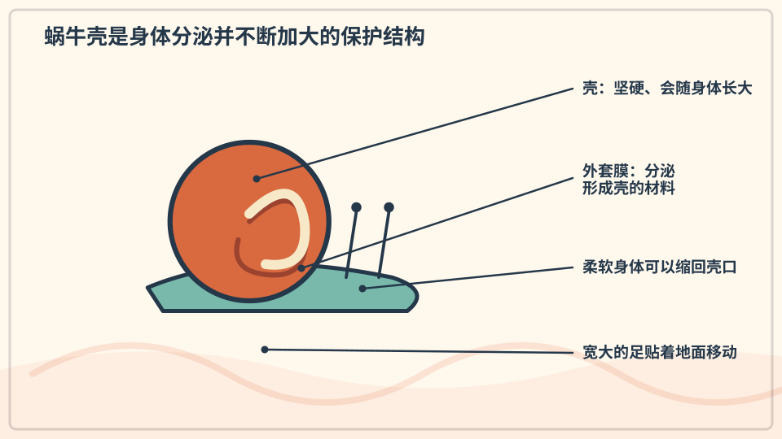
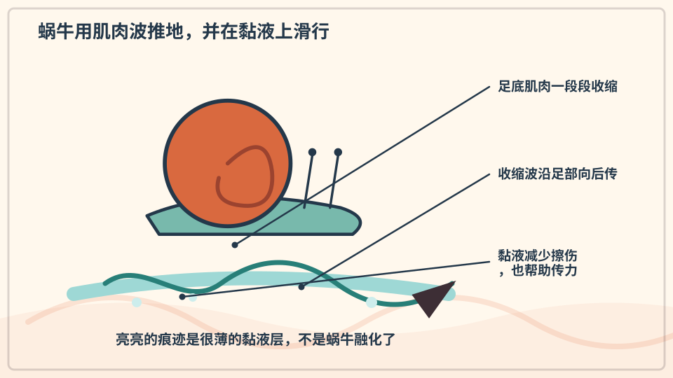
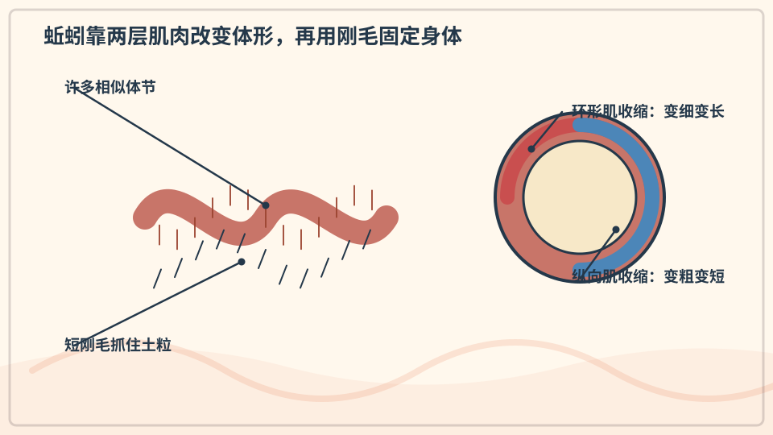
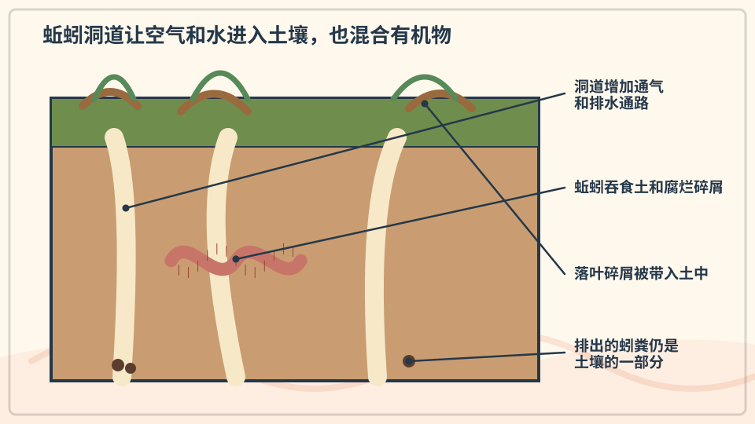
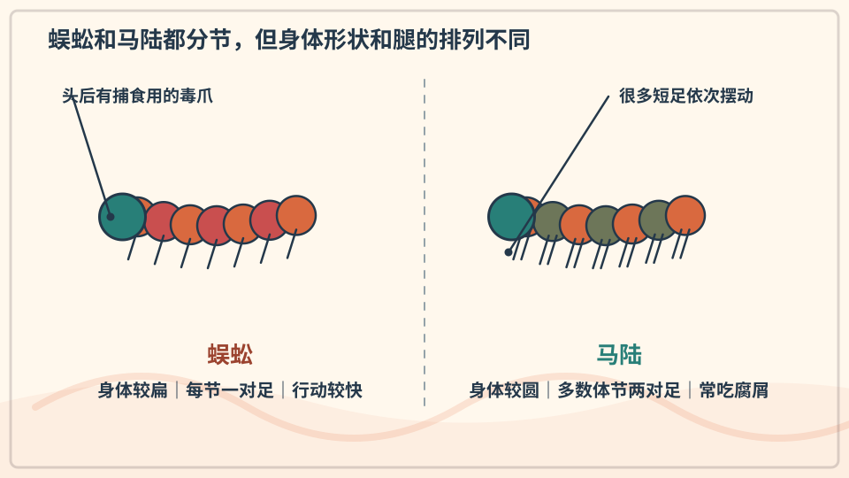
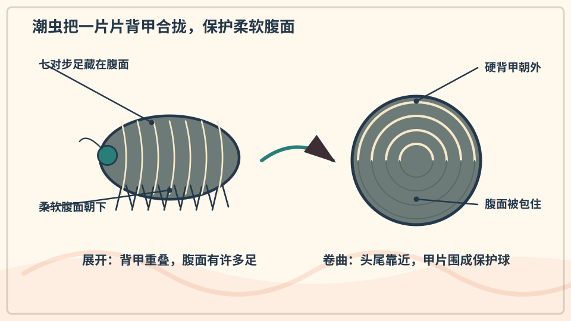
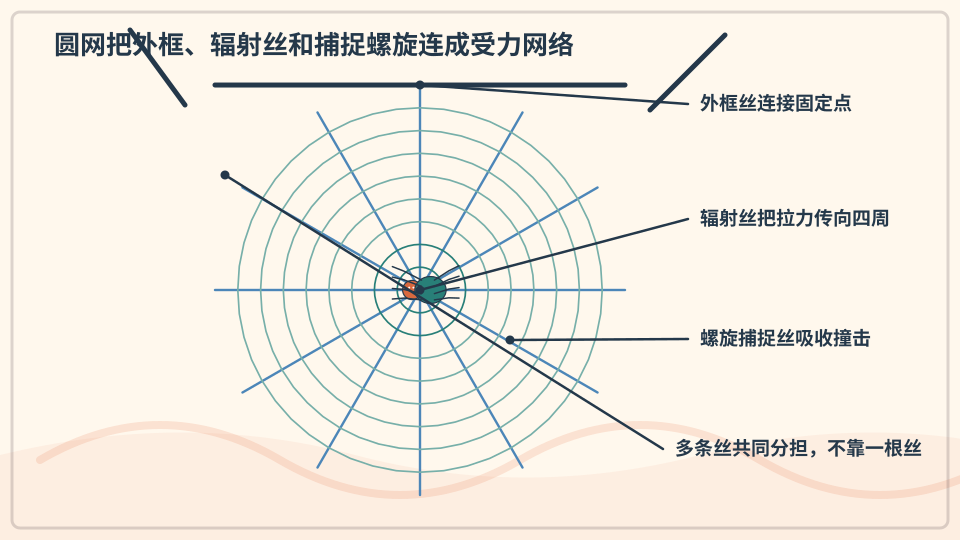
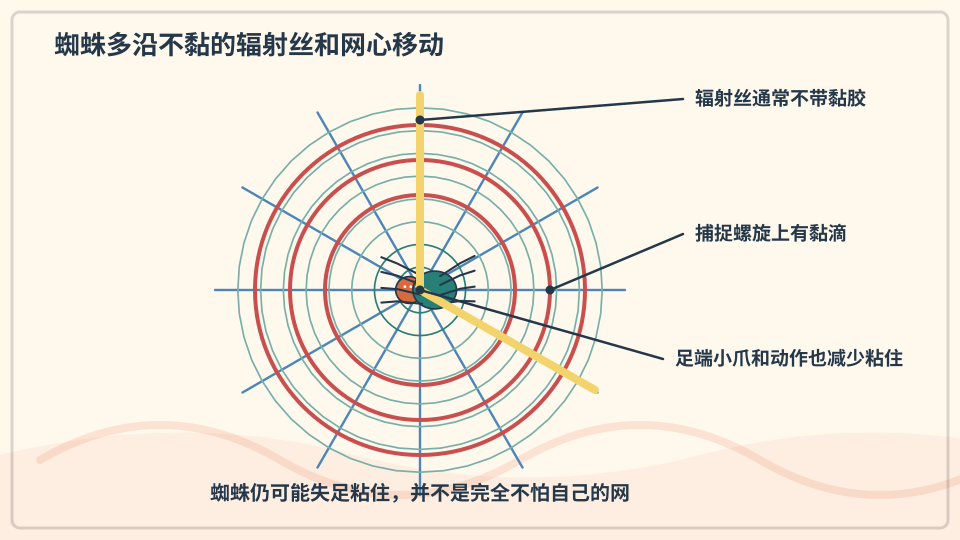
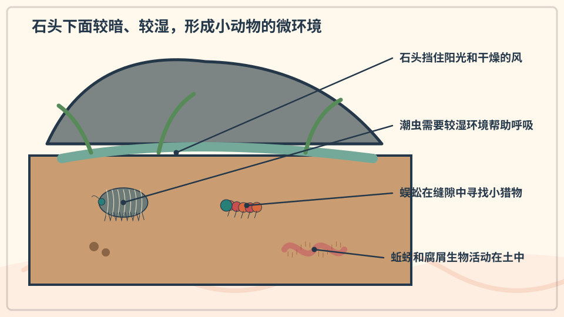

# 兴趣单元 12｜土壤小动物与蛛网

> **探索领域 04：** 昆虫与微型栖息地
>
> **核心问题：** 没有脊柱的小动物怎样靠壳、黏液、分节身体、肌肉和丝在潮湿角落生活？

蜗牛、蚯蚓、蜈蚣、马陆、潮虫和蜘蛛展示了多种支撑、移动、防护与感知方式。

## 怎样沿着本单元的追问链阅读

把动物的结构与光照、湿度、地面材料和取食方式一起观察。

## 追问链 12.1｜蜗牛、蚯蚓与多足小动物

黏液、肌肉波、刚毛、分节和卷曲防御与潮湿环境密切相关。

### 第 107 问｜蜗牛为什么背着壳？

蜗牛的壳是身体的一部分，会随着它一起长大。壳主要由碳酸钙等物质构成，能保护柔软身体，也帮助减少失水。蜗牛遇到危险会缩进去。

**再想一步：** 壳边缘会不断添加新材料，旧壳不会像衣服一样被脱掉。蜗牛需要从食物和环境获得钙，壳的纹路还会记录生长变化。

**把知识连起来：** 蜗牛壳由外套膜分泌材料逐渐长大，主要含碳酸钙和有机基质。螺旋形把不断增加的壳体紧凑地安排在身体周围，壳能防护并减缓失水。蜗牛需要从食物和环境取得造壳所需的矿物质。

**再往外看：** 壳的螺旋方向、厚度和花纹能用于研究遗传、环境与捕食压力；海螺和陆生蜗牛的壳也各有适应。

**容易弄混：** 蜗牛不是找到一间空房后搬进去，壳也不能像寄居蟹那样随意更换。壳与身体一起生长，严重损伤可能危及内部组织。

**一起看看：** 只看蜗牛在地上留下的路线，不敲壳也不撒盐。

---

### 第 108 问｜蜗牛为什么走过会亮亮的？

蜗牛的足会分泌黏液。黏液既能减少身体与粗糙地面的损伤，也能帮助足部波浪般的肌肉运动推着身体前进。干后留下的薄层会反光。

**再想一步：** 黏液同时表现出黏和滑的性质，在受力时会改变流动方式。蜗牛并非简单在“滑道”上滑行，而是肌肉波与黏液共同作用。

**把知识连起来：** 蜗牛足底分泌的黏液能润滑、保护柔软组织，并在受力时表现出适合传递推力的流变性质。足部肌肉波沿身体移动，黏液让蜗牛既能附着表面又能缓慢前进。亮亮的痕迹是薄黏液层干燥和反光的结果。

**再往外看：** 研究蜗牛黏液有助于理解可逆黏附和软体机器人材料，但天然黏液成分会随物种和用途变化。

**容易弄混：** 蜗牛不是靠黏液像轮子一样滑走，也不能因为痕迹发亮就说里面有油。真正推力来自肌肉与表面相互作用。

**一起看看：** 斜着看蜗牛经过的地方，找找反光的细线。

---

### 第 109 问｜蚯蚓没有腿怎么钻土？

蚯蚓让身体一段变长、一段变短，肌肉波向前传。身体上的细小刚毛能抓住土壤，防止整条身体向后滑。这样它就能在缝隙中前进。

**再想一步：** 环形肌收缩会让身体变细变长，纵向肌收缩会让它变短变粗。蚯蚓通过湿润皮肤交换气体，所以干燥和暴晒会伤害它。

**把知识连起来：** 蚯蚓的环形肌收缩会让一段身体变细变长，纵向肌收缩会让它变粗变短；细小刚毛暂时抓住土粒，收缩波便把身体向前推。体腔液体提供内部支撑，形成一种静水骨骼。分节让各段能依次协调。

**再往外看：** 软体机器人常模仿这种蠕动，在狭窄管道或松散材料中前进。土壤湿度会影响蚯蚓表面摩擦和呼吸。

**容易弄混：** 没有腿不等于没有运动结构，蚯蚓也不是把土“吞进去再喷出”才前进。肌肉、刚毛和体腔压力才是主要运动系统。

**一起看看：** 雨后从旁边观察蚯蚓，别把它长时间拿离湿土。

---

### 第 110 问｜蚯蚓能让土变好吗？

许多蚯蚓吃下混有腐烂植物的土，再排出细碎物质。它们打出的通道能让空气和水较容易进入土中。不同地方的蚯蚓作用不同，也不是越多越好。

**再想一步：** 土壤结构由矿物颗粒、有机物、水、空气和生物共同形成。某些外来蚯蚓进入原本没有它们的森林，反而会过快改变落叶层和生态关系。

**把知识连起来：** 蚯蚓取食含有机物的土和残体，排出的团粒会改变局部结构；钻洞还能形成空气和水进入的通道，并把不同土层材料混合。效果取决于蚯蚓种类、数量、土壤和生态系统。它们是土壤网络的一部分，不是单独工作的园丁。

**再往外看：** 在一些原本缺少本地蚯蚓的森林，外来蚯蚓反而会快速消耗落叶层并改变生态。作用好坏必须放回具体地点判断。

**容易弄混：** 蚯蚓并不会把任何土都自动变成肥沃黑土，也不是越多越好。土壤健康还依赖植物根、微生物、矿物组成、水和有机物。

**一起看看：** 观察花盆土的颗粒和缝隙，不随意搬运野外蚯蚓。

---

### 第 111 问｜蜈蚣和马陆哪里不一样？

蜈蚣身体较扁，多数体节每节一对腿，跑得较快，常捕食小动物。马陆身体多较圆，许多体节看起来有两对腿，主要吃腐烂植物。它们都不是昆虫。

**再想一步：** 蜈蚣的第一对附肢变成有毒的颚足，用来制服猎物；马陆遇险常蜷起并释放防御物质。只凭腿“很多”还不足以把它们分成同一种动物。

**把知识连起来：** 蜈蚣每个多数体节通常有一对足，身体较扁，第一对附肢改成毒爪，多为捕食者；马陆多数体节外观看似有两对足，身体常较圆，主要取食腐败植物并能卷曲防御。足数和体节会随年龄与物种不同。比较整体结构比死背数字可靠。

**再往外看：** 两者都属于多足类，研究它们能理解体节重复和附肢演化。森林落叶层中的活动还参与分解食物网。

**容易弄混：** “百足”和“千足”的名字不是精确计数，蜈蚣也未必正好一百条腿。不要徒手抓取，多足动物的防御分泌物或咬伤可能造成不适。

**一起记住：** 只观察，不徒手触碰蜈蚣或马陆。

---

### 第 112 问｜潮虫为什么喜欢缩成球？

一些潮虫遇到碰撞或干燥时会卷成球，把柔软腹面藏起来。它们喜欢潮湿阴暗处，因为身体容易失水。并不是所有潮虫种类都能卷成完整的球。

**再想一步：** 潮虫是生活在陆地上的甲壳动物，和虾蟹有较远亲缘，不是昆虫。它们的呼吸结构仍需要较湿环境，这保留了水生祖先的一些特点。

**把知识连起来：** 潮虫是适应陆地生活的甲壳动物，鳃状呼吸结构需要保持湿润。遇到干燥、震动或触碰时，一些种类会卷成球，减少柔软腹面的暴露并减慢水分散失。坚硬背板像可活动的盔甲片。

**再往外看：** 潮虫帮助分解落叶并回收养分，也常用于研究动物怎样选择湿度合适的微环境。

**容易弄混：** 潮虫不是昆虫，也不是所有潮虫都能卷成完全球。喜欢湿处不表示能长期泡在水里，它们的陆地适应有明确范围。

**一起看看：** 轻轻抬起一片落叶观察，随后原样放回，不碰动物。

## 追问链 12.2｜蛛丝、黏性与石下栖息地

不同蛛丝承担不同任务，石下微环境则为许多小动物减缓水分流失。

### 第 113 问｜蜘蛛网为什么又轻又结实？

蜘蛛从腹部的纺器放出蛛丝蛋白。不同腺体制造不同用途的丝，有的支撑，有的黏住猎物，有的包卵。蛛丝很细，却能承受相当大的拉力。

**再想一步：** “结实”要看材料在多大截面上承受多少力，还要看它能拉长多少。蛛丝把强度和韧性结合起来，但不同种蜘蛛和不同种丝性能并不相同。

**把知识连起来：** 圆网中的辐射丝把拉力送向锚点，螺旋捕捉丝能拉伸并吸收飞虫撞击的能量；不同蛛丝蛋白提供强度、延展性或黏性。网的几何形状让少量材料覆盖较大空间。受损后蜘蛛还会修补或重建。

**再往外看：** 材料科学家研究蛛丝的分子排列，希望设计轻而韧的纤维；生态学家则从网的位置推测捕食策略。

**容易弄混：** 蛛网不是所有位置都同样黏，也不是一根丝同时做到最硬和最能拉。不同丝承担不同任务，整体结构才表现得又轻又结实。

**一起看看：** 清晨从侧面看露水照亮的空网，不撕扯蛛丝。

---

### 第 114 问｜蜘蛛自己为什么不总被网粘住？

圆网里并不是每根丝都黏。蜘蛛常踩在较干的支撑丝上，脚部结构和小心的步法也减少接触黏滴。不过蜘蛛仍可能被自己的黏丝粘到。

**再想一步：** 黏捕丝上是一串有弹性的胶滴，猎物挣扎会让更多身体碰到胶滴。蜘蛛能感受蛛丝振动，由振动位置和节奏判断网上发生了什么。

**把知识连起来：** 许多结网蜘蛛会踩在较少黏性的辐射丝上，足端细毛减少接触面积，动作也尽量避免把身体压上捕捉丝。足表面物质可能进一步降低黏附。它们仍可能失足或被自己的网缠住，并非对黏胶完全免疫。

**再往外看：** 比较蜘蛛足、昆虫足和不同胶黏表面，可以研究微结构怎样控制摩擦与黏附。

**容易弄混：** 蜘蛛不是在脚上涂一层万能防胶油，也不是因为记住每根丝位置才从不被粘。结构、路径选择和谨慎动作共同降低风险。

**一起看看：** 观察网的中心、放射线和一圈圈螺旋线有什么不同。

---

### 第 115 问｜石头下面为什么住着小动物？

石头下面通常较暗、较凉，也不容易被风吹干。潮虫、蜗牛、虫卵和许多微小生物能在那里躲避阳光与捕食者。这个小范围生活环境叫微生境。

**再想一步：** 温度、湿度、光线和食物在几厘米内就可能不同。翻动石头会突然改变微生境，所以观察后要轻轻放回原位。

**把知识连起来：** 石头下面遮光、挡风，温度变化较慢，水分也不容易迅速蒸发。这样的微环境适合需要保持湿润或躲避捕食者的小动物，也会聚集真菌、根和腐殖物。石头相当于改变了几厘米范围内的气候。

**再往外看：** 生态学家会测量石上石下的温湿度并记录物种，但观察后要把石头轻放回原位，以减少破坏住所。

**容易弄混：** 小动物不是因为喜欢“脏”才躲石下，阴暗也不等于没有生命。真正重要的是湿度、温度、食物与安全等条件组合。

**一起看看：** 只由大人翻一块小石头，看完立刻原样放回。

## 单元综合观察｜画一张微型栖息地地图

从远处观察花盆边、树皮或石旁一小块区域，记录亮暗、干湿和动物位置。不要掀动野生动物住所，也不要用手触碰蜘蛛或不认识的小动物。
