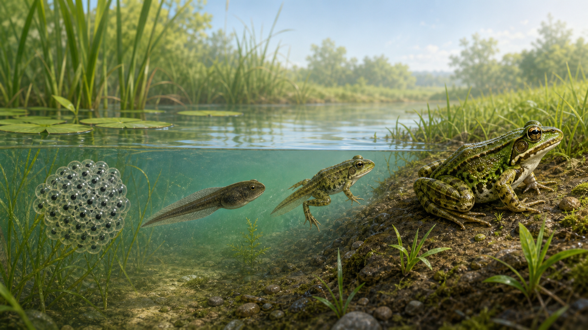
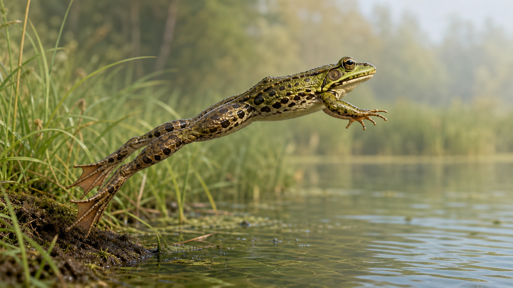
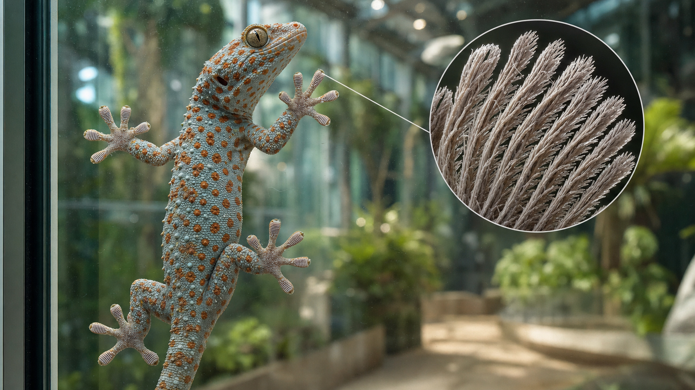
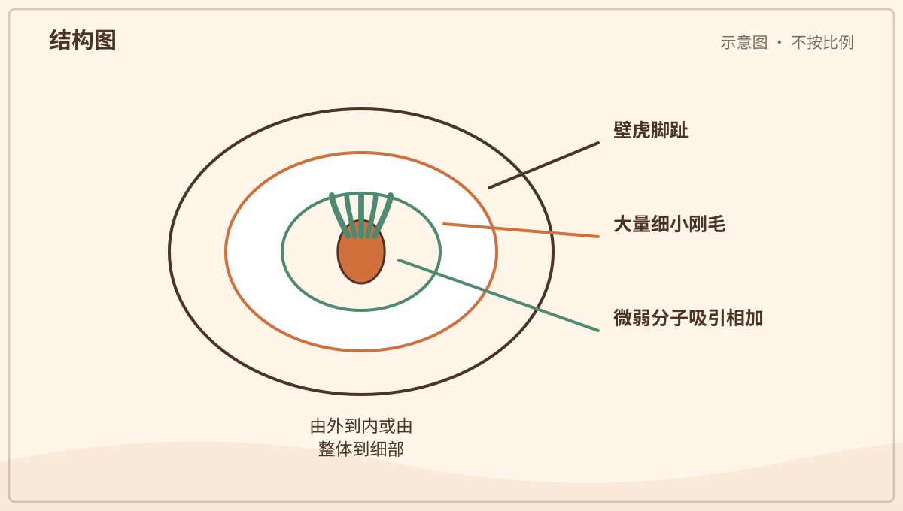
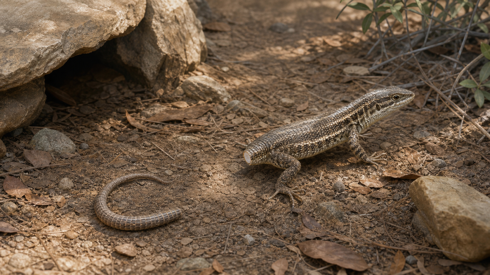
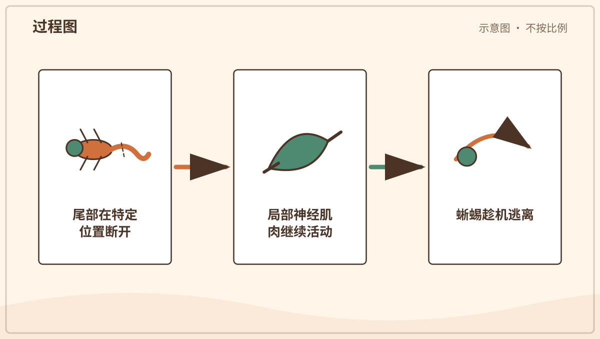
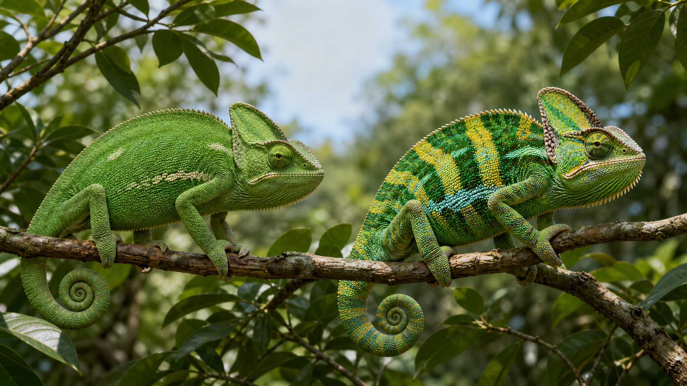
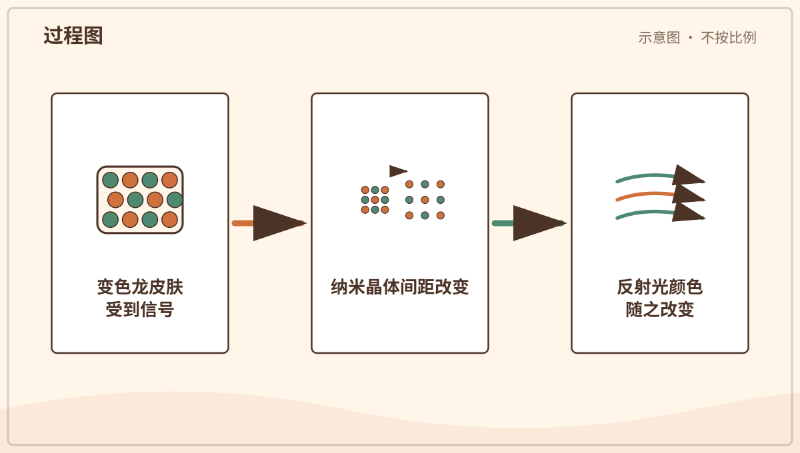

# 兴趣单元 13｜青蛙、壁虎与蜥蜴

> **探索领域 04：** 昆虫与微型栖息地
>
> **核心问题：** 两栖和爬行动物怎样利用生命周期、肌肉、脚趾、尾巴和皮肤适应环境？

青蛙把水中幼体与陆地成体连起来，壁虎和蜥蜴则展示附着、逃生和颜色变化的多层机制。

## 怎样沿着本单元的追问链阅读

不要把“会变色”或“尾巴会动”解释成魔法，沿皮肤结构、神经肌肉和行为功能追问。

## 追问链 13.1｜青蛙的变态与跳跃

变态会重建呼吸和运动结构，强壮后腿把肌肉力量转换成跳跃。

### 第 116 问｜青蛙怎样从水里来到岸上？

许多青蛙从水中的卵孵出蝌蚪。蝌蚪长出后腿和前腿，尾巴缩短，呼吸和消化系统也改变，成为小青蛙。这个变化也叫变态。

**再想一步：** 蝌蚪多用鳃呼吸，成年蛙主要用肺和湿润皮肤交换气体，但种类之间差异很大。甲状腺激素参与控制这场全身改变。

**把知识连起来：** 蝌蚪早期多用鳃呼吸并以尾部游泳，发育中长出四肢、重建口和消化系统，肺与皮肤呼吸的重要性增加，尾部组织则被逐渐吸收。甲状腺激素等信号协调这些变化。变态让同一动物利用水中与岸上不同资源。

**再往外看：** 不同蛙类的卵、蝌蚪和育幼方式差别很大，有些生命周期甚至不经过自由游动蝌蚪。水温和污染会影响发育速度与存活。

**容易弄混：** 青蛙不是蝌蚪把尾巴弄丢后简单长出腿，内部器官也在重建；蝌蚪和成蛙更不是两种不同动物。

**一起看看：** 在自然水边只与大人远看，不捞卵和蝌蚪回家。

---

### 第 117 问｜青蛙为什么能跳得高？

青蛙的后腿长而有力，骨盆和脊柱也适合把力量传给身体。蹬地时，肌肉和肌腱迅速释放能量，让身体向前上方飞出。前腿帮助落地缓冲。

**再想一步：** 跳跃距离不只由腿长决定，还与肌肉力量、起跳角度、身体质量和空气阻力有关。水栖、树栖与地栖蛙的腿和脚也有不同适应。

**把知识连起来：** 青蛙长而有力的后肢在起跳时快速伸直，把地面向后下方推，地面反作用力使身体向前上方运动。骨盆、脊柱和肌腱传递并储放部分能量，前肢在落地时帮助缓冲。跳跃是一整套身体协调。

**再往外看：** 树蛙、牛蛙和蟾蜍的腿长、足垫和跳跃方式不同，反映水域、地面或树冠生活的差异。

**容易弄混：** 能跳高不只是因为腿“弹簧一样”，也不是脚一离地就不再受重力。肌肉先做功，离地后的轨迹再由速度、角度、空气阻力和重力决定。

**一起模仿：** 在不滑的空地轻轻蹲跳一次，由大人看护。

## 追问链 13.2｜附着、断尾与变色

微细脚毛、预设断裂区和皮肤光学结构分别解决不同问题。

### 第 118 问｜壁虎为什么能爬墙？

许多壁虎脚趾下有大量细毛，细毛末端还分得更细。它们与墙面靠得非常近时，会产生许多微弱吸引力，合起来就能支撑身体。不是靠胶水或吸盘。

**再想一步：** 这种分子之间的微弱吸引常称范德华力。壁虎改变脚趾角度就能快速贴上或脱开，粗糙程度和灰尘也会影响抓附效果。

**把知识连起来：** 壁虎脚趾垫上有大量微细刚毛，刚毛末端继续分叉，能贴近墙面微小起伏。无数近距离分子作用累加后产生足够附着力；改变脚趾角度又能迅速脱离。柔软脚垫让接触分布更均匀。

**再往外看：** 这种干式黏附启发可重复使用的机器人脚和抓取材料，但人工表面要处理灰尘、湿度和耐久问题。

**容易弄混：** 壁虎脚不是吸盘，也不会分泌普通胶水把自己永久粘住。附着需要很近的接触，粗糙、潮湿或肮脏表面会改变效果。

*图解：脚趾上的刚毛继续分叉成极细末端，增大与墙面的近距离接触。*

**一起看看：** 从远处看壁虎脚趾是否张开，不抓尾巴。

---

### 第 119 问｜蜥蜴断尾后为什么还能动？

一些蜥蜴遇到攻击时能在尾巴特定位置断开。脱落的尾巴会因神经和肌肉活动继续扭动，吸引捕食者注意，让蜥蜴逃跑。这叫自割。

**再想一步：** 断尾不是没有代价，蜥蜴会失去储存的能量和部分运动、求偶能力。再生的尾巴内部结构常与原来的不同，也不是所有蜥蜴都会这样做。

**把知识连起来：** 一些蜥蜴尾椎或组织有预设薄弱区，受到强烈拉扯和神经信号后能在特定位置断开，血管与肌肉迅速收缩以减少失血。断尾仍短时扭动，可吸引捕食者注意，蜥蜴趁机逃走。再生尾通常与原尾结构不同。

**再往外看：** 断尾需要消耗储存的脂肪和再生资源，也可能影响平衡、社交或繁殖，因此是有代价的防御。

**容易弄混：** 蜥蜴不会随意把尾巴当玩具丢掉，也不是每种都能断尾或完整长回。不要抓尾验证，这会给动物造成真实伤害。

*图解：尾巴从预设薄弱处断开后，局部神经和肌肉仍能短时活动，吸引捕食者。*

**一起记住：** 绝不抓蜥蜴尾巴，只安静观察。

---

### 第 120 问｜变色龙变色只为躲起来吗？

不只为伪装。变色龙会因交流、情绪、光线和温度改变颜色。皮肤里的特殊细胞和微小晶体改变光的反射方式，颜色便发生变化。

**再想一步：** 一些变色龙通过调整纳米晶体间距，让不同波长的光被加强反射。身体本来的色素、皮肤层和环境光共同决定最终看到的颜色。

**把知识连起来：** 变色龙皮肤中有含色素的细胞和能反射光的纳米晶体层。神经与激素信号改变色素分布或晶体间距，反射的波长便发生变化。颜色可参与交流、体温调节和伪装，具体作用取决于物种与情境。

**再往外看：** 研究结构色有助于制造可调颜色材料；其他蜥蜴、章鱼和鱼也用不同细胞机制快速改色。

**容易弄混：** 变色龙不能随意变成背景中的任何图案，也不只为躲藏才变色。情绪是拟人化说法，更准确的是身体状态与外界信号触发生理变化。

*图解：皮肤中色素与纳米晶体共同改变反射光；晶体间距不同会加强不同波长。*

**一起看看：** 比较同一种变色龙在安静和警戒照片中的颜色与姿势。

## 单元综合观察｜比较三种运动办法

用慢动作视频或照片比较青蛙跳、壁虎爬和蜥蜴跑。只描述可见动作与接触面，不抓取野生动物来验证。
