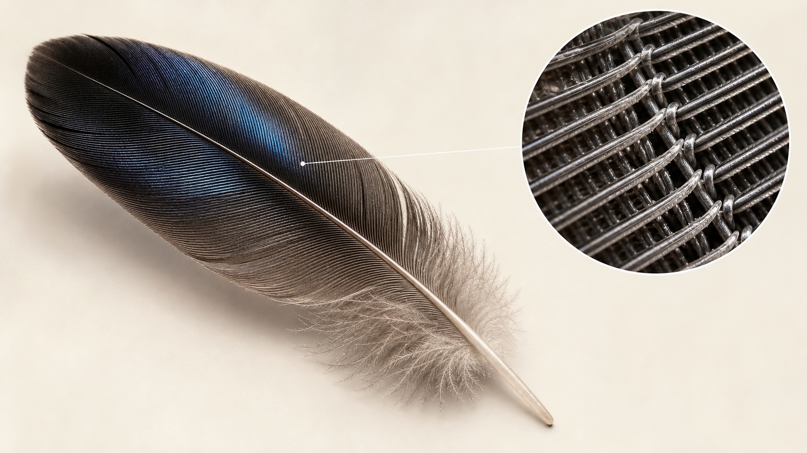
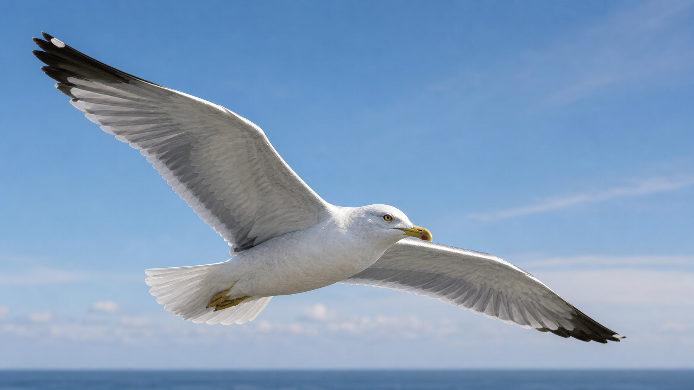
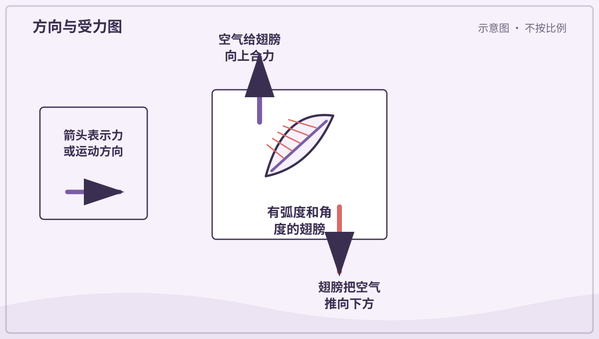
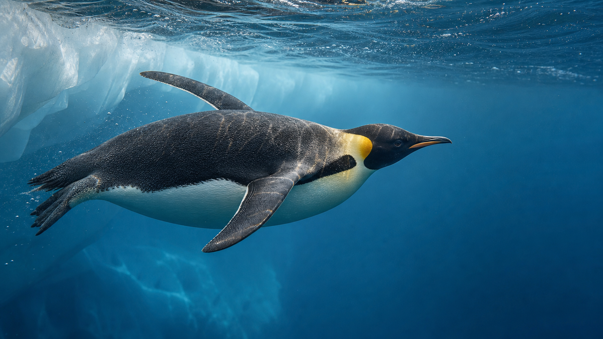
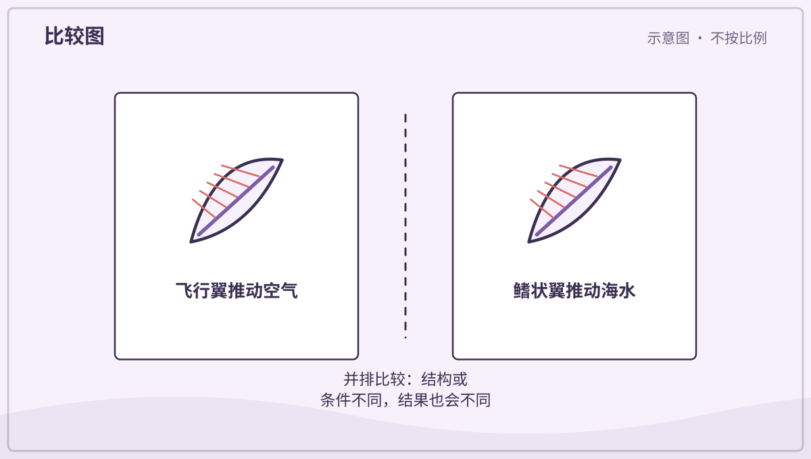
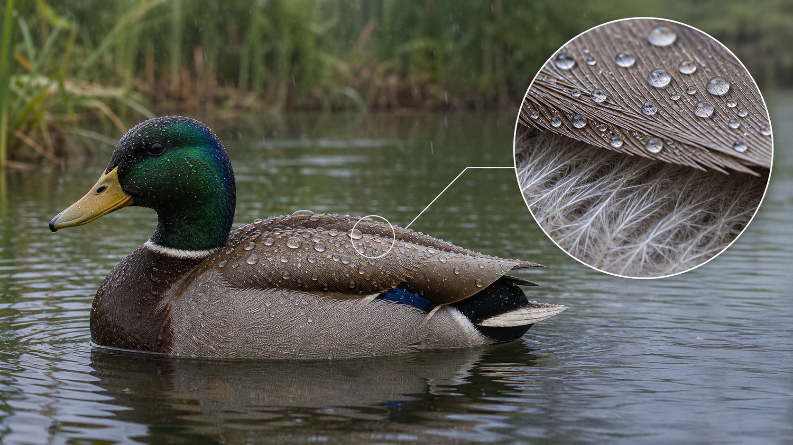
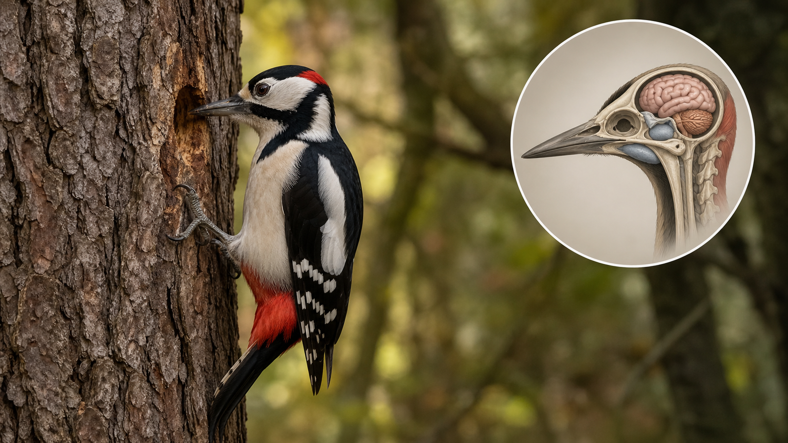
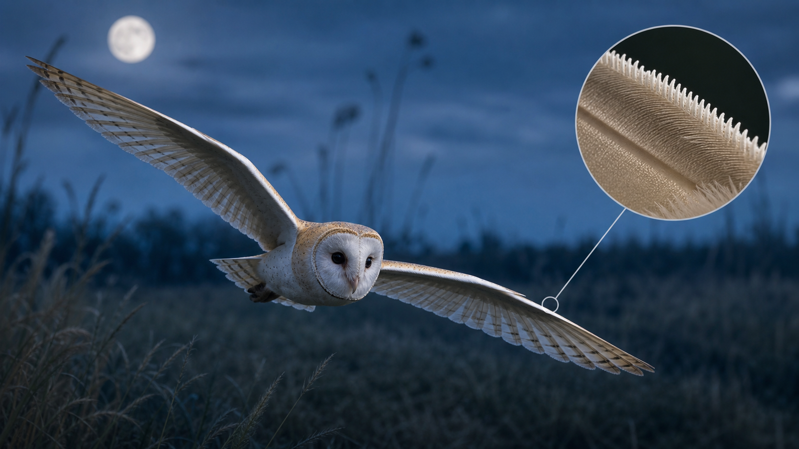
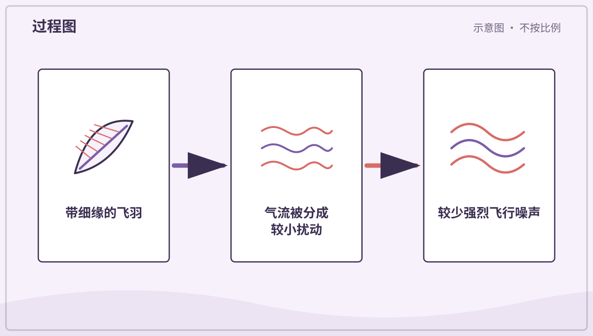
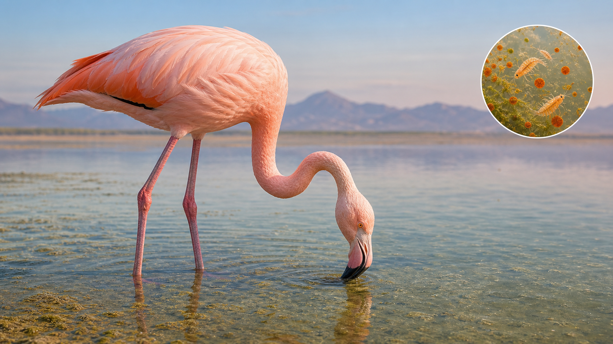

# 兴趣单元 14｜鸟类、羽毛与飞行

> **探索领域 05：** 脊椎动物的身体办法
>
> **核心问题：** 羽毛和翼怎样同时参与飞行、保温、防水、静音与颜色形成？

从羽毛共同结构出发，比较会飞的鸟、游泳的企鹅、鸭、啄木鸟、猫头鹰和火烈鸟。

## 怎样沿着本单元的追问链阅读

先找鸟类共有特征，再解释同一基本结构怎样因生活方式不同而发生改变。

## 追问链 14.1｜羽毛、飞行、企鹅与防水

羽片结构既能形成翼面也能留住空气；企鹅的翼则适合在水中推进。

### 第 121 问｜鸟身上的羽毛有什么用？

羽毛能帮助许多鸟飞行，也能保暖、防水、伪装和传递信号。外层飞羽较硬，绒羽蓬松柔软。鸟会整理羽毛，让羽枝重新扣在一起。

**再想一步：** 羽毛由角蛋白构成，中央羽轴分出羽枝，羽枝上还有更小的结构。许多小钩互相扣合，形成轻而连续的表面；受损时鸟喙能像拉拉链一样整理它。

**把知识连起来：** 羽毛由角蛋白构成，羽轴两侧的羽枝和小钩能扣成连续羽片；不同位置的飞羽、绒羽和体羽又有不同形状。连续翼面推动空气，绒羽间空气减慢散热，外层羽还能挡水、遮阳或显示颜色。同一种基本材料因此参与运动、保温、防护和交流。

**再往外看：** 羽毛会磨损并定期更换，换羽时间要与飞行、繁殖和季节协调。化石羽毛还帮助科学家研究鸟类与非鸟恐龙的演化联系。

**容易弄混：** 羽毛不只为飞行，能飞也不是有羽毛的必要结果。企鹅、鸵鸟和刚孵化幼鸟都说明羽毛功能比“翅膀上的东西”更广。

*图解：羽轴两侧长出羽枝，羽枝上的小钩互相扣住，组成轻而连续的羽片。*

**一起看看：** 只观察地上自然掉落的羽毛，不捡病鸟附近的羽毛。

---

### 第 122 问｜鸟为什么能飞起来？

鸟扇动翅膀，把空气向下、向后推动，空气也给鸟向上、向前的力。翼的形状和角度会让气流改变，产生升力。轻巧骨骼、强壮胸肌和羽毛共同帮助飞行。

**再想一步：** 飞行要同时平衡重力、升力、阻力和推力。鸟可以改变翼面弯曲、迎风角和羽毛间隙，所以起飞、滑翔、转弯与降落的受力并不相同。

**把知识连起来：** 鸟翼拍动并以合适迎角穿过空气，改变周围气流的速度和方向；空气对翼产生包含向上和向前分量的合力。胸肌提供机械功，尾羽和翼形不断调节稳定与转向。飞行还必须同时平衡重量、阻力和能量消耗。

**再往外看：** 滑翔鸟利用上升气流减少拍翼，蜂鸟则用特殊翼迹悬停。风洞、压力测量和高速摄影能把看不见的空气作用变成证据。

**容易弄混：** 鸟并不是只靠翅膀上方空气走得快就被吸上天，也不只是把空气向下扇这么简单。压力分布、气流偏转和非稳定涡旋是同一相互作用的不同描述。

*图解：鸟翼改变周围空气的速度和方向，空气对翅膀产生向上的合力。*

**一起看看：** 观察鸟起飞和降落时，翅膀与尾羽怎样改变。

---

### 第 123 问｜企鹅也是鸟，为什么不飞上天？

*写实观察图：企鹅保留鸟类的羽毛和翼，但翼已经成为适合划水的鳍状肢。*

企鹅有羽毛、喙，也会产卵，所以是鸟。它们的翅膀演化成坚硬的鳍状肢，适合在水中“飞”，却不能提供空中飞行需要的动作和翼面。密实骨骼还帮助潜水。

**再想一步：** 演化常有取舍：更适合水下推进的短硬翅，不再适合空中拍动。水比空气密得多，企鹅用流线身体和强壮胸肌克服水的阻力。

**把知识连起来：** 企鹅保留鸟类的羽毛、喙和产卵方式，但前肢变得短而扁硬，像水下机翼一样推动密度较大的海水。流线形身体和后置双足帮助转向，致密羽毛与皮下脂肪减少热量散失。不会在空气中飞，是交换成高效游泳后的结果。

**再往外看：** 不同企鹅从温带海岸到南极海冰都有分布，并非全部生活在极寒地区。研究潜水记录能看到它们怎样调节心率和氧气使用。

**容易弄混：** 企鹅不是翅膀退化到毫无用处，也不是因为身体太胖才飞不起来。鳍状翼具有明确水下功能，身体比例是长期水生适应的一部分。

*图解：普通鸟翼适合推动空气；企鹅较扁硬的鳍状翼适合推动密度更大的水。*

**一起看看：** 比较企鹅游泳和鸟飞行的录像，动作哪里相像？

---

### 第 124 问｜鸭子为什么不容易湿透？

鸭子的外层羽毛排列紧密，会挡住许多水。它还用喙把尾部腺体的油脂整理到羽毛上。羽毛间留住的空气既保温，也帮助身体浮起。

**再想一步：** 防水不是单靠“抹油”，羽毛微观结构、清洁整理和空气层都重要。贴近皮肤的绒羽若保持干燥，就能减慢水带走体热。

**把知识连起来：** 鸭用喙梳理羽毛，使羽枝重新扣合，并把尾部腺体附近的油脂带到羽面。整齐外层羽与油脂共同减少水进入，下面绒羽留住空气，帮助保温。水珠在疏水表面容易聚成圆滴并滚落。

**再往外看：** 水禽羽毛受到清洁剂或石油污染后，微结构和防水性会被破坏，说明材料排列与表面化学同样重要。

**容易弄混：** 鸭子不是完全不会湿，油脂也不是唯一防水原因。长时间潜水、羽毛损伤或污染都可能让水进入更深层。

*图解：鸭羽互相扣合并带有油脂，水难以深入贴近皮肤，常在表面形成水珠。*

**一起看看：** 远看鸭子洗澡后怎样反复用喙梳理羽毛。

## 追问链 14.2｜啄击、静音与羽色

头颈受力、飞羽边缘和食物色素分别解释三种特殊现象。

### 第 125 问｜啄木鸟不停啄树，头不晕吗？

啄木鸟的喙、颈部肌肉和头骨能把啄击力量沿合适方向传递。它每次啄击时间很短，头和喙又保持较直。许多身体结构共同降低受伤风险。

**再想一步：** 不能简单说啄木鸟有一块“海绵头骨”吸掉所有冲击。喙的形状、骨骼结构、舌骨装置、肌肉控制和较小脑体积都可能参与，科学家仍在研究细节。

**把知识连起来：** 啄击产生的作用力会沿喙、头骨、舌骨、颈肌和身体姿势传递。啄木鸟控制每次冲击的方向和持续时间，骨与软组织结构也帮助分散应力；它并不是简单拥有一块像头盔的海绵。取食、筑巢和鸣响还会使用不同啄击方式。

**再往外看：** 生物力学研究会测量高速运动和内部应变，但不能把单一结构夸成万能防震器。相关结果也不应直接套用到人类头部防护。

**容易弄混：** “头不晕”不表示啄击没有风险或大脑完全不受力，也不是舌头绕头一圈当安全带。保护来自多种结构与受控动作共同作用。

*图解：啄击产生的力沿喙、头骨、颈部和身体传递；适应结构和动作共同减小风险。*

**一起听听：** 在安全处听啄木鸟的敲击有没有重复节奏。

---

### 第 126 问｜猫头鹰飞行为什么很安静？

许多猫头鹰飞羽前缘像小梳子，表面又柔软蓬松。它们能把大的空气旋涡分散，减弱拍翼产生的某些声音。安静飞行让猎物较晚发现它。

**再想一步：** 降噪结构也可能牺牲一部分高速飞行效率，所以猫头鹰的翼通常较宽，适合较慢飞行。并不是所有猫头鹰在任何速度下都完全无声。

**把知识连起来：** 猫头鹰飞羽前缘、后缘和表面的微细结构会把较大的气流扰动分散成更小尺度，并降低某些频率的噪声。宽翼允许较低速度飞行，也减少强烈翼载声。安静接近有助于听见猎物并降低被发现概率。

**再往外看：** 并非所有猫头鹰同样安静，羽毛静音效果也受速度、湿度和磨损影响。工程师研究这些边缘结构来改进风机和风扇噪声。

**容易弄混：** 安静不等于完全无声，也不主要是因为猫头鹰轻轻忍住不拍翅。可测量差异来自羽毛形态、飞行速度和气流共同作用。

*图解：猫头鹰飞羽边缘的细小结构减弱较大的气流涡旋，使飞行声更分散。*

**一起看看：** 比较猫头鹰与海鸥翅膀边缘的清晰照片。

---

### 第 127 问｜火烈鸟为什么粉红粉红的？

火烈鸟从藻类和小动物的食物中得到类胡萝卜素。身体把这些色素处理后，沉积在羽毛、皮肤等地方，颜色就变粉红。幼鸟通常较灰。

**再想一步：** 羽色深浅受食物、健康、年龄和种类影响，动物园也会配制合适食物。火烈鸟不是喝了粉色水，也不是一出生就一定鲜艳。

**把知识连起来：** 火烈鸟从藻类和小型甲壳动物中取得类胡萝卜素，消化和代谢后把色素沉积在羽毛和皮肤中。幼鸟羽色较灰，食物与健康状态会影响成年颜色。羽毛本身仍由角蛋白组成，粉红来自其中的色素。

**再往外看：** 动物园需要按物种营养需求配制食物，缺少相应色素会使羽色变淡。类似饮食色素也影响鲑鱼和某些鸟类。

**容易弄混：** 火烈鸟不是喝粉红水染色，也不能把任何红色食物喂给它就得到相同颜色。色素能否吸收、转化和安全利用由生理决定。

**一起看看：** 在一群火烈鸟照片里找找颜色最浅和最深的个体。

## 单元综合观察｜按任务比较三种羽毛

用清楚照片比较飞羽、绒羽和企鹅体表羽毛，记录形状与排列，不采集野生鸟羽。讨论一种结构怎样同时承担飞行、保温或防水中的不同任务。
