# 兴趣单元 15｜哺乳动物的感觉与生存

> **探索领域 05：** 脊椎动物的身体办法
>
> **核心问题：** 哺乳动物怎样利用呼吸、回声、鼻子、毛发、储能和行为解决不同环境中的问题？

这个单元从哺乳动物共同特征进入鲸、海豚、蝙蝠和多种陆地动物，比较感知、取食、保温、育幼与休息。

## 怎样沿着本单元的追问链阅读

避免把某种动物排成更高级；先选择共同任务，再比较不同结构与环境。

## 追问链 15.1｜哺乳、呼吸与回声定位

鲸和海豚仍用肺呼吸，海豚与蝙蝠能利用回声取得空间信息。

### 第 128 问｜什么动物叫哺乳动物？

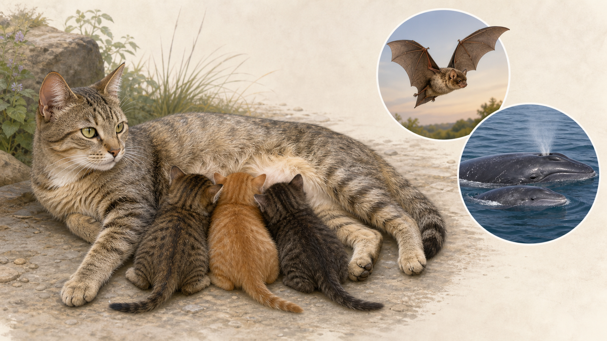

哺乳动物的妈妈能用乳汁喂养幼崽，身体在生命某阶段会有毛。大多数生下幼崽，也有鸭嘴兽等少数种类产卵。人、鲸、蝙蝠和猫都是哺乳动物。

**再想一步：** 分类依据共同祖先和一组身体特征，不只看住在哪里或会什么动作。鲸没有鱼鳃，蝙蝠不是鸟；它们仍保留哺乳动物的肺、乳腺和骨骼特点。

**把知识连起来：** 哺乳动物的共同祖先留下了毛发和乳腺等特征，多数种还会恒定调节较高体温并用三块中耳骨传声。鲸没有外露毛皮、鸭嘴兽会产卵，仍能依据整组同源结构归入哺乳类。分类重视演化亲缘，而不是一条表面规则。

**再往外看：** 从蝙蝠到鲸的基因、骨骼和胚胎证据能互相检验哺乳动物家谱。化石则记录颌骨逐渐参与中耳形成的历史。

**容易弄混：** 哺乳动物不等于都胎生、都住陆地或都满身可见毛。共同特征允许发生改变和例外，不能用宠物经验定义整个类群。

**一起说说：** 找三种外形很不一样的哺乳动物，说出共同点。

---

### 第 129 问｜鲸为什么要浮出水面？

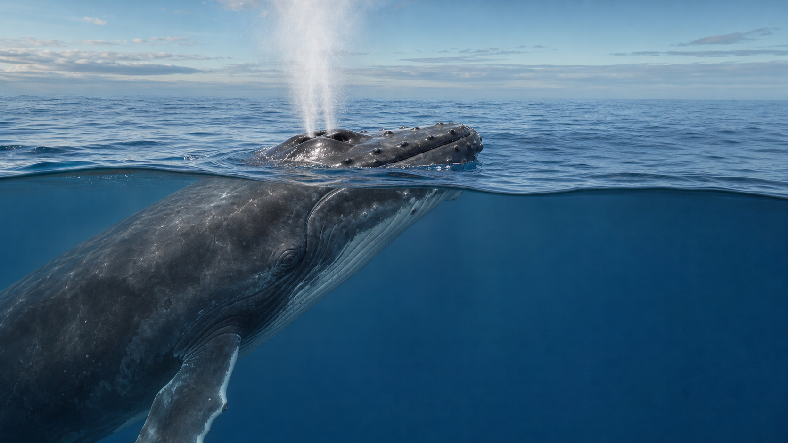

鲸是用肺呼吸的哺乳动物，不能从水里直接取得氧气。它们要浮到水面，从头顶的呼吸孔快速呼气、吸气，再潜回水下。喷气看起来白白的，是湿热空气和海水小滴。

**再想一步：** 潜水时鲸会减慢心率，把较多氧气留给大脑和心脏，肌肉中的肌红蛋白也能储氧。不同鲸的潜水时间和深度差别很大。

**把知识连起来：** 鲸由陆生哺乳动物祖先演化而来，仍用肺从空气取得氧气。鼻孔移到头顶形成呼吸孔，浮到水面时先快速呼出再吸入；潜水期间依靠血液和肌肉储存的氧，并调整心率和血流。呼吸是主动且有节律的行为。

**再往外看：** 不同鲸类潜水深度和时间差别巨大。卫星标签、声音记录和呼气样本能在减少干扰的情况下研究它们。

**容易弄混：** 鲸喷出的白柱主要是温暖湿气在冷空气中凝结并夹带海水，不是肺里把海水喷出。鲸也不能像鱼一样从水中用鳃取氧。

**一起看看：** 在录像里数鲸浮出水面后完成几次呼吸。

---

### 第 130 问｜海豚怎样在水下“看见”远处？

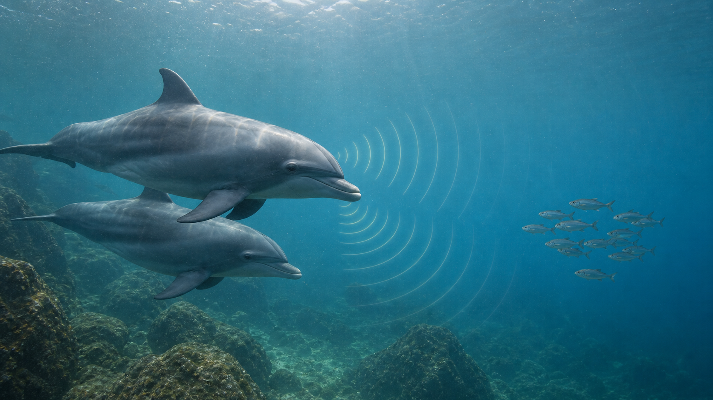

许多海豚发出很高的点击声，声音碰到物体后反射回来。它们分析回声到达的时间、强弱和变化，判断方向、距离和物体特点。这叫回声定位。

**再想一步：** 声音在水中传播得比空气中快，海豚头部的脂肪组织帮助聚焦声音，下颌附近组织接收回声。回声定位补充视觉，不表示海豚不用眼睛。

**把知识连起来：** 齿鲸从头部发出短促点击声，声音在水中传播并被目标反射；下颌附近组织接收回声，内耳和大脑比较到达时间、强弱与频谱。连续点击能随着目标靠近变密，让动物更新距离和形状信息。它是一种主动感知。

**再往外看：** 声呐原理也用于船舶测深和医学超声，但频率、功率和信号处理不同。海洋噪声可能干扰鲸类通信与定位。

**容易弄混：** 回声定位不是把水下画面像照片一样投进眼睛，也不表示海豚完全不用视觉。它提供声学信息，并与视觉、触觉和经验共同形成判断。

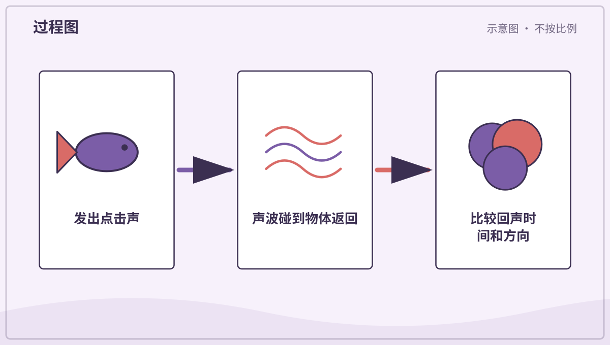

*图解：海豚发出短促声波，接收物体反射的回声，再由大脑判断方向和距离。*

**一起听听：** 在空房间拍一次手，听有没有迟到的小回声。

---

### 第 131 问｜蝙蝠真的看不见吗？

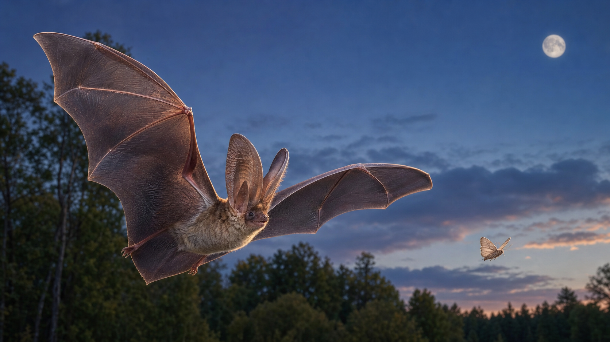

蝙蝠看得见，许多种类还会用回声定位。它们发出人耳常听不见的高频声，再听回声避开障碍、寻找食物。有些吃水果的蝙蝠更多依靠视觉和嗅觉。

**再想一步：** “蝙蝠都瞎”是错误说法。不同蝙蝠的感觉系统与食物、环境共同演化，回声定位频率和叫声形状也会随任务改变。

**把知识连起来：** 大多数蝙蝠有能工作的眼睛，视觉在微光、远距离和地标导航中都有作用；许多小型蝙蝠还用超声回声定位近处障碍和猎物。大脑把两类信息与嗅觉、记忆整合。不同物种依赖感官的比例不同。

**再往外看：** 大型果蝠多依靠视觉和嗅觉，一些不使用典型喉源回声定位。研究感官不能用一种蝙蝠代表全部一千多种。

**容易弄混：** “蝙蝠看不见”是错误说法，回声定位也不是视力损坏后的补偿。两套感官可以同时存在并在不同任务中分工。

**一起看看：** 黄昏只和大人远看天空，不靠近或触碰蝙蝠。

## 追问链 15.2｜大型动物的身体与环境

象鼻、长颈、条纹、驼峰、毛色和食性是多因素共同形成的适应。

### 第 132 问｜大象的鼻子为什么这么灵活？

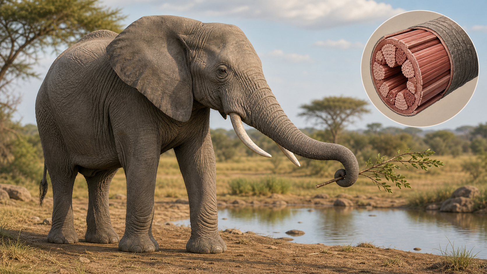

象鼻由上唇和鼻子延长形成，里面没有骨头，却有很多肌肉束。它能闻气味、呼吸、吸水再送入口中，也能抓取大小不同的东西。象鼻尖端还能做精细动作。

**再想一步：** 这种没有骨骼、靠肌肉保持形状的结构叫肌肉水压器，舌头和章鱼腕也有相似原理。不同方向肌肉收缩，让象鼻伸长、缩短、弯曲和扭转。

**把知识连起来：** 象鼻由上唇和鼻延长而来，没有骨头，却含有纵向、环向和斜向排列的大量肌束。不同肌束收缩能让它伸长、缩短、弯曲、扭转或变硬，像肌肉静水骨骼。鼻端的指状突起还能精细抓取，内部通道则负责嗅觉和吸水。

**再往外看：** 象鼻既能抬重物也能捡小物，启发了柔性机器人和连续体机械臂。研究时会分析动作，而不是只统计肌肉数量。

**容易弄混：** 象并不是把喝下的水直接储存在鼻子里，也不是鼻子像吸管一路通到胃。它先把水吸入鼻腔，再送入口中。

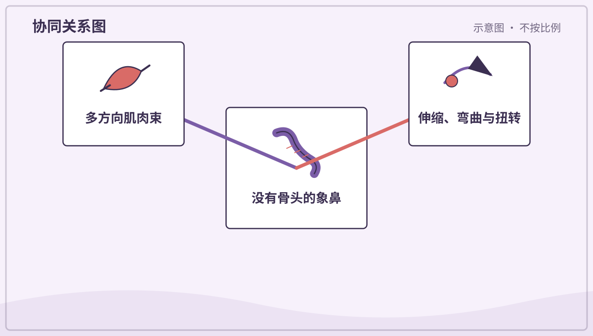

*图解：象鼻没有骨头，纵向、环向和斜向肌肉互相配合，便能伸缩、弯曲和扭转。*

**一起模仿：** 用手臂慢慢做伸、卷、夹三个动作，想象需要哪些方向的力。

---

### 第 133 问｜长颈鹿怎样低头喝水？

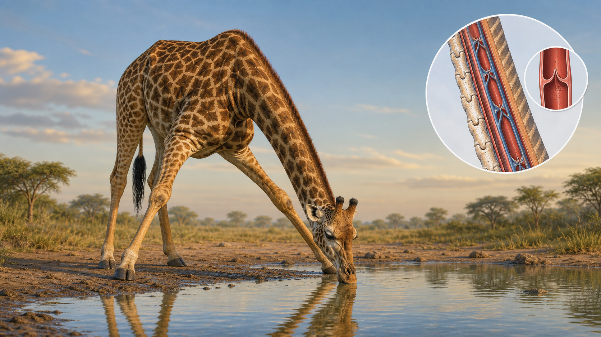

长颈鹿喝水时会把前腿分开或弯曲，让长脖子够到水面。它的心脏要产生较高压力，把血送到高高的大脑。低头时，血管和瓣膜帮助调节血流。

**再想一步：** 重力会让长柱液体产生压力差。长颈鹿的厚血管壁、颈静脉瓣和脑部附近血管网络共同避免血压变化过猛，不是一只特别大的心脏单独解决全部问题。

**把知识连起来：** 长颈鹿低头时会把前腿分开或弯曲，让嘴够到水面；心脏、弹性动脉、静脉瓣和局部调节共同控制长颈两端的血压。抬头时系统还要防止脑部血流突然不足。姿势和循环结构必须协调。

**再往外看：** 长颈同样影响取食高度、争斗和体温交换。研究血压适应有助于理解重力对循环系统的限制。

**容易弄混：** 长颈鹿不是脖子里多出很多颈椎；和多数哺乳动物一样通常有七块，只是每块更长。低头也不是靠一个特殊阀门就能解释全部。

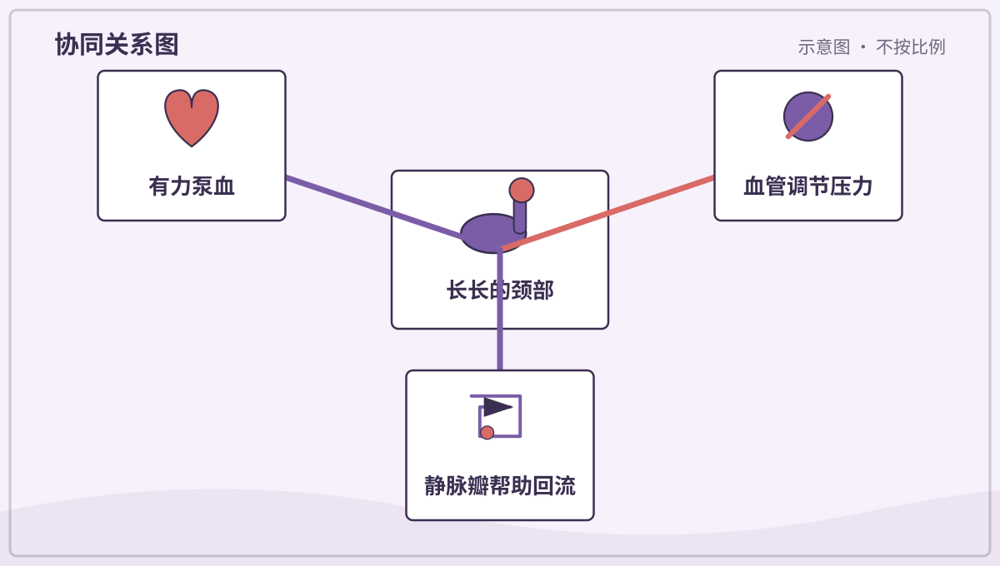

*图解：长颈鹿的心脏、弹性血管和调节结构共同维持抬头、低头时的血流。*

**一起看看：** 比较长颈鹿站立和喝水时四条腿的位置。

---

### 第 134 问｜斑马为什么有黑白条纹？

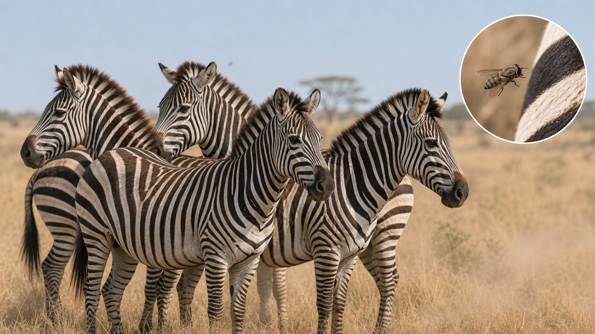

每只斑马的条纹都有些不同。研究发现，条纹能减少某些会叮咬的虻成功落在身上，也可能参与辨认、体温调节或视觉混淆。科学家仍在比较这些作用有多重要。

**再想一步：** 一个特征可以同时有多种效果，不能看起来像伪装就宣布只有一个答案。科学家会用野外观察、模型和实验分别检验不同解释。

**把知识连起来：** 斑马条纹会打散单个身体轮廓，并在群体移动时形成复杂视觉图案；实验还显示条纹表面能减少某些叮咬蝇准确降落。体温调节和社会识别等作用仍在研究，可能没有唯一答案。一个花纹可以同时受到多种选择压力。

**再往外看：** 科学家会给马穿不同花纹外套、记录昆虫接近与着陆，或比较不同地区条纹与环境因素。可检验实验比讲一个漂亮故事更可靠。

**容易弄混：** 条纹不是已经证明只为躲狮子，也不能简单说是黑底白纹或白底黑纹来解释功能。胚胎色素形成和生态作用是两个不同问题。

**一起看看：** 比较两只斑马照片，找找肩部条纹哪里不同。

---

### 第 135 问｜骆驼驼峰里装的是水吗？

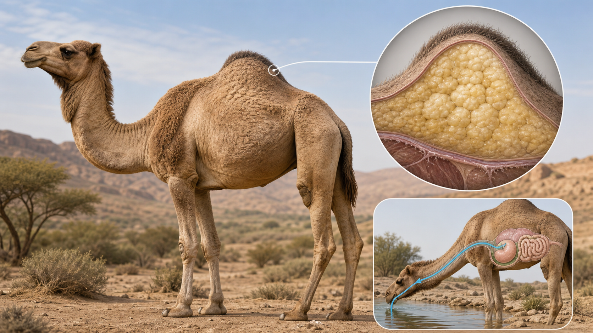

驼峰主要储存脂肪，不是一袋水。需要时，骆驼能分解脂肪得到能量，并产生一些代谢水。它的鼻腔、血液和身体调温方式也帮助减少失水。

**再想一步：** 把脂肪集中在背部，比让厚脂肪包满全身更利于散热。骆驼能忍受较大的体温变化、排出浓尿，但仍需要饮水，并不是永远不喝水。

**把知识连起来：** 驼峰主要储存脂肪，把能量集中在背部能减少身体其他部位厚脂肪层对散热的阻碍。缺少食物时脂肪可分解供能，并在代谢中产生一些水；骆驼更重要的耐旱能力还包括减少失水、忍受体温波动和快速补水。多种生理机制共同工作。

**再往外看：** 单峰驼与双峰驼生活环境不同，毛、体形和耐寒性也不同。研究血细胞、肾脏和鼻腔能看到水分管理的更多层次。

**容易弄混：** 驼峰不是装饮用水的水袋，变瘪也不表示水直接流光。脂肪代谢产生的水有限，骆驼仍需要在可得时饮水。

*图解：驼峰主要储存脂肪；需要时脂肪可供能，代谢过程中也会产生少量水。*

**一起看看：** 在照片里找骆驼的长睫毛、宽脚掌和能闭合的鼻孔。

---

### 第 136 问｜北极熊的毛真是白色吗？

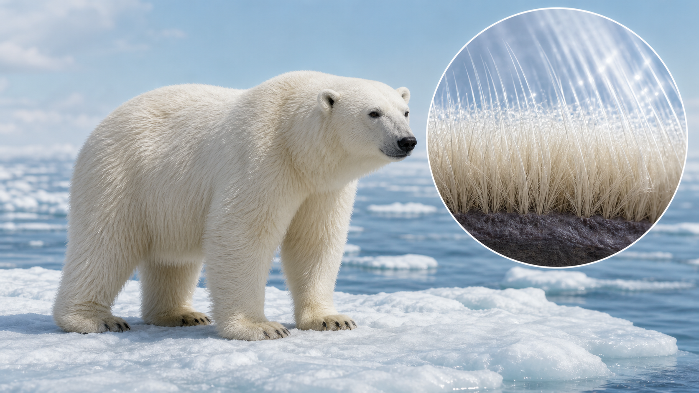

北极熊单根毛多接近透明，光在许多毛之间散射后，整体看起来白或微黄。毛下面的皮肤颜色较深。厚脂肪和毛层一起帮助保温。

**再想一步：** 不能简单说每根毛像光纤把阳光送到皮肤，这种流行解释并不准确。白色外观主要是复杂的散射结果，毛里夹住的空气还能减慢热传递。

**把知识连起来：** 北极熊的护毛大多缺少色素并较透明，光在毛和空气间散射后整体看起来白；下面的皮肤颜色较深。密集毛层和皮下脂肪减慢热量散失，白色外观还能与雪冰背景接近。颜色与保温来自不同结构，却一起适应北极环境。

**再往外看：** 毛在不同光线、湿度或污渍下可能显黄或灰。红外成像与热传递测量能研究它如何保温。

**容易弄混：** 北极熊的毛不是像光纤一样专门把阳光送到皮肤，也不是每根真正涂了白色颜料。白色主要是散射形成的整体视觉效果。

**一起看看：** 比较北极熊在阳光和阴影照片里的毛色。

---

### 第 137 问｜大熊猫只吃竹子吗？

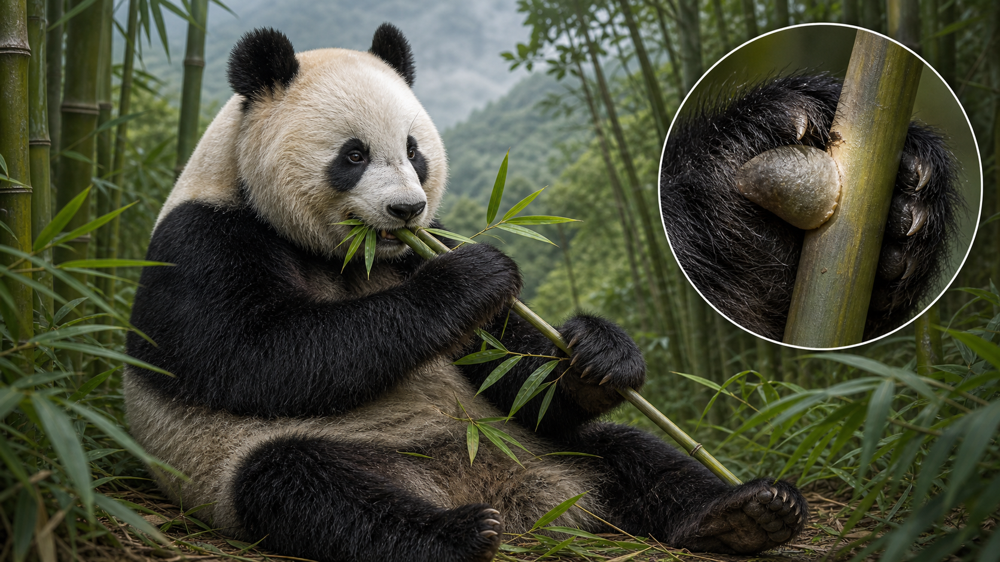

野生大熊猫的食物绝大部分是竹子。不过，它们在分类上属于食肉目，也偶尔吃其他食物。竹子能量不高，所以大熊猫一天要花很多时间进食。

**再想一步：** 大熊猫有发达臼齿和强壮颌肌，腕骨还形成像“拇指”的结构来握竹子。它的消化道仍较像其他食肉目动物，不能高效分解全部植物纤维。

**把知识连起来：** 野生大熊猫饮食以竹为主，但仍保留食肉目祖先的较短消化道，消化纤维效率有限，因此需要花很长时间取食大量竹子。强壮颌肌、宽臼齿和腕部增大的籽骨帮助咬碎并握住竹秆。它也可能吃其他植物或少量动物性食物。

**再往外看：** 竹子不同部位和季节的营养变化会影响熊猫迁移与取食选择，栖息地保护必须保留多种竹和高度带。

**容易弄混：** “只吃竹子”是过度概括，也不能因此把熊猫归为草食动物类群。分类依据亲缘，饮食则描述当前生态行为。

**一起看看：** 观察熊猫握竹子时，真正手指旁边还有什么突起。

## 追问链 15.3｜育幼、防护、感官、消化与睡眠

育儿袋、刺、长耳、胡须、嗅觉和特殊消化或站立结构解决不同生活任务。

### 第 138 问｜袋鼠宝宝为什么住在袋子里？

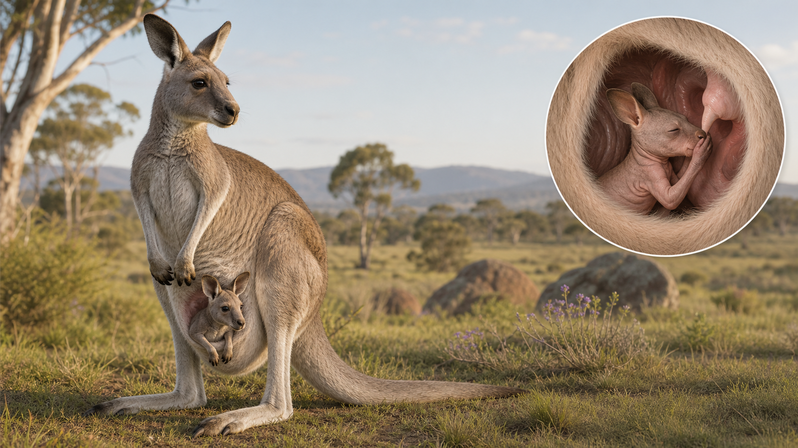

袋鼠属于有袋类。宝宝出生时非常小，会爬到妈妈腹部的育儿袋，吸住乳头继续生长。长大一些后，它会探头、出袋，再回来吃奶和躲避危险。

**再想一步：** 有袋类的胚胎在子宫内发育时间较短，出生后的发育更多在乳头附近完成。袋子不是一只可以取下的口袋，而是带肌肉和乳腺的身体结构。

**把知识连起来：** 袋鼠幼崽出生时非常小且发育不完全，会依靠前肢爬入育儿袋并附着乳头继续生长。袋内提供保护、温度和乳汁，不同阶段幼崽甚至可得到成分不同的乳。母体把较长孕育的一部分转移到体外袋中完成。

**再往外看：** 有袋类还包括考拉、负鼠和袋熊，育儿袋方向与结构并不相同。它们展示了哺乳动物繁殖的另一条演化路线。

**容易弄混：** 袋鼠宝宝不是像衣服口袋里的玩具那样随时装进去，也不是一直住到成年。它会逐渐探出、离袋并断奶。

**一起看看：** 在录像里观察不同大小的幼崽怎样进出育儿袋。

---

### 第 139 问｜树懒为什么动作慢？

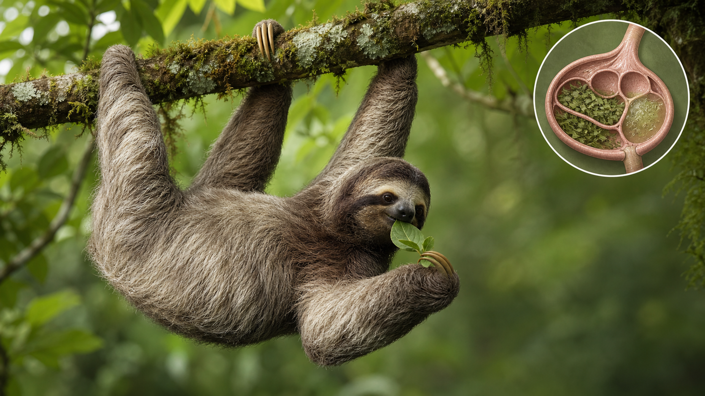

树懒主要吃能量不高、较难消化的叶子，代谢速度较慢。缓慢活动能节省能量，也可能让捕食者不容易从动作发现它。弯曲的爪帮助它悬挂树枝。

**再想一步：** 树懒体温会比许多哺乳动物变化更明显，消化一餐也可能很久。慢不是“懒惰的选择”，而是一整套生理与生态适应。

**把知识连起来：** 树叶能量较低且难消化，树懒靠微生物发酵慢慢取得养分，代谢率和肌肉功率也较低。缓慢移动减少能量开支，并可能降低被依靠运动发现的捕食者注意。体温还会随环境有一定变化。

**再往外看：** 树懒毛上生活着藻类和多种小生物，形成微型生态系统；不同树懒物种的食性和活动节律也不同。

**容易弄混：** 动作慢不等于懒惰或笨，也不是它随时在睡觉。名称是人的评价，真实原因涉及食物能量、代谢和生活方式。

**一起模仿：** 用十秒完成一次慢慢抬手，感受控制动作也要专心。

---

### 第 140 问｜刺猬的刺会射出去吗？

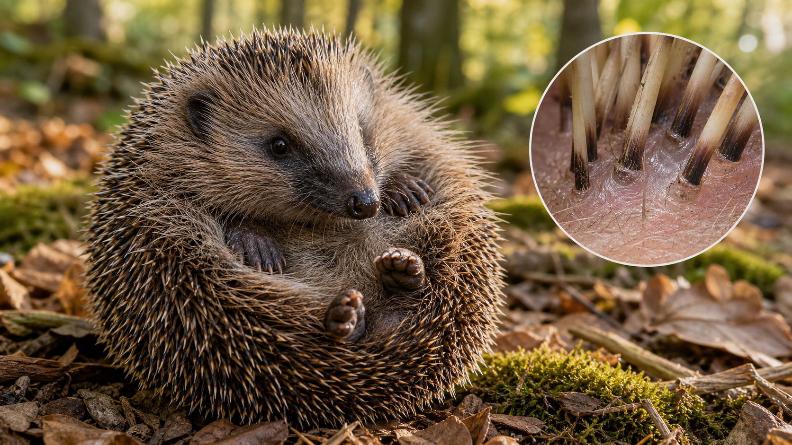

刺猬的刺是变硬、变粗的毛，连在皮肤上，不会主动射出去。遇到危险时，皮下肌肉让刺竖起，身体卷成球，保护脸和腹部。刺会自然更换。

**再想一步：** 豪猪的刺和刺猬的刺结构不同，有些豪猪刺很容易脱落并扎进攻击者，但也不是发射出去。相似的防御外形可以在不同动物中独立演化。

**把知识连起来：** 刺猬的刺是加粗硬化的毛，由角蛋白组成并牢固连接皮肤。遇到威胁时，背部肌肉把刺竖起，环形肌让身体卷成球，把柔软脸腹藏在里面。刺提供被动屏障，但不会像箭一样主动发射。

**再往外看：** 豪猪也有特化毛刺，却与刺猬亲缘较远，刺的长度、倒钩和防御动作不同。相似功能可以独立演化。

**容易弄混：** 刺猬不会把刺射出去，掉落或更换个别刺也不等于攻击。不要用手触碰验证，野生动物应保持距离。

**一起看看：** 比较刺猬与豪猪的身体大小、刺长和防御姿势。

---

### 第 141 问｜兔子的耳朵为什么长？

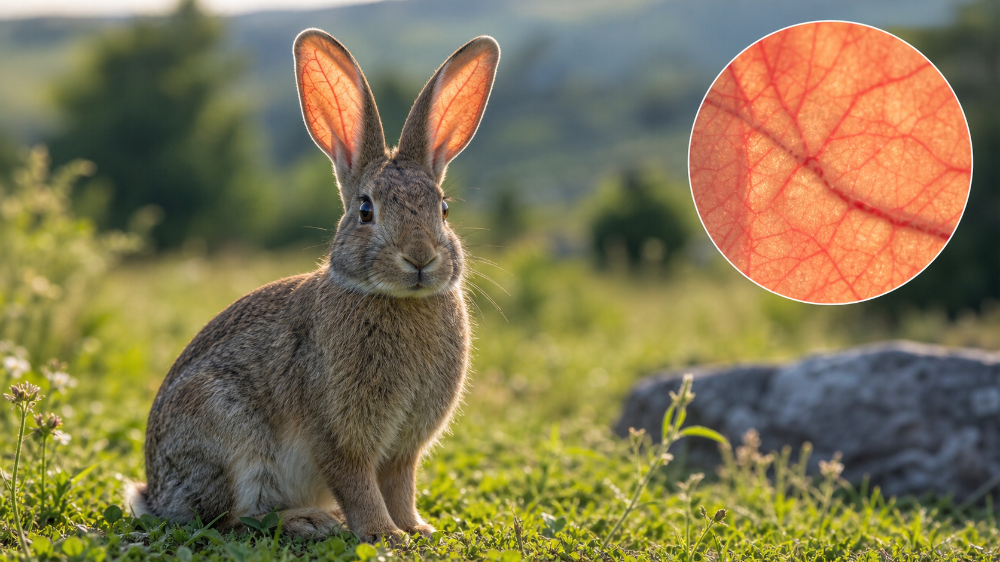

长耳朵能收集声音，还能转向不同方向，帮助兔子发现危险。耳朵里有丰富血管，部分种类也能通过它散热。不同兔种和野兔的耳朵长短并不相同。

**再想一步：** 大表面积让血液较容易把热传给空气，但环境温度、毛量和血流调节都影响效果。沙漠动物的大耳常更利于散热，寒冷地区近亲的耳朵往往较短。

**把知识连起来：** 兔耳的大表面积和丰富血管能与空气交换热量；天气热时，较多温暖血液流经耳部，热传给周围，较凉血液再返回身体。耳朵还能转向声源，帮助定位危险。一个长耳结构同时参与听觉和调温。

**再往外看：** 生活在炎热地区的野兔耳朵常更大，寒冷地区种类较小，这是体表面积与环境换热关系的例子。

**容易弄混：** 长耳朵不是像扇子一样主动制造冷空气，也不保证任何时候都散热。血流、风、空气温度和姿势会改变效果。

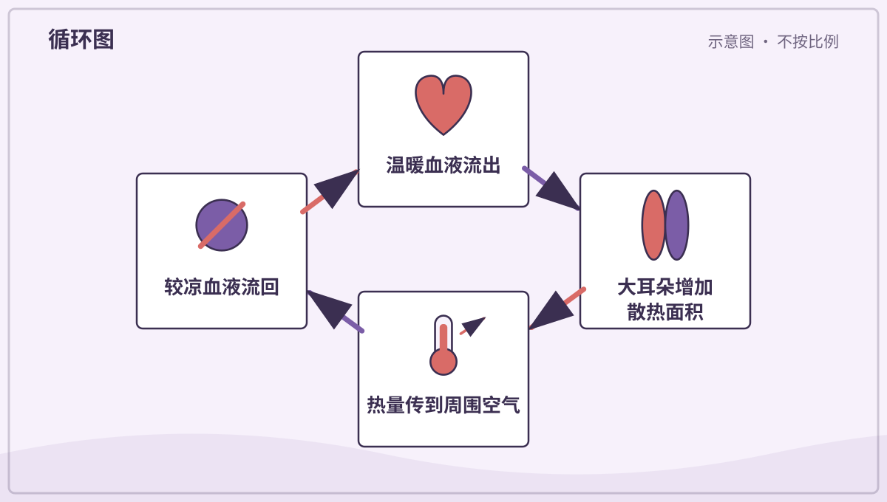

*图解：温暖血液流经兔耳，把热传给空气；较凉的血再流回身体。*

**一起听听：** 双手放在耳后增加面积，比较声音有没有变化。

---

### 第 142 问｜猫的胡须是普通毛吗？

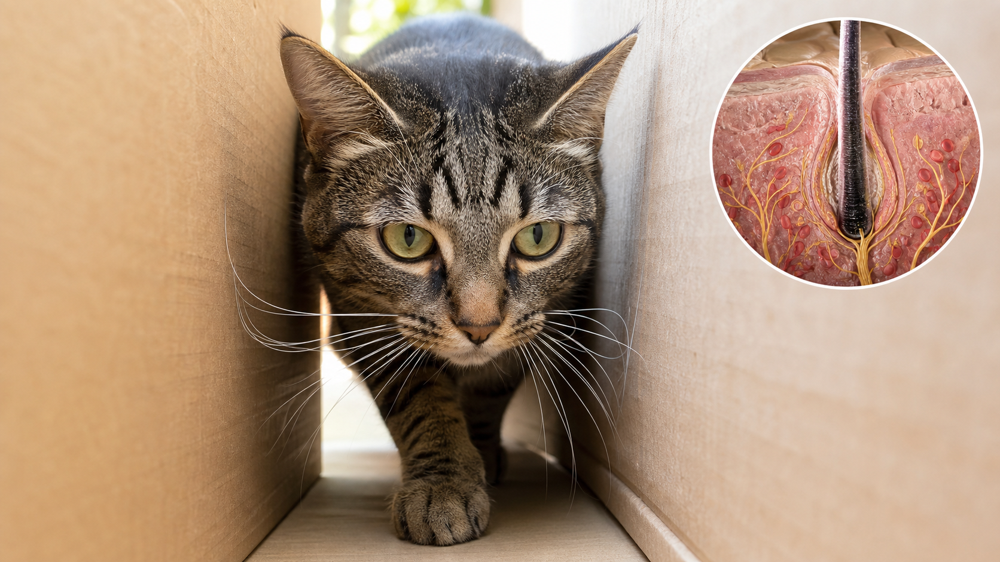

猫的胡须比普通毛粗，根部周围有丰富神经。胡须弯曲时，猫能感到附近物体、空气流动和缝隙大小。眼睛上方和腿部也可能有触须。

**再想一步：** 胡须本身不是神经，却像杠杆把轻微触碰传到毛囊感受器。剪掉胡须不会像剪神经一样疼，但会损害感觉能力，所以不能剪。

**把知识连起来：** 猫胡须是粗硬的触毛，根部毛囊周围有丰富感受神经。胡须轻微弯曲就能把力传到毛囊，帮助判断近处障碍、气流和开口宽度；脸上不同方向的胡须形成空间采样阵列。大脑还会结合视觉和身体姿势。

**再往外看：** 海豹、鼠和许多哺乳动物也有触毛，水中或黑暗环境会让这种机械感知更重要。

**容易弄混：** 胡须不是普通装饰毛，也不能用剪短来测试猫能否通过缝隙。剪断会暂时减少重要感觉线索，拉扯更会造成疼痛。

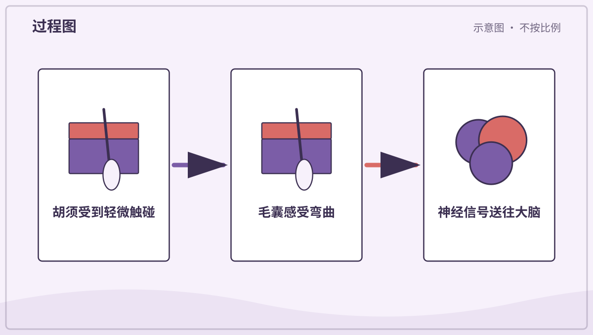

*图解：胡须弯曲时像杠杆带动毛囊，毛囊感受器把细小变化变成神经信号。*

**一起看看：** 只观察猫胡须朝向，不拉、不剪，也不突然摸脸。

---

### 第 143 问｜狗的鼻子为什么这么灵？

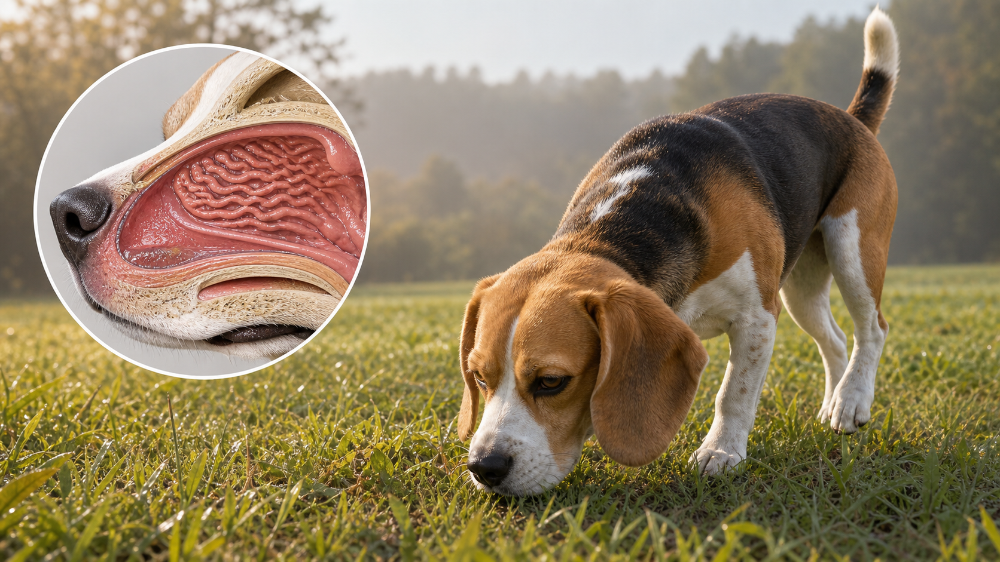

狗鼻腔里感受气味的区域比人更大，嗅觉受体也更多。它能用快速短嗅不断采样，还能分辨左右鼻孔收到气味的差别。湿鼻面有助于捕捉一些气味分子。

**再想一步：** 气味分子与不同受体组合，形成类似“气味密码”的神经信号。狗的嗅觉表现还受品种、训练、风向、湿度和个体健康影响。

**把知识连起来：** 狗鼻腔里有大面积嗅上皮和大量嗅觉受体，吸气时复杂气流把气味分子送到感受区域。湿润鼻面能帮助捕捉部分分子，左右鼻孔和连续嗅闻还能提供方向变化。大脑用模式组合辨认气味。

**再往外看：** 训练犬可寻找特定气味，用于搜救或检测，但表现受训练、风、湿度和个体状态影响，需要严格验证。

**容易弄混：** 狗嗅觉灵并不只是因为鼻头湿，也不能把一次反应当作绝对证明。气味识别是鼻腔结构、受体、大脑和学习共同结果。

**一起看看：** 观察狗散步时在哪些地方停下闻，不让它闻危险物。

---

### 第 144 问｜牛为什么总在嚼？

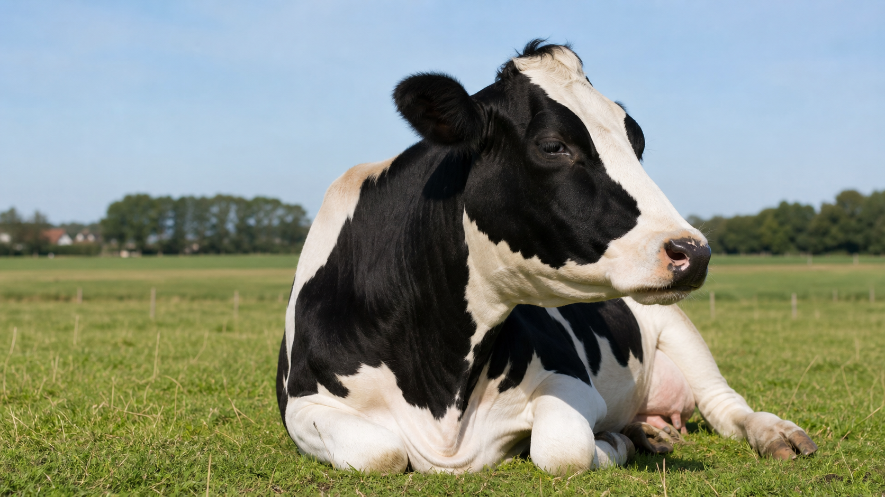

牛先把草快速吞进多室胃的前部，微生物开始分解。休息时，一部分食物返回口中再细嚼，然后重新吞下。这个过程叫反刍。

**再想一步：** 牛自己不能制造分解纤维素所需的全部酶，瘤胃里的微生物帮忙发酵植物纤维。牛再吸收发酵产物，也消化一部分微生物获得营养。

**把知识连起来：** 牛先快速吞下植物，食物进入瘤胃等胃室，由微生物分解纤维；之后一部分食团返回口中再细嚼，增加表面积并混合唾液。反刍让牛利用人难以消化的纤维素，但真正分解工作很大程度由微生物完成。

**再往外看：** 鹿、羊和长颈鹿也会反刍，胃室结构和食物选择各有差异。瘤胃发酵还会产生甲烷，是农业环境研究的一部分。

**容易弄混：** 牛不是因为无聊才一直嚼，也不是有四个完全独立的胃。通常说的“四个胃”是一个复合胃的四个区室。

**一起看看：** 从安全距离观察休息的牛，下巴是否有规律地移动。

---

### 第 145 问｜马可以站着睡觉吗？

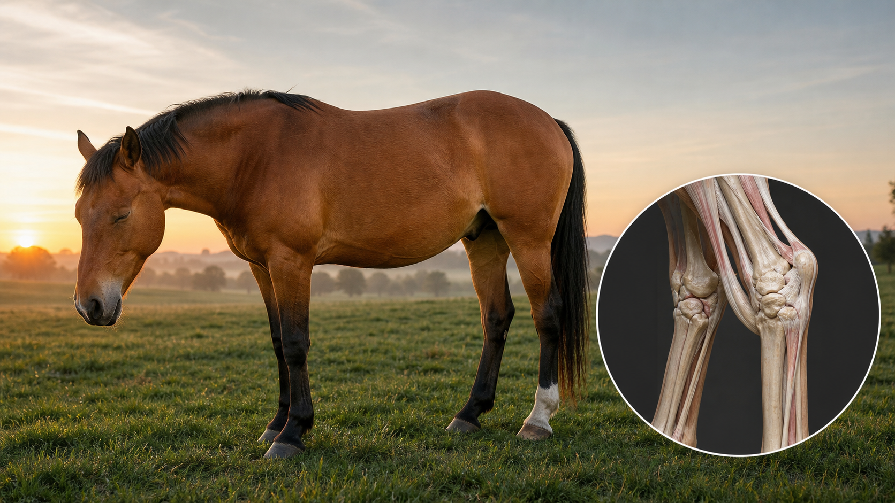

马的腿有一套肌腱和韧带结构，能在少用肌肉力量时锁住关节，所以可以站着打盹。这样遇到危险能较快移动。不过马也会躺下，才能得到完整的深睡和快速眼动睡眠。

**再想一步：** 这套结构叫站立装置，它减少长时间站立的能量消耗。能站着休息不等于永远不用躺下，长期不能安全躺卧会影响健康。

**把知识连起来：** 马腿的肌腱、韧带和关节排列能形成停驻装置，使部分关节在较少肌肉持续用力时保持稳定。马可以站着打盹并迅速逃跑，但进入某些深睡阶段通常仍需卧下。群体中还可能轮流保持警觉。

**再往外看：** 长时间站立也依靠蹄、血流和姿势不断微调。兽医学会从休息姿势变化判断疼痛或环境压力。

**容易弄混：** 马能站着睡不等于从不躺下，也不是腿被真正锁死无法移动。休息有不同深度，关节稳定结构仍能随时解除。

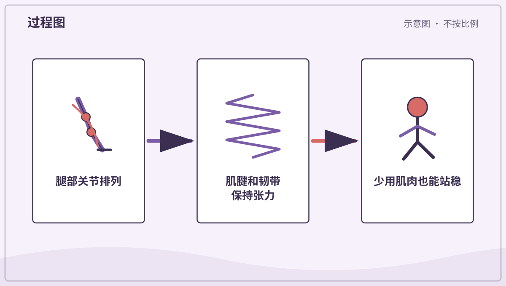

*图解：马腿的肌腱和韧带能帮助锁住关节，让站立休息时不必持续强烈收缩肌肉。*

**一起看看：** 在照片里找马休息时有没有一条后腿轻轻放松。

## 单元综合观察｜用同一任务比较三种哺乳动物

从本单元选三种动物，只比较“怎样感知”“怎样保温”或“怎样取得食物”中的一项。给每个判断配一条身体或行为证据。
