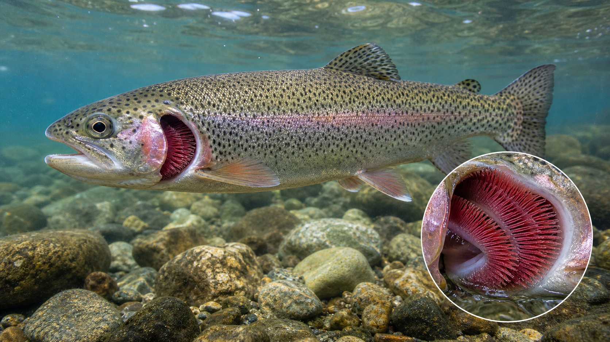
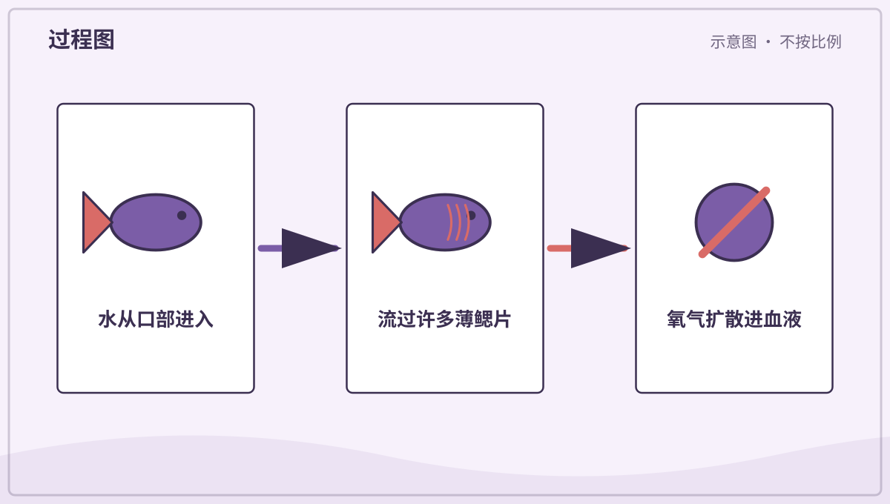
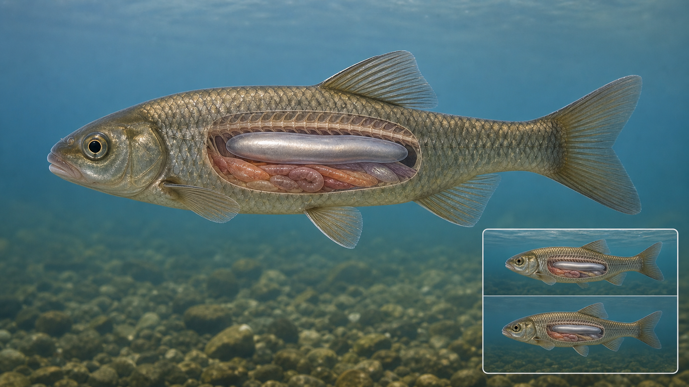
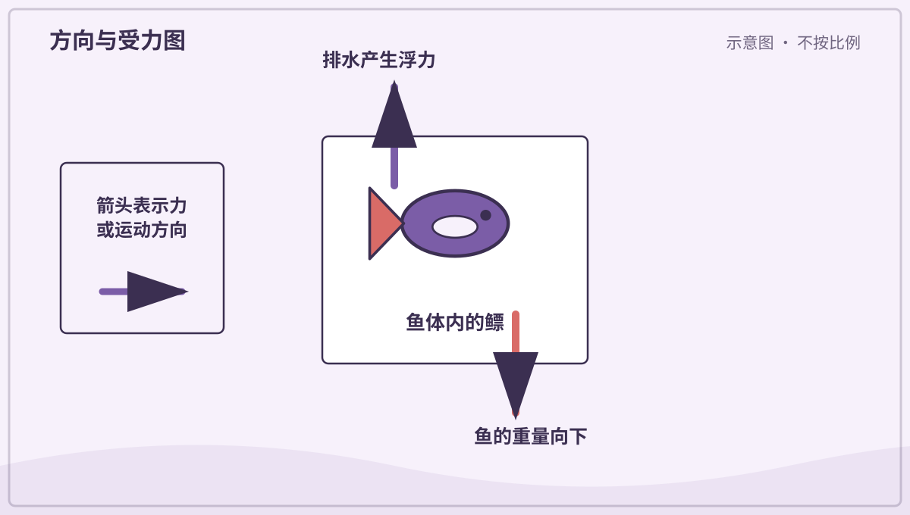
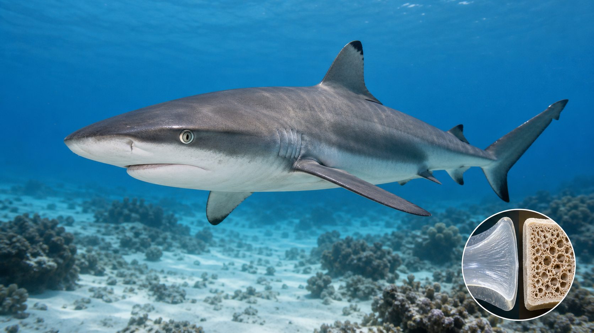
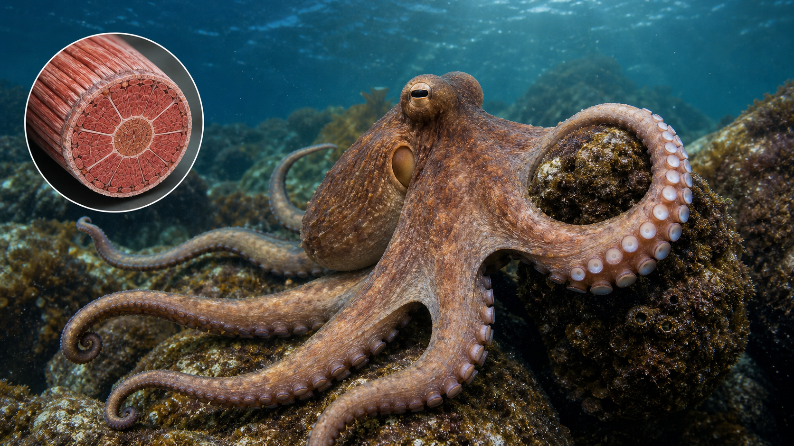
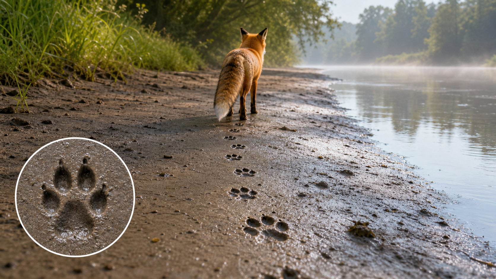

# 兴趣单元 16｜水中动物、脚印与迁徙

> **探索领域 05：** 脊椎动物的身体办法
>
> **核心问题：** 动物怎样在水中呼吸和悬浮，我们又怎样从痕迹和长途移动研究它们？

鱼鳃、鳔、鲨鱼软骨和章鱼腕展示水中身体方案，脚印与迁徙则把直接观察扩展到动物不在眼前的时空证据。

## 怎样沿着本单元的追问链阅读

区分身体结构、留下的痕迹和季节性行为，它们回答的是不同层次的问题。

## 追问链 16.1｜鳃、鳔、软骨与柔软的腕

水中气体交换、平均密度、支撑材料和肌肉静水骨骼各有不同机制。

### 第 146 问｜鱼怎样在水里呼吸？

多数鱼让水从口进入，流过鳃，再从鳃盖附近出去。鳃丝很薄，里面有许多血管，水中的氧会进入血液，二氧化碳则离开。鱼利用的是溶在水里的氧。

**再想一步：** 鳃中血液常与水流方向相反，能在更长距离保持氧浓度差，提高交换效率，这叫逆流交换。多数鱼的鳃离开水后容易塌陷并变干，不能靠空气正常呼吸；肺鱼、弹涂鱼等少数鱼类另有利用空气的结构和办法。

**把知识连起来：** 鱼让水从口进入并流过鳃丝上的大量鳃小片，水中氧跨过很薄的表面进入毛细血管，二氧化碳反向扩散。许多鱼的水流和血流方向相反，能维持较好的浓度差。鳃的大面积与薄壁适合水中气体交换。

**再往外看：** 水温升高时溶解氧通常减少，污染或鳃损伤会让呼吸困难。测量水中氧是水域健康的重要指标。

**容易弄混：** 鱼不是把水分子拆开取氧，也不是所有水生动物都有鳃。它们取得的是溶解在水里的氧气，鲸和海豚仍必须到水面呼吸空气。

*图解：水流过鳃丝和鳃小片，水中的氧跨过薄膜进入血液。*

**一起看看：** 观察鱼鳃盖有节奏地开合，不敲鱼缸。

---

### 第 147 问｜鱼怎么停在水中不上不下？

许多硬骨鱼体内有充气的鳔。改变鳔里气体的量，会改变整体体积和平均密度，帮助鱼调节浮力。鳍和游动仍要负责保持姿势和细微位置。

**再想一步：** 浮力等于被排开水的重量。深度改变时水压也改变气体体积，有些鱼用血液缓慢调气，有些能把气体吞入或排出；鲨鱼没有典型鱼鳔。

**把知识连起来：** 许多硬骨鱼通过向鳔内加入或移走气体，改变身体总体积而质量变化很小，从而调节平均密度。浮力接近重量时，鱼不用持续向上游也能保持深度。深度改变会压缩气体，所以调节需要时间和生理控制。

**再往外看：** 没有鳔的鲨鱼依靠油脂、动态升力和游动等办法控制深度；底栖鱼也可能减少或失去鳔。

**容易弄混：** 鳔不是鱼的肺袋，鱼也不是简单把身体吹得越大就能任意上升。快速深度变化可能使气体体积失衡。

*图解：鱼改变鳔内气体体积来调节平均密度，使浮力接近自身重量。*

**一起看看：** 观察鱼停住时，胸鳍是否还在轻轻摆动。

---

### 第 148 问｜鲨鱼的骨头和我们的骨头一样吗？

鲨鱼的骨架主要由软骨组成，不是像人类骨骼那样的硬骨。软骨较轻又有弹性，能支撑身体。它们的牙齿和皮肤小齿却很坚硬。

**再想一步：** 鲨鱼依靠油脂丰富的肝脏、宽大的胸鳍和持续游动帮助获得浮力。软骨骨架不是“没有骨架”，而是采用另一种支撑材料。

**把知识连起来：** 鲨鱼骨架主要由软骨构成，并在受力处矿化增强；软骨比典型骨组织轻而有韧性。肌肉、皮肤胶原纤维和身体形状一起传递游动作用力。它们并非没有坚硬结构，牙齿和皮齿含有高度矿化组织。

**再往外看：** 鳐和银鲛也是软骨鱼，化石牙齿比软骨骨架更容易保存，因此鲨鱼演化记录有特殊偏差。

**容易弄混：** 软骨不等于柔软得像耳朵，也不能说鲨鱼完全没有“骨头样”的支撑。分类所说的软骨骨架是组织类型差异。

**一起看看：** 摸摸自己的耳廓，它也是软骨，但不要把它当成鲨鱼骨架的完全模型。

---

### 第 149 问｜章鱼的腕为什么能到处弯？

章鱼有八条腕，里面没有骨头。不同方向的肌肉互相配合，让腕伸长、缩短、弯曲和扭转。吸盘能抓握、感觉触碰，还能感受一些化学物质。

**再想一步：** 章鱼腕也是肌肉水压器，体积大致不变，所以某个方向变细会让它伸长。大量神经元分布在腕中，局部神经回路能处理许多动作细节。

**把知识连起来：** 章鱼腕内没有骨骼，纵向、横向和环向肌肉围绕体液组织排列；一组肌肉收缩时，其他方向会补偿体积，使腕伸长、缩短、弯曲或扭转。吸盘还能独立抓握和感受化学物。分布在腕内的大量神经让局部动作很灵活。

**再往外看：** 柔性机械臂和医疗机器人借鉴这种连续弯曲结构，难点是同时控制很多自由度并保持力量。

**容易弄混：** 章鱼有八条腕，不是所有都叫“触手”；它们也不是完全各自有一颗独立大脑。局部神经处理与中央脑协调同时存在。

**一起模仿：** 用一条软毛巾摆出弯、卷、扭三种形状。

## 追问链 16.2｜脚印证据与季节迁徙

痕迹支持有限推断，迁徙则与食物、繁殖、季节和导航共同相关。

### 第 150 问｜动物脚印能告诉我们什么？

脚印会留下脚趾、肉垫、蹄或爪的形状。连续足迹还能提示动物走路、奔跑或跳跃的方式。泥土软硬、速度和脚掌角度都会改变印迹。

**再想一步：** 科学家把足迹、粪便、毛和啃咬痕等叫作踪迹证据。一个模糊脚印通常不能单独确定物种，要结合尺寸、步幅、环境和其他线索。

**把知识连起来：** 脚印的形状、大小、深浅、间距和行列能提供足部结构、行进方向、速度变化和基质软硬的线索。推断必须考虑泥沙含水量、风雨侵蚀和脚掌滑动，同一动物也会留下不同印迹。连续足迹通常比单个印子更有信息。

**再往外看：** 古生物学家研究化石足迹，可以了解身体未被保存时的群体移动和步态；现代相机陷阱则与足迹相互验证。

**容易弄混：** 一个脚印不能可靠告诉动物当时全部心情、性别或精确体重，也不能只凭形状随意追踪。证据支持到哪里，结论就应停在哪里。

**一起看看：** 只观察不追踪野生动物，比较人鞋印和鸟脚印。

---

### 第 151 问｜动物为什么要搬很远的家？

一些动物会在季节变化时迁徙，寻找食物、繁殖地或更合适的温度。鸟、鲸、鱼、蝴蝶和许多其他动物都可能迁徙。路线有的每年往返，有的只走一次。

**再想一步：** 动物用太阳、星星、地标、气味和地球磁场等线索导航，不同物种组合不同。迁徙消耗能量也有风险，但在长期环境中带来的生存与繁殖收益更大。

**把知识连起来：** 动物迁徙通常在季节间往返，连接繁殖地、食物地和越冬地。太阳、星空、地磁、气味、地标和群体经验可提供导航线索，激素与日长信号则帮助启动行为。长途移动需要储能，也会经过多个危险节点。

**再往外看：** 卫星标签、环志、声学接收器和稳定同位素能追踪不同尺度的迁徙。保护一条路线要同时保留起点、终点和中途停歇地。

**容易弄混：** 迁徙不是动物因为冷就随便搬家，也不是所有个体每年走完全相同路线。扩散、日常觅食和单向离开出生地也不都叫迁徙。

**一起看看：** 在地图上用手指画一条从冷地方到暖地方的季节路线。

## 单元综合观察｜读一条动物留下的线索

使用照片比较脚印大小、步距和方向，只说证据真正支持的结论。不要跟踪或靠近野生动物，迁徙路线用地图讨论。
