# 兴趣单元 17｜皮肤、骨骼、肌肉、心肺与大脑

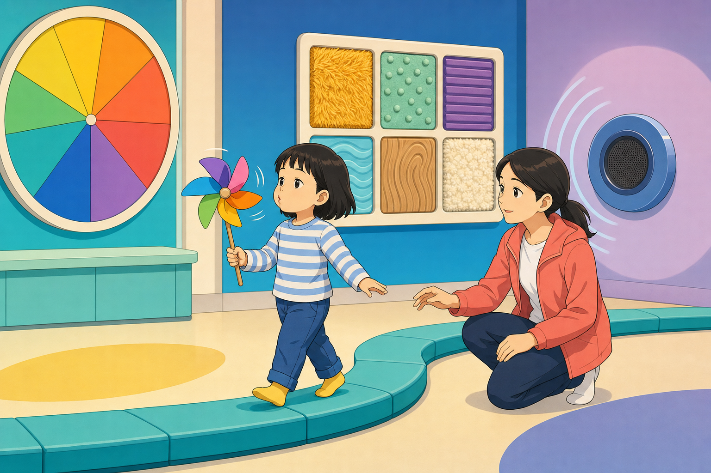

> **探索领域 06：** 人体与感觉
>
> **核心问题：** 身体怎样建立边界和支架、产生运动、运输物质并快速协调反应？

从皮肤和骨骼进入肌肉，再沿心脏、血管、肺、膈肌、大脑与脊髓观察多个系统怎样合作。

## 怎样沿着本单元的追问链阅读

器官不是独立零件；每篇都追问输入、输出，以及它需要哪些其他部分帮助。

## 追问链 17.1｜皮肤、骨骼、关节与肌肉

外层屏障、硬支架、活动连接和成对肌群共同支持身体运动。

### 第 152 问｜皮肤只是一层包装吗？

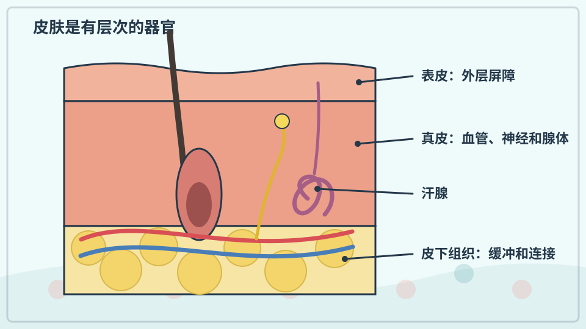

皮肤是身体最大的器官。它挡住许多有害微生物，减少水分流失，还能感觉冷、热、触碰和疼痛。皮肤也会出汗，并帮助调节体温。

**再想一步：** 皮肤由表皮、真皮和更深的组织组成，各层有不同细胞、血管、神经和腺体。最外层细胞不断脱落更新，保护不是一张永远不变的薄膜。

**把知识连起来：** 皮肤表皮形成防水而不断更新的屏障，真皮包含血管、感觉神经、毛囊和腺体，更深层组织则缓冲并连接身体。它既阻挡许多病原体和化学物，也调节水分、温度与触觉信息。受伤时，免疫、凝血和新生组织会协同修复。

**再往外看：** 皮肤微生物群、色素和厚度会随身体部位、年龄与环境不同。研究皮肤不能只看最外面可见的一层。

**容易弄混：** 皮肤不是包住器官的被动塑料袋，也不是越洗越干净越健康。过度摩擦和刺激会破坏屏障，医疗问题应由专业人员判断。

**一起看看：** 用指腹轻碰布、木头和金属，说说触感哪里不同。

---

### 第 153 问｜每个人的指纹都一样吗？

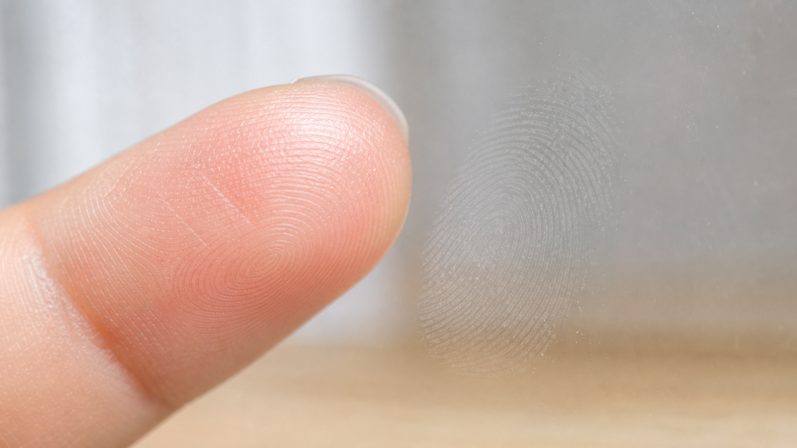

*写实观察图：指腹表面的纹脊形成弓、箕或斗等总体形态，细节还会因接触角度和压力而改变。*

手指表面的脊线会形成弓、环和旋涡等花纹。指纹在出生前由遗传和生长环境共同形成，即使同卵双胞胎也不完全相同。小伤通常不会改变深层花纹。

**再想一步：** 脊线会改变指腹与物体的接触和摩擦，也会让滑动产生可被感受的细小振动。指纹识别比较许多特征点，但没有任何一种识别方法在所有情况下都绝对不会出错。

**把知识连起来：** 指腹纹脊在胎儿发育中由遗传和局部生长条件共同形成，细小分叉和终止点组合极其丰富。纹脊增加特定条件下的摩擦，并把滑动变成触觉感受器可检测的振动。接触表面时，汗液和油脂会复制部分图案。

**再往外看：** 法庭鉴定会比较多个细节并评估图像质量，不是看到一个旋涡就自动确认身份。指纹传感器也使用光、电容或超声等不同方法。

**容易弄混：** “每个人指纹不同”是极高区分度的经验结论，不表示任何模糊印痕都能唯一识别。受伤、压力和接触角度都会改变留下的痕迹。

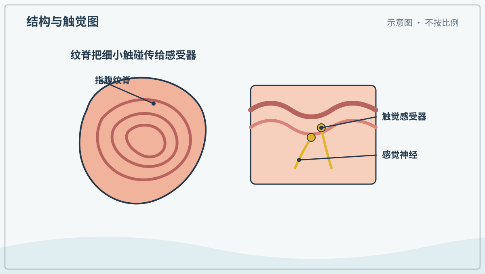

*图解：指纹脊线改变接触和摩擦，也会把滑动变成细小振动，帮助触觉感受器读出表面。*

**一起看看：** 用放大镜看自己的指腹，不必涂墨留下指纹。

---

### 第 154 问｜头发为什么会长？

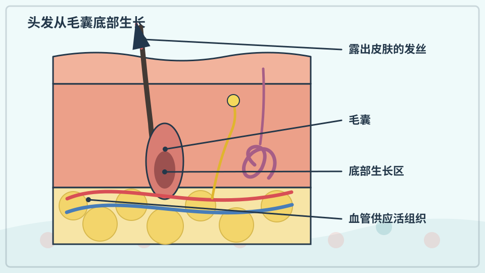

头发从皮肤里的毛囊生长。毛囊底部细胞不断分裂，旧细胞被向上推并充满角蛋白，露出皮肤后就成为发丝。剪头发不会让毛囊感觉疼。

**再想一步：** 每根头发会经历生长、过渡、休止和脱落阶段，所以每天掉一些很正常。颜色来自黑色素，形状受毛囊和发丝结构影响。

**把知识连起来：** 毛囊底部细胞不断分裂、角化并被向外推，形成我们看到的发丝；露出皮肤的部分主要由死亡角蛋白细胞组成。每个毛囊经历生长、过渡、休止和脱落周期，所以头发不是整齐同步变长。血液只供应皮肤内的活组织。

**再往外看：** 头发颜色来自黑色素，卷直与毛囊形状和纤维结构有关。激素、营养、疾病和年龄都可能改变生长周期。

**容易弄混：** 剪发不会让毛囊突然加快生长，剃后摸起来更粗是因为截面平钝。头发末端没有神经，拉扯毛囊却会痛。

**一起看看：** 比较一根直发和一根卷发的弯曲，不拔正在生长的头发。

---

### 第 155 问｜骨头是空心的吗？

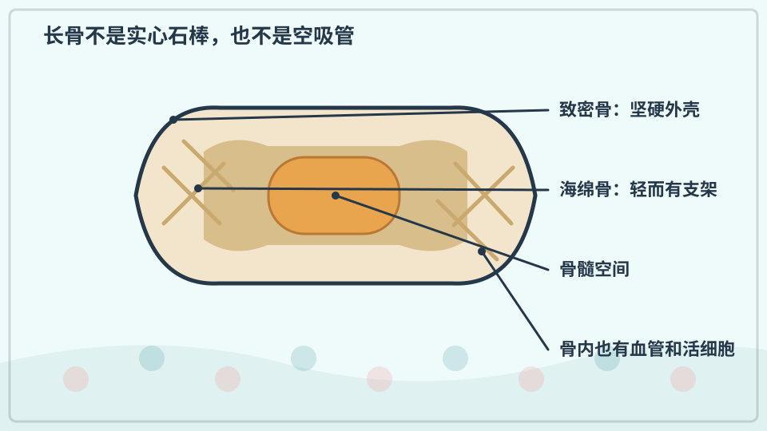

骨头不是实心石棒，也不是完全空的管子。外层较致密，内部有像小梁一样的海绵骨和骨髓。这样的结构既能承受力量，又不会重得不能活动。

**再想一步：** 骨是活组织，会得到血液、感受负荷并不断重塑。骨髓还参与制造血细胞；钙盐让骨较硬，胶原蛋白让它不那么脆。

**把知识连起来：** 长骨外层有致密骨质承受弯曲和碰撞，内部海绵骨沿常见受力方向形成轻而强的网架，中央空间可容纳骨髓。骨组织会在成骨和吸收中不断重塑，修补微小损伤并适应负荷。轻量化不是完全空心。

**再往外看：** 鸟类一些骨内有气腔并与呼吸系统相连，但仍有支撑梁；人骨和鸟骨的“空”不是同一种结构。医学成像能显示内部差异。

**容易弄混：** 骨头不是干燥死石，也不是一根中空吸管。它含活细胞、血管、矿物和胶原，过度或错误负荷仍会骨折。

**一起摸摸：** 轻摸手腕、手肘和膝盖，找找皮肤下较硬的地方。

---

### 第 156 问｜关节为什么能弯？

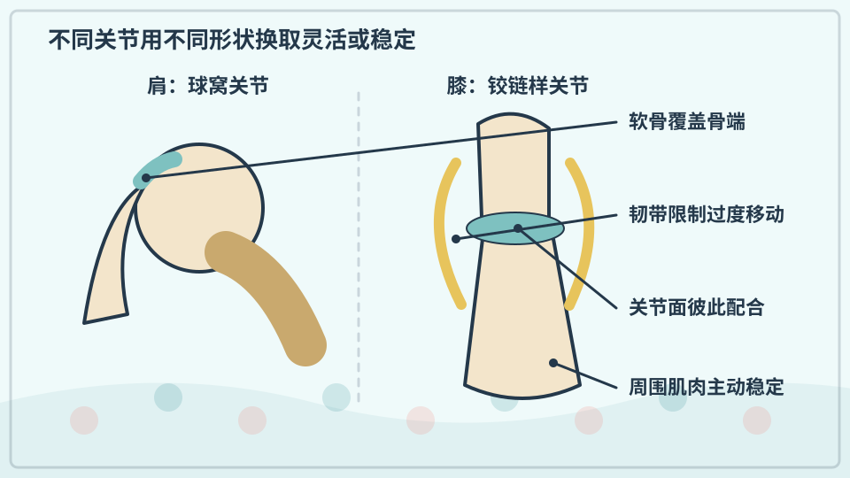

关节是两块或多块骨相接的地方。膝、肘等关节表面有光滑软骨，关节液帮助减少摩擦，韧带把骨连接并限制过度移动。不同关节能动的方向不同。

**再想一步：** 肩关节像球放进浅窝，活动范围大；膝关节更像经过引导的铰链，稳定性较高。灵活与稳定常要做取舍，肌肉也参与保护关节。

**把知识连起来：** 关节把骨端连接起来，软骨降低接触压力，关节液帮助润滑，韧带限制过度移动，周围肌肉主动控制位置。球窝关节允许多方向运动，铰链样关节更强调稳定方向。灵活与稳定常需要折中。

**再往外看：** 肩、髋、膝和脊柱关节形状各不相同，康复训练会针对肌肉控制和活动范围，而不是把所有关节用同一方式拉伸。

**容易弄混：** 关节能弯不是两根骨头直接磨来磨去，也不是越松越好。疼痛、肿胀或受伤不应靠强行活动自行检查。

**一起动动：** 慢慢弯肘、转肩、踮脚，不用力扭到尽头。

---

### 第 157 问｜肌肉怎样拉动骨头？

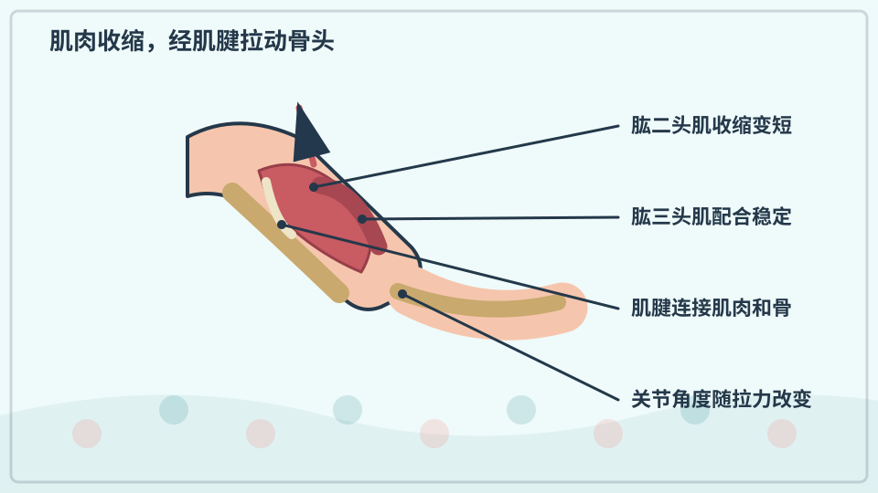

骨骼肌通过肌腱连接骨头。肌肉收缩时会变短并产生拉力，让关节两侧的骨改变角度。肌肉只能主动拉，不能像棍子一样主动推。

**再想一步：** 许多动作由成对或成组肌肉控制：一组收缩，另一组放松或稳定。例如弯肘时肱二头肌出力，伸肘时另一组肌肉更重要。

**把知识连起来：** 骨骼肌通过肌腱连接骨，肌纤维缩短时只能主动拉，不能主动推。弯肘时一组肌肉产生主要力矩，伸肘时另一组主导；对侧肌群还会适度共同收缩以稳定关节。大脑和脊髓不断调整招募的肌纤维。

**再往外看：** 同一块肌肉可跨越多个关节，动作也受骨骼杠杆位置影响。测量肌电和关节力矩能研究协调。

**容易弄混：** 肌肉并不是成对轮流完全关机，也不只在看见动作时工作。保持姿势、呼吸和稳定关节同样需要持续而细小的收缩。

**一起摸摸：** 弯曲手臂时，轻摸上臂前侧感受肌肉变硬。

## 追问链 17.2｜循环、呼吸、大脑与反射

心肺交换和运输气体，大脑协调信息，脊髓回路可迅速触发保护动作。

### 第 158 问｜心脏为什么一直怦怦跳？

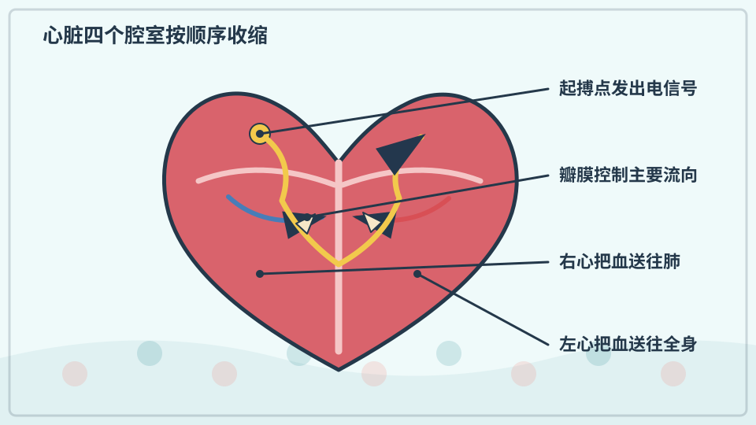

心脏是有四个腔室的肌肉泵。它有节奏地收缩，把血液送到肺和全身，再接回流回来的血。运动时身体需要更多氧气，心跳通常会加快。

**再想一步：** 心脏里一小群起搏细胞能自己产生电信号，信号按顺序传开，让心房和心室协调收缩。瓣膜像单向门，帮助血液朝合适方向流。

**把知识连起来：** 心脏起搏细胞自动产生节律电信号，信号按特定路径传播，使心房和心室有顺序地收缩。瓣膜让血流主要沿一个方向，冠状血管则给心肌自身供氧。运动、睡眠和情绪会通过神经与激素改变心率。

**再往外看：** 心电图记录体表可测到的总电活动，超声显示瓣膜与心腔运动，两种工具回答不同问题。

**容易弄混：** 心脏不是一直以完全相同速度跳，也不是情绪一变就说明心脏生病。持续胸痛、晕厥或呼吸困难等情况需要立即告诉大人并求助专业人员。

**一起听听：** 安静坐下，由大人帮忙在手腕处找脉搏。

---

### 第 159 问｜血液为什么要到处流？

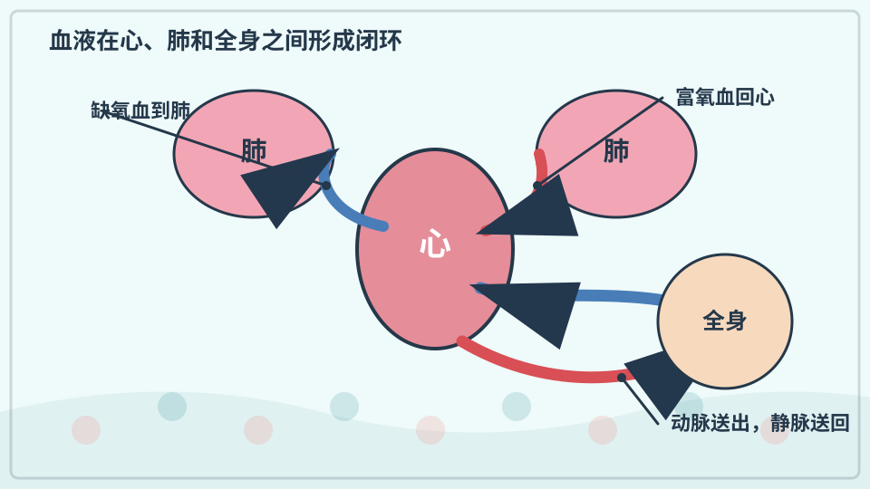

血液把氧气和营养送到细胞，也带走二氧化碳和一些废物。红细胞、白细胞、血小板和血浆各有任务。血管像遍布身体的运输网络。

**再想一步：** 红细胞里的血红蛋白能结合氧气；白细胞参与免疫防御；血小板和凝血蛋白帮助止血。动脉和静脉按血流离开心脏或回到心脏来命名，不只按颜色或含氧多少。

**把知识连起来：** 血液把氧、养分、激素和热量送往组织，又带走二氧化碳和部分代谢产物。动脉把血带离心脏，静脉送回血液，毛细血管的薄壁负责与细胞交换。右心与肺循环、左心与体循环构成相连的闭环。

**再往外看：** 红细胞、白细胞、血小板和血浆承担不同任务；血流分配还会随运动、消化与温度改变。

**容易弄混：** 动脉不等于永远装富氧血，静脉也不等于蓝色。肺动脉与肺静脉是重要例外，皮下静脉看蓝主要来自光与组织的作用。

**一起看看：** 观察手背上淡淡的血管，不用按压或扎破皮肤。

---

### 第 160 问｜肺像两个气球吗？

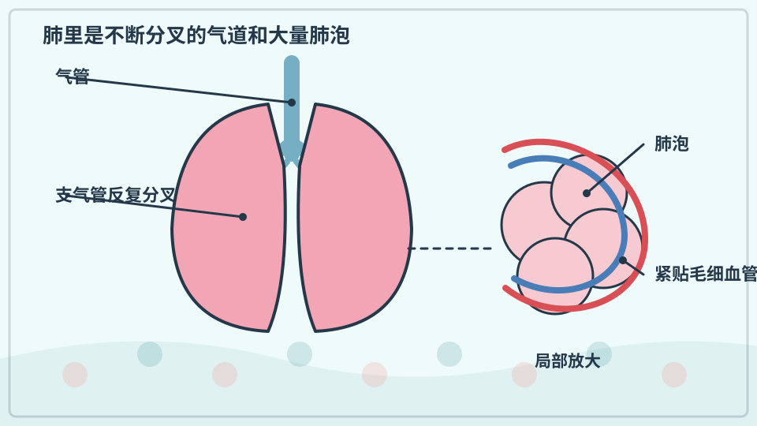

肺会随胸腔扩大而充气，看起来有点像气球，却不是空空的袋子。里面的气道不断分叉，末端是许多微小肺泡。氧气在肺泡进入血液，二氧化碳从血液进入肺泡。

**再想一步：** 大量肺泡提供很大的交换面积，薄薄的肺泡壁让气体容易扩散。肺自己没有把空气“吸进来”的大肌肉，主要靠膈肌和胸壁改变胸腔压力。

**把知识连起来：** 肺并非两个空袋，而是气管反复分叉形成支气管和细支气管，末端连着大量肺泡。肺泡薄壁紧贴毛细血管，让氧和二氧化碳按浓度差扩散；弹性组织和表面活性物质帮助肺泡张开与回缩。结构像树枝末端挂着密集小囊。

**再往外看：** 左右肺叶数和形状不完全相同，为心脏等器官留出空间。显微图与胸部影像展示的是不同尺度。

**容易弄混：** 肺不像气球由自己吹大，也不是吸气时空气直接进入血管。胸腔压力使空气流动，气体再跨过肺泡薄膜交换。

**一起呼吸：** 把手放在胸口和肚子上，感受轻松呼吸时哪里起伏。

---

### 第 161 问｜吸气时肚子为什么会鼓？

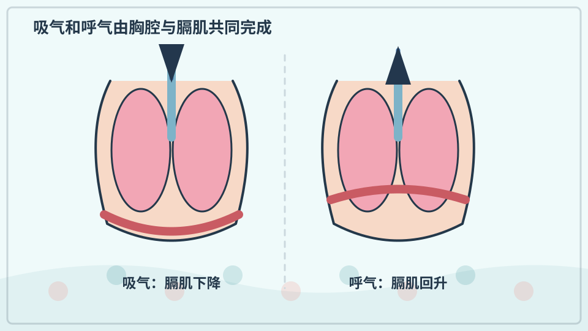

胸腔下方有一片圆顶形肌肉，叫膈肌。吸气时它收缩向下，胸腔变大，空气进入肺；腹部器官被轻轻推开，肚子就可能鼓起。呼气时过程相反。

**再想一步：** 空气从压力较高处流向较低处。膈肌不是把空气直接拉进肺，而是改变胸腔体积和压力；肋间肌也会参与。

**把知识连起来：** 吸气时膈肌收缩下移，外肋间肌帮助胸腔扩大，肺内压力降低，空气流入。腹腔器官被膈肌轻推向下前方，腹壁便可能鼓起；呼气时过程大致反向。腹部动作是胸腹空间相互配合的外在表现。

**再往外看：** 婴幼儿的腹式动作常更明显，运动、姿势和呼吸训练也会改变胸腹参与比例。

**容易弄混：** 肚子鼓不是空气跑进胃里，也不能仅凭外观看出肺有没有问题。呼吸困难、发绀或异常喘息需要及时求助。

**一起呼吸：** 平静吸三次气，不比赛憋气或大口过度呼吸。

---

### 第 162 问｜为什么会打嗝？

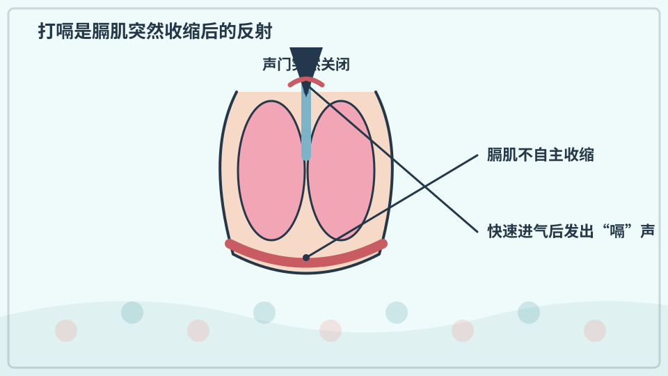

打嗝时，膈肌突然不由自主地收缩，空气快速进入。喉咙里的声门随即关闭，便发出“嗝”的声音。吃太快、喝气泡饮料或温度变化都可能触发。

**再想一步：** 打嗝是一种反射，神经回路不需要我们先决定。多数会自行停止；若持续很久、影响吃饭呼吸或让人不舒服，应告诉大人并咨询医生。

**把知识连起来：** 膈肌突然不自主收缩，会让空气快速吸入；紧接着声门关闭，产生“嗝”的声音。吃得快、胃扩张、温度刺激或兴奋都可能触发相关神经回路。多数短暂打嗝会自行停止。

**再往外看：** 膈神经、迷走神经和脑干回路参与打嗝，持续很久的异常打嗝则可能需要医疗评估。

**容易弄混：** 打嗝不是胃里气泡直接从嘴里爆出来，那更接近打饱嗝。不要用憋气、惊吓或吞咽危险物品的方法强行停止。

**一起试试：** 慢慢呼吸、安静等待，不尝试危险的憋气或惊吓办法。

---

### 第 163 问｜大脑在头里做什么？

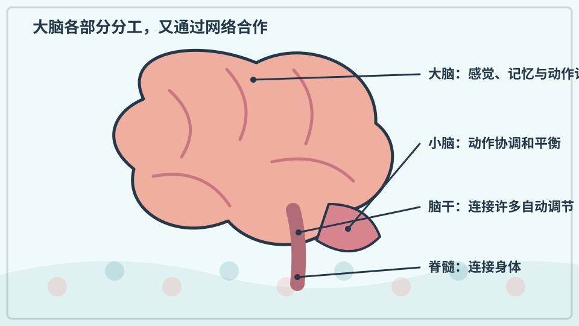

大脑接收眼、耳、皮肤等送来的信息，参与思考、记忆、感觉和动作。它也和脑干一起调节呼吸、睡眠等许多自动工作。不同区域合作完成任务。

**再想一步：** 大脑由大量神经元和支持细胞组成，神经元用电和化学信号交流。不能把每种能力简单锁进一个孤立“小抽屉”，脑网络会随学习和经验改变。

**把知识连起来：** 大脑接收感官信号、形成记忆与预测，并通过脊髓和神经控制动作、器官调节与行为。不同区域有较强分工，却通过网络持续协作；睡觉时也在整理信息和维持身体。学习会改变神经连接强度。

**再往外看：** 脑科学结合行为实验、损伤观察、电信号和成像研究功能，没有一张彩色脑区图能解释全部思想。

**容易弄混：** 大脑不是只用到百分之十，也不是每种情绪只住在一个小格子。复杂功能来自分布网络，简单左右脑性格说法通常过度夸张。

**一起想想：** 闭眼听一个声音，说说大脑用了哪些线索猜它是什么。

---

### 第 164 问｜手碰到烫东西为什么会缩回？

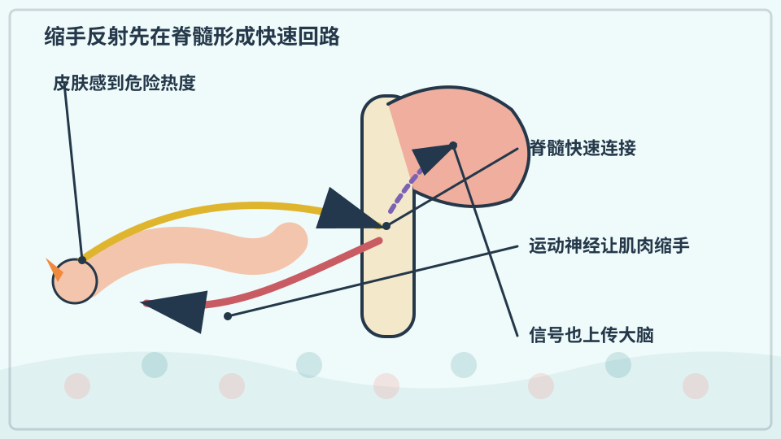

皮肤感受危险热度后，神经把信号送进脊髓。脊髓很快让手臂肌肉缩回，同时信息也传到大脑，我们才清楚感到疼。这个快速反应叫反射。

**再想一步：** 反射弧缩短了等待大脑详细判断的时间，却不保证完全避免受伤。温度感觉也会被环境影响，因此不能用手试探热水、炉具或电器。

**把知识连起来：** 皮肤感受器检测到可能伤害组织的高温后，信号沿感觉神经进入脊髓；脊髓中的连接神经元迅速激活运动神经，让肌肉缩手。与此同时信号也上传大脑，形成疼痛感觉并帮助学习避险。快速回路与意识判断并行。

**再往外看：** 医生会检查不同反射来了解神经通路，但反射强弱受年龄、姿势与注意影响，需要专业解释。

**容易弄混：** 缩手不是信号完全绕过大脑，也不表示摸到任何温暖物体都会反射。危险强度、感受器和神经回路共同决定反应。

**一起记住：** 任何烫伤都立刻告诉大人，不自行涂抹不明东西。

## 单元综合观察｜画一张抬手合作图

慢慢抬起一只手，连接皮肤感觉、肌肉、骨骼、关节、心肺和大脑中参与的部分。连线表示合作，不冒充真实血管或神经走向。
