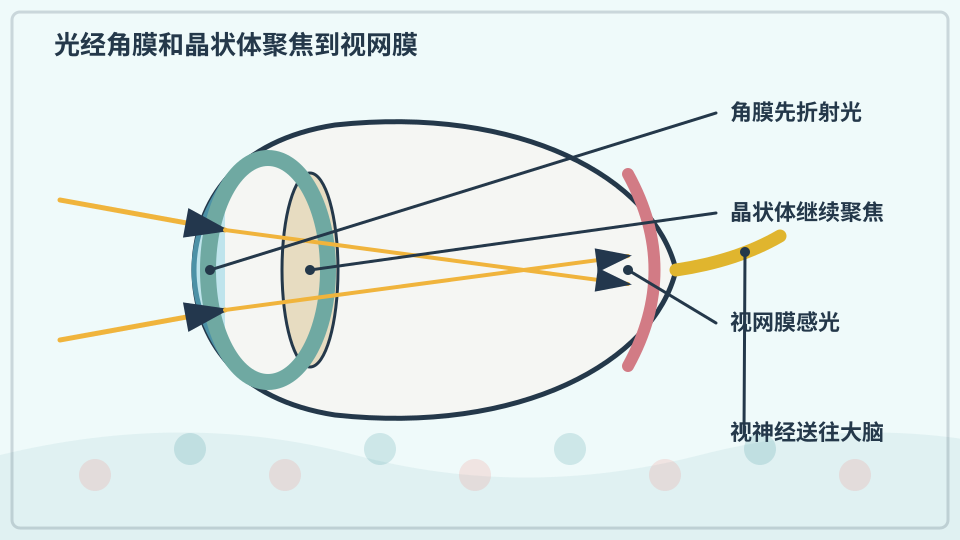
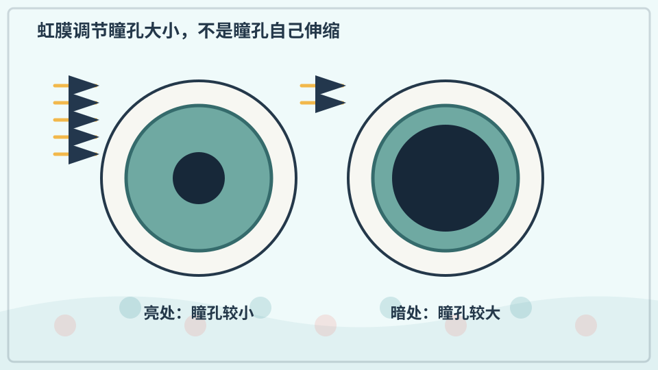
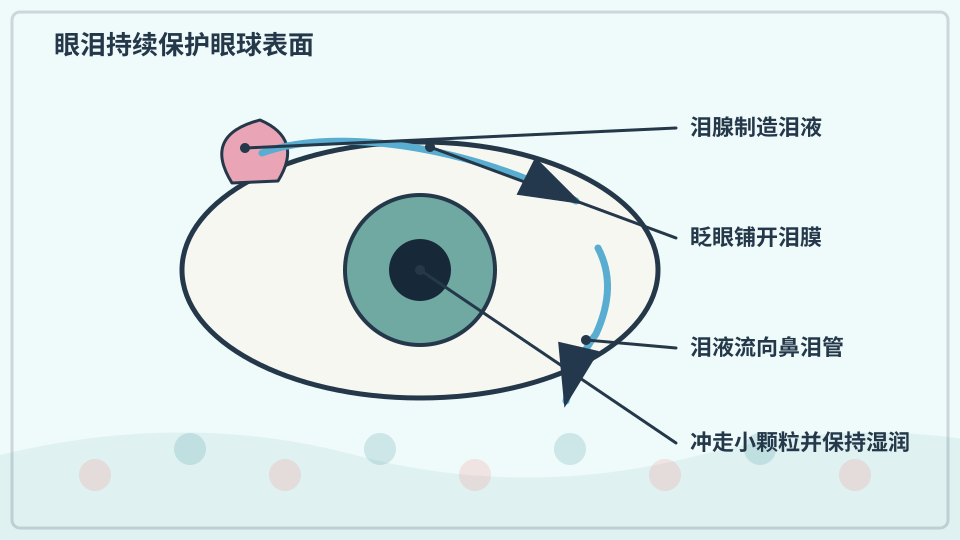
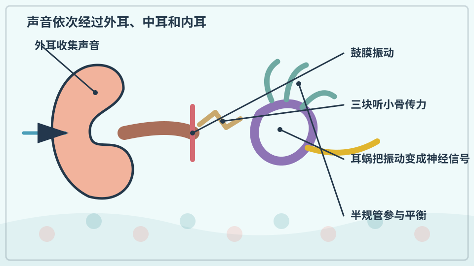
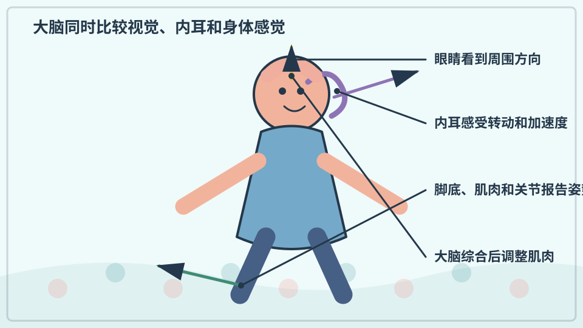
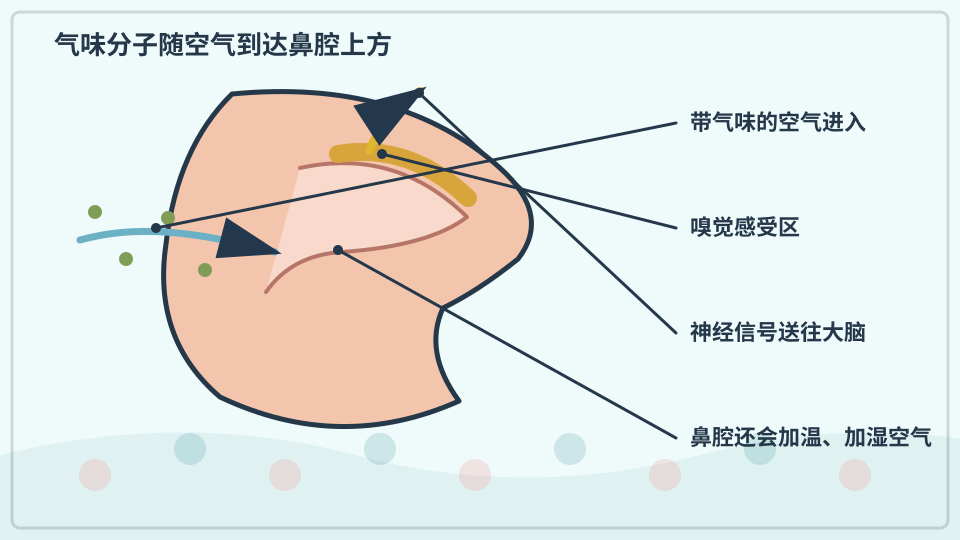
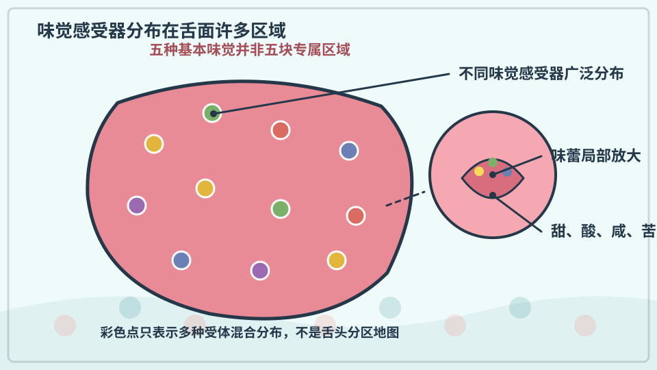
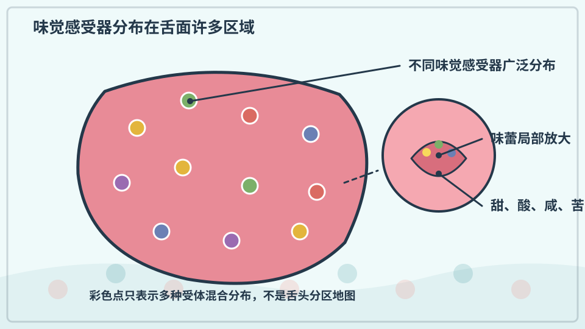

# 兴趣单元 18｜眼、耳、鼻、舌与平衡

> **探索领域 06：** 人体与感觉
>
> **核心问题：** 光、声音、气味分子和身体运动怎样变成我们感受到的世界？

眼睛和耳朵把不同物理刺激转成神经信号，鼻舌识别分子，平衡则依靠视觉、内耳与身体感觉共同工作。

## 怎样沿着本单元的追问链阅读

感觉不只发生在器官表面；大脑会比较、筛选和解释收到的信息。

## 追问链 18.1｜视觉、听觉与平衡

聚焦、瞳孔、眼泪、声振动和多路姿势信号共同保护并形成感觉。

### 第 165 问｜眼睛怎样看见东西？

物体反射的光进入眼睛，角膜和晶状体把光聚在视网膜上。视网膜的感光细胞把光变成神经信号。大脑再把两只眼和过去经验的信息组合成我们看见的世界。

**再想一步：** 视网膜上的像在几何上是倒立的，但大脑不是简单把一张照片翻转，而是持续解释方向、边缘、颜色和运动。看见是眼睛与大脑共同完成的过程。

**把知识连起来：** 物体反射或发出的光先经角膜折射，再由晶状体微调焦距，在视网膜形成倒立光学像。视杆和视锥细胞把光转成电化学信号，视网膜先处理一部分信息，再经视神经送入大脑。看见是眼与脑共同完成的推断。

**再往外看：** 双眼视差、运动、阴影和已知大小帮助判断深度；错觉则揭示大脑的推断规则在特殊图案中会被误导。

**容易弄混：** 眼睛不是小相机把完整照片直接传给大脑，视网膜上的像也不会让我们感觉世界倒置。神经系统从多种线索构建稳定知觉。

**一起看看：** 遮住一只眼再换另一只，比较近处物体位置有没有微小变化。

---

### 第 166 问｜瞳孔为什么会变大变小？

瞳孔是虹膜中央让光通过的开口。亮处虹膜肌肉让瞳孔缩小，暗处让它扩大，调节进入眼睛的光量。变化需要一点时间。

**再想一步：** 瞳孔反射由神经系统自动控制，两眼通常一起响应。瞳孔也会受距离、情绪和药物影响，不能只用大小判断一个人的感受或健康。

**把知识连起来：** 虹膜中的肌肉改变瞳孔大小，亮处缩小以减少入眼光并提高一定景深，暗处放大以接收更多光。自主神经、注意、情绪和某些药物也会影响大小。左右瞳孔通常协调反应。

**再往外看：** 医生用瞳孔对光反应检查眼、视神经和脑干部分通路，但要结合其他体征。

**容易弄混：** 瞳孔不是眼球上的黑色颜料点，而是让光进入眼内的开口；它放大也不能让人在全黑中看见，因为仍需要光。

**一起看看：** 只观察普通室内明暗变化，不用强光照眼睛。

---

### 第 167 问｜眼泪只有伤心时才有吗？

眼睛平时一直覆盖着薄薄的泪膜，帮助保持湿润、冲走小灰尘。刺激和强烈情绪会让泪液增加。眨眼把泪膜重新铺匀。

**再想一步：** 泪膜含水、油脂和黏液等成分，分别帮助润湿、减慢蒸发和贴附眼表。泪液最后可经泪道流进鼻腔，所以哭时鼻子也常流液体。

**把知识连起来：** 泪腺持续产生基础泪液，眨眼把它铺在角膜表面，提供润滑、营养和部分抗微生物保护；灰尘或刺激会引起更多反射泪，强烈情绪也能启动泪液分泌。泪水再经泪道流向鼻腔。三类流泪共享部分装置。

**再往外看：** 泪膜包含油脂、水液和黏蛋白层，任一层失衡都可能造成干涩。眼睛持续疼痛或受化学品刺激需立即冲洗并求助。

**容易弄混：** 没有流泪不表示不伤心，流泪也不一定来自情绪。身体反应和感受不能用一滴眼泪简单判断。

**一起眨眼：** 慢慢眨几次，感觉眼皮怎样扫过眼球表面。

---

### 第 168 问｜耳朵怎样把声音送进大脑？

外耳收集空气振动，振动让鼓膜和中耳小骨运动。内耳耳蜗里的液体和感受细胞再把振动变成神经信号。大脑根据这些信号认出声音。

**再想一步：** 耳蜗不同位置对不同频率较敏感，像把复杂声音分开分析。过强声音会损伤细小感受细胞，而且损伤常难以恢复，所以要保护听力。

**把知识连起来：** 声波使鼓膜振动，三块听小骨把振动传到内耳；耳蜗液体运动弯曲毛细胞，毛细胞把机械变化转成神经信号。不同位置对不同频率反应较强，大脑再比较强度、时间和双耳差异。外耳到大脑是一条逐级转换链。

**再往外看：** 耳蜗也会受到过强声音损伤，毛细胞在人体中恢复能力有限。控制音量和暴露时间比等到耳痛更重要。

**容易弄混：** 声音不是小物体钻进耳朵，也不是耳廓单独完成听觉。介质振动、机械传递、感受细胞与大脑解释缺一不可。

**一起听听：** 找远近两种轻声，比较响度，不把声音贴近耳朵播放。

---

### 第 169 问｜闭眼站立为什么更容易晃？

保持平衡要综合眼睛、内耳和肌肉关节的信号。内耳的半规管感受头部转动，另外的小囊感受直线加速和重力。闭眼后少了一组线索，身体可能更晃。

**再想一步：** 大脑会比较多路信号并及时调整腿和躯干肌肉。坐车晕动可能来自视觉和内耳报告的运动不一致，但每个人敏感程度不同。

**把知识连起来：** 保持站立时，大脑比较眼睛看到的环境、内耳前庭检测到的头部运动，以及肌肉关节提供的身体位置。闭眼后少了一路重要参考，其他信号中的小误差更明显，肌肉便需要更频繁修正。脚底接触和注意力也会影响晃动。

**再往外看：** 航天、潜水和某些虚拟现实环境会让感觉线索互相矛盾，引起眩晕或运动病。

**容易弄混：** 闭眼晃动不表示耳朵坏了，也不能用危险单脚站立自行诊断平衡能力。必须在大人保护和安全地面上做短暂比较。

**一起试试：** 由大人扶着，在安全平地双脚站稳，短暂闭眼感受变化。

## 追问链 18.2｜嗅觉与味觉

气味和食物分子与感受器作用，舌面并没有严格分开的味觉地图。

### 第 170 问｜鼻子怎样闻到香味？

空气中的气味分子进入鼻腔，碰到嗅觉受体。不同分子让不同受体组合发出信号，大脑把组合认成花香、食物味或烟味。鼻塞时气味较难到达受体。

**再想一步：** 嗅觉与记忆、情绪和味觉联系紧密，同一种气味也会因经验而有不同感受。闻到煤气、烟或刺鼻化学味时，应离开并立刻告诉大人。

**把知识连起来：** 挥发性分子随空气进入鼻腔，溶在黏液后与不同嗅觉受体结合；每种气味会激活一组受体模式，大脑把模式与记忆、情境和味觉整合。连续闻同一气味时，感受可能适应而变弱。鼻腔气流形状也影响分子到达。

**再往外看：** 动物的受体种类和鼻腔结构差异很大，嗅觉还能用于寻找食物、同伴与危险。医学也研究嗅觉变化与感染或神经疾病。

**容易弄混：** 气味不是物体颜色一样远距离直接被看见，它需要分子到达受体；“闻不到”也不保证没有有害气体，有些气体本来无味。

**一起闻闻：** 只闻大人确认安全的橘皮和香草，不直接闻清洁剂。

---

### 第 171 问｜舌头能尝到哪些味道？

味蕾能感受甜、酸、咸、苦和鲜等基本味道。食物的“风味”还来自鼻子的气味、温度和口感。嚼东西时，气味会从口腔后方进入鼻腔。

**再想一步：** 味觉细胞上的受体对不同化学物质作出反应，再经神经传给大脑。辣主要是痛觉和温度感受器被刺激，不是一种基本味道。

**把知识连起来：** 味蕾中的感受细胞能响应甜、酸、咸、苦、鲜等基本味质，食物香气则从口腔后方进入鼻腔，和温度、质地、刺激感共同形成风味。大脑把多路信号组合，所以鼻塞时食物常显得寡淡。不同味质可提示能量、盐、酸度或某些潜在有害物。

**再往外看：** 脂肪、金属味和水的感受机制仍有研究，基本味分类也会随证据细化。文化和学习强烈影响喜欢什么。

**容易弄混：** 辣主要激活温痛相关感受器，不是传统基本味；“舌头尝一切、鼻子只闻香”也过于简单，风味是多感官结果。

**一起试试：** 吃熟悉安全的食物时捏住鼻子一下，再放开比较风味。

---

### 第 172 问｜舌头每一块只尝一种味吗？

不是。舌头许多区域都能感受多种基本味道，只是敏感程度可能略有不同。课本里把甜、咸、酸、苦画在固定区域的“舌头地图”过于简单。

**再想一步：** 味蕾也分布在口腔其他部位，而味觉信号最后由大脑综合。科学图示为了清楚会简化，但简化图若被当成严格边界，就会制造误解。

**把知识连起来：** 舌面不同区域都分布着多种味蕾，只是敏感度可能略有差别，并不存在互不重叠的甜酸苦咸小岛。味觉神经从多个口腔区域传递信息，大脑再综合。经典舌头地图来自早期数据被过度简化。

**再往外看：** 让安全食物溶液轻触舌面只能体验整体差异，不能作为精确医学实验；科学测量需要控制浓度、温度和顺序。

**容易弄混：** 舌尖并非只能尝甜，舌根也不是只能尝苦。图解为了简便画出的区域不能被当作真实器官边界。

**一起想想：** 为什么一张容易记的图，也可能不是完整事实？

## 单元综合观察｜比较闭眼前后的平衡线索

由大人守在旁边，双脚自然站立，短暂比较睁眼和闭眼时身体微小晃动。不要单脚站、不要靠近台阶；讨论大脑少了一路视觉信息后为何要依赖其他线索。
