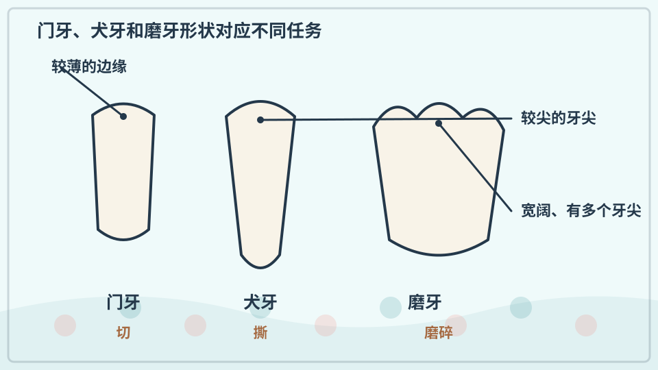
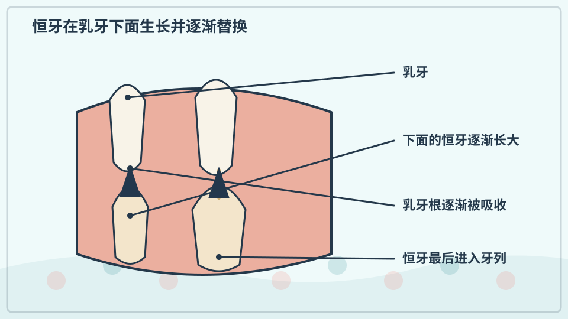
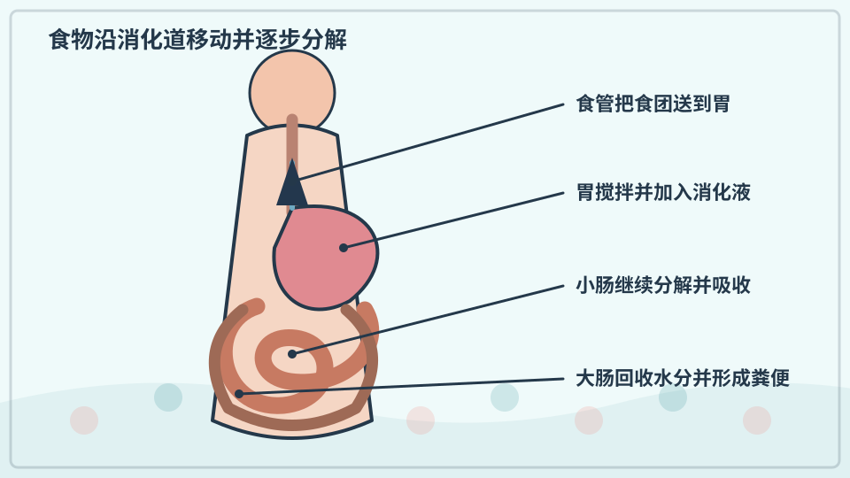
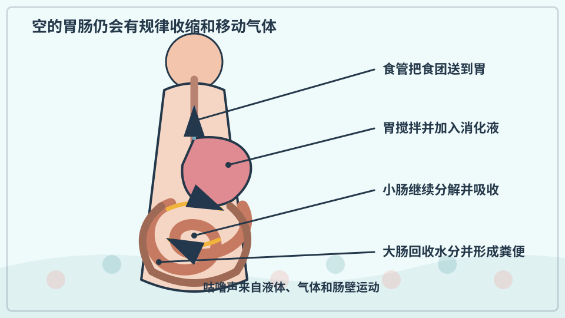
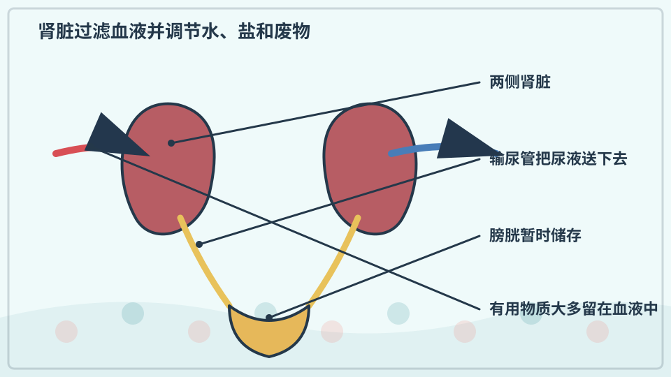
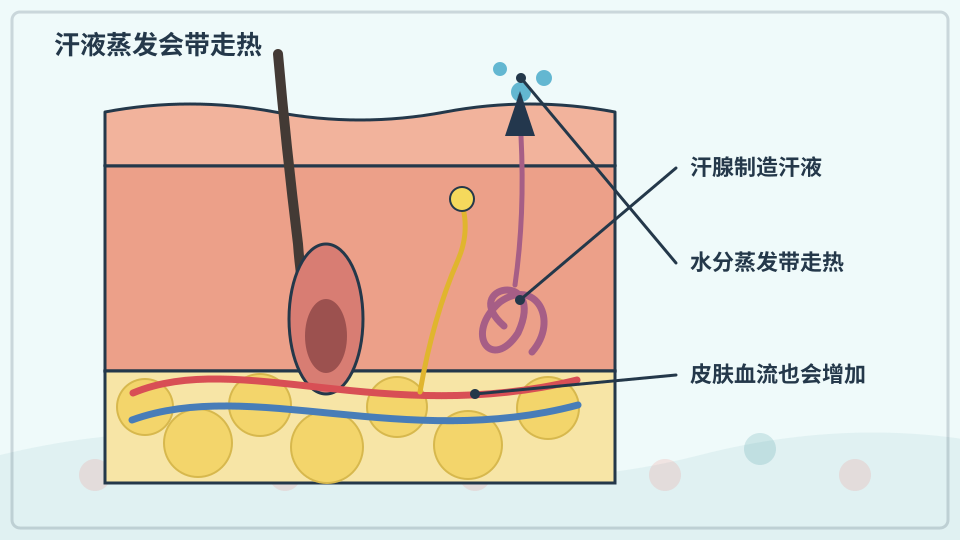
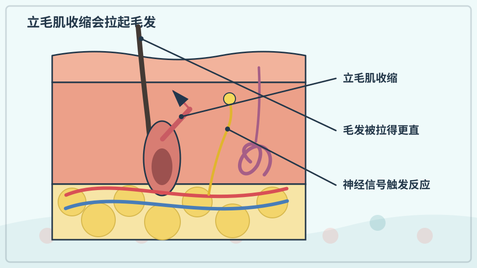
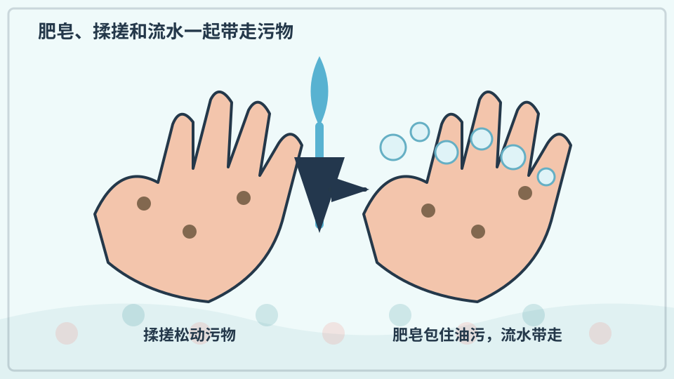
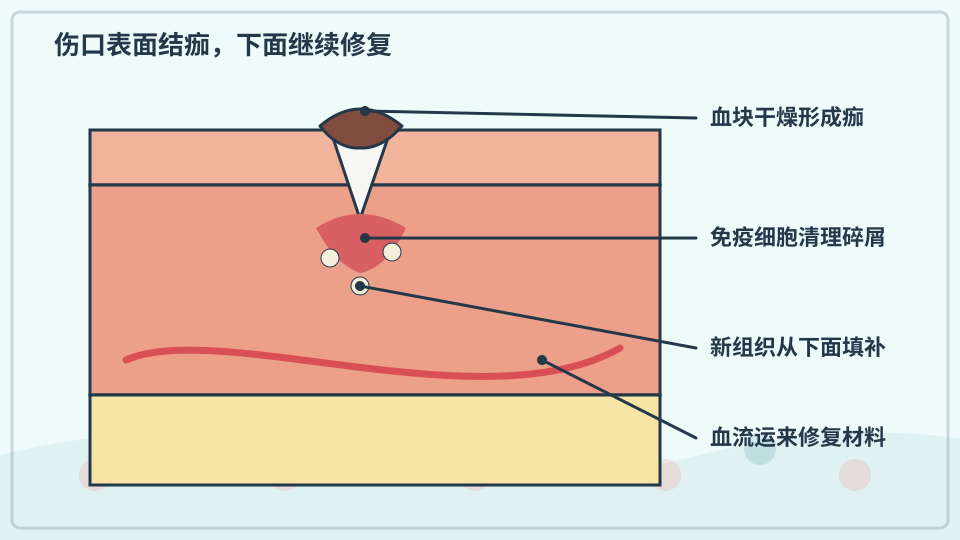

# 兴趣单元 19｜进食、排泄、体温与修复

> **探索领域 06：** 人体与感觉
>
> **核心问题：** 身体怎样处理食物和废物、调节冷热，并修补受损的表面？

牙齿与消化道处理食物，肾脏形成尿液，汗液和血流参与调温，洗手与结痂展示防护和修复。

## 怎样沿着本单元的追问链阅读

健康页面解释一般机制，不用来给孩子自行诊断，也不把正常身体差异说成错误。

## 追问链 19.1｜牙齿与消化

不同牙形帮助切咬研磨，食物再经过胃肠和消化液分解与吸收。

### 第 173 问｜牙齿为什么有不同形状？

前面的门牙边缘适合切断食物，尖一些的犬牙帮助撕扯，后面的臼齿表面宽，适合磨碎。牙齿形状和位置配合咀嚼。舌头和颌肌也一起工作。

**再想一步：** 牙冠外层的牙釉质很硬，里面仍有牙本质、牙髓、血管和神经。硬不等于不会被酸侵蚀，所以刷牙和控制频繁含糖饮食很重要。

**把知识连起来：** 门齿边缘适合切断，犬齿较尖可撕扯，前磨牙和磨牙有较宽咬合面用于压碎研磨。上下颌运动、唾液和舌头把食物变成易吞咽的食团。牙形与食物处理任务相关，但一颗牙也会承担多种作用。

**再往外看：** 不同哺乳动物牙齿排列记录饮食与演化，化石牙因坚硬常保存下来，成为研究古动物的重要证据。

**容易弄混：** 尖牙不自动表示动物凶猛或只吃肉，人类犬齿也不是捕猎武器。判断食性要结合整副牙、颌运动和消化系统。

**一起看看：** 对镜子数一数前牙和后牙的形状，不用手抠牙龈。

---

### 第 174 问｜乳牙为什么会掉？

孩子长大时，颌骨变大，下面的恒牙逐渐发育。恒牙上移会让乳牙牙根被身体慢慢吸收，乳牙变松并脱落。空出的位置让更大的恒牙长出来。

**再想一步：** 乳牙帮助咀嚼、说话并为恒牙保留空间，也需要认真保护。换牙时间每个人不同，牙疼、受伤或生长异常应让牙医检查。

**把知识连起来：** 恒牙在乳牙下方发育并逐渐向上移动，乳牙牙根被细胞吸收，剩下牙冠失去牢固支撑后脱落。乳牙为幼小颌骨提供合适大小的咀嚼工具，也为恒牙保持空间。换牙是生长中的有序替换。

**再往外看：** 不同孩子换牙时间有正常差异，恒牙萌出方向和空间需要牙医按个体检查。

**容易弄混：** 乳牙不是因为用旧了才必然掉，也不该靠线或硬物强行拔。持续疼痛、外伤或异常松动应告诉照护者并看牙医。

**一起记住：** 每天由大人挤豌豆大小的含氟牙膏，帮助刷净每个牙面；刷后吐出，不吞咽。

---

### 第 175 问｜吃下去的食物去哪儿了？

牙齿先把食物弄碎，唾液开始分解一部分成分。食物经食管到胃，再进入小肠，营养大多在那里被吸收进血液。剩余物到大肠，最后排出身体。

**再想一步：** 消化既有咀嚼和搅拌这样的物理变化，也有酶把大分子拆小的化学变化。肝、胆囊和胰腺也会提供重要物质，不是只有一根管子在工作。

**把知识连起来：** 食物在口腔被咀嚼并与唾液混合，经食管蠕动进入胃；胃酸和酶继续处理，随后小肠完成大部分营养分解与吸收。肝、胆囊和胰腺提供重要分泌物，大肠回收较多水分并与微生物共同处理剩余物。路线是一套协作系统。

**再往外看：** 不同营养分子需要不同酶和运输方式，肠道微生物还能产生或改造部分物质。

**容易弄混：** 食物不是在胃里全部变成能量，也不会原样直接流进血管。大分子要先分解，不能吸收的部分继续形成粪便。

**一起说说：** 按顺序指出嘴、食管、胃、小肠和大肠的大概位置。

---

### 第 176 问｜肚子饿时为什么咕噜响？

胃和肠的肌肉会一阵阵收缩，推动里面的液体和气体。空腹时，没有很多食物挡住声音，我们更容易听见咕噜声。吃饱后肠胃也会发声。

**再想一步：** 消化道这种波浪式收缩叫蠕动，受肌肉、神经和激素共同控制。咕噜声本身不总表示饥饿，也不能单靠声音判断生病。

**把知识连起来：** 胃和小肠即使空着也会周期性收缩，把残余内容物和分泌物向前推；气体和液体被挤动时会产生咕噜声。饥饿相关激素和大脑信号可能让这些运动更明显，但有声音不一定代表必须立刻进食。消化道一直在活动。

**再往外看：** 医生听肠鸣音只获得有限线索，还要结合疼痛、排便和其他检查。

**容易弄混：** 咕噜声不是肚子里住着会叫的小动物，也不等于胃在互相摩擦。持续剧痛、呕吐或腹胀不能靠吃东西自行解决。

**一起听听：** 安静时听一会儿肚子，不用故意饿自己。

## 追问链 19.2｜排泄、调温、清洁与结痂

肾脏、汗腺、血流、毛囊反应和凝血修复共同维持内部环境。

### 第 177 问｜身体为什么要制造尿液？

肾脏不停过滤血液，调节水、盐和酸碱，并把一些废物装进尿液。尿液沿输尿管进入膀胱储存，再排出身体。颜色会随喝水和其他因素变化。

**再想一步：** 肾脏不是简单筛子，它会把身体需要的水和小分子重新吸收，也会主动分泌一些物质。排尿疼痛、很久没有尿或颜色异常时，应告诉大人。

**把知识连起来：** 肾脏让血液经过微小过滤单位，先滤出水和小分子，再把身体需要的大部分水、盐和养分回收。剩余尿素、多余离子和水形成尿液，经输尿管进入膀胱。这个过程调节体液成分，而不只是倒掉脏水。

**再往外看：** 尿量和颜色会受饮水、食物、药物、运动和疾病影响，单次观察不能代替医学检查。

**容易弄混：** 尿液不是血液直接变黄后流出，也通常不是无菌与否可以靠外观看出。排尿疼痛、明显血色或长期异常应告诉大人。

**一起说说：** 身体发出尿意时及时告诉大人，不长时间憋尿。

---

### 第 178 问｜热的时候为什么会出汗？

体温升高时，汗腺把含水的汗液送到皮肤表面。汗蒸发需要吸收热量，于是皮肤和流经附近的血液会冷却。空气很潮湿时，汗较难蒸发，人会更闷热。

**再想一步：** 大脑中的体温调节中枢比较身体温度，并控制出汗和皮肤血流。大量出汗会丢失水和盐，炎热中要由大人安排饮水、休息和降温。

**把知识连起来：** 体温升高时，汗腺把含水液体送到皮肤表面；水蒸发需要能量，会从皮肤带走热。皮肤血管扩张也把较多热量送到表面。湿度高时蒸发变慢，所以流很多汗也可能不够凉。

**再往外看：** 不同部位和个体出汗量不同，运动员会随热适应改变汗液盐分。补水需求应按活动和专业建议判断。

**容易弄混：** 汗本身流出来并不会自动降温，真正重要的是蒸发；把汗捂在不透气衣物里反而可能妨碍散热。

**一起看看：** 运动后在阴凉处观察汗从哪里出现，随后擦干补水。

---

### 第 179 问｜冷的时候为什么起鸡皮疙瘩？

每根汗毛附近有小肌肉。寒冷或强烈情绪让这些肌肉收缩，毛竖起来，皮肤表面出现小凸起。这个反应不由我们直接控制。

**再想一步：** 毛很多的动物竖毛能夹住更厚空气层，也能让身体显得更大。人类体毛较少，保温效果有限，但这套祖先留下的反射仍保留着。

**把知识连起来：** 皮肤中的立毛肌收缩会把毛发竖起并拉出小凸起。多毛哺乳动物能借竖毛留住更厚空气层，人类毛发稀少，保温作用已很有限；同一反应也会被强烈情绪触发。它是祖先调节系统保留下来的动作。

**再往外看：** 神经系统的交感反应还能同时改变心率、血流和汗腺活动，鸡皮疙瘩只是外面容易看到的一部分。

**容易弄混：** 起鸡皮疙瘩不是皮肤里真的长出鸡皮，也不表示身体一定已经危险失温。环境、情绪和个体差异都会触发它。

**一起看看：** 冷时先穿衣保暖，不故意挨冻来制造鸡皮疙瘩。

---

### 第 180 问｜为什么要用肥皂洗手？

手会碰到看不见的微生物、灰尘和油污。肥皂与搓洗让它们从皮肤上松开，再被流水带走。吃东西前、上厕所后和户外活动后洗手，能减少病菌传播。

**再想一步：** 肥皂能破坏一些有包膜微生物的外层，也能把油污包进微小团块。机械摩擦、足够覆盖、冲洗和擦干都重要；湿手还更容易把微生物传到物体上。

**把知识连起来：** 肥皂分子一端容易与水相处，另一端更容易靠近油脂；揉搓时它们包围皮脂、污物和部分微生物，流水再把这些小团带走。机械摩擦、足够时间和彻底冲洗与肥皂化学共同起作用。洗手是在降低数量和传播机会，不是把手变成无菌。

**再往外看：** 普通肥皂对许多有脂质外膜的病毒有效，但不同病原体和污染物处理方式不同。医疗场景会使用更严格消毒流程。

**容易弄混：** 泡沫多不一定洗得更干净，抗菌字样也不自动优于普通肥皂。误食清洁剂或进入眼睛应立即告诉大人并按产品说明处理。

**一起洗手：** 和大人做“打湿、抹皂、搓洗、冲净、擦干”五步。

---

### 第 181 问｜伤口为什么会结痂？

皮肤破损后，血小板和凝血蛋白先形成凝块，帮助止血。表面的血液和组织液干燥后形成痂，下面的新细胞慢慢修补。痂像临时保护盖，不需要主动撕掉。

**再想一步：** 修复还包括炎症、长出新组织和重新排列胶原等阶段。发红、温热和轻微肿胀可参与正常修复，但持续加重、流脓、剧痛或深伤口要让大人和医生处理。

**把知识连起来：** 皮肤破损后血小板聚集，凝血蛋白形成纤维网，血块干燥后成为保护表面的痂。下面的免疫细胞清除碎屑，新皮肤和结缔组织逐步填补缺口；修复成熟后痂自然脱落。结痂是过程的一部分，不是完整修复本身。

**再往外看：** 伤口深度、位置、感染和个体健康会影响愈合速度与疤痕。保持清洁和适当湿润的护理应遵循专业建议。

**容易弄混：** 抠掉痂不会让新皮肤更快长好，反而可能重新出血和增加感染。深伤口、动物咬伤或持续红肿发热应让大人处理并求医。

**一起记住：** 受伤立刻告诉大人，清洁和包扎由大人决定。

## 单元综合观察｜追踪一口食物的路线

选择孩子熟悉且安全的食物，只用图画标出口腔、食管、胃和肠的先后。不要把活动变成进食比赛；疼痛、误吞或过敏疑虑应立即告诉照护者并寻求专业帮助。
