# 兴趣单元 20｜杠杆、轮子、齿轮与弹性

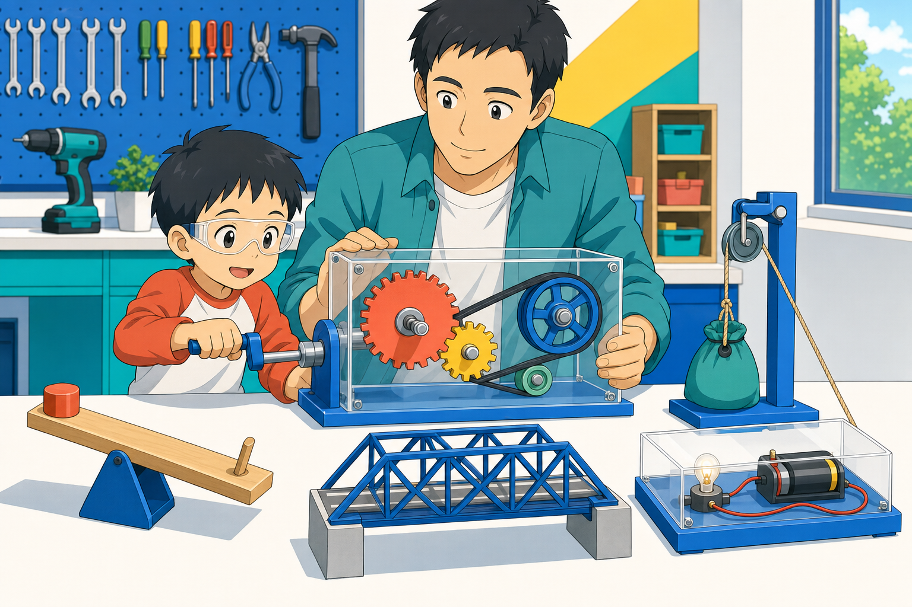

> **探索领域 07：** 工具、机器与工程
>
> **核心问题：** 简单机械怎样交换力、距离和方向，把人的动作传到物体？

杠杆、滑轮、轮轴、齿轮、链条、螺旋、楔、斜面和弹性结构组成一套追踪运动与作用力的语言。

## 怎样沿着本单元的追问链阅读

机器不凭空制造能量；较小的力通常要用更长距离、更多时间或不同方向来交换。

## 追问链 20.1｜机器、杠杆、滑轮与轮子

支点、绳段和滚动接触改变施力方式与阻力。

### 第 182 问｜什么东西算机器？

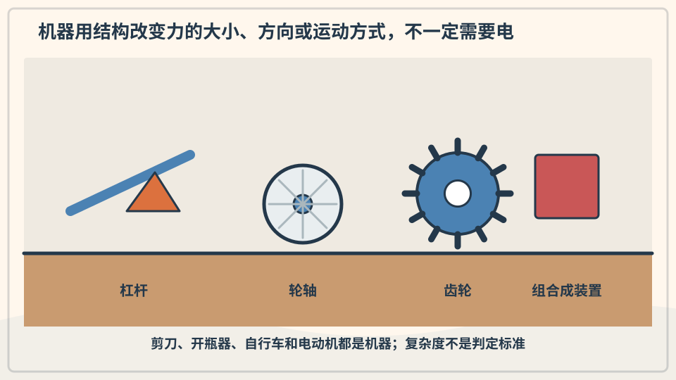

机器能传递或改变力和运动，帮助我们完成工作。剪刀、滑轮和自行车是机器，复杂机器人则由许多机器部件组成。机器不能凭空创造能量。

**再想一步：** 物理里的功与力让物体移动的距离有关。理想机器可以用较小的力走较长距离，换取较大的力走较短距离；真实机器还会因摩擦损失一部分能量。

**把知识连起来：** 机器是把输入的力、运动或能量按某种结构转换成输出的装置，可以简单到杠杆，也可以由马达、传感器和程序组成。判断一件东西是不是机器，要追踪它怎样传递作用，而不只看有没有电或按钮。工具与机器的边界有时取决于讨论目的。

**再往外看：** 同一把剪刀既可叫工具，也能作为两个杠杆与楔形刀刃组成的机器来分析。工程分类服务于理解和设计，不一定只有一个名字。

**容易弄混：** 机器不会凭空产生能量，也不是越复杂越先进。一个简单斜面若更可靠、更安全，就可能比复杂装置更适合任务。

**一起找找：** 在房间里找三样会转、会拉或会推的机器，只观察不拆开。

---

### 第 183 问｜杠杆怎样让力气变大？

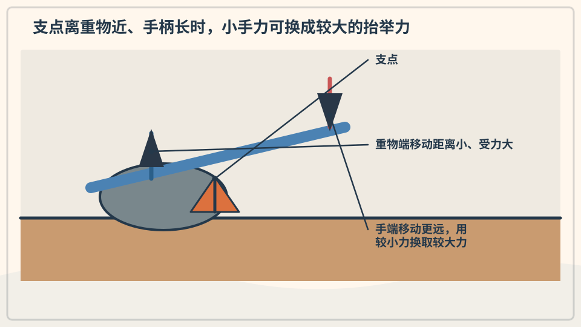

杠杆是一根能绕支点转动的硬杆。手离支点较远时，用较小的力移动较长距离，就能让靠近支点的重物受到较大的力。开瓶器和跷跷板都用到杠杆。

**再想一步：** 力乘以它到支点的垂直距离叫力矩。杠杆平衡时，两边力矩相等；改变支点位置，就改变了省力多少和移动多少。

**把知识连起来：** 杠杆绕支点转动，作用效果取决于力与支点距离的乘积，也就是力矩。把手放得离支点更远，可以用较小力矩来源平衡较大的近端负载，但手要移动更长路径。人体骨骼、开瓶器和撬棍都在做这种交换。

**再往外看：** 一级、二级和三级杠杆按支点、用力点和负载位置分类，各自在方向、力量或速度上有不同优势。

**容易弄混：** 杠杆不是把能量放大；省力通常换来更长移动距离。若支点或材料承受不了，长杠杆仍会弯曲或断裂。

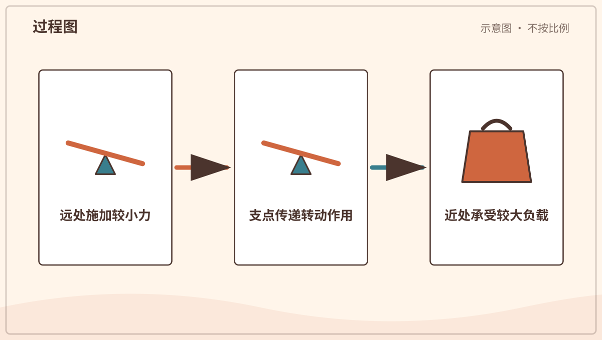

*图解：杠杆绕支点转动；离支点更远处用力，可以用较小的力产生足够力矩。*

**一起试试：** 用尺子和橡皮做小杠杆，只推轻软物，不撬重物。

---

### 第 184 问｜跷跷板怎样坐得平？

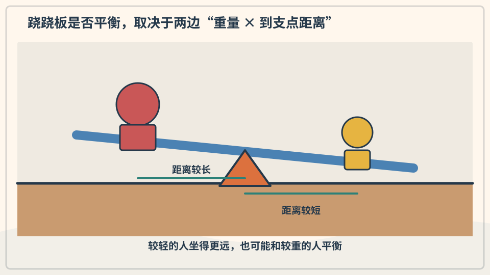

跷跷板以中间支点为轴。较重的人坐得靠近支点，较轻的人坐得远一些，两边也可能平衡。重要的不只是谁重，还要看离支点多远。

**再想一步：** 两边的力矩相等时，转动效果互相抵消。若一边力矩更大，跷跷板会向那边转；运动中还要考虑速度、冲击和摩擦。

**把知识连起来：** 跷跷板两边能否平衡由重量和到支点的水平距离共同决定。较轻的人坐得远一些，产生的力矩可与较重的人靠近支点时相当。板自身重量和支点摩擦也会影响真实结果。平衡表示总转动力矩接近零。

**再往外看：** 天平、扳手和人体前臂都能用力矩分析，工程师还需考虑动态起伏而不只静止平衡。

**容易弄混：** 两边重量相同不保证平衡，位置同样重要；板水平也不表示两边完全没有力，而是相反转动作用互相抵消。

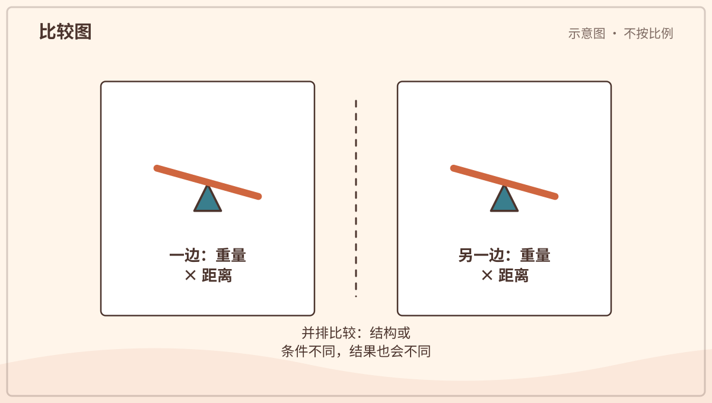

*图解：跷跷板是否平衡取决于两边的重量和它们到支点的距离。*

**一起记住：** 玩跷跷板要有大人照看，坐稳扶好，不突然跳下。

---

### 第 185 问｜滑轮为什么能帮忙提东西？

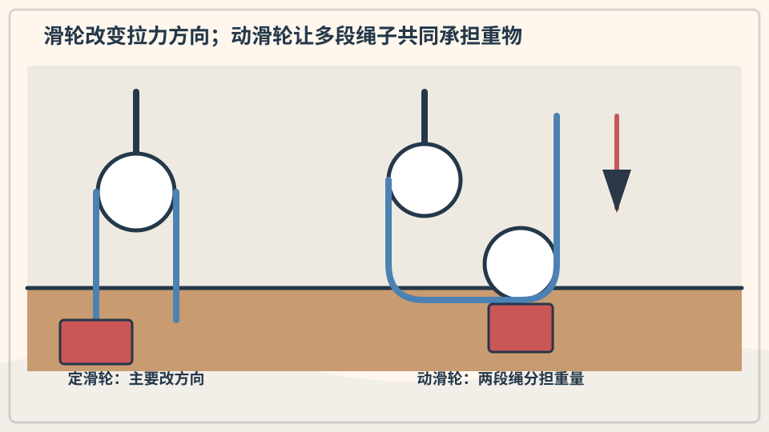

定滑轮能改变拉力方向，让人向下拉绳来提起物体。动滑轮和组合滑轮能让多段绳子共同托住物体。这样，每段绳需要承担的拉力就会减小。

**再想一步：** 省力的代价是要拉更长的绳。若有两段绳共同托住重物，理想情况下拉力约减半，但绳长要移动约两倍；真实系统还有摩擦。

**把知识连起来：** 定滑轮改变拉力方向，让人能向下拉来提升重物；动滑轮和滑轮组让多段绳共同承担负载，每段张力分担一部分重量。理想情况下省下多少力，就要多拉相应长度的绳。轴摩擦和绳重会降低实际效率。

**再往外看：** 起重机、电梯和帆船索具会组合滑轮、卷筒、制动和结构支撑，单看一个轮子无法说明整机安全。

**容易弄混：** 滑轮不是有一个就一定省力，定滑轮主要换方向。真实吊装也不能按简单分担自行操作，绳索额定载荷和连接方式必须由专业人员确定。

*图解：定滑轮主要改变拉力方向；多股绳共同承重时，每股绳分担一部分负载。*

**一起看看：** 只观察窗帘或晾衣架的滑轮，绳索不套身体。

---

### 第 186 问｜轮子为什么让东西更好推？

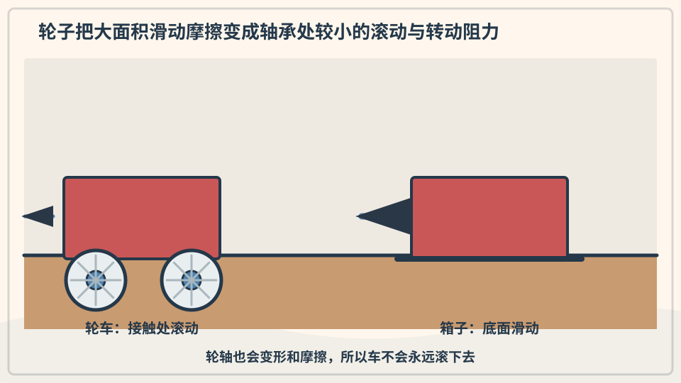

没有轮子时，箱子与地面滑动，摩擦常很大。轮子滚动时，接触处的形变和摩擦通常较小，所以更容易移动。车轴让轮子保持位置并传递转动力。

**再想一步：** 滚动阻力并不是零，它来自轮胎和地面变形、轴承摩擦与空气阻力。轮越大，越容易跨过同样大小的小坑，但也会改变重量和结构需求。

**把知识连起来：** 物体直接滑动时，接触面不断发生相对摩擦和形变；轮子转动后，接触点附近主要滚动，能量损失通常更小。轴承又把轴与轮之间的滑动变成更容易的滚动。轮径、地面软硬和载重都会改变阻力。

**再往外看：** 火车钢轮在钢轨上阻力小，自行车充气胎则在抓地、缓冲和损耗间折中。不同任务不会选择同一种轮。

**容易弄混：** 轮子并不消除摩擦；车辆加速、转弯和刹车正需要轮胎与地面的摩擦。阻力太小同样会失去控制。

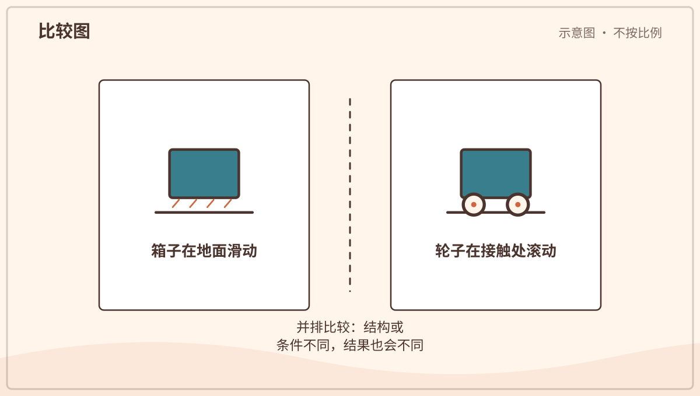

*图解：物体滑动时接触面持续摩擦；装上轮子后主要变成滚动，通常阻力较小。*

**一起看看：** 推一辆空玩具车，再轻轻拖同样重的积木，比比手感。

## 追问链 20.2｜齿轮、链条、螺纹、斜面与弹性

啮合、绕行、斜面几何和材料形变传递运动并储存或释放能量。

### 第 187 问｜齿轮为什么要长牙齿？

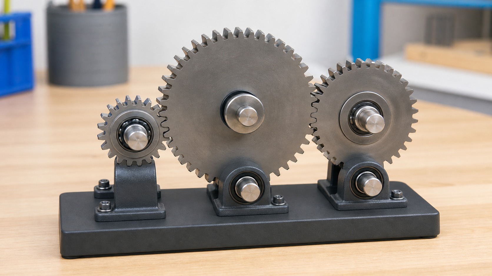

*写实观察图：相邻齿轮的齿彼此嵌合并安装在各自转轴上；真正转动时，相邻齿轮方向相反。*

齿轮边缘的齿互相咬合，一个转动会推着另一个转。相邻齿轮转向相反。大小不同的齿轮还能交换转速和转动力量。

**再想一步：** 齿数比决定理想转速比：小齿轮转很多圈，大齿轮才转一圈，但大齿轮轴上的扭矩会增加。齿形经过设计，才能平稳传力并减少磨损。

**把知识连起来：** 相邻齿轮的齿依次接触，把转矩从一根轴传到另一根轴，并使转向相反。齿数比决定转速比：小齿轮带大齿轮时，大齿轮转得慢但可得到较大转矩。齿形经过设计，使接触尽量平稳并减少卡顿和磨损。

**再往外看：** 钟表、变速箱和机器人的齿轮会组成多级传动；斜齿、锥齿和蜗杆还能改变噪声、方向或传动比。

**容易弄混：** 齿轮的牙不是为了咬住不动，齿越多也不自动越有力。真正关系要看两个齿轮的相对齿数、尺寸和输入转矩。

*图解：相邻齿轮用齿传力并反向转动；齿数比例会改变转速和力矩。*

**一起看看：** 转动安全的玩具齿轮，给一个齿画记号数圈数。

---

### 第 188 问｜自行车为什么要用链条？

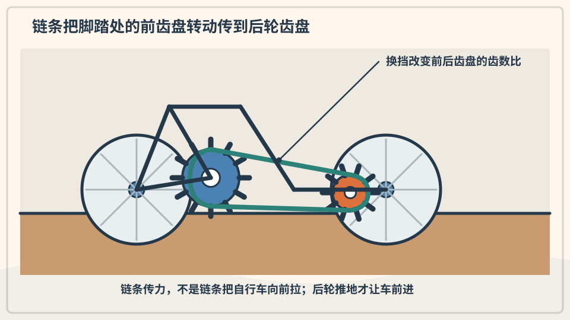

脚踩踏板会让前面的链轮转动。链条把拉力传到后轮链轮，后轮便推动自行车前进。链条能跨过一段距离传递转动，又不容易打滑。

**再想一步：** 前后链轮齿数决定踩一圈时车轮转几圈。变速器把链条移到不同大小链轮上，在速度与踩踏力量之间作交换。

**把知识连起来：** 自行车链条由许多可转动链节组成，套在前后链轮齿上，把脚踏曲柄的转矩传到后轮。换到不同大小链轮会改变脚踏转数与车轮转数的比例，在轻松爬坡和快速前进之间交换。链条张力、润滑和对齐影响效率。

**再往外看：** 皮带、轴传动和电机轮毂也能传递自行车动力，各自有重量、维护和结构取舍。

**容易弄混：** 链条不是把自行车向前拉过地面；它先转动后轮，轮胎再通过与地面的静摩擦推动整车。松脱或夹手风险使观察只能在停车状态由大人进行。

**一起记住：** 只从旁观察，手指和衣物远离链条、齿轮与车轮。

---

### 第 189 问｜螺丝为什么转着进去？

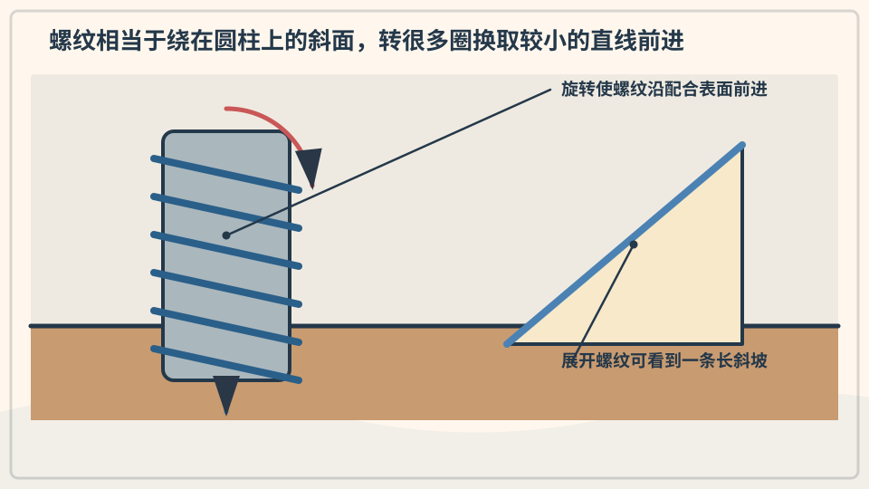

螺丝外面绕着斜斜的螺纹，像把斜坡缠在圆柱上。转动很多圈，螺丝只前进一点，却能产生较大的压紧力。螺纹也能防止零件轻易滑开。

**再想一步：** 螺纹的螺距决定每转一圈前进多少。较小螺距通常更省力、更精细，但需要转更多圈；摩擦既会损失能量，也帮助螺丝保持位置。

**把知识连起来：** 螺纹是一条绕圆柱盘旋的斜面，转动一圈会产生固定的轴向位移。较小螺距让手转更长距离来换取较大轴向力，也能通过摩擦保持位置。螺钉把旋转变成前进，螺栓与螺母则夹紧零件。

**再往外看：** 千斤顶、台钳和测微器都利用螺旋把转动转换成精细直线运动，但材料强度和摩擦决定安全范围。

**容易弄混：** 螺丝不是因为尖端钻洞才单独固定，螺纹与材料的接触才承担大部分作用。省力仍没有省掉总功和材料限制。

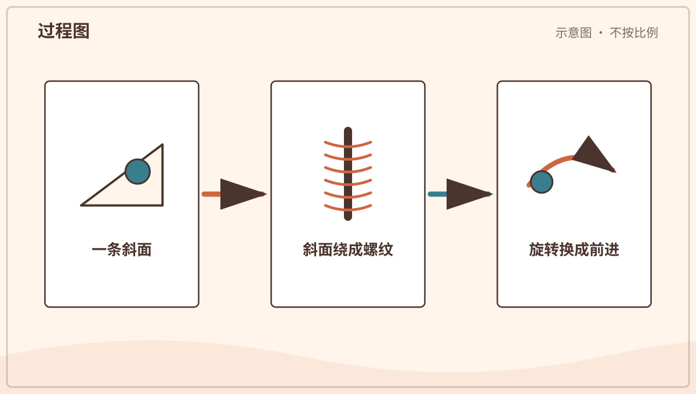

*图解：螺纹像绕在圆柱上的斜面；转动较长距离会产生沿轴方向的移动和力。*

**一起看看：** 由大人拿一颗未使用的大螺栓，沿螺纹用眼睛走一圈。

---

### 第 190 问｜刀刃为什么要做成尖尖的？

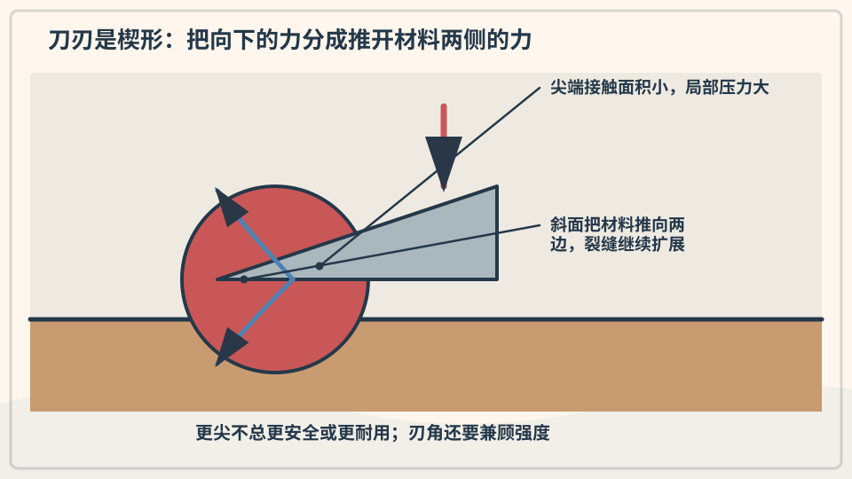

刀刃是一种楔子，前端面积很小。相同的力集中在较小面积上，会产生较大压力，让材料更容易分开。斧头、凿子和门塞也使用楔形。

**再想一步：** 楔子把向前的力分成向两侧的力。尖刃较容易切入，却也更容易损伤或变钝；材料硬度、刃角和摩擦都会影响切割。

**把知识连起来：** 刀刃是很窄的楔，手施加的力集中在小接触面积上，产生较大压力并推动材料向两侧分开。刃口角度较小通常更易切入，却也更薄、更易卷刃或崩裂。材料韧性、切割方向与摩擦同样重要。

**再往外看：** 斧、凿子、针和牙齿都利用尖端或楔形集中作用，但几何和材料按任务不同。

**容易弄混：** 尖并不表示自动锋利或安全，压力也不等于总力变大。刀具不能由幼儿操作，钝刀因滑脱也可能危险。

*图解：同样的力集中在较小刃口面积上会产生较大压力，使材料更容易分开。*

**一起记住：** 刀具只由大人使用，孩子从安全距离观察。

---

### 第 191 问｜斜坡为什么比直着抬省力？

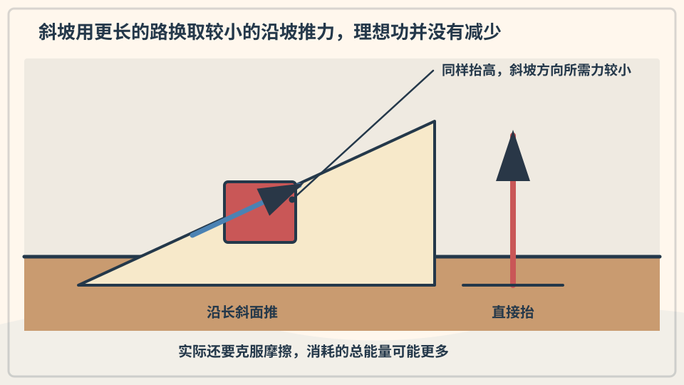

斜面把同样的高度变化分散到更长距离。沿斜坡推物体，所需的力可以小一些，但要走更远。坡越缓，通常越省力。

**再想一步：** 忽略摩擦时，物体增加的重力势能相同，所以力和距离作交换。真实斜面有摩擦，表面太粗或路线太长也会增加额外耗能。

**把知识连起来：** 把物体升到同一高度，理想情况下重力势能增加相同；斜坡把提升分散到更长距离，因此沿坡所需力较小。坡面摩擦会额外耗能，坡越缓，行程越长。斜面改变了力与距离的组合。

**再往外看：** 无障碍坡道、盘山路和螺旋输送器都利用斜面几何，还需满足抓地、转弯和人体安全。

**容易弄混：** 斜坡省力不等于省功，也不是越缓永远越好。空间、时间、摩擦和控制能力会限制设计。

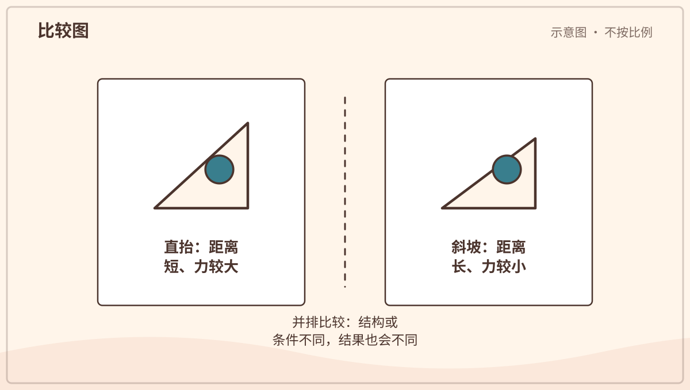

*图解：斜坡把同样高度的提升分散到更长距离，所以通常需要较小的沿坡力。*

**一起试试：** 用书搭低斜坡，让玩具车自己滚下，不堆得太高。

---

### 第 192 问｜弹簧为什么会弹回来？

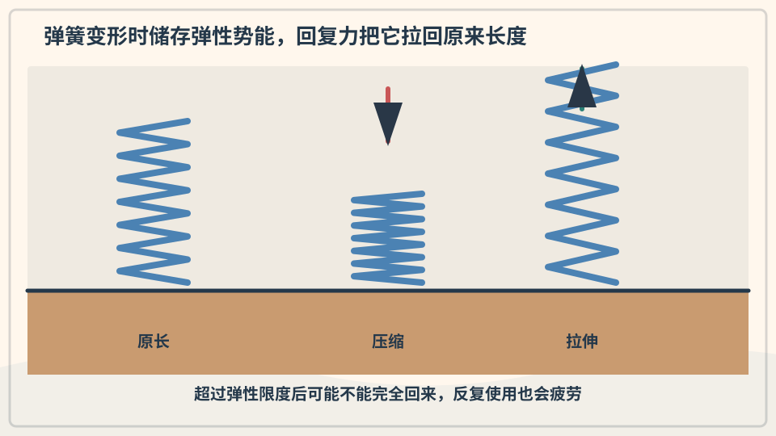

弹簧被拉长或压短时，材料内部会产生恢复原状的力。放手后，储存的弹性势能转成运动。超过承受范围，弹簧可能变形，不能完全回来。

**再想一步：** 在一定范围内，弹簧形变量越大，恢复力常越大，这近似叫胡克定律。线圈形状让一根金属丝能通过扭转产生较长的整体伸缩。

**把知识连起来：** 弹簧受压、拉伸或扭转时，材料内部原子间距离和整体几何改变，产生指向原形的恢复力并储存弹性势能。释放后，能量可变成运动、声音和热。若超过弹性限度，弹簧会永久变形甚至断裂。

**再往外看：** 钟表、车辆悬架、按键和测力计使用不同形状弹簧，设计要匹配刚度、行程与疲劳寿命。

**容易弄混：** 弹簧不是制造弹力的能量源，它先接受外界做功。压得更狠也不会无限弹得更高，材料有明确安全范围。

*图解：弹簧变形时储存弹性势能；约束松开后，恢复力把能量转成运动。*

**一起试试：** 只按安全玩具里的大弹簧，不把弹簧对着脸弹。

---

### 第 193 问｜橡皮筋和弹簧哪里不一样？

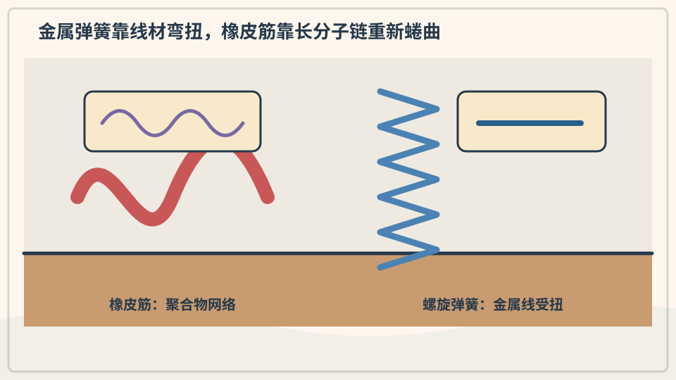

橡皮筋由长长的高分子链组成。拉伸时，原本弯曲缠绕的链被排得更整齐；放手后，热运动让它们倾向回到较乱的状态。金属弹簧主要靠材料微小形变和线圈扭转。

**再想一步：** 两者都能储存弹性势能，却有不同的力与形变关系。橡胶还会受温度、老化和拉伸速度影响，不应把任何弹性物都当成同一种弹簧。

**把知识连起来：** 金属螺旋弹簧的弹性来自材料微小形变和线圈几何，橡皮筋则由卷曲聚合物链被拉直并受热运动影响。两者都能恢复，却有不同的力—伸长关系、温度敏感性和疲劳方式。形状相似的回弹不代表内部机制相同。

**再往外看：** 实验可在很小安全形变下比较挂同样轻物时的伸长，但精确测量还需控制尺寸、材料和重复次数。

**容易弄混：** 橡皮筋不是扁平弹簧的简单版本，也不应拉到脸旁或用来弹射。老化橡胶会突然断裂，观察需由大人控制。

**一起记住：** 不把橡皮筋射向人，也不套在手指上很久。

## 单元综合观察｜给一件机器画输入—传递—输出

选择订书机、门把手或玩具车等完整安全物品，不拆开。画出手的动作、中间可见部件和结果；看不见的内部标成问号。
