# 兴趣单元 21｜磁、电、马达与流体装置

> **探索领域 07：** 工具、机器与工程
>
> **核心问题：** 磁场、电流、能量转换和压强差怎样让灯、马达、风扇、水泵与水龙头工作？

磁铁和指南针建立场的概念，闭合电路与电池传递能量，马达和发电机连接电与运动，流体装置则控制空气和水。

## 怎样沿着本单元的追问链阅读

沿能量和作用关系追踪装置，不把电池说成装着可倒出的电，也不把风扇说成制造冷。

## 追问链 21.1｜磁场、指南针与电磁铁

永久磁性、地磁场和通电线圈展示磁场的不同来源。

### 第 194 问｜磁铁为什么能隔空吸东西？

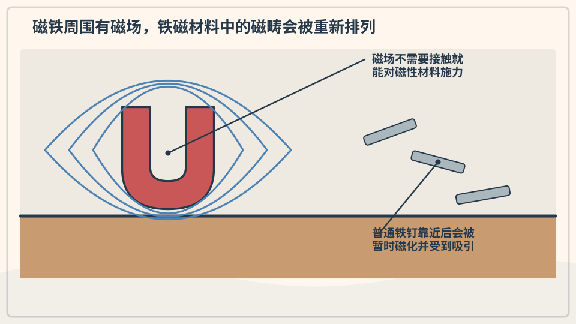

磁铁周围存在磁场，能对另一个磁铁或某些材料产生力。铁、镍、钴及一些合金会有明显反应。木头、塑料和铝通常不会被普通磁铁吸住。

**再想一步：** 铁磁材料里有许多微小磁畴；外部磁场能让更多磁畴朝相近方向排列，于是材料被吸引。磁力随距离增加会很快减弱。

**把知识连起来：** 磁铁周围的磁场能对其他磁体和部分铁磁材料产生力。铁内部许多微小磁畴在外场下更趋同向，吸引便变明显；距离增加时作用通常迅速减弱。磁场能穿过一些非磁性薄材料，但并非不受任何东西影响。

**再往外看：** 地球、太阳和电流也产生磁场，磁场测量广泛用于导航、医学成像和材料检测。

**容易弄混：** 磁铁不会吸所有金属，铝、铜等普通物体通常没有像铁那样的强吸引；“隔空”也不表示没有物理场存在。强磁铁和小磁体有夹伤、误吞风险。

*图解：磁铁周围存在磁场；铁磁材料内部的小磁区受影响后产生明显吸引。*

**一起试试：** 由大人用大磁铁测试大件物品，远离电器和可吞咽小物。

---

### 第 195 问｜指南针为什么会指南北？

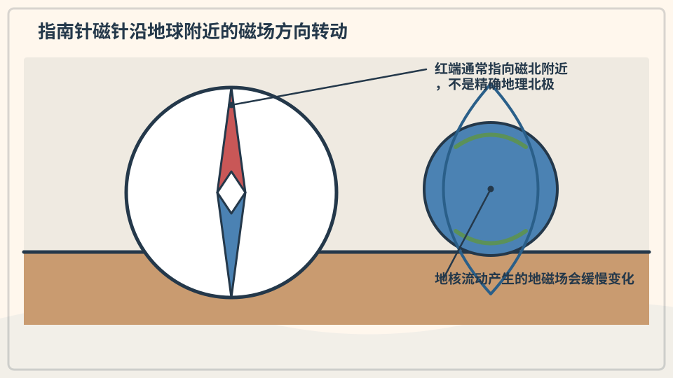

指南针里有一根能自由转动的小磁针。地球像周围带着一个大磁场，磁针会沿磁场方向转动，所以大致指出南北。附近金属和磁铁会让它偏转。

**再想一步：** 指南针指向的是磁北附近，不一定正好是地理北极，而且磁北位置会慢慢变化。地图使用时还要考虑磁偏角。

**把知识连起来：** 指南针磁针是一块可自由转动的小磁体，会沿当地地磁场大致指向磁北与磁南。地球磁场主要由液态外核中导电物质运动产生，磁极与地理极并不重合，还会随时间缓慢变化。附近铁器、电流和磁铁会干扰读数。

**再往外看：** 导航要把磁偏角、地图方向和其他传感器结合；动物也可能利用地磁线索，但机制因物种而异。

**容易弄混：** 指南针不是被北极的一块巨大磁石直接拉住，也不保证任何地点都准确指向地图正北。室内读数尤其容易受干扰。

**一起看看：** 和大人在空旷处转动指南针，再靠近铁物比较变化。

---

### 第 196 问｜电能把铁变成磁铁吗？

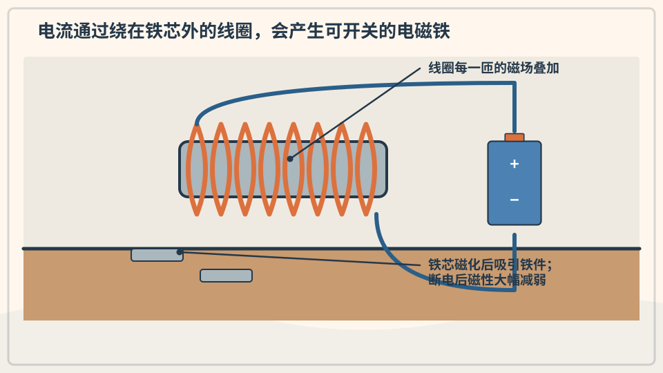

电流通过导线时，周围会产生磁场。把导线绕成线圈，许多小磁场叠在一起；再放入铁芯，磁力会更强。这就是电磁铁的基本原理。

**再想一步：** 改变电流方向，磁场方向也会改变；断开电流后，软铁芯大多失去强磁性。起重机、门铃、继电器和电动机都能用到电磁铁。

**把知识连起来：** 电流通过导线会在周围产生磁场，把导线绕成线圈后，各圈磁场在内部叠加；加入容易磁化的软铁芯可进一步增强。切断电流后，软铁大部分磁性会消退，因此电磁铁可以开关和调节。电流、匝数与磁路共同决定强弱。

**再往外看：** 继电器、扬声器、起重电磁铁和磁悬浮装置都使用电磁作用，但电压、散热和控制差异很大。

**容易弄混：** 电磁铁不是把电变成一种永久磁胶，铁芯也不一定完全失去剩磁。幼儿不能自行绕接电池或插座，实验只用合格封闭教具并由大人操作。

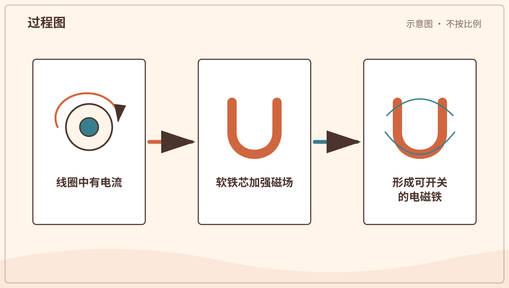

*图解：导线中的电流产生磁场；绕成线圈并加入软铁芯后，许多磁场共同增强。*

**一起记住：** 不碰插座或裸导线；实验只能用大人准备的安全低压器材。

## 追问链 21.2｜电路、电池、马达与发电机

闭合路径传递电能，电磁相互作用能在电与机械运动之间转换。

### 第 197 问｜灯为什么要接成一个圈才亮？

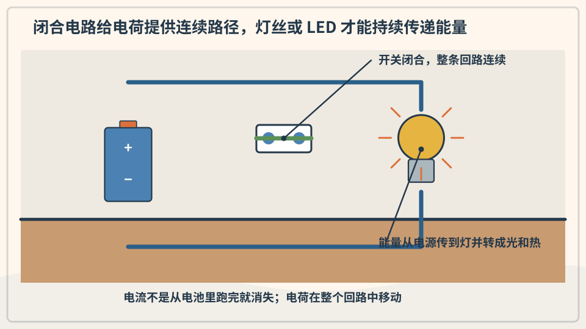

电流需要沿闭合路径流动。电池、导线和灯连成完整回路时，电荷能持续移动，灯把电能变成光和热。开关断开路径，灯就熄灭。

**再想一步：** 电池提供电势差，像推动电荷流动的条件；导体允许电荷较容易移动。短路会让电流绕过合适负载并迅速变大，可能发热起火。

**把知识连起来：** 电池在两端维持电势差，闭合导线提供连续路径，电场推动电荷在整个回路中运动并把能量传给灯。开关断开路径后，能量传递停止。元件连接方式还会改变各处电压和电流。

**再往外看：** 家庭电路包含并联、保护开关和接地，比简单电池灯复杂得多；模型只用于理解闭合路径。

**容易弄混：** 电不是从电池一端跑到灯里用完就消失，移动电荷遍布导线，消耗的是系统可用能量。绝不能用插座验证简单电路。

*图解：电池、导线和灯形成闭合路径后，电荷可以持续移动并传递能量。*

**一起看看：** 只操作完整封装的玩具开关，不拆电池和导线。

---

### 第 198 问｜电池里面装着“电”吗？

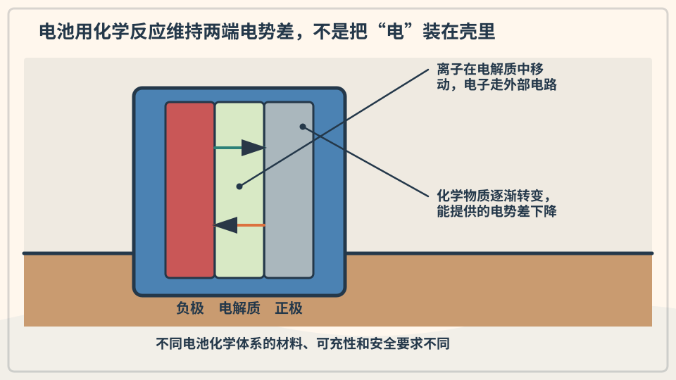

电池里不是装了一罐会倒出来的电。两端材料和内部物质发生化学反应，分开电荷并建立电势差。接上回路后，化学能转成电能。

**再想一步：** 电子经外部导线移动，离子在电池内部移动，共同维持反应。电池用久后，能继续反应的物质和结构改变，电压便下降。

**把知识连起来：** 电池把两种电极和电解质中的化学反应分开，使电子更愿意经外部回路流动。反应进行时，离子在电池内部移动以维持电荷平衡，化学能转成电能和热。反应物状态改变后，电池能提供的电压和容量下降。

**再往外看：** 充电电池用外部电能推动可逆反应回到较高能量状态，但循环次数、温度和充电方式都会影响寿命。

**容易弄混：** 电池里不是装着一罐静止的“电”，没接回路时也并非绝对没有化学变化。电池不可拆开、短路、加热或吞咽。

**一起记住：** 电池由大人安装保管，不能拆、咬、加热或吞咽。

---

### 第 199 问｜电动机为什么会转？

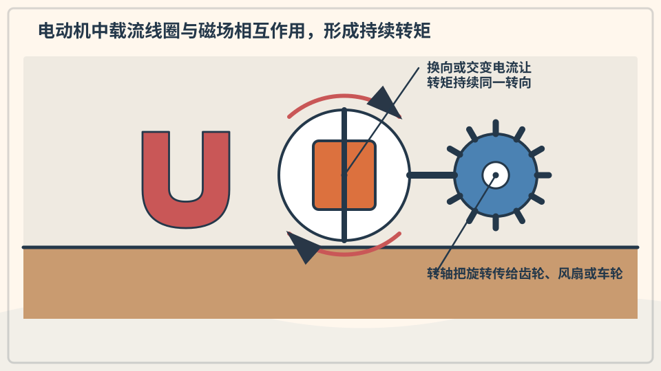

电动机让通电线圈处在磁场中。电流和磁场相互作用，对线圈产生转动力矩。换向装置或电子控制不断调整电流，转子便能持续转动。

**再想一步：** 电动机把电能转成机械能，同时也会产生热和声音。风扇、洗衣机、电动车和许多玩具使用的电机大小不同，基本关系却相似。

**把知识连起来：** 电动机中的线圈通电后产生磁场，与永久磁体或其他线圈磁场相互作用形成转矩。换向结构或电子控制让转矩持续朝合适方向，转子便不断旋转。轴再把机械能传给风扇、轮子或泵。

**再往外看：** 直流、交流、无刷和步进电机用不同方式产生旋转磁场与控制位置，效率和用途各异。

**容易弄混：** 马达并不是电流直接变成旋转的黑盒，也不会无负载和有负载时完全一样。部分能量会成为热和声音，卡住时还可能过热。

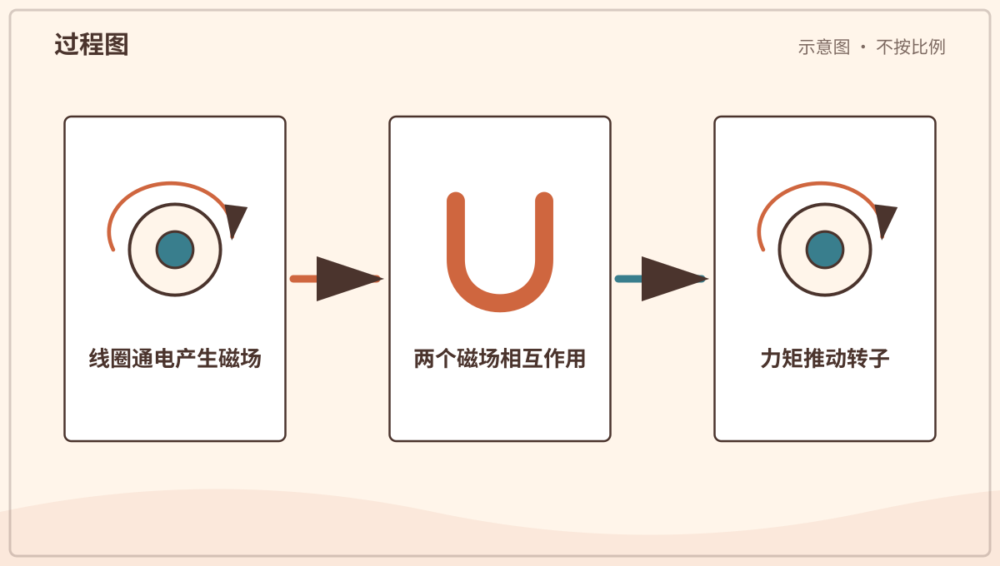

*图解：线圈中的电流产生磁场，与另一磁场相互作用形成力矩，使转子转动。*

**一起看看：** 听安全小风扇启动时声音怎样变化，不把手靠近叶片。

---

### 第 200 问｜发电机和电动机是亲戚吗？

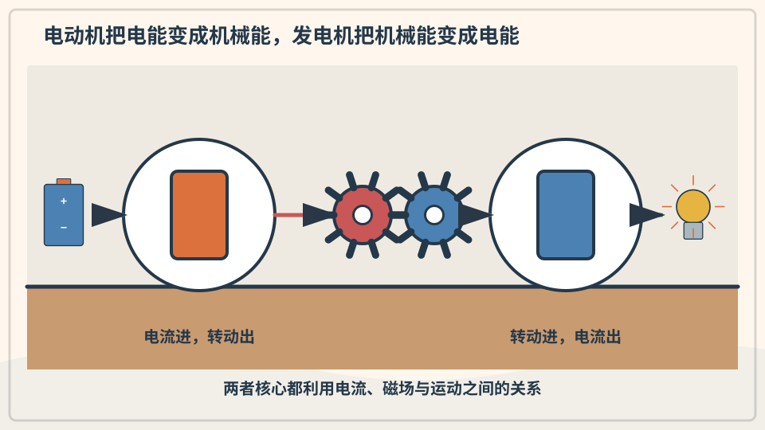

是。电动机用电流和磁场产生运动，发电机则让线圈与磁场相对运动，产生电压；接入闭合回路后才会形成电流。两者都利用电和磁之间的联系。

**再想一步：** 变化的磁通量会产生感应电动势，这叫电磁感应。水轮机、风轮机或蒸汽轮机先提供转动，发电机再把机械能转换为电能。

**把知识连起来：** 电动机让电流处在磁场中并受到转矩，把电能变为机械运动；发电机让线圈与磁场相对运动，改变磁通并产生电压，把机械能转为电能。许多装置结构可逆，差别主要在能量流向和控制。两者都遵守电磁感应与力的关系。

**再往外看：** 电动车制动时，牵引电机可暂时作为发电机，把部分运动能量送回电池，这叫再生制动。

**容易弄混：** 发电机不创造能量，必须由水轮、风轮、发动机或人提供机械功；电动机和发电机也不是效率百分之百的镜像。

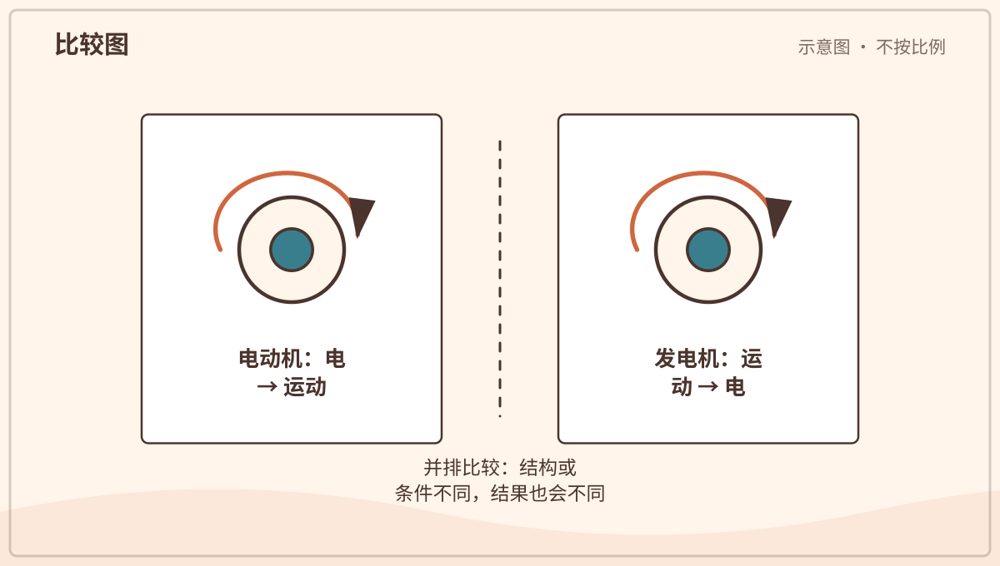

*图解：电动机把电能转成机械运动；发电机用机械运动改变磁通并产生电压。*

**一起看看：** 观察手摇发电玩具由大人转得更快时灯的变化。

## 追问链 21.3｜风扇、水泵与阀门

流动空气加快散热，泵建立压强差，阀门改变流道大小。

### 第 201 问｜电风扇会制造冷空气吗？

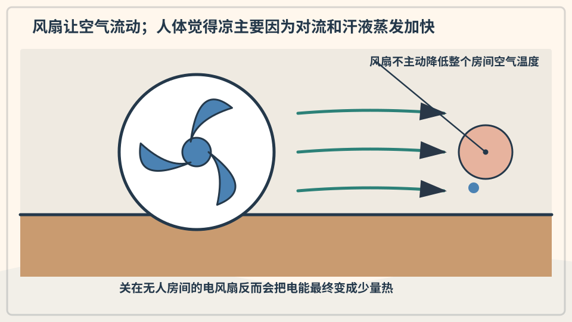

普通风扇主要让空气流动，并不把整个房间的空气主动降温。流动空气带走皮肤附近的暖空气，也加快汗液蒸发，所以人觉得凉快。电机本身还会放出一点热。

**再想一步：** 感觉温度与空气温度、湿度、风速和身体散热共同有关。无人房间里一直开普通风扇，通常不会像空调那样降低室温。

**把知识连起来：** 风扇叶片把空气加速，流动空气带走皮肤附近温暖湿润的空气，加快对流和汗液蒸发，所以人感觉更凉。房间密闭时，电机最终还会把电能变成少量热。风扇能重新分配空气，却通常不降低整个房间的平均温度。

**再往外看：** 吊扇方向、叶片角度和房间布局会改变循环；与空调配合可让相同体感下减少制冷需求。

**容易弄混：** 风扇不是制造“冷空气”，无人房间一直开风扇也不等于保存冷量。极端高温或脱水时，风扇不能替代安全降温措施。

**一起看看：** 在安全距离感受不同档位的风，不遮住风扇进出口。

---

### 第 202 问｜水泵怎样把水送上去？

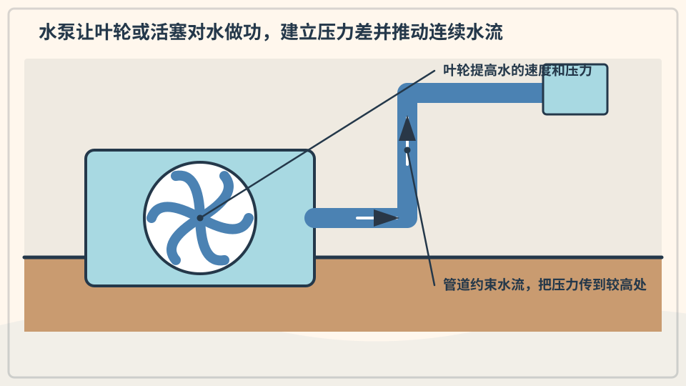

水泵用活塞、叶轮或其他部件改变液体压力。压力差推动水从入口流向出口，有些泵还需要先充满水。泵必须得到人力、电力或发动机的能量。

**再想一步：** 离心泵的旋转叶轮给水增加速度，泵壳再把一部分速度变成压力。泵不是凭空“吸水”，入口处压力降低后，别处较高压力把水推来。

**把知识连起来：** 水泵通过活塞、叶轮、膜片或其他部件对液体做功，建立压强差并维持流量。管道中的水从较高压力区域被推动到较低压力区域，同时还要克服重力、摩擦和弯头损失。泵的类型要匹配流量和扬程。

**再往外看：** 心脏也常被比作泵，但柔软血管、瓣膜和脉动流使它与普通水泵并不相同。城市供水还结合水塔和重力。

**容易弄混：** 泵不是从上方隔空把水“吸”上无限高度；入口低压让外界压力推动水进入。空转、堵塞或拆泵都可能损坏设备。

**一起看看：** 观察洗手液按压泵怎样回弹，不拆开水泵或电器。

---

### 第 203 问｜水龙头怎样让水停下来？

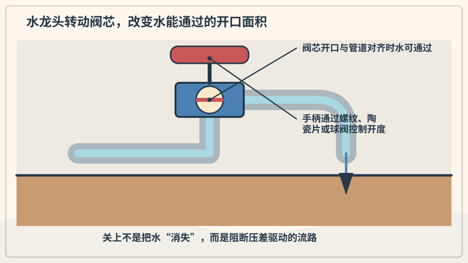

水龙头里面有阀门。转动或抬起把手，会移动密封件或带孔的零件，改变水流通道大小。通道关紧时，密封面阻止有压力的水通过。

**再想一步：** 不同龙头使用螺旋阀、陶瓷片或球阀等结构。关得太用力可能损坏密封；滴水常来自垫片磨损、杂质或零件没有完全贴合。

**把知识连起来：** 转动或抬起把手会带动阀芯、陶瓷片或密封垫移动，改变水能通过的开口面积。供水管内压强推动水流，阀门关紧后密封面阻断通道。混水龙头还要调节冷热两路流量。

**再往外看：** 节水起泡器把空气混入水流并整形成许多小流束，可在保持触感时减少流量。

**容易弄混：** 水龙头不是自己产生水压，拧得更紧也不应靠蛮力解决漏水。内部结构和密封损坏需要大人或维修人员处理。

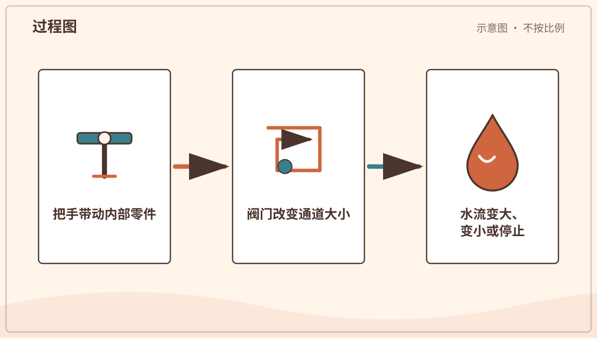

*图解：把手移动阀门里的密封件，改变水流通道大小；通道关紧后水便停止。*

**一起看看：** 在大人陪同下慢慢开小水流，观察把手移动与流量关系。

## 单元综合观察｜只观察一条安全能量链

观察完整的电池玩具或台灯外部，由大人操作开关；画出能源、导线或机构和输出。不要拆电池、电器、插座、水泵或水龙头。
