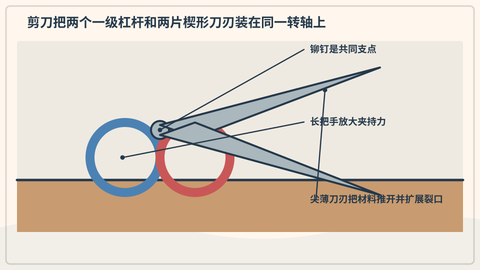
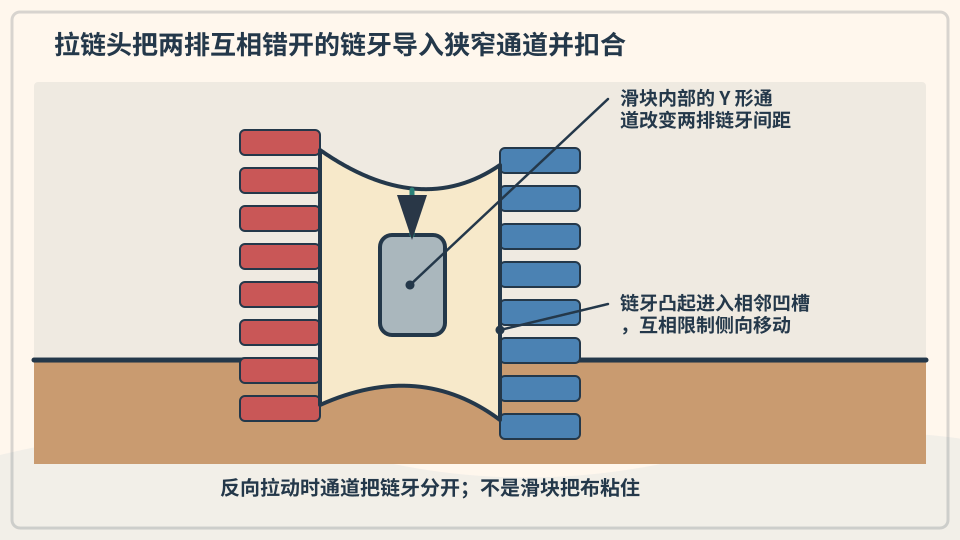
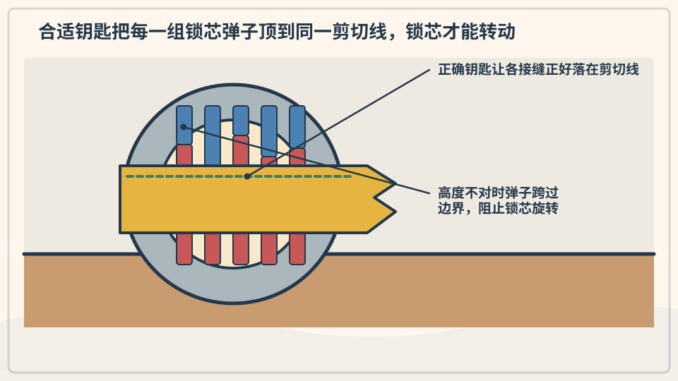
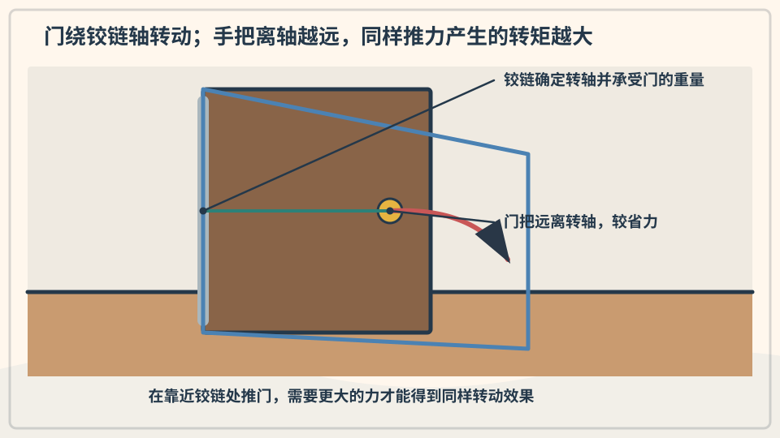
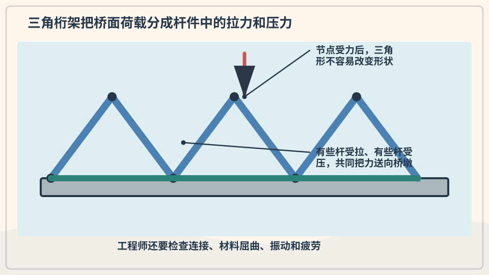
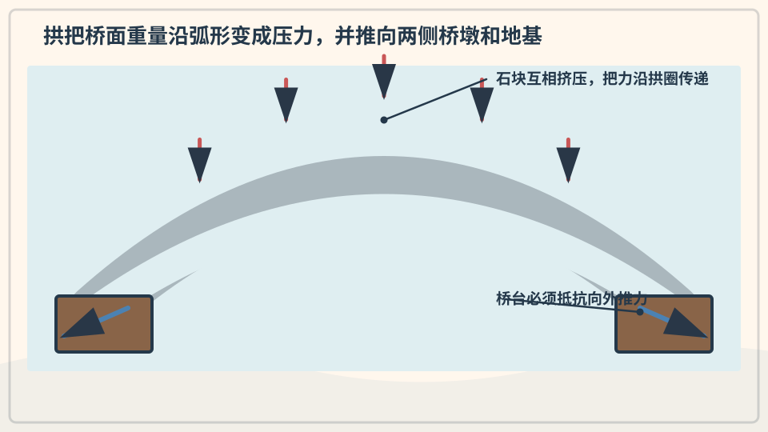
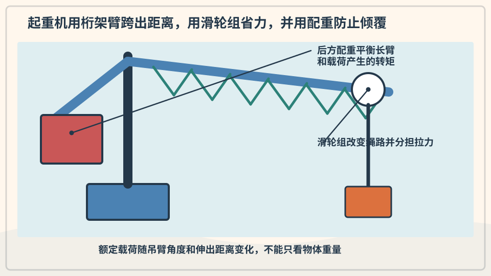
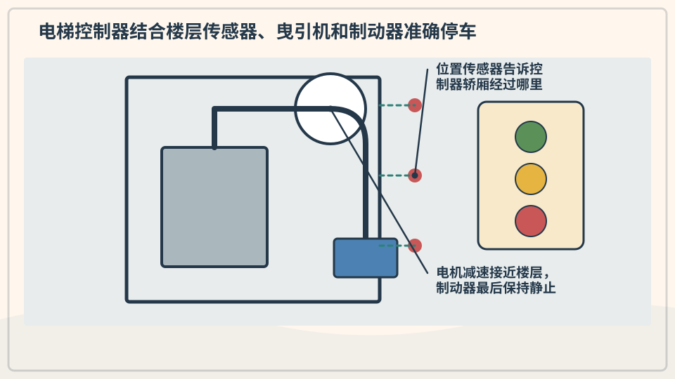
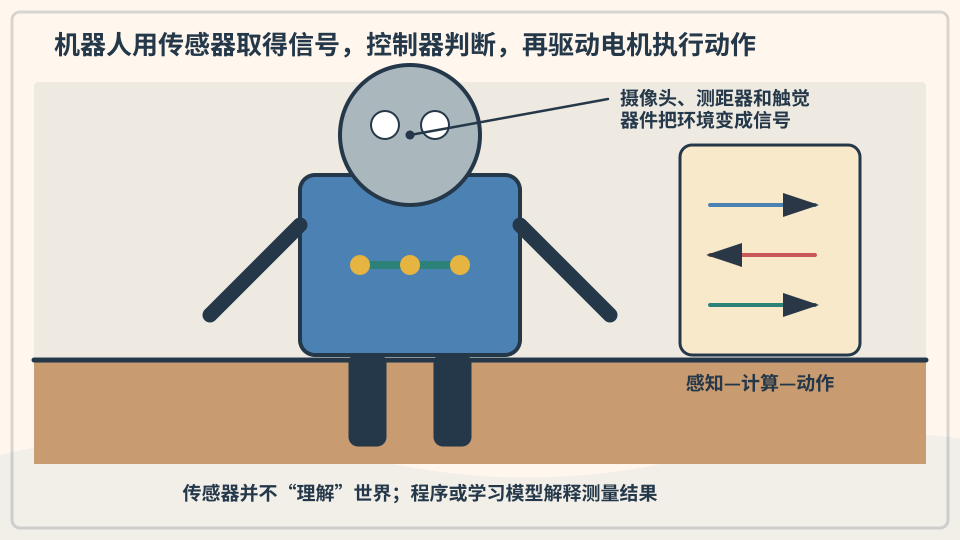

# 兴趣单元 22｜日常机关、结构与机器人

> **探索领域 07：** 工具、机器与工程
>
> **核心问题：** 剪刀、拉链、锁、门、桥、起重机、电梯和机器人怎样控制运动并承受作用力？

形状匹配和转轴解释小机关，三角形与拱解释结构受力，起重与电梯组合绳索、滑轮和控制，机器人还需要传感器与程序。

## 怎样沿着本单元的追问链阅读

先观察可见连接，再区分承重结构、运动机构和感知控制。

## 追问链 22.1｜剪刀、拉链、锁与门轴

杠杆、楔形齿、形状匹配和转动中心控制开合。

### 第 204 问｜剪刀为什么有两个把手？

剪刀把两根杠杆用转轴连在一起。手柄把手的力传到刀刃，刀刃又像楔子把材料分开。靠近转轴处通常更有力，刃尖移动得更快更远。

**再想一步：** 剪切不是两把小刀简单相撞，两刃略有贴合角度，把作用力集中在很窄区域。材料厚度、刃口锋利和支点松紧都会影响效果。

**把知识连起来：** 剪刀两片刀刃绕同一转轴转动，每个把手与刀片构成杠杆；手在较远处施力，刀刃把作用集中到窄边并产生剪切。靠近转轴处通常力大、位移小，适合较硬材料。刀片对齐和锋利度决定切口。

**再往外看：** 剪铁皮、裁布和理发剪刀的把手、刃角与长度各不相同，说明同一机构会按材料优化。

**容易弄混：** 两个把手不只是方便两根手指，也不是刀片越长任何位置都更有力。剪刀属于锋利工具，只能由大人在合适场景示范。

**一起记住：** 儿童安全剪也要坐好使用，由大人递送并收起。

---

### 第 205 问｜拉链为什么一拉就合上？

拉链两边有交错的链牙。拉头内部是逐渐变窄或变宽的通道，移动时把两排链牙引导到一起咬合，反向则把它们分开。拉头本身不把链牙粘住。

**再想一步：** 链牙的凸起和凹槽互相扣住，能承受横向拉力。若布边歪斜、链牙损坏或夹入异物，导向关系被破坏，拉链就会卡住。

**把知识连起来：** 拉链两侧的齿或线圈具有互补形状，拉头内部的 Y 形通道让两列元件按顺序靠近并互相扣住；反向移动时通道把它们分开。一次只处理相邻少数齿，比同时压合整条更省力也更可控。布带承担把拉链连接到衣物的作用。

**再往外看：** 防水拉链、塑料线圈拉链和金属齿拉链在密封、弯曲与耐用性上有不同设计。

**容易弄混：** 拉头不是用胶把两边粘住，卡住时也不应猛拉。错位布料或损坏齿会破坏连续啮合，需要大人处理。

**一起看看：** 用一条旧大拉链慢慢拉，观察链牙在拉头哪边合拢。

---

### 第 206 问｜钥匙为什么只能开合适的锁？

常见弹子锁里有多组长短不同的弹子。合适钥匙的齿形把每组弹子推到恰好位置，让锁芯可以转动。错误钥匙无法把分界排成一条线。

**再想一步：** 锁是利用形状匹配来控制机械运动，并非所有锁都用弹子。锁提供的是阻碍和延迟，不代表任何锁都绝对无法被打开。

**把知识连起来：** 钥匙表面的凹凸把锁芯中的销子抬到特定高度，使多个分界面同时对齐；这时锁芯才能转动并带动锁舌。错误钥匙只能对齐部分位置，转动仍被阻挡。锁利用形状编码允许特定机械动作。

**再往外看：** 不同锁还会使用片簧、磁性、电子身份或密码，安全性取决于完整系统而非钥匙外形复杂程度。

**容易弄混：** 钥匙不是只因大小刚好就能开锁，也不能把陌生物塞入锁孔试验。锁具细节不应用来教孩子绕过安全装置。

**一起看看：** 只看自家大人提供的透明教学锁，不拿钥匙尝试陌生门锁。

---

### 第 207 问｜门为什么绕着一边转？

门用合页连接门框。合页的两片金属围绕同一根销轴转动，让门只能沿预定弧线开合，同时承受门的重量。把手装得离合页远，开门更省力。

**再想一步：** 离转轴越远，同样的手力产生越大力矩。合页还要保持几根轴线对齐；若松动或歪斜，门就会摩擦、下垂或难以关闭。

**把知识连起来：** 门铰链把门与门框连接，并把运动限制为绕近似固定轴旋转。门的重量通过铰链传到框架，手在离轴较远的把手处施力能获得较大力矩。多个铰链分担重量并控制门边对齐。

**再往外看：** 旋转门、汽车门和橱柜隐藏铰链用不同几何控制路径与开启角度。

**容易弄混：** 门不是因为一边“粘住”才转，铰链也不只承担定位。门缝会夹手，幼儿不应把手放在铰链侧验证。

**一起记住：** 手指远离门缝和合页，开关门先看另一边有没有人。

## 追问链 22.2｜桥、起重机、电梯与机器人

结构分配作用力，机器搬运负载，传感器把环境信息交给控制系统。

### 第 208 问｜桥为什么爱用三角形？

三根杆连接成三角形后，不改变杆长就不容易让形状歪掉。桥梁桁架用许多三角形，把载荷分成杆件里的拉力和压力。这样能用较少材料跨过较远距离。

**再想一步：** 四边形容易像剪刀架一样变形，加一根斜杆分成三角形就稳定。真实桥还要承受车辆、风、温度变化和材料疲劳，需要工程师计算与维护。

**把知识连起来：** 三角形三边长度确定后形状不容易在不改变边长时歪斜，四边框却可变成平行四边形。桥架把杆件组成三角网格，让拉力和压力沿构件传到支座。连接节点和杆件抗弯能力仍然重要。

**再往外看：** 桁架桥会按跨度、材料和荷载选择不同三角排列，工程师还分析风振、疲劳和冗余。

**容易弄混：** 桥上出现三角形不保证安全，也不是三角形本身神奇地消灭重量。尺寸、材料、接头、地基和维护共同决定承载。

**一起试试：** 用吸管和连接泥做三角形、四边形，轻推比较稳定性。

---

### 第 209 问｜拱桥为什么不会掉下来？

拱形把上面的重量沿弧线传向两侧桥墩和地基。石头很能承受挤压，所以一块块楔形石可以互相压紧。两端必须足够牢固，挡住向外推的力。

**再想一步：** 理想拱让主要内力成为压力，减少石材不擅长承受的拉力。建造传统拱桥时常先用支架托住，最后放入拱顶关键石后再撤架。

**把知识连起来：** 拱把上方荷载沿弧形主要转化为压缩，并把作用传向两侧桥台。石材抗压强而抗拉弱，拱形能让石块互相挤紧；中央附近的锁石帮助施工后的整体闭合。桥台必须抵抗向外推力。

**再往外看：** 现代拱桥可用钢或混凝土承受更多拉压组合，施工阶段的支架与最终受力也不同。

**容易弄混：** 拱不是因为弯曲就不会掉，也不只靠最中间一块石头悬空。若桥台移动或接缝失效，整个受力路径会改变。

**一起看看：** 找一座拱桥照片，用手指沿拱顶画到两边地基。

---

### 第 210 问｜起重机怎样举起很重的东西？

起重机用电动机、卷筒、钢丝绳和滑轮提升重物。长臂把吊钩送到远处，另一边的配重帮助平衡转动力矩。支腿或塔身把力量传到地面。

**再想一步：** 吊得越远，同样重量产生的倾覆力矩越大，所以每台起重机都有载荷范围。风会让吊物摆动，操作必须由受训人员按严格规则完成。

**把知识连起来：** 起重机用长臂获得工作范围，用钢索和滑轮提升负载，并以配重和宽大底座抵抗倾覆力矩。吊物位置越远，产生的倾覆力矩越大，允许重量通常越小。回转、制动和结构变形都由控制系统监测。

**再往外看：** 塔吊、履带吊和汽车吊按场地采用不同支撑方式，吊装计划还要考虑风、地面承载和索具。

**容易弄混：** 起重机不是因为很高就能无限举重，配重也不会取消吊物重量。任何真实吊装都属于专业高风险操作，只能远距离观察。

**一起记住：** 远离施工围栏，绝不站在吊物或起重臂下方。

---

### 第 211 问｜电梯怎样知道停在哪一层？

许多电梯用电动机带动钢丝绳，让轿厢和配重上下移动。传感器读取位置与速度，控制器决定何时加速、减速和开门。制动器和多种安全装置防止意外移动。

**再想一步：** 配重接近轿厢加部分载荷的重量，电机主要克服两边差值和摩擦，因此更省能。限速器检测异常速度，可触发安全钳夹住导轨。

**把知识连起来：** 电梯轿厢和配重经钢索跨过曳引轮，电动机控制轮的转动；位置传感器、编码器和楼层标记持续报告高度与速度。控制器提前减速并精确平层，门锁和多套制动装置阻止不安全移动。机械与信息控制同时工作。

**再往外看：** 不同电梯会使用曳引、液压或线性电机，超高层还需处理钢索重量、建筑摆动与调度。

**容易弄混：** 电梯不是到楼层才突然看见号码停下，也不会仅靠一根绳子悬着。儿童不应扒门、跳跃或尝试阻挡关门。

**一起记住：** 进出先看轿厢是否到位，不扒门、不跳跃，听从大人。

---

### 第 212 问｜机器人怎么知道周围有什么？

机器人用摄像头、距离传感器、触碰开关或麦克风收集信号。控制程序根据这些信号选择动作，再让电动机驱动轮子或关节。它执行设计和学习得到的规则，不一定像人一样理解。

**再想一步：** 传感器把光、声、力等物理量变成电信号，算法再从信号中估计环境。测量会有噪声和盲区，所以机器人需要校准、冗余和安全限制。

**把知识连起来：** 机器人用相机、距离传感器、触碰开关或力传感器把光、声和机械变化转成数据；程序依据数据选择动作，马达再驱动轮子或关节。动作改变环境后，传感器获得新信息，形成感知—判断—行动的反馈环。训练数据和规则会限制它能认出什么。

**再往外看：** 自主车、工厂机械臂和扫地机器人使用的传感器与安全要求差异很大。多种传感器相互校验能减少单一路径失效。

**容易弄混：** 机器人“看见”不是像人一样自动理解一切，也不表示它有愿望。传感器只提供测量，结果仍可能因遮挡、光线、软件或数据偏差出错。

**一起想想：** 设计一个捡积木机器人，它至少要感觉到哪三件事？

## 单元综合观察｜给结构标出受力路径

用纸桥或积木桥做静态观察，只放很轻的物品。指出重量从桥面经过哪些部分传到桌面；不攀爬、不测试真实桥梁、栏杆或承重家具。
