# 兴趣单元 23｜地球内部、岩石与地貌

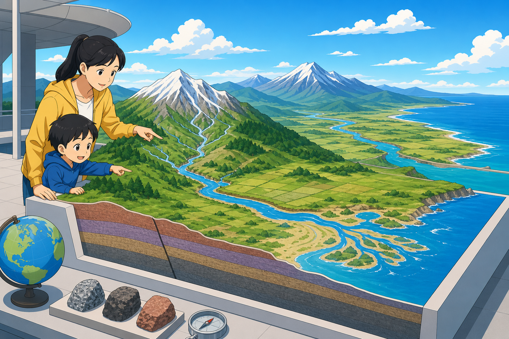

> **探索领域 08：** 地球、地图与地貌
>
> **核心问题：** 地球为什么接近球形，内部运动又怎样形成地震、火山、山谷、岩石和土壤？

从重力与地球分层进入板块运动，再把突然的地震火山与长期的抬升、风化、侵蚀和岩石循环放在同一时间尺度图里。

## 怎样沿着本单元的追问链阅读

模型会压缩距离和时间；地下结构来自多种观测推断，不是把地球真的切开看见。

## 追问链 23.1｜形状、重力、地球分层与板块

引力塑造整体形状，内部层次和板块边界与地震、火山活动相关。

### 第 213 问｜地球为什么是圆的？

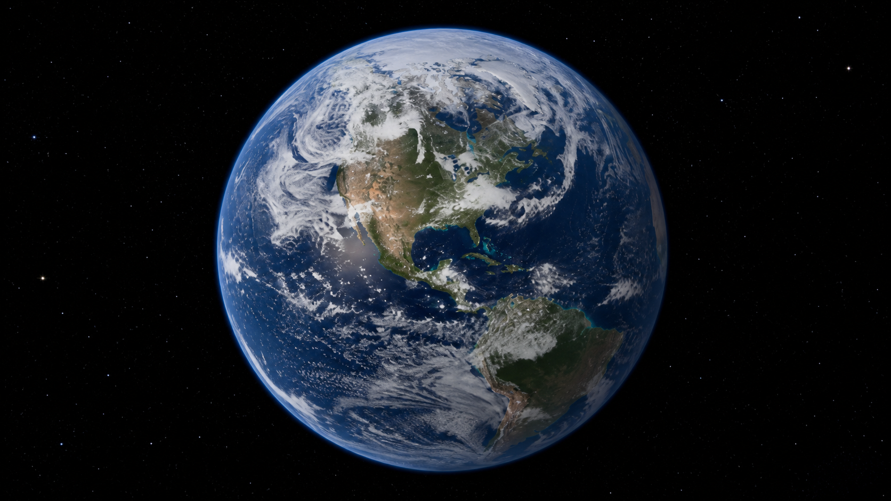

地球有很大质量，所有部分都被重力拉向中心。足够大的天体会被这种拉力整理成接近球形。地球自转让赤道附近微微鼓起，所以不是完美的球。

**再想一步：** 小石头的材料强度能抵抗重力，保持不规则形状；行星大得多，长期看来岩石也会在巨大压力下变形。科学家称这种接近平衡的形状为流体静力平衡。

**把知识连起来：** 地球形成早期受到自身引力挤压，物质在各个方向都趋向中心；当天体足够大时，坚硬岩石也会在很长时间尺度上缓慢流动，于是整体接近球形。地球自转又使赤道附近略微鼓起，所以更准确地说，它是表面不平、两极稍扁的旋转椭球。

**再往外看：** 测地卫星、重力测量和海平面模型能描述地球比简单球体更细的形状。其他足够大的行星和卫星也大致呈球形，小行星则常因引力较弱而形状不规则。

**容易弄混：** 地球不是完美光滑的圆球，也不是照片里看到一个圆盘就足以证明三维形状。不同地点测量影长、星空和地表曲率，才构成可重复的证据链。

*图解：大型天体的引力把物质拉向共同中心；足够大时，整体会接近球形。*

**一起看看：** 比较地球仪和小石头，猜猜为什么大小会改变形状。

---

### 第 214 问｜站在地面为什么看不出地球弯？

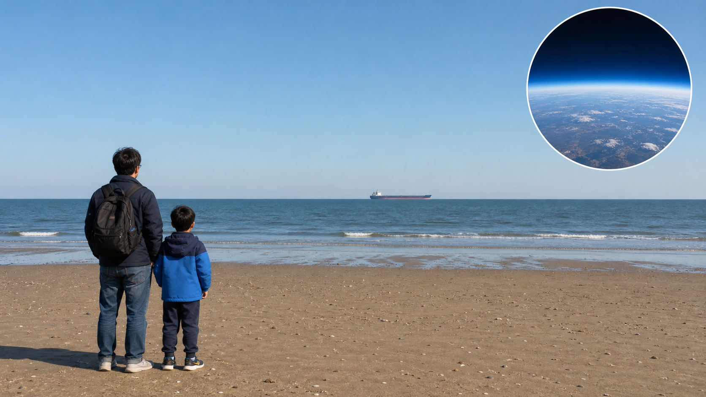

地球非常大，我们站立的范围和它相比很小，所以附近地面看起来平。远处船只会从下到上逐渐被地平线遮住，高处也能看得更远。这些都是曲面的线索。

**再想一步：** 地平线距离随观察高度增加而增大。人们还可用月食中地球的圆影、不同纬度的星空和环球航行等多种独立证据确认地球形状。

**把知识连起来：** 地球半径约为六千四百千米，人站立和行走涉及的范围与它相比非常小，因此脚下曲面在局部看起来近似平面。就像贴近一个大球只看一小块时，那一块几乎像平板。视线高度、地形和大气折射还会影响可见地平线。

**再往外看：** 登高后地平线会变远，精密测量也能在桥梁、隧道、测绘和长距离无线电中发现曲率影响。工程是否需要考虑曲率，取决于尺度和精度。

**容易弄混：** 局部看起来平不等于整个地球是平的；反过来，也不能把每一小段道路都画成明显弧线。模型要选择与问题匹配的尺度。

**一起看看：** 在安全开阔处比较蹲下和站起时能看见的远处范围。

---

### 第 215 问｜地球另一边的人为什么不会掉下去？

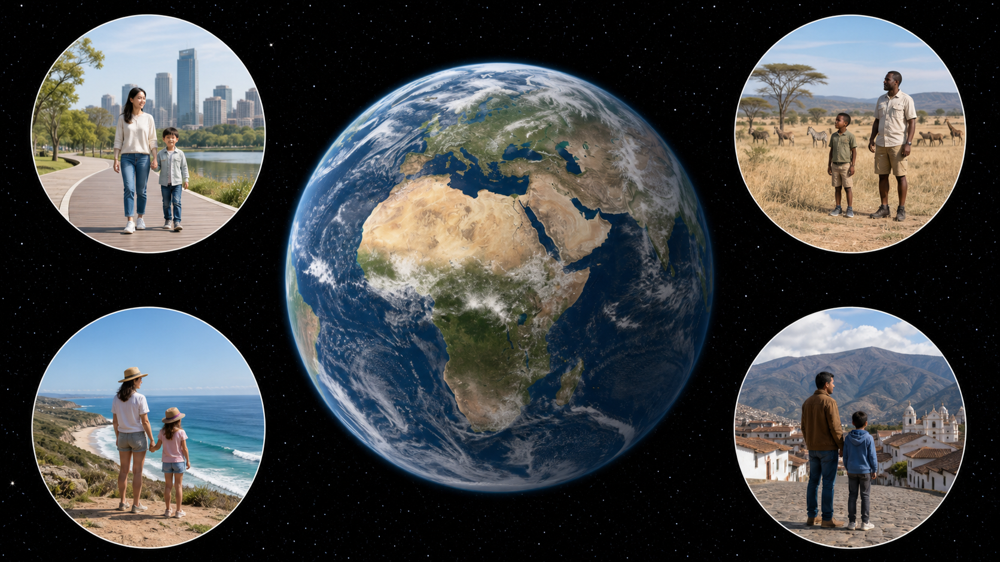

重力把地球附近的物体拉向地球中心。无论人站在球面的哪一边，脚下的“下”都指向中心，所以每个人都觉得自己站得很正。太空没有一个统一的绝对上下。

**再想一步：** 地球上所有物质共同产生引力，离地心越远，引力通常越弱。地球自转会略微改变不同纬度测到的重量，但不会把人甩出去。

**把知识连起来：** 地球附近的物体都受到指向地球质量中心附近的引力，所以每个地点的“下方”都是朝向地心，而不是朝同一个宇宙方向。地球另一边的人脚下也有地面支撑，他们感到的上下与我们一样自然。球面各处的竖直方向彼此不同。

**再往外看：** 铅垂线、海水表面和卫星轨道都能用重力方向解释。地球自转与地形会造成很小修正，但不会让另一边的人掉落。

**容易弄混：** 地图上的“下边”只是纸面的排版方向，不是宇宙里的绝对下方。把南半球画在图下方，也不表示那里的人头朝下生活。

*图解：无论站在地球哪一边，重力都大致指向地心，所以脚下都是当地的“下”。*

**一起试试：** 在球上贴几枚纸人，让每个纸人的脚都指向球心。

---

### 第 216 问｜地球里面是什么？

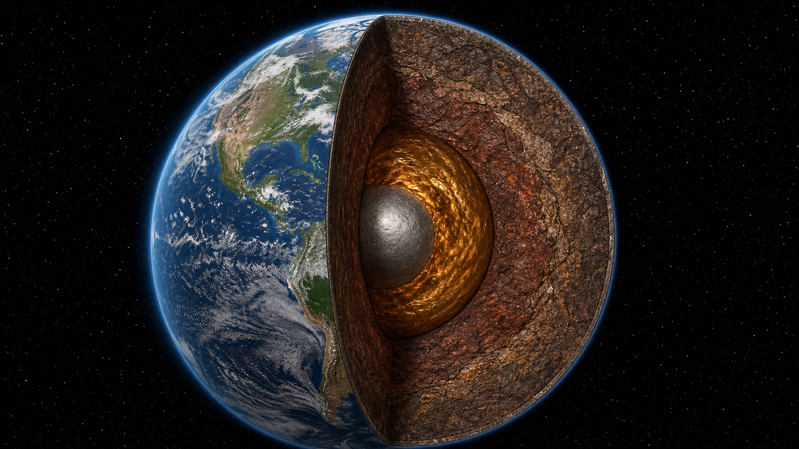

地球外面是很薄的地壳，下面是厚厚的地幔，更深处是主要由铁和镍组成的地核。外核是液态，内核因巨大压力保持固态。我们不能直接挖到那里。

**再想一步：** 科学家分析地震波穿过地球时速度和路线的变化，像给地球做“透视检查”。不同地震波能否通过液体，帮助确认外核的状态。

**把知识连起来：** 地球从外向内可概括为薄的地壳、厚的地幔、液态外核和固态内核；这些层按成分和力学性质划分，并不是可掀开的同心硬壳。压力、温度和材料性质随深度改变。科学家主要利用地震波速度、重力、磁场和高压实验间接推断内部。

**再往外看：** 不同地震波能否穿过液体、在哪里折射或反射，像给地球做透视检查。新数据会不断提高内部边界和温度模型的精度。

**容易弄混：** 地幔大部分是固态岩石，却能在百万年尺度缓慢变形；不能把它画成包围地核的一整层岩浆海。人类钻孔也远未钻到地幔深处。

*图解：地球由薄地壳、厚地幔和金属核心等层次组成，越深条件越极端。*

**一起看看：** 用煮熟鸡蛋作形状比喻，但记住蛋壳、蛋白、蛋黄不等于地球材料。

---

### 第 217 问｜大陆会慢慢移动吗？

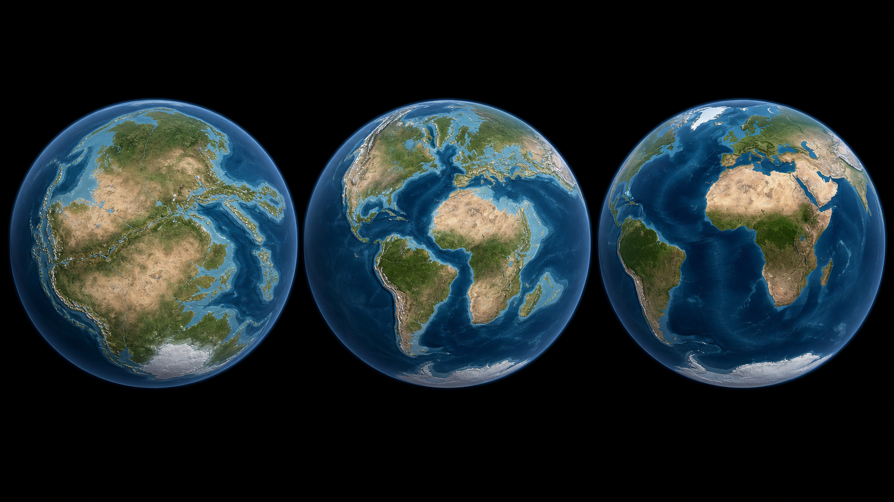

会。地球最外层分成许多大大小小的板块，它们每年移动几厘米左右。板块相撞、分开或擦过，会形成山脉、海沟、火山和地震带。

**再想一步：** 板块运动由地幔对流、下沉板块拉力和海岭推力等共同驱动。移动很慢，但几千万年累积起来，足以让海洋开合、把大陆重新排列。

**把知识连起来：** 地球外部较硬的岩石圈分成许多板块，它们在较软、可长期变形的上地幔之上每年移动几厘米左右。海底扩张制造新洋壳，俯冲、碰撞和转换边界又消耗或错动地壳。大陆随所在板块移动，亿万年间会聚合、裂开并改变形状。

**再往外看：** 古生物分布、海底磁条带、山脉结构和卫星定位共同支持板块构造。今天用 GNSS 就能直接测到一些板块的年度位移。

**容易弄混：** 大陆不是漂在一片液态岩浆上，也不会在几年内移动到肉眼可见的新位置。板块可同时包含大陆地壳和海洋地壳，二者不是同义词。

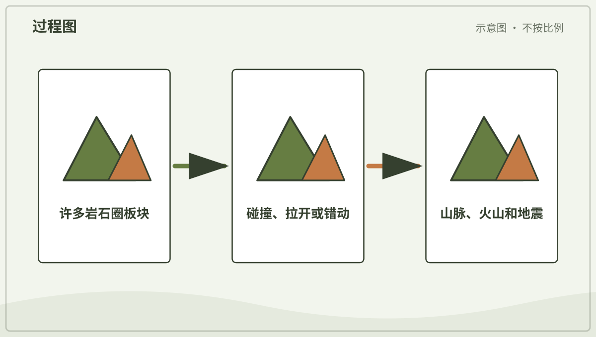

*图解：岩石圈板块缓慢移动；在边界处碰撞、拉开或错动，塑造地表。*

**一起看看：** 把两块硬纸放在毛巾上，演示相撞、分开和错动。

---

### 第 218 问｜地震时地面为什么会摇？

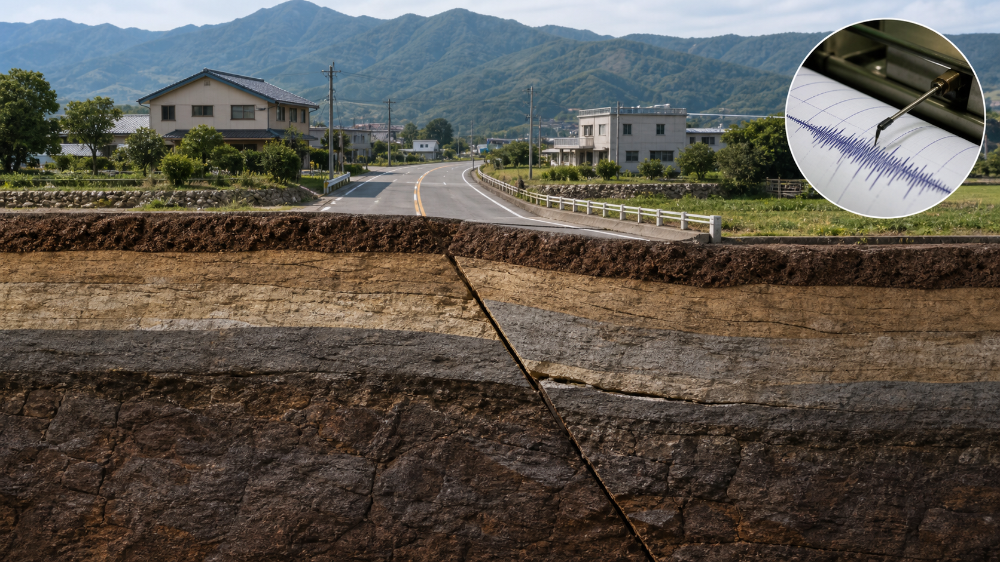

板块运动让岩石慢慢积累应力。断层突然滑动时，储存的弹性能量以地震波向四周传播，地面便摇动。震源在地下，正上方地面位置叫震中。

**再想一步：** 不同地震波让地面以不同方式运动，破坏还受距离、深度、土壤和建筑结构影响。科学家能很快检测地震，却不能准确预报某天某时一定发生。

**把知识连起来：** 板块运动让断层两侧岩石缓慢受力并发生弹性变形；当摩擦再也锁不住断层，岩石突然滑动，储存的能量以地震波向外传播，地面便摇动。震源在地下，正上方地表位置称震中。不同波到达时间和振动方式不同。

**再往外看：** 地震仪网络可定位震源并估算规模，建筑工程则通过延性、隔震和合理结构降低破坏。短期精确预测某次地震目前仍做不到，预警是探测已发生的地震后抢在强波到达前发信号。

**容易弄混：** 地震不是地下空洞塌一下这么简单，震级与某地实际摇得多强也不是同一量。发生时应遵循当地防灾指导，不能跑去窗边观察。

*图解：断层突然滑动释放弹性能，地震波向外传播并使地面摇动。*

**一起记住：** 地震安全做法依当地指导练习，发生时听大人和公共警报。

---

### 第 219 问｜火山为什么会喷发？

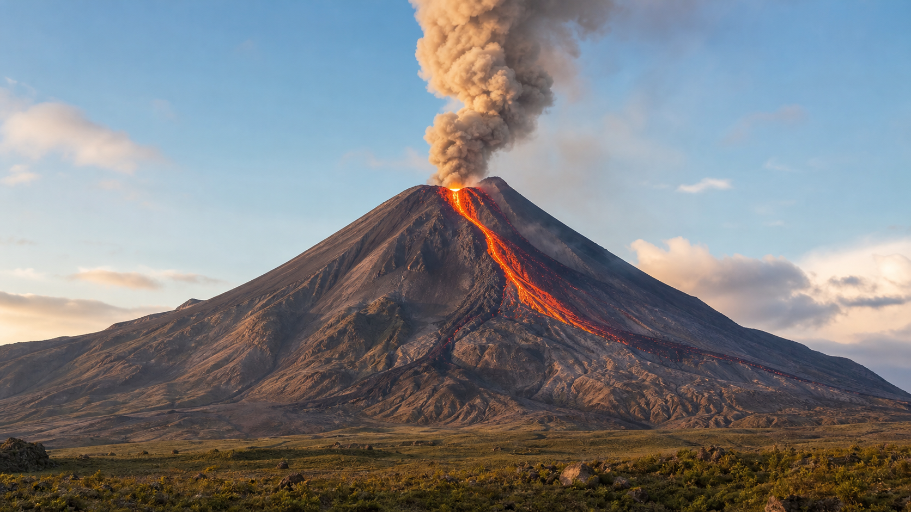

*写实观察图：火山喷发形式很多，本图展示其中一种；熔岩受重力影响沿较低处流动。*

地下部分岩石熔化形成岩浆，里面还溶有气体。岩浆上升时压力降低，气体形成气泡并膨胀，可能推动岩浆喷出。岩浆到地面后叫熔岩。

**再想一步：** 岩浆黏度和含气量影响喷发方式：较稀的熔岩容易流动，黏稠岩浆更容易困住气体并爆炸。并非每座火山都长成尖圆锥，也不是一直有地下大空洞。

**把知识连起来：** 地下部分岩石因减压、加水或升温而熔融，形成比周围更易上升的岩浆；岩浆中的水和其他挥发物在压力降低时析出气泡，可能显著增加内部压力。岩浆黏度、含气量和通道状态共同决定喷发是缓慢流出还是猛烈爆发。喷出的物质包括熔岩、火山灰和气体。

**再往外看：** 火山多见于俯冲带、裂谷和热点，但不同构造环境会产生不同岩浆。监测地面变形、地震、气体和温度能评估活动变化，却不能保证精确报出喷发时刻。

**容易弄混：** 地球内部不是装满火的空心球，岩浆也不是任何地方都紧贴地壳。示意剖面会夸大通道和岩浆房尺寸，真实地下结构往往更复杂。

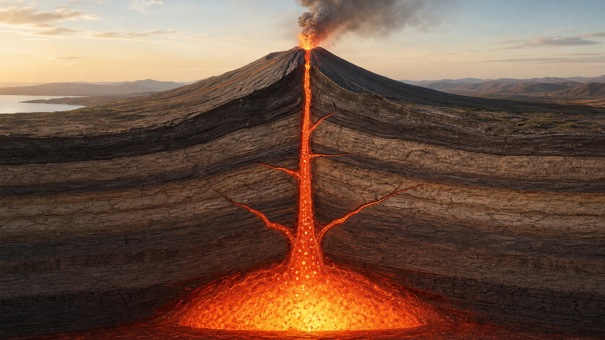

*写实原理图：地下岩浆储库、通道与火山口的连接关系；真实火山内部无法直接剖开观察，形状和深度不按比例。*

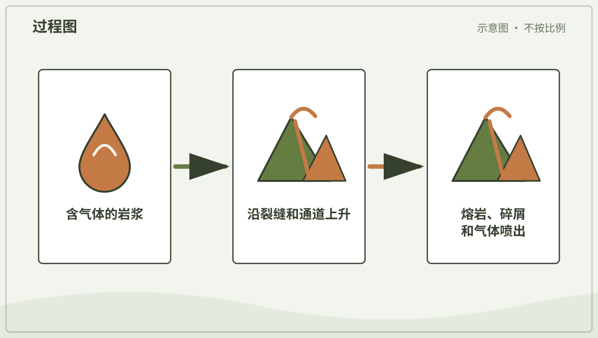

*图解：岩浆中的气体膨胀并增加压力；岩浆沿裂缝上升，可能到达地表喷发。*

**一起看看：** 在火山照片中找火山口、熔岩流和火山灰云。

## 追问链 23.2｜山谷、岩石、土壤与化石

抬升与侵蚀共同塑造地表，岩石和土壤记录材料变化，化石保存过去证据。

### 第 220 问｜山是怎样长高的？

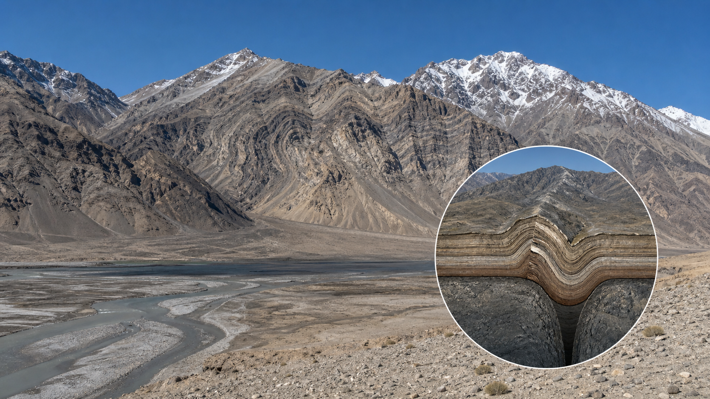

有些山由板块碰撞，把地壳挤压、折叠和抬升形成；有些由火山喷出的材料堆积。河流、冰川、风和重力又不断侵蚀山体。山脉同时在生长和变矮。

**再想一步：** 抬升速度与侵蚀速度的长期竞争决定地形。岩石种类、断层和气候不同，会让山峰变得尖锐、圆缓或形成高原。

**把知识连起来：** 板块碰撞可使岩层挤压、褶皱并抬升，断层运动、火山堆积和地壳均衡调整也会造山。与此同时，雨水、冰川、河流和重力不断风化侵蚀高处。山脉外形是抬升与削低长期竞赛的结果，并非一次突然长成。

**再往外看：** 年轻山脉常高陡且仍有活跃地震，古老山脉可能已被侵蚀得圆缓，但岩性和气候也会改变外貌。卫星测量能看到某些山地仍以毫米级速度升降。

**容易弄混：** 山不是两块板像纸一样一挤就只向上折，也不是越高就一定越年轻。地下结构、岩石强度和侵蚀速度都必须一起考虑。

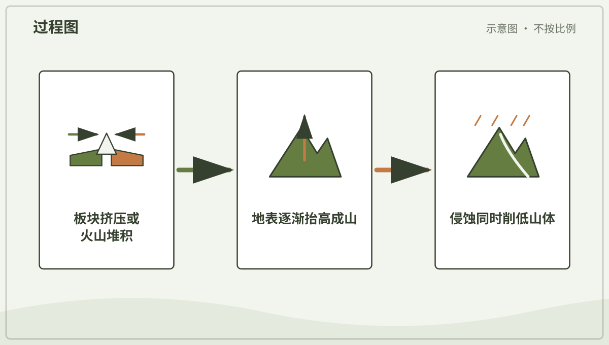

*图解：板块碰撞或火山堆积能抬高地表，风、水、冰和重力又持续侵蚀山体。*

**一起试试：** 推挤两条不同颜色的毛巾，看它们怎样起皱隆起。

---

### 第 221 问｜山谷是被谁挖出来的？

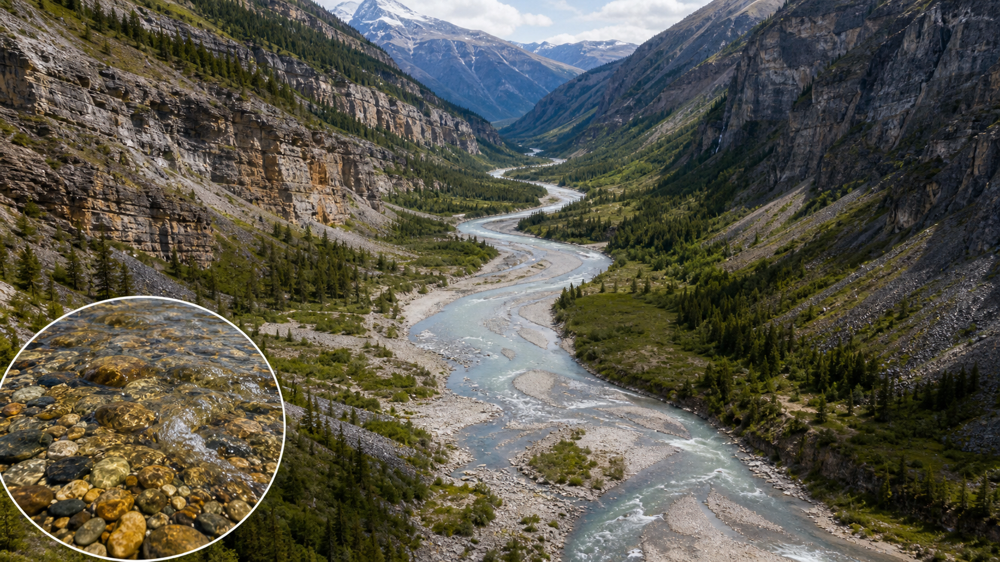

流水会带走岩石碎屑，长期切出常见的 V 形河谷。冰川像很慢的巨大砂纸，移动时能磨出较宽的 U 形谷。地壳运动和岩石软硬也会决定山谷方向。

**再想一步：** 侵蚀需要搬运工具：水、冰或风带着泥沙刮擦岩面，冻融和植物根还会先把岩石破开。地貌是许多小变化累积很久的结果。

**把知识连起来：** 岩石先被冻融、温差、植物根和化学反应风化成较小材料，流水、冰川和重力再把材料搬走。河流沿低处汇集并切割河床，冰川则像缓慢移动的厚重磨具拓宽谷地。长期侵蚀能把细小变化积累成深谷。

**再往外看：** V 形河谷、U 形冰川谷和峡谷保存了不同过程的几何线索。沉积物的大小、圆度和层理还能透露搬运距离与水流变化。

**容易弄混：** 山谷不是一定由一场洪水挖成，也不能说水本身像金属刀一样切石头。水携带颗粒、溶解矿物并反复作用，时间尺度非常关键。

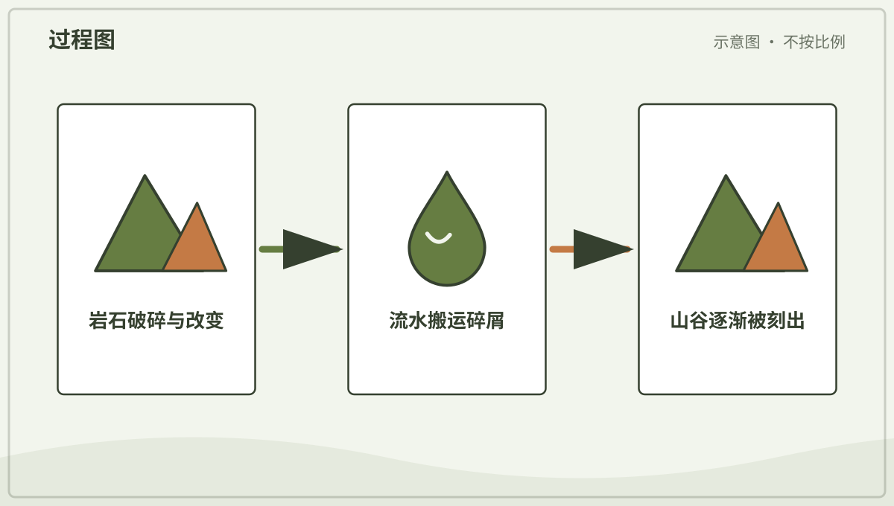

*图解：岩石先被风化，流水或冰再搬走碎屑；长期侵蚀会加深和拓宽山谷。*

**一起看看：** 比较 V 形谷和 U 形谷照片，用手指描出横截面。

---

### 第 222 问｜岩石和矿物是一回事吗？

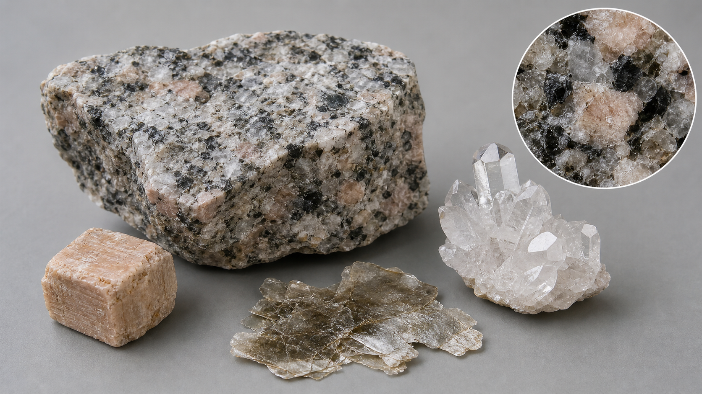

矿物是自然形成、成分和晶体结构较确定的固体。岩石通常由一种或多种矿物组成，像花岗岩里常能看见不同颜色颗粒。不是所有石头都只含一种东西。

**再想一步：** 岩石按形成过程分为火成岩、沉积岩和变质岩，它们能在熔化、沉积、受热受压和侵蚀中互相转变。这叫岩石循环。

**把知识连起来：** 矿物是具有较确定化学组成和晶体结构的天然固体，岩石则通常由一种或多种矿物及其他材料组成。花岗岩可见石英、长石和云母，石灰岩有时主要由方解石构成。岩石会在熔融、结晶、沉积、变质和风化之间循环。

**再往外看：** 硬度、条痕、解理和晶形帮助鉴定矿物，岩石鉴定还要看颗粒、结构与形成环境。肉眼颜色往往不够可靠。

**容易弄混：** 一块岩石不是必定只有一种矿物，矿物也不等于有用金属矿石。日常说的“水晶”或“石头”可能混用，科学分类需要可检验特征。

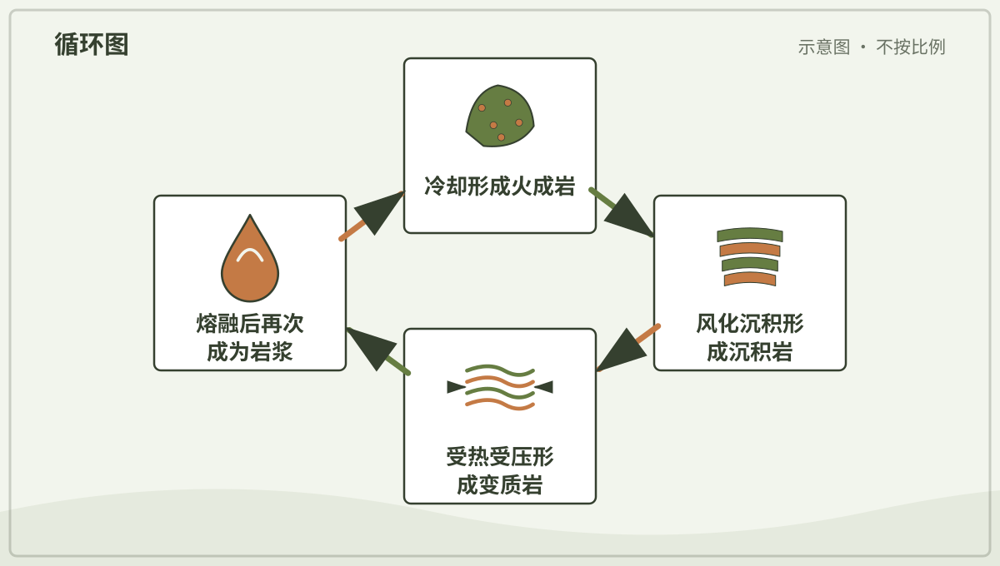

*图解：岩石会在冷却、风化沉积、受热受压和熔融中转变，路径不只有一种。*

**一起看看：** 观察三块安全石头的颗粒、光泽和层纹，不舔石头。

---

### 第 223 问｜土壤只是碎石头吗？

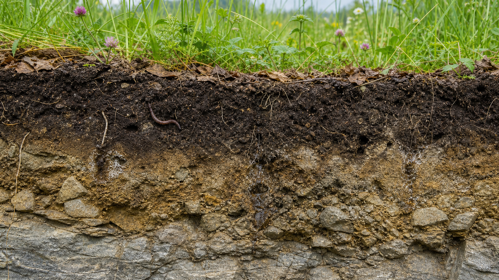

土壤含风化的矿物颗粒、腐殖质、水、空气和许多生物。沙粒、粉粒和黏粒大小不同，影响排水与保水。土壤形成很慢，也会分成不同层次。

**再想一步：** 岩石风化提供矿物颗粒，植物残体和分解者提供有机物，根与动物不断混合和改变孔隙。肥沃不是只看颜色深，还要看养分、结构、酸碱和生物活动。

**把知识连起来：** 土壤包含风化矿物颗粒、腐殖质、水、空气和大量生物，颗粒之间的孔隙决定排水与通气。根、真菌、细菌和小动物不断改变土壤结构与养分循环。形成一层成熟土壤常需很长时间，还受母岩、气候、地形和生物共同影响。

**再往外看：** 沙、粉砂和黏土按颗粒大小区分，不同组合形成不同质地。土层剖面能显示有机物积累、淋溶和矿物变化。

**容易弄混：** 土壤不是把石头敲碎就全部得到，也不是越黑就一定越肥。植物需要水、空气、矿物质和适合结构，施肥过多反而会伤害生态。

**一起看看：** 用透明杯观察土样加水沉降，由大人处理，之后洗手。

---

### 第 224 问｜化石是恐龙的骨头吗？

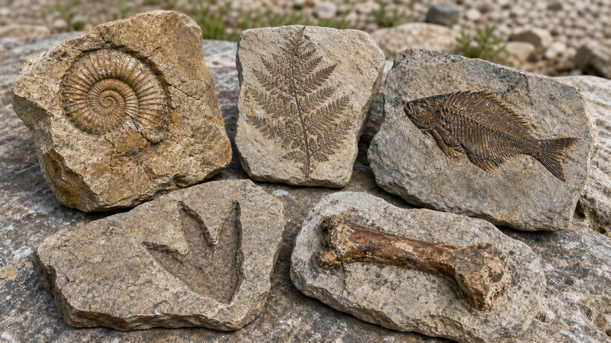

有些化石是骨、壳或木头被矿物替换后的遗迹。有些化石只是脚印、洞穴或身体压痕。恐龙化石只是其中一部分，微小生物和植物也能留下化石。

**再想一步：** 生物被快速埋藏、缺少腐烂和破坏时，更可能保存。科学家结合岩层顺序、放射性定年和形态比较，重建过去环境，而不是只看一块石头猜故事。

**把知识连起来：** 化石是过去生物留下并被地质过程保存的身体遗骸、印痕或活动证据。骨、牙和贝壳可能矿化，脚印、洞穴、粪便甚至叶片压痕也能成为化石。埋藏环境、分解速度和后续地质变化决定是否保存，因此化石记录并不完整。

**再往外看：** 科学家结合岩层位置、解剖比较和放射性定年重建古环境与亲缘关系。恐龙只是化石生物中的一小部分。

**容易弄混：** 化石不一定是原来的骨头，也不是任何奇形石头都算化石。不能只凭外形认定，采集还须遵守保护区和化石法规。

**一起看看：** 比较贝壳本身、贝壳印痕和石化贝壳的图片。

## 单元综合观察｜做一个说明取舍的地球模型

用球表示地球整体，再用另一张剖面图表示内部层次。比较为什么一个模型适合看形状，另一个适合看结构，并明确两者都没有同时画对真实比例。
