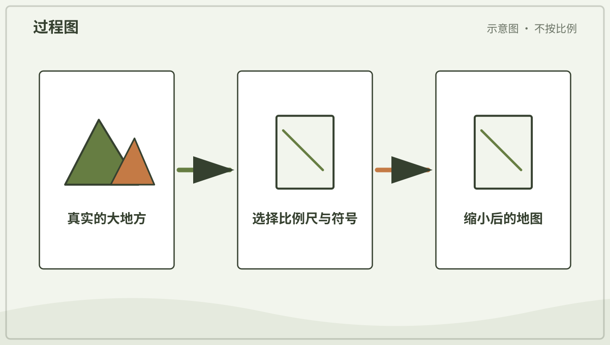
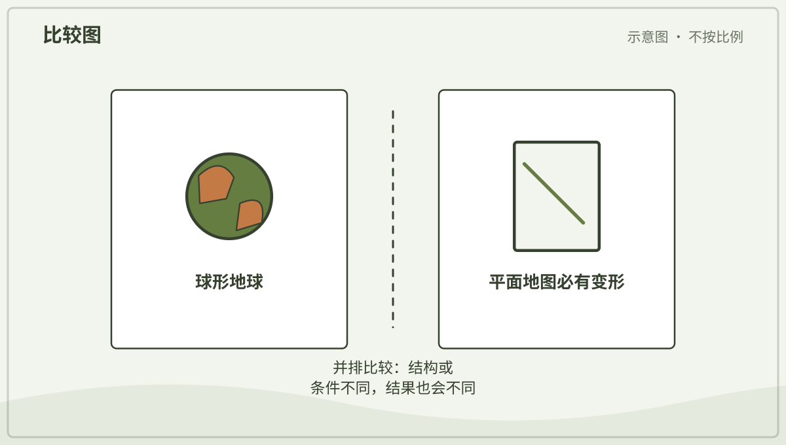
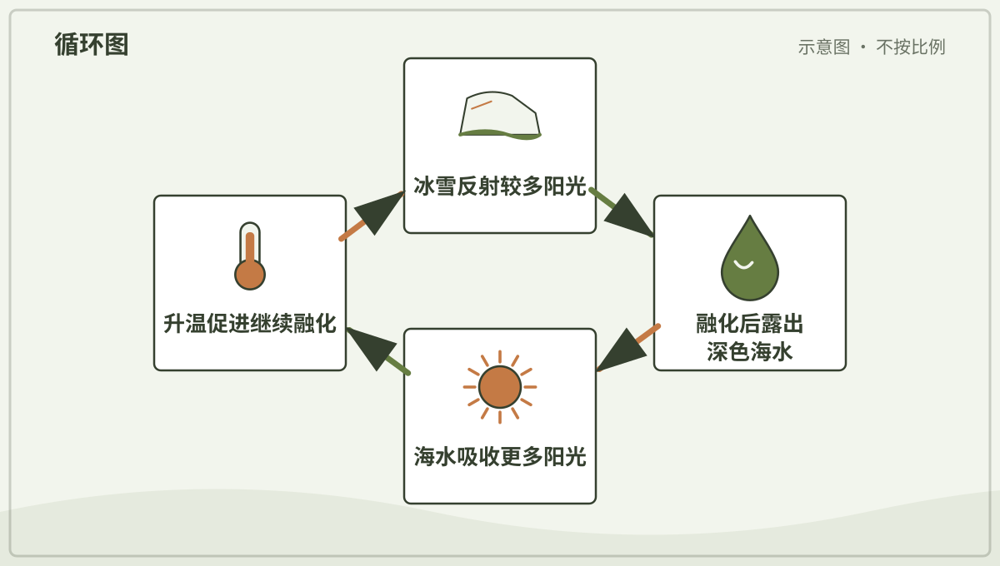

# 兴趣单元 24｜地图、坐标与时区

> **探索领域 08：** 地球、地图与地貌
>
> **核心问题：** 人怎样把球形地球缩到平面、规定方向和坐标，并让不同地点记录各自时间？

大陆、比例尺、投影、方向、卫星定位、经纬线、纬度受热和时区组成一套描述空间与时间位置的工具。

## 怎样沿着本单元的追问链阅读

地图符号和边线是表达工具，不要把纸上的线误认为地面一定有同样的痕迹。

## 追问链 24.1｜大陆、地图、投影与定位

制图必须选择比例和投影，方向、卫星信号与经纬网帮助定位。

### 第 225 问｜地球有几块大陆？

常见地理教学把陆地分成七大洲，但有些文化和体系会合并成六洲或其他数量。大陆是很大的连续陆地，洲的划分还包含历史和文化约定。海洋彼此连通。

**再想一步：** “有几大洲”不是纯粹由海水自动给出的唯一答案，欧洲和亚洲就连成一大片陆地。自然地形与人类分类在地图上常会交织。

**把知识连起来：** 大陆是大片连续陆地及相邻大陆架的地理概念，但怎样把相连陆地分组还受到历史和文化约定影响。常见体系把世界分为七大洲，也有六洲、五洲等教学体系。板块边界与洲界也并不完全重合。

**再往外看：** 欧洲和亚洲陆地连续，却常因历史文化分成两洲；北美洲与南美洲由狭窄地峡相连，分类方式同样有约定成分。比较地图图例才能知道它采用哪套体系。

**容易弄混：** “地球究竟有且只有几块大陆”并非只靠自然界就能给出唯一整数。回答时应先说明分类规则，而不是把另一套约定说成错误。

**一起看看：** 在地球仪上找最大的连续陆地和环绕它们的水。

---

### 第 226 问｜地图怎样把大地方装进小纸上？

地图按比例缩小真实地方，再用线条、颜色和符号表示道路、河流、建筑或高度。比例尺告诉我们图上距离和真实距离怎样对应。图例解释符号意思。

**再想一步：** 地图会为用途选择信息：地铁图重视连接，地形图重视高度，天气图重视气象。省略不是错误，但读图要先问它想解决什么问题。

**把知识连起来：** 地图先按比例把真实距离缩小，再选择符号、颜色和文字表示道路、河流或高度；制图者还决定保留哪些信息、舍去哪些细节。比例尺越小，覆盖范围通常越大，但单个地点能画出的细节越少。地图因此是有目的的空间模型。

**再往外看：** 地形图用等高线表示高度，交通图会主动拉伸或简化线路，导航地图则随缩放层级改变信息。不同地图不能只按像不像照片评价。

**容易弄混：** 地图不是把大地像照片一样完整缩印在纸上，也不保证图上方天然就是北。方向、比例、图例和日期都要先读。

*图解：制图者选择比例尺、方向和符号，把真实空间关系缩小到平面。*

**一起看看：** 在一张熟悉地点的地图上找图例、方向和比例尺。

---

### 第 227 问｜为什么世界地图上的地方会变形？

球面不能像纸一样无拉伸、无撕裂地完全摊平。把地球画成长方形地图时，面积、形状、距离或方向至少有一些会变形。不同投影选择保留不同特点。

**再想一步：** 墨卡托投影较好保持局部方向，适合传统航海，却把高纬地区面积放大。等积投影保留面积比例，但形状会改变；没有一张平面世界地图处处完美。

**把知识连起来：** 球面无法在不变形的情况下完整铺到平面，就像橙皮不能无裂缝地压平。地图投影必须在面积、形状、距离或方向之间取舍；墨卡托投影保留局部角度，却把高纬地区面积夸大。不存在对所有用途都完全正确的世界平面图。

**再往外看：** 等积投影适合比较区域大小，航海图重视方向，极区地图又会采用不同中心。数字地球仪可减少某些平面投影误解。

**容易弄混：** 地图变形不等于制图者画错或故意欺骗，也不能只换一种投影就消除全部误差。应根据用途说明哪种性质被保留。

*图解：球面无法无变形地铺成平面；不同投影会分别改变面积、形状或距离。*

**一起试试：** 尝试把橘子皮铺平，观察哪里必须裂开或挤皱。

---

### 第 228 问｜东南西北从哪里来？

东、西、南、北是人们描述地面方向的一套共同方法。东和西大致联系太阳升落方向，南北沿地球经线指向两极。具体方向要靠指南针、地图或地标确认。

**再想一步：** “前后左右”会随身体转向改变，基本方位不会跟着观察者转。太阳升起的准确位置还会随季节和纬度变化，所以不能把“正东升”当成每天都准确。

**把知识连起来：** 东和西可由地球自转造成的日月视运动建立，北和南则可借地理极与经线定义；四个基本方向互相垂直地组织平面位置。太阳升落位置会随季节和纬度变化，所以只能给出大致方向。指南针提供的是磁北方向，还需考虑磁偏角。

**再往外看：** 地图、影子、星空、指南针和卫星导航各有适用条件，可靠导航会交叉验证多个线索。

**容易弄混：** 太阳并非每天从正东升、正西落，指南针红针也不是任何地点都精确指向地理北极。方向是参照系统，不能脱离地点与方法。

**一起看看：** 和大人找出家里的北边，再转身确认“左边”已经改变。

---

### 第 229 问｜手机怎样知道自己在哪里？

定位卫星不断广播自己的位置和精确时间。接收器比较多个卫星信号到达的时间，算出与卫星的距离，再确定地面位置。高楼、山谷和室内会让信号变差。

**再想一步：** 通常至少需要四颗卫星，才能同时解出三维位置和接收器时钟误差，这叫测距定位。地图应用还会结合无线网络、基站和运动传感器修正结果。

**把知识连起来：** 手机接收多颗导航卫星广播的精确时间和轨道信息，由信号传播时间估算到各卫星的距离，再解算自身位置与时钟误差。室内、楼群或山谷会遮挡和反射信号，手机还会结合无线网络、基站和惯性传感器改善估计。地图上的蓝点因此带有误差范围。

**再往外看：** GPS 只是全球导航卫星系统之一，其他系统也提供服务。精密测量会使用双频、差分校正和更长时间观测。

**容易弄混：** 卫星通常不是一直给每部手机拍照后认出主人，手机也不是只连一颗卫星就能得到完整三维位置。定位数据涉及隐私，应由大人管理权限。

*图解：多颗卫星广播精确时间，接收器比较信号到达时间来估计距离和位置。*

**一起看看：** 和大人在开阔处看定位圆圈变大变小，不分享家庭位置。

---

### 第 230 问｜经线和纬线真的画在地上吗？

经线和纬线是人们想象并画在地图、地球仪上的定位网。地面上通常没有这些真正的线。纬度表示南北位置，经度表示绕地球的东西位置。

**再想一步：** 纬线彼此平行，经线在两极相交。经度需要选一条人为约定的零度经线，现代通用本初子午线经过英国格林尼治附近。

**把知识连起来：** 纬线表示与赤道平行的角度位置，经线连接两极并表示东西方向的角度；它们是人为定义的坐标网，不是地表真实刻痕。纬度以赤道为零度，经度的零度线则由国际约定选定。坐标把地点转换成可交换的数字。

**再往外看：** 导航、气象和天文使用的坐标精度不同，同一地点还可能因采用不同大地基准出现小差别。

**容易弄混：** 经纬线不会在海面上发光或阻挡动物移动，赤道也没有一条物理绳。它们虽是约定，却能通过一致测量产生真实用途。

**一起看看：** 在地球仪上沿一条经线摸到两极，再沿赤道绕一圈。

## 追问链 24.2｜纬度、冷热与时区

太阳照射角随纬度变化，地球自转又让不同经度经历不同地方时。

### 第 231 问｜赤道为什么特别热？

赤道附近一年中太阳常升得较高，阳光较直接地落在地面。同一束阳光分摊的地面面积较小。阳光穿过的大气路径也较短，所以那里平均得到较多太阳能量。

**再想一步：** 温度还受云、海洋、海拔和风影响，赤道并非每处都最热。干燥副热带沙漠有时出现更高地表温度，说明纬度只是重要因素之一。

**把知识连起来：** 赤道附近太阳全年升得较高，同一束阳光分布在较小地面面积，穿过大气的路径也相对较短，因此平均获得的太阳能较多。高纬阳光斜射，同样能量摊得更开，并有明显季节变化。云、洋流、海拔和地表性质又会调节实际温度。

**再往外看：** 热带雨林与热带沙漠都可位于低纬，说明太阳能多不等于降水一定多。全球环流把热量和水汽重新分配。

**容易弄混：** 赤道不是因为离太阳明显更近才热；地球半径差与日地距离相比太小。也不能说赤道每个地方、每一天都是地球最热处。

**一起看看：** 用手电分别直照和斜照纸面，比较光斑大小。

---

### 第 232 问｜南北两极为什么很冷？

极地阳光常斜着照，冬季还会长时间没有太阳。冰雪反射许多阳光，让地面吸收的能量更少。南极高原海拔很高，通常比北极更冷。

**再想一步：** 冰雪反射阳光的比例叫反照率。海冰融化露出深色海水后，吸收会增加，进一步促进变暖，这是冰—反照率反馈。

**把知识连起来：** 极区太阳光以很低角度到达，能量铺在更大面积，冬季还会长时间没有太阳升起。冰雪反射较多阳光，进一步减少吸收；大气和洋流带来的热量只能部分补偿。南极高海拔大陆与北极海洋的温度条件也不同。

**再往外看：** 极昼不一定很暖，因为太阳仍贴近地平线；海冰、陆冰和积雪对气候反馈各有作用。

**容易弄混：** 两极冷不是因为它们在地球图上离太阳更远，也不能把北极和南极当成完全相同环境。纬度、海拔、海陆和季节共同决定温度。

*图解：冰雪减少会露出深色海水，海水吸收更多阳光并升温，又会促进更多融化。*

**一起看看：** 把白纸和黑纸放在阳光下，由大人稍后比较温度，不久晒。

---

### 第 233 问｜为什么别的地方可能正在睡觉？

地球不同经度面对太阳的时间不同，一处正午时，远处可能是夜晚。人们把世界分成时区，让相近地区使用相近钟点。时区边界会为国家和生活需要弯曲。

**再想一步：** 地球 24 小时转约 360 度，平均每 15 度经度相差约一小时，但实际时区不是整齐直线。国际日期变更线附近还会相差一天。

**把知识连起来：** 地球约每二十四小时自转一周，面向太阳的一侧是白天，背向太阳的一侧是夜晚。不同经度依次转入阳光，所以各地本地时间不同。时区把连续变化的太阳时整理成便于社会协作的钟表时间。

**再往外看：** 时区边界常沿国家或行政区调整，并不总按经线整齐划分；国际日期变更线也会为岛屿和国家绕行。

**容易弄混：** 别处正在睡觉不是因为那里的钟坏了，也不是每隔十五度经度就必定整差一小时。人的作息、季节和人为时区都会改变实际情况。

**一起看看：** 在地球仪一侧照灯，找出同时是白天和夜晚的地方。

## 单元综合观察｜把一个地方画成两种地图

选择房间或院子，先画从上往下的平面图，再画侧面的高低图。比较两张图保留和省略了什么；不在道路上边走边画。
