# 兴趣单元 26｜海水、深度与海洋食物网

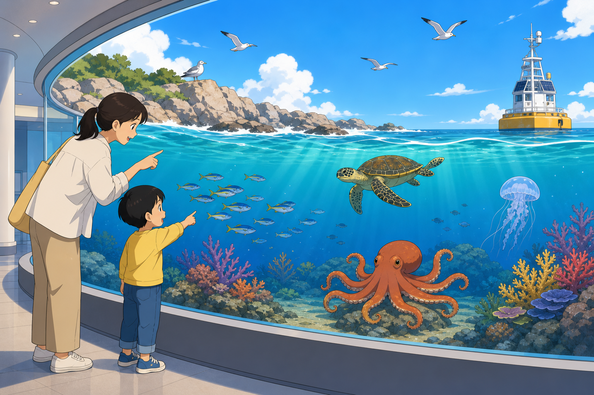

> **探索领域 09：** 海洋、海岸与水中生命
>
> **核心问题：** 海水为什么咸并不断运动，深度又怎样改变压力、光照和生命关系？

盐分、波浪、潮汐与洋流描述海水系统，深度带来更大压力和更少光，珊瑚与浮游生物把物理环境连接到食物网。

## 怎样沿着本单元的追问链阅读

区分水粒子的局部运动和波能传播，也区分表层照片的颜色与深海真实光照。

## 追问链 26.1｜盐分、波浪、潮汐与洋流

岩石风化、风、引力和密度差分别参与海水组成与运动。

### 第 244 问｜海水为什么是咸的？

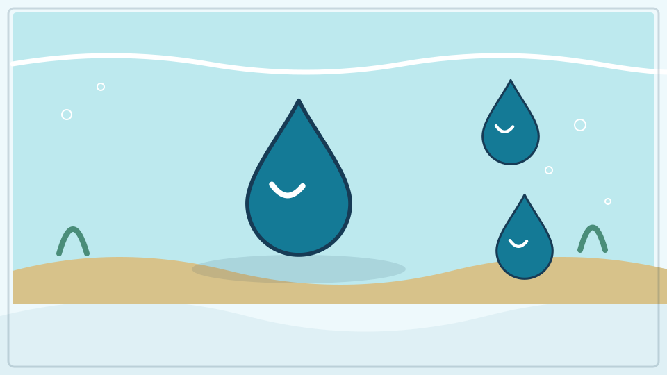

雨水和河水会从岩石中带走少量溶解的矿物离子，送进海洋。海底火山和热液活动也会加入物质。水不断蒸发，许多盐却留在海里，所以海水很咸。

**再想一步：** 海盐不只是食盐，还含镁、钙、钾等离子。河流也有盐，只是浓度低；海洋中的输入和沉淀、生物利用等移出过程长期接近平衡。

**把知识连起来：** 雨水和河水在岩石、土壤中流动时溶解离子，最终把它们带进海洋；海底热液活动和火山也会提供部分物质。水从海面蒸发时，绝大多数盐留在海里，而矿物沉积和生物作用又会移走一部分。漫长时间里的输入与输出形成今天的盐度。

**再往外看：** 海水最丰富的溶解离子是钠离子和氯离子，但还有镁、硫酸根、钙等。不同海区因降水、蒸发、结冰和河流输入而盐度不同。

**容易弄混：** 海水不是因为海底铺着食盐才咸，河水也并非完全没有盐。尝海水既不能测盐度，也不卫生；科学家用电导率等仪器测量。

*图解：水和岩石作用带走溶解物，经河流进入海洋；水蒸发后盐分大多留下。*

**一起记住：** 海水不能当饮用水，也不靠品尝来判断水质。

---

### 第 245 问｜海浪是不是整团水跑到岸上？

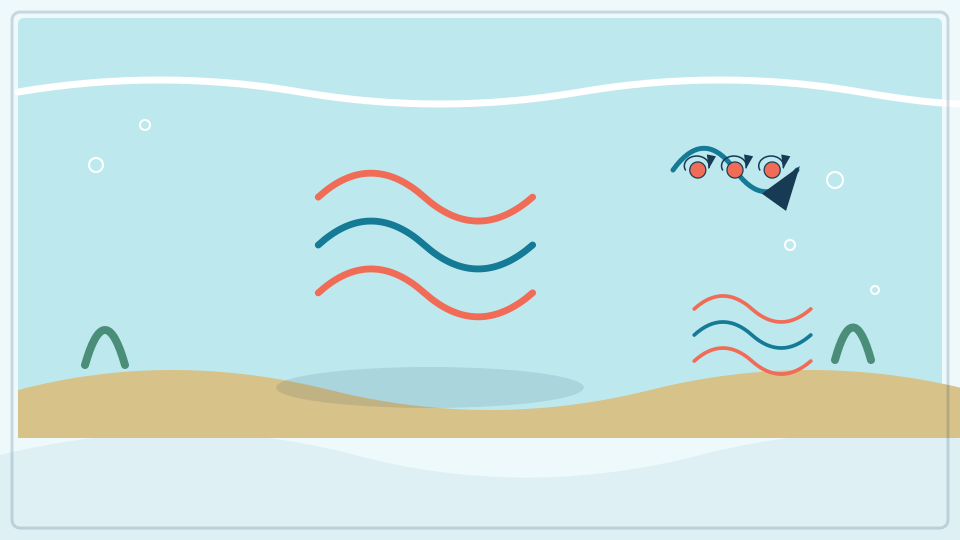

风把能量传给海面，形成波浪。波向前走时，深水里的水粒子多在小圈中来回运动，并没有随每个浪一直跑很远。靠近岸边，海底让波变陡并破碎。

**再想一步：** 波主要传递能量而非整团物质，但海流、碎浪和沿岸流确实会搬运水与泥沙。浪高受风速、吹风时间和风吹过的海面距离影响。

**把知识连起来：** 风把能量传给水面后形成波，开阔海面上的水粒子多在小范围内作近似圆形或椭圆形运动，波形和能量却能向远处传播。进入浅水区后，海底拖慢波的下部，波长缩短、波高增加，最后破碎并推动近岸水流。

**再往外看：** 地震可让整个水柱产生海啸，机制和普通风浪不同；船经过形成的尾波也有自己的能量来源。浮标轨迹能直观看出水与波形并非同速远行。

**容易弄混：** 一排海浪不是同一堵水墙从大洋中央一路跑到岸上。破浪确实会搬运水和沙，但不能把所有波动都解释成整团水平移。

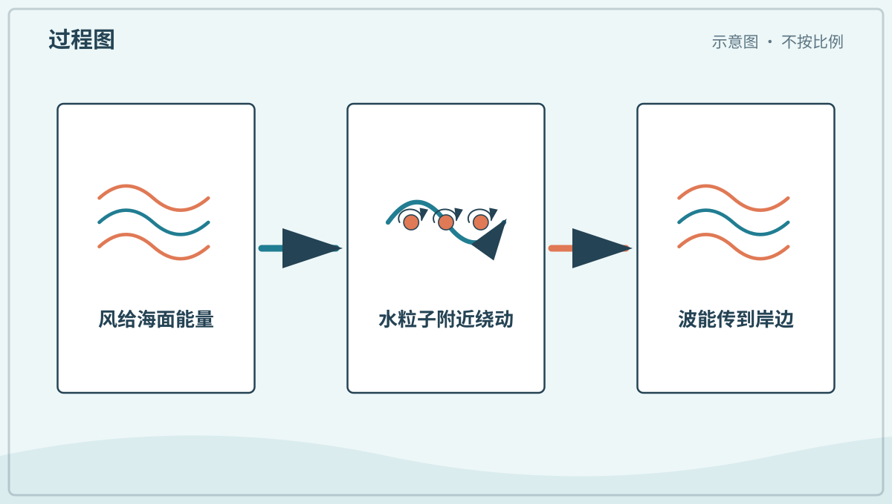

*图解：风把能量交给海面；水粒子多在原地附近绕动，而波形和能量向前传播。*

**一起看看：** 只在安全岸上看漂浮物随小波上下，水边必须由大人陪同。

---

### 第 246 问｜海水为什么一天会涨落？

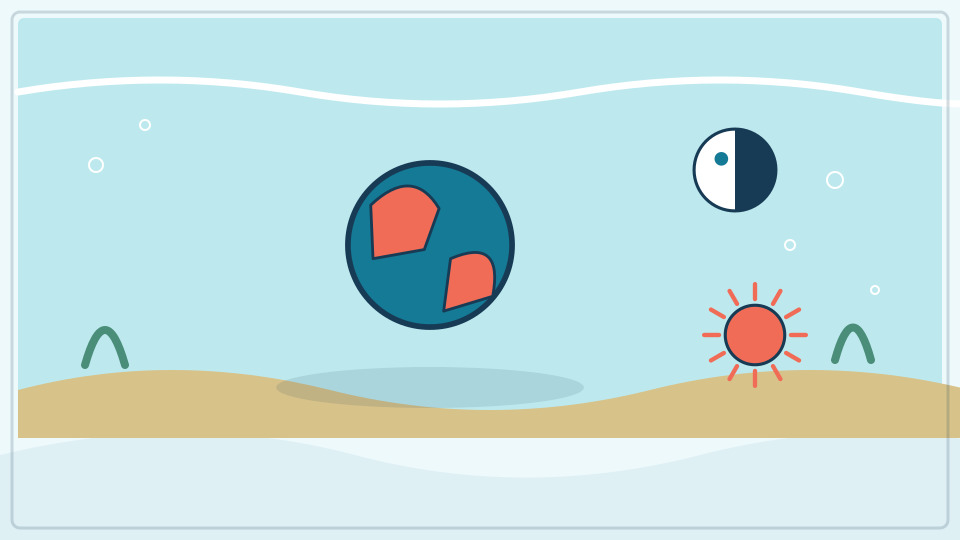

月球和太阳的引力会拉动地球海洋，形成很长的潮汐波。地球自转时，各地海岸轮流经历较高和较低水位。海岸形状让不同地方的时间和高度很不一样。

**再想一步：** 月球对地球近侧和远侧的引力差是潮汐关键，而不是简单只把一边海水拉起。太阳、月球与地球排成一线时，潮差常较大。

**把知识连起来：** 月球引力对地球近侧和远侧的作用略有差别，使海洋与整个地球发生潮汐形变；太阳也参与，海盆形状、海岸和海底摩擦再把理想形变改成各地不同的涨落。地球自转让一个地点依次经过潮汐区域。多数海岸每天约有两次高潮和低潮，但并非处处相同。

**再往外看：** 新月和满月附近，日月潮汐作用较同向，常出现较大的大潮；上弦、下弦附近常较小。天气和气压还能叠加风暴增水。

**容易弄混：** 潮水不是月亮只把正下方海水吸起来，也不是每隔精确六小时同样高低。预测必须使用当地长期观测和天文计算，赶海要查正式潮汐表并由大人带领。

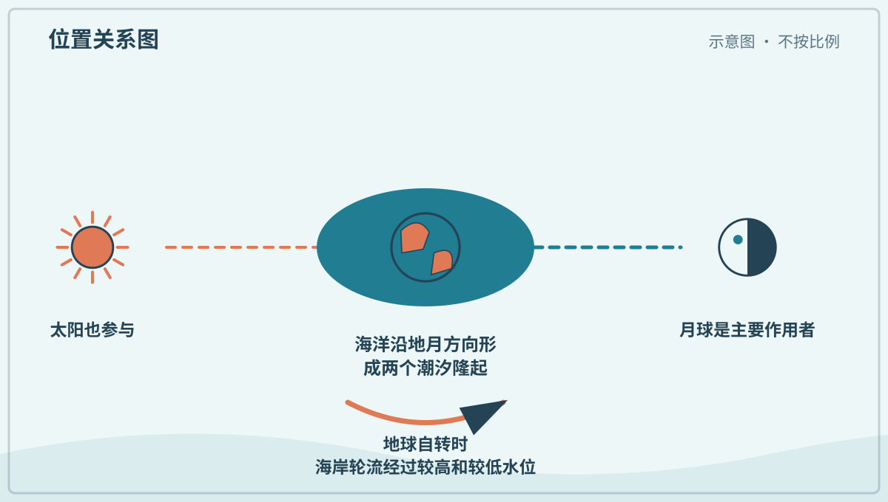

*图解：月球引力是潮汐主因，太阳也会参与；地球自转让海岸经过潮汐隆起。*

**一起看看：** 在同一安全海岸比较涨潮和落潮照片，不自行走入潮间带。

---

### 第 247 问｜海洋里也有看不见的“大河”吗？

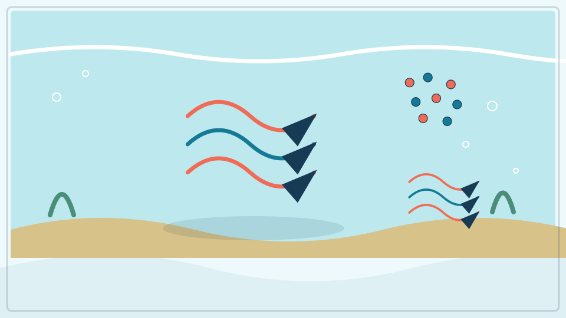

海水会沿较稳定方向流动，形成洋流。表层洋流主要受风和地球自转影响，深层环流还与温度、盐度造成的密度差有关。洋流搬运热量、养分和生物。

**再想一步：** 地球自转让大范围流动发生偏转，这叫科里奥利效应。海盆形状和海底地形会引导水流，所以洋流不是一条边界整齐的水管。

**把知识连起来：** 海洋中的洋流由盛行风、海水密度差、潮汐和海盆边界共同驱动。温度和盐度改变密度，较密海水可下沉并参与深层环流；地球自转使大尺度流动发生偏转。洋流像在海中延伸的流带，却没有河岸把它固定住。

**再往外看：** 表层环流搬运热量并影响天气、航海和生物迁移，深层水团则可能经历数百年至更久的全球旅程。卫星、漂流浮标和水下剖面仪共同测量它们。

**容易弄混：** 海洋“大河”不是颜色清楚、边界不动的一根水管，也不是所有流都由温盐差单独造成。速度、深度和范围会随季节与天气变化。

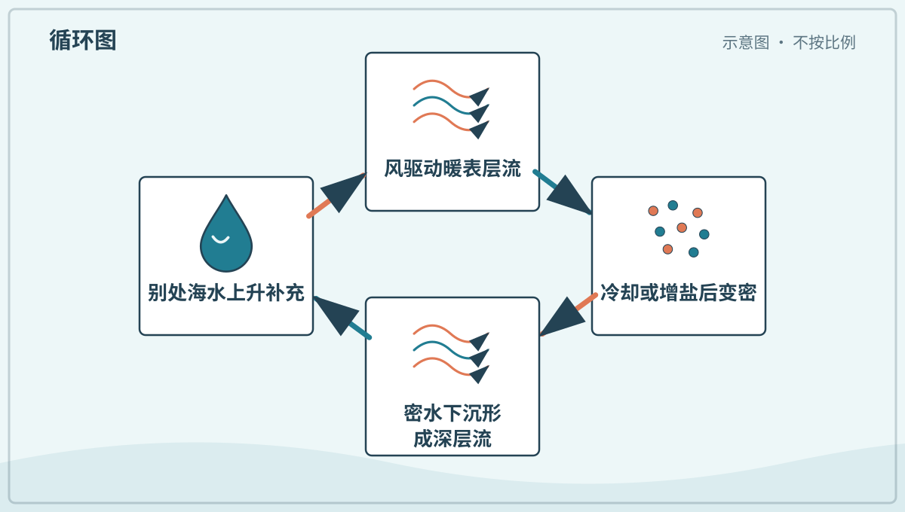

*图解：风推动表层海水，温度和盐度造成密度差，又驱动深层海水缓慢循环。*

**一起看看：** 在世界地图上沿一条暖流从低纬画向较高纬。

## 追问链 26.2｜深度、压力与光

上方水柱增加压强，海水逐步吸收和散射不同颜色的光。

### 第 248 问｜海洋到底有多深？

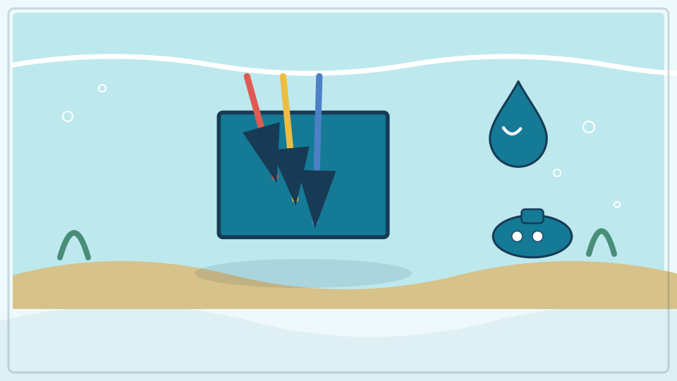

海洋平均深度约几千米，最深海沟超过一万米。海底有平原、山脉、火山和峡谷，不是一只平底大碗。人类用声呐和潜水设备测量、探索。

**再想一步：** 声呐发出声波，测量回声往返时间，再用水中声速估算深度。温度、盐度和压力会改变声速，因此精确地图还需要校正与多次测量。

**把知识连起来：** 海洋平均深度约三点七千米，最深海沟接近十一千米，但海底并不是一个平底盆。大陆架、海山、洋中脊、深海平原和海沟构成起伏地形。声呐根据声波往返时间测深，卫星也能由海面细微起伏推测大尺度海底结构。

**再往外看：** 只有很小一部分深海被人直接看过，遥控潜器、自主潜器和载人潜水器各自承担成像、取样与测量。新地图仍在提高覆盖和分辨率。

**容易弄混：** 最深处不是地心附近的无底洞，也不能用一张颜色渐变图当作已经看清每块海底。数字深度总带有测量位置、基准和误差。

**一起看看：** 把最高山和最深海沟画在同一高度尺上比较。

---

### 第 249 问｜深海的水为什么压力很大？

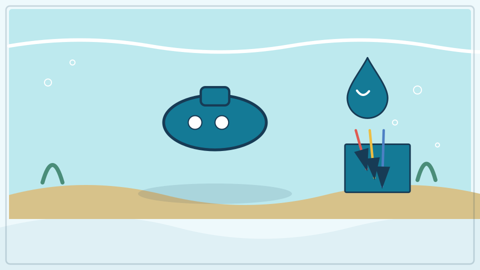

越往深处，上方压着的海水越多，压力越大。每一小块表面都受到周围水的推力。深海设备要用坚固外壳或让内外压力平衡。

**再想一步：** 静水压力大致随深度线性增加，约每下潜十米增加一个大气压。压力来自各方向，不只是从头顶向下，所以薄而空的容器容易被压坏。

**把知识连起来：** 水有重量，越深处上方水柱越高，单位面积承受的压力就越大；近似关系是压力随密度、重力和深度增加。海水会从各个方向施压，而不只是从头顶向下。深海动物的体内液体也有压力，因此关键常是内外压差和含气空间。

**再往外看：** 潜水器用厚耐压舱保护常压人员和设备，许多深海生物则没有大型充气腔，并以分子和细胞适应高压。

**容易弄混：** 深海动物不是靠特别硬的皮单独挡住全部海水，也不会在原深度被“压扁成纸”。把它们快速带到浅处，压力和温度变化反而可能造成伤害。

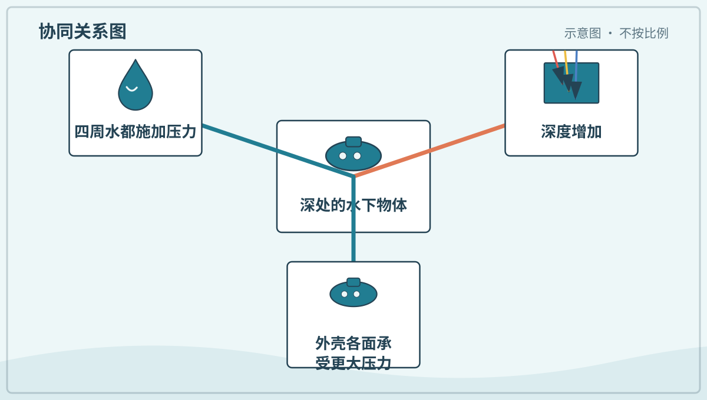

*图解：越深处上方水柱越高、重量越大，因此各方向的水压都更高。*

**一起试试：** 用手轻压装水的密封软袋，感受液体把压力传向各处。

---

### 第 250 问｜海里越深为什么越黑？

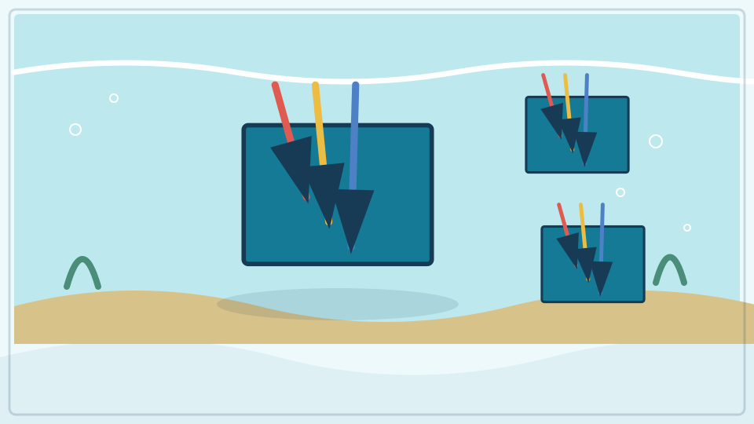

阳光进入海水后会被水分子、颗粒和生物吸收或散射。红光较快减少，蓝光能走得更深，所以海中常偏蓝。到深海后，太阳光几乎到不了。

**再想一步：** 能进行充足光合作用的上层叫透光带，再下方是微光和无光区域。水越浑浊，光衰减越快；深海动物常依靠触觉、化学感觉或自发光。

**把知识连起来：** 阳光进入海水后会被水分子、溶解物和颗粒吸收或散射，红光等较长波长通常先减弱，蓝绿光能到得更深。颗粒多的水会更快变暗，绝大部分深海没有太阳光。眼睛、相机和动物视觉只能利用仍存在或生物自己产生的光。

**再往外看：** 海洋学常把上层按光是否足以支持光合作用划分透光层与更深区域，边界会随水质和季节变化。

**容易弄混：** 海水越深不是因为“黑色东西”越来越多，也不是固定到某一米突然全黑。光谱各部分连续衰减，清澈度和太阳高度都会影响。

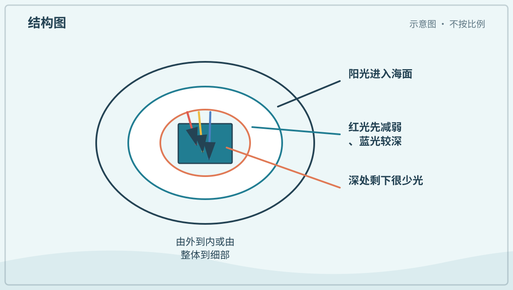

*图解：海水会逐步吸收和散射阳光；不同颜色穿透不同，足够深处几乎全黑。*

**一起看看：** 比较清水和加一点安全泥土的水杯，哪杯更容易透光。

## 追问链 26.3｜珊瑚、浮游生物与食物网基础

共生关系和微小生产者为许多海洋食物网提供重要物质与能量入口。

### 第 251 问｜珊瑚是石头还是植物？

珊瑚是动物。许多小珊瑚虫共同生活，分泌碳酸钙骨骼，长期堆成珊瑚礁。它们用触手捕食，也常与体内微小藻类合作。

**再想一步：** 共生藻用光合作用制造糖，给珊瑚许多能量；珊瑚则提供住处和物质。礁体看似岩石，表面却覆盖活的组织和复杂生态系统。

**把知识连起来：** 造礁珊瑚由许多小型刺胞动物珊瑚虫组成，它们分泌碳酸钙骨骼，世代累积成礁体。许多珊瑚细胞内生活着能光合作用的共生藻，藻提供部分有机物，珊瑚提供庇护和营养。动物、藻和骨骼一起造成像彩色石花的外观。

**再往外看：** 珊瑚礁为大量生物提供复杂栖息地，也能削弱部分海浪；深水冷水珊瑚则可以不依赖同样的共生藻。

**容易弄混：** 珊瑚既不是石头也不是植物，硬骨骼也不表示整个群体没有活体。触摸、踩踏或带走珊瑚会伤害生物并可能违法。

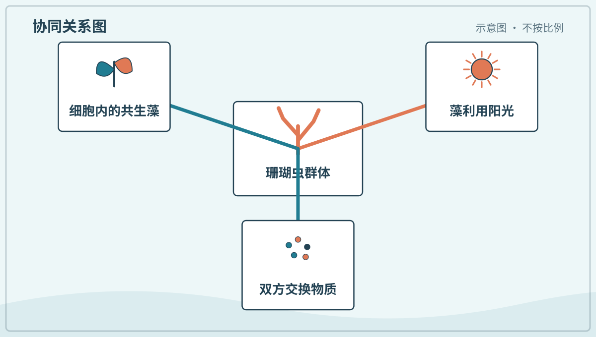

*图解：珊瑚虫给共生藻提供栖身处和原料，共生藻用光合作用提供部分养分。*

**一起看看：** 在放大照片中找一只只小珊瑚虫，不触摸活珊瑚。

---

### 第 252 问｜珊瑚为什么会变白？

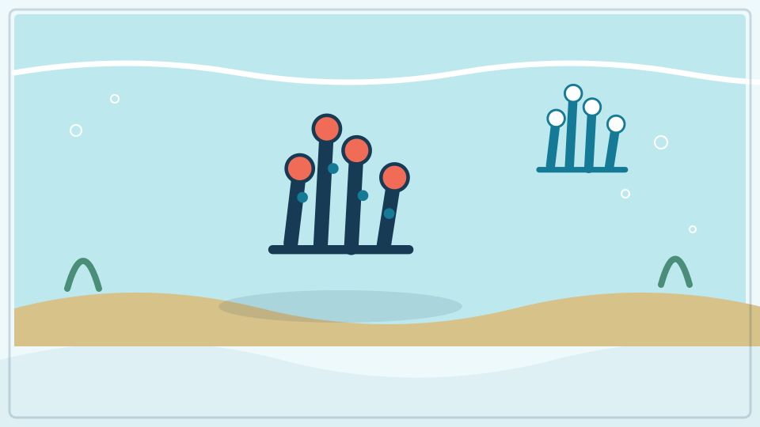

海水过热、污染或其他压力会破坏珊瑚与共生藻的关系。珊瑚失去藻类后，透明组织下的白色骨骼显出来，这叫白化。白化珊瑚仍可能活着，却更缺能量。

**再想一步：** 若条件很快恢复，一些珊瑚能重新获得共生藻；压力持续则可能死亡。不同珊瑚耐受不同，海洋升温让大范围白化更频繁。

**把知识连起来：** 海水过热、强光、污染或其他压力会破坏珊瑚与共生藻的关系，珊瑚失去大量共生藻或其色素，白色骨骼便透过透明组织显现，这叫白化。短期白化不等于立刻死亡，但能量来源减少，压力持续时更易饥饿、患病和死亡。

**再往外看：** 不同珊瑚和共生藻耐热性不同，局部水质、遮阴和恢复间隔会影响后果；长期减少温室气体排放是降低大范围热压力的关键。

**容易弄混：** 白化不是珊瑚被漂白剂洗过，也不能把变白直接等同于已经死亡。判断恢复要持续观察组织、颜色、生长和环境。

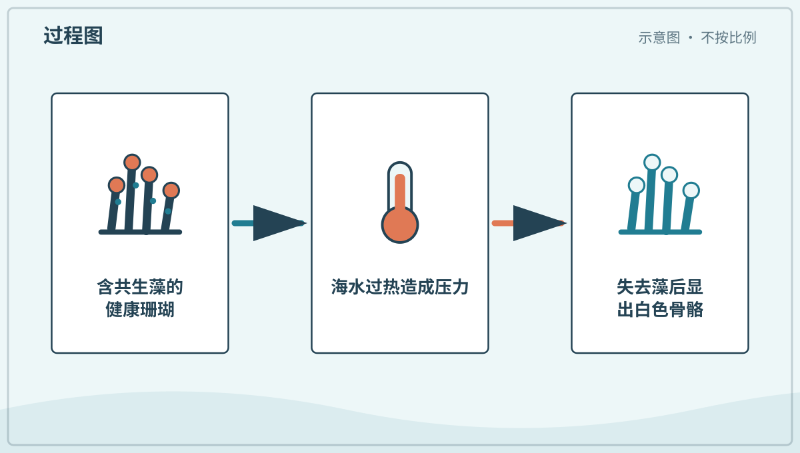

*图解：持续热压力会破坏珊瑚与共生藻的关系；藻离开后，白色骨骼透过组织显现。*

**一起看看：** 比较健康、白化和死亡珊瑚照片，找出颜色与表面差别。

---

### 第 253 问｜浮游生物都会漂着走吗？

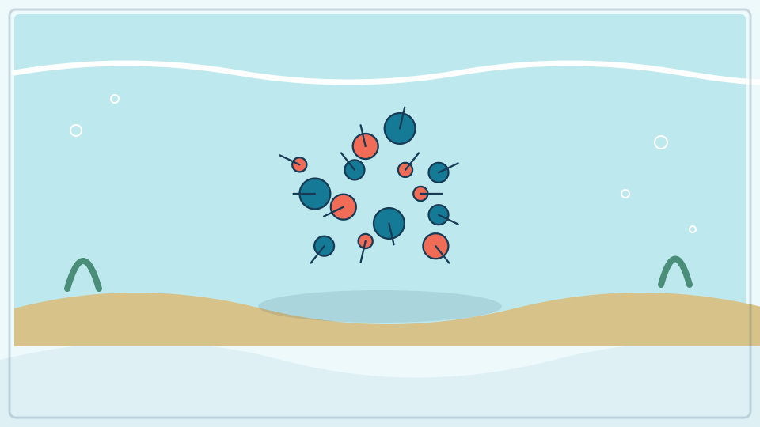

浮游生物是不能逆着水流长距离游动、主要随水移动的生物。它们包括微小藻类、细菌、动物和许多动物的幼体。水母也可属于大型浮游动物。

**再想一步：** “浮游”描述生活方式，不是一个亲缘相同的家族。许多浮游生物能上下移动或短距离游泳，只是整体位置仍强烈受洋流控制。

**把知识连起来：** 浮游生物按生活方式定义：它们随水体漂移，游动能力不足以长期抵抗大尺度水流。浮游植物包括许多能光合作用的微小生物，浮游动物则包括小型动物和许多动物的幼体。有些会每天上下迁移，却仍属于浮游生物。

**再往外看：** 同一只动物可能幼年浮游、成年在海底或主动游泳；网具、显微镜和水样 DNA 可揭示肉眼看不见的群落。

**容易弄混：** “浮游”不等于完全不动，也不等于都漂在水面。是否属于浮游类看它与水流的关系，而不是有没有鞭毛或会不会摆动。

**一起看看：** 在显微照片中找不同形状，猜哪些像植物、哪些像动物。

---

### 第 254 问｜海里的小藻类为什么重要？

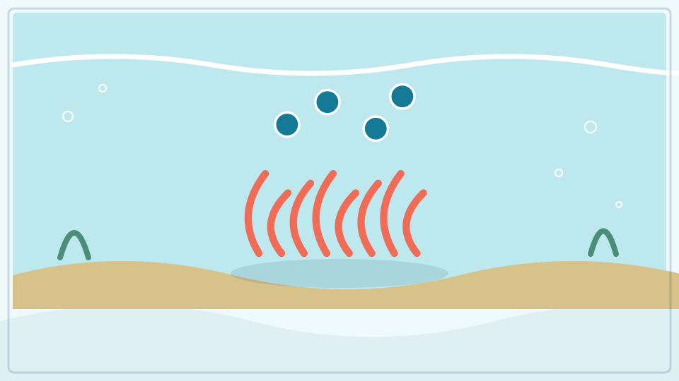

浮游植物用阳光、二氧化碳和水进行光合作用，是许多海洋食物网的起点。它们也产生地球氧气的重要一部分，并吸收碳。单个很小，合起来影响全球。

**再想一步：** 浮游植物包括多种藻类和蓝细菌，不是真正的陆地植物。它们生长受光、温度和氮、磷、铁等养分限制，过度繁殖也可能造成有害藻华。

**把知识连起来：** 微小藻类和蓝细菌利用光合作用把二氧化碳和水转成有机物，是海洋食物网的重要初级生产者。它们释放的氧气对全球氧循环贡献很大，也把碳带入海洋生物和颗粒。营养盐、光、温度和捕食共同限制其增长。

**再往外看：** 卫星可从海色估算表层叶绿素，船只还要取样确认物种和深层分布。藻华有时支撑丰富食物，有时会产毒或耗尽氧。

**容易弄混：** 海洋氧气不是全由森林提供，也不能说藻越多永远越好。生态作用取决于物种、数量、持续时间和分解过程。

**一起看看：** 在食物网图上从浮游植物连到小动物，再连到大鱼。

## 单元综合观察｜画一张从海面到深海的变化图

只比较光、压力和可见生物三个维度，箭头标出随深度增加的大致趋势。图不按比例，也不把所有深海生物画在同一地点。
