# 兴趣单元 27｜海洋动物、海岸与塑料

> **探索领域 09：** 海洋、海岸与水中生命
>
> **核心问题：** 海洋生物怎样支撑、移动、育幼、共生和导航，海岸材料又怎样被水搬运和污染？

从水母、棘皮动物、甲壳类和头足类进入鱼、海马、海龟，再观察红树林、海草、海藻、贝壳、沙滩与塑料。

## 怎样沿着本单元的追问链阅读

真实外形用观察图辨认，运动和共生用关系图解释；不要用水族箱颜色代表全部海洋。

## 追问链 27.1｜无脊椎动物的支撑与运动

水压、肌肉、外骨骼、壳和喷射推进提供多样身体方案。

### 第 255 问｜水母没有骨头怎样游泳？

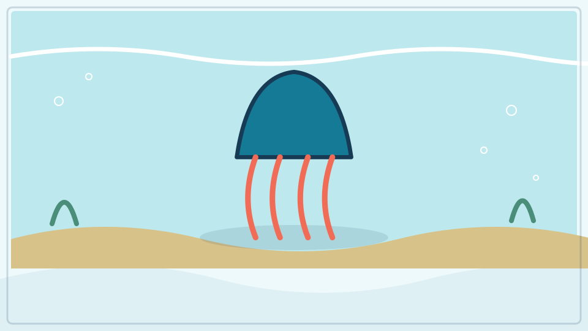

水母伞状身体收缩时，把水向后推出，身体便向前移动。放松时，弹性组织让伞重新张开并吸入水。许多水母仍会随洋流漂动。

**再想一步：** 水母身体大部分是水，靠胶状中胶层保持形状。它们没有集中成脑的大脑，却有神经网协调收缩、感光和平衡。

**把知识连起来：** 水母伞部主要由含水胶质和薄组织构成，环形肌肉收缩时把伞内水向后推出，身体获得向前反作用；放松后伞恢复并重新进水。许多水母也会随洋流漂移，触手上的刺细胞用于捕食和防御。没有骨头不妨碍软组织传力。

**再往外看：** 水母游动形成的涡流可以提高推进效率，不同体形适合巡游或伏击。它们的生命周期常还包括附着的水螅体阶段。

**容易弄混：** 水母不是装满海水的塑料袋，也不能因为看起来柔软就触碰。死亡或断开的触手仍可能刺伤，应遵循海滩安全提示。

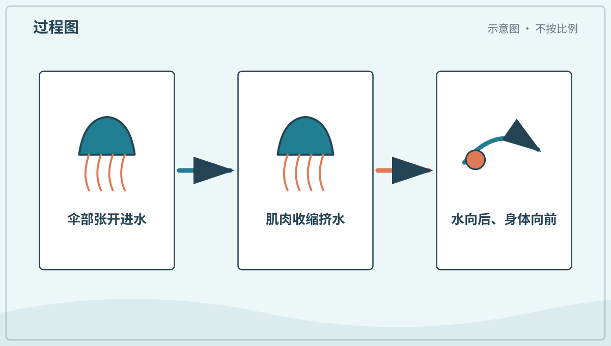

*图解：水母伞部收缩把水推向后方，水的反作用力使身体向前移动。*

**一起记住：** 海滩上的水母也可能蜇人，只看不碰并告诉大人。

---

### 第 256 问｜海星真的是鱼吗？

海星不是鱼，而是棘皮动物。它没有鱼鳃和鱼鳍，身体下面有许多管足，靠水管系统伸缩。管足能移动、抓住表面和处理食物。

**再想一步：** 海星把海水引入内部管道，用液压改变管足形状。许多海星有五条腕，但也有更多；失去腕后的再生能力因种类和损伤位置不同。

**把知识连起来：** 海星属于棘皮动物，与海胆、海参亲缘更近；成体常呈五辐射对称，内部水管系统控制许多管足，用于移动、附着和取食。鱼则有脊柱、鳃和成对鳍等不同身体方案。“星”描述形状，“鱼”只是历史俗名。

**再往外看：** 海星幼体多为左右对称，变态后才形成辐射对称，显示生命周期能大幅改变身体结构。

**容易弄混：** 海星不是鱼，也不是每只都恰好五条腕。不要把海星捞出水摆拍或翻弄，具体观察规则应听从当地保护人员。

**一起看看：** 在海星腹面照片中找中央口和一排排管足。

---

### 第 257 问｜海参为什么像一根软香肠？

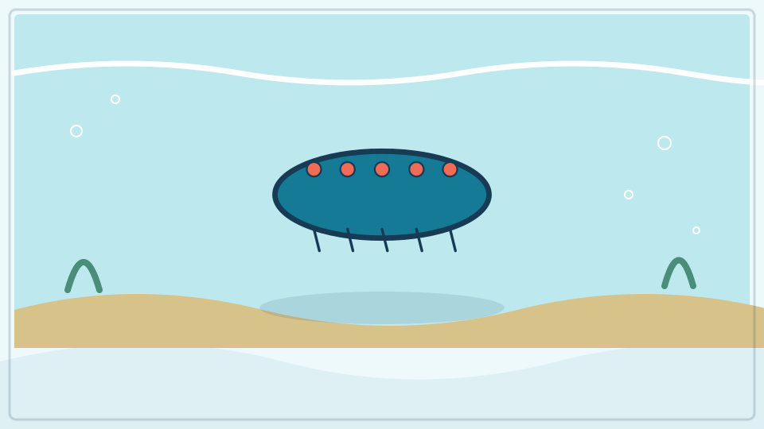

海参也是棘皮动物，身体沿一个方向拉长。它的骨片很小并分散在体壁中，所以身体柔软。许多海参吞食海底沉积物，消化其中有机物，再排出处理后的沙泥。

**再想一步：** 海参用体壁肌肉和水管系统改变形状，有些遇险会排出黏丝或部分内脏，再慢慢再生。防御很耗能，不应故意刺激它们。

**把知识连起来：** 海参也是棘皮动物，身体把祖先的辐射结构拉成长筒形，口周触手收集沉积物或悬浮食物。体壁中的微小骨片和可改变硬度的结缔组织提供支撑，水管系统参与运动。吞食海底沉积物后，它们能处理有机碎屑并翻动海床。

**再往外看：** 某些海参遇险会排出黏丝或部分内脏，之后再生，但这种防御代价很大，不应人为刺激。

**容易弄混：** 软并不等于没有内部支撑，像香肠只是外形比喻。海参也不是清理一切污染的“海底吸尘器”，生态能力有范围。

**一起看看：** 只在照片或水族馆规定距离观察，不用手戳。

---

### 第 258 问｜螃蟹为什么常横着走？

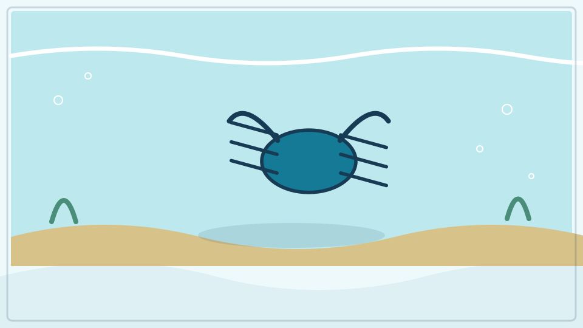

多数螃蟹的腿关节更适合向身体两侧弯曲，横走时步幅大、动作快。扁宽的身体也让侧向移动方便。它们并非完全不能向前或斜着走。

**再想一步：** 运动方向由关节结构、肌肉排列和身体重心共同决定。不同螃蟹生活在沙地、岩缝或水中，腿形和最擅长的走法也不同。

**把知识连起来：** 螃蟹身体宽扁，步足关节主要适合向侧方摆动，横走时各腿能有效推地而不必让笨重身体频繁转向。它们也能前后或斜着移动，只是侧行常更快、更稳定。不同蟹类的腿形和生活环境会改变步态。

**再往外看：** 幽灵蟹适合沙滩快速奔跑，梭子蟹后足扁成游泳桨，帝王蟹的运动方式又不同。步态是身体结构与地面共同决定的。

**容易弄混：** 螃蟹不是看不见前方才横走，也不是所有时候只能走直直的横线。眼睛方向与腿关节功能不能混为一谈。

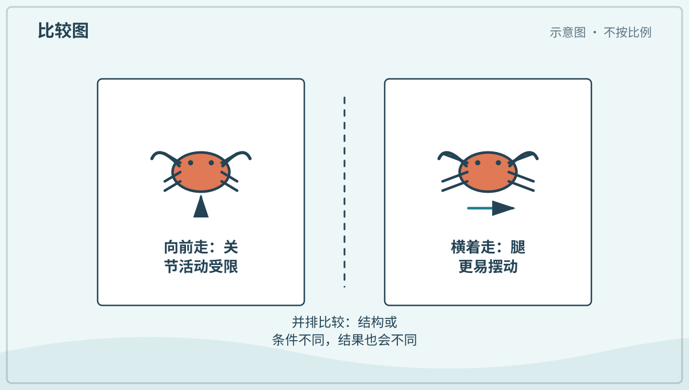

*图解：多数螃蟹的腿关节更适合向身体两侧弯曲，因此横走时步幅通常更大。*

**一起看看：** 在录像里画出螃蟹身体朝向和移动方向的两支箭头。

---

### 第 259 问｜寄居蟹的壳是自己长的吗？

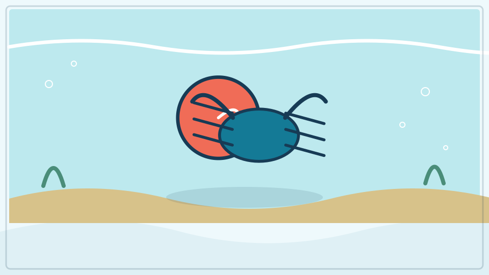

寄居蟹腹部柔软，常住进空的螺壳保护自己。身体长大后，它会寻找更合适的空壳搬家。有些寄居蟹还会排队交换大小不同的壳。

**再想一步：** 好壳是有限资源，壳口形状、重量和内部空间都会影响选择。随手捡走大量空螺壳，可能减少寄居蟹能用的住处。

**把知识连起来：** 寄居蟹腹部柔软、不对称，通常借用死亡腹足类留下的空壳保护身体；长大后会寻找更合适的壳，有时多只排队依次换壳。壳的入口、内部空间、重量和破损程度都会影响选择。它们自己的外骨骼仍会蜕皮生长。

**再往外看：** 空壳是有限资源，人类大量收集贝壳或海滩垃圾都可能改变寄居蟹可用住房；有些还会与海葵共栖。

**容易弄混：** 寄居蟹不会自己分泌那只螺旋壳，也不是任何漂亮壳都合身。不能强行拔出或替它换壳，这会损伤腹部。

**一起看看：** 海边只观察有无动物居住，不带走活体或成堆空壳。

---

### 第 260 问｜章鱼怎样一下子换颜色？

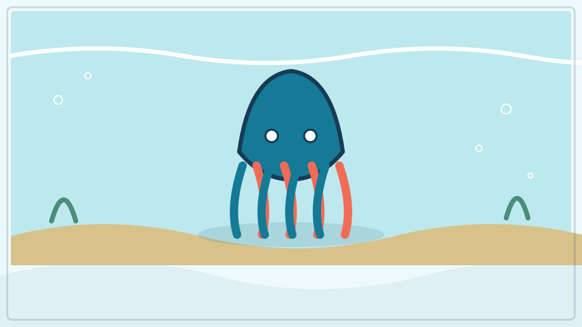

章鱼皮肤里有装着色素的色素胞，周围肌肉能把它们迅速展开或缩小。更深层的反射细胞还能制造闪亮和偏色效果。章鱼用这些变化伪装、警戒或交流。

**再想一步：** 神经系统能分别控制许多小片皮肤，配合乳突让表面从平滑变得凸凹。颜色并不总表示同一种“心情”，要结合姿势、环境和物种解释。

**把知识连起来：** 章鱼皮肤中有受神经控制的色素囊，周围肌肉把它们迅速展开或收缩；反光细胞和散射细胞又产生金属色、白色等效果。皮肤乳突还能改变表面凹凸，配合身体姿势形成伪装或信号。变化由视觉和神经系统快速协调。

**再往外看：** 章鱼会为背景、威胁、求偶和交流显示不同图案，但它们自身视觉对颜色的处理与人并不完全相同，机制仍在研究。

**容易弄混：** 章鱼不是像油漆桶一样吸入背景颜色，也不是每次变色都只为躲藏。光线、情绪和交流都可能参与，图片颜色还会受相机影响。

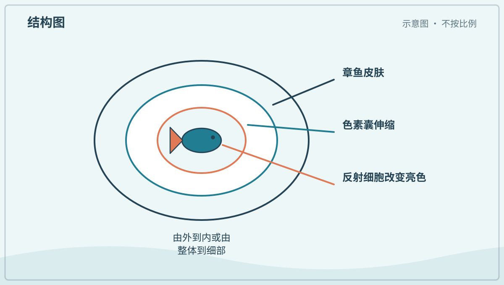

*图解：色素细胞伸展或收缩改变色块，反射细胞还会选择性加强某些波长。*

**一起看看：** 观看章鱼经过沙地和岩石时，颜色与纹理怎样连续变化。

---

### 第 261 问｜鱿鱼怎样用水喷着走？

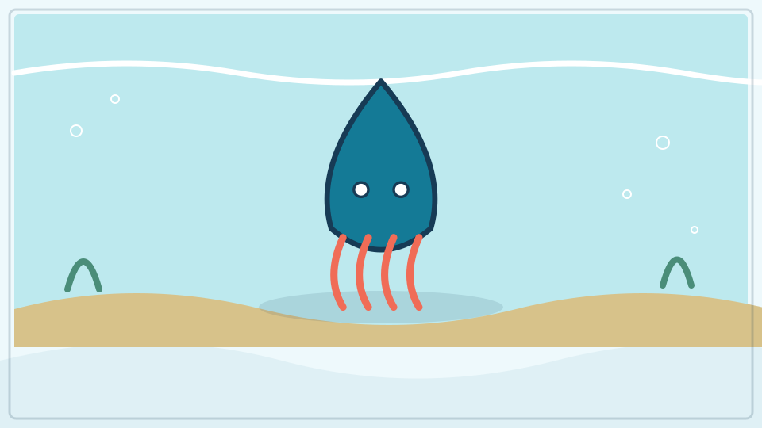

鱿鱼让海水进入外套膜腔，再用肌肉收缩，把水从漏斗状管子高速喷出。水向后喷，鱿鱼受到反作用力向前。这叫喷射推进。

**再想一步：** 改变漏斗方向就能转向，鳍则适合慢速稳定游动。喷射加速很快但耗能较多，所以鱿鱼会按情况组合两种运动。

**把知识连起来：** 鱿鱼让外套膜扩张吸水，再收缩把水从漏斗状喷口高速推出，反作用力推动身体向相反方向运动。漏斗转向可改变方向，鳍则适合较慢游动、转弯和稳定。喷射速度快但能量消耗也较高。

**再往外看：** 章鱼、乌贼和鹦鹉螺也使用不同形式的喷射推进；工程师会研究其柔性泵动和涡环。

**容易弄混：** 鱿鱼不是一直像火箭那样只靠一次爆发，也不是从口中喷水。水主要经外套腔和漏斗进出，鳍和身体波动同样重要。

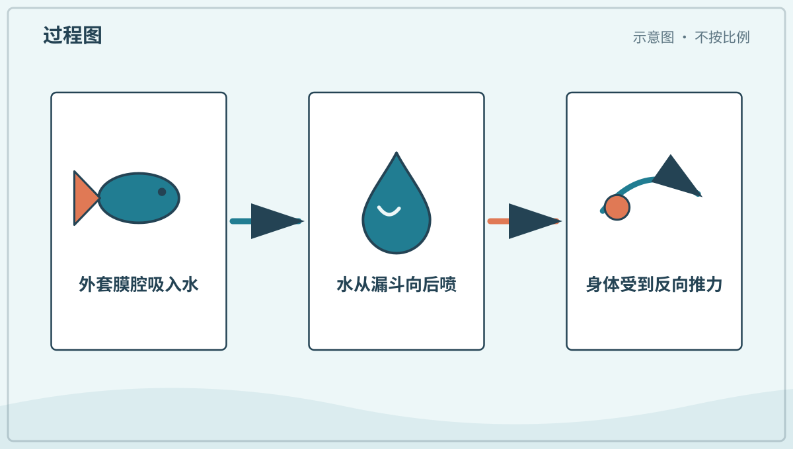

*图解：鱿鱼把水吸进外套膜腔，再从漏斗高速喷出，反作用力推动身体。*

**一起试试：** 在浴盆外由大人挤压安全软水瓶，看水与瓶受到相反方向作用。

## 追问链 27.2｜滤食、育幼、共生与导航

体型不决定食物大小，育幼角色、互利关系和多种导航线索各有证据。

### 第 262 问｜鲸鲨这么大，为什么吃很小的食物？

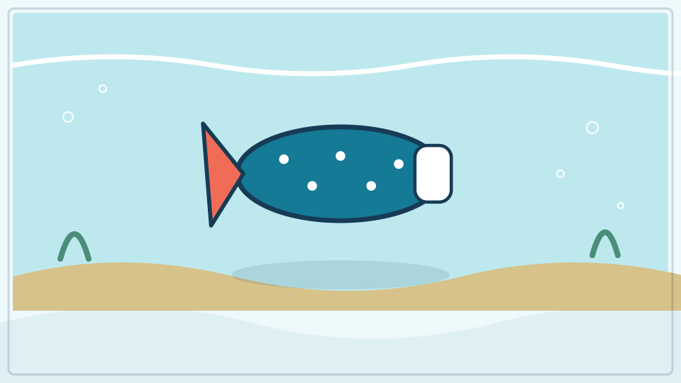

鲸鲨是世界上最大的鱼，却主要滤食浮游生物、小鱼和鱼卵。它张口让大量水通过鳃部过滤结构，把食物留下。大身体不一定需要捕捉大型猎物。

**再想一步：** 小食物单个能量少，但在合适海域会大量聚集，滤食能一次收集很多。鲸鲨是鲨鱼而不是鲸，用鳃呼吸，也不会像须鲸那样用鲸须过滤。

**把知识连起来：** 鲸鲨张开大口游动或主动抽水，让含浮游生物、小鱼卵等食物的海水通过鳃部过滤结构；水排出，颗粒被截留并吞下。巨大身体可以处理大量低浓度水，却仍需要在食物聚集的海区觅食。体型大与猎物小并不矛盾。

**再往外看：** 须鲸也吃小型猎物，但用鲸须而非鲸鲨的鳃滤结构，二者是不同谱系独立出现的滤食方案。

**容易弄混：** 鲸鲨不是鲸，而是最大的现生鱼类；它吃小食物也不表示可以靠近、触摸或投喂。野生动物观察应保持规定距离。

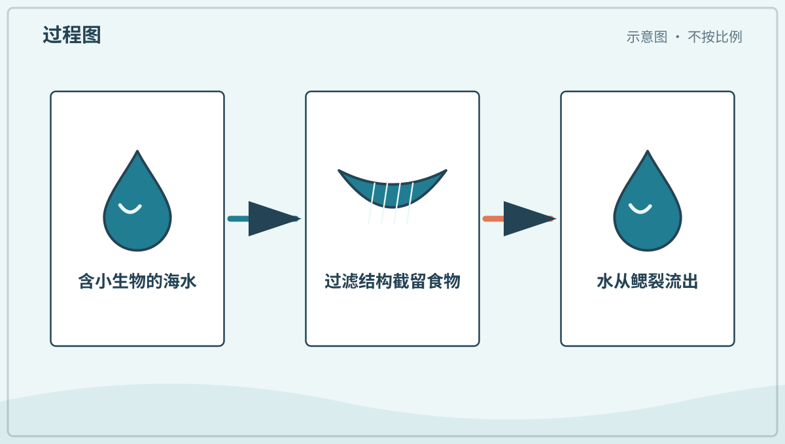

*图解：鲸鲨让含浮游生物的水流入口中，过滤结构留下食物，水从鳃处流出。*

**一起看看：** 比较鲸鲨鳃裂和须鲸头顶呼吸孔的位置。

---

### 第 263 问｜海马宝宝为什么由爸爸生？

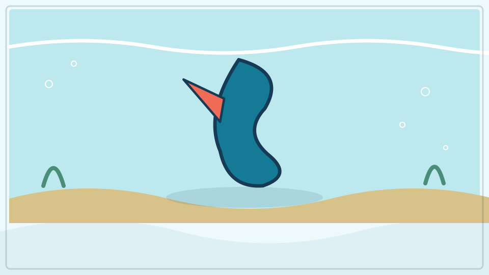

海马交配时，雌性把卵放进雄性的育儿袋。卵在袋中受精并继续发育。雄性会调节袋内环境，最后收缩身体，把小海马释放出来。

**再想一步：** 科学上称雄性怀孕，因为雄性身体承担胚胎携带和生理调节。不同海龙科动物的育儿结构从简单附着区到封闭袋都有变化。

**把知识连起来：** 雌海马把卵送入雄海马腹部育儿袋，雄性在袋中为胚胎调节水盐、供氧并提供保护，发育完成后通过肌肉收缩释放幼体。卵仍由雌性产生，精子由雄性产生；特殊之处是雄性承担妊娠样的孵育阶段。

**再往外看：** 海龙科不同物种从把卵粘在雄性体表到拥有封闭育儿袋，展示了亲代照料结构的连续变化。

**容易弄混：** “爸爸生宝宝”是简化说法，不表示雄海马同时产生卵。幼海马出生后通常也不会像人类幼儿一样长期由父母抚养。

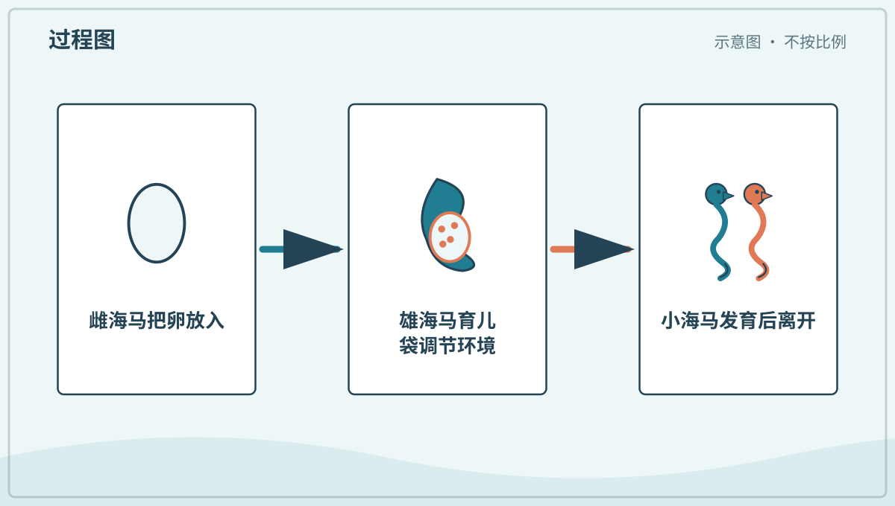

*图解：雌海马把卵放入雄海马育儿袋，胚胎在袋内发育，最后由雄海马释放。*

**一起看看：** 在照片中找雄海马腹部育儿袋的开口位置。

---

### 第 264 问｜小丑鱼为什么能住在海葵里？

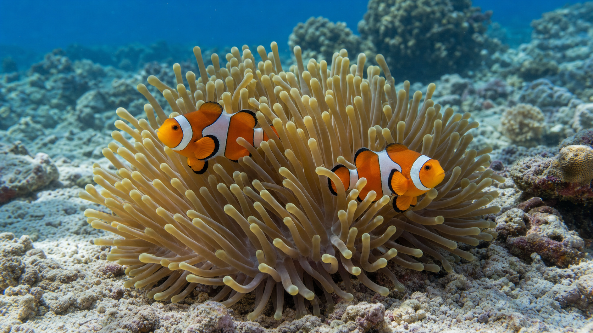

*写实观察图：小丑鱼与海葵可以形成互利关系，但并非所有鱼都能安全进入海葵触手。*

海葵触手有刺细胞，能蜇许多动物。小丑鱼体表黏液和逐步适应的行为减少刺细胞发射，让它躲进触手间。小丑鱼得到保护，海葵也可能得到清洁、养分和水流。

**再想一步：** 这种双方可能受益的关系叫互利共生，但收益大小会随环境改变。小丑鱼不是天生对所有海葵都完全免疫，需要与合适种类建立关系。

**把知识连起来：** 小丑鱼体表黏液及逐步适应行为能降低海葵刺细胞被触发的机会，使它在触手间获得庇护。小丑鱼可带来食物碎屑、驱赶某些捕食者并促进水流，海葵也提供保护，双方常形成互利关系。具体程度因物种组合和环境而异。

**再往外看：** 小丑鱼群体有严格社会等级，最大个体通常为雌性；雌性消失后，优势雄鱼可改变性别。共生关系还连接行为与生命周期。

**容易弄混：** 小丑鱼不是天生对所有海葵毒素完全免疫，也不是每条小丑鱼可随便住进任何海葵。互利也不表示双方永远没有代价。

**一起看看：** 数数一条小丑鱼进出海葵触手的次数。

---

### 第 265 问｜海龟怎样找到出生的海滩？

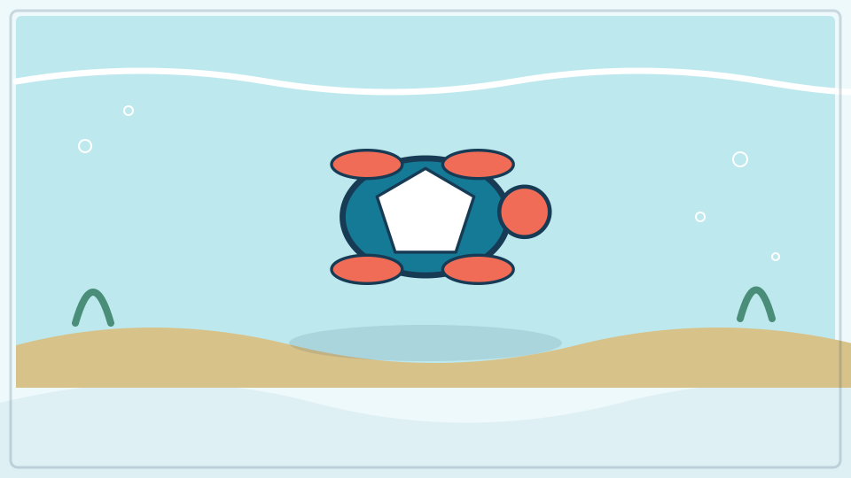

海龟能感受地球磁场，像记住出生地附近的磁场“地址”。它们也会使用海流、海浪方向和气味等线索。成年雌龟多年后可回到同一区域产卵。

**再想一步：** 地球不同地方磁场强度和倾角不同，组合起来可提供粗略位置。导航不是一张完美内置地图，海龟会在多种线索与长期迁徙中逐步校正。

**把知识连起来：** 幼海龟入海后会利用海浪方向、太阳和地磁场等线索远行；成年后回到出生区域附近产卵，可能还使用地磁印记、气味和海岸线线索完成最后定位。导航不是一张脑内人类地图，而是多种感官与遗传行为共同作用。

**再往外看：** 地球磁场会缓慢变化，海滩灯光、建筑和气候变暖也会干扰繁殖与幼龟入海。保护需要兼顾海洋迁徙路线和产卵地。

**容易弄混：** 不是每只海龟都精确回到出生时同一粒沙，也不能说它只靠闻味或只靠磁场。机制仍在研究，成功率也并非百分之百。

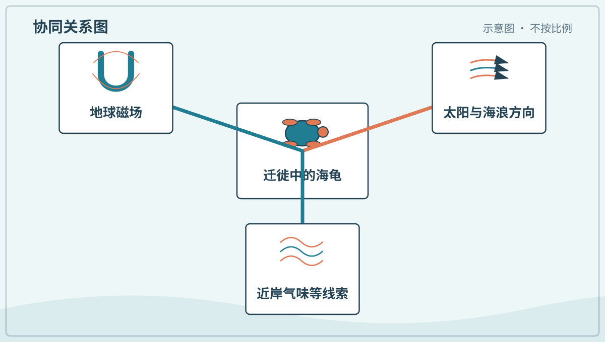

*图解：海龟会综合地磁、阳光、海浪和气味等多种线索导航，不靠单一地图。*

**一起记住：** 看海龟产卵必须遵守保护规定，不照强光、不围堵。

## 追问链 27.3｜海岸植物、贝壳、沙、塑料与发光生命

盐水适应、材料来源、波浪搬运、塑料持久性和生物发光共同展示海岸与深海变化。

### 第 266 问｜红树林为什么站在咸水里？

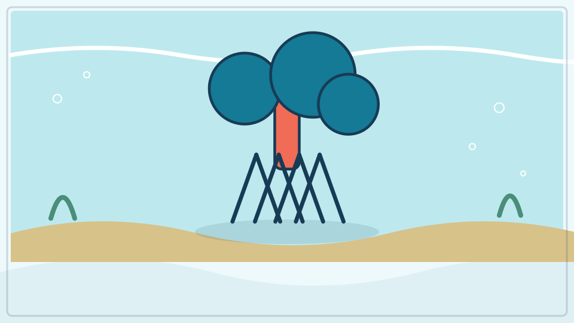

红树林植物能忍受潮汐、盐和缺氧泥土。有些根露出水面交换气体，有些过滤或排出盐。复杂根系还能减慢水流，留住泥沙并给幼鱼藏身。

**再想一步：** 红树林不是一种树，而是一群在热带、亚热带潮间带独立适应的植物。它们储存碳、缓冲风浪，但也需要潮水与陆地之间有移动空间。

**把知识连起来：** 红树林植物生活在潮间带，根部常面对缺氧泥土和盐水。不同种类会在根部排斥部分盐、从叶片排盐或把盐储存在将脱落组织中；支柱根和露出泥面的呼吸根帮助固定并交换气体。胎生样繁殖体还能在泥地迅速扎根。

**再往外看：** 红树林减弱波浪、截留沉积物并为幼鱼和鸟提供栖息地，同时储存大量碳。它们不能挡住所有风暴，却能成为海岸防护的一层。

**容易弄混：** 红树不是因为“喝咸水也不渴”就不需要淡水，所有红树也并非使用同一种排盐办法。踩踏幼苗和根区会破坏脆弱通气结构。

**一起看看：** 在照片里找向下支撑根和向上伸出的呼吸根。

---

### 第 267 问｜海草是海里的草吗？

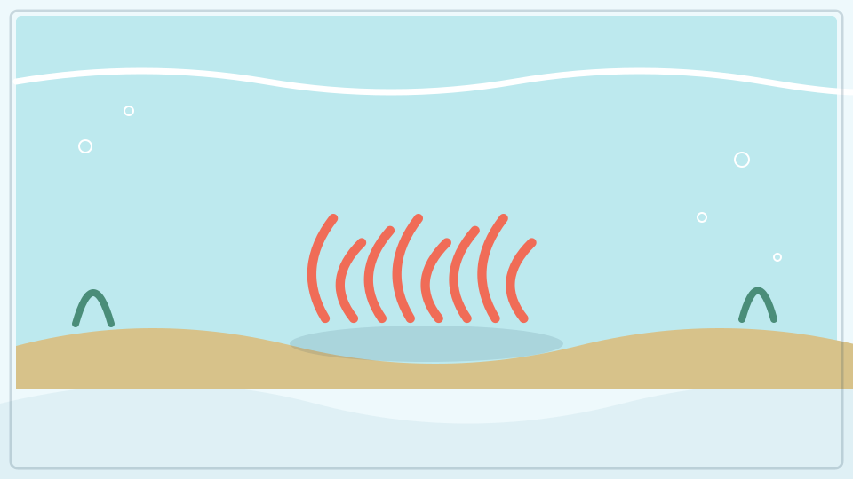

海草是重新适应海洋生活的开花植物。它们有根、茎、叶，也能开花结种。许多海草在浅海形成海草床，为鱼、海龟和小动物提供食物与住处。

**再想一步：** 海草祖先来自陆地，后来回到海中，需要在盐水里传粉并把根固定在海底。它与海藻不是同一类，虽然外表都可能绿绿长长。

**把知识连起来：** 海草是真正的开花植物，祖先从陆地重新进入海洋；它们有根、地下茎、叶、花和种子，能在海水中传粉。地下茎固定沉积物，叶片形成海草床并进行光合作用。适应盐水与水下授粉使它们不同于陆地草坪。

**再往外看：** 海草床为海龟、儒艮和幼鱼提供食物或庇护，还能截留碳和减缓海底泥沙扰动。水体混浊会减少它们得到的光。

**容易弄混：** 海草不是泛指海里所有绿色长条，也不是海藻的另一名字。是否有维管组织、根和花，是判断的重要证据。

**一起看看：** 比较海草叶片和海藻叶状体，找根与叶脉线索。

---

### 第 268 问｜海藻为什么不算真正的植物？

“海藻”包含多种能光合作用的生物，它们不都属于植物。大型海藻常没有真正的根、茎、叶和维管组织，只用固着器抓住海底。身体整体叫叶状体。

**再想一步：** 绿藻、红藻和褐藻的亲缘、色素与细胞结构不同，是生活方式相似的多个类群。分类要看演化关系，不能只看是否绿色或是否住在水里。

**把知识连起来：** “海藻”是对许多在水中光合作用生物的实用统称，它们分属多个演化支系，并非一个单一亲缘类群。大型海藻常有固着器、柄和叶状体，却没有陆生植物那样真正的根、茎、叶和维管系统。它们可直接从周围水中取得溶解物质。

**再往外看：** 褐藻中的巨藻能形成水下森林，红藻和绿藻又有不同色素与生活史；某些绿藻与陆生植物亲缘更近。

**容易弄混：** 没有真正的根不等于海藻没有结构，叫“藻”也不表示都很小。日常分类方便观察，但不能代替演化关系。

**一起看看：** 在海带图片中找固着器、柄和叶片状部分。

---

### 第 269 问｜贝壳是动物的房子吗？

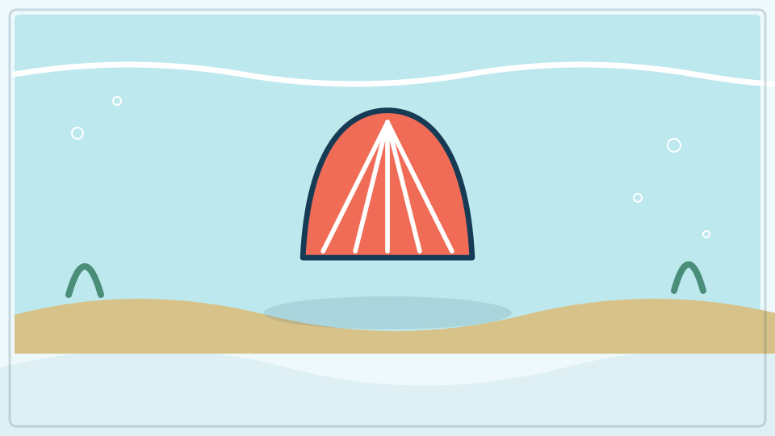

贝壳由软体动物的外套膜分泌，是身体长出的外骨骼，不是随便搬进去的房子。它主要含碳酸钙，会随动物生长在边缘添加新材料。双壳贝有两片，蜗牛壳常螺旋生长。

**再想一步：** 壳的层状微结构能让裂纹不容易直穿，兼顾硬度和韧性。寄居蟹后来使用空螺壳，才更像住进别的动物留下的房子。

**把知识连起来：** 贝壳通常由软体动物外套膜分泌碳酸钙和有机基质形成，并随着动物在边缘增加新材料而长大。它既保护柔软身体，也提供肌肉附着和抵抗水分散失的结构。双壳类有两片壳，腹足类常形成螺旋壳，内部都与身体紧密相连。

**再往外看：** 壳的生长纹、化学成分和微结构能记录年龄线索与环境变化，但纹线不一定一年一条。珍珠也是外套膜分泌材料包裹刺激物形成。

**容易弄混：** 贝壳不是动物找到后住进去的普通房子，寄居蟹借用的空壳才属于这种情况。捡到有活体或可能被其他生物使用的壳应留在原处。

**一起看看：** 在允许观察的地方原地看空壳纹路；不搬走住着动物的壳，也不成堆带走空壳。

---

### 第 270 问｜沙滩的沙从哪里来？

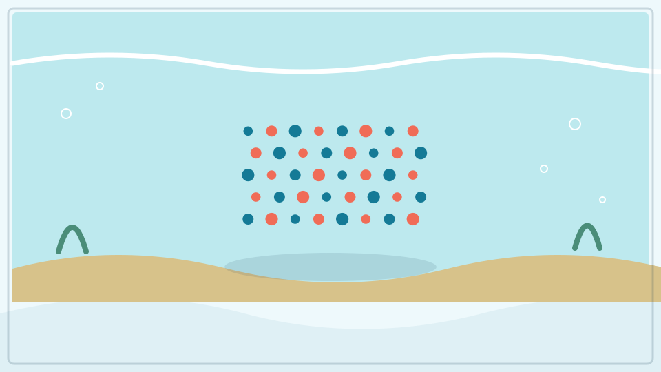

许多沙粒来自岩石被风化、河流搬运和海浪磨碎。珊瑚礁附近，一部分白沙还来自贝壳、珊瑚骨骼和生物处理后的碎屑。不同海滩颜色与颗粒会不同。

**再想一步：** 沙是按颗粒大小分类，不限定一种材料。石英耐风化，常在大陆海岸积累；火山岛可能有黑色玄武岩沙，某些海滩还有绿色矿物沙。

**把知识连起来：** 岩石经风化破碎，河流和海浪把颗粒搬到海岸；贝壳、珊瑚骨骼和其他生物碎屑也能贡献沙粒。波浪反复碰撞、筛分，使颗粒大小和圆度逐渐改变。沙滩颜色因此取决于当地岩石、生物来源和搬运历史。

**再往外看：** 火山岛可有黑色玄武岩沙，珊瑚岛常见浅色碳酸钙沙，某些海岸还富含绿色或红色矿物。显微镜下每粒沙都是地质线索。

**容易弄混：** 沙不只是被海水磨碎的贝壳，也不是所有海滩都应有同样金黄细沙。带走大量沙会破坏海岸，且许多地方明令禁止。

**一起看看：** 用放大镜观察大人提供的一小撮干净沙，之后洗手。

---

### 第 271 问｜沙滩会自己搬家吗？

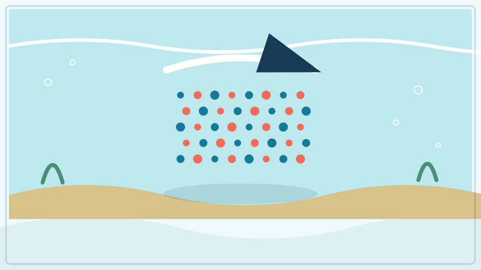

波浪和沿岸流不断搬运沙子，风也会把干沙吹进沙丘。风暴时海滩可能被侵蚀，平静季节又可能堆回来。海滩是一座会变化的泥沙仓库。

**再想一步：** 防波堤和港口会截住沿岸泥沙，让一侧堆积、另一侧缺沙。河流来沙、海平面和植被也影响海岸，因此固定海滩并不简单。

**把知识连起来：** 斜着到岸的波浪把沙沿岸推送，回流水和沿岸流再把颗粒带向别处；风还能把干沙吹成沙丘。风暴、季节浪向和河流供沙改变时，沙滩会变宽、变窄或整体迁移。海滩是一段持续交换沉积物的边界。

**再往外看：** 港口防波堤和海堤会截断沿岸输沙，使一侧堆积、另一侧侵蚀。补沙工程只能在了解沉积物预算后评估。

**容易弄混：** 一次退潮后沙变少不一定表示永久消失，沙滩也不会自动回到人想要的位置。固定海岸线常会把问题转移到邻近区域。

**一起看看：** 比较同一海滩不同季节照片，找岸线和沙丘变化。

---

### 第 272 问｜塑料到了海里会消失吗？

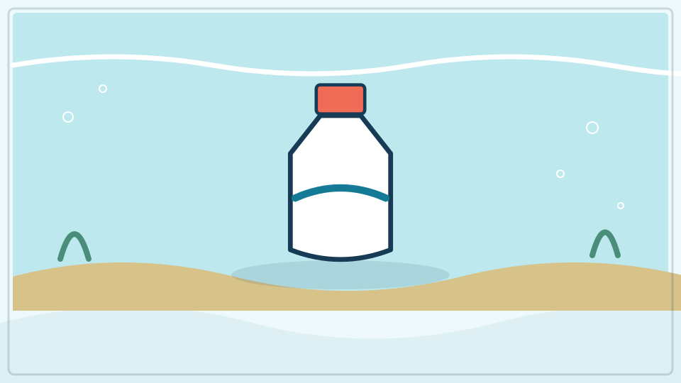

许多塑料不会很快被微生物分解。阳光和摩擦会让它碎成越来越小的微塑料，却不等于完全消失。动物可能误食或被废弃绳网缠住。

**再想一步：** 塑料种类、添加剂和环境不同，老化速度与影响也不同。清理海面只能处理一部分，减少不必要使用、妥善收集和改进材料系统更重要。

**把知识连起来：** 许多塑料的聚合物链在自然环境中分解很慢，阳光、波浪和摩擦会先把大件碎成微塑料，却不等于材料消失。碎片可被生物摄入、携带化学物或进入沉积物，回收也难以从广阔海洋逐粒完成。源头减少和妥善收集比入海后清理有效。

**再往外看：** 不同塑料密度和添加剂不同，有的漂浮，有的下沉或附着生物后改变位置。所谓可降解材料也只在特定温度、微生物和设施条件下快速分解。

**容易弄混：** 看不见塑料袋不表示塑料已经变回自然物质，也不能把所有海洋塑料简单归因于个人乱扔。生产、运输、渔业、废物系统和消费共同构成来源。

**一起行动：** 和大人把自己的垃圾带走；不徒手捡尖锐或不明废物。

---

### 第 273 问｜深海里谁在自己发光？

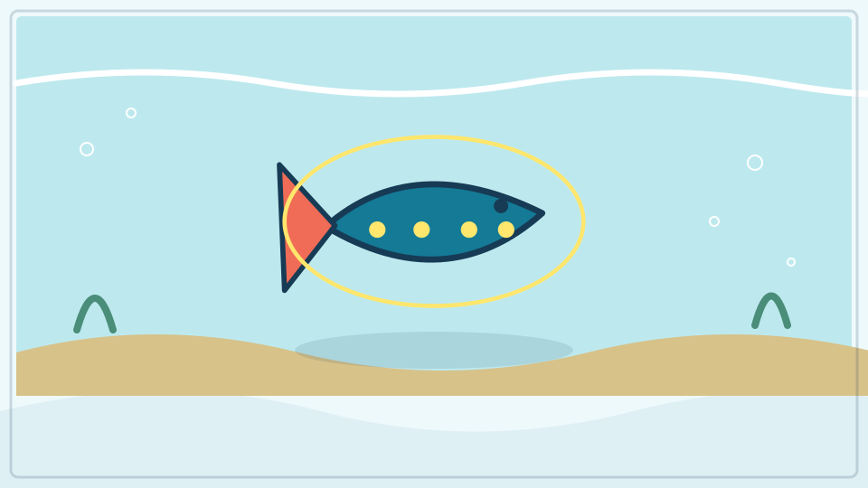

许多深海鱼、水母、鱿鱼和微生物能产生生物光。有的用化学反应自己发光，有的与发光细菌合作。光可用来引诱猎物、找同类、迷惑敌人或隐藏轮廓。

**再想一步：** 发光反应常由荧光素、氧和荧光素酶参与，化学能高效变成光。深海中蓝光传播较远，所以多数生物光偏蓝绿，也有少数动物制造或看见红光。

**把知识连起来：** 许多深海生物让发光分子在酶参与下反应，或与发光细菌共生，把化学能转成光。光可用于引诱猎物、寻找同类、迷惑捕食者，向下发光还可抵消从上方看见的轮廓。不同物种能精确控制发光位置、颜色和节律。

**再往外看：** 深海中蓝绿光传播较远，因此最常见，但也有能发红光或看见红光的特殊动物。潜器要减少灯光干扰才能观察自然行为。

**容易弄混：** 会亮的不一定都是自己制造光，有些动物只反射、荧光或借用共生细菌。生物发光也不是不会发热的魔法，而是能量转换效率较高的化学过程。

**一起看看：** 在深海录像里数不同发光方式：点亮、闪烁还是喷出亮液。

## 单元综合观察｜做一盆小型海岸搬运模型

在浅盘一侧放湿沙或小石子，另一侧放少量清水，由大人轻推形成小波。观察哪里侵蚀、哪里堆积；模型不表示真实海浪大小，不品尝盐水。
