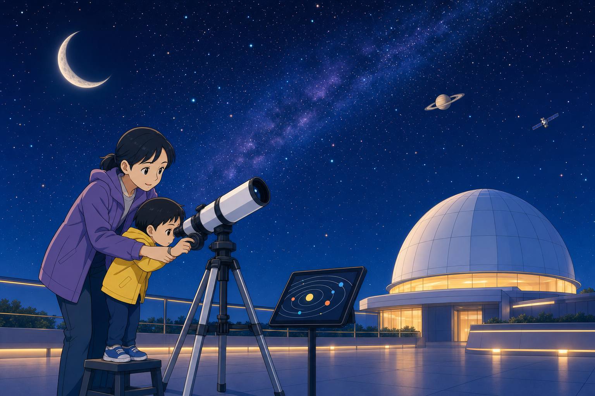
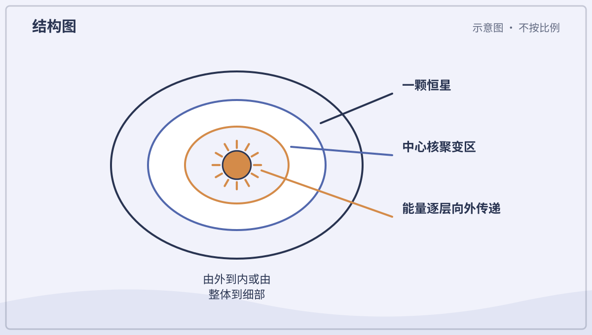
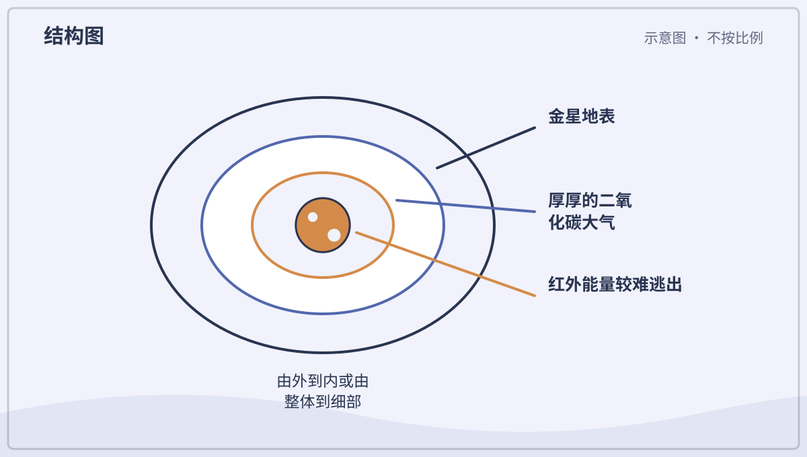
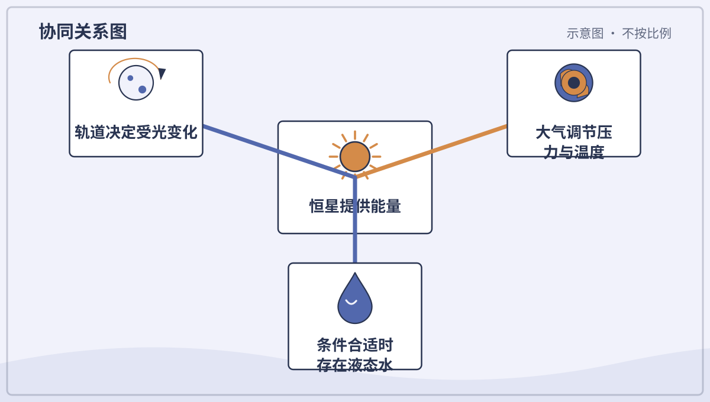
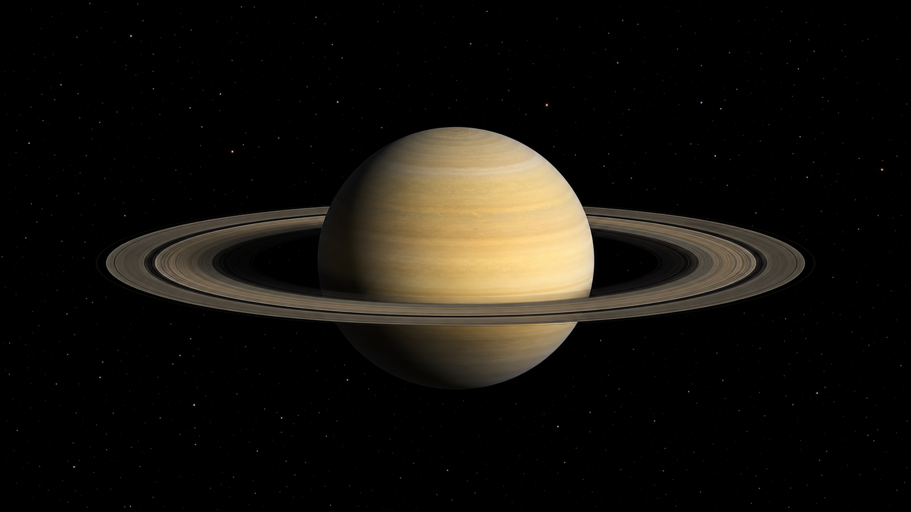
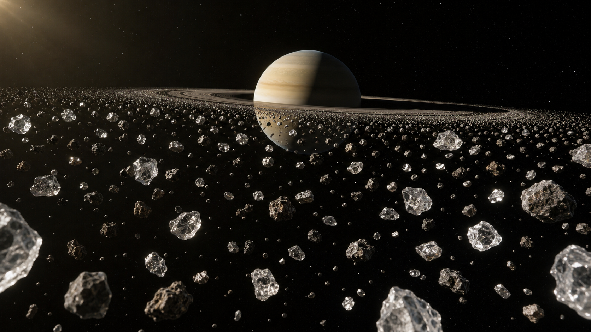
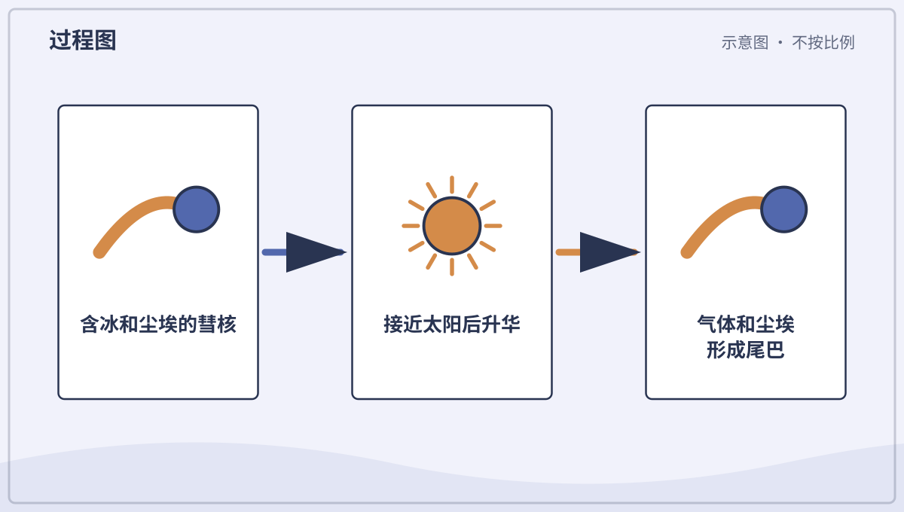

# 兴趣单元 28｜恒星、行星与太阳系小天体

> **探索领域 10：** 太阳系、宇宙与航天
>
> **核心问题：** 宇宙、星系、恒星、行星和小天体怎样组成不同层级的系统？

从宇宙尺度与恒星进入太阳系，再比较八颗行星、矮行星、小行星、彗星和流星现象。

## 怎样沿着本单元的追问链阅读

先确认天体类别，再比较质量、轨道、大气、表面和能量来源，不用一张排队图暗示真实距离。

## 追问链 28.1｜宇宙、恒星与太阳系层级

星系包含恒星系统，太阳系中的天体主要受太阳引力联系。

### 第 274 问｜宇宙里面有什么？

宇宙包括空间、时间，以及其中所有物质和能量。星球、气体、尘埃、光和我们都在宇宙里。我们能观察的范围叫可观测宇宙，它不一定等于整个宇宙。

**再想一步：** 宇宙在大尺度上不断膨胀，遥远星系之间的空间随时间增加。光速有限，所以望得越远，也是在看越久以前发生的事情。

**把知识连起来：** 宇宙包括时空以及其中的物质、辐射和各种场：星系、恒星、行星只是比较容易看见的一部分。观测显示普通物质之外还有通过引力显现的暗物质，宇宙膨胀还受到被称为暗能量的成分影响，但它们的本性仍未解决。我们能接收信号的范围称可观测宇宙，不等于全部宇宙已有边界。

**再往外看：** 不同望远镜接收无线电、红外、可见光、X 射线或伽马射线，粒子探测器和引力波台站又打开其他窗口。每种信使呈现宇宙的不同过程。

**容易弄混：** 宇宙不是装着星星的一个黑色空盒，也不能把一幅宇宙插图当作站在外面拍到的全景。关于全部宇宙多大、是否有边界，有些问题仍没有确定答案。

**一起想想：** 当我们看见太阳时，看见的是它大约八分钟前的样子。

---

### 第 275 问｜星星到底是什么？

星星是由炽热等离子体组成的巨大天体，靠自身重力聚在一起。核心核聚变释放能量，使它长期发光发热。太阳就是离地球最近的一颗恒星。

**再想一步：** 重力想把恒星压缩，内部高温气体和辐射压力向外支撑，两者平衡让恒星稳定很久。质量不同的恒星颜色、亮度、寿命和结局也不同。

**把知识连起来：** 恒星是由自身引力束缚的炽热等离子体球。核心在高温高压下发生核聚变，把较轻原子核结合成较重原子核并释放能量；能量向外传递，最终以光和其他形式离开。向内的引力与向外的压力长期接近平衡，恒星才不会立刻塌缩或散开。

**再往外看：** 恒星的颜色、光谱和亮度能透露温度、化学成分、大小与运动；质量则强烈影响寿命和最终结局。

**容易弄混：** 星星不是夜空中带尖角的小灯，尖角多来自眼睛、相机或望远镜的衍射。它们也不是在普通意义上“燃烧木柴”，能量源是核反应。

*图解：恒星中心通过核聚变供能，能量穿过内部后从表面以辐射形式离开。*

**一起看看：** 找红、白、偏蓝的恒星照片，颜色与温度有关。

---

### 第 276 问｜太阳看起来不大，真的很大吗？

太阳直径约是地球的一百多倍，体积能装下许多个地球。它看起来像小圆盘，是因为离我们约一亿五千万千米。物体看起来多大同时取决于真实大小和距离。

**再想一步：** 眼睛看到的是角大小，也就是物体在视野中张开的角度。太阳与月亮真实大小差很多，却因距离不同，从地球看角大小碰巧接近。

**把知识连起来：** 太阳直径约为地球的一百零九倍，却离我们约一亿五千万千米；物体看起来多大由真实大小和距离共同决定。月球小得多但近得多，因此在天空中的角大小能与太阳接近。太阳的巨大体积容得下约一百三十万个地球体积，但质量和体积不能混为一谈。

**再往外看：** 天文学家用角度、视差、轨道和物理模型逐级测量天体距离与大小，照片中的像素尺寸本身不能直接给真实直径。

**容易弄混：** 太阳看起来像小圆盘不表示它只比月亮大一点，也不能直接拿两张不同缩放照片比较天体大小。绝不能用眼睛或普通望远镜直视太阳。

**一起记住：** 永远不直视太阳，观察太阳只能用合格设备和专业指导。

---

### 第 277 问｜太阳系为什么叫一个“系”？

太阳系以太阳为中心，包括八颗行星、矮行星、卫星、小行星、彗星、尘埃和气体。太阳的重力把这些天体联系在一起。它们大多沿接近同一平面的轨道绕太阳。

**再想一步：** 太阳系约在四十六亿年前由旋转的气体尘埃云形成，云收缩成扁盘，物质碰撞聚集成天体。轨道排列保留了这段形成历史的线索。

**把知识连起来：** 太阳的质量占太阳系绝大部分，它的引力束缚八颗行星、矮行星、小行星、彗星和大量尘埃；这些天体又各有卫星或环。它们由同一片约四十六亿年前的气体尘埃盘演化而来，并在共同引力网络中运动，所以称为一个系统。边缘没有一圈硬墙，影响范围会按定义不同。

**再往外看：** 日球层按太阳风影响划分，奥尔特云则是更遥远彗星来源的模型；二者都不等于太阳引力突然停止的位置。

**容易弄混：** 太阳系不只是太阳加八个圆球，也不是行星沿画好的同心轨道线运行。轨道是对运动路径的描述，所有天体还会互相扰动。

*图解：太阳的引力把行星的惯性运动弯成轨道，许多天体共同组成太阳系。*

**一起看看：** 用一张纸表示轨道平面，把大小不同的圆片放在上面。

---

### 第 278 问｜什么样的天体叫行星？

在太阳系里，行星要绕太阳运行，质量大到自身重力使它接近圆形，还要清理轨道附近的大部分同类天体。地球、火星和木星都符合。定义是科学家为分类共同制定的。

**再想一步：** “清理轨道”不表示轨道上绝对没有别的东西，而是该天体在邻近区域的动力学上占主导。绕其他恒星的行星叫系外行星，实际分类口径还会继续讨论。

**把知识连起来：** 在太阳系的现行天文学定义中，行星绕太阳运行，有足够质量使自身接近圆形，并在长期引力演化中主导轨道邻域。围绕其他恒星的天体称系外行星时，实际识别还结合质量和形成背景。分类是为了比较天体，不是给它们排高低。

**再往外看：** 凌日、恒星视向速度和直接成像等方法能发现系外行星；我们通常先测到半径或最低质量，再推测组成。

**容易弄混：** 圆形、会移动或绕太阳中的任何一条都不足以单独判定行星。定义还可能随新发现和科学共同体讨论而调整。

**一起想想：** 分类为什么要同时看形状、轨道和邻居，而不只看大小？

---

### 第 279 问｜八颗行星怎样排队？

从太阳向外是水星、金星、地球、火星、木星、土星、天王星和海王星。前四颗主要是岩石行星，后四颗是巨行星。图上的大小和距离常不能同时按比例画准。

**再想一步：** 行星轨道是椭圆，彼此间距也差很大。若把太阳缩成一个大球放在操场，最外行星可能要放到很远处，行星本身却只像小点。

**把知识连起来：** 从太阳向外，八颗行星依次是水星、金星、地球、火星、木星、土星、天王星和海王星。前四颗以岩石和金属为主，体积较小；后四颗更巨大，其中木星、土星为气体巨行星，天王星、海王星常归为冰巨行星。相邻轨道距离向外并不按相同间隔增加。

**再往外看：** 把真实大小和真实距离同时按同一比例做成模型时，行星会很小且相隔很远，普通书页只能分开处理两种尺度。

**容易弄混：** “排队”只是记忆顺序，行星不会总在太阳同一侧排成直线。教材图若画得一样近、一样大，必须标明不按比例。

**一起排排：** 做八张行星卡，按离太阳远近排列，不要求背诵。

## 追问链 28.2｜行星与矮行星

距离不是唯一条件，大气、反照率、内部热和自转共同造成行星差异。

### 第 280 问｜水星离太阳最近，为什么夜里很冷？

水星几乎没有能保温和搬运热量的大气。向着太阳的一面会很热，漫长夜晚的一面却迅速散热，变得很冷。离太阳近不表示每个地方一直热。

**再想一步：** 水星自转与公转形成三比二的共振，太阳日非常长。温度由吸收阳光、反射、散热、大气和地表性质共同决定。

**把知识连起来：** 水星几乎没有能有效储热和搬运热量的浓厚大气，白天表面直接受强烈太阳照射，夜面则向太空散热。它相对太阳的自转很慢，一个太阳日极长，使昼夜温差可达数百摄氏度。离太阳近只说明入射能量多，不保证每时每地都热。

**再往外看：** 水星极区一些永久阴影坑从不被阳光照到，雷达与探测器证据显示其中可保存水冰。局部地形能创造与平均环境完全不同的冷阱。

**容易弄混：** 水星夜里冷不是太阳突然离它更远，也不是因为表面全由冰组成。关键是缺少厚大气调温和长昼夜周期。

*图解：水星白天受强烈日照，夜面又因大气极稀薄而快速散热，温差很大。*

**一起看看：** 比较有盖和没盖的保温容器，理解大气会影响热量变化。

---

### 第 281 问｜最热的行星为什么不是水星？

金星被厚厚的二氧化碳大气包围，云层下压力很大。地表放出的红外辐射很难直接逃向太空。强烈的温室效应让金星比水星表面平均更热。

**再想一步：** 大气让部分波长阳光进入，又吸收并反复发射地表红外辐射，改变能量离开的高度与温度。温室效应本身是自然物理过程，强弱取决于大气组成和结构。

**把知识连起来：** 金星厚重的大气以二氧化碳为主，云层虽反射大量阳光，地表发出的红外辐射却被大气强烈吸收并反复发射，形成极强温室效应。其地表比离太阳更近的水星平均还热，而且昼夜与纬度温差较小。高压也使环境更加极端。

**再往外看：** 研究金星能检验行星气候如何受大气量、成分、水和地质演化影响，也帮助理解宜居性不是只看离恒星距离。

**容易弄混：** 金星热不是因为云像棉被本身发热，也不能把自然温室效应与地球当前人为增强温室效应说成完全相同过程和强度。

*图解：金星厚大气让阳光进入，却强烈吸收地表发出的红外辐射，造成高温。*

**一起看看：** 在行星表格中比较“离太阳远近”和“表面温度”，找出不完全一致。

---

### 第 282 问｜地球为什么有很多液态水？

地球离太阳的距离、合适的大气压力和温度，让表面能长期存在液态水。重力留住大气，磁场和地质循环也影响环境。已知生命依赖水，但有水不保证一定有生命。

**再想一步：** 宜居性不是一条简单的“刚好距离”规则，还与恒星、行星质量、大气、轨道和长期气候反馈有关。地球生命也反过来改变了大气和岩石循环。

**把知识连起来：** 地球到太阳的距离使表面可处于适合液态水的温度范围，足够的大气压又让水不容易全部沸腾或升华；适度温室效应、海洋热容量和水循环进一步稳定多种环境。地球形成材料本就含水，后续小天体也可能补充，水又在岩石、地幔、大气和海洋间循环。

**再往外看：** 液态水是否长期存在还取决于恒星、行星质量、大气和地质活动，所谓宜居带只是初步条件，不是生命保证书。

**容易弄混：** 地球有水不能只归因于“离太阳刚刚好”，也不是全部水都由彗星一次送来。来源与保存涉及多种证据，比例仍有研究。

*图解：地表液态水能否长期存在，取决于恒星、轨道、行星质量、大气和气候反馈。*

**一起看看：** 从太空照片估一估蓝色海洋和陆地谁占得更多。

---

### 第 283 问｜火星为什么是红色的？

火星土壤和尘埃含有许多氧化铁，像铁锈一样偏红。细尘被风吹到大气和地表，让整颗行星从远处显得红。岩石下面并非每处都同样红。

**再想一步：** 铁与氧和水等发生反应形成氧化物，说明火星过去的环境与今天不同。探测器分析矿物和古河道，寻找液态水曾经存在的证据。

**把知识连起来：** 火星岩石和尘埃含铁矿物，它们与氧化性环境作用后形成细小铁氧化物，使表面和悬浮尘埃呈红橙色。大气中的尘埃散射阳光，连天空颜色也会与地球不同。较深或新鲜岩石未必同样红。

**再往外看：** 轨道光谱仪和火星车分析矿物，寻找过去水活动、火山和气候变化留下的记录。

**容易弄混：** 火星不是因为很热或表面着火才红；它平均很冷。也不能只凭颜色断定所有岩石都是普通铁锈，矿物组成需要仪器识别。

**一起看看：** 比较铁锈、红土和火星照片的颜色，但不触摸生锈尖物。

---

### 第 284 问｜木星上的大红斑是什么？

大红斑是木星大气里一个巨大的长期风暴，旋转方向与地球上的高压涡旋相似。它比地球大，已被观察许多年，但大小和颜色会变化。木星没有可站立的固体表面。

**再想一步：** 木星快速自转和带状强风让涡旋能够长期存在，深层结构仍在研究。颜色可能来自云层物质受阳光改变后的化学产物，目前没有一个完全确定的简单答案。

**把知识连起来：** 木星大红斑是一场至少持续数百年记录的大型高压反气旋，云层绕中心快速旋转。木星没有像地球那样的固体表面阻挡风，内部热量、带状急流和涡旋相互作用能长期维持风暴。颜色可能来自高层化学物在太阳辐射下变化，成分仍在研究。

**再往外看：** 持续观测显示大红斑尺寸和形状会变化，其他较小涡旋也会合并、消散。长寿不等于永恒不变。

**容易弄混：** 大红斑不是木星表面的红色陆地，也不是一只固定睁开的眼睛。示意图常加强颜色，真实色彩会随波段和图像处理不同。

**一起看看：** 在不同时期木星照片中比较大红斑的形状和大小。

---

### 第 285 问｜土星环是一整张圆盘吗？

*科学写实图：土星环是极薄的环平面，由大量冰和岩石颗粒组成；画面依据观测数据重建，不表示人在近处直接拍摄。*

土星环由无数冰粒、岩石和尘埃组成，小到颗粒，大到房屋般的块。它们各自绕土星运行，从远处密集地看成薄环。环中还有许多缝和细环。

**再想一步：** 靠近土星的粒子公转较快，远处较慢。卫星引力、粒子碰撞和轨道共振共同雕刻环的结构；四颗巨行星其实都有环，只是土星环最醒目。

**把知识连起来：** 土星环由无数独立绕土星运行的冰粒、岩屑和尘埃组成，大小从细粒到房屋尺度甚至更大，粒子之间大多是真空。它们集中在很薄的平面内，并被引力共振、碰撞和小卫星塑造成环缝与波纹。远看密集粒子才像连续圆盘。

**再往外看：** 环可能来自被潮汐力破坏的卫星或未能聚合的物质，其年龄和演化仍是研究问题。其他巨行星也有较暗的环。

**容易弄混：** 土星环不是一整张可以站立的硬盘，也不是画在土星表面的圈。剖面和近景图常夸大厚度、粒子大小与间距，必须注明不按比例。

*科学写实原理图：土星环由大量冰岩颗粒组成并各自绕行；颗粒大小和间距为了看清而放大，不按比例。*

*图解：土星环由无数冰和岩石颗粒组成，各自沿轨道运行，并非一整张固体圆盘。*

**一起试试：** 用许多小纸点围成圈，近看是点，远看像连续带。

---

### 第 286 问｜天王星为什么像躺着转？

天王星自转轴几乎躺在轨道平面里，像横着滚动。可能是早期巨大碰撞和长期引力作用造成，但具体历史仍在研究。强烈倾斜让它的季节非常特别。

**再想一步：** 一极可在一段漫长季节里持续朝向太阳，另一极处于黑暗，随后交换。大气仍会搬运热量，所以温度变化不只由日照简单决定。

**把知识连起来：** 天王星自转轴相对轨道方向倾斜约九十八度，看起来像侧躺着转；因此每个极区会经历很长的日照与黑夜季节。可能原因包括早期巨大撞击或多个较小撞击与卫星盘相互作用，但还没有唯一确定故事。它的环和主要卫星轨道也大致围绕倾斜赤道。

**再往外看：** 一个天王星季节约持续二十一年，探测器和望远镜需跨很长时间才能观察完整天气变化。

**容易弄混：** “躺着”是相对轨道平面的比喻，宇宙没有绝对上下；也不能把尚在比较的形成假说写成已经拍到的撞击事实。

**一起看看：** 把铅笔穿过球当自转轴，分别直立、倾斜和横放绕灯移动。

---

### 第 287 问｜海王星离太阳很远，为什么风很快？

海王星得到的太阳能很少，却有太阳系里很快的大气风。它内部仍释放热量，快速自转和大气结构帮助驱动天气。风暴会出现、移动和消散。

**再想一步：** 行星天气的能量不只来自太阳，也可来自形成后残留热和内部缓慢收缩。云层深度、甲烷与氢氦大气怎样交换能量，仍是探测研究问题。

**把知识连起来：** 海王星虽接收很少太阳能，却仍从内部释放比吸收太阳能更多的热量；内部热、快速自转和大气环流共同为强风与风暴提供条件。高层气体稀薄，摩擦耗散方式也与有固体地表的地球不同。风速不是只由离太阳远近决定。

**再往外看：** 深色涡旋会出现和消失，云层在不同纬度快速移动。海王星天气数据仍主要依靠遥测和一次飞掠探测。

**容易弄混：** 海王星的风不是被太阳从远处直接吹过去，也不能把最高局地风速当成整颗行星每处都一样。内部能量来源和深层结构仍有未知。

**一起想想：** 哪些机器或自然现象也不只从外面得到能量？

---

### 第 288 问｜冥王星为什么叫矮行星？

冥王星绕太阳运行，也被自身重力塑成近圆形。但是它没有清理轨道邻域，因此被归为矮行星。它位于海王星外的柯伊伯带，与许多冰质小天体共享区域。

**再想一步：** 改分类不是把天体变小或赶出太阳系，而是新发现增多后调整概念。冥王星仍有山、冰川、稀薄大气和卫星，是值得研究的复杂世界。

**把知识连起来：** 冥王星绕太阳运行，也因自身引力接近圆形，但它与许多柯伊伯带天体共享轨道邻域，没有在长期动力学中成为该区域的主导者。按照国际天文学联合会现行太阳系分类，它属于矮行星。改名改变的是类别，不是天体本身。

**再往外看：** 谷神星、阋神星等也被归入矮行星；新视野号显示冥王星有冰山、冰川和复杂大气活动，分类并不降低研究价值。

**容易弄混：** 冥王星不是被赶出太阳系，也不是因为突然变小才不再列作八大行星。科学分类会随新发现和清晰定义调整。

**一起说说：** 名字和分类改变了，真实物体的哪些特点没有改变？

## 追问链 28.3｜小行星、彗星与流星现象

小天体来源和组成多样，流星是物质进入大气时产生的发光现象。

### 第 289 问｜小行星都是碎掉的行星吗？

小行星是绕太阳运行、通常比行星小的岩石或金属天体。许多是太阳系形成时没有聚成行星的剩余材料，也有些来自大天体碰撞后的碎片。形状常不规则。

**再想一步：** 木星引力扰动让主小行星带里的物质难以聚成一颗行星。研究陨石和小行星能保存早期太阳系的化学与碰撞记录。

**把知识连起来：** 小行星多是太阳系形成时未聚成行星的残余小天体，主要分布在火星与木星之间的小行星带，也有近地和其他轨道族群。碰撞确实会打碎母体并形成家族，但有些较大天体内部曾熔融分层。它们保存了早期材料与碰撞史。

**再往外看：** 陨石的化学和同位素测量可与特定小行星类型比较，探测器取样则能直接检验来源。

**容易弄混：** 小行星不全是某一颗爆炸行星的碎片，小行星带也没有电影里那样处处挤满巨石。平均间距很大，航天器可安全穿越。

**一起看看：** 比较圆形矮行星与不规则小行星，想想重力和大小的关系。

---

### 第 290 问｜彗星为什么拖着长尾巴？

彗星含冰、尘埃和岩石。靠近太阳时，冰受热直接变成气体，带出尘埃形成彗发和尾。太阳光与太阳风把尾巴推向背离太阳的方向。

**再想一步：** 彗星常有弯曲尘埃尾和较直的离子尾，方向不一定在运动轨迹后面。离开太阳后活动减弱，尾巴会变淡。

**把知识连起来：** 彗星接近太阳时，表面冰受热升华，带出尘埃形成彗发。太阳辐射压力把尘埃推成较弯的尘尾，太阳风和磁场作用于离子形成更直的离子尾；两条尾总体都背向太阳。彗星远离太阳时，尾巴会减弱。

**再往外看：** 彗核包含冰、尘埃和有机物，不是洁白雪球；轨道可很长，周期从几年到数万年以上。

**容易弄混：** 彗尾不会总拖在运动方向后面，彗星离开太阳时尾巴甚至朝行进方向前方。看到长尾也不表示彗星正着火。

*图解：彗星接近太阳时冰升华，气体带出尘埃；太阳风和辐射把尾巴推向背日方向。*

**一起看看：** 在彗星轨道图不同位置画出始终背离太阳的尾巴。

---

### 第 291 问｜“流星”真的是星星掉下来吗？

流星是小石粒或尘埃高速进入大气时出现的亮迹，不是恒星掉落。它压缩并加热前方空气，物质也会烧蚀发光。大多在到达地面前就消失。

**再想一步：** 太空里的小块叫流星体，亮起来的现象叫流星，落到地面的残块叫陨石。流星雨常在地球穿过彗星留下的尘埃带时出现。

**把知识连起来：** 太空中的小岩石或金属体称流星体；它高速进入大气后压缩和加热前方空气，并使自身表面烧蚀，发亮轨迹称流星；有残块落到地面才称陨石。发光主要发生在大气中，并不是一颗恒星从星座掉落。

**再往外看：** 流星雨来自地球穿过彗星或小天体留下的尘埃流，轨迹反向延长看似来自同一辐射点。

**容易弄混：** 流星不是摩擦一下就整个燃成火球的唯一机制，也不是看到光就能去附近捡到陨石。疑似陨石鉴定需要密度、矿物和化学证据。

*图解：小天体高速进入大气，压缩并加热前方空气而发光；少数残块能落到地面。*

**一起看看：** 夜间观星只在大人陪同的安全地点，不追逐所谓“落点”。

## 单元综合观察｜画两张取舍不同的太阳系

第一张只画行星顺序，第二张只比较距离。说明为什么一张小纸不能同时准确画出大小和距离，也不要把行星画成同时整齐位于太阳一侧。
