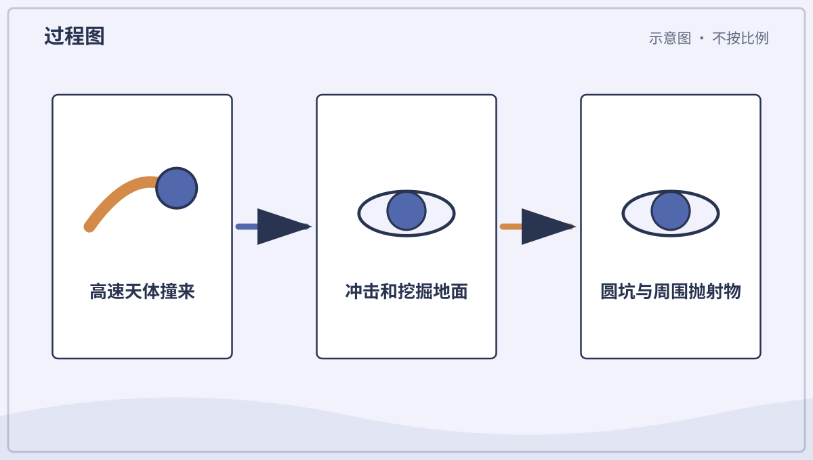
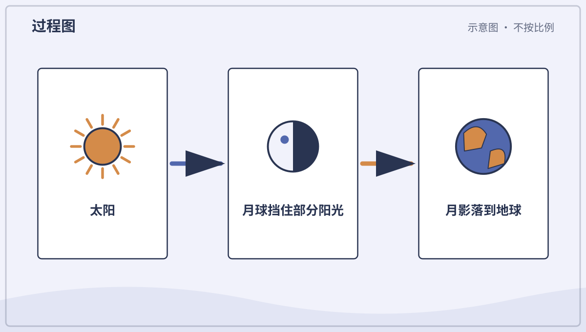
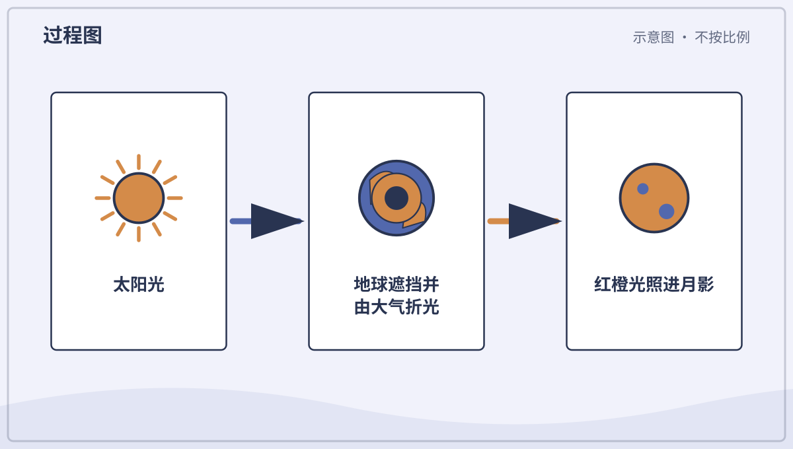
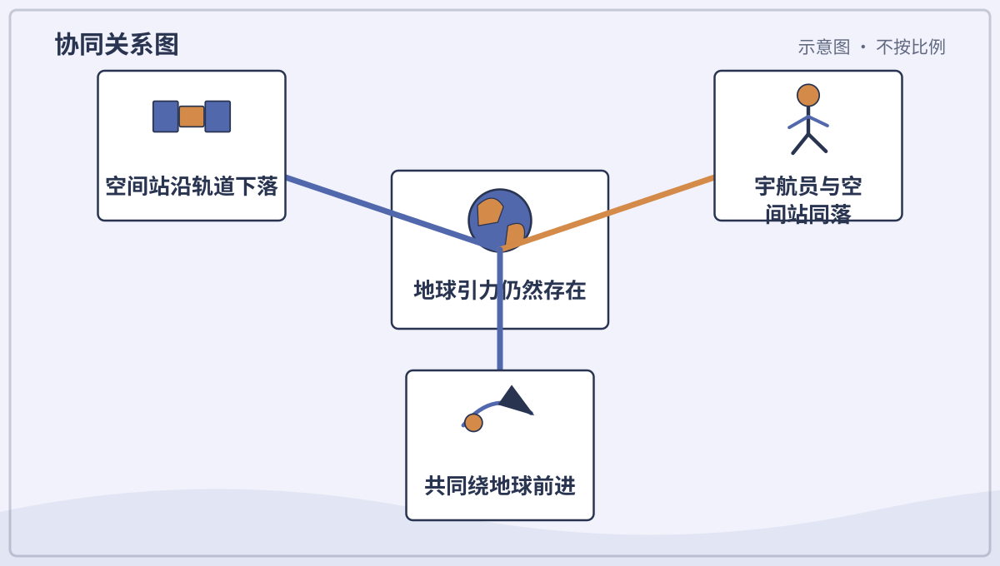
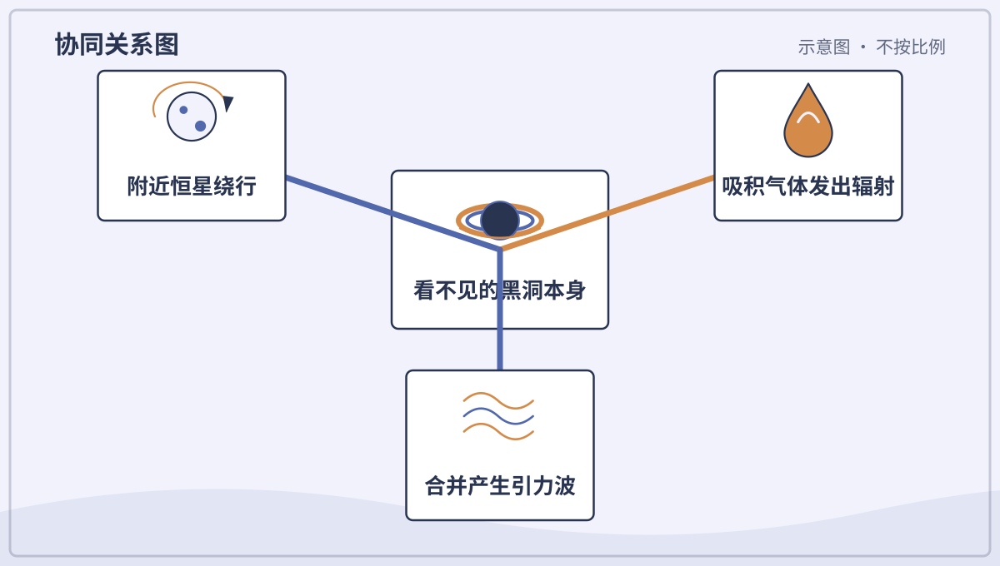

# 兴趣单元 29｜月球、轨道、航天与深空

> **探索领域 10：** 太阳系、宇宙与航天
>
> **核心问题：** 撞击、引力和轨道怎样塑造月球现象，人又怎样进入太空并观测更远宇宙？

月坑、月球重力、日月食与轨道建立空间关系，火箭、失重、航天服、卫星和望远镜再连接工程，银河与黑洞把视线推向深空。

## 怎样沿着本单元的追问链阅读

天文图常严重改变大小与距离；科学可视化必须说明重建与比例边界。

## 追问链 29.1｜月球表面、食与轨道

撞击留下圆坑，重力影响跳跃，日月食和绕行取决于位置与速度。

### 第 292 问｜月亮上为什么满是圆坑？

小行星和彗星碎块高速撞上月面，会释放巨大能量。冲击挖出近圆形的撞击坑。月球几乎没有风雨和活跃板块去快速抹平它们，所以许多坑保存很久。

**再想一步：** 即使撞击物斜着来，冲击波向四周扩展也常造出圆坑。坑边喷出的碎屑能形成明亮射纹，较大的撞击还会有中央峰。

**把知识连起来：** 月球缺少浓厚大气，来袭小天体很少在空中被完全减速，也没有雨河、植物和活跃板块迅速抹平地形，因此撞击坑能保存很久。撞击高速释放能量，挖出圆形坑、抛射物和中央峰。大撞击与小撞击在漫长历史中不断叠加。

**再往外看：** 坑的数量可帮助比较月面地层相对年龄，阿波罗样品的放射性定年又把部分计数与绝对时间连接。

**容易弄混：** 圆坑不表示陨石都垂直落下，高速撞击会向各方向扩散冲击。月海也不是今天装着水的海，而是古老熔岩平原。

*图解：高速撞击产生冲击波，挖出物质并向外抛射，留下近圆形撞击坑。*

**一起看看：** 在满月照片中找大圆坑和向外延伸的亮纹。

---

### 第 293 问｜在月球上能跳得更高吗？

月球质量比地球小，表面重力约是地球的六分之一。同一个人质量不变，受到的重力较小，所以较容易跳高、落得较慢。笨重宇航服仍会限制动作。

**再想一步：** 质量表示物体有多少惯性，重量是重力对它的力。到月球后质量不变、重量变小，因此推动身体改变速度仍需要克服惯性。

**把知识连起来：** 月球表面重力约为地球的六分之一，同一个人受到的重力较小，腿施加相似起跳速度时会升得更高、落得更慢。人的质量和惯性并没有变小，厚重宇航服还会限制关节。无空气使跳跃没有空气阻力，却也没有可呼吸环境。

**再往外看：** 阿波罗录像中的步态兼顾低重力、松散月壤和宇航服，不能只用慢放地球录像代替。

**容易弄混：** 在月球上不是完全没有重力，也不会一跳就飞走。达到逃逸速度远超人的跳跃能力，落地仍可能受伤。

**一起想想：** 一只球在月球会不会更容易被举起？它里面的物质有没有减少？

---

### 第 294 问｜日食时是谁挡住了太阳？

新月附近，月球有时正好来到太阳和地球之间。月影落到地球的一小片区域，就发生日食。因为月球轨道倾斜，并不是每次新月都有日食。

**再想一步：** 月球本影经过处可见日全食，半影处见日偏食；月球看起来稍小时还可能有日环食。日食带很窄，是影子几何的结果。

**把知识连起来：** 日食发生在新月附近，当月球恰好从太阳与地球某区域之间经过，月球影子落到地面。由于月球轨道相对地球公转平面倾斜，多数新月影子从地球上方或下方掠过，并非每月都有食。全食、偏食和环食取决于位置与角大小。

**再往外看：** 全食带很窄，而偏食可在更大区域看见；精确轨道计算能提前预测路径和时刻。

**容易弄混：** 日食不是太阳被吃掉或熄灭，也不能靠云、墨镜、相机屏幕随意直视。观察必须使用符合标准且完好的专用太阳观测方法。

*图解：日食发生在太阳、月球、地球接近排成一线，月影落到地球局部区域时。*

**一起记住：** 任何日食阶段都按专业指导使用合格护目设备，绝不直接看太阳。

---

### 第 295 问｜月食时月亮为什么变红？

满月附近，地球有时来到太阳和月球之间，地球影子落到月面形成月食。阳光斜穿地球大气时，蓝光较多被散向别处。剩下的红橙光被大气折射进影子，所以月亮可能呈暗红色。

**再想一步：** 地球边缘一圈大气像同时发生许多次日出和日落，把剩余的红橙光送到月面。大气中的云、尘埃和火山微粒会改变月食颜色深浅。

**把知识连起来：** 月食时，满月进入地球背向太阳的影子。穿过地球大气边缘的太阳光被折射进本影，较短波长光被更多散射，剩下较多红橙光照到月面，于是月亮可能呈铜红色。尘埃、云和大气状态会改变颜色深浅。

**再往外看：** 月食可被地球夜面较大范围同时看见，古人还由月食时地影边缘总呈圆弧得到地球形状线索。

**容易弄混：** 红月亮不是月面变热、着火或真正换了颜色，也不是每次满月都有月食。轨道倾角同样决定是否对齐。

*图解：月食时地球挡住直射阳光，大气把剩余红橙光折进影子，照到月面。*

**一起看看：** 月食可用眼睛安全观察，但夜间地点仍需大人陪同。

---

### 第 296 问｜月亮为什么不会掉到地球上？

月亮其实一直被地球重力拉着向下落，同时又有很快的横向速度。它每落下一点，弯曲的地球表面也离开一点，于是不断绕行而不撞上地面。这就是轨道运动。

**再想一步：** 轨道是持续自由落体，不是太空没有重力。速度太慢会落下，太快可能进入更高轨道或逃离，合适速度与高度共同决定轨道。

**把知识连起来：** 月球一直受到地球引力向内拉，同时具有足够横向速度；它不断向地球自由落下，却在落下时沿曲面错过地面，于是形成轨道。地球也被月球拉动，二者绕共同质心运动，并一同绕太阳。轨道是速度与引力共同产生的持续运动。

**再往外看：** 潮汐作用正在让月球平均每年远离地球几厘米，并让地球自转缓慢变慢，说明轨道也会长期演化。

**容易弄混：** 月亮不是被看不见的绳子挂住，也不是完全不往下掉。只有引力而没有合适横向速度会撞向地球，只有速度而无引力则会近似直线离开。

*图解：月球不断向前运动，同时被地球引力拉弯路径，于是持续绕地球下落。*

**一起试试：** 用手指沿圆边一边向前一边向内画，感受两个方向合成弯路。

## 追问链 29.2｜火箭、微重力、航天服与卫星

喷气产生反作用，轨道飘浮是持续自由落体，航天器提供生存和观测条件。

### 第 297 问｜火箭为什么要向下喷气？

火箭发动机把高温气体高速向后喷出，气体也给火箭大小相等、方向相反的推力。推力大于重量和阻力时，火箭加速上升。太空没有空气，火箭仍能工作。

**再想一步：** 火箭自带燃料和氧化剂，不靠推空气前进；这符合动量守恒。随着燃料消耗和分级抛掉空结构，质量变小，更容易继续加速。

**把知识连起来：** 火箭发动机让推进剂高速向后喷出，喷流获得向下或向后的动量，火箭获得相反动量和推力。它不需要拿空气当墙推，因此在真空中也能工作；在地面起飞时，推力还必须超过重量并克服阻力。随着推进剂消耗，质量和加速度会变化。

**再往外看：** 多级火箭丢弃空燃料箱以减少后续质量，不同发动机用化学反应、电力或其他方式加速喷流。

**容易弄混：** 火箭不是靠火焰顶住地面，也不是空气越多越能飞；喷气飞机才需从大气吸入氧。尾焰和发射区极其危险，只能观看正规资料。

*图解：火箭把高速气体向后喷出；火箭受到大小相等、方向相反的推力。*

**一起看看：** 只看正规发射录像，不制作燃烧或高压火箭。

---

### 第 298 问｜太空里真的什么都没有吗？

太空接近真空，平均粒子比地面空气少得多，却不是绝对空无一物。那里有稀薄气体、尘埃、光、磁场、高能粒子和各种天体。不同区域密度也不同。

**再想一步：** 真空表示压力很低，不表示没有重力或温度概念。声音需要物质传播，所以在近真空中普通声波不能像在空气里那样传远。

**把知识连起来：** 行星之间的太空密度极低，每立方米粒子远少于地面空气，但并非绝对什么都没有。太阳风、稀薄气体、尘埃、光子、宇宙线、磁场和引力场遍布其中，星际空间也含气体与尘埃云。“真空”表示压强很低，而不是不存在物理现象。

**再往外看：** 实验室真空和星际空间的密度尺度不同，量子场在最低能态也并非经典意义的空无。幼儿阶段先区分稀薄与没有即可。

**容易弄混：** 太空黑不表示没有光，太阳直射处仍非常明亮；没有空气传声也不表示无线电、光或引力不能传播。

**一起试试：** 比较声音、光和磁力哪些需要空气传播，先猜再查答案。

---

### 第 299 问｜宇航员为什么飘起来？

空间站和里面的宇航员都在地球重力下沿轨道自由落体。它们一起以相同方式下落，宇航员没有地板持续托住，就感觉失重并飘浮。那里仍有很强的地球引力。

**再想一步：** 这种状态更准确叫微重力，因为空气阻力、设备振动和位置差仍产生微小加速度。长期微重力会影响肌肉、骨骼和体液分布，宇航员需要锻炼。

**把知识连起来：** 轨道上的宇航员和空间站都受着很强的地球引力，并一起以相同加速度自由落体，所以彼此之间没有普通地面支撑力，表现为微重力和漂浮。空间站高速横向运动，使它落向地球时不断错过地面。细小空气阻力、设备振动等仍会产生微小加速度。

**再往外看：** 长期微重力会改变骨骼、肌肉、体液和植物生长，宇航员必须运动并接受医学监测。

**容易弄混：** 飘起来不是因为那里没有重力，也不是宇航员质量消失。若突然失去轨道速度，空间站不会停在空中，而会降低轨道。

*图解：空间站和宇航员一起绕地球自由落体；没有地板持续托住身体，便呈现失重。*

**一起看看：** 观察空间站录像中水滴、头发和物品怎样运动。

---

### 第 300 问｜宇航服为什么像一艘小飞船？

宇航服提供氧气和合适压力，带走二氧化碳与身体热量，还抵挡温度变化和小颗粒。多层材料保护身体，关节又要允许活动。背包里装着生命保障系统。

**再想一步：** 真空中液态水和人体组织不能在正常压力下工作，阳光与阴影温差也很大。宇航服必须在密封、灵活、散热、通信和耐损伤之间取平衡。

**把知识连起来：** 宇航服保持适当气压和氧气，排走二氧化碳与水汽，并通过液冷衣和辐射系统控制温度；多层材料还抵挡微小颗粒、强日照和部分辐射。头盔提供透明视野、遮阳与通信，背包携带生命保障设备。它确实像围绕一人的小型可穿戴飞船。

**再往外看：** 舱外服还要兼顾活动关节、手套触感和故障冗余，任何连接与检查都有严格程序。

**容易弄混：** 宇航服不是为了挡冷而穿的厚棉衣，也不能只靠氧气瓶工作。真空中同时有过热、失压和辐射等风险，影视服装不能代表真实装备。

**一起看看：** 在宇航服图上找头盔、手套、管线和背包，猜各自任务。

---

### 第 301 问｜人造卫星一直在拍照吗？

人造卫星是人送入轨道的设备，能承担通信、导航、天气观测和科学测量等任务。有些卫星会拍摄地球。不同卫星带着不同传感器，不是每颗都装普通相机，也不会看见所有细节。

**再想一步：** 轨道高度和倾角决定卫星经过哪里、多久回来。传感器可接收可见光、红外、微波等信号，再把数据传到地面站处理。

**把知识连起来：** 人造卫星按任务可携带相机、雷达、光谱仪、通信转发器、原子钟或科学探测器。气象和遥感卫星会成像，导航卫星主要广播精确时间与轨道信息，通信卫星则转发信号。轨道高度与方向按覆盖范围、分辨率和重访时间选择。

**再往外看：** 雷达能在夜间并穿过部分云层观测，光谱仪则不只得到彩色照片，而是测量不同波长的能量。卫星数据常需地面校准和处理。

**容易弄混：** 卫星不是全部都在实时拍每个人，也不能从任何高度看见无限小细节。分辨率受口径、波长、轨道和大气等限制，使用还受法律与隐私规则约束。

**一起看看：** 比较天气卫星云图和普通地面照片，信息有什么不同？

## 追问链 29.3｜望远镜、银河与黑洞

仪器收集更多电磁辐射，星系是巨大恒星系统，黑洞强引力也有有限作用范围。

### 第 302 问｜望远镜为什么能看远？

望远镜用大透镜或大镜面收集比眼睛更多的光，再把远处物体形成清楚的像。口径越大，通常越能看见暗弱细节并分开靠得很近的光点。放大并不是唯一重要的事。

**再想一步：** 地面大气会让图像抖动并吸收部分波长，所以一些望远镜建在高山或太空。不同望远镜观察无线电、红外、可见光、X 射线等不同“颜色”的宇宙。

**把知识连起来：** 望远镜用大口径镜片或反射镜收集比瞳孔更多的光，并把来自远方不同方向的光聚成像；口径越大，通常越能看见暗目标并分开角距离很近的细节。目镜或相机再放大、记录这个像。放大倍数若超过分辨能力，只会得到更大的模糊。

**再往外看：** 射电望远镜可把相隔很远的天线组合成干涉阵列，空间望远镜则避开部分大气吸收和扰动。不同波段需要不同材料与探测器。

**容易弄混：** 望远镜不是把远物拉近，也不是倍数越高一定越好。绝不能用未装合格太阳滤镜的望远镜指向太阳，滤镜必须位于仪器入口并由专业人员检查。

**一起记住：** 望远镜绝不能对准太阳，除非由专业人员使用专门太阳滤镜。

---

### 第 303 问｜银河是一条真的河吗？

夜空的银河是我们从银河系内部看见的密集恒星带，不是一条水河。银河系包含恒星、气体、尘埃和暗物质，形状像带棒的旋涡盘。太阳位于盘中的一条小旋臂附近。

**再想一步：** 尘埃挡住许多可见光，射电和红外观测帮助看穿部分尘埃并绘制结构。银河系只是可观测宇宙中数量巨大的星系之一。

**把知识连起来：** 银河系是包含数千亿颗恒星、气体、尘埃和暗物质的棒旋星系，太阳位于盘内而不在中心。我们沿银河盘方向看去，遥远恒星密集叠加成横跨夜空的乳白光带；单颗恒星太暗或太密，肉眼难以逐一分开。它是真实星系，不是天空中的河水。

**再往外看：** 尘埃会遮住可见光，红外和射电观测能穿透更多尘埃并绘制旋臂、气体和银河中心。

**容易弄混：** 从地球看到的银河带不是整个银河系的外部照片。常见螺旋全景是依据多种观测重建的示意，我们无法飞到银河系外给它拍合照。

**一起看看：** 在无光害照片中找暗带，那些地方可能有遮光尘埃。

---

### 第 304 问｜黑洞会把整个宇宙吸进去吗？

不会。黑洞是物质压缩到极密、连光越过某个边界后也不能逃出的天体。远离黑洞时，它的引力和同质量普通天体一样按距离减弱，不会无边无际地吸走一切。

**再想一步：** 不能逃出的边界叫事件视界。我们看不见黑洞本身，却能观察附近恒星轨道、热亮吸积气体和黑洞合并产生的引力波来确认它。

**把知识连起来：** 黑洞是质量集中到事件视界以内的天体区域，视界内连光也无法逃出。视界外的物体仍按引力规律运动：若把太阳在不改变质量的假想情况下换成同质量黑洞，地球轨道不会因此立刻被吸入。靠得很近时，强烈潮汐和吸积盘过程才可能极端。

**再往外看：** 恒星级黑洞可由大质量恒星演化形成，星系中心还有超大质量黑洞；天文学家通过伴星运动、炽热吸积物、引力波和黑洞阴影研究它们。

**容易弄混：** 黑洞不是宇宙吸尘器，也不是一个能看见的黑色实心洞口。它们不能把任意远处的一切无条件吸走，图像通常显示周围发光物质或计算重建。

*图解：黑洞本身不发出可逃逸的光，但恒星轨道、热吸积气体和引力波能暴露它。*

**一起想想：** 看不见一个东西时，科学家还能用哪些周围变化发现它？

## 单元综合观察｜用三只球检查一次食

由大人用固定灯和三只大小不同的球安排太阳、地球和月球的位置，比较日食与月食。明确影子模型不按真实比例，也不要直视太阳验证。
