# 兴趣单元 30｜物质、混合与食物变化

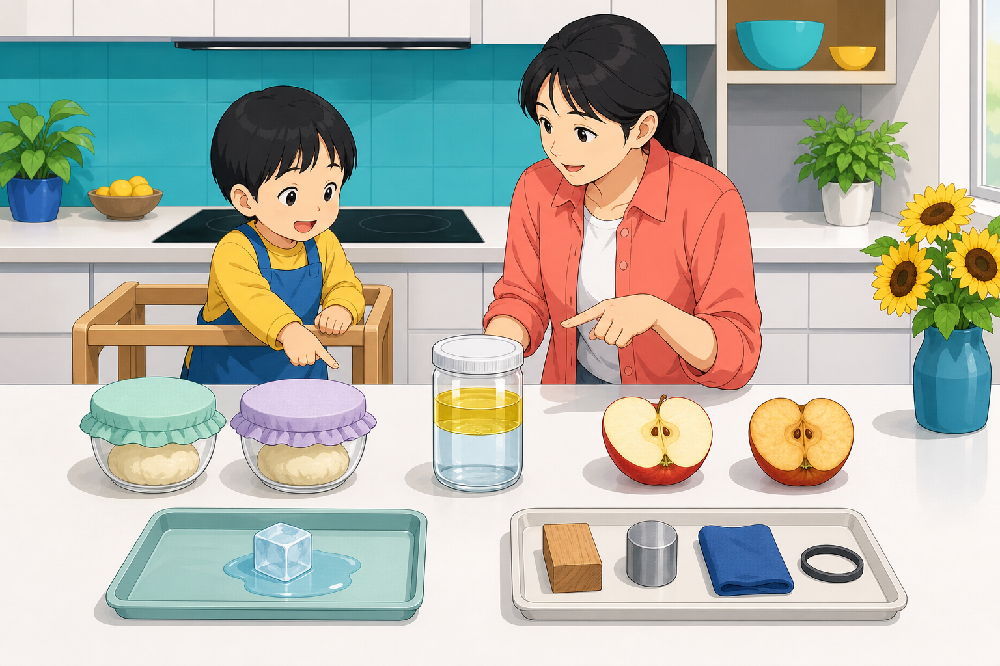

> **探索领域 11：** 物质、食物与家庭技术
>
> **核心问题：** 粒子怎样组成不同状态的物质，混合、溶解和加热又怎样改变材料与食物？

从固液气和粒子模型进入表面张力、油水分层、盐糖溶解和光散射，再观察发酵、面筋、蛋白质变化、褐变与爆裂。

## 怎样沿着本单元的追问链阅读

粒子图是模型，不是把肉眼看见的小彩球放大；物理变化和化学变化也可能同时发生。

## 追问链 30.1｜状态、粒子与水滴表面

粒子间距离与运动不同，状态变化保留物质身份，表面张力让小水滴趋圆。

### 第 305 问｜固体、液体和气体哪里不同？

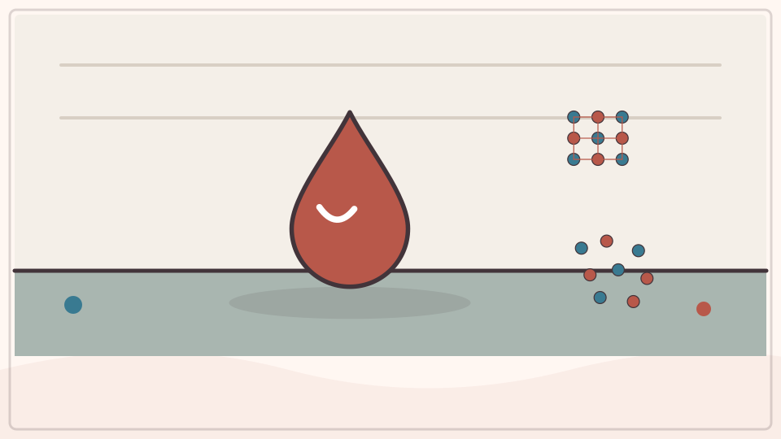

固体通常保持自己的形状，液体会流动并贴合容器，气体会扩散并充满可到达的空间。水可以是冰、液态水和水汽。物质状态会随温度和压力改变。

**再想一步：** 三种状态里的粒子都在运动，只是排列、距离和相互吸引不同。还有等离子体等其他状态，所以“三态”是日常环境中最常见的入门分类，不是全部。

**把知识连起来：** 固体中的粒子通常在相对固定位置附近振动，能维持形状；液体粒子彼此接近却可重新排列，所以保有体积而随容器改变形状；气体粒子相距更远、快速运动，会扩散并充满可用空间。温度和压力改变粒子能量与间距，物质便可能发生相变。

**再往外看：** 等离子体、液晶和超临界流体说明物质状态不只三种；三态模型是适合日常条件的第一层分类。

**容易弄混：** 固体粒子不是完全静止，液体也不是一堆微小水滴。三种状态描述大量粒子的集体行为，不是给每个单独粒子贴“固液气”标签。

*图解：固体粒子多在固定位置附近振动；液体能换位流动；气体相距更远。*

**一起看看：** 找一件固体、一杯液体和装着空气的封口袋来比较。

---

### 第 306 问｜东西真是由小粒子组成的吗？

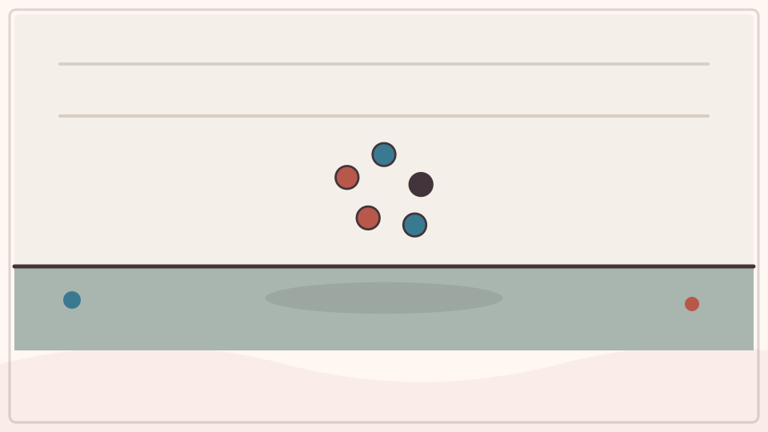

我们周围的物质由原子组成，许多原子结合成分子。它们小得不能用普通眼睛或放大镜直接看见，却能用实验和特殊仪器研究。不同排列会形成不同物质。

**再想一步：** 原子又含原子核和电子，但示意图里的彩球并非真实颜色和比例。科学模型挑出重要关系来解释现象，不等于给微观世界拍了一张普通照片。

**把知识连起来：** 普通物质由原子组成，原子可通过化学键形成分子、晶体或更大结构；原子内部还有电子和由质子、中子组成的原子核。我们看见的连续表面，是数量极大的微观成分及其电磁相互作用共同表现。粒子模型能解释扩散、溶解和相变，却不表示所有粒子都是小硬球。

**再往外看：** 扫描探针、粒子散射和光谱等实验从不同角度检验微观结构；科学模型会按尺度使用分子、原子或更基本粒子。

**容易弄混：** “由小粒子组成”不是把物体不断切就一定能直接看见原子，也不是原子内部填满原物质。示意图中的颜色、球形和巨大间距多是编码与放大。

**一起想想：** 一张地图不等于城市本身，原子模型与真实原子也有什么相似关系？

---

### 第 307 问｜冰融化后还是原来的水吗？

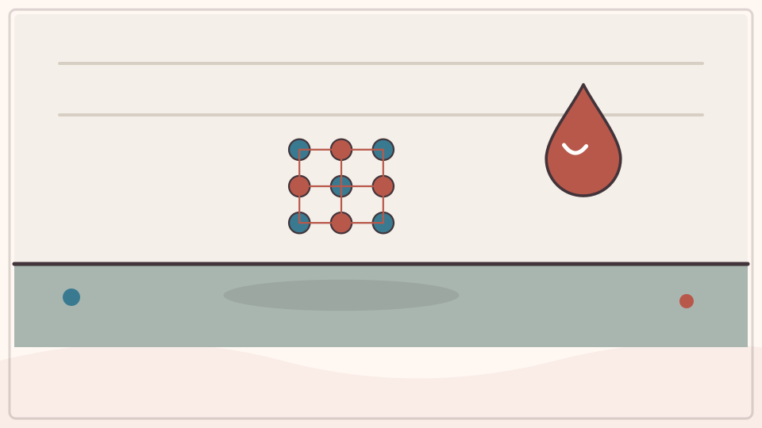

是。冰融化时，水分子的排列和运动方式改变，但每个水分子的组成没有变。这叫物理变化。若物质变成新分子，例如铁生锈，就是化学变化。

**再想一步：** 物理变化和化学变化不是只凭能不能倒回去判断；有些物理变化难恢复，有些化学反应可逆。关键是物质的化学组成是否发生变化。

**把知识连起来：** 冰和液态水都由水分子组成，融化时主要改变分子的排列与运动，而没有把水分子变成另一种物质。吸收的能量用于破坏部分有序结构，因此熔化过程中温度可暂时保持在相变点附近。重新降温时，水又能结晶成冰。

**再往外看：** 水结冰会因开放的晶体结构而体积增大，这是它与许多物质不同的重要性质。盐和压力会改变熔点。

**容易弄混：** 冰融化不是消失，也不是产生了“新水”；但样品若混入灰尘、蒸发或溢出，实际称量可能变化，不能把开放环境当作完全封闭系统。

*图解：冰在熔点附近吸收能量，较整齐的晶体结构被破坏，分子仍是水分子。*

**一起看看：** 比较融冰、撕纸和烤面包，先猜哪些产生了新物质。

---

### 第 308 问｜水滴为什么喜欢变圆？

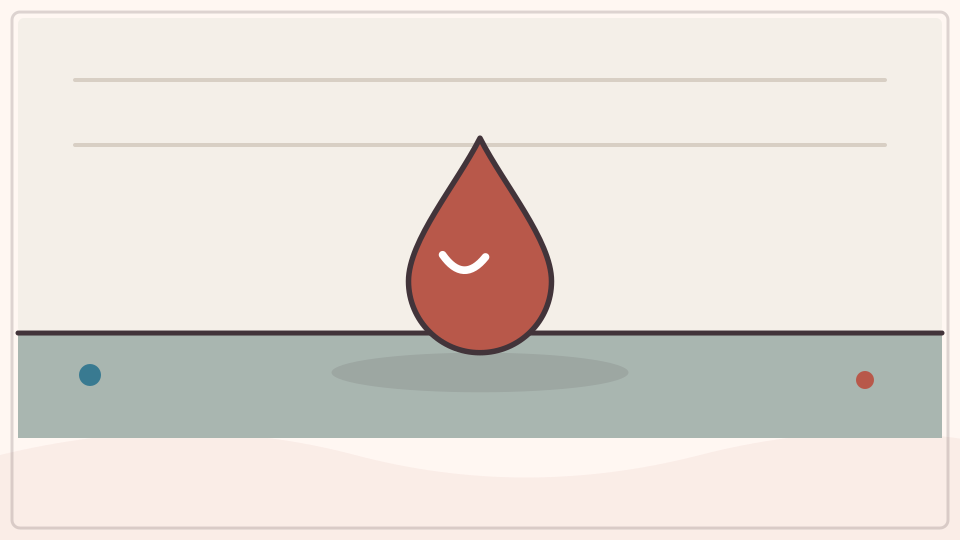

水分子彼此吸引，表面的分子受到向内的拉力，水面像一层有张力的薄皮。相同体积下，球形表面积最小，所以小水滴倾向变圆。重力会把大水滴压扁。

**再想一步：** 这种现象叫表面张力。肥皂会改变水分子在表面的相互作用，降低表面张力，让水更容易铺开并进入细小缝隙。

**把知识连起来：** 水面分子受到邻近分子的吸引不完全对称，界面表现出表面张力，倾向减少表面积；在相同体积下，球的表面积最小，所以小水滴趋近球形。落在固体上时，水与固体的黏附、重力和表面粗糙又会把它拉扁或铺开。

**再往外看：** 失重环境中较大水团也容易变圆；加入洗涤剂会降低表面张力并改变接触角。露珠形状可用界面能比较。

**容易弄混：** 水滴不是被一层弹性塑料皮包住，也并非任何大小都成完美球。滴越大，重力相对越重要；雨滴更像扁圆而不是泪滴。

*图解：液面分子受力不对称，表面张力倾向缩小表面积，小水滴因此接近球形。*

**一起试试：** 用滴管在防水盘上放大小水滴，由大人保管滴管。

## 追问链 30.2｜分层、溶解与散射

分子相互作用、温度和微小颗粒决定混合物是否均匀以及怎样与光作用。

### 第 309 问｜油和水为什么会分层？

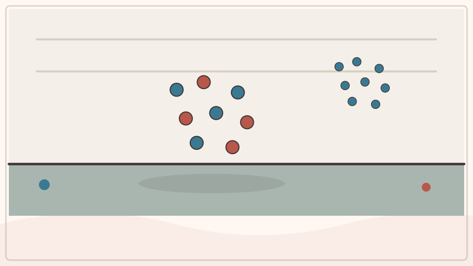

水分子彼此吸引的方式和油分子不同，两者不容易均匀混合。多数食用油密度又比水小，因此聚成一层浮在上面。摇晃后的小油滴会慢慢重新合并。

**再想一步：** 能让油水较稳定混合的物质叫乳化剂，它的一端亲水、一端亲油。蛋黄中的卵磷脂可帮助做蛋黄酱，洗涤剂则帮助水带走油污。

**把知识连起来：** 水分子有明显极性，容易包围带电或极性物质；油分子多为非极性，与水混合在能量上不利，于是油滴聚并并形成分开的相。许多油密度又低于水，所以常浮在上层。摇动能暂时打散油滴，乳化剂则用两亲分子稳定小滴。

**再往外看：** 牛奶、蛋黄酱和护肤乳都是经过稳定的乳状体系，温度、盐和酸度会改变其稳定性。

**容易弄混：** 分层不只因为油“比较轻”，密度解释上下位置，分子相容性才解释为什么不均匀混合。也不是所有油都必然浮在任何液体上。

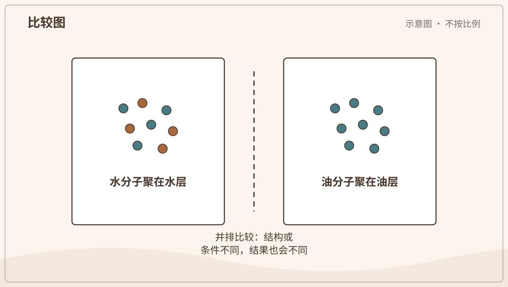

*图解：水分子彼此吸引，油分子也更愿与油相聚；密度差又决定哪层在上。*

**一起看看：** 由大人在密封瓶装水和少量油，摇匀后静置观察。

---

### 第 310 问｜盐放进水里去哪儿了？

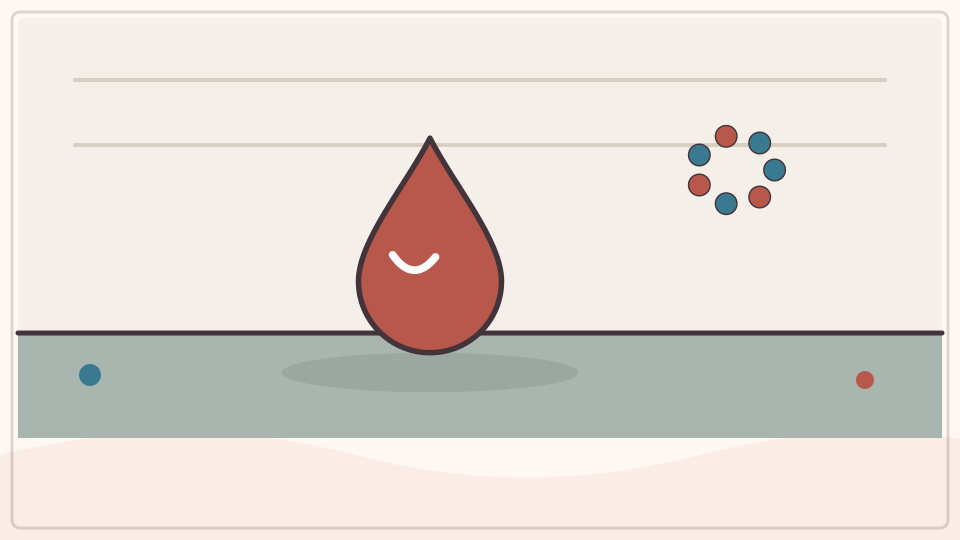

盐晶体接触水后，会分开成带电的钠离子和氯离子，被水分子包围并散开。眼睛看不见单个离子，盐却仍在水中。水蒸发后，盐可以重新结晶。

**再想一步：** 溶解不是把物质变成“什么都没有”，总质量仍保存。水能溶多少盐有上限，达到饱和后，再加的盐会留在底部。

**把知识连起来：** 食盐晶体进入水后，水分子的极性端围住钠离子和氯离子，把它们从晶格中分开并分散到整个液体。离子小到肉眼不可见，却仍保留质量，并使水能导电、尝起来咸。蒸发水后，离子可重新排列成盐晶体。

**再往外看：** 溶解速度受搅拌、温度和颗粒大小影响，最终能溶多少则由溶解度与水量等决定；这两个问题不能混同。

**容易弄混：** 盐不是化成水或消失了，也不是被水分子切成更小的盐粉。导电实验只能用安全低压专业装置，绝不能接市电。

*图解：盐晶体进入水后分成带电离子，水分子包围离子并把它们分散开。*

**一起看看：** 由大人配一小杯盐水并蒸发在安全处，不品尝实验液体。

---

### 第 311 问｜糖溶了，为什么还能尝到甜？

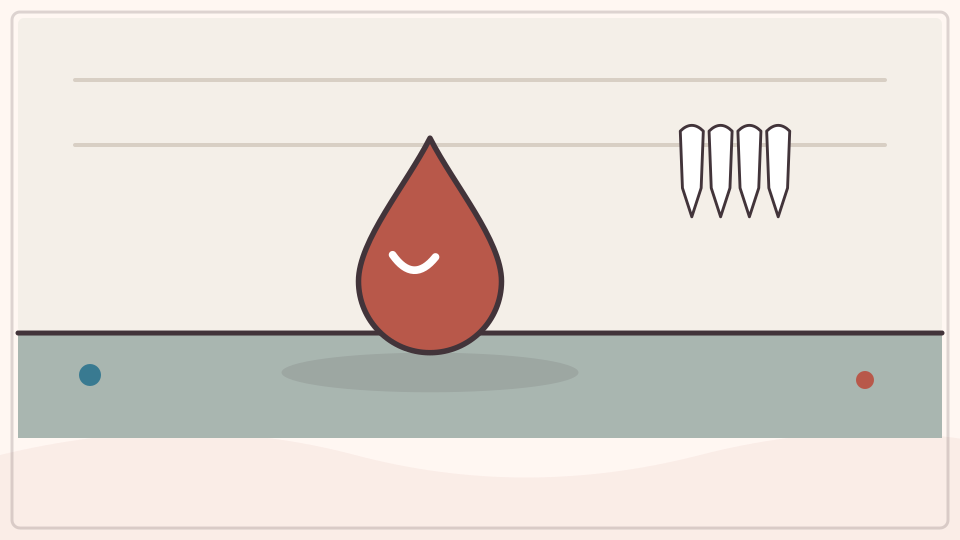

糖晶体在水中分散成单个糖分子，太小而看不见。喝入口中时，糖分子仍能碰到味觉受体，所以水有甜味。透明不等于里面没有溶解物。

**再想一步：** 糖溶解时分子本身通常没有被拆成离子，和食盐的溶解方式不同。测量溶液质量或蒸发水，都能证明糖仍然存在。

**把知识连起来：** 糖分子从晶体表面分散到水中，形成均匀溶液；喝入口中后，溶液把糖分子带到味蕾受体，神经系统于是产生甜味感觉。透明只说明可见光没有被大颗粒强烈散射，不说明里面没有物质。质量守恒可用称量验证。

**再往外看：** 不同糖和甜味剂与受体结合方式不同，甜度也不同；温度和其他味道会改变感受。

**容易弄混：** 看不见糖不等于糖没有了，也不能靠尝未知溶液来鉴定。儿童实验只用大人准备的可食材料，并控制摄入量。

**一起想想：** 还有哪些看不见却能用味道、气味或测量发现的东西？

---

### 第 312 问｜为什么温水常让糖溶得更快？

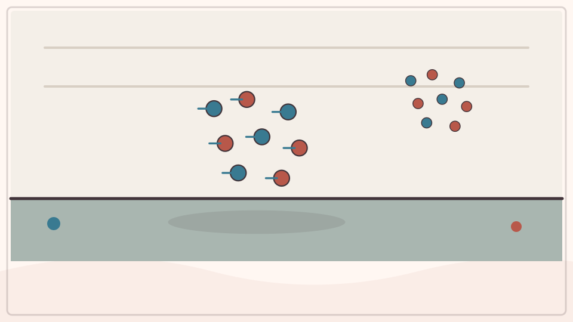

温度较高时，水分子运动更快，碰撞糖晶体并带走糖分子的速度通常增加。搅拌也会把已含很多糖的水移开，换来新水接触晶体。因此溶解更快。

**再想一步：** “溶得更快”和“最终能溶更多”是两个问题。许多固体在热水中溶解度更高，但不是所有物质都这样，气体在热水中反而常较难保持溶解。

**把知识连起来：** 温度升高时水分子平均运动更快，糖晶体表面交换和溶液中的扩散通常加快，所以糖更快分散；许多固体糖在热水中的平衡溶解度也更高。搅拌不断把较淡溶液带到晶体旁，又缩短等待时间。速度与最终能溶多少仍是不同量。

**再往外看：** 冷却浓糖水可能形成过饱和溶液并析出晶体，糖果制作利用了溶解度随温度变化。气体在水中的溶解趋势常与许多固体不同。

**容易弄混：** 热水不是把糖熔化，除非温度达到糖本身熔化或分解条件；日常杯中主要发生溶解。热水有烫伤风险，应由大人操作。

*图解：温水中的分子通常运动更快，碰撞和混合更频繁，许多固体便溶得更快。*

**一起试试：** 只用冷水和温水，由大人确认不烫，比较同量糖消失速度。

---

### 第 313 问｜牛奶为什么是白色的？

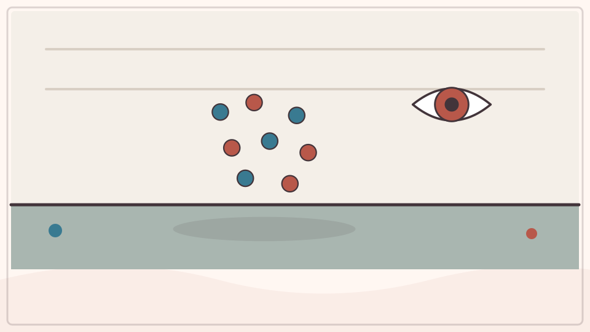

牛奶里有水、脂肪小滴、蛋白质、乳糖和矿物质。脂肪滴与蛋白质颗粒把许多颜色的光向四周散射，混在一起看起来白。脂肪多少会影响颜色和口感。

**再想一步：** 牛奶是一种胶体和乳状液，颗粒比分子大，却小到不容易迅速沉降。均质处理把大脂肪滴打成小滴，减少奶油浮到上层。

**把知识连起来：** 牛奶中悬浮着微小脂肪球和由酪蛋白等组成的胶束，它们把入射光向许多方向散射，多种可见光混合后看起来接近白色。脂肪含量、颗粒大小和天然色素会让牛奶偏黄或偏蓝。它不是一种透明纯液体，而是复杂胶体。

**再往外看：** 酸化会让酪蛋白聚集形成凝乳，均质处理则把脂肪滴变小、减少上浮分层。奶酪和酸奶利用了这些结构变化。

**容易弄混：** 白色不是因为牛奶里加了白颜料，也不能仅凭颜色判断新鲜或营养。饮用和过敏问题应按食品标签与医嘱处理。

**一起看看：** 在光线下比较牛奶和清水的透光，不喝放久的实验牛奶。

## 追问链 30.3｜发酵、面筋、蛋白质与褐变

气体网络、蛋白质结构和化学反应共同改变食物的形状、质地与颜色。

### 第 314 问｜面包里的小洞是谁吹的？

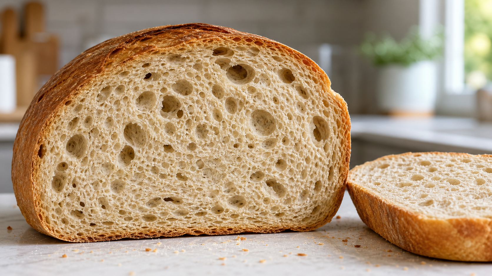

*写实观察图：发酵产生的气体被面团网络留住，烘烤后形成大小不一的孔洞。*

酵母吃面团里的糖，通过发酵产生二氧化碳和其他物质。气体被有弹性的面筋网络困住，形成许多气泡。烘烤时气泡膨胀并固定成孔洞。

**再想一步：** 酵母是真菌，发酵在缺氧条件下把糖的一部分能量转成可用形式。温度太低反应慢，太高会伤害酵母；盐、糖和面团结构也影响发酵。

**把知识连起来：** 酵母利用面团中的糖进行发酵，产生二氧化碳和其他产物；气体被面筋与淀粉形成的黏弹网络包住，逐渐撑出气泡。烘烤时气体和水蒸气膨胀，蛋白质凝固、淀粉糊化，孔洞结构被固定。面包的洞因此来自生物与材料变化连续配合。

**再往外看：** 酸面团还含乳酸菌，发酵速度、面团含水量和整形会改变孔洞大小与风味。无麸质面包需要其他聚合物帮助留气。

**容易弄混：** 洞不是酵母自己挖出的房间，也不全是酵母吹出的纯二氧化碳球。原理图会夸大气泡和网络，真实结构是不规则三维孔隙。

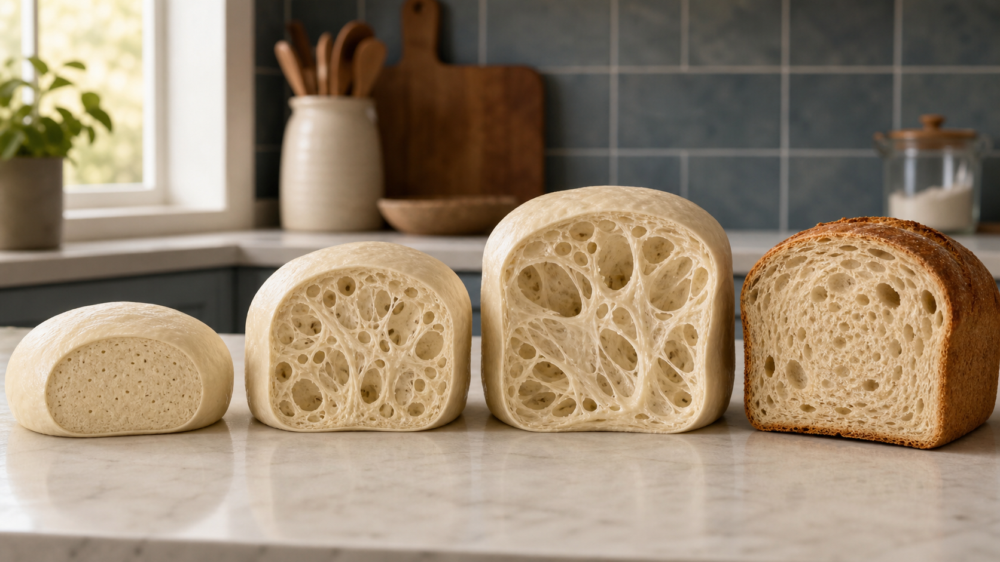

*写实原理图：同种面团从混合、发酵膨胀到烘烤定型的连续阶段；内部网络和气泡为了看清而放大，不按比例。*

*图解：酵母分解面团里的糖，产生二氧化碳；有弹性的面筋网络把气泡留住。*

**一起看看：** 由大人切开不同面包，比比孔洞大小和分布。

---

### 第 315 问｜揉面为什么越揉越有弹性？

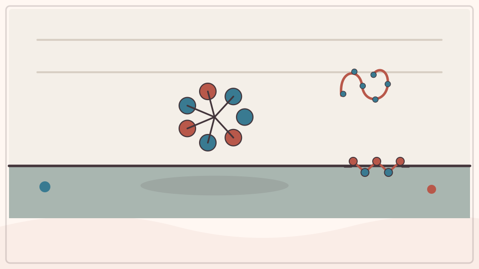

小麦粉加水后，其中一些蛋白质形成面筋网络。揉面让蛋白质更充分接触、拉伸并连接，面团就能延展又回缩。网络还能兜住发酵产生的气体。

**再想一步：** 面筋不是一根现成橡皮筋，而是麦谷蛋白和醇溶蛋白等共同形成的动态网络。水量、揉制、静置、盐和面粉种类都会改变质地。

**把知识连起来：** 小麦粉加水后，麦谷蛋白和醇溶蛋白水合；揉面使蛋白质接触、拉伸并形成能延展又回缩的面筋网络。网络把气泡分隔并传递力，面团便从松散变得连贯。揉得太少、太多或水量不合适都会影响结果。

**再往外看：** 静置也让水继续进入面粉并让网络松弛，折叠、发酵和盐会改变面团性质。不同小麦粉蛋白含量不同。

**容易弄混：** 弹性不是揉进了空气才出现，也不是所有谷物粉加水都形成同样面筋。生面粉和生面团可能含病原体，不能让孩子品尝。

**一起试试：** 和大人揉一小团可食用面团，前后各拉一次比较。

---

### 第 316 问｜鸡蛋加热后为什么变硬？

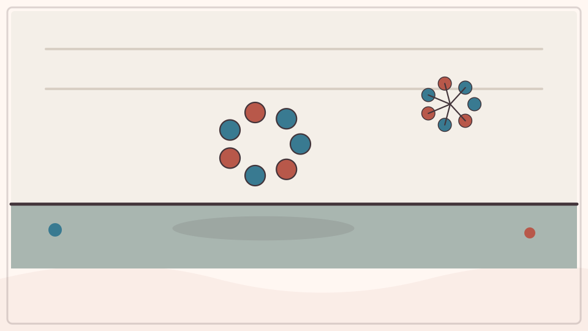

生鸡蛋里的蛋白质折叠成特定形状，分散在水中。加热会让它们展开并互相连接，形成网状结构。这个网络困住水，蛋白便从透明流体变成白色固体。

**再想一步：** 这种形状改变叫蛋白质变性，连接成网络叫凝固。它通常难以恢复，因为许多新相互作用已经形成；酸和搅打也能让蛋白质结构变化。

**把知识连起来：** 蛋清和蛋黄中的蛋白质原本折叠并分散在水中；加热使许多蛋白质展开，再互相连接成三维网络，把水和其他成分固定，鸡蛋便从透明或流动变得不透明、坚实。这叫变性与凝聚，通常难以完全恢复原状。不同蛋白质在不同温度开始变化。

**再往外看：** 酸、盐和机械搅打也能改变蛋白质结构，蛋羹的细嫩程度取决于加热速度和最终温度。

**容易弄混：** 蛋变硬不是里面的水全蒸干，也不是蛋白质消失后换成固体。避免生食和烫伤，烹饪由大人按食品安全要求完成。

*图解：加热使蛋白质展开，展开的分子互相连接成网络，蛋液便由流动变为凝固。*

**一起看看：** 烹饪只由大人完成，孩子比较冷却后的熟蛋白和蛋黄。

---

### 第 317 问｜苹果切开为什么会变褐？

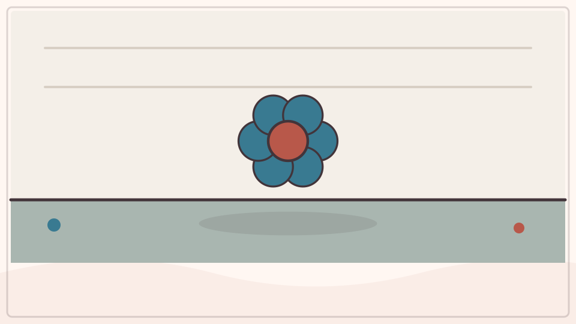

切开苹果会破坏细胞，让酶、含酚物质和空气中的氧接触。酶帮助它们发生反应，形成褐色物质。低温、酸或减少接触空气能减慢变化。

**再想一步：** 这叫酶促褐变，不等于苹果立刻腐烂或生锈。柠檬汁的酸性和抗氧化物质会影响反应，但食物是否安全仍要看储存时间、气味和卫生。

**把知识连起来：** 切开苹果会破坏细胞，让原本分隔的多酚、氧气和多酚氧化酶相遇；酶促氧化产生的物质继续反应，形成褐色色素。酸性环境、低温、隔绝氧气或短时加热可减慢不同步骤。褐变速度随品种和成熟度变化。

**再往外看：** 香蕉、土豆和牛油果也会酶促褐变，烤面包表面的棕色则主要来自美拉德反应，机制不同。

**容易弄混：** 变褐不等于立刻腐烂或有毒，但颜色也不能保证安全。是否食用还要看气味、质地、储存时间和大人判断。

**一起看看：** 由大人准备两片苹果，一片涂少量柠檬汁，比较颜色。

---

### 第 318 问｜玉米粒为什么会“砰”地开花？

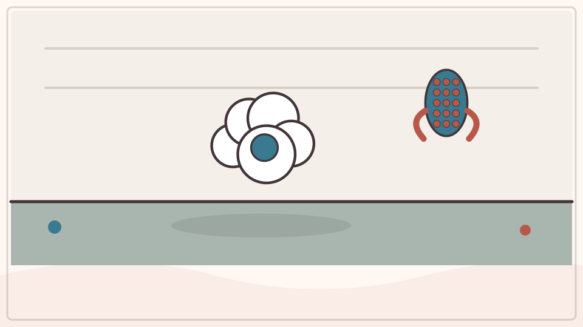

爆米花玉米有坚硬外壳，内部含少量水和淀粉。加热时，水变成高压水汽并撑破外壳。热软的淀粉迅速膨胀，冷却后变成白色松脆结构。

**再想一步：** 只有水分、外壳强度和淀粉结构合适的玉米品种容易爆开。没爆的“老头豆”可能因裂缝漏气或含水量不合适。

**把知识连起来：** 爆裂玉米有坚硬而相对密封的果皮，内部淀粉中含少量水。加热时水变成高压水蒸气，淀粉软化；当外壳承受不住而破裂，压力骤降，淀粉泡沫迅速膨胀并冷却定形。普通甜玉米的含水量和外壳结构不适合产生同样爆裂。

**再往外看：** 爆裂温度、含水量和受热均匀度决定未爆粒比例，锅盖既保温也阻挡高速飞出的颗粒。

**容易弄混：** 玉米不是因为里面藏着空气炸弹，也不是任何干种子都能这样开花。加热实验必须由大人操作，避免热油、蒸汽和噎食风险。

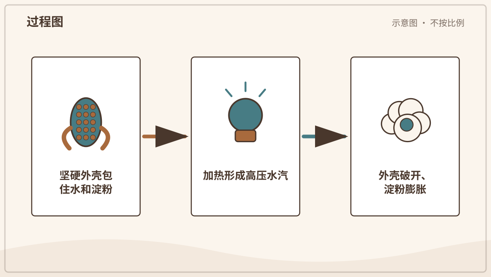

*图解：玉米粒内水分受热成为高压水汽，撑破外壳后，热软淀粉快速膨胀。*

**一起记住：** 加热与开盖由大人操作，远离热锅、热油和蒸汽。

## 单元综合观察｜建立一张变化证据表

由大人准备安全样品，只观察溶解、分层、气孔或颜色变化，记录变化前后看到了什么。加热、切开、玻璃器具和生食材料全部由大人处理。
