# 兴趣单元 31｜热、材料与家用机器

> **探索领域 11：** 物质、食物与家庭技术
>
> **核心问题：** 家用装置怎样搬运热或空气，材料内部结构又怎样决定吸水、断裂、锈蚀和弹性？

冰箱、微波炉、锅和保温杯展示多种能量传递，木、纸、玻璃、金属、塑料、橡胶、陶瓷与布展示结构和性质，洗衣机与吸尘器再组合运动和流体。

## 怎样沿着本单元的追问链阅读

同一材料名称可能包含许多配方和结构；一次触摸或弯曲只能支持有限比较。

## 追问链 31.1｜制冷、加热与保温

装置通过相变、传导、辐射或电磁作用搬运能量，保温则减慢不需要的热流。

### 第 319 问｜冰箱怎样把食物变凉？

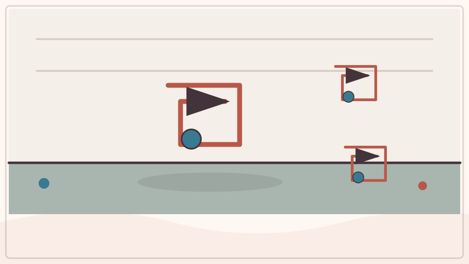

冰箱让制冷剂在管路中蒸发和压缩。制冷剂在箱内蒸发时吸收热量，压缩机把它送到箱外，冷凝时把热放进房间。冰箱是在搬热，不是在制造“冷”。

**再想一步：** 压力改变制冷剂的沸点，使它能在箱内低温蒸发、箱外较高温冷凝。门开太久，房间热空气进入，压缩机就要做更多功。

**把知识连起来：** 冰箱不是制造冷，而是用制冷剂循环把箱内热量搬到房间。制冷剂在蒸发器中低压蒸发并吸热，压缩机提高其压力和温度，冷凝器在箱外放热使其液化，节流装置再降低压力进入下一轮。绝热层和门封减少外界热量重新进入。

**再往外看：** 热泵与冰箱原理相近，只是把需要利用的一侧改为室内供暖或制冷；效率与内外温差有关。

**容易弄混：** 冰箱背后发热不是故障的必然证据，而是它排出箱内热和电机功的结果。开着冰箱门不能给密闭房间降温，反而会让总热量增加。

*图解：制冷剂在冰箱内蒸发吸热，在外部压缩并冷凝放热，再循环回来。*

**一起看看：** 摸冰箱外壳大人允许的位置，可能比房间略暖，不碰后部设备。

---

### 第 320 问｜冰箱冷冻室为什么会结霜？

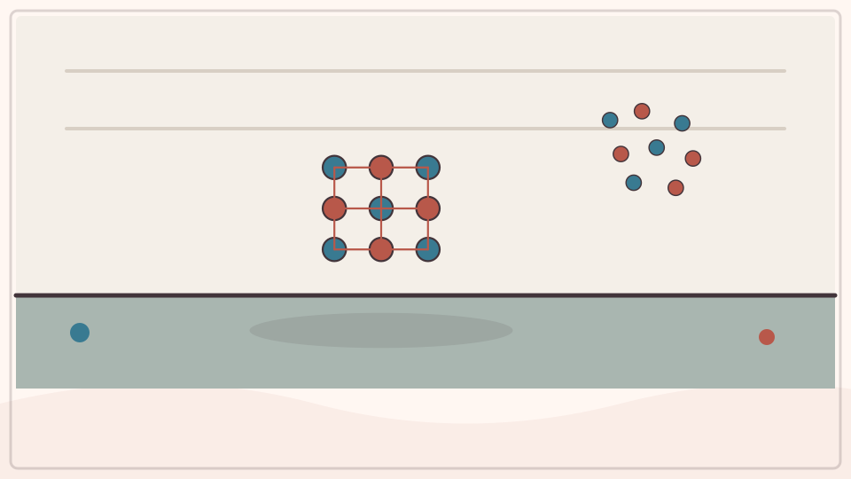

开门时，潮湿空气进入冷冻室。水汽碰到很冷的表面，会凝华或先凝结再冻结，逐渐形成霜。门封不严会让更多湿气进入。

**再想一步：** 无霜冰箱会定时加热蒸发器融霜，再把水排走，并不表示里面永远没有任何冰晶。厚霜会阻碍空气流和热交换，增加能耗。

**把知识连起来：** 含水汽的空气进入低温冷冻室后，水汽在很冷的表面凝华成冰晶，或先凝结再冻结，逐渐形成霜。频繁开门、门封漏气和未密封食物会带入更多水分。无霜冰箱定期加热蒸发器融霜，再把水排走。

**再往外看：** 霜层过厚会阻碍空气流动和传热，使制冷系统工作更久；不同机型有不同除霜方式。

**容易弄混：** 霜不是冷气冻成的白棉，也不一定来自冷冻食物本身。不能用尖锐工具铲冰，以免刺破管路，应按说明书由大人处理。

**一起记住：** 除霜由大人按说明完成，不用刀或尖物凿冰。

---

### 第 321 问｜微波炉怎样把食物加热？

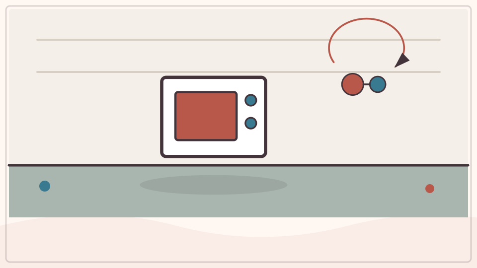

微波炉产生快速变化的电磁场，让食物中的极性分子，特别是水分子，反复改变取向。吸收的电磁能转成分子的无规则运动，食物温度便会上升。加热常不均匀，所以需要静置和搅拌。

**再想一步：** 微波不是从食物最中心统一向外加热，能量穿入深度有限，还会形成强弱分布。容器形状、含水量和食物厚度都会造成热点。

**把知识连起来：** 微波炉产生交变电磁场，使食物中水等极性分子与带电成分不断响应并把能量转成热。微波能进入食物一定深度，但并非从中心向外加热；驻波、形状和含水量会造成冷热不均，转盘和静置帮助热扩散。容器也可能因食物传热而变热。

**再往外看：** 微波频率属于非电离辐射，不足以像 X 射线那样电离分子；屏蔽腔和门锁防止设备开门工作。

**容易弄混：** 微波不是让食物产生危险放射性，也不是所有材料都可放入。金属、密封容器和特定食品的风险必须遵循说明书，儿童不得独自操作。

*图解：变化的电场让极性分子不断调整方向，吸收的电磁能转成无规则分子运动。*

**一起记住：** 微波炉只由大人操作，出炉食物和容器可能局部很烫。

---

### 第 322 问｜平底锅怎样把食物煎熟？

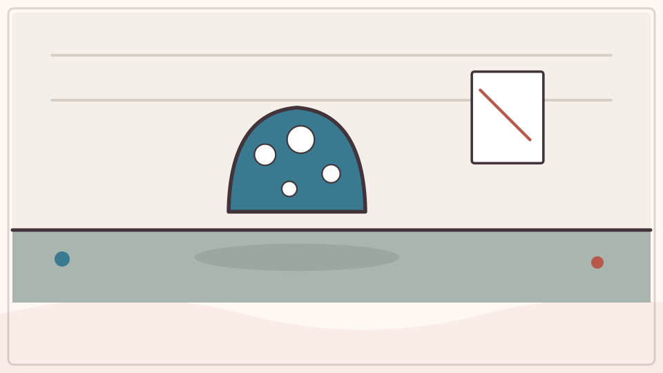

炉具先把能量传给锅底，金属再通过导热把热送到食物接触处。食物内部还靠导热和水分流动慢慢升温。油能填补小缝并帮助热量均匀接触表面。

**再想一步：** 高温下蛋白质、糖和水发生多种变化，表面可能出现美拉德反应，产生褐色和香味。锅底过热会使油和食物分解，烹饪需要控制温度。

**把知识连起来：** 炉火或电热元件先把锅加热，锅底通过传导把能量送入食物，油和水的流动再帮助分配热量。表面水分减少且温度升高后，蛋白质、糖和其他分子发生美拉德反应等变化，产生棕色和香味；内部则需靠传导逐渐熟透。锅材、厚度与火力影响均匀程度。

**再往外看：** 铸铁储热多、响应慢，薄铝锅传热快，不粘涂层又改变表面黏附；没有一种锅对所有任务都最好。

**容易弄混：** 食物变褐不只是被“烤干”，外面有颜色也不保证里面达到安全温度。热锅、油溅和蒸汽只能由大人处理。

**一起记住：** 炉火、锅柄、热油和刚关火的锅都由大人处理。

---

### 第 323 问｜保温杯怎样留住热？

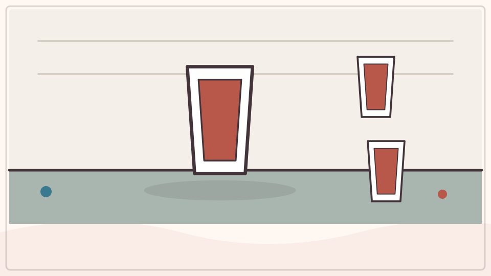

保温杯常有双层壁，中间接近真空，减少导热和对流。发亮表面能减少热辐射，密封盖阻止热空气和水汽跑出。这些办法一起减慢热量交换。

**再想一步：** 保温杯不能让温度永远不变，杯口、支撑点和材料仍会传热。它同样能减慢冷饮从外界吸热，所以“保温”也包括保冷。

**把知识连起来：** 保温杯用双层壁之间的低压空间减少传导和对流，光亮表面减少部分热辐射，杯盖和细颈又限制空气交换与蒸发。它只能减慢热量从热物体流向冷环境，不能永远保持原温度。装冷饮时，同样结构也减慢外界热进入。

**再往外看：** 真空并非绝对空无，杯口、支撑点和材料仍会形成热桥；保温性能要用规定时间内的温度变化比较。

**容易弄混：** 保温杯不是主动制造热或冷，也不能因为外壁不烫就认为内容物安全。密封热饮可能积压蒸汽，开盖和饮用要由大人判断温度。

*图解：双层杯壁、真空或隔热层和严密杯盖分别减弱传导、对流和蒸发。*

**一起看看：** 只观察空杯剖面图；热饮温度必须由大人检查。

## 追问链 31.2｜木、纸、玻璃、金属与合成材料

密度、纤维方向、裂纹、氧化、聚合物链、烧结和编织决定宏观表现。

### 第 324 问｜木头为什么常能浮在水上？

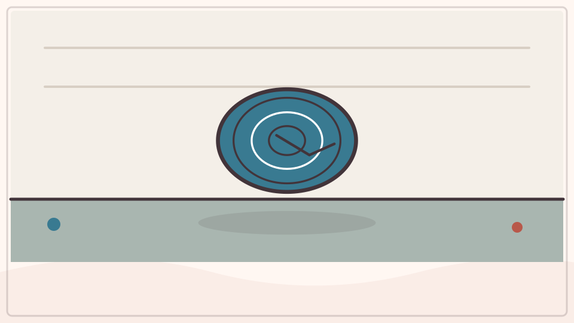

许多木材内部有细胞孔隙和空气，平均密度比水小，所以浮力能托住它。吸水、木种和形状会改变浮沉。乌木等某些木材也可能沉水。

**再想一步：** 是否浮起看物体平均密度与液体密度的比较，不只看材料硬不硬或物体大不大。钢船能浮，是因为空心船体连同空气的平均密度足够小。

**把知识连起来：** 水对浸入物体产生等于所排开水重的浮力。许多木材细胞壁与内部空隙组成的平均密度低于水，所以排开足够水时能平衡自身重量并漂浮。树种、含水量、空洞和水的盐度都会改变结果；吸水或腐朽后有些木头会下沉。

**再往外看：** 钢船也靠中空船体降低整体平均密度，说明浮沉看整个物体与排水体积，不只看材料小块。

**容易弄混：** 木头浮不是因为水不愿意接纳它，也不是所有木材永远浮。按进水下仍有浮力，只是手提供额外向下力；水边实验必须由大人近距离看护。

**一起试试：** 由大人在水盆放软木和湿木片，水上活动全程陪同。

---

### 第 325 问｜纸为什么会吸水？

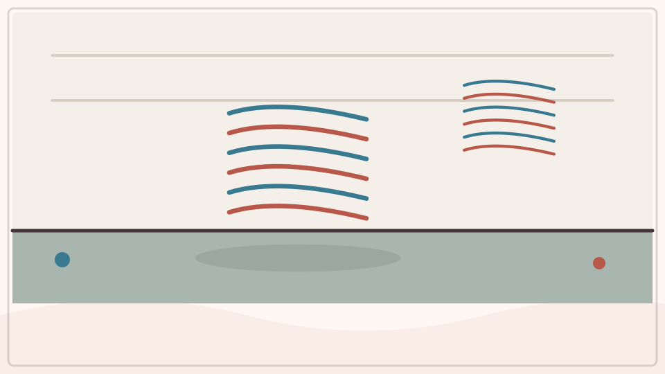

纸由交错的植物纤维组成，纤维之间有很多细小孔道。水与纤维相互吸引，会沿孔道向前爬，这叫毛细作用。纸湿后，纤维间连接改变，强度常会下降。

**再想一步：** 毛细上升由水对壁面的附着、分子间内聚和表面张力共同产生。孔越细，上升高度可能越高，但流动速度、纸张涂层和纤维方向也重要。

**把知识连起来：** 纸由交错的纤维素纤维组成，纤维和纤维间细孔容易被水润湿。水在狭窄孔道中的黏附、内聚和表面张力共同产生毛细作用，沿纤维网络扩散；纤维吸水后还会膨胀、变软。施胶和涂层可减少吸水。

**再往外看：** 纸巾故意做得多孔且亲水，防油纸、照片纸和纸杯则通过压实或涂层获得不同液体行为。

**容易弄混：** 纸不是像海绵只有几个大洞，也不是水被“吸走后消失”。水仍在纤维与孔隙中，可通过称重和干燥验证。

*图解：水对纸纤维的附着和细孔中的表面张力共同作用，把水拉进纸内。*

**一起试试：** 把纸巾一角碰到有色水，由大人使用食用色素并防止误饮。

---

### 第 326 问｜纸为什么横着竖着不一样好撕？

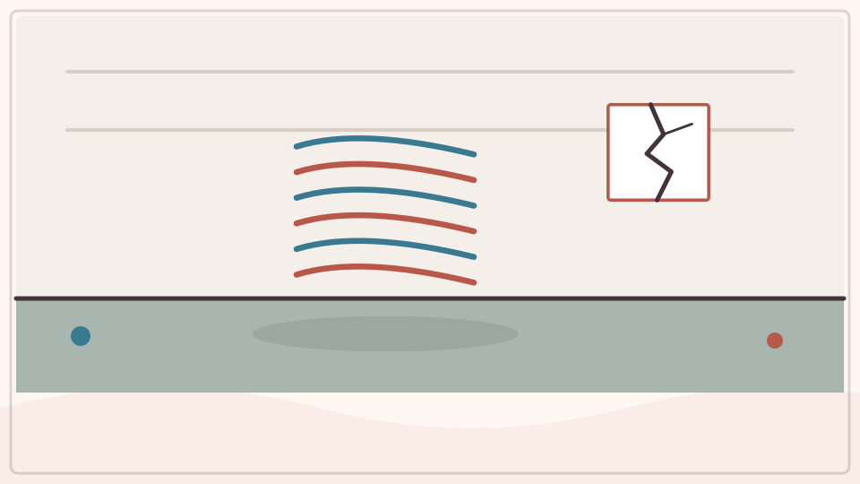

造纸时，许多纤维会更偏向机器运行的方向排列。沿纤维方向，裂口较容易走直；横过许多纤维时，撕裂路线更曲折。不同纸张的差别大小不同。

**再想一步：** 材料在不同方向性质不同叫各向异性。木材、织物和复合材料也常有方向性，工程师会按受力方向安排纤维。

**把知识连起来：** 机器造纸时，含水纸浆沿一个方向高速流动和拉伸，许多纤维更倾向顺着机器方向排列。沿纤维方向撕裂时，裂缝较容易沿纤维间前进；横向则要切断或拉出更多交错纤维，手感不同。纸张种类、湿度和涂层会改变差异。

**再往外看：** 书籍装订、折纸和包装会利用纸纹方向，让书页易翻或纸盒更挺。手工纸的纤维方向可能不那么明显。

**容易弄混：** “横竖”不是纸面天然的上下左右，而是相对制造纹理。每张纸也不一定都能用一次撕裂准确判断，实验应重复并交换起点。

**一起试试：** 由大人给两条废纸，从两个方向慢慢撕，比较边缘。

---

### 第 327 问｜玻璃很硬，为什么容易碎？

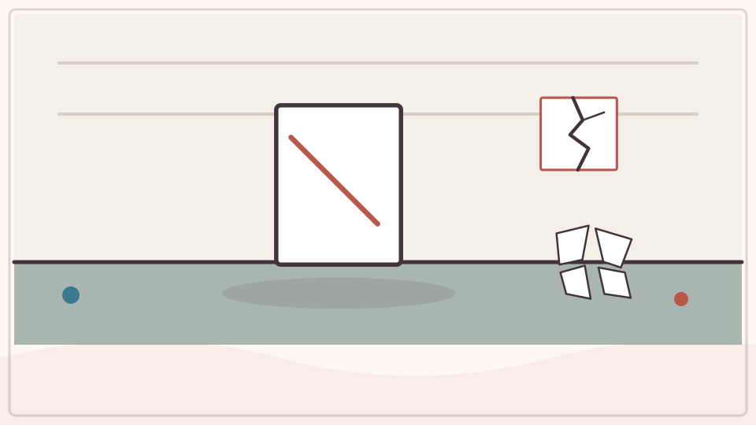

玻璃表面很硬，不容易被软物划伤，却缺少让裂纹停下的内部结构。小缺口受力时会集中应力，裂纹迅速扩展，玻璃就脆裂。硬度和韧性不是一回事。

**再想一步：** 钢化玻璃通过表面压应力提高抗裂能力，碎时常成小颗粒；夹层玻璃用薄膜粘住碎片。不同安全玻璃针对的风险也不同。

**把知识连起来：** 普通玻璃是原子排列无长程规则的非晶固体，化学键使它坚硬，却缺少能让塑性变形广泛分散应力的机制。表面微小划痕会集中拉应力，裂纹一旦开始便可迅速扩展，所以硬与脆能同时存在。厚度、形状和残余应力都会影响破裂。

**再往外看：** 钢化玻璃让表面保有压应力，提高抗裂能力并在破裂时形成较小颗粒；夹层玻璃用塑料层黏住碎片，安全机制不同。

**容易弄混：** 玻璃不是严格意义上会在室温几百年缓慢流下来的液体，老窗上厚薄差多来自旧制造工艺。破玻璃只能由大人用防护工具处理。

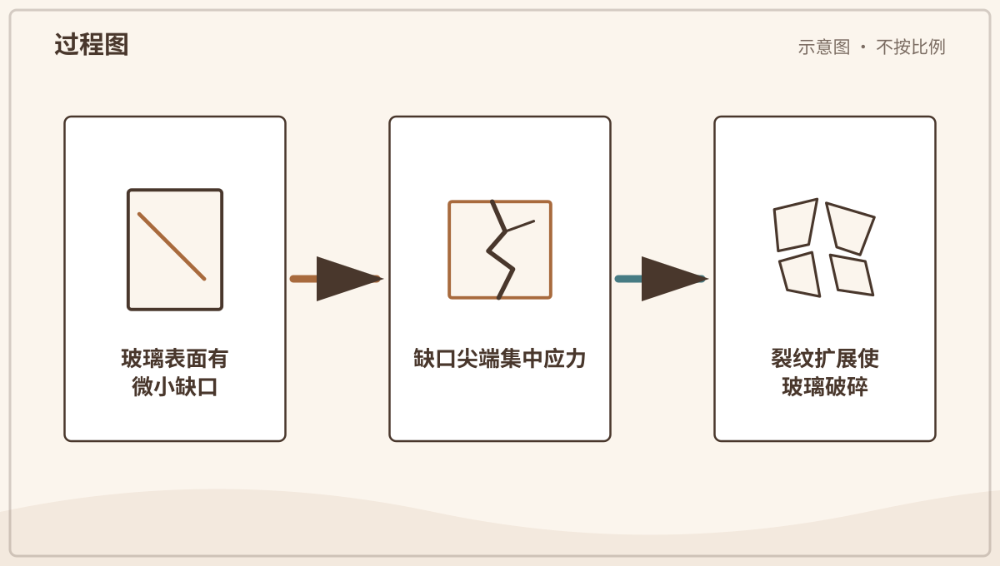

*图解：玻璃表面小缺口会集中应力；裂纹一旦开始扩展，脆硬材料便迅速断开。*

**一起记住：** 破玻璃不靠近、不触碰，立刻叫大人处理。

---

### 第 328 问｜铁为什么会生锈？

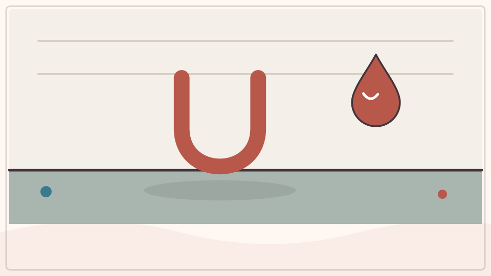

铁与氧和水发生化学反应，会形成含水氧化铁等锈蚀产物。盐能让电化学过程更快，所以海边铁件更易锈。锈层疏松，不能一直保护下面的铁。

**再想一步：** 涂漆、镀锌、加铬制成不锈钢或保持干燥，都能用不同方法减慢腐蚀。锈蚀是材料与环境之间的电子转移反应。

**把知识连起来：** 铁在水和氧参与下发生电化学氧化，形成含水氧化铁等疏松锈层。锈层不能像铝表面的致密氧化膜那样稳定隔绝内部，反应可继续深入；盐水提高导电性，常加快腐蚀。涂漆、镀层、合金化或牺牲阳极可切断反应条件。

**再往外看：** 腐蚀需要同时考虑材料、环境和电连接，桥梁与船舶会定期检测剩余厚度而不只看表面颜色。

**容易弄混：** 铁锈不是铁里面原有红色跑出来，也不是只有下雨才会发生。擦掉锈色不等于恢复已损失的金属，清理与防护应由大人进行。

**一起看看：** 比较有漆和掉漆铁栏的表面，不摸尖锐锈片。

---

### 第 329 问｜塑料都是同一种东西吗？

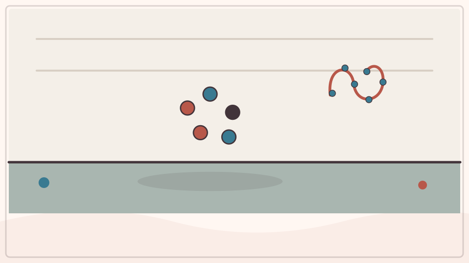

塑料是一大类由高分子组成的材料，不是一种单独物质。不同分子链和添加剂让塑料变硬、变软、透明、耐热或有弹性。回收方法也因种类而异。

**再想一步：** 热塑性塑料受热可重新软化，热固性塑料形成交联网络后不易再熔。材料标记帮助分类，却不保证当地都能回收，仍要按本地规则处理。

**把知识连起来：** 塑料是一大类以聚合物为主要成分的材料，聚乙烯、聚丙烯、聚酯、尼龙等分子链结构不同；增塑剂、颜料、填料和增强纤维又改变柔软、耐热与强度。热塑性塑料可再次软化成形，热固性塑料则有交联网络，难以重新熔融。名称只说“塑料”会丢失关键差异。

**再往外看：** 回收标志常帮助识别树脂类别，却不保证当地设施一定接受或材料能无限循环；混合物和污染会降低再利用质量。

**容易弄混：** 塑料不都是一次性、透明或柔软，也不能把“可降解”理解为扔到自然界很快消失。使用和分类要看具体材料与当地规则。

**一起看看：** 和大人查看包装材料标记，不把塑料袋套在头上。

---

### 第 330 问｜橡胶为什么能拉长又回来？

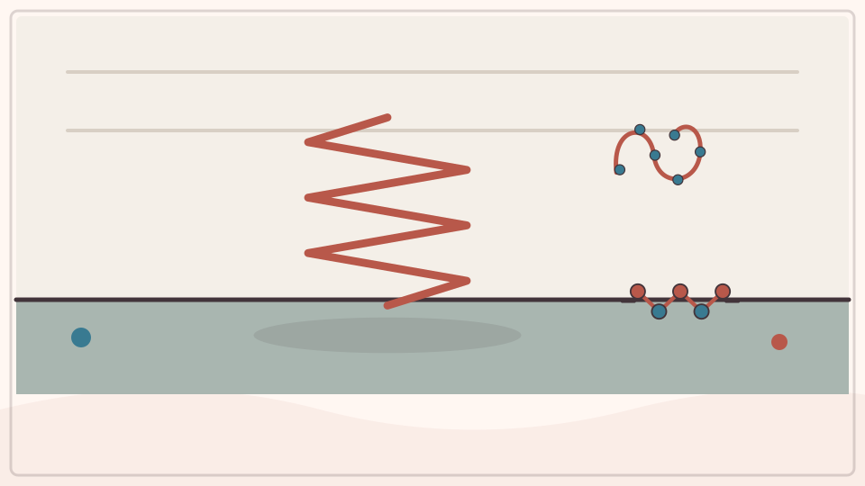

橡胶由卷曲的长分子链组成，链之间还有一些连接点。拉伸时链被拉直并排列，放手后又倾向回到弯曲混乱的状态。连接点防止它们完全滑散。

**再想一步：** 天然橡胶常经硫化形成交联，提高弹性、强度和耐温。温度太低会变硬，氧和阳光也会让分子链老化、开裂。

**把知识连起来：** 橡胶中的长聚合物链平时卷曲缠绕，并由少量交联点连成网络；拉伸时链逐渐取向，放手后热运动和网络约束使它们趋向更可能的卷曲状态。弹性因此来自分子构象与交联，而不是材料里装着压缩空气。拉伸还可能让橡胶温度发生可测变化。

**再往外看：** 天然橡胶、硅橡胶和合成弹性体在耐温、耐油与老化上不同，硫化会改变交联程度和性能。

**容易弄混：** 能恢复不表示永远不会变形；超过极限、长时间受力、日晒和臭氧都会损伤链和交联。橡皮筋不能朝人弹射。

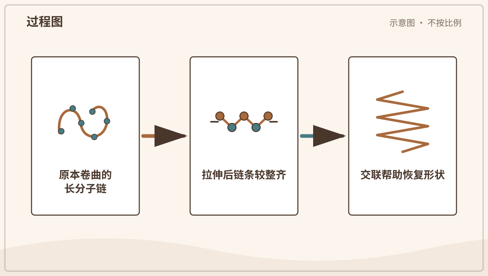

*图解：橡胶长分子链被拉直排列后，热运动和交联会促使它们回到卷曲状态。*

**一起看看：** 轻拉厚而完整的安全橡胶件，不使用细小皮筋弹射。

---

### 第 331 问｜陶瓷为什么要放进窑里烧？

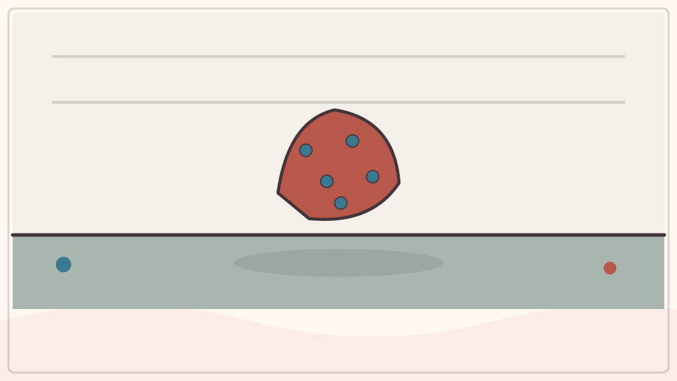

湿黏土由细小矿物颗粒和水组成，能塑形。干燥先去掉孔隙中的水，高温烧制再让颗粒发生化学和结构变化、彼此结合，变成坚硬陶瓷。烧成后不能加水变回泥。

**再想一步：** 烧结会减少孔隙，釉料熔化后形成玻璃质表面。升温太快或厚薄不均会让水汽和热应力造成裂纹，所以窑烧要按材料控制温度过程。

**把知识连起来：** 黏土颗粒加水后可滑动并被塑形，干燥只移走孔隙水，作品仍可重新吸水变软；窑烧时矿物脱水、反应并在高温下烧结或部分玻璃化，颗粒牢固结合，形成坚硬多孔或致密陶瓷。釉料熔融后形成玻璃质表面。烧成是难以逆转的材料变化。

**再往外看：** 不同陶土、釉和温度决定吸水率、热膨胀与强度；器物还要避免釉和坯体收缩不匹配。

**容易弄混：** 窑不是把普通泥巴简单烤干，家用烤箱也不能达到或安全替代陶瓷烧成条件。成品坚硬仍可能脆裂，制作须由专业大人操作。

**一起看看：** 比较未烧黏土和成品陶杯，只触摸已经冷却的安全物件。

---

### 第 332 问｜一根根线怎样变成布？

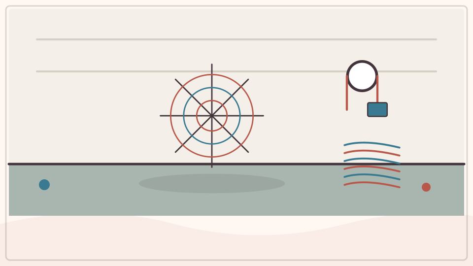

织布时，一组经线纵向绷紧，另一组纬线横向穿过，交错锁在一起。针织则让线圈一个套一个。纤维、纱线和结构共同决定布的软硬、弹性与透气。

**再想一步：** 棉、羊毛、丝和合成纤维的表面、吸水和强度不同；同一种纤维换织法也会产生完全不同的布。材料性质来自尺度层层组合。

**把知识连起来：** 棉、羊毛或合成材料先形成细长纤维，许多纤维加捻成为连续纱线；织造把经纱和纬纱交错，针织则让一根或多根纱形成相扣线圈。纤维性质、纱线捻度和组织结构共同决定布的强度、弹性、透气与手感。无纺布还可直接黏合或缠结纤维。

**再往外看：** 放大观察牛仔布、T 恤和毛毡，会看到斜纹、针织圈和随机纤维网三种不同结构。

**容易弄混：** 布不是把一根线压扁，也不是所有织物都由横竖两组线编成。剪散边缘和拉伸方向能提供线索，但针线工具由大人保管。

**一起看看：** 用放大镜观察毛巾、T 恤和毛衣，找交叉线或线圈。

## 追问链 31.3｜洗衣机与吸尘器

旋转、搅动和压强差帮助水、空气与污物移动。

### 第 333 问｜洗衣机为什么要转来转去？

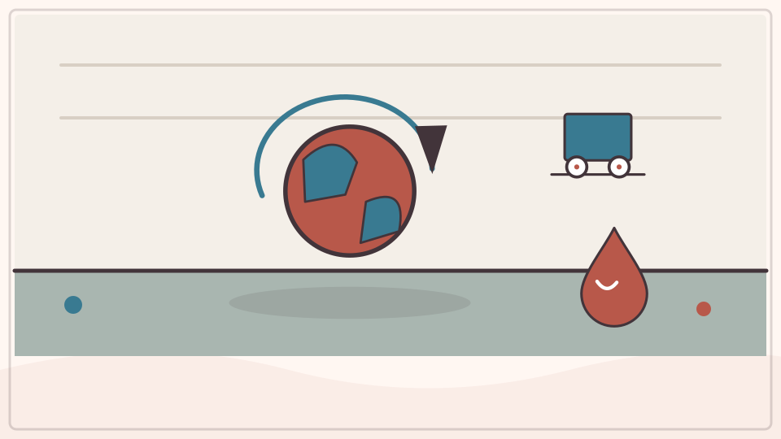

洗衣机让衣物在水和洗涤剂中翻动，弯折、碰撞和水流帮助污物松开。漂洗会换走含污物的水。脱水时滚筒高速旋转，让水穿过小孔离开衣物。

**再想一步：** 旋转中的衣物需要向心力才能沿圆周走，滚筒壁提供这个力；水若不再被充分约束，会沿切线和孔道离开。衣物分布不均会造成震动。

**把知识连起来：** 洗衣机让水和洗涤剂进入纤维，转筒翻滚使衣物弯曲、摩擦并反复浸出污物；洗涤剂包围油脂和颗粒，漂洗再带走它们。脱水时内筒高速转动，衣物随筒壁做圆周运动，水则经孔洞沿切线方向离开。各阶段使用的是不同机械作用。

**再往外看：** 滚筒与波轮机的水量和运动方式不同，温度、程序和装载量要匹配纤维与污渍。过滤装置并不能截住所有微纤维。

**容易弄混：** 脱水不是离心力把水神秘吸到外面；从惯性参考系看，筒壁没有继续给水足够向心力。儿童不能钻入、攀爬或在运行时触碰机器。

**一起记住：** 不攀爬、不钻入洗衣机，运行和开门都听大人安排。

---

### 第 334 问｜吸尘器怎样把灰尘收进去？

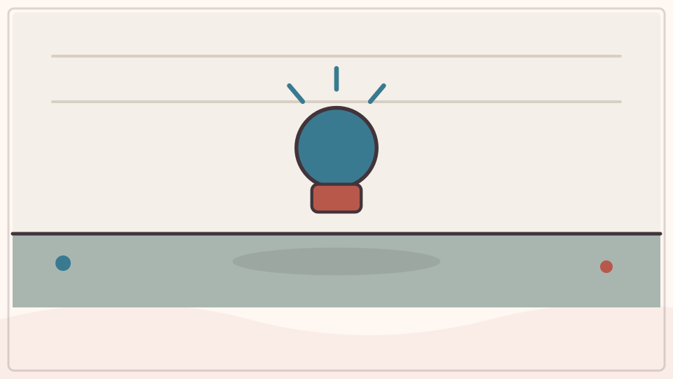

电动机带动风扇，让机内一处压力降低。周围空气便从吸口流入，高速气流也带着灰尘进入。过滤材料留下颗粒，空气再从另一处排出。

**再想一步：** 吸力受压力差、气流量、管道阻力和密封影响；滤网堵塞会让流量下降。细颗粒需要合适过滤，不能只看大灰尘是否被捡起。

**把知识连起来：** 电动机带动风机，使吸尘器内部某处压强低于周围；外界较高气压推动空气经吸头和管道流入，气流卷起能被带动的尘粒。尘袋、滤网或旋风分离器让颗粒离开气流，较干净空气再排出。密封、流量和压差共同决定效果。

**再往外看：** 粗大物、地毯深层粉尘和微小颗粒需要不同吸头与过滤等级；滤网堵塞会减少流量并使电机负担增加。

**容易弄混：** 吸尘器不是制造一种向内的“吸力物质”，也不能吸走所有黏住或过重的东西。液体、尖物和未知粉末能损坏设备或扬尘，只由大人按说明处理。

**一起看看：** 只观察大人清洁后的空尘盒结构，远离插头和旋转刷头。

## 单元综合观察｜比较材料，但保留例外

由大人准备木、金属、纸、布和塑料安全物品，只比较触感、弯曲和吸一小滴水三项。记录具体样品，不把结果推广为所有同类材料都一样。
