# 兴趣单元 32｜运动、车辆、船与飞行

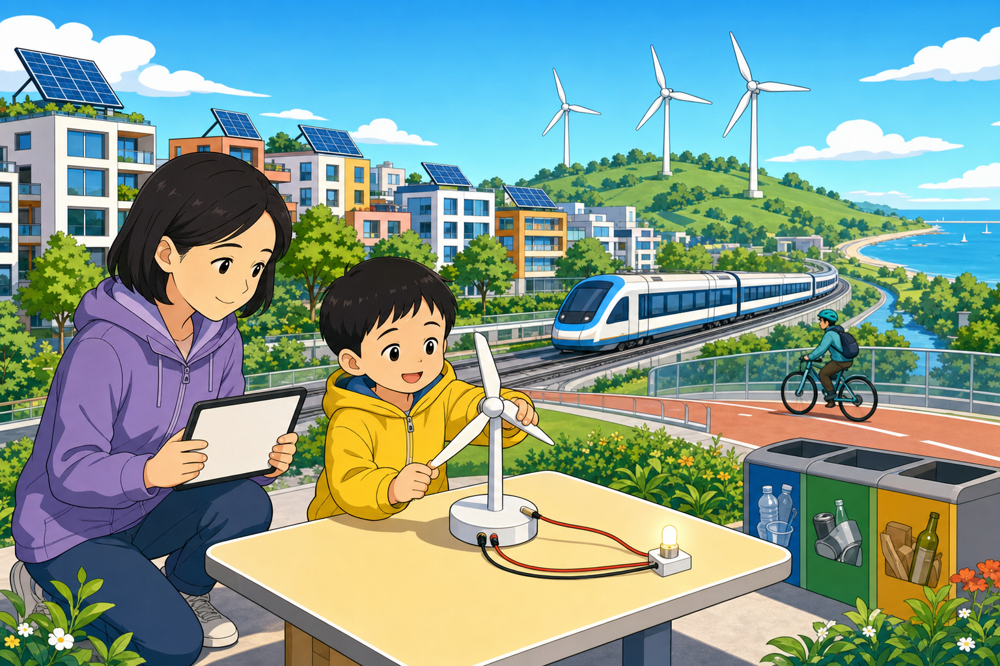

> **探索领域 12：** 运动、交通、能源与环境
>
> **核心问题：** 人和交通工具怎样保持平衡、加速、制动、浮沉并在空气或水中运动？

从走路和自行车的动态平衡进入驱动、刹车与信号控制，再比较火车、地铁、船、飞机、直升机、热气球和潜水艇。

## 怎样沿着本单元的追问链阅读

每次列出重量、支持力、摩擦、浮力或流体作用中真正相关的力，不用一个“动力”词替代全部机制。

## 追问链 32.1｜平衡、驱动、制动与交通控制

身体和车辆持续调整运动，驱动与摩擦改变速度，安全带和信号系统降低风险。

### 第 335 问｜走路时为什么不会一直倒下？

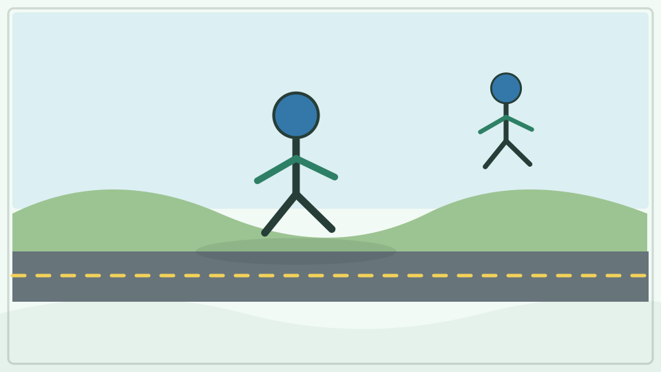

走路其实是一连串受控制的向前倾倒。身体重心移到支撑脚前方，另一只脚及时迈出接住身体。眼睛、内耳、神经和肌肉不断修正平衡。

**再想一步：** 地面对脚的支持力和摩擦力让我们能向前推，手臂摆动帮助抵消腿部旋转。刚学走路的孩子步子宽、手臂高，是在用更大支撑范围提高稳定性。

**把知识连起来：** 走路不是把身体始终固定在双脚正上方，而是让重心向前越过支撑区域，再及时迈出下一只脚接住身体。脚踝、膝、髋和摆动手臂调整力与角动量，内耳、眼睛和肌肉感觉持续报告姿势。神经系统依据误差快速修正，形成一次次受控制的前倾与恢复。

**再往外看：** 幼儿学步、老人步态和在冰面行走会采用不同步宽与速度，机器人双足行走也要解决动态稳定问题。

**容易弄混：** 人不会因为有两条腿就天然永不摔倒，站稳与走稳的控制也不同。失衡时迈步不是失败，而是身体恢复支撑的正常策略。

*图解：身体重心越过支撑脚后，另一只脚向前接住；感官和肌肉持续修正。*

**一起走走：** 在安全直线上慢走、快走各几步，比较步幅和手臂。

---

### 第 336 问｜自行车只有两个轮子，为什么不倒？

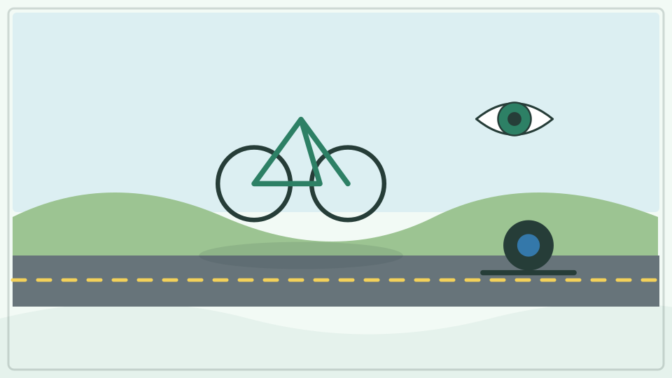

骑车人和车会不断做小小的转向，把车轮移到重心下方。车轮旋转和前叉几何也帮助转向稳定，但不是只靠“陀螺力”。车停得很慢时，更难及时修正。

**再想一步：** 自行车平衡是人、速度、转向和车架共同形成的动态控制。向左倾时略向左转，支撑点移到左边，便能产生扶正效果。

**把知识连起来：** 自行车前进时，车身稍向一侧倾斜会通过前叉几何、轮胎接触和骑手转动车把产生朝同侧的弯道，把支撑点重新移到重心下方。轮子的陀螺效应会参与稳定，但不是唯一原因；能转向和不断微调更关键。速度太慢或前轮被锁住时，修正更难。

**再往外看：** 无人自行车模型也能在合适几何与速度下短暂自稳，说明稳定来自整套机械反馈，而不只来自骑手技巧。

**容易弄混：** 两个旋转轮不会自动保证不倒，停住的自行车仍需脚或支架支撑。儿童骑行必须使用合适车辆、头盔和安全场地并由大人看护。

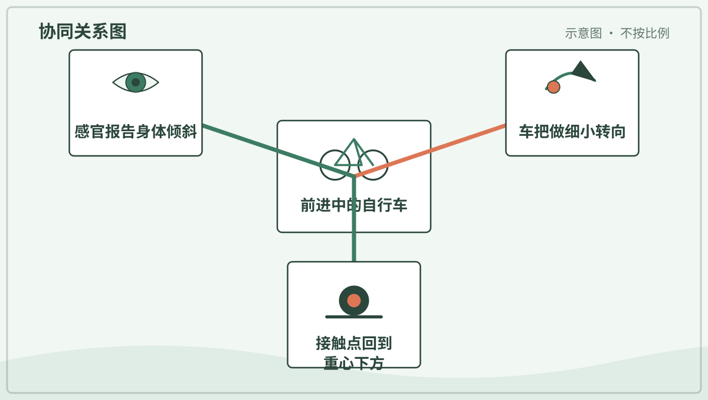

*图解：骑行者通过细小转向把轮胎接触点移到重心下方，持续恢复平衡。*

**一起记住：** 学骑车戴合适头盔，在封闭安全场地由大人陪同。

---

### 第 337 问｜汽车怎样让轮子转起来？

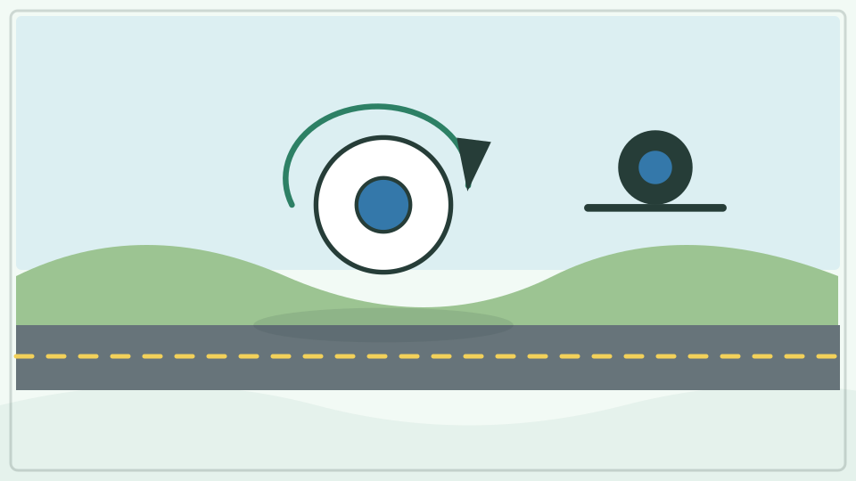

燃油车的发动机把燃料化学能经燃烧变成轴的转动，电动车的电机把电能变成转动。传动系统再把转矩送到驱动轮。轮胎向后推地面，地面的摩擦力便把车向前推。

**再想一步：** 车并不是轮子直接“抓住空气”向前。静摩擦在轮胎不打滑时传力；加速所需能量还要克服滚动阻力、空气阻力并增加车辆动能。

**把知识连起来：** 燃油汽车让发动机内燃烧产生的高压气体推动活塞，经曲轴和变速器把旋转传到车轮；电动车则由电池供电给电动机，再经减速机构驱动车轮。轮胎向后推地面，地面对轮胎的静摩擦向前推动汽车。控制器还根据踏板、速度和抓地状态调节转矩。

**再往外看：** 混合动力车组合发动机、电机与能量回收，不同驱动布局会把动力送到前轮、后轮或四轮。

**容易弄混：** 车轮不是被发动机从前方拉着滚，发动机也不会直接接触地面。即使能转动车轮，冰面摩擦不足时汽车仍难以前进。

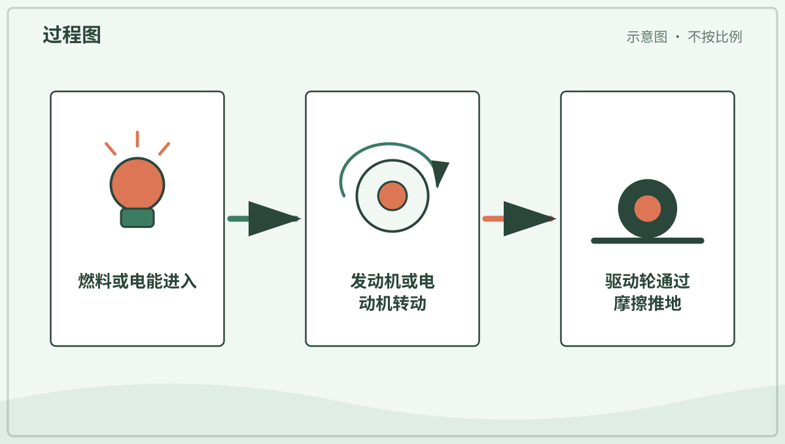

*图解：发动机或电动机产生转矩，传动系统把转矩送到驱动轮，轮胎再推动车辆。*

**一起看看：** 只在停车安全处由大人指认轮胎和驱动系统，不钻车底。

---

### 第 338 问｜刹车怎样让车停下？

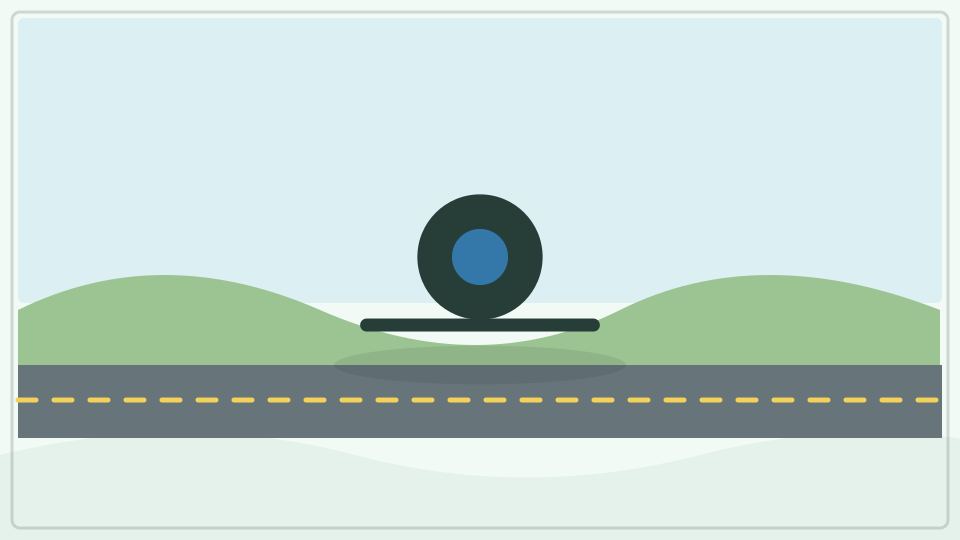

刹车片夹住刹车盘，摩擦把车轮的运动能量转成热。轮胎再靠与地面的摩擦减慢车辆。路面湿滑时能提供的摩擦较小，停车距离会变长。

**再想一步：** 防抱死系统快速调节制动力，避免车轮完全锁死，帮助保留转向和有效摩擦。车辆速度越高，动能按速度平方增加，所以多一点速度会增加很多制动能量。

**把知识连起来：** 踩下刹车后，液压或电控系统让刹车片夹住制动盘，摩擦把车轮和车辆的运动能量转成热；轮胎与地面的摩擦再提供让整车减速的外力。防抱死系统快速调节制动力，避免车轮长时间完全滑动并保留部分转向能力。速度越高，需消散的动能增长得更快。

**再往外看：** 电动车还能先用电机发电回收部分能量，但低速、紧急或电池不能接收时仍需摩擦制动。雨雪、轮胎和载重会改变停车距离。

**容易弄混：** 刹车不是按下就让车瞬间停止，也不是轮子锁死一定停得最快。行人不能用自己身体试验距离，过路应按交通规则预留安全余量。

**一起记住：** 过马路不能用耳朵猜车能马上停，始终按交通规则和大人指引。

---

### 第 339 问｜安全带为什么能保护人？

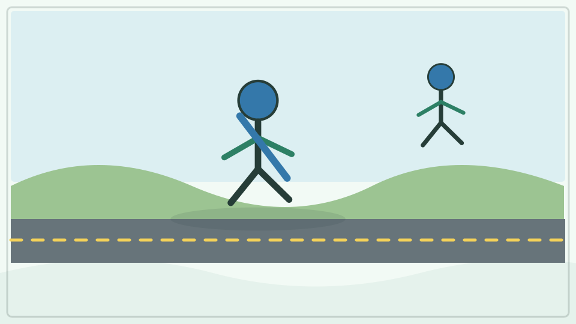

车突然停下时，身体因惯性仍想继续向前。安全带把停下的力分散到胸部和骨盆较结实部位，并延长减速时间。儿童还需要与身高体重相配的安全座椅。

**再想一步：** 同样的速度变化若用更长时间完成，平均加速度和力会较小。安全气囊是补充装置，不能代替安全带；错误坐姿会削弱保护。

**把知识连起来：** 碰撞时汽车速度骤降，人的身体因惯性仍会向前；安全带约束骨盆和胸部，让人随车更长时间减速，从而降低平均作用力，并把力分散到较能承受的部位。预紧器收紧松弛，限力器和安全气囊共同管理负荷。正确坐姿与带路决定保护效果。

**再往外看：** 儿童身体比例不同，需要与身高体重相符的安全座椅或增高垫；具体使用必须遵循产品说明和当地法规。

**容易弄混：** 安全带不是把人牢牢粘住所以绝对不受伤，也不能夹在腋下或身后图舒服。气囊不能代替安全带，儿童座位安排由大人严格确认。

*图解：急停时身体因惯性继续向前；安全带延长减速时间，并把力分散到较强部位。*

**一起记住：** 每次乘车都由大人检查安全座椅和安全带，不自行解开。

---

### 第 340 问｜红绿灯怎么知道该换颜色？

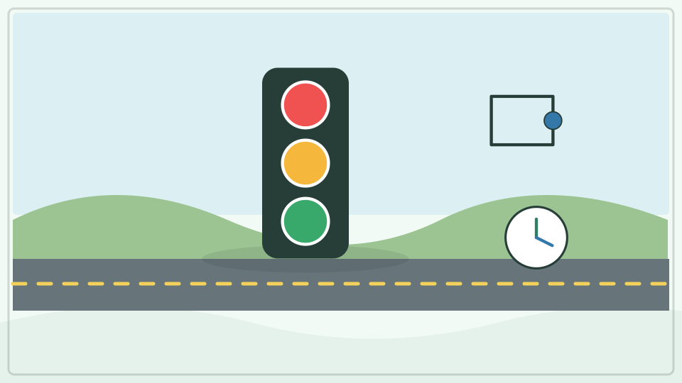

有些信号灯按预先设置的时间循环，有些还用地面线圈、摄像头或按钮检测车辆和行人。控制器协调不同方向，避免冲突车流同时通过。颜色是大家共同遵守的信号。

**再想一步：** 交通控制要在安全、等待时间和道路容量之间平衡，复杂路口还会联网调整。传感器也可能看漏或故障，所以规则、观察和维护同样重要。

**把知识连起来：** 有些路口按预设时段循环，有些用埋地线圈、雷达、摄像机或行人按钮检测需求，控制器再按安全规则分配通行时间。相冲突方向之间会留清空时间，复杂系统还会与相邻路口协调。传感器提供的是车辆或行人存在等数据，不一定能理解完整情境。

**再往外看：** 公交优先、紧急车辆优先和自适应信号能改变周期，但都要在防止冲突的约束下运行。

**容易弄混：** 红绿灯不一定在盯着某一辆车后凭心情换色，按按钮也通常不会立刻变绿。任何传感系统都可能漏检，过街仍要观察并遵守信号。

**一起看看：** 在安全位置和大人数完整个信号周期，不因绿灯就立刻冲出。

## 追问链 32.2｜轨道、浮力、帆、翼与压载舱

钢轨约束方向，排水产生浮力，空气动力和密度差支持多种飞行与潜航。

### 第 341 问｜火车为什么爱走钢轨？

钢轮在钢轨上变形较小，滚动阻力低，能用较少能量拉动很重的列车。轮缘和轮面形状帮助车辆沿轨道前进。轨道也把载荷分给枕木和地基。

**再想一步：** 低阻力让火车高效，却也使制动距离较长，无法像汽车随意绕开障碍。车轮略带锥度，左右偏移时滚动半径差会帮助列车回到中间。

**把知识连起来：** 钢轮在钢轨上滚动变形小，滚动阻力低，轨道还精确规定行进方向并把巨大载荷传给枕木和路基。轮缘在需要时帮助限制横向脱轨，锥形踏面则能让轮对在曲线上自动调整滚动半径。列车因此高效，却不能主动绕开障碍。

**再往外看：** 弯道半径、轨距、道岔和信号系统共同决定列车能去哪里与多快，维护会检查钢轨磨耗和几何偏差。

**容易弄混：** 普通火车不是被钢轨像磁铁一样吸住，也不是只靠轮缘一直摩擦导向。铁路区域危险且有电气风险，只能在规定位置观察。

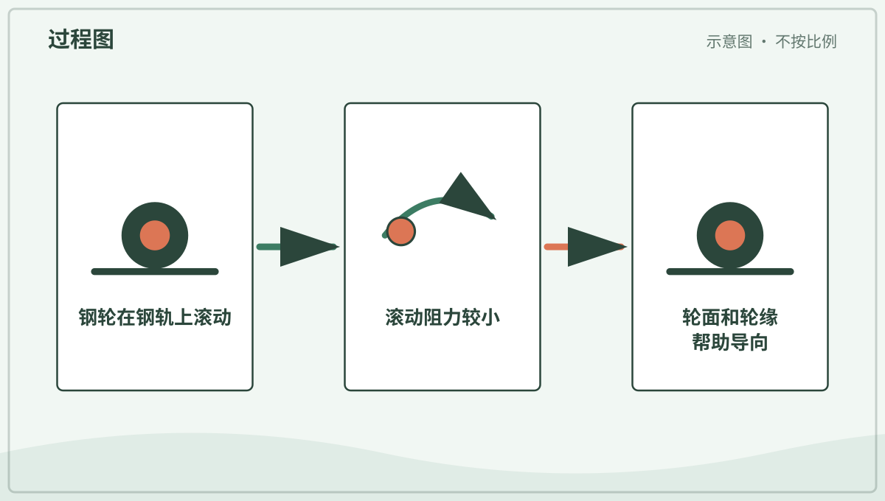

*图解：钢轮在钢轨上滚动阻力较小；轮缘和略带锥度的轮面帮助列车沿轨道。*

**一起记住：** 铁轨和站台边缘都是危险区域，只在规定地点听从大人。

---

### 第 342 问｜地铁从哪里得到电？

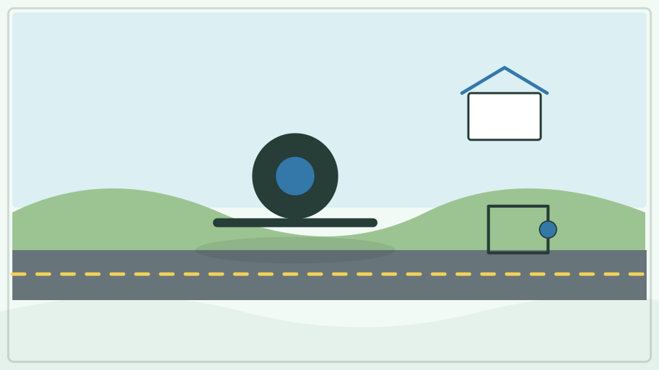

电气化列车从第三轨或架空线取得电能，变流设备调节后送给牵引电动机。电机带动车轮，列车便前进。车站照明、通风和信号也需要电。

**再想一步：** 刹车时，一些列车让电机反过来像发电机，把部分运动能量送回电网或供其他设备使用，这叫再生制动。仍有能量会变成热。

**把知识连起来：** 电气化地铁从接触轨或架空线取得电能，经车辆上的变流器调节后送给牵引电机；电流再通过车轮、钢轨或专用回路返回供电系统。沿线变电站把电网电压转换成线路需要的电压。制动时，一些列车可把电能送回线路或储能装置。

**再往外看：** 车站照明、通风、信号和列车牵引可能由不同回路与备用电源保障，停电应急并非只有一只电池。

**容易弄混：** 地铁不是从隧道空气中取电，第三轨也不是普通轨道。站台和轨行区可能有致命高压，掉落物品绝不能自行捡取。

**一起记住：** 不触碰轨道、电线或设备柜，站在安全线内等车。

---

### 第 343 问｜钢做的大船为什么能浮？

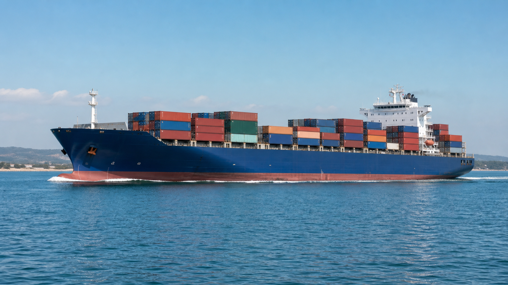

*写实观察图：船体浸入水中的部分排开海水；是否能浮由整艘船的质量与排水体积共同决定。*

船壳虽然由密度比水大的钢制成，内部却有大量空气。整艘船的平均密度可以小于水，并排开足够重量的水，浮力便托住它。装货太多会让船下沉更深。

**再想一步：** 阿基米德原理说，浮力等于物体排开流体的重量。船体形状还要保持稳性，让倾斜后浮力作用位置产生扶正力矩。

**把知识连起来：** 钢的密度大于水，但船壳围出大量空气空间，使整艘船的平均密度足够低；船下沉到排开与自身总重量相等的水时，浮力达到平衡。宽阔船体还要让重心和浮心关系提供稳定性，压载水用于调整吃水与姿态。隔舱能限制局部进水扩散。

**再往外看：** 装货越多，船需排开更多水，吃水线就更低；海水密度和载荷分布也会改变安全余量。船级规范会验证结构和稳性。

**容易弄混：** 钢船不是因为里面有空气就绝对不会沉，进水、超载或货物移动都可能破坏浮力与稳定。剖面图会省略大量结构，不能据此模仿造船下水。

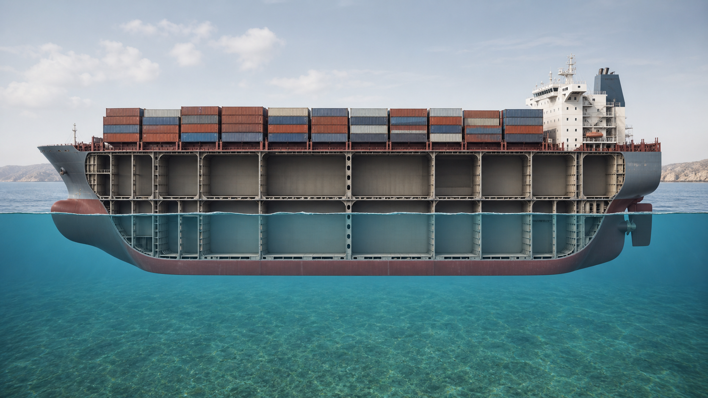

*写实原理图：空心船体在吃水线下排开海水；内部结构和水下透明效果为解释性处理，不按比例。*

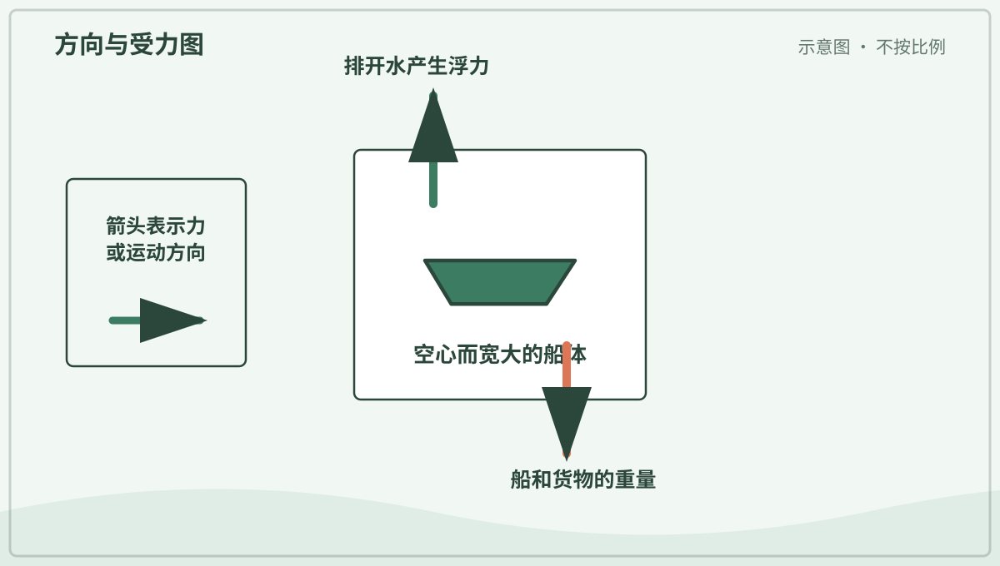

*图解：空心船体排开大量水；排水产生的浮力等于船重时，大船便稳定漂浮。*

**一起试试：** 用同量黏土先捏实球再捏空碗，由大人在水盆比较浮沉。

---

### 第 344 问｜帆船怎样迎着风前进？

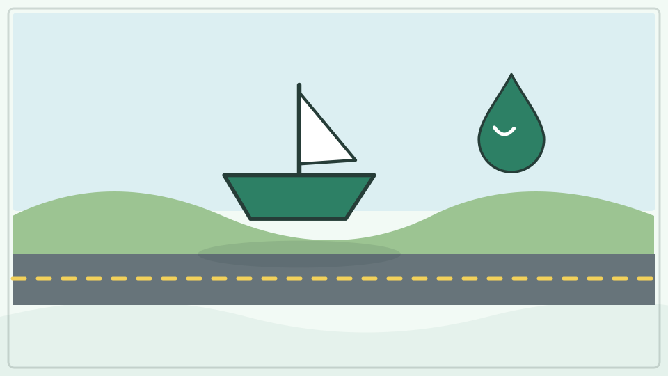

帆像翼一样改变气流，产生不只顺风方向的力。船底的龙骨或稳向板抵抗侧滑，把一部分力变成向前运动。帆船不能正对风直行，却能斜着走“之”字。

**再想一步：** 帆两侧压力差和气流转向共同产生空气动力，水下结构提供相反侧向力。改变帆角和航向，就是调整两种流体里的受力平衡。

**把知识连起来：** 帆像竖直翼面，风流过弯曲帆面时产生大致垂直于相对风的空气动力；其中向前的分量推动船，向侧的分量由龙骨或中央板与水的作用抵抗。船不能正对风直行，却可沿斜向航线交替转向，之字形逆风前进。帆角要随风向不断调整。

**再往外看：** 真实航行使用的是船相对空气感到的视风，它由自然风与船速合成；船体阻力和浪况决定最佳角度。

**容易弄混：** 帆船逆风不是帆把迎面风兜住后反弹，也不是能笔直冲向风源。水上风向变化快，儿童只能在合格救生装备和专业看护下活动。

*图解：斜着的帆受到空气合力，水中的龙骨抵抗侧滑，剩下的分力推动船前进。*

**一起看看：** 在图上画出风向，再画帆船左右交替的之字路线。

---

### 第 345 问｜飞机那么重，怎样离开地面？

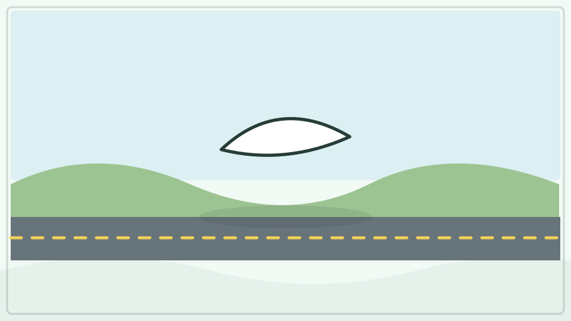

发动机提供推力，让机翼快速穿过空气。机翼的形状和迎角把空气向下偏转，同时形成压力分布，产生向上的升力。升力大到足以克服重量，飞机便起飞。

**再想一步：** 不能只用“上面路长，所以空气必须同时到达”解释升力；空气并没有这种同时到达规则。牛顿动量变化和压力场是同一受力过程的两种描述。

**把知识连起来：** 飞机向前运动时，机翼形状与迎角让空气向下偏转，并在翼面周围形成压力分布，合力中向上的部分称升力。发动机提供推力克服阻力，升力与重量、推力与阻力随飞行状态不断调整。速度太低或迎角过大时，气流可能分离并失速。

**再往外看：** 襟翼在起降时改变翼形以增加低速升力和阻力，机身、尾翼与自动控制系统则维持姿态和方向。

**容易弄混：** 飞机不是只因机翼上面路长、空气必须同时到达而被吸上去，也不是发动机单独把整架飞机托起。纸飞机只能演示部分气动现象，不能代表客机全部结构。

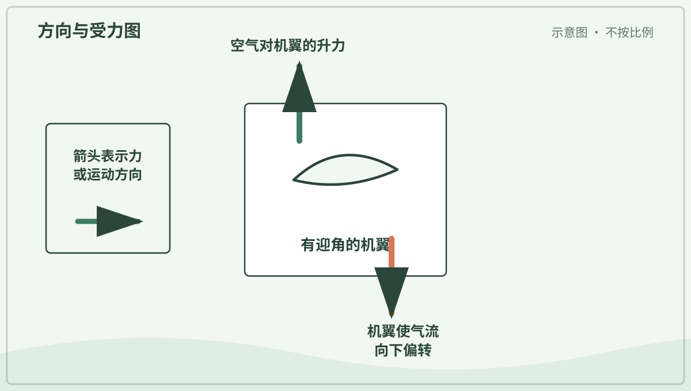

*图解：机翼改变空气的速度和方向；压力分布与向下偏转的气流共同产生升力。*

**一起看看：** 观察飞机起飞时襟翼、速度和抬头角度怎样变化。

---

### 第 346 问｜直升机为什么能停在空中？

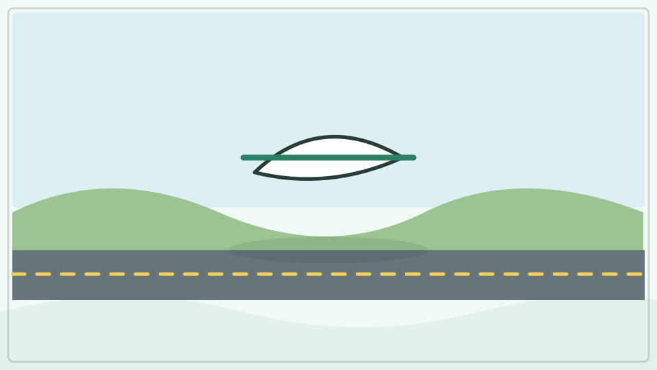

直升机的旋翼像不断转动的长机翼，把空气向下加速，产生向上升力。改变每片桨叶角度，可以上升、下降或向某方向倾斜飞行。尾桨或其他旋翼抵消机身扭转。

**再想一步：** 主旋翼受发动机转矩时，机身会受相反转矩；单旋翼直升机用尾桨提供反扭矩。悬停持续需要功率，因为空气必须不停获得向下动量。

**把知识连起来：** 直升机旋翼的每片桨叶都是旋转的机翼，快速扫过大面积空气并把气流向下加速，产生向上作用力。总距控制整体升降，周期变距让旋翼盘向某方向倾斜以水平飞行；主旋翼转矩还需尾桨或其他反扭矩设计平衡。悬停时同样持续消耗很大功率。

**再往外看：** 共轴双旋翼、双旋翼和倾转旋翼用不同结构抵消转矩并转换飞行模式。高温、高海拔和载重会降低悬停能力。

**容易弄混：** 旋翼不是像螺丝拧进空气后挂住，停在空中也不表示没有运动。旋翼下洗和桨尖极危险，必须远离真实起降区。

*图解：旋翼像不断旋转的机翼，把大量空气加速向下，反作用力托起直升机。*

**一起记住：** 远离起降区，旋翼转得快时可能几乎看不清，仍极危险。

---

### 第 347 问｜热气球为什么会上升？

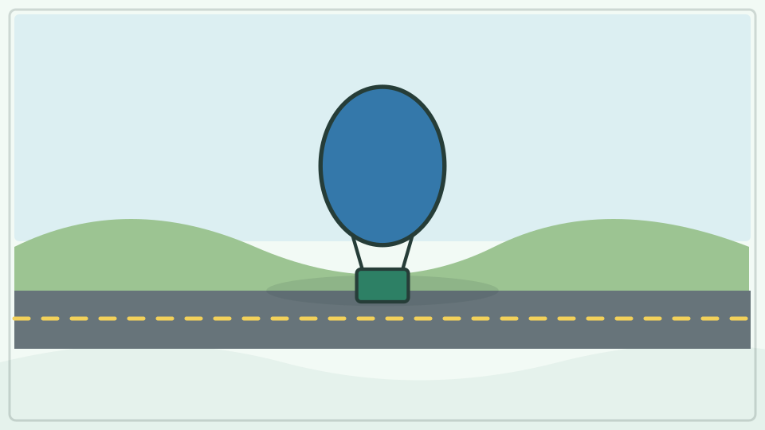

加热球囊里的空气后，空气会膨胀，一部分从开口流出。这样，球囊内空气的平均密度变小。热气球排开的外界空气比自身总重量更重时，净浮力就让它上升。

**再想一步：** 冷却或放出热空气会降低浮力。热气球主要随不同高度的风移动，驾驶员通过升降寻找方向合适的风层，不能像飞机一样自由朝任意方向飞。

**把知识连起来：** 气囊里的空气被燃烧器加热后膨胀，在开放气囊中部分空气逸出，使内部空气平均密度低于外界；气球排开较重的冷空气，浮力超过总重量时上升。停止加热或打开顶部排气口可下降，飞行员主要借不同高度的风改变水平路线。

**再往外看：** 冷空气球和充氦气球也靠密度差获得浮力，但气体、控制与安全条件不同。载荷、气温和气囊体积决定可升重量。

**容易弄混：** 热气球不是靠热气一直向上冲，也通常不能像汽车一样任意转向。明火、风和电线使其必须由持证人员在合适天气操作。

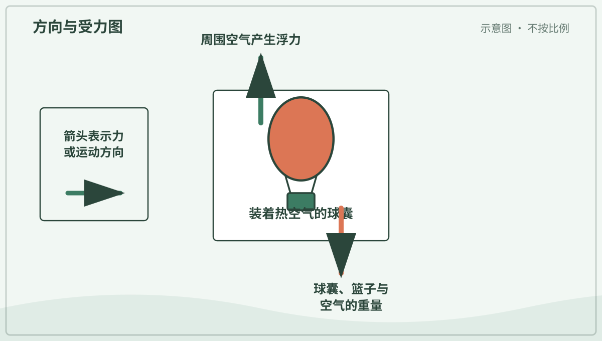

*图解：球囊里的热空气密度较低；排开冷空气产生的浮力超过总重量时便上升。*

**一起看看：** 比较热气球、氦气球和普通吹气气球，浮力来源哪里不同。

---

### 第 348 问｜潜水艇怎样沉下去又浮上来？

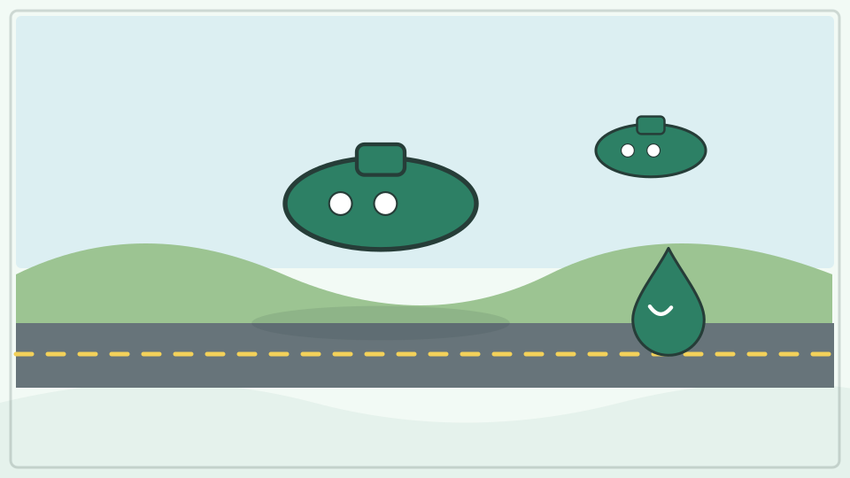

潜艇有压载舱。让海水进入时，总质量增加，平均密度变大，潜艇下潜；用压缩空气排出水后，质量减小，就能上浮。水翼帮助在前进中控制深度和姿态。

**再想一步：** 潜艇还用调节水舱精确达到近似中性浮力，让浮力与重量接近。坚固耐压壳承受深水压力，形状和材料都有严格限制。

**把知识连起来：** 潜水艇的压载舱进水时总质量增加、平均密度上升，可获得向下趋势；用高压空气排出压载水后，平均密度降低并上浮。航行中，水平舵面像水下机翼产生升降力，配合调节水舱保持深度和姿态。耐压壳承受海水压差，外形壳则改善流动。

**再往外看：** 现代潜艇常把浮力调到接近中性，再用小幅控制高效潜航；救生和冗余系统与普通船不同。

**容易弄混：** 潜艇不是把舱里所有空气放掉让人泡在水中，也不是装满水就能安全无限下潜。结构有设计深度，相关装置不可自行模仿。

*图解：压载舱进水会增加潜艇平均密度使其下沉；排水充气则使它上浮。*

**一起看看：** 用有盖塑料滴管做安全浮沉子实验，由大人全程操作小物件。

## 单元综合观察｜给交通工具画一张受力图

选择静止的玩具车、纸船或交通照片，标出重力与支撑或浮力，再按正文添加必要的推进或阻力。不要在道路、水边或运行车辆旁观察。
