# 兴趣单元 33｜能源、气候与生命系统

> **探索领域 12：** 运动、交通、能源与环境
>
> **核心问题：** 能量怎样转换和输送，材料与碳又怎样在技术和生态系统中循环？

太阳能、风能、水能、电网、照明与保温先建立能量链，回收、堆肥、碳循环、温室效应和生物多样性再展示自然与社会系统的边界。

## 怎样沿着本单元的追问链阅读

不把可再生理解为无限，也不把复杂环境问题归咎于孩子个人；讨论证据、尺度和共同选择。

## 追问链 33.1｜能源转换、输送与节约

能源来源有时间与空间限制，发电装置转换能量，电网输送，效率减少浪费。

### 第 349 问｜能源会不会用完？

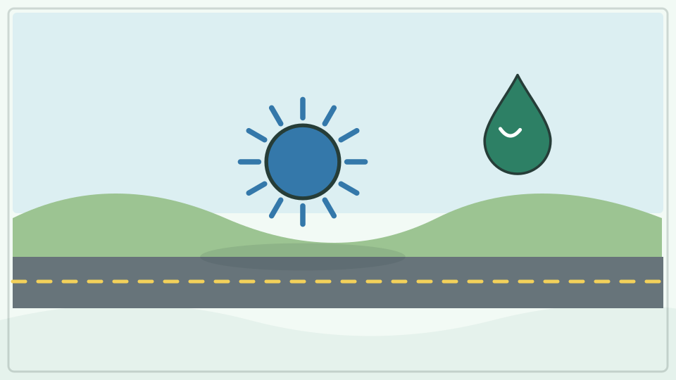

煤、石油和天然气形成极慢，人类使用速度远快于补充，叫不可再生能源。阳光、风和流水会持续得到自然补充，叫可再生能源。所有能源设施都需要材料和土地。

**再想一步：** 能量不会凭空消失，但会转成更分散、较难再利用的形式；真正会短缺的是方便取得的能源资源和转换能力。比较能源要看全生命周期、可靠性与环境影响。

**把知识连起来：** 能量总量按物理规律守恒，但适合人类使用的高品质能源载体、设备和环境承受能力会有限。煤、石油和天然气形成速度远慢于消耗，属于不可再生资源；太阳、风和流水可持续补给，却受时间、地点、储能和材料限制。提高效率与减少不必要需求同样重要。

**再往外看：** 能源系统要比较可用功率、全生命周期排放、土地材料、可靠性与成本，不能只用“会不会耗完”一个指标。

**容易弄混：** 说能量不会消失，不等于汽油烧完还能原样使用；它多转成分散热量，难以全部重新做功。可再生也不等于没有任何环境影响。

**一起看看：** 找出家中三件用电物品，想想电在到家前可能从哪里来。

---

### 第 350 问｜太阳能板怎样把光变成电？

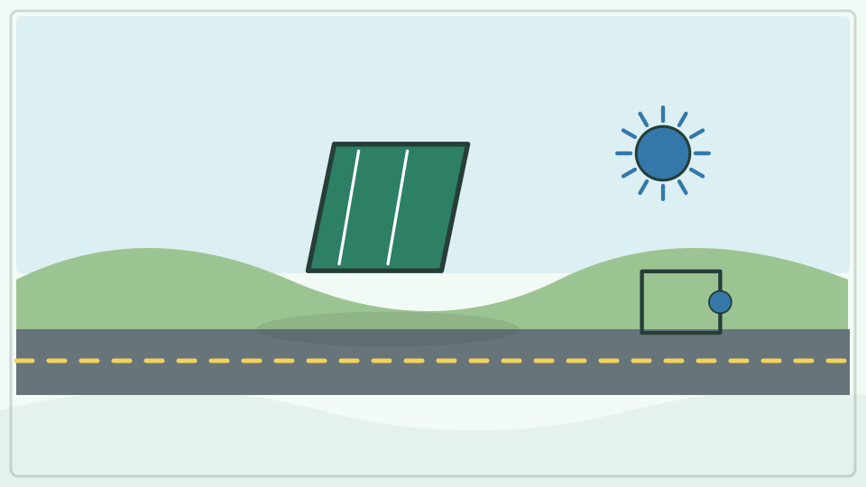

太阳能电池通常用半导体制成。光子把材料中的电子推到较高能量状态，内部电场把电荷向不同方向分开；接上回路后就形成电流。这叫光伏效应。

**再想一步：** 面板不能把全部阳光变成电，一部分被反射或变成热。光照角度、温度、遮挡、逆变器和储能都会影响系统输出。

**把知识连起来：** 太阳能电池的半导体具有特定能带结构，光子被吸收后可产生能移动的电子和空穴；内部电场把它们向不同方向分开，接上电路便形成电流和电压。多个电池片串并联组成组件，逆变器再把直流电变为电网常用交流电。温度、遮挡与光照角度影响输出。

**再往外看：** 不同半导体可吸收不同波长，实验室多结电池效率很高，而屋顶系统还要权衡成本、耐久和安装条件。

**容易弄混：** 太阳能板主要不是把热直接变成电，阴天也不是完全没有输出。板上仍可能有危险电压，安装和清洁由专业人员完成。

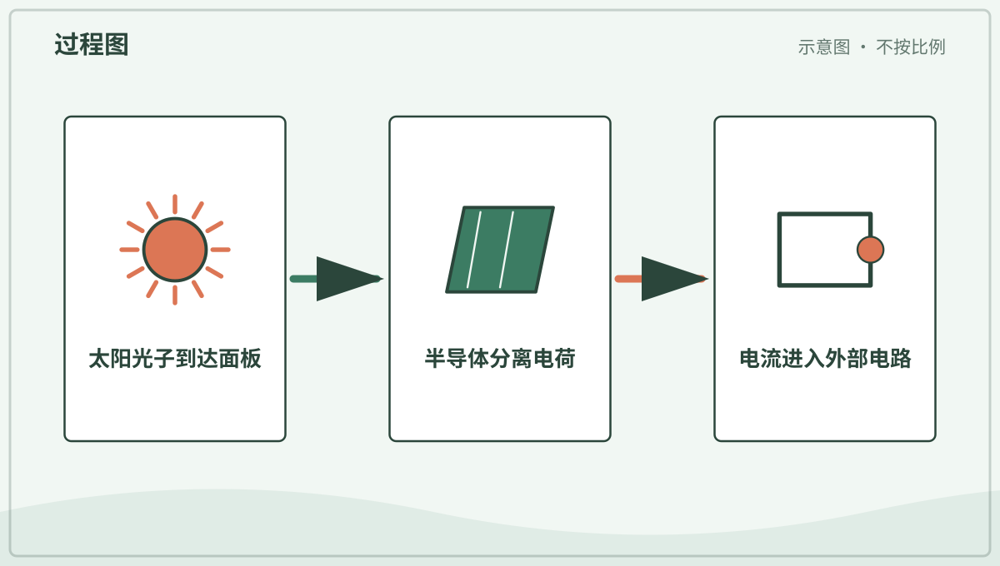

*图解：半导体吸收光子后分离电荷，电极收集电荷并让电流流过外部电路。*

**一起看看：** 观察安全小太阳能玩具在明处和阴影中的速度变化。

---

### 第 351 问｜风力发电机为什么有长叶片？

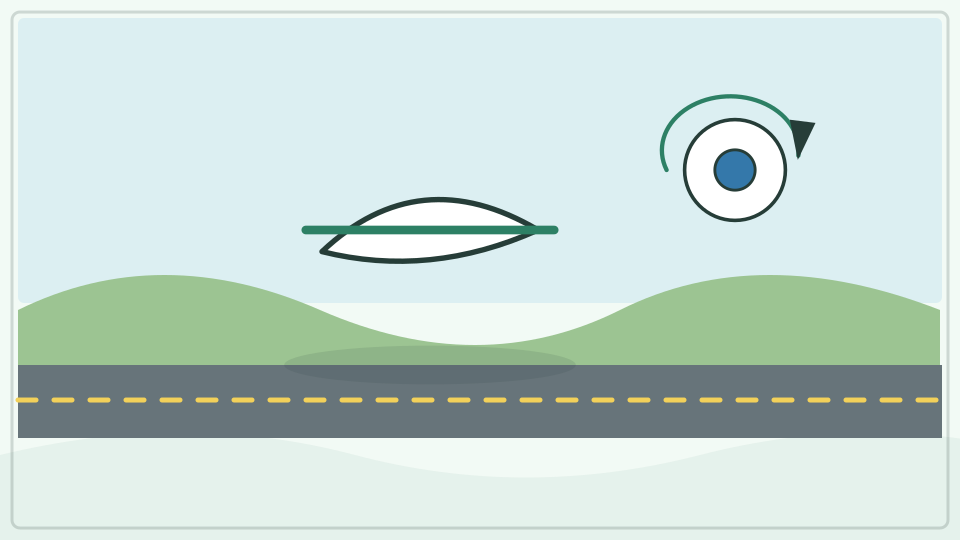

风经过叶片时产生升力，让转子转动，发电机把机械能变成电能。长叶片扫过更大面积，能接触更多流动空气。控制系统会调整叶片角度和机舱方向。

**再想一步：** 风中可利用功率随风速大约按三次方增加，但太强风会超过结构安全范围，需要停机。叶尖速度、噪声、鸟类迁徙和电网接入都要评估。

**把知识连起来：** 风穿过叶轮扫过的面积时带有动能，长叶片能覆盖更大圆面并截取更多风能；翼型叶片产生转矩，经轴和发电机转成电能。叶尖速度很高，材料要同时轻、强并能抵抗反复弯曲。变桨和偏航系统在风变大或转向时调节受力。

**再往外看：** 三片叶是在效率、平衡、噪声、重量和制造成本间常见折中，并非物理上唯一选择。海上机组可做得更大，因为运输与风况不同。

**容易弄混：** 叶片长不是风越大就无限转得越快，控制系统会限功率或停机。风机也不是凭空取走所有风，理论和工程效率都有上限。

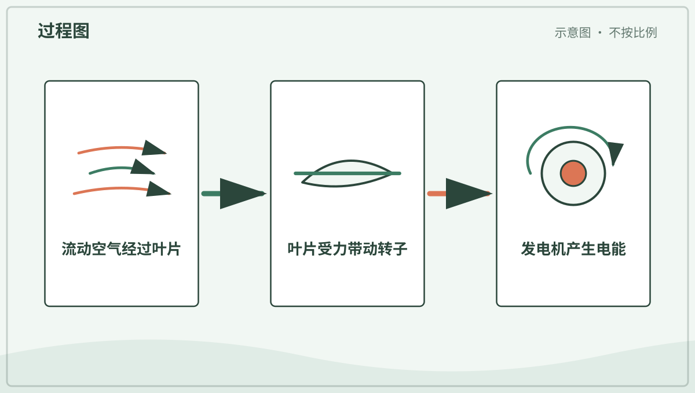

*图解：风经过叶片产生升力并转动转子，转轴带动发电机把机械能转换成电能。*

**一起看看：** 观察远处风机，比较三片叶在一圈中速度是否相同。

---

### 第 352 问｜流水怎样发电？

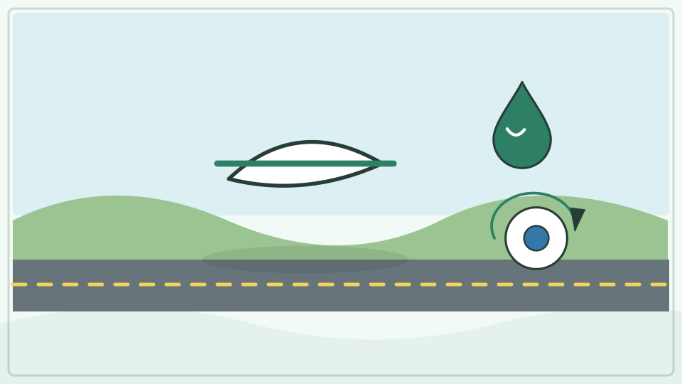

高处的水具有重力势能。它流向低处时推动水轮机旋转，发电机再产生电。水坝可以储水并形成高度差，也有电站利用天然河流发电。

**再想一步：** 可发功率与水流量、高度差和效率有关。水电运行时碳排放较低，但水坝会改变鱼类迁徙、泥沙、河流生态和居民生活，选址需要权衡。

**把知识连起来：** 高处水具有重力势能，流向低处时获得动能并推动水轮机叶片，旋转轴带动发电机产生电能。水库可储存并调节流量，径流式电站则更直接利用河流落差；抽水蓄能在电力富余时把水泵回高处，之后再发电。能量转换每一步都有损耗。

**再往外看：** 水坝会改变鱼类迁徙、泥沙输送、水温和下游流量，选址与运行要评估整个流域和居民影响。

**容易弄混：** 水电不是消耗掉水分子，也不是完全“零影响”。没有足够落差和流量就难以获得大功率，洪水时也不能随意让设备多发电。

**一起看看：** 在图上沿“水库—水管—水轮机—发电机—河流”走一遍。

---

### 第 353 问｜电怎样从发电站来到家里？

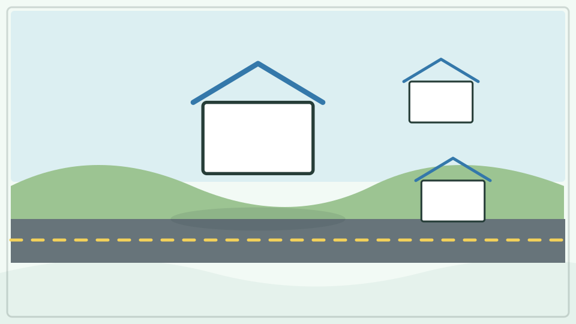

发电机产生电能后，变压器把电压升高，通过输电线送很远。靠近城市后再逐级降压，配电线路把电送到建筑。电网要让发电与用电时时接近平衡。

**再想一步：** 同样功率用较高电压输送，电流较小，导线发热损失会减少。太阳风能变化、用电高峰和设备故障需要调度、储能与互联网络共同处理。

**把知识连起来：** 发电站把机械、太阳或化学等来源转成电能，变压器升高交流电压后，输送同样功率所需电流可减小，从而降低线路电阻发热。高压电经远距离线路到变电站逐级降压，再由配电线和入户设备送到家庭。电网必须几乎实时平衡供给与用电。

**再往外看：** 太阳能和电池常先产生直流电，通过电力电子装置接入交流电网；保护继电器会快速隔离故障区域。

**容易弄混：** 电不是沿一根线从某座发电站排队送到某个插座，电网是互联网络，能量流随时变化。电线杆、配电箱和插座都不可触碰或拆开。

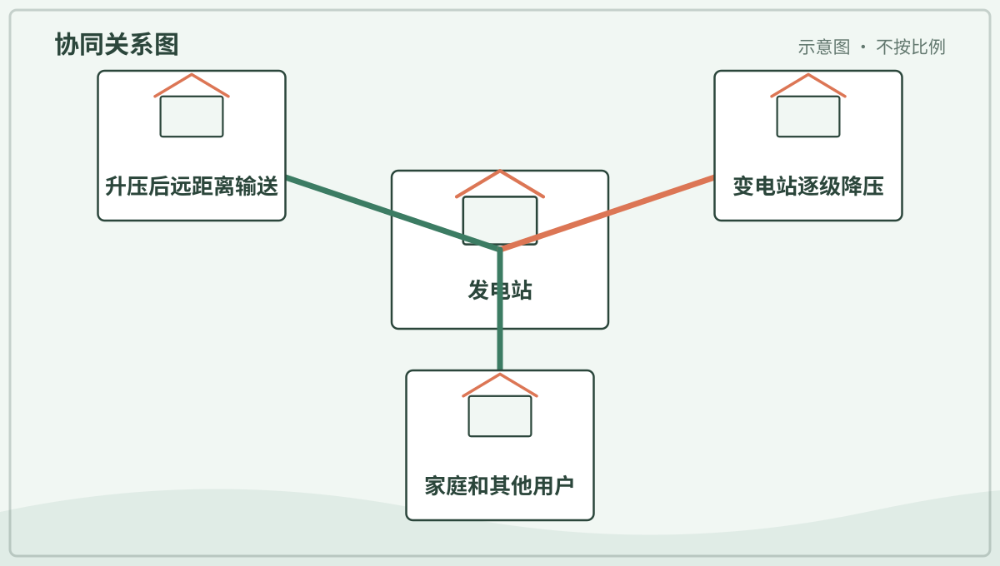

*图解：电网先升高电压远距离输电，再逐级降压，把电能分配到不同用户。*

**一起记住：** 电线、变电站和配电箱只远观，掉落电线绝不靠近。

---

### 第 354 问｜LED 灯为什么省电？

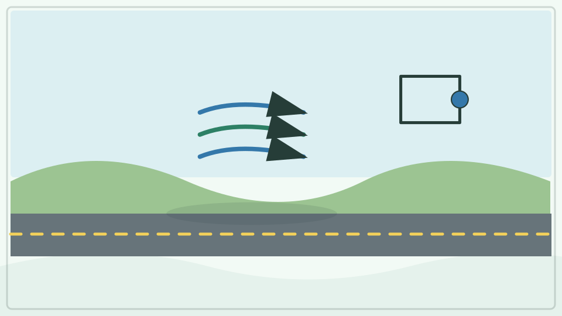

LED 是发光二极管。电流通过半导体时，电子与空位重新结合，把一部分能量直接变成光。它比白炽灯少把电能先变成高温，因此同样亮度通常更省电。

**再想一步：** 半导体材料的能带差决定发出的光子能量和颜色。白光 LED 常用蓝光芯片激发荧光材料，混合成眼睛看到的白光；驱动电路也会消耗能量。

**把知识连起来：** LED 是发光二极管，电流经过半导体结时，电子与空穴复合并以光子形式释放部分能量。材料能带决定发光颜色，白光 LED 常用蓝光芯片激发荧光材料得到多波长光。它把较多电能变成可见光、较少变成无用热，因此通常比白炽灯高效。

**再往外看：** 驱动电路负责限制电流，散热器仍要带走热量；光效、显色和色温是不同指标。

**容易弄混：** LED 不是完全不发热，也不是颜色越白越省电。刺眼高亮光可能伤眼，损坏灯具和市电接线只能由大人或专业人员处理。

**一起看看：** 比较不同色温灯光下白纸的样子，不拆灯泡。

---

### 第 355 问｜房子怎样少跑掉一点热？

墙和屋顶里的保温材料留住小空气层，双层窗减少导热和对流，密封缝隙阻止空气漏进漏出。遮阳和通风也能减少夏天过热。设计要适合当地气候。

**再想一步：** 建筑热量通过传导、对流、辐射和空气渗透移动。增加保温并非越多越好，还要管理湿气、室内空气质量、采光和材料安全。

**把知识连起来：** 房屋通过墙、窗和屋顶传导热，也会由门缝换气、空气对流和表面辐射丢失或获得热量。保温材料困住许多小空气空间，双层玻璃降低窗面传热，密封减少不受控漏风；遮阳和合理朝向又能在夏季少吸热。设计要同时保证必要通风与湿度控制。

**再往外看：** 热成像和气密性测试能找到热桥与漏风点，不同气候区会选择不同保温、遮阳和蓄热策略。

**容易弄混：** 把房子封得越严不一定越健康，室内污染和水汽仍需排出；保温也不是只在冬天有用。改造涉及防火与结构规范，应由专业人员评估。

**一起看看：** 和大人找门窗边有没有能感觉到的漏风，不自行封堵通风口。

## 追问链 33.2｜材料循环、碳、气候与生物多样性

回收与分解都有条件，碳在多处移动，温室气体影响能量平衡，物种关系支撑系统。

### 第 356 问｜回收以后，旧东西会变成原来的吗？

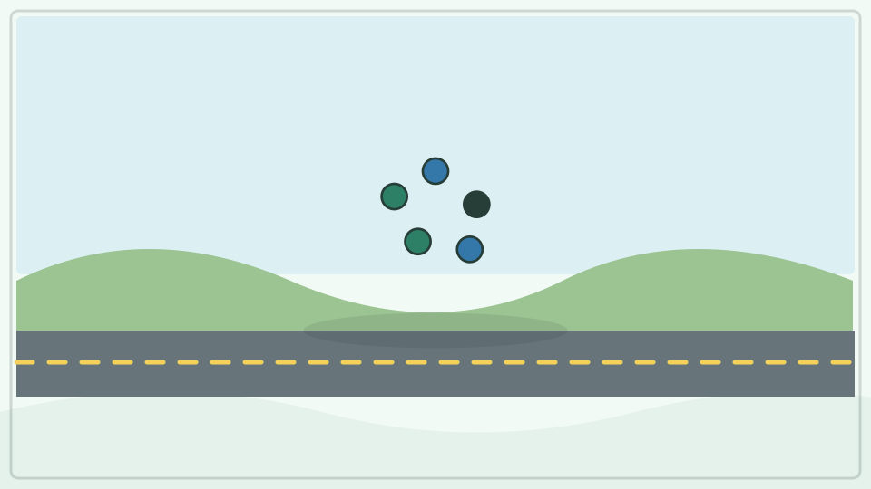

有些玻璃和金属可熔化制成新物品，纸纤维会随回收变短，塑料则要按种类处理。回收常得到性质不同的新材料，不一定变回原物。先少用和重复使用也很重要。

**再想一步：** 回收需要收集、分拣、清洗、运输和再加工，也会消耗能量。材料混杂、污损和缺少市场都会降低回收效果，所以应遵守本地分类规则。

**把知识连起来：** 回收先要收集、分类和去除污染，再把材料机械、热或化学处理成可用原料。金属和玻璃可多次重熔，但仍需能源并有损耗；纸纤维会变短，许多塑料混合后性能下降，常只能做成要求较低的新产品。设计阶段减少材料种类和便于拆解，会提高循环机会。

**再往外看：** 重复使用和维修通常保留了更多原产品价值，回收是资源策略的一环而非唯一终点。当地设施决定某种包装是否真正可回收。

**容易弄混：** 投进回收桶不等于必然变回同一个物品，三角箭头也不保证有人能处理。过度污染或错误分类会让整批材料失去价值。

**一起行动：** 和大人查本地规则，给三件干净废物找到正确去处。

---

### 第 357 问｜菜叶怎样变成堆肥？

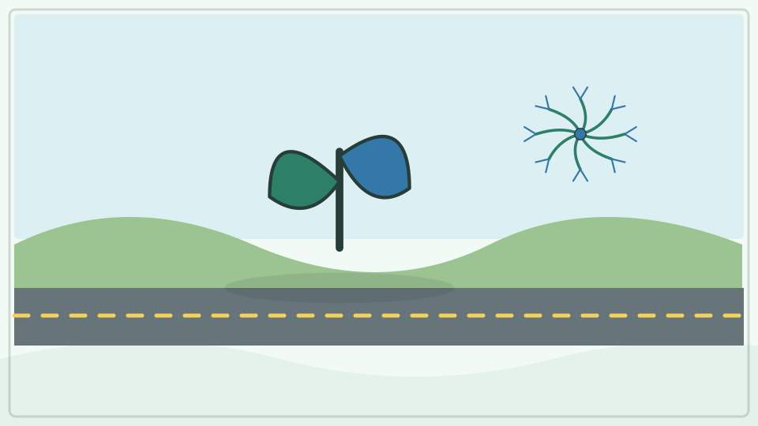

细菌、真菌和小动物会分解菜叶、果皮和枯叶，把复杂有机物变成较简单物质。合适的水分、空气和碳氮比例让过程顺利，并产生热。最后得到较稳定的堆肥。

**再想一步：** 有氧分解与缺氧腐败产生的气味和气体不同。肉、病株、宠物粪便和可堆肥包装能否加入，要按设施规则，家庭堆肥并非什么都收。

**把知识连起来：** 细菌、真菌和小型土壤动物把菜叶等有机物分解，利用其中碳获得能量，并把部分养分转入自身或释放成植物可再利用的形式。适量氧气、水分以及含碳干料与含氮湿料的比例让分解较快，微生物活动还能使堆体升温。翻堆改善通气。

**再往外看：** 成熟堆肥是较稳定的有机质和矿物质混合物，可改善土壤结构，却不是成分精确的万能肥料。工业堆肥条件与家庭堆肥不同。

**容易弄混：** 堆肥不是把任何垃圾埋起来等它消失，肉类、病害植物和标有可堆肥的包装是否可放要遵循当地规则。腐臭常提示缺氧或配比问题。

**一起看看：** 只和大人观察成熟堆肥的颜色与质地，之后认真洗手。

---

### 第 358 问｜树怎样把碳留在身体里？

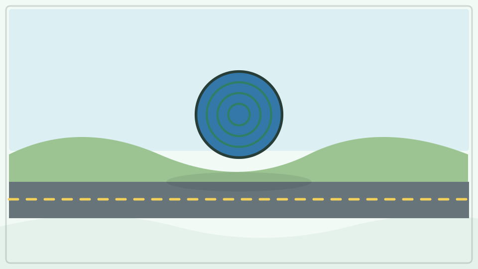

树用光合作用吸收空气中的二氧化碳，把碳做进糖、木材、根和叶。树生长时会把这些碳留在身体里。落叶和死亡后，一部分碳进入土壤，另一部分被分解者释放回空气。

**再想一步：** 森林碳循环包含吸收与释放，不能把一棵树当成永久封闭盒。保护老森林、恢复生态和减少化石燃料排放的作用不同，不能只靠种树替代所有减排。

**把知识连起来：** 树通过光合作用把空气中的二氧化碳碳原子固定进糖，再合成木质素、纤维素、根和其他组织；一部分碳随落叶、枯木和根分泌物进入土壤。树和分解者呼吸、火灾与腐烂又会把部分碳释放回大气。森林储碳量取决于生长、死亡、土壤和干扰的长期收支。

**再往外看：** 木材用于耐久建筑可暂时延长部分碳的储存，但砍伐后的土地变化和产品寿命必须纳入完整核算。

**容易弄混：** 树的质量主要不是从土里“吃”出来，碳也不是被永久锁死。种树有价值，却不能替代减少化石燃料排放和保护现有生态系统。

**一起看看：** 在树的叶、枝、干和根示意图上找碳可能待在哪里。

---

### 第 359 问｜大气为什么像一床会调温的被子？

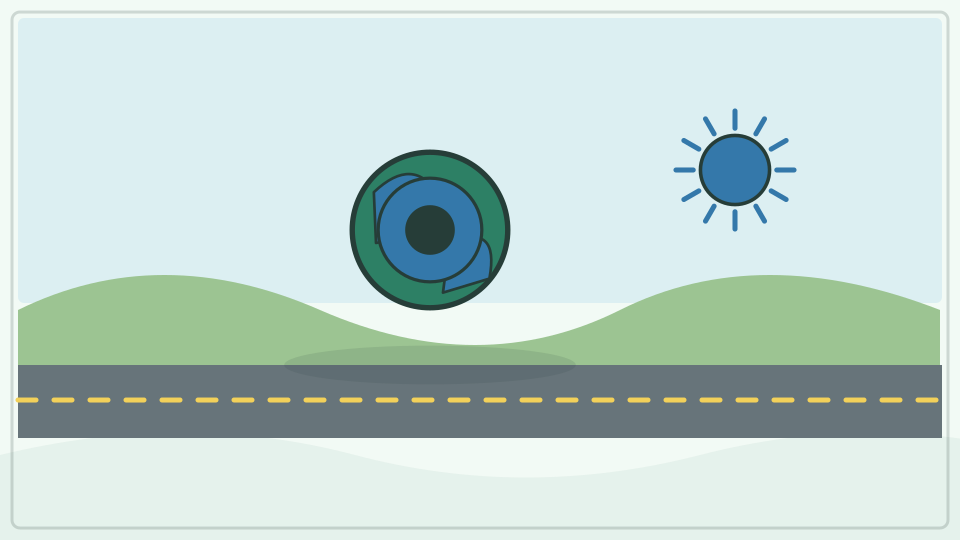

阳光加热地表，地表再发出红外辐射。水汽、二氧化碳和甲烷等气体会吸收并向各方向发射部分红外，使地表比没有这些气体时温暖。这是自然温室效应。

**再想一步：** 人类燃烧化石燃料和改变土地，增加温室气体，打破原有能量平衡，造成全球长期变暖。它不是大气像玻璃把热简单“锁死”，而是辐射传输高度和速度改变。

**把知识连起来：** 太阳短波辐射穿过大气并加热地表，地表以红外辐射向外放热；水汽、二氧化碳、甲烷等温室气体吸收特定红外波段并向各方向再发射，使地表与低层大气比没有这些气体时更暖。云、冰雪反射、对流和海洋搬热也参与调温。天然温室效应让地球适宜生命，人为增加温室气体则改变能量平衡。

**再往外看：** 不同气体吸收能力和寿命不同，反馈过程会放大或减弱最初变化；气候研究用观测、物理规律和模型共同约束。

**容易弄混：** 大气不像一床实体被子阻止所有热逃走，温室效应也不是臭氧洞造成。天气某天寒冷不能推翻几十年尺度的全球能量趋势。

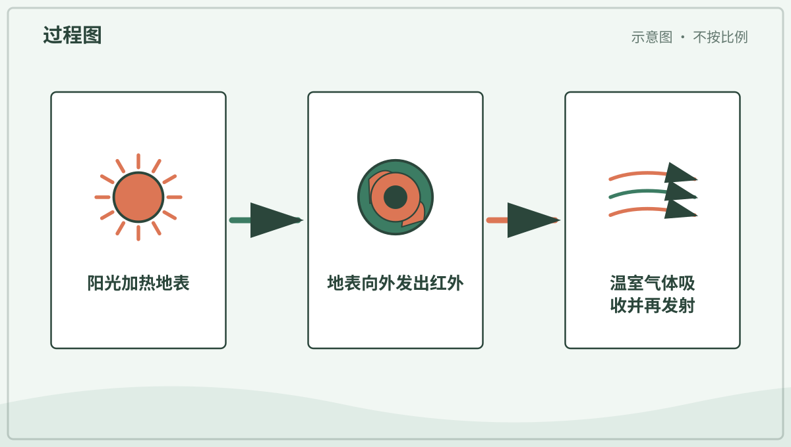

*图解：地表吸收阳光后发出红外辐射，温室气体吸收并向各方向再发射其中一部分。*

**一起想想：** 天气一天会变，为什么研究气候需要很多年的全球数据？

---

### 第 360 问｜为什么需要许多不同的生物？

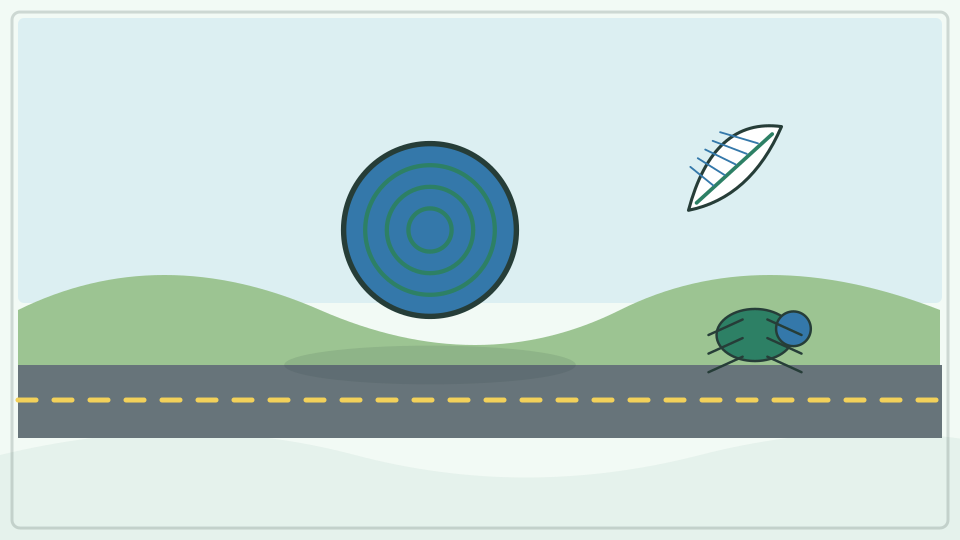

基因、物种和生态系统的多样性合称生物多样性。不同生物参与传粉、分解、食物网、土壤形成和水循环。多样系统面对变化时常有更多响应办法。

**再想一步：** 不能把每个物种只按“对人有什么用”来评价，生物之间还有尚未发现的关系与自身存在价值。栖息地丧失、污染、过度利用、入侵种和气候变化会共同造成压力。

**把知识连起来：** 生物多样性包括遗传差异、物种多样和生态系统多样。不同生物承担传粉、分解、固氮、捕食、造礁或形成栖息地等作用，一种变化可能沿食物网和环境反馈传播。具有多种功能途径的系统在干旱、疾病等扰动后往往更有恢复选择，但物种并非简单可互换零件。

**再往外看：** 有些物种影响特别大，有些功能存在部分冗余；保护还要保留种群数量、连接通道和演化潜力，而不只是列出物种名字。

**容易弄混：** 需要多样性不表示物种越多任何地点都越好，外来物种增加名单数量也可能破坏当地关系。价值既包括生态功能，也包括演化、文化和伦理层面。

**一起看看：** 在附近安全绿地数不同叶形和鸟声，不采集生物。

## 单元综合观察｜追踪一条能量链和一条物质链

选一盏灯画出能源到光和热的转换，再选一片菜叶画出从生长到堆肥的物质路径。两条链都允许分支和损失，不画成能量或材料凭空消失。
