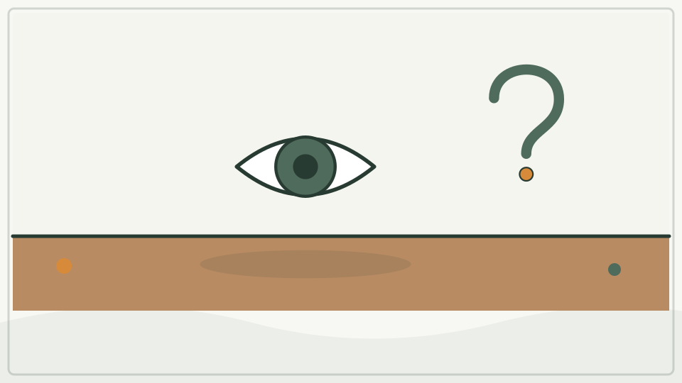
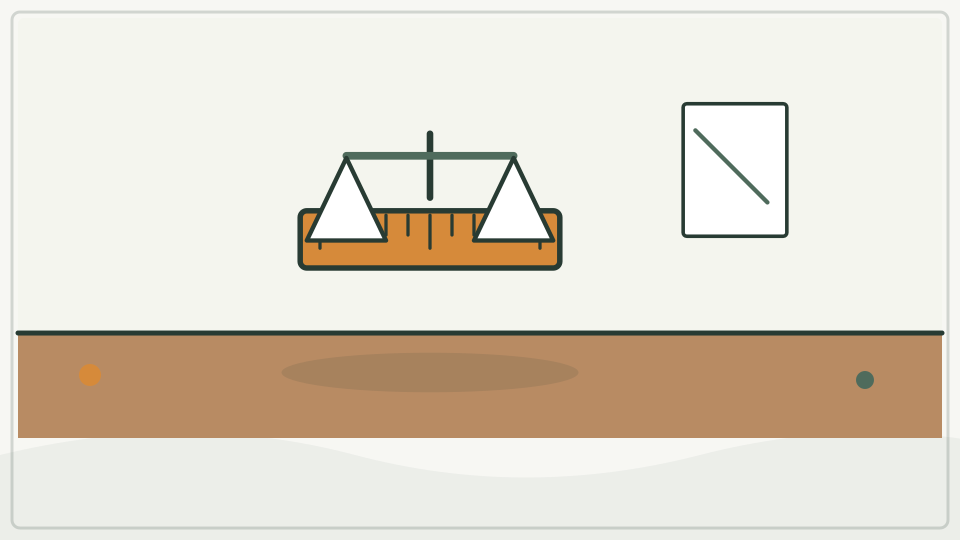
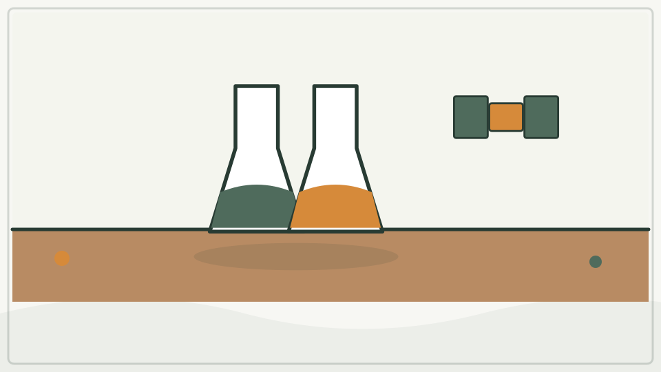
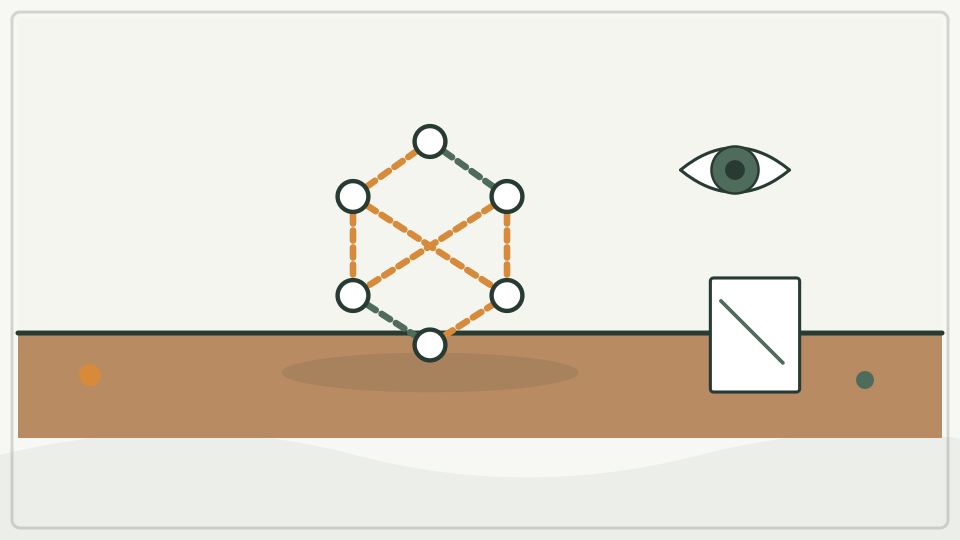
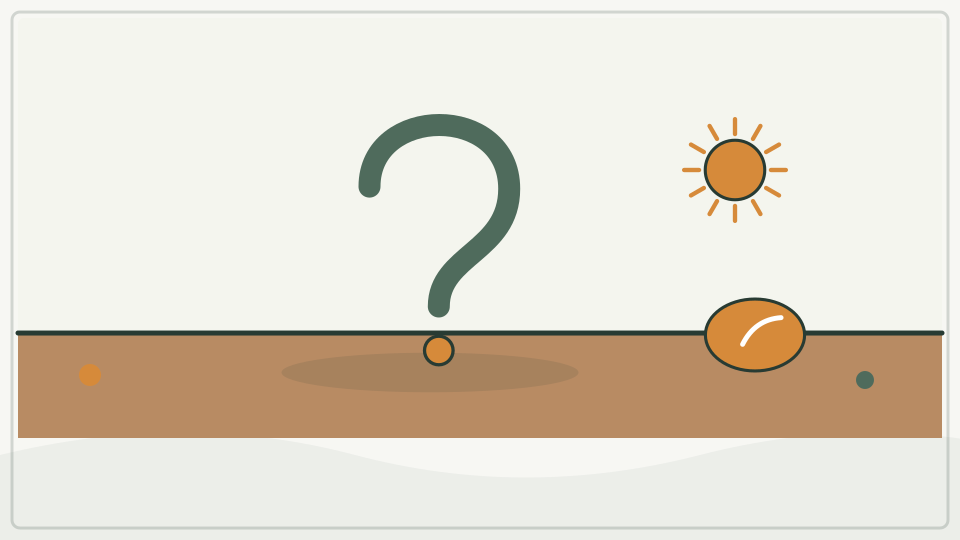

# 兴趣单元 34｜观察、实验与模型

> **探索领域 13：** 观察、实验与科学模型
>
> **核心问题：** 我们怎样区分看到的事实与猜想，用测量、公平比较和模型逐步修正解释？

最后一个单元不把科学方法写成固定步骤表，而是回看全书一直使用的观察、量化、控制变量、建模、质疑和修正。

## 怎样沿着本单元的追问链阅读

答案可以暂时不完整；关键是说清证据支持什么、没有支持什么，以及下一次怎样检查。

## 追问链 34.1｜观察、测量与公平比较

描述先于解释，单位让比较更可靠，一次实验尽量只改变一个主要条件。

### 第 361 问｜观察和猜想有什么不同？

观察是用感官或工具记录看到、听到和测到的事情；猜想是对原因或接下来会怎样的解释。好科学会把两者分开，再找证据检验猜想。猜错并不丢脸。

**再想一步：** 观察也会受工具、角度和期待影响，所以要记录条件并让别人复查。猜想若能提出可能被证据否定的预测，才更容易被科学检验。

**把知识连起来：** 观察是用感官或仪器记录可检查的现象，例如“影子十分钟后变长了”；猜想则是对原因、规律或未来结果的暂时解释，例如“太阳位置变化造成长度改变”。猜想要导出可观察预测，再由新证据检验。观察也会受工具、分类和提问方式影响，因此要记录条件。

**再往外看：** 科学论文通常把数据、分析与解释分开呈现，让别人能判断证据是否支持结论。多个解释可能暂时符合相同观察，需要设计区分它们的测试。

**容易弄混：** 猜想不是随便想且无需证据，观察也不是绝对不会错。把“我觉得”改写成“如果这个解释对，我们还应看到什么”才进入可检验过程。

**一起试试：** 看一只封闭盒，先写“我看到”，再写“我猜里面有”。

---

### 第 362 问｜为什么要用尺子和秤？

“大一点”“重很多”会因人而不同，尺子和秤把比较变成共同单位的数字。测量让不同时间和不同人得到的结果可以比较。工具也有精度限制。

**再想一步：** 每次测量都含不确定度，来自刻度、校准、读数和被测物变化。重复测量并报告合理位数，比写很多看似精确的小数更诚实。

**把知识连起来：** 尺子、秤和钟把长度、质量、时间等属性与共同单位比较，使不同人、不同日期的结果可以核对。任何测量都有分辨率、校准和读数误差，重复测量能估计波动，却不能自动消除系统偏差。选择合适量程和单位与读数字同样重要。

**再往外看：** 科学家用标准物质和可追溯校准把实验室、工厂与全球测量连接起来；有时还用平均值、误差条和有效数字表达不确定度。

**容易弄混：** 仪器显示很多小数不表示结果就同样准确，秤上的“重量”日常读数通常按质量标定。测量不是为了赢过别人，而是让比较规则清楚。

**一起量量：** 用尺量同一本书三次，看看结果是否完全一样。

---

### 第 363 问｜怎样做一次公平的实验？

想知道一个条件的作用，可以让两组尽量相同，只改变要研究的那一项。重复多次并记录结果，避免一次巧合骗过我们。这叫控制变量和重复实验。

**再想一步：** 真正系统里变量常互相影响，完全控制并不总可能，还要随机分组、盲法或统计分析。公平实验不是保证答案正确，而是减少其他解释。

**把知识连起来：** 公平实验让要研究的因素有计划地改变，同时尽量让其他会影响结果的条件相同，并使用可重复的结果指标。例如比较斜坡高度时，应使用同一辆车、同一路面和一致释放方法。随机安排、盲法、对照组与足够重复能进一步减少偏差。一次只改一个变量是初学策略，不是所有真实研究的唯一设计。

**再往外看：** 当因素无法操控时，科学家会做观察研究、自然实验或统计模型，并谨慎处理混杂因素。伦理和安全限制永远先于实验便利。

**容易弄混：** 两次结果不同不一定有人做错，两次相同也不证明解释必然正确。公平指比较条件可辩护，而不是把自然中的所有变化完全消除。

**一起试试：** 两块同样湿纸巾放在有风和无风处，只比较干燥快慢。

## 追问链 34.2｜模型、错误与继续提问

模型按目的保留一部分关系，也会有边界；新证据可以要求我们修改答案。

### 第 364 问｜科学模型会不会错？

模型是用图、物体、数学或电脑抓住现实的一些关系。地球仪适合看大陆位置，却不能画出每栋房子；原子球模型也不是原子照片。模型有用途，也有边界。

**再想一步：** 科学家比较模型预测与新数据，发现偏差后会修改或换模型。模型不必复制一切才有用，关键是对问题保留了什么、忽略了什么、误差多大。

**把知识连起来：** 科学模型可以是实物、图、方程或计算程序，它保留与问题有关的关系并省略其他细节。模型会错，是因为测量有限、假设简化或适用范围被超出；把预测与新数据比较后修正模型，正是科学工作的正常部分。好模型不要求像实物每处一样，而要在声明范围内可靠回答问题。

**再往外看：** 天气模型、地球内部剖面和原子球棍图使用完全不同的尺度与符号，阅读时都应问输入、假设、验证证据和不确定度。

**容易弄混：** 模型有缺点不等于任何模型都同样可信，也不表示预测稍有误差就毫无价值。应比较它是否比替代模型更准确、透明且适合当前任务。

**一起想想：** 今天读过的哪一张图是模型？它故意省略了什么？

---

### 第 365 问｜问了很多个为什么，就都知道了吗？

当然没有。每个答案都能长出新问题：我们怎样知道？换个地方还一样吗？有没有例外？科学不是装满答案的盒子，而是一种不断观察、猜想、检验和修正的方法。

**再想一步：** 可靠知识来自许多人公开方法与证据、互相检查、重复研究，也来自承认不确定和改正错误。今天最好的解释将来可能更精确，但这不表示所有说法都同样可靠。

**把知识连起来：** 科学知识由许多人把问题变成可检验的猜想，积累观察、测量、实验与论证，再接受他人重复和批评而形成。一个答案常会打开更细的问题：知道植物向光弯，还会继续问哪个部位感光、信号怎样传递、不同物种是否相同。知识可以很可靠，却仍保留适用条件和可修正空间。

**再往外看：** 真正完整的学习循环是提问、找证据、解释、检查不确定性、与别人比较，再提出下一问。读完一本书只是得到一套继续探索的工具。

**容易弄混：** 问得多不等于自动知道得多，权威说过也不等于无需核查；反过来，“科学会更新”也不表示所有说法都一样可能。可靠程度来自证据质量、方法和持续检验。

**一起开始：** 选今天身边的一件小事，提出一个还没写进书里的新问题。

## 单元综合观察｜完成一次可重复的小比较

选两辆大小相近的玩具车，在同一斜板同一位置各放三次，用积木或纸条记录距离。分开写“我看见了什么”“我猜为什么”“下一次怎样验证”，不追求预先想好的结果。
