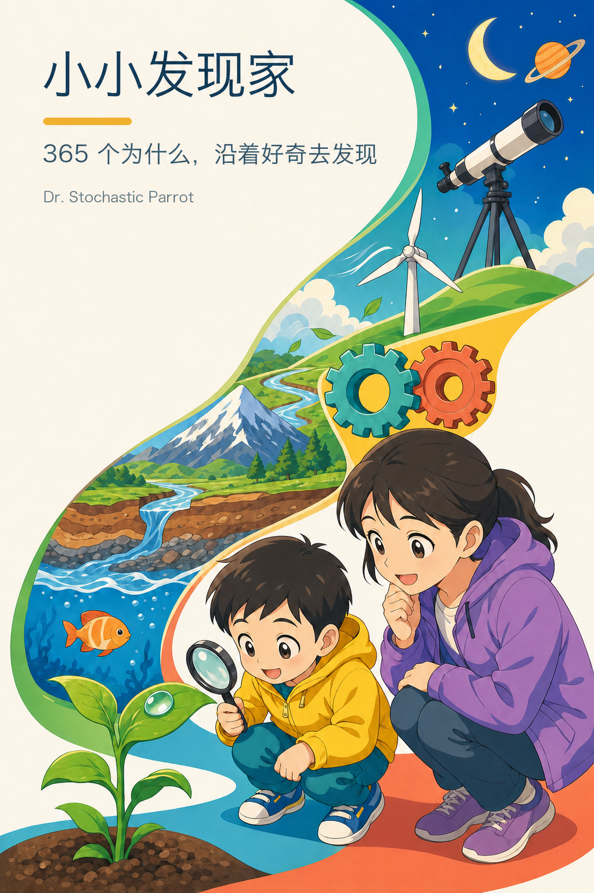

# 小小发现家：365 个为什么

- **作者：** Dr. Stochastic Parrot
- **适读年龄：** 约 4 岁，建议大人陪读
- **当前内容：** 13 个探索领域、34 个兴趣单元、80 条追问链、365 篇分层问答

“365”是“总有下一个为什么”的书名表达，不是日历，也不是数量合同。当前版本收录 365 篇，后续可以依据知识关系增加、合并或调整；编号只用于定位，不决定章节数、阅读日期、难度和先后顺序。

全书先按较大的探索领域建立知识地图，再拆成可以连续深入的兴趣单元。每个单元只有 5–19 篇，内部追问链通常含 3–6 个紧密相关的问题。读者可以顺着一条链深入，也可以从眼前正在发生的事情进入，再沿概念联系跳到别处。

## 内容结构

### 领域 01｜光、天空、时间与冷暖

- [单元 01｜光、颜色与看见](01_light_color_and_seeing.md)
- [单元 02｜夜空、地球与季节](02_night_sky_earth_and_seasons.md)
- [单元 03｜寒冷、冰雪与保温](03_cold_ice_heat_and_insulation.md)
- [单元 04｜计时、睡眠与夜晚世界](04_time_sleep_and_the_night_world.md)

### 领域 02｜空气、天气与水

- [单元 05｜空气、风与压强](05_air_wind_and_pressure.md)
- [单元 06｜云、降水与雷雨](06_clouds_rain_and_storms.md)
- [单元 07｜水的状态、旅行与天气](07_water_states_cycle_weather_and_climate.md)

### 领域 03｜植物与花园生命

- [单元 08｜种子、根、茎与叶](08_seeds_roots_stems_and_leaves.md)
- [单元 09｜花、果实与种子的旅行](09_flowers_fruits_and_seed_travel.md)
- [单元 10｜树木、植物适应与花园网络](10_trees_plant_adaptations_and_garden_networks.md)

### 领域 04｜昆虫与微型栖息地

- [单元 11｜昆虫的身体与行为](11_insect_bodies_and_behavior.md)
- [单元 12｜土壤小动物与蛛网](12_soil_invertebrates_and_spider_webs.md)
- [单元 13｜青蛙、壁虎与蜥蜴](13_frogs_lizards_and_reptile_adaptations.md)

### 领域 05｜脊椎动物的身体办法

- [单元 14｜鸟类、羽毛与飞行](14_birds_feathers_and_flight.md)
- [单元 15｜哺乳动物的感觉与生存](15_mammals_senses_and_survival.md)
- [单元 16｜水中动物、脚印与迁徙](16_aquatic_animals_tracks_and_migration.md)

### 领域 06｜人体与感觉

- [单元 17｜皮肤、骨骼、肌肉、心肺与大脑](17_skin_bones_muscles_heart_and_lungs.md)
- [单元 18｜眼、耳、鼻、舌与平衡](18_eyes_ears_smell_taste_and_balance.md)
- [单元 19｜进食、排泄、体温与修复](19_digestion_temperature_and_healing.md)

### 领域 07｜工具、机器与工程

- [单元 20｜杠杆、轮子、齿轮与弹性](20_levers_wheels_gears_and_springs.md)
- [单元 21｜磁、电、马达与流体装置](21_magnets_electricity_motors_and_fluids.md)
- [单元 22｜日常机关、结构与机器人](22_everyday_mechanisms_structures_and_robots.md)

### 领域 08｜地球、地图与地貌

- [单元 23｜地球内部、岩石与地貌](23_earth_inside_rocks_and_landforms.md)
- [单元 24｜地图、坐标与时区](24_maps_coordinates_and_time_zones.md)
- [单元 25｜陆地形状、生态环境与边界](25_landscapes_biomes_and_boundaries.md)

### 领域 09｜海洋、海岸与水中生命

- [单元 26｜海水、深度与海洋食物网](26_ocean_water_depth_and_food_webs.md)
- [单元 27｜海洋动物、海岸与塑料](27_marine_animals_coasts_and_pollution.md)

### 领域 10｜太阳系、宇宙与航天

- [单元 28｜恒星、行星与太阳系小天体](28_stars_planets_and_small_bodies.md)
- [单元 29｜月球、轨道、航天与深空](29_moon_orbits_spaceflight_and_deep_space.md)

### 领域 11｜物质、食物与家庭技术

- [单元 30｜物质、混合与食物变化](30_matter_mixtures_and_food_changes.md)
- [单元 31｜热、材料与家用机器](31_heat_materials_and_home_machines.md)

### 领域 12｜运动、交通、能源与环境

- [单元 32｜运动、车辆、船与飞行](32_motion_vehicles_ships_and_flight.md)
- [单元 33｜能源、气候与生命系统](33_energy_climate_and_living_systems.md)

### 领域 13｜观察、实验与科学模型

- [单元 34｜观察、实验与模型](34_observation_experiments_and_models.md)

## 怎样使用

先让孩子看标题或观察图并说出猜想，再读第一层答案；仍有兴趣时，继续读“再想一步”“把知识连起来”“再往外看”和“容易弄混”。单元末尾的综合观察把至少两篇内容放进同一条证据链，但不是作业，可以重复、跳过或换一个入口。

插图按任务选择媒介。能直接观察的动物、植物、地貌、天体、材料和机器，默认先用经过核对的写实主图回答“它是什么、长什么样”，不把主体缩成抽象节点；昆虫和土壤小动物采用能辨认身体形态、足数与相关器官的生物标注图，人体内部采用接近生物教材的结构图。连续时间阶段、无法直接剖开的内部或尺度极端的场景，可增加明确标注的写实原理图；方向、受力、循环和关系需要精确表达时，再使用带标签的矢量示意图。同一页出现多种图，是因为它们回答不同问题，不是装饰性堆叠。

当前版资产集包含 1 幅封面、13 幅领域开篇图、103 幅逐题科学写实主图、13 幅写实观察图、5 幅写实原理图、365 幅逐题矢量图和 154 幅关系示意图，共 654 幅。写实主图覆盖第 001–059 问中除彩虹、猫头鹰和积云三幅既有写实观察图以外的可观察主题，并覆盖第 116–151 问的脊椎动物以及第 213–218、220–224 问的地球、地貌、岩石与化石；原有逐题矢量图保留为改版与补充解释资产。数量记录当前版本，不是未来版本必须维持的配额。

陪读方法见 [给陪读大人的话](00_for_grownups.md)；写作、结构和配图判断见 [写作与插图约束](STYLE_GUIDE.md)；事实核查资料见 [成人事实来源](SOURCES.md)；逐图检查见 [插图验收记录](IMAGE_QA.md)。
