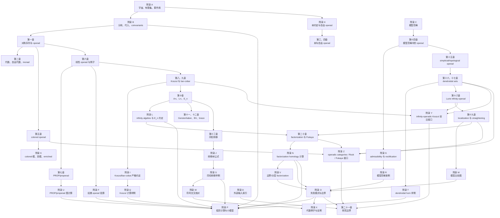

# 全书依赖图

本文档记录《Operad Theory》当前草稿的逻辑依赖。它不新增数学定理；作用是防止后续扩写把高级章节中的外部输入倒用为基础定义。

## 总体结构

Mermaid 图中的箭头表示“证明或定义需要先读”。外部输入定理通过附录 D 记录，不由箭头表示为已证明依赖。

## 基础层

| 层级 | 文件 | 功能 | 不得依赖 |
| --- | --- | --- | --- |
| 0 | `A_set_theory_universes_finite_sets_and_symmetric_groups.md` | 宇宙、小性、有限集群胚、群作用 | 任何 operad 定理 |
| 0 | `B_trees_partitions_substitution_and_coinvariants.md` | 有限映射纤维、分块特例、代入乘积、arity 公式 | 模型范畴、Koszul、infinity-operad |
| 0 | `H_tree_conventions_and_free_operad_quotients.md` | 树类型、自由 operad 群胚商 | dendroidal model comparison |
| 1 | `01_symmetric_sequences_and_operads.md` | operad 的幺半对象定义 | homotopy 或 infinity 结构 |
| 1 | `02_operad_algebras_free_algebras_and_monads.md` | 代数、自由代数、monad | 模型结构 |
| 1 | `03_nonsymmetric_operads_partial_compositions_and_trees.md` | 非对称 operad 与偏复合 | Koszul 对偶 |
| 1 | `04_free_operads_generators_and_relations.md` | 自由 operad 与生成元关系 | 模型范畴 transferred structure |

基础层的所有证明应尽量在 ordinary category、sets 或 modules 中完成。若引入 weak equivalence 或 derived functor，说明已经离开基础层。

## 线性与同伦代数层

| 文件 | 直接依赖 | 外部输入热点 |
| --- | --- | --- |
| `06_linear_operads_schur_functors_and_classical_examples.md` | 第一章、附录 A/B | Lie/Pois 例子的经典识别 |
| `08_quadratic_operads_and_koszul_duality.md` | 第六章、附录 E/I | Ass/Com/Lie Koszul 性 |
| `09_bar_cobar_constructions_and_twisting_morphisms.md` | 第八章、附录 E/I | bar-cobar resolution、Koszul 判别 |
| `Q_koszul_complexes_and_bar_cobar_examples.md` | 定义 8.4--定义 8.16，定义 9.14--定理 9.20，定义 I.11--命题 I.21 | Ass Koszul 性、bar-cobar resolution、谱序列收敛 |
| `10_a_infinity_l_infinity_and_e_n_operads.md` | 第九章、附录 L | May recognition、$E_n$ 同调、形式性 |
| `11_gerstenhaber_bv_and_deligne_conjecture.md` | 第十章、第十二章 | Deligne 猜想、framed $E_2$ |
| `12_brace_operad_and_hochschild_cochains.md` | 第十一章、定义 E.18--定义 E.23 | brace 与 $E_2$ 链模型弱等价 |
| `13_homotopy_transfer_and_minimal_models.md` | 第九、十章、附录 J | HPL、转移定理、minimal model 唯一性 |
| `S_homotopy_transfer_worked_examples.md` | 定义 13.1--外部输入定理 13.16，定义 E.18--定义 E.23，定义 J.1--外部输入定理 J.19，定义 L.4--定义 L.7，附录 R | 完整 HPT、minimal model 唯一性、strict formality rectification |
| `W_sign_convention_crosswalk.md` | 约定 E.1--说明 E.25，定义 J.1--警告 J.20，定义 L.1--说明 L.20，命题 P.1--说明 P.9，定义 S.1--说明 S.13 | 文献 convention 转换仍需逐条核对 |

此层的常见错误是把手写高阶恒等式当作主定义。当前草稿的安全路径是：bar-cobar 或 suspended coderivation 作为定义，展开恒等式作为计算说明。

## 模型范畴与 infinity-operad 层

| 文件 | 直接依赖 | 外部输入热点 |
| --- | --- | --- |
| `C_model_categories_and_quillen_adjunctions.md` | 普通范畴论背景 | homotopy category mapping 计算 |
| `14_operads_in_model_categories.md` | 附录 C、第六章 | transferred model structures、admissibility 已定位到 BM/HIN/FRE/PSAR |
| `G_model_structure_hypotheses_and_rectification.md` | 第十四章 | rectification schema 已定位到 BM/HIN/PSAR；需假设翻译 |
| `R_model_category_case_studies.md` | 第十四章、附录 C/G/O | 逐底范畴 transferred/admissibility/rectification 定理已定位到 BM/HIN/FRE/PSAR |
| `15_simplicial_and_topological_operads.md` | 第十四章 | Kan-Quillen、Top-sSet Quillen equivalence |
| `16_dendroidal_sets_and_tree_category.md` | 第十五章、附录 H | dendroidal nerve fully faithful |
| `17_dendroidal_inner_kan_and_homotopy_operads.md` | 第十六章 | Cisinski-Moerdijk model structure |
| `T_dendroidal_horns_segal_and_normality_examples.md` | 第十六、十七章，附录 M/O/P | normal monomorphism、fully faithfulness、operadic model structure |
| `18_lurie_infinity_operads_and_operadic_fibrations.md` | 第十七章 | Lurie operadic fibration 技术；category-of-operators HA-OP 和 dendroidal-Lurie HHM 已定位 |
| `19_model_comparison_straightening_and_operadic_localization.md` | 第十八章、附录 C/G | ordinary straightening、White/White--Yau localization preservation、DK localization、strict-to-infinity algebra comparison 已定位；operadic straightening 为 PRA preprint locator |
| `M_dendroidal_lurie_and_model_comparison_map.md` | 第十六至十九章 | White/White--Yau localization preservation、HHM dendroidal-Lurie comparison、HA-OP category-of-operators 和 PSAR/HA-ALG algebra comparison 已定位 |

此层的关键分离是：

1. strict operad；
2. simplicial/topological operad；
3. dendroidal infinity-operad；
4. Lurie-style infinity-operad；
5. 模型范畴中的 algebra category。

这些对象之间只有在比较定理给出时才能互换。

## 几何层

| 文件 | 直接依赖 | 外部输入热点 |
| --- | --- | --- |
| `20_factorization_algebras_fukaya_categories_and_geometry.md` | 第十、十八、十九章 | locally constant multiplicative factorization algebra 与 $E_n$、excision、Fukaya 构造 |
| `N_factorization_homology_examples_and_geometry.md` | 第二十章、附录 L/M/O | excision、圆周计算、Fukaya gluing |
| `V_stratified_and_boundary_factorization_examples.md` | 第二十章，附录 N/O/R | stratified factorization homology、sectorial descent |
| `P_low_arity_checks_and_worked_computations.md` | 第一、六、十、十二、十六、十七、二十章，附录 B/E/L/N/O | dendroidal/factorization 比较仍由外部输入控制 |
| `X_concrete_algebraic_examples_and_counterexamples.md` | 附录 A/F/O/R/V/W | Morita invariance、rectification、boundary factorization 仍外部 |
| `Y_infinity_operadic_homology_and_koszul_frontier.md` | 第八、九、十六至十九章，附录 D/I/M/Q | Hoffbeck-Moerdijk 前沿结果仍为研究边界 |
| `Z_operadic_categories_relative_rezk_and_fukaya_frontier.md` | 第五、十六至二十章，附录 D/M/N/O/V | operadic nerve、relative Rezk nerve、Fukaya 高阶结构仍为研究边界 |
| `21_research_frontier_2026.md` | 全书前文、附录 Y/Z | 六类开放问题的输入、目标与低阶检验 |

几何层不能反向证明代数层结论。例如，Fukaya category 中出现 $A_\infty$ relations 不能作为 $A_\infty$ operad 定义的证明；它只能作为由外部分析定理构造出的例子。

## 外部输入瓶颈

| 瓶颈 | 涉及文件 | 进入最终版前必须补齐 |
| --- | --- | --- |
| Koszul 判别 | 第八、九章，附录 I/Q | Loday--Vallette Theorems 6.6.2/7.4.6 已定位为 LV-1--LV-2；Theorem 8.1.1 + following $\operatorname{As}$ example 已定位为 LV-3。Characteristic $0$、connected weight grading、reduced nonsymmetric rewriting 等假设按对应定理分别保留；FRE/HIN 的模型 cofibrancy 结论另行使用 |
| PROP/properad 图构造 | 第七章，附录 U | directed graph groupoid、自由 PROP/properad 定理 |
| Deligne 猜想 | 第十一、十二章 | MS-1--MS-3 与 BF-1--BF-4 已定位；仍需使用的 $E_2$ 链模型和符号转换 |
| Homotopy transfer | 第十三章，附录 J | Markl transfer existence 已定位；basic perturbation lemma、tree signs、minimal model uniqueness 归入附录 W 与 final closure 的 sign/convention package |
| Sign convention conversion | 附录 E/W | 文献公式到本书同调分次的转换 |
| Operad admissibility | 第十四章，附录 G/K | PSAR-1--PSAR-6 与 PSP-1--PSP-2 已定位；仍需底范畴、cofibrancy、symmetric flatness 假设翻译 |
| Monoidal/algebra localization | 第十九章，附录 M/R | White/White--Yau 模型范畴 preservation、PSAR/HA-ALG strict-to-infinity comparison 和 DKR Quillen-pair passage 已定位；仍需分清 preservation 与 comparison |
| Dendroidal model structure | 第十六、十七章 | Moerdijk-Weiss strict nerve core、Cisinski-Moerdijk model structure 和 HHM comparison 已定位；normal monomorphism erratum、weak equivalence 定义仍需最终核查 |
| Dendroidal-Lurie 比较 | 第十八、十九章，附录 M | HHM-1--HHM-5 已定位；需保留 open/no-constants restriction |
| Factorization homology excision | 第二十章，附录 N | Ayala-Francis topological manifolds 版本已定位；Dunn additivity 已定位；tangential structure 与 collar 条件仍需逐条假设对齐 |
| Stratified/boundary factorization | 附录 V | boundary topological manifold 版本已定位；stratified disk category、module/defect 标记仍需另行定位 |
| Fukaya gluing | 第二十章，附录 N | 几何模型、横截性、紧性、orientation |
| Infinity-operadic Koszul 开放问题 | 第二十一章，附录 Y | linear infinity-operad 定义、完备性、strict 特化比较 |
| Operadic categories / relative Rezk / Fukaya 开放问题 | 第二十一章，附录 Z | nerve/Rezk/gluing 模型、泛性质与低阶退化 |
| 会随版本变化的外部结果 | 附录 D、来源审计 | 版本、定理编号、模型约定与依赖路径 |

## 阅读路径

### 路径 A：普通 operad 到代数

读：

1. 附录 A；
2. 附录 B；
3. 第一至四章；
4. 第二章自由代数与 monad；
5. 第五章 colored operad；
6. 附录 K；
7. 第七章与附录 U。

目标是掌握 ordinary/colored operad 的严格定义和代数对象。

### 路径 B：同伦代数

读：

1. 第六章；
2. 附录 E；
3. 第八、九章；
4. 附录 I、Q；
5. 第十、十三章；
6. 附录 J、L、S、W。

目标是掌握 $A_\infty/L_\infty/\mathcal P_\infty$ 的安全定义、转移和最小模型。

### 路径 C：infinity-operad

读：

1. 附录 C；
2. 第十四、十五章；
3. 附录 G、R；
4. 第十六、十七章；
5. 附录 T；
6. 第十八、十九章；
7. 附录 M；
8. 附录 O。

目标是区分模型范畴、dendroidal sets 和 Lurie-style infinity-operads。

### 路径 D：几何应用

读：

1. 第十章 $E_n$ 部分；
2. 第十八、十九章的 infinity-operad/localization 语言；
3. 第二十章；
4. 附录 N；
5. 附录 V；
6. 附录 O、X；
7. 第二十一章。

目标是理解 factorization homology 和 Fukaya 型应用中哪些是 operad theory，哪些是外部几何定理。

## 当前完成度判定

当前草稿已经达到“基本完本严格草稿”：

1. 定义链从有限集和树开始，没有以直觉替代定义；
2. 大型定理多数已进入外部输入索引；
3. 模型比较和几何应用已经有边界文件；
4. 符号、宇宙和 arity 约定已有统一入口。
5. 附录 A-Z 覆盖正文所需工具、例子、失败模式、前沿接口和闭包审查。
6. `PUBLICATION_CLOSURE_MATRIX.md` 已把基本完本与最终出版状态分离。
7. `REFERENCE_LOCATOR_LEDGER.md` 已把最终出版前的外部输入定位分成 P0/P1/P2/R。

已经达到“operad theory 数学收口态”：

1. 附录 D 和 REFERENCE_LOCATOR_LEDGER 已把主要 P0/P1 外部输入收口到 locator 批次；已定位批次覆盖 Berger-Moerdijk、Cisinski-Moerdijk、HTT straightening、Ayala-Francis factorization homology 基础结论、Ginzburg-Kapranov classical Koszul core、Fresse modern cobar/cofibrant replacement、Hinich dg-operad model context、Markl homotopy transfer existence、Moerdijk-Weiss dendroidal nerve core、White/White--Yau localization preservation、Pavlov--Scholbach admissibility/rectification、Hinich DK localization、HHM dendroidal-Lurie comparison、Lurie algebra/category-of-operators comparison、Pratali operadic straightening locator、Deligne locator 和 Dunn additivity locator；
2. Koszul/twisting 的现代书本判别已由 LV-1--LV-3 精确定位；[FINAL_OPERAD_THEORY_CLOSURE.md](FINAL_OPERAD_THEORY_CLOSURE.md) 仍把 HPT 符号、Fukaya/分层几何和 2026 前沿归类为 convention package、边界关闭或 production work；
3. 前沿章节不能直接并入主证明链，除非完成版本核查和定理定位。

尚未达到“camera-ready 出版教材”：

1. 许多证明仍是严格证明草稿，还需逐行压缩成正式定理-证明格式；
2. 参考文献、索引、page/tag 核验和排版仍需 production work；
3. 若未来要加入 full unsuspended sign expansions，需要先完成 convention lock-in。
