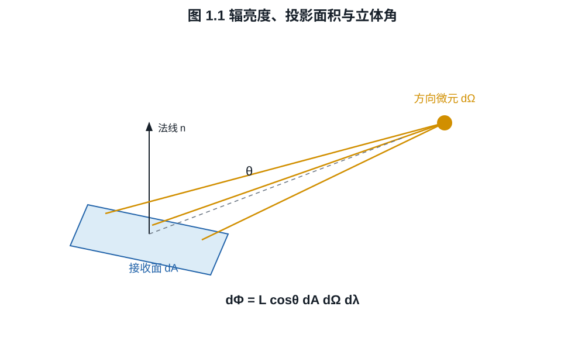
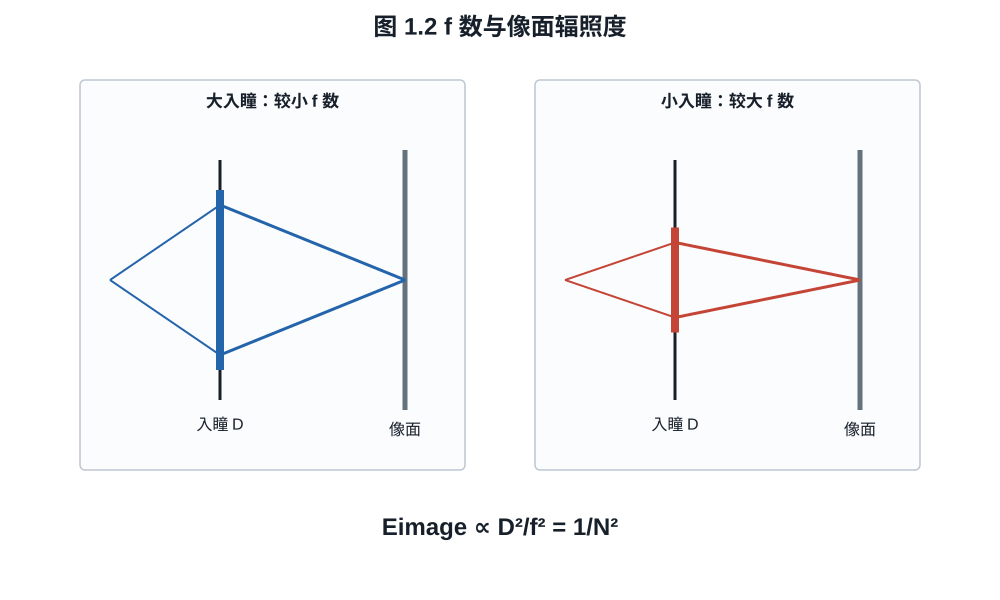

# 第一章：辐射度学、光圈与曝光量

曝光三角常被讲成三个地位相同的旋钮，但物理上只有光圈和曝光时间直接改变一次
曝光期间到达传感器的光子数。ISO 主要改变信号链如何解释和放大这次曝光。要理解
这个差别，必须先把“光有多少”写成有单位的量。
例如，同样写着 $f/2.8$ 的两个镜头为何未必给出相同码值，只有把入瞳、透射率和
光谱响应放进同一个曝光方程后才能回答。

## 1.1 从功率到辐亮度

**定义 1.1（辐射通量）.** 辐射通量 $\Phi_e$ 是单位时间传输的辐射能，单位为
瓦特。单位面积接收的通量密度称为辐照度（irradiance）：

$$
E_e=\frac{d\Phi_e}{dA},\qquad [E_e]=\mathrm{W\,m^{-2}}.
$$

它仍没有记录光从哪个方向来。对与传播方向垂直的投影面积 $dA\cos\theta$ 和立体角
$d\Omega$，定义光谱辐亮度（spectral radiance）

$$
L_{e,\lambda}
=\frac{d^4\Phi_e}
{dA\cos\theta\,d\Omega\,d\lambda}.
$$

对一个接收面，光谱辐照度为

$$
E_{e,\lambda}
=\int_{\Omega_+}L_{e,\lambda}(\theta,\phi)
\cos\theta\,d\Omega.                                      \tag{1.1}
$$

*图 1.1　辐亮度的面积因子是与传播方向垂直的投影面积
$dA\cos\theta$；方向范围由立体角 $d\Omega$ 度量。图为微分几何示意，不按比例。*

**命题 1.2（均匀半球辐亮度）.** 若入射半球内
$L_{e,\lambda}=L_0$ 与方向无关，则 $E_{e,\lambda}=\pi L_0$。

**证明.** 在球坐标中 $d\Omega=\sin\theta\,d\theta\,d\phi$，故

$$
E_{e,\lambda}
=L_0\int_0^{2\pi}\int_0^{\pi/2}
\cos\theta\sin\theta\,d\theta\,d\phi
=2\pi L_0\left[\frac{\sin^2\theta}{2}\right]_0^{\pi/2}
=\pi L_0.
$$

这说明立体角不能从辐亮度定义中删除。镜头收集能力不仅取决于前玉面积，也取决于
从像点看见的出瞳立体角。

## 1.2 曝光量与光子数

**定义 1.3（辐射曝光量）.** 曝光区间 $[0,t]$ 内的光谱辐射曝光量是

$$
H_{e,\lambda}(\lambda)=\int_0^t E_{e,\lambda}(\lambda,s)\,ds.
$$

若照明不随时间变化，则 $H_{e,\lambda}=tE_{e,\lambda}$。单个波长 $\lambda$ 的
光子能量为

$$
\varepsilon_\gamma(\lambda)=\frac{hc}{\lambda}.
$$

因此面积 $A_p$ 的像素接收的平均光子数为

$$
\mu_\gamma
=A_p\int_0^\infty
\frac{H_{e,\lambda}(\lambda)}{hc/\lambda}\,d\lambda
=\frac{A_p}{hc}\int_0^\infty
\lambda H_{e,\lambda}(\lambda)\,d\lambda.                 \tag{1.2}
$$

式 (1.2) 解释了为什么相同焦平面能量不必产生相同光子数：长波光子的单个能量更
低。不过传感器的量子效率也随波长变化，电子数还不能只由总光子数决定。

**例子 1.4（绿光下的光子预算）.** 一个 $4\ \mu\mathrm m\times4\ \mu\mathrm m$
像素在 $550\ \mathrm{nm}$ 窄带光下接收
$H_e=1.0\times10^{-4}\ \mathrm{J\,m^{-2}}$。像素上的能量为

$$
E_p=A_p H_e=16\times10^{-12}\times10^{-4}
=1.6\times10^{-15}\ \mathrm J.
$$

取 $h=6.626\times10^{-34}\ \mathrm{J\,s}$、
$c=2.998\times10^8\ \mathrm{m/s}$，单光子能量约为
$3.61\times10^{-19}\ \mathrm J$，故平均入射光子数约为

$$
\mu_\gamma\approx\frac{1.6\times10^{-15}}{3.61\times10^{-19}}
\approx4.43\times10^3.
$$

若量子效率为 $70\%$，平均信号电子约为 $3.10\times10^3$；这是下一章的起点。

## 1.3 为什么像面照度按 f 数平方变化

令镜头有效焦距为 $f$、入瞳直径为 $D$，相对孔径数定义为

$$
N=\frac fD.
$$

对位于无穷远、轴上、局部近似 Lambertian 的扩展物体，忽略渐晕和像差，像面一点
看见的圆形出瞳半角 $\alpha$ 满足小角近似

$$
\sin\alpha\approx\tan\alpha\approx\frac{D}{2f}=\frac1{2N}.
$$

若镜头透射率为 $T$，由命题 1.2 对出瞳所张立体角积分，得到轴上像面辐照度

$$
E_\mathrm{img}
=T L_e\int_0^{2\pi}\int_0^\alpha
\cos\theta\sin\theta\,d\theta\,d\phi
=T L_e\pi\sin^2\alpha
\approx\frac{\pi T L_e}{4N^2}.                            \tag{1.3}
$$

*图 1.2　在焦距和物方辐亮度固定的近轴模型中，入瞳直径决定像点所见的出瞳
立体角，因而 $E_\mathrm{img}\propto D^2/f^2=N^{-2}$。图中光束仅表示边缘光线。*

**推论 1.5.** 在式 (1.3) 的条件下，把 f 数乘以 $\sqrt2$，像面辐照度减半，
即减少一档曝光。

**证明.** 式 (1.3) 中 $E_\mathrm{img}\propto N^{-2}$，所以

$$
\frac{E_\mathrm{img}(\sqrt2N)}{E_\mathrm{img}(N)}
=\frac{N^2}{(\sqrt2N)^2}=\frac12.
$$

按一档曝光的定义，这正是减少一档。$\square$

镜头实际透射率不等于 $1$，电影摄影常用 T-stop 把透射损失并入。若记 T 数为
$N_T$，可用

$$
N_T\approx\frac{N}{\sqrt{T}}
$$

理解其一阶关系。相同 f 数的镜头可能因镀膜、镜片数量和遮挡而有不同透射。

## 1.4 离轴照度、放大率与有效光圈

理想薄镜头在若干附加条件下给出约 $\cos^4\theta$ 的自然照度衰减：一个余弦来自
投影面积，一个来自立体角投影，另外两个来自出瞳几何变化。实际广角镜头还受机械
渐晕、出瞳畸变、微透镜接受角和数字补偿影响，因此不能只凭 $\cos^4$ 定律反推暗角。

近摄时，像距增大。对近似对称镜头、瞳孔放大率接近 $1$ 的情况，放大率为 $m$ 时
有效 f 数近似

$$
N_\mathrm{eff}\approx N(1+m).                             \tag{1.4}
$$

$1:1$ 放大率给出 $N_\mathrm{eff}\approx2N$，即约损失两档像面照度。非对称镜头
需引入瞳孔放大率，式 (1.4) 不能无条件使用。

## 1.5 曝光等价不等于图像等价

对静态均匀场景，光圈开大一档而曝光时间减半，可保持曝光量近似不变：

$$
H_e\propto\frac{t T}{N^2}.
$$

但两张图仍可能不同。光圈改变景深、像差和衍射；曝光时间改变运动模糊、闪烁采样和
暗电流积累。ISO 若只改变后端增益，则根本不补回少收集的光子。所谓曝光三角只在
输出亮度控制上形成三角，在光子物理上并不对称。

## 练习

**练习 1.1.** 证明均匀辐亮度只占据半角 $\alpha$ 的圆锥时，接收面辐照度为
$\pi L\sin^2\alpha$。

**练习 1.2.** 同一镜头从 $f/2$ 收到 $f/5.6$，忽略透射变化，像面曝光量变为原来的
多少？写成比例和档数。

**练习 1.3.** 一个 $6\ \mu\mathrm m$ 方形像素在 $650\ \mathrm{nm}$ 单色光下接收
$2.0\times10^{-5}\ \mathrm{J\,m^{-2}}$ 的曝光量，量子效率为 $60\%$。计算平均
光子数和电子数。
