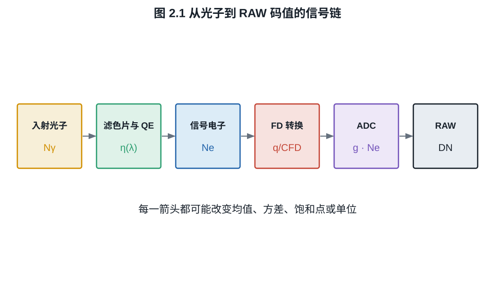
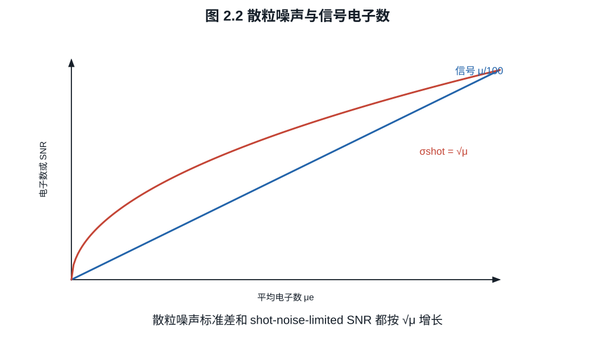
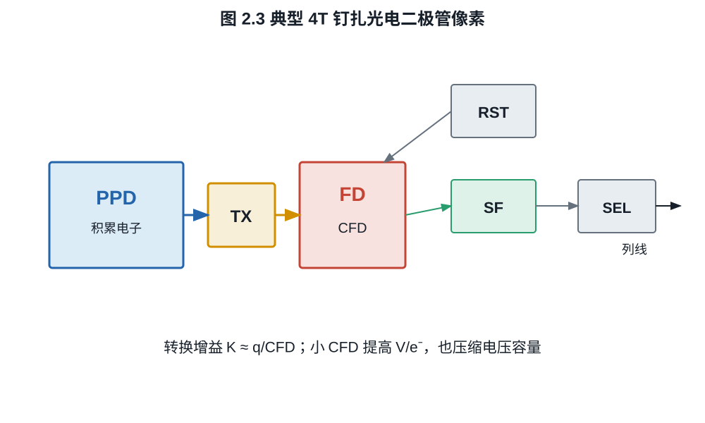

# 第二章：从光子到电子：硅光电转换与像素

镜头不会把“颜色值”送进传感器，而是把不同波长的光子送到硅中。硅吸收光子后产生
电子--空穴对，电场把可收集载流子导向势阱。这个过程决定量子效率、光谱响应、串扰
和满阱容量，也说明为什么传感器没有一个脱离波长和读出模式的单一“感光度”。
从这里开始，“弱光性能”将被拆成吸收了多少光子、留下多少电子以及这些电子有多大
统计涨落，而不再由一张提亮后的样片代替。

## 2.1 吸收与量子效率

硅是带隙半导体。能量足够的光子可激发电子跨越带隙；在可见光范围，吸收深度随
波长显著变化。短波通常在接近入射表面处被吸收，红光和近红外能进入更深处。完整的
吸收系数来自材料实验，本书把它作为外部器件物理输入。

对均匀材料中的单色准直光，若吸收系数为 $\alpha(\lambda)$，忽略散射并把界面反射
另行处理，光强 $I(z)$ 满足

$$
\frac{dI}{dz}=-\alpha I,
\qquad I(z)=I(0)e^{-\alpha z}.                            \tag{2.1}
$$

因此厚度 $d$ 内被吸收的比例为 $1-e^{-\alpha d}$。这只是“光子在硅中被吸收”的
概率；被吸收后产生的载流子还可能复合、扩散到邻像素，或未被电场收集。故外量子
效率可概念性分解为界面透射、滤色片与微透镜效率、硅吸收概率以及载流子收集概率的
乘积，但实际器件中各因子可能耦合，不能总由独立标量严格相乘。

**定义 2.1（外量子效率）.** 对波长 $\lambda$，外量子效率
$\eta(\lambda)$ 是最终被读出为信号电子的平均数与入射到指定感光单元的平均光子数
之比：

$$
\eta(\lambda)=\frac{\mathbb E[N_e\mid\lambda]}
{\mathbb E[N_\gamma\mid\lambda]}.
$$

反射、滤色片吸收、金属遮挡、硅内复合和电荷串扰都会降低有效量子效率。量子效率
不等于“颜色准确度”，也不等于输出 JPEG 的明亮程度。

将第一章的光谱曝光量代入，像素平均信号电子数为

$$
\mu_e
=\frac{A_p}{hc}\int_0^\infty
\eta(\lambda)\lambda H_{e,\lambda}(\lambda)\,d\lambda.     \tag{2.2}
$$

彩色传感器还需把彩色滤光片透射率并入 $\eta$，所以红、绿、蓝感光单元面对同一
光谱时有不同的电子计数。

**定义 2.2（光电响应度）.** 若单色入射光功率为 $P_\lambda$、产生的平均光电流为
$I_e$，则响应度 $\mathcal R(\lambda)=I_e/P_\lambda$，单位为 A/W。由
$I_e=q\eta\dot N_\gamma$ 与
$P_\lambda=(hc/\lambda)\dot N_\gamma$ 得

$$
\mathcal R(\lambda)=\eta(\lambda)\frac{q\lambda}{hc}.     \tag{2.3}
$$

响应度按瓦归一化，量子效率按光子数归一化；二者不能在不注明波长时直接比较。

*图 2.1　每个箭头都对应不同单位和不同不确定度。只有前两步决定本次曝光实际留下
多少电子；后端增益只改变这些电子的电压或码值表示。*

## 2.2 光子计数为什么有散粒噪声

在相干性和强度涨落可以忽略的普通摄影模型中，固定时空窗口内的光子到达近似为
Poisson 过程。若

$$
N_\gamma\sim\operatorname{Poisson}(\mu_\gamma),
$$

且每个光子独立地以概率 $\eta$ 产生一个被收集电子，则电子计数仍为 Poisson 分布。

**命题 2.3（Poisson 稀疏化）.** 若 $N\sim\operatorname{Poisson}(\mu)$，给定
$N=n$ 后每个事件独立地以概率 $\eta$ 保留，保留数为 $M$，则
$M\sim\operatorname{Poisson}(\eta\mu)$。

**证明.** 对 $m\ge0$，由全概率公式

$$
\begin{aligned}
\Pr(M=m)
&=\sum_{n=m}^\infty
e^{-\mu}\frac{\mu^n}{n!}
\binom nm\eta^m(1-\eta)^{n-m}\\
&=e^{-\mu}\frac{(\eta\mu)^m}{m!}
\sum_{k=0}^\infty\frac{[\mu(1-\eta)]^k}{k!}\\
&=e^{-\eta\mu}\frac{(\eta\mu)^m}{m!}.
\end{aligned}
$$

这就是参数 $\eta\mu$ 的 Poisson 分布。$\square$

因此

$$
\operatorname{Var}(N_e)=\mu_e,
\qquad \sigma_\mathrm{shot}=\sqrt{\mu_e}.                 \tag{2.4}
$$

即使读出电路完美，光子计数仍有式 (2.4) 的不确定性。只受散粒噪声限制时，
$\mathrm{SNR}=\sqrt{\mu_e}$；信噪比提高一倍需要四倍电子，即两档曝光。

*图 2.2　Poisson 标准差按 $\sqrt{\mu_e}$ 增长，而相对噪声
$\sigma/\mu_e=1/\sqrt{\mu_e}$ 下降。曲线是统计模型，不是某一相机的实测数据。*

## 2.3 光电二极管、势阱与满阱

现代摄影 CMOS 常使用钉扎光电二极管（pinned photodiode, PPD）。曝光期间，光生
电子在光电二极管的势阱中积累；达到线性容量后，额外电子会溢出、复合或进入非线性
区域。

**定义 2.4（线性满阱容量）.** 在线性误差不超过指定阈值的条件下，像素可容纳并
可靠转移的最大信号电子数记为 $Q_\mathrm{FW}$。它的单位是电子，不是 bit。

满阱不是 ADC 最大码值。前者属于电荷域，后者属于数字编码域；模拟增益和黑电平会
改变多少电子映射到一个码值，却不一定改变光电二极管能容纳多少电子。

**例子 2.5（光子上限与电子上限）.** 某像素在绿光下量子效率 $0.75$，线性满阱
$45\,000\ e^-$。若忽略其他限制，使像素平均达到满阱需要约

$$
\frac{45\,000}{0.75}=60\,000
$$

个入射绿光子。满阱处散粒噪声约 $212\ e^-$，仅由散粒噪声决定的峰值 SNR 约
$212:1$，即 $46.5\ \mathrm{dB}$。把 ADC 从 12 bit 换成 14 bit 不会自动改变这些
电子域数值。

## 2.4 4T 像素的四个晶体管

典型 4T PPD 像素含四个主要晶体管功能：

1. 转移门 TX，把 PPD 中电子移到浮动扩散节点 FD；
2. 复位晶体管 RST，把 FD 复位到参考电势；
3. 源跟随器 SF，缓冲 FD 电压；
4. 行选择晶体管 SEL，把该像素接到列读出线。

浮动扩散节点的电容记为 $C_\mathrm{FD}$。转入一个电子导致的电压变化量近似为

$$
K=\left|\frac{\Delta V}{\Delta N_e}\right|
\approx\frac q{C_\mathrm{FD}},                              \tag{2.5}
$$

其中 $q$ 是元电荷。$K$ 越大，同样电子数产生越大的电压摆幅，后级固定电压噪声
折算到电子域后越小；但在允许电压摆幅固定时，可容纳的 FD 电荷也更少。这是高转换
增益与大电荷容量之间的基本张力。

*图 2.3　TX、RST、SF 与 SEL 表示功能连接而非版图。PPD 的满阱、FD 的电压容量和
后级 ADC 白点是三个可能不同的饱和边界。*

## 2.5 相关双采样

复位 FD 后先读出复位电平 $V_R$，转移电荷后再读出信号电平 $V_S$，以差值

$$
\Delta V=V_R-V_S
$$

表示信号。这称为相关双采样（correlated double sampling, CDS）。同一次复位产生
的固定偏置和低频相关噪声可在差分中抵消；两个样本各自独立的白噪声方差则相加。

设

$$
V_R=V_0+k+n_R,\qquad
V_S=V_0+k-KN_e+n_S,
$$

$k$ 是两次读数共有的复位偏置，则

$$
V_R-V_S=KN_e+n_R-n_S.
$$

$k$ 被消除；若 $n_R,n_S$ 独立且方差均为 $\sigma_v^2$，差值噪声方差为
$2\sigma_v^2$。现实 CDS 的收益取决于噪声频谱、采样间隔和电路实现，不能概括成
“噪声减半”。

光电转换至此给出了三个不可互换的限制：光子到达的 Poisson 涨落、光电转换效率和
电荷容量。下一章沿着 4T 像素继续，把电压送过列放大器与 ADC，观察增益和位深究竟
能改变什么。

## 练习

**练习 2.1.** 量子效率为 $0.5$，平均入射光子数为 $10^4$。计算平均电子数、电子
散粒噪声和仅受散粒噪声限制的 SNR。

**练习 2.2.** 若 $C_\mathrm{FD}$ 从 $20\ \mathrm{fF}$ 降到
$5\ \mathrm{fF}$，按式 (2.5) 计算转换增益的倍率。允许电压摆幅不变时，FD 可容纳
电荷的上限如何变化？

**练习 2.3.** 两次 CDS 样本的噪声方差均为 $\sigma^2$、相关系数为 $\rho$。证明
差值噪声方差为 $2\sigma^2(1-\rho)$。

**练习 2.4.** 单色波长为 550 nm，外量子效率为 $0.70$。用式 (2.3) 计算光电
响应度，单位 A/W。若吸收系数为 $\alpha$，求吸收 $90\%$ 入射光所需的最小厚度
$d$（忽略界面反射和载流子损失）。
