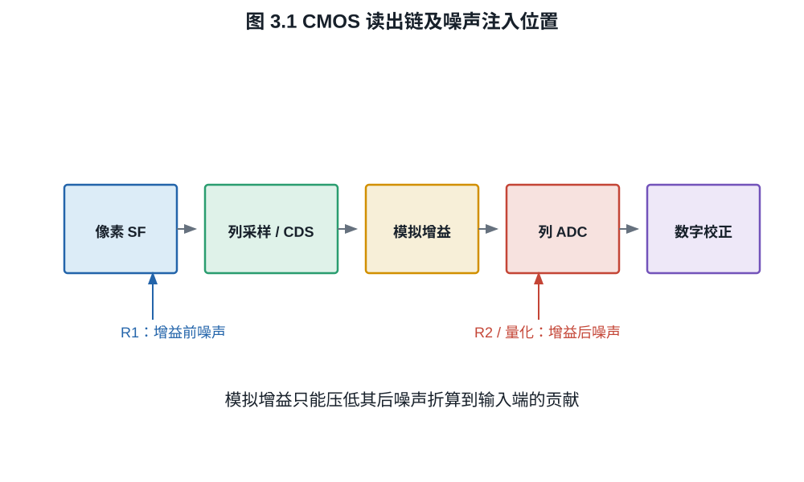
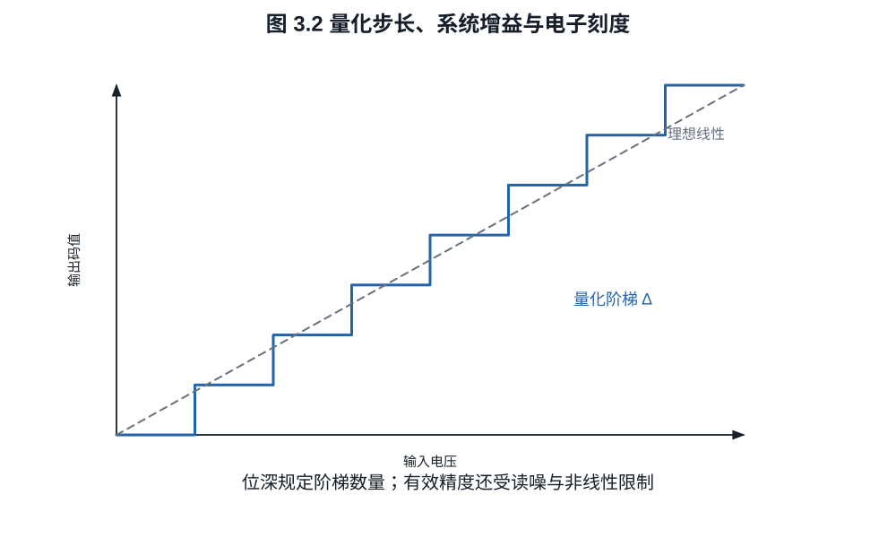

# 第三章：CMOS 像素、读出链与模数转换

光电二极管积累的是电子，RAW 文件保存的是整数码值。两者之间隔着浮动扩散节点、
源跟随器、列放大器、采样保持电路、模数转换器和数字校正。只看 RAW 位深判断动态
范围，相当于只看尺子的刻度数而不问尺子多长、起点在哪里以及测量本身有多抖。
一个 14 bit 文件可能先被满阱限制，也可能先被 ADC 白点限制；判断次序需要把每个
环节统一折算成电子数。

## 3.1 一个可计算的读出模型

先采用线性、未饱和的单通道模型。黑电平校正前数字输出写成

$$
Y=B+g_a g_c N_e+g_a R_1+R_2+Q.                            \tag{3.1}
$$

其中 $B$ 是数字黑电平，$g_c$ 是电荷到电压再到内部标度的转换，$g_a$ 是 ADC 前
模拟增益，$R_1$ 是增益前读出噪声，$R_2$ 是增益后噪声，$Q$ 是量化误差。把所有
增益合并为 $g$，并折算到电子域，可写成

$$
\widetilde Y=\frac{Y-B}{g}=N_e+R_e.                       \tag{3.2}
$$

式 (3.2) 是分析 RAW 的便利模型，不表示真实电路只有一个噪声源。输入等效噪声
$R_e$ 会随模拟增益、读出速度、温度和转换增益模式改变。

*图 3.1　噪声必须按其注入位置折算回输入电子域。增益之前的噪声会随信号一起
放大；增益之后的固定电压噪声可被前置模拟增益压低其输入等效值。*

**定义 3.1（系统增益）.** 在线性区内，黑电平校正后的平均 DN 对平均信号电子数
的斜率称为系统增益：

$$
g=\frac{d\mathbb E[Y]}{d\mu_e},\qquad [g]=\mathrm{DN}/e^-.
$$

有些资料把其倒数 $1/g$ 称为 conversion gain，单位 $e^-/\mathrm{DN}$。阅读规格时
必须连单位一起读，不能只看“gain”名称。

FD 复位本身还受电容热噪声约束。若电容 $C$ 在温度 $T$ 下经电阻性开关达到热平衡，
理想模型给出

$$
\operatorname{Var}(V_\mathrm{reset})=\frac{k_{\mathrm B}T}{C},
\qquad
\sigma_{N,\mathrm{reset}}=\frac{\sqrt{k_{\mathrm B}TC}}{q}. \tag{3.3}
$$

第二式把电压噪声通过 $N=CV/q$ 折算为电子。相关双采样能消去同一次复位在前后
样本中共有的随机偏置，但不能消去转移后新引入的源跟随器白噪声、列噪声和两次
采样之间不相关的噪声。式 (3.3) 因而是电容节点的起始模型，不是最终相机读噪公式。

## 3.2 列并行读出与 ADC

CMOS 像素通常按行选择，每列拥有采样和 ADC 资源。列并行结构允许许多列同时转换，
帧时间主要由行数、每行转换时间和附加消隐决定。常见单斜坡 ADC 把像素电压与线性
斜坡比较，并用计数器记录交叉时刻；其面积效率适合高列数，但转换时间随目标位数
增长。

**定义 3.2（理想量化步长）.** 满量程电压范围 $V_\mathrm{FS}$ 的 $b$ bit 均匀 ADC
具有步长

$$
\Delta=\frac{V_\mathrm{FS}}{2^b}.
$$

若输入相对于量化格足够平滑，舍入误差可近似为
$Q\sim\operatorname{Uniform}(-\Delta/2,\Delta/2)$，于是

$$
\operatorname{Var}(Q)=\frac{\Delta^2}{12}.                \tag{3.4}
$$

**证明.** 均值为零，并且

$$
\mathbb E[Q^2]
=\frac1\Delta\int_{-\Delta/2}^{\Delta/2}q^2\,dq
=\frac1\Delta\left[\frac{q^3}{3}\right]_{-\Delta/2}^{\Delta/2}
=\frac{\Delta^2}{12}.
$$

这个白噪声模型在信号几乎不跨码、存在强相关或确定性条纹时会失效。真实 ADC 还
有微分非线性、积分非线性、比较器偏置和列间固定差异。

*图 3.2　位深给出码格数量，系统增益决定每一格对应多少电子。若模拟噪声远小于
一格且没有抖动，均匀独立的量化噪声模型并不成立。*

## 3.3 位深、有效位数与电子刻度

假设线性可用范围从黑电平后 $0$ 到 $16\,000$ DN，系统增益为
$0.25\ \mathrm{DN}/e^-$，则数字白点对应

$$
Q_\mathrm{digital}=\frac{16\,000}{0.25}=64\,000\ e^-.
$$

若像素线性满阱只有 $45\,000\ e^-$，则先发生电荷饱和；若满阱为
$80\,000\ e^-$，则当前增益下 ADC 先剪切。改变模拟增益会改变二者相对位置。

**例子 3.3（14 bit 不等于 14 档）.** 14 bit 提供 $16\,384$ 个码。若黑电平噪声
标准差为 $4$ DN，可分辨下端不可能按一个码计算；若可用白点为 $15\,000$ DN，按
一倍 rms 噪声作下端，数字域比值为 $3750$，即

$$
\log_2(3750)\approx11.87\ \text{档}.
$$

若改用 SNR $=2$ 或固定图样噪声也计入，下端还会提高。位深只给出编码容器的理论
上限。

**定义 3.4（有效位数）.** 对满量程正弦测试，工程上常用信噪失真比换算 ADC 的
有效位数（ENOB）。它是 ADC 测试指标，不等于相机可记录的摄影动态范围；后者还受
光子噪声、像素饱和和图像处理影响。

## 3.4 模拟增益为什么有时有用

把式 (3.1) 中信号归一化回输入端，忽略量化误差，读出噪声方差为

$$
\sigma_{r,e}^2
=\sigma_{R_1,e}^2+\frac{\sigma_{R_2}^2}{(g_a g_c)^2}.     \tag{3.5}
$$

提高 ADC 前模拟增益 $g_a$ 不改变已经存在的光子散粒噪声，也不改变增益前噪声
$R_1$；它能压低增益后噪声折算到输入电子域的贡献，并让微弱信号跨越更多 ADC 码。
当第二项已经很小后，继续提高增益只会更早剪切高光。

这正是“ISO 不增加光”和“提高 ISO 有时能降低 RAW 输入等效读噪”可以同时成立的
原因。前者说的是光子与电子计数，后者说的是读出链中增益的位置。

## 3.5 黑电平、坏点与固定图样

相机通常保留光学黑区或遮光像素来估计黑电平。RAW 中的零码不必表示零电子；
负噪声摆动也需要由正的黑电平容纳。处理器减去每通道黑电平后才得到近似线性信号。

像素响应非均匀性（PRNU）可用乘性模型表示：

$$
Y_i=B_i+g(1+\delta_i)N_{e,i}+R_i,
$$

$B_i$ 是像素/列偏置，$\delta_i$ 是响应偏差。暗场能估计加性固定图样，均匀平场能
估计乘性固定图样。相机可能在 RAW 写入前已经做坏点替换、列校正或黑电平跟踪，
所以 RAW 不应被定义为“未经任何处理”。

## 3.6 读出速度的代价

提高帧率通常要求更短的行时间、更高 ADC 并行度、更高接口带宽或降低位深。电路
带宽增加会使积分噪声上升，较短转换时间也限制多重采样。具体传感器可通过更多列
ADC、堆栈逻辑和片上缓存缓解这种权衡，但没有“高速必然低画质”或“堆栈必然高
噪声”的普遍定理。必须比较同一传感器的读出模式及实测噪声。

更精确地说，若某节点的双边电压噪声功率谱密度为 $S_v(f)$，从该节点到采样值的
等效线性传递函数为 $H(f)$，则该节点贡献的方差为

$$
\sigma_v^2=\int_{-\infty}^{\infty}|H(f)|^2S_v(f)\,df.      \tag{3.6}
$$

提高带宽会改变 $H$；相关双采样则对低频与高频噪声赋予不同权重。只有给出噪声
谱和采样滤波，才能从“行时间缩短”定量推出读噪变化。

## 练习

**练习 3.1.** 一个 12 bit ADC 满量程为 $1.2\ \mathrm V$。计算量化步长和白噪声
模型下的量化噪声 rms。

**练习 3.2.** 某 RAW 黑电平为 512 DN，白点为 15,360 DN，系统增益
$0.4\ \mathrm{DN}/e^-$。计算可用数字跨度对应的电子数。若满阱为
$30\,000\ e^-$，哪一端先限制？

**练习 3.3.** 式 (3.5) 中 $\sigma_{R_1,e}=2\ e^-$，
$\sigma_{R_2}/g_c=8\ e^-$。分别计算 $g_a=1,2,4,8$ 时输入等效读噪。

**练习 3.4.** 对 $T=300$ K、$C=10$ fF 的复位节点，按式 (3.3) 计算复位电压
噪声 rms 和等效电子噪声。说明为何该结果不能直接当作 CDS 后相机读噪。
