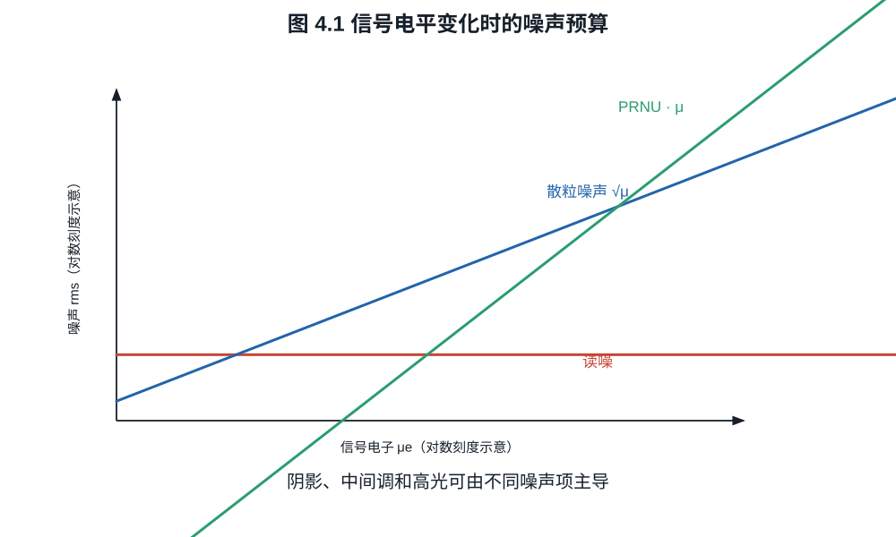
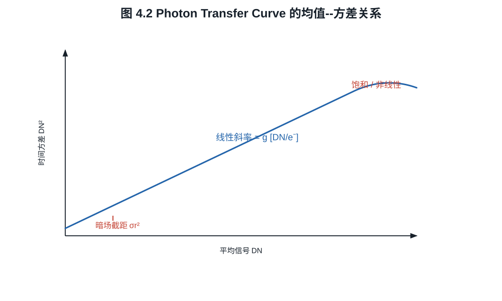
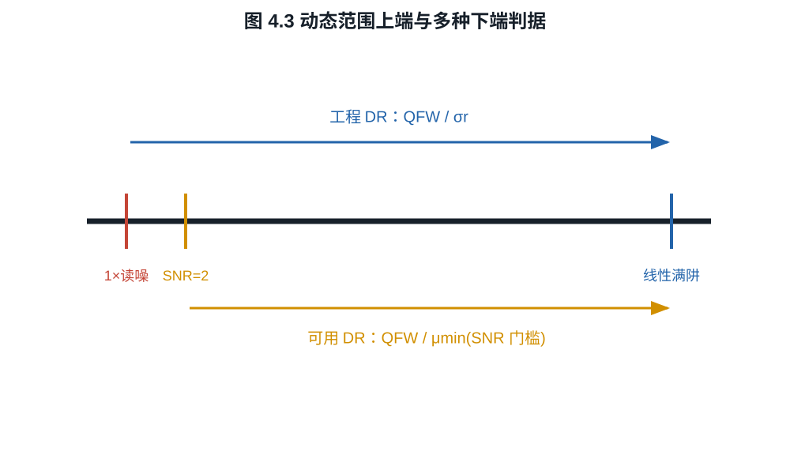

# 第四章：噪声、信噪比、满阱与动态范围

噪点不是一个数字。阴影里可能由读出噪声主导，中间调由光子散粒噪声主导，长曝光
还会出现暗电流与热像素，跨像素比较则加入固定图样。信噪比只有在这些对象和统计
范围固定后才可计算；动态范围也必须说明“最亮”和“最暗可用”分别怎样定义。
同一传感器报出 12.7 档或 14.3 档未必有人造假，差别可能只是下端采用了不同的
SNR 门槛；本章会把这项差异直接算出来。

## 4.1 单像素时间噪声模型

令一次曝光的信号电子
$S\sim\operatorname{Poisson}(\mu_s)$，暗电子
$D\sim\operatorname{Poisson}(\mu_d)$，读出噪声 $R$ 均值为零、方差
$\sigma_r^2$，三者独立。黑电平校正并折算到电子域后

$$
X=S+D-\mu_d+R.
$$

有

$$
\mathbb E[X]=\mu_s,\qquad
\operatorname{Var}(X)=\mu_s+\mu_d+\sigma_r^2.              \tag{4.1}
$$

**定义 4.1（单像素时间 SNR）.** 在上述模型中定义

$$
\mathrm{SNR}(\mu_s)
=\frac{\mu_s}{\sqrt{\mu_s+\mu_d+\sigma_r^2}}.             \tag{4.2}
$$

若报告 dB，取 $20\log_{10}\mathrm{SNR}$。式 (4.2) 不含 PRNU，因为它描述同一
像素重复曝光的时间涨落；若比较整幅均匀平场的像素总体，必须另加空间非均匀项。

*图 4.1　读噪在低信号区可主导，散粒噪声按信号平方根增长，PRNU 的空间标准差
近似按信号线性增长。三条线是否相交以及交点位置必须由实测参数决定。*

**命题 4.2（两种极限）.** 当 $\mu_s\ll\mu_d+\sigma_r^2$ 时，
$\mathrm{SNR}\approx\mu_s/\sqrt{\mu_d+\sigma_r^2}$；当
$\mu_s\gg\mu_d+\sigma_r^2$ 时，$\mathrm{SNR}\approx\sqrt{\mu_s}$。

**证明.** 分别在式 (4.2) 的分母中忽略相对于主导项渐近更小的量，即得两式。
$\square$

第一种极限中，信号随曝光线性增长而噪声近似不变；第二种极限中，信号与自身
Poisson 标准差同时增长，SNR 只按平方根增长。

## 4.2 暗电流、温度与长曝光

暗电流是无光时热激发等过程产生的电子流。若平均暗电流率为
$i_d\ [e^-\mathrm{/s}]$，曝光时间为 $t$，则

$$
\mu_d=i_d t,\qquad \sigma_d=\sqrt{i_d t}.                \tag{4.3}
$$

减去一张平均暗场可以去除平均偏置和部分固定图样，却不能删除当前曝光中已经发生的
Poisson 暗电流涨落。传感器温度升高通常显著增加 $i_d$；具体倍增规律依器件而定，
不能把“每升若干度翻倍”当作所有相机的定律。

**例子 4.3（短曝光与长曝光）.** 设 $\sigma_r=2\ e^-$，暗电流率
$0.1\ e^-\mathrm{/s}$，信号率 $20\ e^-\mathrm{/s}$。

曝光 $1$ s 时，$\mu_s=20$、$\mu_d=0.1$，

$$
\mathrm{SNR}=\frac{20}{\sqrt{20+0.1+4}}\approx4.07.
$$

曝光 $100$ s 时，$\mu_s=2000$、$\mu_d=10$，

$$
\mathrm{SNR}=\frac{2000}{\sqrt{2000+10+4}}\approx44.6.
$$

时间延长百倍，SNR 接近提高十倍，说明长曝光已进入散粒噪声主导区；暗电流虽然
增加，却不是本例主导项。

## 4.3 空间噪声与 PRNU

若均匀平场下第 $i$ 个像素的响应为 $(1+\delta_i)\mu_s$，并设
$\operatorname{Var}(\delta_i)=\sigma_\mathrm{PRNU}^2$，跨像素总体方差近似为

$$
\sigma_\mathrm{total}^2
=\mu_s+\mu_d+\sigma_r^2
+\sigma_\mathrm{PRNU}^2\mu_s^2.                           \tag{4.4}
$$

最后一项按信号平方增长，因此在高曝光区可能主导。平场校正可估计并除去稳定的响应
差异，但校准噪声、温漂、镜头暗角和非线性会限制校正精度。

这也解释了为什么单张均匀图的像素标准差不能直接当成读出噪声：它混入散粒噪声和
固定图样。应使用成对平场的差分来消除稳定空间结构。

暗信号非均匀性（dark signal non-uniformity, DSNU）是遮光、固定温度和固定曝光
时间下，各像素平均暗输出的空间标准差；PRNU 则通常报告平场响应的相对空间标准差。
二者都必须先用多帧平均压低时间噪声。设 $M$ 帧校准图的像素平均为 $\bar Y_i$，则
观测空间方差包含真实固定差异和约 $\sigma_t^2/M$ 的残余时间方差。直接用一帧图
报告 DSNU 或 PRNU 会系统性高估固定图样。

## 4.4 Photon Transfer Curve

设黑电平校正后的数字值满足

$$
Y=gS+R_Y,\qquad [g]=\mathrm{DN}/e^-.
$$

在散粒噪声主导且线性时

$$
\mathbb E[Y]=g\mu_s,\qquad
\operatorname{Var}(Y)=g^2\mu_s+\sigma_{R_Y}^2
=g\mathbb E[Y]+\sigma_{R_Y}^2.                            \tag{4.5}
$$

因此方差对均值图的线性段斜率就是 $g$。这就是光子转移法的核心。

*图 4.2　只有去除黑电平、避开低端量化区和高端非线性区后的线性段用于估计
$g$。接近饱和时方差回落不表示噪声突然改善，而是剪切压缩了分布。*

**命题 4.4（成对平场差分）.** 两张独立、同曝光平场为
$Y_1=F+N_1$、$Y_2=F+N_2$，其中固定图样 $F$ 相同，随机噪声方差均为
$\sigma^2$，则

$$
\frac12\operatorname{Var}(Y_1-Y_2)=\sigma^2.
$$

**证明.** 差分消去 $F$。由独立性，
$\operatorname{Var}(N_1-N_2)=\sigma^2+\sigma^2=2\sigma^2$；除以 $2$ 即得。
$\square$

实际测量应对多个曝光级别重复：暗场估计读噪与黑电平，平场差分估计时间方差，
均值--方差斜率估计系统增益，接近饱和处寻找线性偏离和白点。EMVA 1288 给出了更
完整的测量条件、拟合和不确定度规范。

一套可复核的 PTC 流程如下。这里 $\langle\cdot\rangle_R$ 表示在固定 ROI 内取空间
平均，$\operatorname{Var}_R$ 表示同一 ROI 内的样本方差。

1. 固定温度、读出模式、位深、增益、黑电平处理和照明光谱；关闭会随帧变化的
   降噪与自动曝光。
2. 对每个曝光级 $k$ 拍摄至少一对独立平场 $F_{k,1},F_{k,2}$，并拍摄同曝光时长的
   暗场。照明必须在 ROI 内稳定；缓慢梯度可在两帧差分中抵消，但会污染空间 PRNU。
3. 以暗场均值 $b_k$ 校正信号均值

   $$
   m_k=\left\langle\frac{F_{k,1}+F_{k,2}}2\right\rangle_R-b_k,             \tag{4.5a}
   $$

   并由成对差分估计单帧时间方差

   $$
   v_k=\frac12\operatorname{Var}_R(F_{k,1}-F_{k,2}).                       \tag{4.5b}
   $$

4. 在线性、未饱和且量化不主导的区间拟合 $v_k=a m_k+c$。若 $m,v$ 的单位分别为
   DN 与 DN$^2$，则 $g=a\ [\mathrm{DN}/e^-]$，读噪为
   $\sigma_{r,e}=\sqrt c/g$。拟合截距若为负，不能开平方；这通常提示区间、暗场
   扣除、相关噪声或回归模型有问题。
5. 由 $m_k/g$ 换算电子数，寻找均值偏离低曝光线性外推达到预先规定阈值（例如
   $1\%$）的位置，报告“线性满阱”；另行报告数字剪切白点，不能把二者混称。
6. 更换 ROI、重复采集并保留残差图。斜率置信区间、照明漂移、温度漂移、空间相关
   和坏点剔除规则都应进入不确定度说明。

若要估计 PRNU，可用许多平场的平均图先移除照明渐变和暗信号，再从剩余空间方差中
扣除平均后仍残留的时间方差；结果除以平均信号得到相对 PRNU。该步骤对去趋势模型
敏感，因此必须同时展示校正前后残差图，而不能只给一个百分数。

## 4.5 动态范围必须指定下端

若上端取线性满阱 $Q_\mathrm{FW}$，下端取一次读出噪声 rms $\sigma_r$，常见工程
定义是

$$
\mathrm{DR}_{\mathrm{stop}}
=\log_2\frac{Q_\mathrm{FW}}{\sigma_r},
\qquad
\mathrm{DR}_{\mathrm{dB}}
=20\log_{10}\frac{Q_\mathrm{FW}}{\sigma_r}.               \tag{4.6}
$$

*图 4.3　上端可取线性满阱、指定非线性点或数字剪切；下端可取一倍读噪、指定
SNR 或视觉可用阈值。未同时声明两端，单个“档数”不可严格比较。*

二者满足一档约为 $6.0206$ dB。

**例子 4.5.** $Q_\mathrm{FW}=50\,000\ e^-$、
$\sigma_r=2.5\ e^-$ 时，

$$
\mathrm{DR}=\log_2(20\,000)\approx14.29\ \text{档}
$$

或 $86.0$ dB。若最低可用信号要求 $\mathrm{SNR}=2$，且忽略暗电流，由

$$
\frac\mu{\sqrt{\mu+\sigma_r^2}}=2
$$

得到 $\mu^2-4\mu-4\sigma_r^2=0$，正根为

$$
\mu_\min=2+2\sqrt{1+\sigma_r^2}\approx7.39\ e^-.
$$

此时可用动态范围变成
$\log_2(50\,000/7.39)\approx12.72$ 档。相同传感器因下端判据不同，数值相差
超过一档半。

## 4.6 多像素与缩图 SNR

若 $n$ 个像素观察相同均匀信号，每个均值 $\mu$、独立噪声方差 $\sigma^2$，求和后
信号 $n\mu$、噪声 $\sqrt n\sigma$，故 SNR 提高 $\sqrt n$。取平均后信号仍为
$\mu$、噪声变为 $\sigma/\sqrt n$，结论相同。

相关噪声不会按此速度下降。若任意两像素噪声协方差为 $\rho\sigma^2$，则平均值
方差为

$$
\operatorname{Var}(\bar X)
=\frac{\sigma^2}{n}[1+(n-1)\rho].                         \tag{4.7}
$$

当 $\rho>0$ 时，增加像素的收益受限。固定图样、行列条纹、去马赛克和降噪都会引入
空间相关，所以“缩小到同尺寸可获得严格 $\sqrt n$ 改善”只是独立模型的上手计算，
不是无条件承诺。

## 练习

**练习 4.1.** 设 $\mu_s=100\ e^-$、$\mu_d=4\ e^-$、
$\sigma_r=3\ e^-$，计算式 (4.2) 的 SNR 和 dB 值。

**练习 4.2.** 一组平场数据满足方差--均值拟合
$s_Y^2=0.5\bar Y+9$，单位均为 DN。求系统增益 DN/e$^-$ 和输入等效读噪。

**练习 4.3.** 传感器满阱为 $32\,000\ e^-$，读噪为 $1.6\ e^-$。分别按
SNR 下端为 $1$ 和 $2$ 计算动态范围，忽略暗电流。

**练习 4.4.** 某组成对平场按式 (4.5a)--(4.5b) 得到拟合
$v=0.20m+4.0$，$m$ 的单位为 DN、$v$ 的单位为 DN$^2$。求系统增益和输入等效
读噪。若线性偏离点为 12,000 DN，估计线性满阱。
