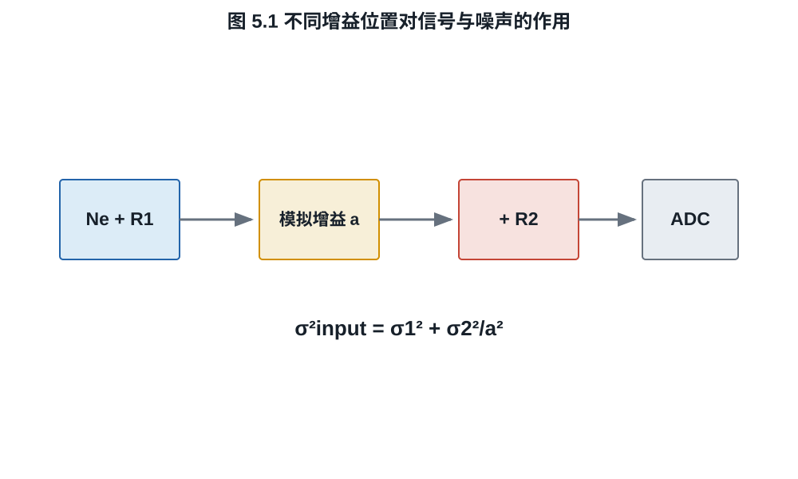
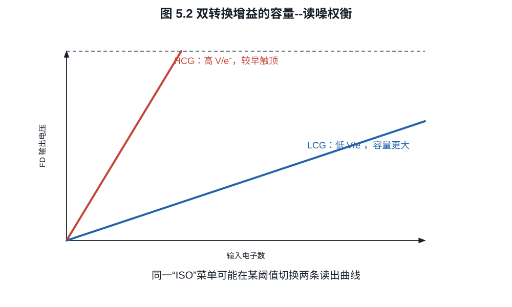
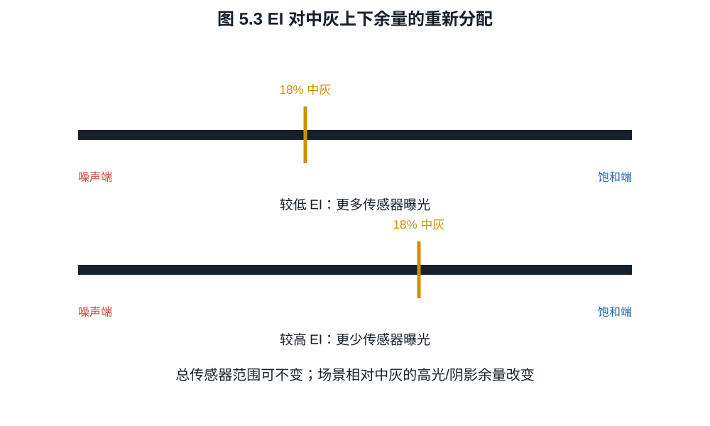

# 第五章：ISO、曝光指数、增益与“双原生”

胶片时代的感光度把材料响应与曝光表联系起来；数字相机里，曝光后的电子还可被
模拟放大、数字乘法和色调映射。于是同一个 ISO 数字既参与测光，又可能切换传感器
电路，还决定 JPEG 的输出亮度。若不拆开这些作用，“ISO 是否制造噪声”不会有单一
答案。

## 5.1 ISO 首先是曝光与输出的约定

ISO 12232 为数字静态相机规定曝光指数、ISO speed rating、标准输出感度和推荐曝光
指数等测定方法。标准解决的是相机如何与曝光表和输出亮度约定协同，不把 ISO 定义
成硅片的一项唯一材料常数。

在简化反射式测光模型中，场景亮度固定时，相机建议的曝光组合满足

$$
\frac{N^2}{t}\propto LS,                                  \tag{5.1}
$$

$S$ 是选定 ISO/曝光指数。把 $S$ 加倍，测光系统通常要求 $t/N^2$ 减半，即少收一档
光。输出处理再把较小的传感器信号映射到相似的中灰亮度。

**定义 5.1（曝光指数）.** 本书把曝光指数（exposure index, EI）视为摄影者或相机
选择的曝光标定：它规定哪一级场景曝光应被映射为参考中灰。EI 可以与某个标准化
ISO speed rating 相同，也可以出于高光或阴影分配而有意偏离。

这一点在电影摄影尤其重要：摄影师可以用 EI 改变测光和监看，而传感器模拟工作模式
保持不变。此时 EI 是如何放置中灰的决定，不是传感器突然改变了量子效率。

## 5.2 四种不同的“增益”

至少应区分：

1. 光电转换：量子效率 $\eta$，单位 photon 到 electron；
2. 电荷转换增益：$K\approx q/C_\mathrm{FD}$，单位 V/e$^-$；
3. ADC 前模拟增益：$a$，放大电压；
4. ADC 后数字增益：$d$，直接乘码值。

设信号电子均值为 $\mu$，散粒噪声方差为 $\mu$，增益前附加读噪为
$\sigma_1^2$，增益后噪声折算到 $a=1$ 的电子刻度为 $\sigma_2^2$。经模拟增益后再
归一化回输入端，SNR 为

$$
\mathrm{SNR}(a)
=\frac{\mu}{\sqrt{\mu+\sigma_1^2+\sigma_2^2/a^2}}.        \tag{5.2}
$$

数字增益 $d$ 若位于所有噪声之后，会同时乘信号和噪声，不改变式 (5.2)；它只改变
码值利用和可能的舍入。

*图 5.1　“增益”必须附带位置。后级数字乘法不能改善已形成的输入 SNR；ADC 前
模拟增益只可能压低其后噪声的输入等效贡献，并会更早触及后级满量程。*

**命题 5.2（模拟增益收益的上限）.** 在式 (5.2) 的模型中，SNR 随 $a>0$ 单调
不减，且

$$
\lim_{a\to\infty}\mathrm{SNR}(a)
=\frac{\mu}{\sqrt{\mu+\sigma_1^2}}.
$$

**证明.** 分母平方中的 $\sigma_2^2/a^2$ 随 $a$ 单调下降且趋于零，分子不变，
结论成立。$\square$

收益不是免费的。若后级最大输入摆幅固定为 $V_\max$，系统在电子域的数字剪切点
近似按 $1/a$ 下降。高 ISO 可能降低后级读噪影响，同时减少当前映射下的高光余量。

## 5.3 ISO invariance 的准确含义

所谓 ISO invariant 通常指：在一定 ISO 区间内，以较低 ISO 欠曝记录，再在 RAW
处理中数字提亮，所得阴影噪声与拍摄时提高 ISO 接近。这意味着该区间内模拟增益前
噪声占主导，或相机在不同 ISO 下主要改变数字标记。

**例子 5.3.** 取 $\mu=16\ e^-$、$\sigma_1=1.5\ e^-$、
$\sigma_2=6\ e^-$。由式 (5.2)：

$$
\mathrm{SNR}(1)=\frac{16}{\sqrt{16+2.25+36}}\approx2.17,
$$

$$
\mathrm{SNR}(4)=\frac{16}{\sqrt{16+2.25+2.25}}\approx3.53,
$$

极限为 $16/\sqrt{18.25}\approx3.75$。从增益 $1$ 到 $4$ 收益明显，之后迅速饱和。
若 $\sigma_2$ 原本只有 $0.5\ e^-$，提高模拟增益几乎没有收益。

ISO invariance 不是“任何 ISO 都一样”，也不表示欠曝没有代价。若提高 ISO 导致测光
减少实际曝光，则电子数已经减少；后期提亮不能恢复未收集的光子。

## 5.4 基础 ISO 与原生 ISO

“基础 ISO”（base ISO）在不同系统中常指以下某一种：

- 不施加额外模拟增益的标称 ISO；
- 当前读出模式下获得最大总动态范围的曝光标定；
- Log 曲线能编码完整目标范围的最低 EI；
- 厂商推荐的最佳画质工作点。

这些定义可能给出同一个数字，也可能不同。Sony 的创作者资料把 base ISO 解释为
提供最大 latitude、避免不必要增益的感度；ARRI 则强调 EI 对中灰与固定传感器范围
的分配。讨论具体相机时应引用该厂商对该模式的定义。

**定义 5.4（本书操作口径）.** 若没有厂商更精确说明，本书只在给出读出模式后使用
“基础 ISO”：它表示该模式下厂商用于标准曝光与中灰映射的参考 EI。“原生 ISO”只
作为产品术语引用，不据此推断噪声或动态范围。

## 5.5 双转换增益、双基础 ISO 与双增益输出

双转换增益（dual conversion gain, DCG）改变浮动扩散节点的有效电容。由
$K=q/C_\mathrm{FD}$：

- 高转换增益 HCG 使用较小电容，V/e$^-$ 较大，输入等效后级噪声较低；
- 低转换增益 LCG 使用较大电容，通常容纳更多电子或保留更大电压余量。

如果相机在某个 ISO 阈值切换 HCG，读噪曲线会出现台阶。厂商可能把两个工作区的
参考 EI 称为“双原生 ISO”或“双基础 ISO”。这表示两套低噪声工作点，不表示两种
量子效率，也不保证两个 ISO 拥有完全相同的高光容量。

双增益输出（dual gain output, DGO）又是另一结构：同一次像素信号沿高、低增益
通道读出并融合，以同时利用阴影低噪和高光容量。它不是简单地在两次拍摄之间切换
基础 ISO。

*图 5.2　HCG 与 LCG 是两条电荷到电压的工作曲线。曲线切换点、光电二极管满阱、
FD 容量和 ADC 白点共同决定实际剪切点，不能由“双原生 ISO”名称反推。*

**例子 5.5（转换增益权衡）.** 假设允许 FD 电压摆幅为 $0.8$ V。
LCG 为 $20\ \mu\mathrm V/e^-$，理论电压容量为 $40\,000\ e^-$；HCG 为
$80\ \mu\mathrm V/e^-$，容量为 $10\,000\ e^-$。若后级电压噪声为
$80\ \mu\mathrm V$，折算读噪分别为 $4\ e^-$ 和 $1\ e^-$。两模式各自改善了
动态范围的一端，融合或模式切换才能利用两者。

*图 5.3　若传感器读出模式不变，改变 EI 可以移动中灰在固定传感器范围中的位置；
若相机同时改变实际曝光或模拟模式，则还须分别计算电子数与剪切点。*

## 5.6 选 ISO 时实际损失什么

固定光圈和快门，提高 ISO 而未剪切时，不改变已经收集的电子，主要改变读出与输出
映射；损失可能是更早的 ADC/编码剪切。若同时按测光减少曝光，提高 ISO 的主要代价
是更少光子：在散粒噪声区少一档光使 SNR 降为原来的 $1/\sqrt2$。在读噪区，下降
可能更严重，也可能被模拟增益降低后级噪声部分抵消。

因此没有“ISO 本身产生噪声”的普遍因果句。可检验的问题应写成：在同一场景、同一
曝光量、同一 RAW 归一化和某个读出模式下，改变 ISO 后输入等效读噪、剪切点和量化
怎样变化。

下表把最常混淆的实验分开。表中的“相同亮度”指经过统一 RAW 归一化后的比较，
不是直接比较相机 JPEG。

| 实验控制 | 实际电子数 | 模拟读出可能改变 | 可回答的问题 |
|---|---:|---:|---|
| 固定光圈、快门、照明，只改 ISO | 近似不变 | 是 | 增益位置、读噪台阶、剪切映射 |
| 按测光随 ISO 减少曝光 | 随 ISO 升高而下降 | 是 | 摄影工作流中的总画质代价 |
| 固定传感器模式，只改 EI/监看 LUT | 不变，除非操作者据此改曝光 | 否 | 中灰与高低端余量分配 |
| 低 ISO RAW 后期提亮对比高 ISO RAW | 需先保证曝光相同 | 是 | 指定区间内的 ISO invariance |

因此一项 ISO 测试若没有同时公布光圈、快门、照度、RAW 白点、黑电平和读出模式，
通常不足以支持因果结论。

## 练习

**练习 5.1.** 在式 (5.2) 中取 $\mu=25$、$\sigma_1=2$、$\sigma_2=8$，计算
$a=1,2,4,8$ 的 SNR，并与极限比较。

**练习 5.2.** 在散粒噪声主导区，按测光把 ISO 从 400 提到 1600，同时减少两档
曝光。信号电子数和 SNR 分别变为原来的多少？

**练习 5.3.** 解释为什么“双基础 ISO 800/4000”不能单独推出 ISO 4000 与 ISO 800
具有相同满阱容量或相同高光余量。
