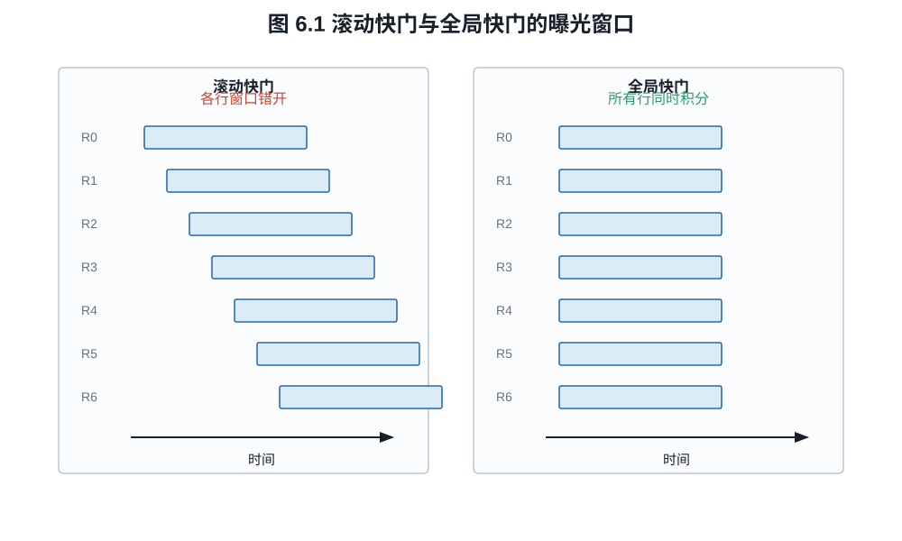
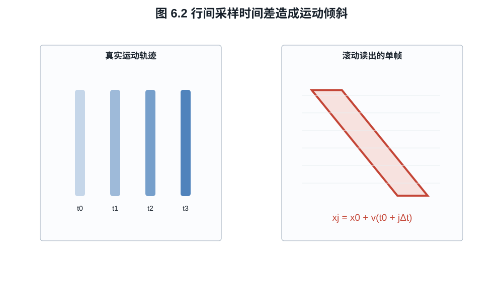
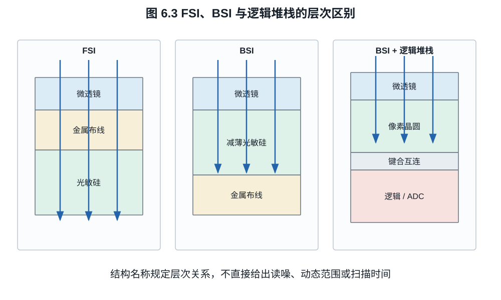
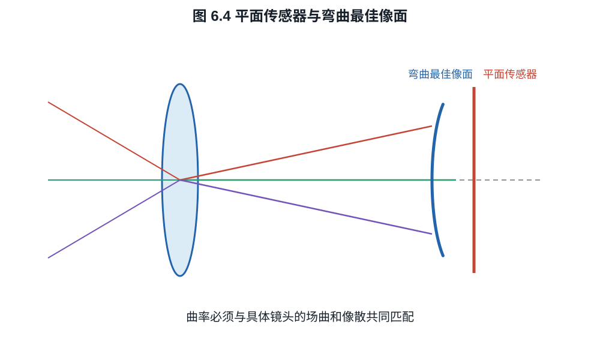

# 第六章：滚动/全局快门、背照、堆栈与曲面传感器

“电子快门”只说明曝光由电子方式控制，不说明全画面是否同时采样。背照描述光从
硅片哪一侧进入，堆栈描述不同功能晶圆怎样连接，全局快门描述时间采样方式。它们
可以在同一传感器中组合，却属于三个正交问题。
一根快速移动的竖杆会把这一区分变成可测时间差：曝光很短仍可能倾斜，而同时结束
积分的全局采样可以消除这种行间几何偏移。

## 6.1 曝光窗口与读出窗口

设第 $j$ 行曝光开始时间为 $t_j$、曝光持续时间为 $T_e$。该行记录的时域信号是

$$
I_j(x)=\int_{t_j}^{t_j+T_e}L(x,y_j,t)\,dt.                \tag{6.1}
$$

**定义 6.1（滚动快门）.** 若不同行的 $t_j$ 系统性不同，通常近似
$t_j=t_0+j\Delta t$，称为滚动快门（rolling shutter）。从第一行到最后一行的开始
时间差称为扫描时间或 readout time，不能与单行曝光时间 $T_e$ 混为一谈。

**定义 6.2（全局快门）.** 若所有像素的有效曝光窗口在规定容差内同时开始和结束，
然后把电荷或电压存储并依次读出，称为全局快门（global shutter）。后续数据仍可逐
行输出；“全局”修饰采样时间，不要求所有 bit 同时离开芯片。

*图 6.1　浅色条表示各行积分窗口。滚动快门的窗口沿行号错开；全局快门可以在
积分结束后继续逐行搬运数据，故输出带宽与采样同步性是不同问题。*

## 6.2 滚动快门的几何畸变

考虑一根竖直直杆以像面速度 $v$ 水平移动。其在时刻 $t$ 的位置为
$x(t)=x_0+vt$。若每行在 $t_j=t_0+j\Delta t$ 的短曝光中采样，则记录位置

$$
x_j=x_0+v(t_0+j\Delta t).                                 \tag{6.2}
$$

于是杆在图像中成为斜线，斜率与 $v\Delta t$ 成正比。缩短曝光时间可以减小每行内
运动模糊，却不能消除式 (6.2) 的行间倾斜；必须缩短扫描时间或改用全局采样。

*图 6.2　短曝光只缩短每一行自身的时间平均窗口；只要各行中心时刻不同，匀速
运动仍按式 (6.2) 形成几何剪切。*

**例子 6.3（扫描时间与倾斜量）.** 一幅 2160 行图像的相邻行起始时间差为
$8\ \mu\mathrm s$。首行与末行的起始时刻差为

$$
T_\mathrm{scan}=(2160-1)\times8\ \mu\mathrm s
=17.272\ \mathrm{ms}.
$$

若物体在传感器采样网格上的水平速度为 $12\,000$ pixel/s，则首末行记录位置相差
$12\,000\times0.017272\approx207.3$ pixel。把单行曝光从 $1/500$ s 缩到
$1/4000$ s 会减少杆在每一行内的模糊长度，却不会改变这约 207 pixel 的首末行
位移；只有行周期或有效读出行数改变时，扫描畸变才随之改变。

周期照明也会与 $t_j$ 相互作用。若灯光为 $L(t)=L_0[1+m\cos(2\pi f_m t)]$，不同
行对不同相位积分，形成明暗条带。曝光时间、扫描时间和灯具调制频率共同决定条纹，
“快门速度避开频闪”需要按具体频率计算。

## 6.3 全局快门为何曾经付出画质代价

全局快门像素需要在曝光结束后临时存储所有像素的信号，并在读出期间遮光。额外
存储节点、转移门和遮光结构占面积，也可能引入寄生电容、暗电流、漏光和额外转移
噪声。在前照小像素中，这会挤压光电二极管的填充因子。

背照与堆栈能缓解面积冲突：感光层从背面接收光，晶体管和存储可在另一侧或另一
晶圆上获得空间。Sony Pregius S 是背照、堆栈与全局快门结合的具体工业实现。但
是否达到某一动态范围，仍取决于满阱、读噪和寄生光灵敏度的测量，而不是“全局”
二字。

机械焦平面快门也可产生类似滚动的时间差：狭缝扫过画面时，不同位置曝光不同步。
所谓全局快门的优势是无需机械狭缝也能在整个焦面同时结束积分，并允许高速闪光同步；
实际同步仍受触发延迟、闪光持续时间和相机接口约束。

## 6.4 前照、背照、微透镜与 DTI

**定义 6.3（前照与背照）.** 前照式（front-side illuminated, FSI）传感器中，
入射光先经过布线与晶体管所在表面再到光敏硅；背照式（back-side illuminated,
BSI）把晶圆减薄，从硅背面入光，使光路避开前侧金属层。

BSI 通常提高小像素的填充效率和斜入射接受能力，但不是无条件提高所有波长 QE。
晶圆减薄、背面钝化、反射、吸收深度和串扰仍需设计。微透镜把像素上方较大区域的
光集中到有效感光区；它改变的是光学收集效率与角度响应，不扩大几何像素节距。

深沟槽隔离（deep trench isolation, DTI）在像素之间形成光学/电学边界，减少光子
或载流子横向进入相邻像素。其收益可表现为较低串扰和较高高频 MTF，但沟槽本身也
占据面积并影响满阱和工艺应力。Hamamatsu 的 BSI qCMOS 资料给出了 BSI、DTI 和
微透镜共同工作的具体截面案例。

## 6.5 “堆栈”到底堆了什么

**定义 6.4（堆栈 CMOS）.** 若像素/光电二极管层与逻辑处理层分别制造，并通过
晶圆键合、硅通孔或高密度互连连接，称为堆栈式 CMOS。互连粒度可以是外围、列级，
也可以接近像素级。

*图 6.3　FSI/BSI 规定入光侧与布线层的相对位置，堆栈规定像素晶圆与逻辑晶圆
分离。层次名称本身不直接给出读噪、动态范围或扫描时间；图为结构示意，不按比例。*

把逻辑移到独立晶圆可以提供：

- 更多或更快的列 ADC；
- 片上缓存，先高速捕获再较慢输出；
- 相位检测、HDR 或神经网络等处理逻辑；
- 为像素层选择不同制造工艺。

代价包括键合良率、功耗、热密度、成本和互连复杂度。部分堆栈只分离一部分高速
电路；“部分堆栈”与“全堆栈”不是统一标准术语，必须查看芯片截面和读出数据。

## 6.6 曲面传感器与场曲

普通镜头的最佳成像面通常不是平面。近轴像差理论用 Petzval 和描述各折射面的场曲
贡献；对折射面 $j$，一个常见符号约定下的 Petzval 和为

$$
\mathcal P=\sum_j
\frac{n_{j+1}-n_j}{n_j n_{j+1}R_j}.                      \tag{6.3}
$$

*图 6.4　弯曲传感器只有在曲率、像散两主截面和具体镜头的离轴最佳焦面匹配时才
可能减少场曲校正负担。蓝色曲线不代表所有镜头共有的固定球面。*

其符号依半径和传播方向约定，实际最佳像面还受像散影响。平面传感器迫使镜头用额外
镜片和像差平衡去压平焦面。

若传感器弯成接近最佳像面的球面，可释放一部分场曲校正自由度，并改善边缘清晰度、
相对照度或镜头体积。Guenter 等人的 2017 年原型证明减薄商用 CMOS 可被气压成形为
高精度曲面并保持功能；这证明工艺可行性，不表示所有镜头只需弯传感器就会更好。

曲率必须与具体镜头设计匹配。可换镜头系统中，不同镜头有不同场曲和像散；固定曲率
可能帮助一支镜头却损害另一支。晶圆应力、封装、热循环、产率和标定也比平面芯片
复杂。曲面本身不增加光子能量，只通过允许更合适的光学设计间接改变收集和成像。

**例子 6.5（不能由结构名推出性能）.** 设传感器 A 为 BSI 滚动快门，实测扫描时间
8 ms、读噪 $2.0\ e^-$；传感器 B 为堆栈式 BSI 全局快门，扫描采样同步，但读噪
$3.2\ e^-$。由结构定义只能断定 B 的有效曝光窗口更同步以及它具有独立逻辑层，
不能断定 B 的读噪更低。反过来，A 的较低读噪也不能消除其 8 ms 行间时间差。
这类比较必须把时序、噪声、满阱和量子效率拆成独立测量列。

## 练习

**练习 6.1.** 一台相机有 3000 行，行时间差 $10\ \mu\mathrm s$。计算首末行开始
曝光的时间差。物体像面速度为 $5000$ pixel/s 时，首末行位置相差多少像素？

**练习 6.2.** 说明为什么电子快门可以是滚动快门，机械快门也可能产生焦面扫描
畸变。

**练习 6.3.** 分别写出 BSI、堆栈和全局快门直接规定的结构或时序，以及它们不能
单独推出的一个性能指标。
