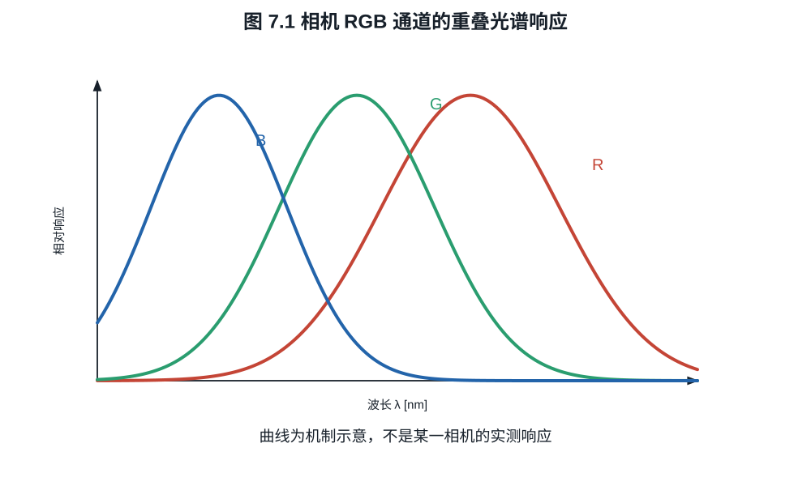
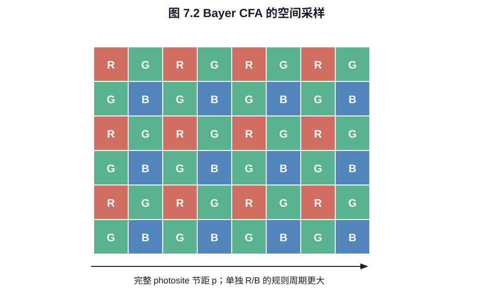
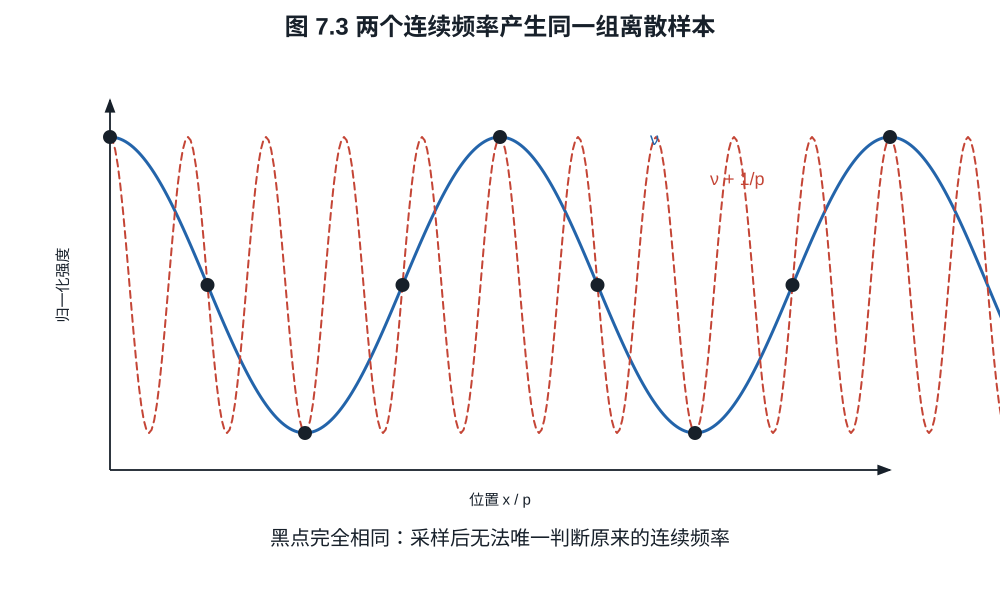

# 第七章：色彩滤阵、采样、去马赛克与色彩矩阵

一个 Bayer 像素并没有同时测出红、绿、蓝。每个感光单元只产生一个由场景光谱、
镜头透射、滤色片和硅响应共同加权的数。所谓 RAW 颜色是在这些不完整样本上，结合
邻域结构、白平衡和颜色标定逐步构造出来的。
细密织物上的摩尔纹和钨丝灯下被放大的蓝通道噪声，分别暴露了空间采样与光谱采样
的欠定性；它们不能只靠“更高像素”一项解释。

## 7.1 相机通道是光谱积分

设落到像点的光谱曝光为 $H_\lambda(\lambda)$，第 $k$ 类滤色单元的总光谱响应为
$s_k(\lambda)$，则其平均电子数可抽象为

$$
c_k=\int_0^\infty H_\lambda(\lambda)s_k(\lambda)\,d\lambda. \tag{7.1}
$$

$s_k$ 已包含光子能量换算、镜头/盖玻璃透射、滤色片和 QE。相机获得有限个积分，
不能从三个数唯一恢复无限维光谱。

**命题 7.1（相机同色异谱的存在）.** 对任意三个线性独立响应函数
$s_R,s_G,s_B$，存在非零光谱扰动 $q(\lambda)$，使

$$
\int q(\lambda)s_k(\lambda)\,d\lambda=0,
\qquad k\in\{R,G,B\}.
$$

**证明.** 在有界波长区间内取四个线性独立、有界且紧支的函数，其张成空间记为
$V$，则 $\dim V=4$。线性映射

$$
T:V\longrightarrow\mathbb R^3,\qquad
T(q)=(\langle q,s_R\rangle,\langle q,s_G\rangle,\langle q,s_B\rangle)
$$

的秩至多为 $3$。秩--零化度定理给出 $\dim\ker T\ge1$，故存在有界紧支的
$q\ne0$ 使三个积分均为零。设 $K$ 包含 $q$ 的支集，取
$H_0=M\mathbf1_K$，其中 $M>\varepsilon\lVert q\rVert_\infty$。则
$H_0$ 与 $H_0+\varepsilon q$ 是两个不同的非负光谱，且它们的三个相机通道积分
相同。$\square$

这意味着两种物体光谱可给相机相同 RGB，却在人眼或另一相机下不同。颜色矩阵只能
在指定照明和训练色样上求近似映射。



*图 7.1　通道曲线是机制示意，并非某一传感器的标定数据。每个 RAW 通道都是场景
光谱与整条光谱响应的积分；曲线重叠是颜色估计所必需，也造成同色异谱。*

## 7.2 Bayer 阵列与空间采样

常见 Bayer 单元为

```text
R G
G B
```

绿色采样密度较高，与人类亮度感知和常见自然光谱的工程权衡有关。每个位置仍只测
一个通道。若像素节距为 $p$，完整感光格的一维采样频率为 $1/p$，Nyquist 频率为
$1/(2p)$；但单独红、蓝通道的规则采样间隔更大，其无混叠带宽更低。



*图 7.2　每个格子只保存一个滤色通道的样本。去马赛克后的每像素 RGB 是邻域估计，
不能把输出 RGB 像素数直接解释为每通道独立测量数。*

采样前连续像首先经过镜头 PSF、像素孔径积分和可能的光学低通滤镜（OLPF）。用
$I(x,y)$ 表示连续像、$a(x,y)$ 表示像素孔径，理想采样为

$$
y[m,n]=\iint I(x,y)a(x-mp,y-np)\,dx\,dy.                 \tag{7.2}
$$

像素不是几何点，而是对面积积分；其矩形孔径 MTF 含 sinc 因子。微透镜与电荷扩散
会进一步改变有效孔径。

## 7.3 去马赛克不是“恢复原值”

去马赛克（demosaicing）根据邻域样本估计每个位置缺失的两个通道。最简单的双线性
方法在红像素位置用周围绿色平均估计绿，用对角蓝平均估计蓝。例如

$$
\widehat G_{m,n}
=\frac14(G_{m-1,n}+G_{m+1,n}+G_{m,n-1}+G_{m,n+1}).        \tag{7.3}
$$

若局部颜色平滑，式 (7.3) 可用；若穿过高对比边缘，它会跨边缘混合，产生彩边和
拉链伪影。现代算法会估计边缘方向、通道相关性或利用学习先验，但没有算法能从发生
混叠的单个样本唯一恢复所有可能原图。

**例子 7.2（超过 Nyquist 的条纹）.** 一维正弦
$I(x)=1+\cos(2\pi\nu x)$ 在点 $x=np$ 采样。对任意整数 $k$，频率
$\nu'=\nu+k/p$ 给出

$$
\cos(2\pi\nu'np)
=\cos(2\pi\nu np+2\pi kn)
=\cos(2\pi\nu np).
$$

所以多个连续频率产生完全相同样本。摩尔纹不是“分辨率不够导致模糊”，而是高频被
错误折回低频。OLPF 通过采样前衰减高频降低混叠，代价是原始锐度下降。



*图 7.3　采样点相同意味着仅由样本无法判定原连续频率。锐化不能区分真实高频与
已折叠的伪低频；防混叠必须发生在采样前或依靠额外观测。*

## 7.4 白平衡放大了什么

在某照明下，中性物体可能产生相机 RAW 均值

$$
(R,G,B)=(0.45,1.00,0.30).
$$

若以绿色为基准，白平衡增益为

$$
(w_R,w_G,w_B)=(2.22,1,3.33).
$$

乘法使中性物体变为 $(1,1,1)$，同时把蓝通道信号噪声标准差也乘 $3.33$。白平衡
不改变曝光时已经收集的蓝电子；在蓝光贫乏照明下，后期蓝增益会暴露较低的蓝通道
SNR。RAW 可以改白平衡，是因为通道尚未按某个显示白点永久混合，不是因为白平衡
没有噪声后果。

## 7.5 从相机 RGB 到标准颜色空间

白平衡后相机 RGB 仍是设备相关坐标。给定照明与标定条件，可用 $3\times3$ 矩阵
近似映射到 CIE XYZ：

$$
\boldsymbol X
=M\operatorname{diag}(w_R,w_G,w_B)\boldsymbol c_\mathrm{cam}. \tag{7.4}
$$

矩阵 $M$ 通常通过色样最小二乘或感知加权拟合获得。由于命题 7.1 的同色异谱和通道
响应并非 CIE 配色函数的精确线性组合，一个矩阵不能对所有光谱与照明完美成立。
双光源配置文件会在两套标定之间插值，但插值本身仍是模型。

颜色变换之后还需选择工作色域、色调曲线和显示变换。S-Gamut3、ACEScg、Rec.2020
等“色域”与 S-Log3、LogC4 等“传递曲线”是不同维度：前者规定基色/坐标，后者
规定数值如何编码明暗。

## 练习

**练习 7.1.** 像素节距为 $3.76\ \mu\mathrm m$，计算传感器平面的一维 Nyquist
频率，单位 lp/mm。

**练习 7.2.** 中性灰 RAW 均值为 $(800,1600,640)$ DN。以绿色为基准求白平衡
增益。若各通道原始噪声 rms 为 $(20,30,18)$ DN，求白平衡后噪声。

**练习 7.3.** 用频率等价式说明采样频率为 $100$ cycles/mm 时，$70$ cycles/mm
正弦会混叠成哪个 $[0,50]$ cycles/mm 内的频率。
