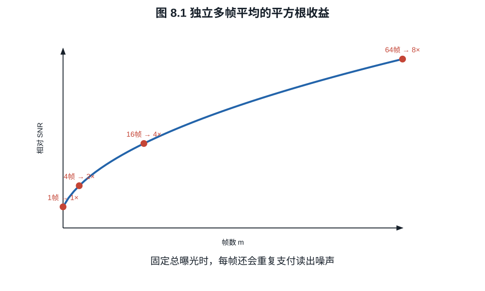
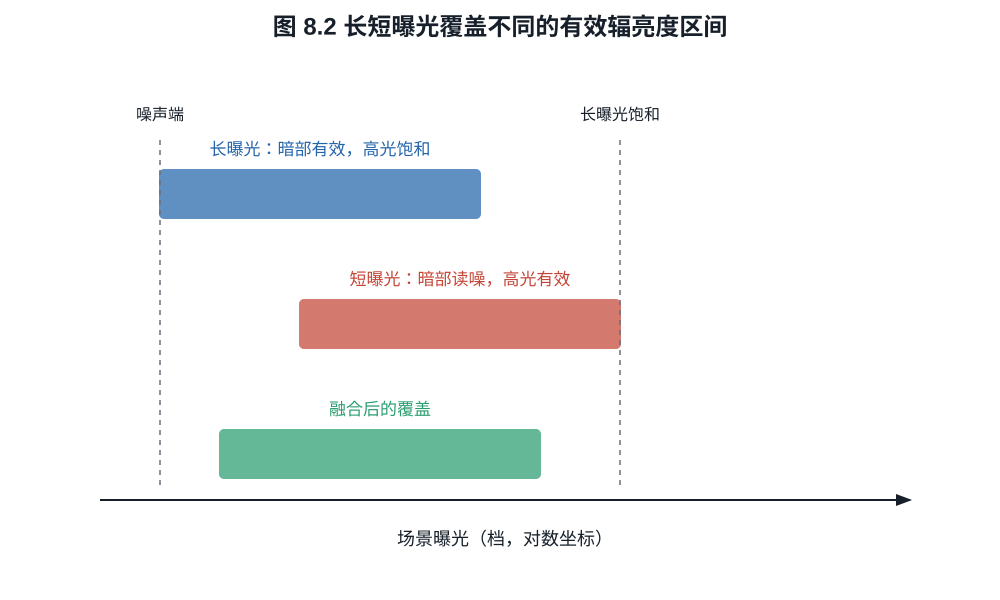
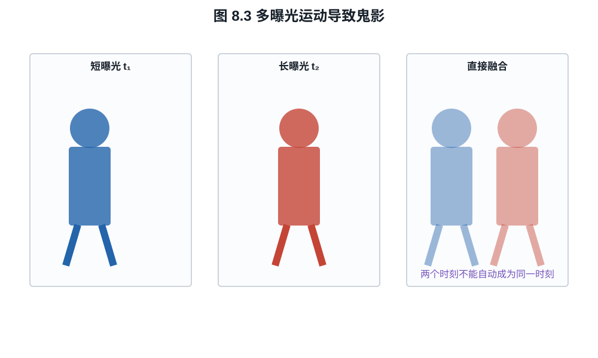

# 第八章：包围曝光、多帧降噪与现代 HDR 合成

现代相机按一次快门并不一定只使用一帧。手机可能在按下前已缓存短曝光序列，再对齐、
筛选和融合；大底相机也可能把双转换增益、长短曝光或像素内溢出电容合成一个 RAW。
“计算摄影增加动态范围”只有在指出新增了哪些独立观测后才有物理意义。
静止阴影可以从十几帧平均中获益，移动人脸却会让同一融合公式产生双影；额外信息与
额外时间并存，是理解所有多帧技术的起点。

## 8.1 同曝光堆栈怎样降低噪声

设静态场景中第 $i$ 帧线性观测为

$$
X_i=\mu+N_i,\qquad \mathbb E[N_i]=0,\qquad
\operatorname{Var}(N_i)=\sigma^2,
$$

且噪声独立。平均 $m$ 帧

$$
\bar X=\frac1m\sum_{i=1}^mX_i
$$

满足

$$
\mathbb E[\bar X]=\mu,\qquad
\operatorname{Var}(\bar X)=\frac{\sigma^2}{m}.             \tag{8.1}
$$

故 SNR 提高 $\sqrt m$，四帧提高一倍，十六帧提高四倍。若总曝光时间也增加了
$m$ 倍，这与一次长曝光的散粒噪声收益接近；区别在于短帧可对齐、剔除运动或避免
单帧高光饱和，但每帧都支付一次读出噪声。

*图 8.1　$\sqrt m$ 只适用于对齐正确且相关性可忽略的随机噪声。固定图样、压缩
误差和共同照明波动不会按同一曲线下降。*

**命题 8.1（固定总曝光时间的读噪代价）.** 总信号电子数固定为 $\mu_T$。一次曝光
的方差为 $\mu_T+\sigma_r^2$；分成 $m$ 帧后求和，方差为

$\mu_T+m\sigma_r^2$。

**证明.** 第 $i$ 帧平均信号 $\mu_T/m$，Poisson 方差同为 $\mu_T/m$，另有读噪
$\sigma_r^2$。独立求和得到
$m(\mu_T/m+\sigma_r^2)=\mu_T+m\sigma_r^2$。$\square$

因此低读噪、高速传感器使 burst 更实用，但多帧不会违反光子统计。

## 8.2 配准是融合的前提

若第 $i$ 帧相对于参考帧有几何变换 $W_i$，融合前需估计
$X_i(W_i\boldsymbol r)$。亚像素配准误差会把边缘变成双影或模糊；动态主体又使一个
全局变换不够。实际算法在局部块、光流或频域中估计运动，并根据一致性降低异常帧
权重。

可写成加权估计

$$
\widehat\mu(\boldsymbol r)
=\frac{\sum_i w_i(\boldsymbol r)X_i(W_i\boldsymbol r)}
{\sum_i w_i(\boldsymbol r)}.                              \tag{8.2}
$$

若噪声独立、无偏且方差为 $\sigma_i^2$，最小方差线性无偏权重满足
$w_i\propto 1/\sigma_i^2$。但运动不一致、饱和和遮挡会引入偏差，权重还必须依据内容
可靠性，而不只是噪声。

## 8.3 不同曝光的 HDR 辐亮度估计

对静态场景线性响应，曝光 $t_i$ 的像素在未饱和时可写为

$$
Y_i=gEt_i+N_i,                                             \tag{8.3}
$$

$E$ 是与场景辐亮度成比例的未知量。单帧估计为
$\widehat E_i=(Y_i-B)/(gt_i)$。长曝光在暗部 SNR 高却容易饱和，短曝光保高光却让暗部
落入读噪。融合估计可写成

$$
\widehat E
=\frac{\sum_i w(Y_i)\,(Y_i-B)/(g t_i)}{\sum_i w(Y_i)},   \tag{8.4}
$$

其中权重在黑电平附近和饱和附近趋小。若相机响应不是线性，Debevec--Malik 方法还会
从多曝光样本估计响应函数，再恢复与辐亮度成比例的图。

*图 8.2　短曝光把饱和端推向更高场景辐亮度，长曝光把暗部抬离读噪底；重叠区用于
标定相对尺度。若两帧没有可靠重叠，融合比例本身也不可稳定估计。*

**例子 8.2（两帧覆盖）.** 长曝光 $t_L=16t_S$。某高光在长曝光中饱和为白点，短
曝光读得线性值 $2000$ DN；该像素只能由短曝光估计。某阴影在短曝光中只有
$4\ e^-$、读噪 $3\ e^-$，长曝光则有 $64\ e^-$，其 SNR 从

$$
\frac4{\sqrt{4+9}}=1.11
$$

提高到

$$
\frac{64}{\sqrt{64+9}}=7.49.
$$

两帧各自提供另一帧缺失的有效观测。若物体在两次曝光间移动，融合边界就可能出现
鬼影；算法只能检测、选择或重建，不能让两个时刻成为同一时刻。

*图 8.3　长短曝光若观察了不同物体位置，就不存在同时满足两帧的单一辐亮度值。
去鬼影实质上是在局部选择时刻、降低权重或用模型重建，而不是无损平均。*

## 8.4 单传感器 HDR 的几种物理路线

“单次按键 HDR”不等于“单次同时曝光”。常见路线包括：

- **包围曝光/帧 HDR**：不同时刻取长短曝光，范围大，易有运动伪影；
- **staggered/DOL HDR**：同一帧周期内交错长短积分，时间间隔较小但仍非完全同步；
- **DCG HDR**：同一电荷以高、低转换增益读出，改善读出范围，但电荷若已饱和不能
  由另一增益恢复；
- **双增益输出**：同一信号走两条增益链并融合；
- **分裂像素/不同曝光子像素**：空间分辨率、颜色采样与曝光范围互换；
- **LOFIC**：强光下把溢出电荷导入额外积分电容，扩大单次曝光可记录电荷；
- **多帧 burst**：大量短帧对齐合成，兼顾手持稳定、降噪和高光保护。

Sony Hybrid Frame-HDR 是把长曝光帧的高/低转换增益读出与额外短曝光帧结合的具体
例子。名称中的“混合”指观测机制组合，不是一个通用 HDR 算法标准。

## 8.5 为什么计算合成也会“造细节”

多帧超分辨率利用手抖带来的亚像素位移，在多张欠采样图中获得不同采样相位。若
光学像稳定、位移已知且场景静止，可以反演更高采样密度；若纹理随机变化或配准错误，
算法会把先验当作细节。输出看起来更清楚，不等于每个细节都由唯一观测决定。

局部色调映射又会改变对比度：它能把 HDR 辐亮度图压进显示范围，却可能产生光晕、
局部反差不自然和时间闪烁。因此应分开报告“捕获动态范围”“融合辐亮度范围”和
“显示图像的局部对比”。

## 练习

**练习 8.1.** 八帧独立同曝光图平均后，噪声标准差和 SNR 各变为单帧的多少？写成
数值与档数。

**练习 8.2.** 总信号为 $160\ e^-$、单次读噪 $4\ e^-$。比较一次长曝光与分成
十六帧求和的总噪声和 SNR。

**练习 8.3.** 说明 DCG 的低增益读出为什么不能恢复光电二极管已经溢出的高光，
而 LOFIC 在理想情况下可以扩展这一端。
