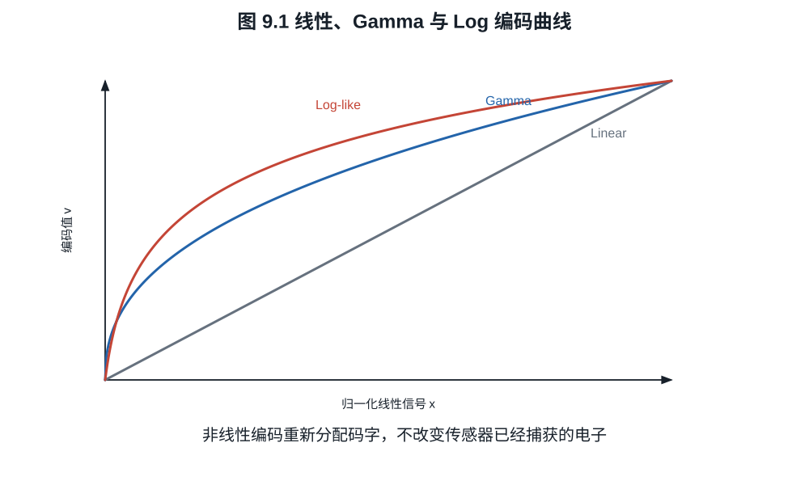
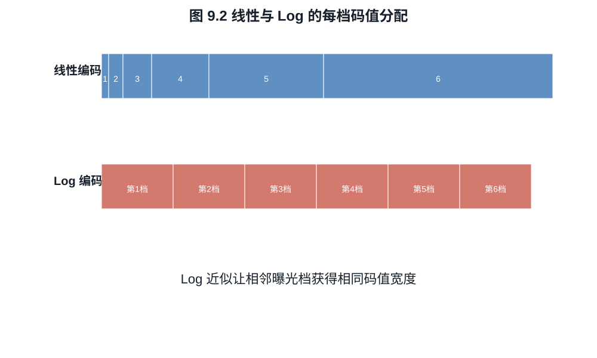
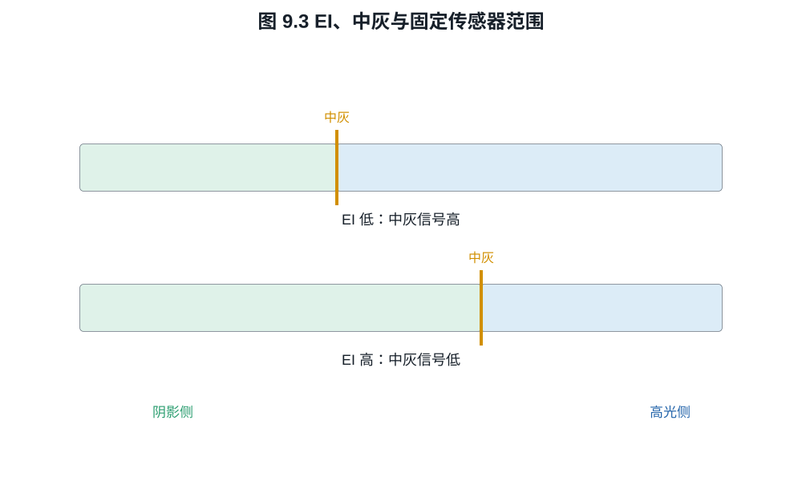

# 第九章：Gamma、Log、曝光指数与显示变换

Log 画面灰、对比低，并不是传感器突然“看见更多”。它做的是把传感器已有的线性
范围重新分配到有限码字：让每一档曝光占用较接近的码值宽度。Log、ISO 和动态范围
经常一起出现，是因为相机必须决定中灰放在哪里以及高光剪切点怎样进入编码容器，
不是因为 Log 曲线本身会改变光电子。

## 9.1 线性编码为何浪费暗部码字

设线性信号 $x\in[0,1]$，均匀 $b$ bit 量化步长约为
$\Delta_x=1/(2^b-1)$。相同绝对步长在高光相对误差小，在暗部相对误差大：

$$
\frac{\Delta_x}{x}.
$$

若要同时编码许多档曝光，最暗有效信号可能只占几个线性码。增加 bit 是一种办法，
非线性编码则按感知或后期需求重新分配码字。

Gamma 型幂函数可写为

$$
v=x^{1/\gamma},\qquad \gamma>1.                            \tag{9.1}
$$

其导数在暗部较大，给低线性信号更多码字。标准视频 OETF 往往是分段函数，在零点
附近用线性段避免无穷斜率。

## 9.2 对数编码让“档”近似线性

理想化 Log 函数写成

$$
v=a\log_2 x+b,\qquad x>0.                                 \tag{9.2}
$$

曝光增加一档，即 $x\mapsto2x$，则

$$
v(2x)-v(x)=a.
$$

每一档获得相同码值宽度。真实曲线需处理零和负的黑电平校正值，通常在暗部加入线性
toe，并在高端按容器裁切。ARRI LogC4 的硬件公式就是带偏置的 $\log_2$ 形式，并针对
12 bit 编码和 ALEV4 信号范围规定常数。

一个可分析而不冒充任何厂商曲线的分段模型是

$$
f(x)=
\begin{cases}
mx+c, & x\le x_t,\\
a\log_2(x+s)+b, & x>x_t,
\end{cases}
\qquad s>0.                                                \tag{9.3}
$$

若要求连接点处函数值与一阶导数都连续，则参数必须满足

$$
m=\frac{a}{(x_t+s)\ln2},
\qquad
c=a\log_2(x_t+s)+b-mx_t.                                  \tag{9.4}
$$

**证明.** 对数支的导数为
$a/[(x+s)\ln2]$，在 $x_t$ 处与线性支导数 $m$ 相等即得第一式；再令两支函数值
相等即得第二式。$\square$

式 (9.3) 说明 toe 不是随意“抬黑”：它以一段有限斜率编码零附近与黑电平校正后的
小负值，同时避免理想对数在零点发散。具体曲线的 $a,b,s,x_t$ 和法定码值范围必须
读取厂商规范。

*图 9.1　三类曲线改变码字分配，不改变曲线之前的电子计数。斜率越大，输入端同一
微小变化占用的码字越多；斜率也同时放大该处已有的噪声。*

**例子 9.1（十档分配）.** 若把从 $2^{-10}$ 到 $1$ 的十档信号映射到 10 bit 的
约 $900$ 个有效码，理想 Log 每档约有 $90$ 码。线性编码中最暗一档的整个信号范围
只有约一个码。Log 的优势是有限位深下的相对精度；它没有生成低于噪声底的细节。

*图 9.2　线性编码把绝大多数码分给最高几档，理想 Log 让每档宽度近似相等。图中
码数是归一化示意，实际有效码域由黑码、白码和保留码共同限定。*

更定量地，在理想对数支上若量化步长为 $\Delta_v$，由
$x=2^{(v-b)/a}$ 得

$$
\frac{dx}{x}=\frac{\ln2}{a}\,dv.
$$

把量化误差近似为宽度 $\Delta_v$ 的均匀分布，则一阶相对量化噪声为

$$
\frac{\sigma_{q,x}}x
\approx\frac{\ln2}{a}\frac{\Delta_v}{\sqrt{12}}.          \tag{9.5}
$$

它在理想 Log 区近似与曝光电平无关。例 9.1 的 90 码/档对应档位量化 rms
$1/(90\sqrt{12})\approx0.00321$ 档，折成相对线性信号约为 $0.222\%$。这只计算
编码量化，不包含传感器散粒噪声、读噪、压缩误差或色彩变换。

## 9.3 Log 不增加捕获动态范围

设传感器线性有效输入区间为 $[x_\min,x_\max]$。单调编码 $v=f(x)$ 只能把这个区间
映射为 $[f(x_\min),f(x_\max)]$。若 $x>x_\max$ 已在传感器或 ADC 饱和，所有这类输入
都成为同一剪切值；任何后续单调函数都不能区分它们。

**命题 9.2（编码不能逆转剪切）.** 若捕获映射 $c$ 满足
$c(x_1)=c(x_2)$ 且 $x_1\ne x_2$，则对任意后处理函数 $f$，
$f(c(x_1))=f(c(x_2))$。

**证明.** 等式两边应用同一函数 $f$ 即得。$\square$

Log 相比 Rec.709 风格输出“保留高光”，通常意味着前者没有在编码前用强对比曲线把
高光压到同一白码，且其码字设计能容纳相机线性范围。动态范围首先来自传感器和曝光，
Log 负责保存与传递。

## 9.4 为什么开启 Log 常出现更高的最低 ISO

这里至少有四种机制，必须查看具体相机：

1. 厂商把基础 EI 定在能把完整传感器范围映射进 Log 的位置；
2. Log 模式切换到低噪声转换增益或另一读出模式；
3. 为给中灰上方预留更多编码/高光空间，相机要求按较高 EI 测光，即实际少曝光；
4. 菜单 ISO 只是在固定模拟捕获上改变元数据和监看增益。

因此“Log 抬高 ISO”不是一般数学性质。假设相机从 EI 400 改为 EI 800，摄影者按表
收小一档光圈，使中灰监看保持一致。像素电子数减半；在散粒噪声主导时，阴影 SNR
下降为 $1/\sqrt2$。交换得到的是相对于中灰多一档物理高光余量，因为原先会达到
满阱的场景亮度现在少收一档光。

若摄影者保持光圈和快门不变，只改变 EI 元数据，电子数与物理高光余量都不变；监看
和解码中灰可能变化。若相机同时切换 HCG，读噪又可能下降。只有完整信号链才能说明
“损失了什么”。

## 9.5 中灰、曝光归一化与高低端分配

令传感器从噪声下端到饱和共可用 $D$ 档。把中灰放在距离饱和 $H$ 档处，则中灰下方
剩 $D-H$ 档。改变 EI 可在固定总范围内改变 $H$，但不必改变 $D$。

ARRI 的公开资料明确区分总动态范围和 EI 分配：LogC4 保持相对于中灰的档位与码值
关系，而 EI 改变传感器信号如何映射到该关系。较低 EI 通常把中灰对应到更多传感器
曝光，阴影更干净但场景高光余量较少；较高 EI 反之。具体相机可能还有模拟增益或
降噪模式，不能把这一解释机械套到所有品牌。

*图 9.3　总传感器范围固定时，中灰位置决定其上方和下方各有多少档。若 EI 改变还
触发读出模式切换，则必须另画一条满阱--读噪曲线，不能只沿本图平移中灰。*

## 9.6 LUT、显示变换与“还原”

Log 文件不能直接按显示器线性亮度观看。显示变换至少完成：

$$
\text{Log 解码}
\rightarrow\text{工作色域变换}
\rightarrow\text{色调/外观映射}
\rightarrow\text{显示编码}.
$$

一维 LUT 只能分别改变通道值；三维 LUT 可表示通道耦合的颜色变换。技术 LUT 旨在
从已知相机编码变到工作/显示空间，创意 LUT 还加入审美外观。把任意 LUT 称为“官方
还原”会掩盖曝光、白平衡、目标显示和观看环境的选择。

PQ 和 HLG 是 HDR 分发体系的传递函数，不等于相机 Log。相机 Log 主要服务采集与
调色中间态；PQ 以绝对显示亮度为基础，HLG 面向相对场景/显示兼容。把 S-Log3 文件
直接标记为 Rec.2100 PQ 不会自动得到正确 HDR。

## 练习

**练习 9.1.** 对式 (9.2) 证明曝光相差 $n$ 档的两个信号码值相差 $na$。

**练习 9.2.** 一传感器总可用范围为 14 档，中灰上方分配 6 档。若通过曝光指数
调整把中灰上方改为 8 档，且总范围不变，中灰下方还剩几档？若通过实际少曝光两档
完成，散粒噪声区中灰 SNR 变为原来的多少？

**练习 9.3.** 分别说明 Log、广色域和 10 bit 解决的是哪三个不同问题。

**练习 9.4.** 对式 (9.3) 取
$a=0.18,s=0.01,x_t=0.01,b=1.20$。求使曲线一阶连续的 $m,c$，并验证两支在
$x_t$ 的函数值相同。
