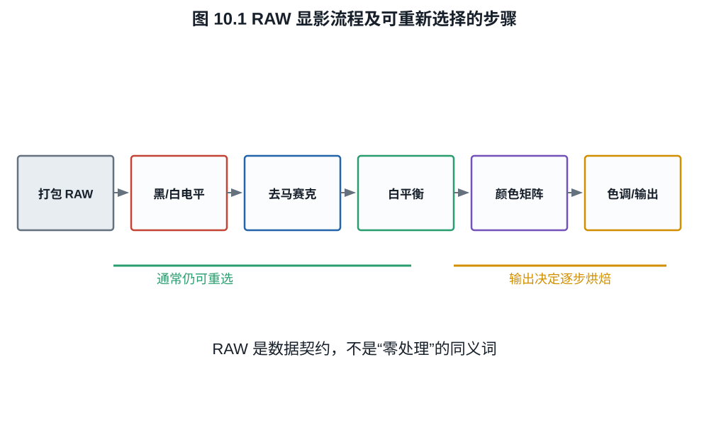
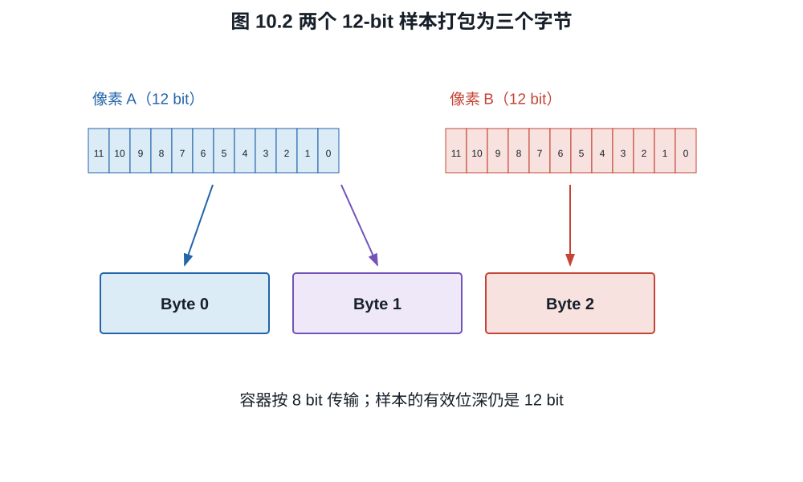

# 第十章：静态 RAW、视频 RAW、压缩与元数据

RAW 不是一种单一文件，也不是“传感器原汁原味”的同义词。它可以是 Bayer 马赛克、
四像素合并阵列、已经去马赛克的线性 DNG，也可以是经过黑电平校正、坏点替换、HDR
融合和有损压缩的视频码流。判断 RAW 能做什么，必须读取它保存了哪些样本以及哪些
决定已经不可逆地做完。

## 10.1 RAW 的六维描述

**定义 10.1（RAW 数据契约）.** 本书把 RAW 定义为一种面向后期显影的相机相关数据
契约。描述一个 RAW 至少需要六个维度：

1. **采样状态**：马赛克、分箱、全 RGB、去马赛克线性；
2. **响应状态**：线性传感器值、分段线性、Log 或非线性压缩；
3. **数值表示**：有效位深、打包位深、整数/浮点、黑白电平；
4. **压缩**：无压缩、无损、有损、帧内或跨帧；
5. **已处理项目**：坏点、暗场、镜头阴影、降噪、锐化、HDR 融合；
6. **元数据**：CFA、曝光、白平衡建议、颜色矩阵、镜头、时码和校验信息。

仅说“12 bit RAW”只回答第三项的一部分。

## 10.2 静态 RAW 的基本结构

典型 Bayer RAW 保存每个感光单元一个数值，加上解释这些数值所需的元数据。解码器
通常执行：

$$
\begin{aligned}
\text{打包码值}
&\rightarrow \text{解压与线性化}\\
&\rightarrow \text{黑电平/坏点校正}\\
&\rightarrow \text{去马赛克}\\
&\rightarrow \text{白平衡与颜色矩阵}\\
&\rightarrow \text{降噪、色调与输出编码}.
\end{aligned}
$$

DNG 建立在 TIFF/EP 结构上，可记录 CFA 图样、BlackLevel、WhiteLevel、线性化表、
颜色矩阵、噪声模型和预览等。DNG 也允许保存已经去马赛克的 LinearRaw。因此文件
扩展名 `.dng` 不能单独证明数据仍是原始马赛克。

*图 10.1　箭头是典型逻辑顺序，不表示所有相机都在同一位置执行每一步。只要某项
已经在写入前不可逆完成，后期就只能调整其结果，不能回到原始样本重新选择。*

读取 DNG 时，至少应核对下列标签族。标签存在只表示解码器获得了一个声明，不保证
标定值准确，也不保证相机没有在写入前做其他处理。

| 标签或标签族 | 解释对象 | 缺失或误读的后果 |
|---|---|---|
| CFARepeatPatternDim、CFAPattern | 感光单元的滤色排列 | 通道位置错误，去马赛克失效 |
| BlackLevel、BlackLevelRepeatDim | 每通道/每周期黑电平 | 阴影偏色，线性比例错误 |
| WhiteLevel | 当前样本的有效白点 | 归一化与高光重建错误 |
| LinearizationTable | 码值到线性化样本的查表变换 | 把非线性码误当线性曝光 |
| ActiveArea、DefaultCrop | 光学黑区、有效区与建议裁切 | 把遮光像素混入图像或尺寸误判 |
| AsShotNeutral | 拍摄时建议的中性通道比例 | 失去拍摄白平衡起点，但不等于失去 RAW |
| ColorMatrix1/2、CalibrationIlluminant1/2 | 相机通道到参考色度的标定 | 设备 RGB 无法可靠解释为标准颜色 |
| NoiseProfile | 信号相关噪声模型 | 降噪与不确定度估计失去相机提示 |
| OpcodeList1/2/3 | 规定阶段的校正操作 | 忽略时可能遗漏坏点、增益图或几何校正 |

**例子 10.2（黑白电平归一化）.** RAW 样本为 $y=5000$ DN，通道黑电平
$B=512$，白电平 $W=15\,360$。归一化线性值为

$$
x=\frac{y-B}{W-B}
=\frac{4488}{14848}\approx0.3023.
$$

若直接除以 $2^{14}-1$，会把黑电平当作曝光，得到错误的阴影与通道比例。

## 10.3 位深、打包与有效精度

12 bit 样本可按紧密位流打包，也可装进 16 bit 字。后者每样本占两字节，却仍只有
12 bit 有效数据。反过来，传感器 ADC 可能输出 14 bit，但低若干位主要是噪声；这
不等于它们“完全没用”，随机抖动可在平均中提供亚码信息，但单样本有效精度低于
标称位深。

*图 10.2　24 个有效 bit 可紧密装入 3 byte。图只表达容量关系；具体高低位顺序、
字节序和行填充必须由像素格式或文件规范给出。*

**例子 10.3（明确一种 12-bit 双样本打包）.** 规定两个无符号样本 $A,B$ 按

$$
\begin{aligned}
b_0&=A\mathbin{\&}\mathtt{0xff},\\
b_1&=((B\mathbin{\&}\mathtt{0x0f})\ll4)
      \mathbin{|}((A\gg8)\mathbin{\&}\mathtt{0x0f}),\\
b_2&=(B\gg4)\mathbin{\&}\mathtt{0xff}
\end{aligned}                                             \tag{10.1}
$$

打包。若 $A=\mathtt{0xabc}$、$B=\mathtt{0x123}$，则
$(b_0,b_1,b_2)=(\mathtt{0xbc},\mathtt{0x3a},\mathtt{0x12})$。解包为

$$
A=b_0+2^8(b_1\mathbin{\&}\mathtt{0x0f}),\qquad
B=(b_1\gg4)+2^4b_2,                                      \tag{10.2}
$$

分别恢复 $\mathtt{0xabc}$ 与 $\mathtt{0x123}$。这只是已经声明的一种约定；把另一
格式的 nibble 顺序套来会产生看似有规律、实则完全错误的像素值。

无损压缩利用码值预测误差的统计冗余，解码后逐码相同。有损 RAW 可以使用非线性
量化、预测误差量化、空间变换或波形编码；它仍可保留较大的调色空间，却不再保证
原码恢复。

**命题 10.4（无损压缩不提高信息）.** 若编码器 $C$ 和解码器 $D$ 满足
$D(C(x))=x$，则压缩只改变表示长度，不改变可由 $x$ 确定的物理信息。

**证明.** $x$ 可由码流 $C(x)$ 完全恢复，码流也由 $x$ 确定。二者在可逆映射下携带
相同可判定内容；压缩收益来自输入分布不均匀和结构冗余，不来自新增观测。$\square$

## 10.4 为什么白平衡通常可以后改

马赛克 RAW 保存各滤色通道尚未混合的线性样本。白平衡主要是通道乘法，因此可以在
解码时改变。但以下信息无法靠改白平衡恢复：

- 某通道已经饱和；
- 某通道曝光太低而埋入噪声；
- 光谱同色异谱导致的相机响应歧义；
- 相机在写 RAW 前已做不可逆的通道融合或强降噪。

“RAW 可任意改色温”准确含义是显影参数仍可重新选择，不是拍摄光谱和通道 SNR 可
被重写。

## 10.5 视频 RAW 为什么更难

一张 4K 图像若为 $4096\times2160$、每 photosite 12 bit、24 fps，未计消隐和元数据
的码率为

$$
4096\times2160\times12\times24
\approx2.55\times10^9\ \mathrm{bit/s},
$$

约 $319$ MB/s。8K、较高帧率和更高位深会迅速超过存储与接口预算，因此视频 RAW
几乎必然需要打包、裁切、分箱或压缩。

视频 RAW 还需逐帧记录黑电平、曝光模式、白平衡建议、镜头元数据和时间码，并保证
解码吞吐。Apple ProRes RAW 把 ProRes 类压缩用于 Bayer 型单 photosite 样本，白皮书
明确区分其数据率与传统 ProRes 422/4444；这说明“ProRes”家族名不表示数据已成为
Y'CbCr 422。

不同电影 RAW 可能在去马赛克前或后压缩，可能保存传感器线性值，也可能保存厂商
定义的非线性 RAW 编码。是否能在后期改变 ISO，常表示解码器可重选曝光归一化或
元数据解释，不必表示原始模拟增益从未在拍摄时固定。

下表用“典型状态”比较几类数据契约；具体产品必须以对应版本规范为准。

| 数据契约 | 采样状态 | 响应状态 | 压缩位置 | 已不可逆完成的典型步骤 |
|---|---|---|---|---|
| 马赛克 DNG/CinemaDNG 帧 | CFA photosite | 常为线性或经线性化表 | 去马赛克前 | 拍摄模拟增益、饱和及相机预校正 |
| ProRes RAW 类传感器样本码流 | 单 photosite、去马赛克前 | 编解码器定义 | 去马赛克前 | 拍摄读出模式、剪切及部分传感器处理 |
| LinearRaw DNG | 全颜色线性样本 | 线性 | 去马赛克后 | 去马赛克，且可能已有坏点/阴影校正 |
| 相机 Log RGB 视频 | RGB 或 Y'CbCr | Log/OETF 编码 | 去马赛克和颜色处理后 | 去马赛克、通道混合、通常还有白平衡与降噪 |

所以“视频 RAW 可以后改 ISO”应拆成两问：解码曝光增益和中灰映射是否可重选；拍摄
时的模拟增益、转换增益模式、电子满阱与通道剪切是否已经固定。前者常可改，后者
不能由元数据重写。

## 10.6 RAW、Log 与普通视频的关系

三者不是严格的质量等级：

- RAW 保留相机相关样本和较晚的显影决定；
- Log 通常是已经去马赛克、白平衡和颜色变换后的 RGB 视频编码，但以对数曲线保留
  较大亮度范围；
- 普通显示准备视频通常已经应用 Rec.709 类色调和锐化降噪，后期余量较少。

高质量 10/12 bit Log 在许多场景足够，并可能比低码率有损 RAW 更稳定；RAW 的优势
是处理顺序和相机参数自由度，不是名称自动保证更高 SNR。若传感器端已经剪切，两者
都不能恢复。

## 10.7 审读一个 RAW 规格

看到“8K 12-bit RAW”时，应继续查：

1. 8K 是 photosite 网格、去马赛克输出还是上采样尺寸；
2. 全画幅宽度是否裁切，是否行列跳读或像素合并；
3. 12 bit 是线性有效位、Log 压缩位还是容器位；
4. 压缩比是否固定，是否有损，最坏场景码率多少；
5. 是否保留 CFA，HDR/降噪/镜头校正是否已经烘焙；
6. 哪些软件能读，元数据和色彩管理是否公开。

回答这些问题之后，“RAW”才从商品名变成可分析的数据对象。

## 练习

**练习 10.1.** 14 bit RAW 的黑电平为 1024、白电平为 15,000。把样本 4500 DN
归一化到 $[0,1]$。

**练习 10.2.** 计算 $3840\times2160$、每 photosite 12 bit、60 fps 的未压缩
马赛克码率，分别用 Gbit/s 和 MB/s 表示。

**练习 10.3.** 分别给出一个“RAW 仍可后改”和一个“拍摄时已不可逆固定”的参数，
并说明物理原因。

**练习 10.4.** 按式 (10.1)--(10.2) 的打包约定，解包字节
$(b_0,b_1,b_2)=(\mathtt{0x45},\mathtt{0xa7},\mathtt{0x3c})$，求 12-bit
样本 $A,B$。
