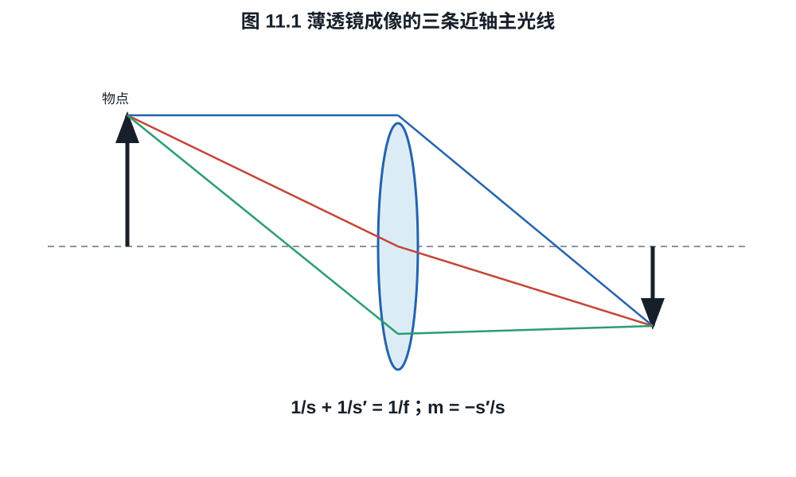
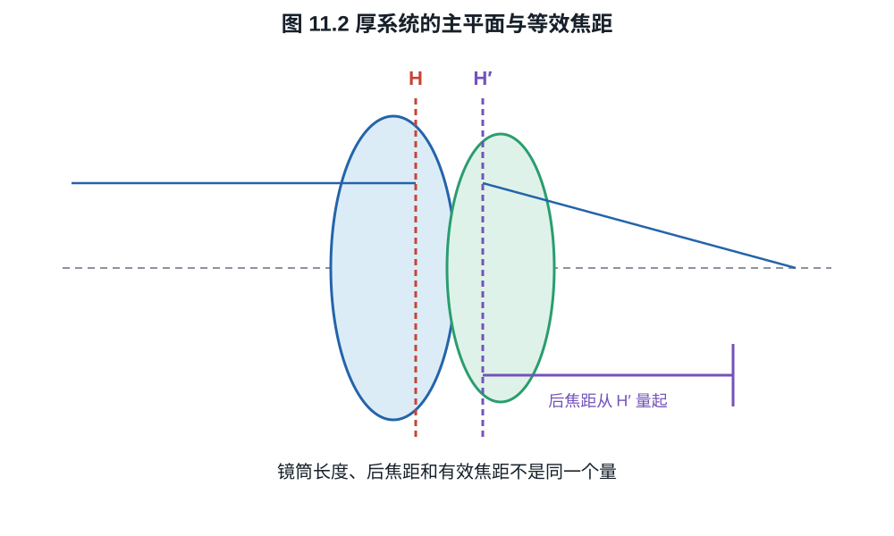
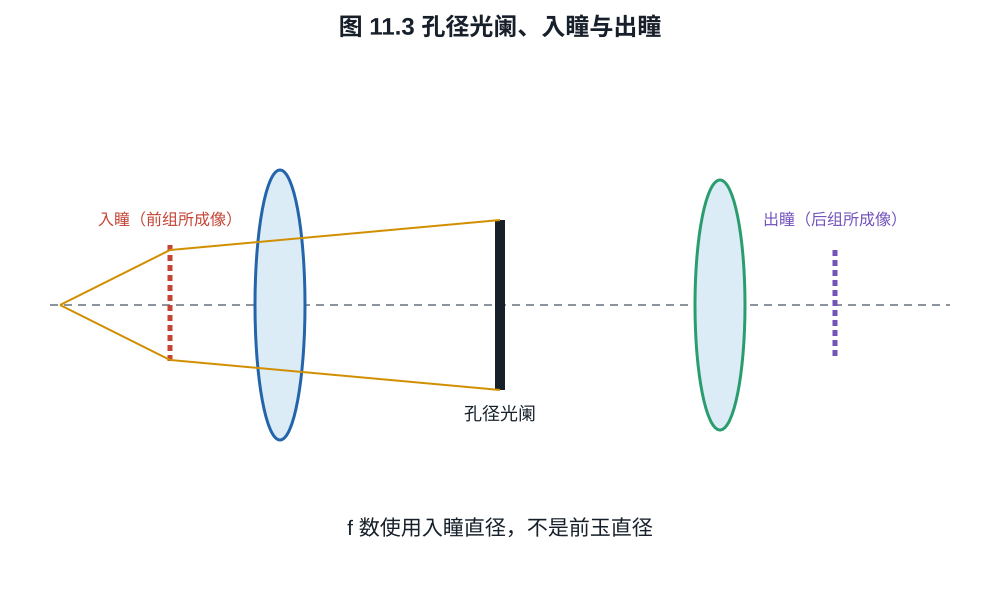

# 第十一章：几何光学、近轴矩阵与镜头基本量

镜头剖面图里几十条曲线并不能直接告诉我们光怎样走。分析从三个层次开始：每个界面
按 Snell 定律折射；近轴条件下用线性矩阵追迹；离开近轴后，矩阵与真实光线的差异
才叫像差。先把理想一阶系统算清，才能理解镜头设计为什么需要那么多片。
一支 50 mm 镜头对焦两米时像面究竟向后移动多少、为什么物理镜筒可以短于焦距，
都能在同一个二乘二矩阵里得到答案。

## 11.1 Snell 定律与近轴近似

在各向同性介质界面，入射角 $\theta_1$、折射角 $\theta_2$ 均相对法线测量，Snell
定律为

$$
n_1\sin\theta_1=n_2\sin\theta_2.                         \tag{11.1}
$$

它可由 Fermat 原理对光程
$\int n\,ds$ 取驻值得到。近轴光线满足角度和光线高度相对曲率半径都小，于是
$\sin\theta\approx\tan\theta\approx\theta$，折射关系线性化。

本章采用光线向量

$$
\boldsymbol r=\begin{pmatrix}y\\u\end{pmatrix},
\qquad u=n\theta,
$$

$y$ 是相对光轴高度，$u$ 是约化角。光在折射率 $n$ 的均匀介质中传播距离 $d$：

$$
\begin{pmatrix}y_2\\u_2\end{pmatrix}
=\begin{pmatrix}1&d/n\\0&1\end{pmatrix}
\begin{pmatrix}y_1\\u_1\end{pmatrix}.                   \tag{11.2}
$$

对半径 $R$ 的球面折射，规定曲率中心在右侧时 $R>0$，界面光焦度

$$
\Phi=\frac{n_2-n_1}{R},
$$

近轴折射矩阵为

$$
\begin{pmatrix}y_2\\u_2\end{pmatrix}
=\begin{pmatrix}1&0\\-\Phi&1\end{pmatrix}
\begin{pmatrix}y_1\\u_1\end{pmatrix}.                   \tag{11.3}
$$

**推导 11.1.** 界面法线近轴倾角约为 $-y/R$。将相对于光轴的入、出射角转换成相对
法线的角度并代入线性化 Snell 定律，整理得
$n_2\theta_2=n_1\theta_1-(n_2-n_1)y/R$，即式 (11.3)。符号依曲率约定；改变
约定须同时改变公式。

## 11.2 薄透镜与制镜者公式

折射率为 $n$ 的薄透镜置于空气中，两个表面半径为 $R_1,R_2$。忽略厚度，把两个
折射矩阵相乘，透镜总光焦度为

$$
\Phi=(n-1)\left(\frac1{R_1}-\frac1{R_2}\right),
\qquad f=\frac1\Phi.                                      \tag{11.4}
$$

这是一阶薄透镜制镜者公式。厚透镜必须加入内部传播矩阵，并由总矩阵求等效焦距和
主平面；直接把镜片中心厚度忽略会在大口径和强曲率中产生明显误差。

物距 $s>0$ 在物方、像距 $s'>0$ 在像方时，薄透镜成像公式为

$$
\frac1s+\frac1{s'}=\frac1f,
\qquad m=-\frac{s'}s.                                    \tag{11.5}
$$

*图 11.1　平行光线、过光心近似不偏折光线和物方焦点光线是薄透镜模型中的构图
工具。厚系统中应把“透镜平面”替换为主平面，不能把它们当作真实镜片内部光路。*

**证明.** 从物点高度 $y_o$ 发出的近轴光线传播 $s$、经薄透镜矩阵
$L=\left(\begin{smallmatrix}1&0\\-1/f&1\end{smallmatrix}\right)$，再传播 $s'$。
总矩阵的右上元为

$$
B=s+s'-\frac{ss'}f.
$$

同一物点不同入射角要在像面会聚，输出高度不能依赖初始角，因此 $B=0$，给出
式 (11.5)。此时总矩阵左上元 $A=1-s'/f=-s'/s=m$。$\square$

**例子 11.2（50 mm 镜头对焦 2 m）.** 取 $f=50$ mm、$s=2000$ mm，

$$
s'=\frac{fs}{s-f}
=\frac{50\times2000}{1950}
\approx51.282\ \mathrm{mm},
$$

比无穷远位置多伸出 $1.282$ mm，放大率 $m\approx-0.02564$。真实镜头以内对焦时
会移动内部组并改变等效焦距，不能只按整组伸长理解。

## 11.3 厚系统、主平面与焦距

任意近轴轴对称系统可写成

$$
M=\begin{pmatrix}A&B\\C&D\end{pmatrix},
\qquad AD-BC=1
$$

（首尾介质相同且采用约化角）。系统有效光焦度为 $\Phi=-C$，有效焦距
$f=-1/C$；这里进一步限定首尾介质为空气。若共同折射率为 $n\ne1$，物理焦距为
$f=-n/C$。矩阵可分解为物方主平面平移、理想薄透镜和像方主平面平移；这定义两主
平面。镜头物理长度可以小于或大于焦距，因为焦距从主平面量起，不从前玉或卡口量起。

前焦点、后焦点、节点和主点合称基点。空气中前后节点分别与主点重合；首尾介质不同时
不再重合。厂商标称焦距通常是无穷远近轴有效焦距，近距离内对焦可能产生 focus
breathing，使视角随对焦变化。

若输入、输出参考面都在空气中，可把任意 $C\ne0$ 的系统分解为

$$
M=T(\ell_2)L(f)T(\ell_1),\qquad
f=-\frac1C,\quad
\ell_1=f(1-D),\quad \ell_2=f(1-A),                        \tag{11.6}
$$

其中 $\ell_1$ 是输入参考面到物方主平面的有向距离，$\ell_2$ 是像方主平面到输出参考面的
有向距离。直接相乘得到

$$
T(\ell_2)L(f)T(\ell_1)=
\begin{pmatrix}
1-\ell_2/f & \ell_1+\ell_2-\ell_1\ell_2/f\\
-1/f & 1-\ell_1/f
\end{pmatrix};
$$

其左下、左上和右下元分别给出式 (11.6)，右上元由 $AD-BC=1$ 自动一致。

**例子 11.3（厚双凸镜的焦距、主平面与后焦距）.** 一片玻璃折射率 $1.5$、中心
厚度 5 mm，置于空气中，$R_1=+50$ mm、$R_2=-50$ mm。采用约化角坐标，其矩阵为

$$
\begin{aligned}
M&=
\begin{pmatrix}1&0\\-0.01&1\end{pmatrix}
\begin{pmatrix}1&5/1.5\\0&1\end{pmatrix}
\begin{pmatrix}1&0\\-0.01&1\end{pmatrix}\\
&=
\begin{pmatrix}
29/30&10/3\\
-59/3000&29/30
\end{pmatrix}.
\end{aligned}
$$

故有效焦距
$f=3000/59\approx50.847$ mm，且
$\ell_1=\ell_2=f/30=100/59\approx1.695$ mm：两主平面分别位于两顶点向玻璃内部约
1.695 mm。平行入射光从第二顶点量起的后焦距为

$$
\mathrm{BFD}=-\frac AC=\frac{2900}{59}\approx49.153\ \mathrm{mm},
$$

并不等于有效焦距。若直接把厚度删去，薄透镜公式会给 50 mm，且完全看不见主平面
位移。

*图 11.2　有效焦距从主平面量起，后焦距从最后机械参考面量起。二者相差主平面
位置，因此不能用镜筒长度直接识别标称焦距。*

## 11.4 光阑、瞳与 f 数

孔径光阑是限制轴上光束锥角的实际元件。它经前组向物方所成的像称入瞳，经后组向
像方所成的像称出瞳。入瞳直径 $D_\mathrm{EP}$ 决定无穷远 f 数

$$
N=\frac f{D_\mathrm{EP}}.                                \tag{11.7}
$$

*图 11.3　入瞳和出瞳分别是孔径光阑经前、后镜组所成的像。前玉只是机械表面，
不等于入瞳；离轴机械截光还会使有效瞳形偏离圆形。*

前玉直径不等于入瞳直径；前组可能把光阑放大或缩小。离轴光束还可能被镜筒和镜片
边缘截去，形成机械渐晕和“猫眼”散景。

像方数值孔径为

$$
\mathrm{NA}'=n'\sin\alpha',
$$

在空气、无穷远、近轴条件下 $\mathrm{NA}'\approx1/(2N)$。大数值孔径时不能用小角
近似；微距还需工作 f 数和瞳孔放大率。

## 11.5 视角、画幅与“等效”

传感器某一方向尺寸为 $d$，无穷远、无明显畸变时视角近似

$$
\Theta=2\arctan\frac{d}{2f}.                              \tag{11.8}
$$

同一拍摄位置要在较小传感器上保持视角，焦距按画幅线性缩短。若还要保持相同景深
和快门，f 数也需按裁切倍率缩放；这同时使入瞳直径和总收光接近。若只固定 f 数，
单位面积像面曝光相同，但传感器总面积不同，总光子数不同。

**例子 11.4.** 36 mm 宽全画幅配 50 mm 镜头，水平视角
$2\arctan(36/100)\approx39.6^\circ$。24 mm 宽 APS-C 要获得同视角需约
$33.3$ mm。全画幅 50 mm $f/4$ 的入瞳为 12.5 mm；APS-C 33.3 mm 若用约
$f/2.67$ 也得到 12.5 mm 入瞳，景深与总收光比较才接近。

## 练习

**练习 11.1.** 用式 (11.4) 计算 $n=1.5$、$R_1=100$ mm、$R_2=-100$ mm 的双凸
薄透镜焦距。

**练习 11.2.** 85 mm 薄透镜对焦 1 m 时，求像距、伸长量和横向放大率。

**练习 11.3.** 证明两段均匀传播矩阵满足 $T(d_2)T(d_1)=T(d_1+d_2)$。

**练习 11.4.** 空气中某厚系统从第一机械参考面到最后参考面的矩阵为
$M=\left(\begin{smallmatrix}0.9&20\\-0.005&1.0\end{smallmatrix}\right)$，
长度单位为 mm。验证行列式，求有效焦距、式 (11.6) 的 $\ell_1,\ell_2$，并求从输出参考面
量起的后焦距。
