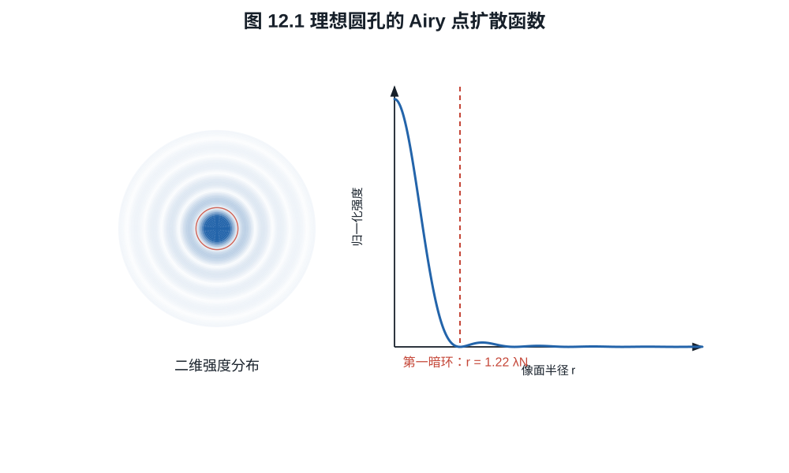
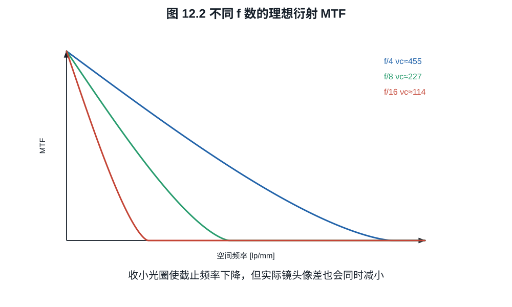
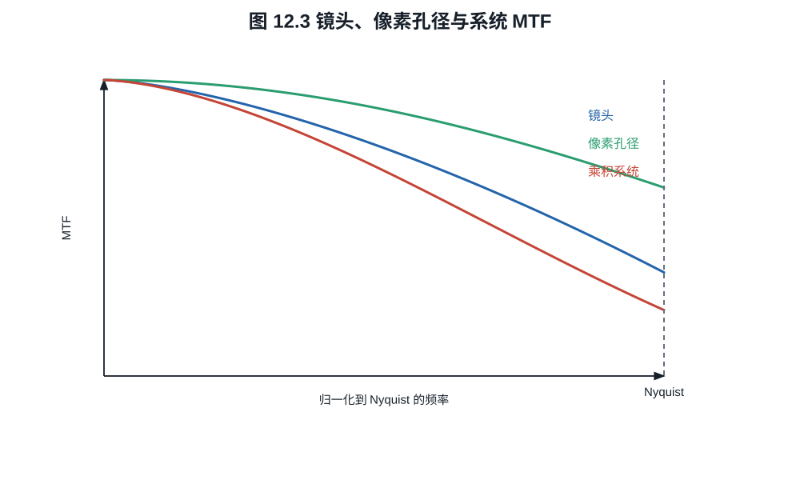

# 第十二章：衍射、PSF、OTF、MTF 与采样

几何光学能说光线是否在一点相交，却不能解释理想镜头为什么仍有有限斑点。波动光学
把孔径看成复振幅瞳函数；像点是它的衍射图样。MTF 不是厂家发明的评分曲线，而是
点扩散函数在空间频率域中的幅值响应。
把 $f/8$ 的 Airy 斑、像素 Nyquist 频率和厂家曲线放到相同的 lp/mm 坐标后，
“衍射极限”和“像素够不够”才成为同一个可计算问题。

## 12.1 从瞳函数到点扩散函数

在标量、单色、近轴 Fraunhofer 模型中，归一化瞳坐标为
$\boldsymbol\rho$，复瞳函数写成

$$
P(\boldsymbol\rho)
=A(\boldsymbol\rho)
\exp\left(\frac{2\pi i}{\lambda}W(\boldsymbol\rho)\right), \tag{12.1}
$$

$A$ 表示孔径与透射，$W$ 是波像差。理想无像差圆瞳内 $A=1,W=0$，瞳外为零。

像面复振幅与 $P$ 的 Fourier 变换成比例，非相干点源的强度点扩散函数（PSF）为

$$
h(\boldsymbol r)
=\frac{|\widehat P(\boldsymbol r/(\lambda f))|^2}
{\displaystyle\int_{\mathbb R^2}
|\widehat P(\boldsymbol r'/(\lambda f))|^2
\,d^2\boldsymbol r'}.                                   \tag{12.2}
$$

归一化使 $\int h(\boldsymbol r)d^2\boldsymbol r=1$。空间不变、非相干成像时，
物体强度 $o$ 的像为卷积

$$
i=o*h.                                                     \tag{12.3}
$$

离轴像差使 $h$ 随像高变化，整个画面不再由一个全局卷积描述；镜头 MTF 图因此要沿
像高给曲线。

## 12.2 OTF 与 MTF

**定义 12.1.** 光学传递函数（OTF）是 PSF 的 Fourier 变换：

$$
H(\boldsymbol\nu)=\widehat h(\boldsymbol\nu).
$$

其模为调制传递函数
$\mathrm{MTF}=|H|$，相位为相位传递函数。若 PSF 归一化，则 $H(0)=1$。

**命题 12.2（非相干 OTF 是复瞳的归一化自相关）.** 用物理瞳坐标
$\boldsymbol\xi$ 表示瞳函数，在 Fraunhofer 条件下

$$
H(\boldsymbol\nu)=
\frac{\int P(\boldsymbol\xi)
P^*(\boldsymbol\xi+\lambda f\boldsymbol\nu)\,d^2\boldsymbol\xi}
{\int|P(\boldsymbol\xi)|^2\,d^2\boldsymbol\xi}.            \tag{12.4}
$$

**证明.** 像面振幅可写成

$$
U(\boldsymbol r)=
\int P(\boldsymbol\xi)
e^{-2\pi i\boldsymbol r\cdot\boldsymbol\xi/(\lambda f)}
\,d^2\boldsymbol\xi.
$$

把 $h\propto UU^*$ 展开为关于
$\boldsymbol\xi,\boldsymbol\eta$ 的二重积分，再对 $\boldsymbol r$ 作 Fourier
变换。按附录 A 的负号 Fourier 约定，内层积分给出
$\delta[(\boldsymbol\xi-\boldsymbol\eta)/(\lambda f)+\boldsymbol\nu]$，
从而令 $\boldsymbol\eta=\boldsymbol\xi+\lambda f\boldsymbol\nu$；由
$H(0)=1$ 归一化即得式 (12.4)。$\square$

无像差圆瞳中 $P$ 是圆盘指示函数，式 (12.4) 的分子就是两个平移圆盘的重叠面积；
有波像差时相位因子也进入相关积分，因而不能只看几何孔径面积。

由卷积定理，式 (12.3) 变成

$$
\widehat i(\boldsymbol\nu)
=H(\boldsymbol\nu)\widehat o(\boldsymbol\nu).            \tag{12.5}
$$

正弦条纹
$o(x)=\bar o[1+m_o\cos(2\pi\nu x)]$ 经过线性系统后，调制度变为
$m_i=|H(\nu)|m_o$。因此

$$
\mathrm{MTF}(\nu)=\frac{m_i}{m_o},
\qquad
m=\frac{I_\max-I_\min}{I_\max+I_\min}.                  \tag{12.6}
$$

MTF 衡量某频率的对比传递，不是单一“锐度”。低频影响大结构反差，高频影响细节与
边缘；相位反转、彩色通道差异和非线性锐化不能只由 MTF 模长完整描述。

## 12.3 理想圆孔的衍射极限

理想圆瞳产生 Airy 图样。第一暗环半径为

$$
r_1=1.22\lambda N,
$$

更完整的径向强度为

$$
\frac{I(r)}{I(0)}
=\left[
\frac{2J_1\!\left(\pi r/(\lambda N)\right)}
{\pi r/(\lambda N)}
\right]^2,                                                \tag{12.7}
$$

其中 $J_1$ 是一阶第一类 Bessel 函数。其第一个正零点为
$3.8317\ldots$，所以
$r_1=(3.8317/\pi)\lambda N=1.2197\ldots\lambda N$。

*图 12.1　中心斑之外仍有环带能量；“Airy 直径”通常指第一暗环直径，不等于包含
全部能量的硬边圆盘。图为归一化单色标量模型。*

第一暗环直径为 $2.44\lambda N$。非相干圆孔 OTF 的截止频率为

$$
\nu_c=\frac1{\lambda N}.                                 \tag{12.8}
$$

令 $\rho=\nu/\nu_c$。对 $0\le\rho\le1$，理想圆孔 MTF 为

$$
\mathrm{MTF}_\mathrm{diff}(\rho)
=\frac2\pi\left[\cos^{-1}\rho-\rho\sqrt{1-\rho^2}\right], \tag{12.9}
$$

$\rho>1$ 时为零。式 (12.9) 可由两个单位圆盘平移 $2\rho$ 后的重叠面积除以圆盘
面积得到；这等价于瞳函数自相关。

*图 12.2　横轴使用传感器平面 lp/mm；波长固定时，f 数越大，截止频率越低。曲线
不含几何像差、遮挡、光谱加权或传感器采样。*

**例子 12.3（f/8 与 6 µm 像素）.** 取
$\lambda=0.55\ \mu\mathrm m$、$N=8$。Airy 第一
暗环直径

$$
2.44\lambda N\approx10.74\ \mu\mathrm m,
$$

约为 $6\ \mu\mathrm m$ 像素的 $1.79$ 倍。衍射截止频率

$1/(0.00055\times8)\approx227$ lp/mm，传感器 Nyquist 频率为
$1/(2\times0.006)=83.3$ lp/mm。截止频率高于 Nyquist 不表示采样处 MTF 仍为 $1$；
代入 $\rho=83.3/227=0.367$，衍射 MTF 约 $0.54$。

## 12.4 像素孔径与采样 MTF

宽度等于节距 $p$ 的理想矩形像素先对光强作盒积分。沿一维的归一化孔径 MTF 为

$$
\mathrm{MTF}_\mathrm{pixel}(\nu)
=\left|\frac{\sin(\pi p\nu)}{\pi p\nu}\right|.           \tag{12.10}
$$

在 Nyquist 频率 $\nu_N=1/(2p)$，该值为 $2/\pi\approx0.637$。若有效感光宽度小于
节距，孔径 MTF 下降较慢，却会增加高于 Nyquist 的能量和混叠风险；微透镜和电荷
扩散改变实际响应。

在线性、空间不变且各模糊独立卷积的理想模型中，系统 OTF 相乘：

$$
H_\mathrm{sys}=H_\mathrm{lens}H_\mathrm{OLPF}H_\mathrm{pixel}H_\mathrm{motion}. \tag{12.11}
$$

*图 12.3　在线性空间不变模型中，各卷积环节的 OTF 相乘。图中系统曲线是机制
计算，不包含 CFA 去马赛克、混叠回折、内容自适应降噪或锐化。*

去马赛克、空间变化降噪和锐化往往是非线性的，不能简单塞进同一个固定乘积。实测
JPEG MTF 甚至可能因过冲在某频率大于 $1$，这表示数字锐化，不表示镜头传递了超过
输入的光学调制度。

## 12.5 分辨率没有唯一阈值

Rayleigh 判据把两个等亮 Airy 点的间距取为一个斑点中心落在另一个第一暗环处，适合
特定点源辨别问题。摄影测试还会使用 MTF50、MTF20、极限分辨线对或视觉判断。它们
回答不同问题。

“镜头能解析 50 MP”没有说明画幅、空间频率、对比阈值和传感器处理，因而不是完整
规格。对 36 mm 宽、约 8256 像素的 45 MP 全画幅，横向 Nyquist 约
$8256/(2\times36)=114.7$ lp/mm；同样 45 MP 若在更小画幅，所需传感器平面频率更
高。镜头 MTF 必须以 lp/mm 和像高读取。

## 12.6 S/M 曲线与方向

离轴点处，沿以画面中心为径向的结构称 sagittal/radial，沿圆周切向的结构称
meridional/tangential。不同厂商标记 S/M 或 S/T。像散和彗差使两个方向 MTF 分离；
曲线接近通常表示方向响应较一致，但不能单凭“分离程度”预测所有散景形态。

厂商 MTF 还可能是设计计算、白光加权计算或样本实测平均。频率 10 lp/mm 的高值
主要说明低频反差，不能替代 40、50 或更高 lp/mm 的细节传递。比较曲线前必须统一
这些口径。

## 练习

**练习 12.1.** 计算 $\lambda=550$ nm 时 $f/4,f/8,f/16$ 的 Airy 第一暗环直径和
衍射截止频率。

**练习 12.2.** 像素节距 $4\ \mu$m，求 Nyquist 频率和矩形满填充像素在 Nyquist
处的 MTF。

**练习 12.3.** 某频率处镜头、OLPF、像素 MTF 分别为 $0.60,0.85,0.64$。在线性
独立模型下求系统 MTF；说明为什么不能用该乘积预测锐化 JPEG 的最终 MTF。

**练习 12.4.** 一维无像差矩形瞳宽度为 $D$，瞳函数在
$[-D/2,D/2]$ 内为 1，外部为 0。用式 (12.4) 证明归一化 OTF 为
$H(\nu)=\max(1-|\lambda f\nu|/D,0)$，并给出截止频率。
