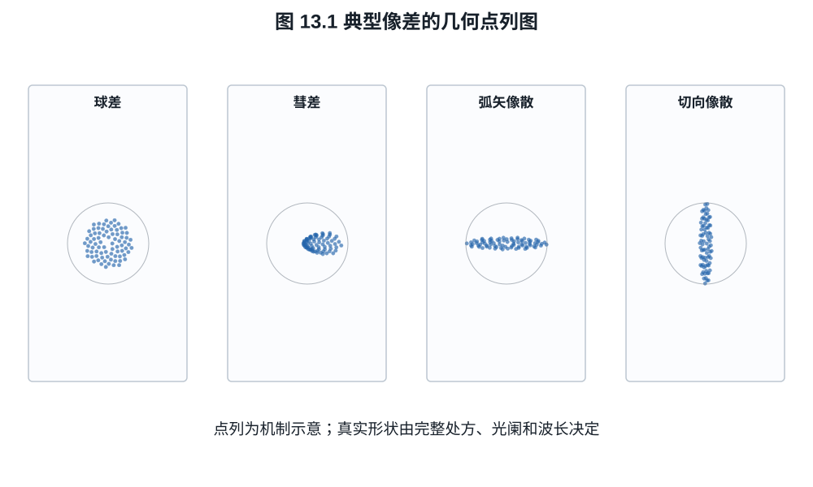
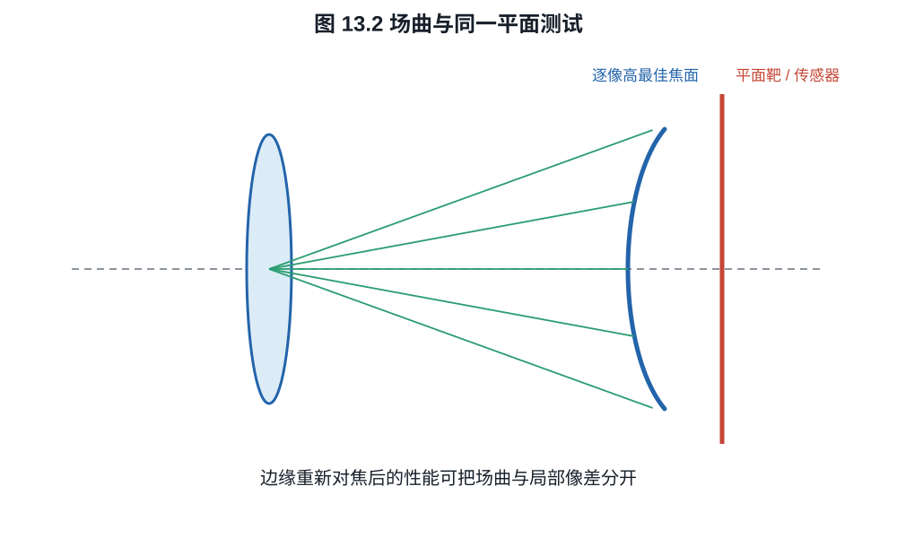
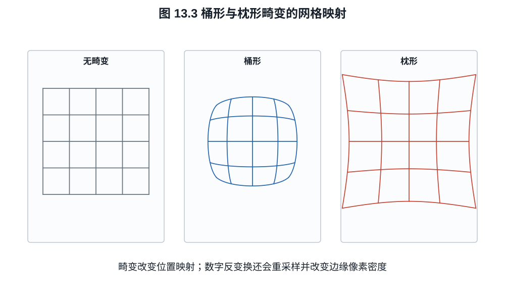

# 第十三章：球差、彗差、像散、场曲、畸变与色差

理想薄透镜只保留近轴一阶项。真实镜头的大孔径光线、离轴光线和不同波长不会完全
落在同一点。像差不是笼统的“镜头不完美”，而是波前相对于理想参考球面的系统偏差；
不同偏差在 PSF 和 MTF 上留下不同结构。
角落星点拖尾、收光圈后的焦点漂移和四角重新对焦后变清楚，分别指向不同像差；把它们
都叫作“边缘肉”会失去诊断能力。

## 13.1 波像差的组织方式

令归一化瞳坐标为 $(\rho,\phi)$，像高为 $h$。在轴对称系统的一种三阶展开中，主要
Seidel 项的变量依赖可写为

$$
\begin{aligned}
W_\mathrm{sph}&\propto \rho^4,\\
W_\mathrm{coma}&\propto h\rho^3\cos\phi,\\
W_\mathrm{ast}&\propto h^2\rho^2\cos^2\phi,\\
W_\mathrm{field}&\propto h^2\rho^2,\\
W_\mathrm{dist}&\propto h^3\rho\cos\phi.
\end{aligned}                                             \tag{13.1}
$$

系数依镜头结构、光阑位置和符号约定。式 (13.1) 的价值不是精确预测现代大口径镜头，
而是显示各像差怎样随孔径半径和像高增长。高阶像差需要更高次项或数值光线追迹。

在单位圆瞳上定义内积

$$
\langle F,G\rangle
=\frac1\pi\int_0^1\int_0^{2\pi}
F(\rho,\phi)G^*(\rho,\phi)\,\rho\,d\phi\,d\rho.
$$

取一组按该内积正交归一的 Zernike 模式 $Z_j$，可写
$W=\sum_j a_j Z_j$。若已经移除 piston、两项 tilt，并按测量目的决定是否移除
defocus，则 Parseval 等式给出

$$
\sigma_W^2=\langle W,W\rangle=\sum_j|a_j|^2              \tag{13.2}
$$

（求和只含保留模式）。所以“波前 RMS”必须同时报告去除了哪些模式、瞳形、波长和
归一化；把最佳对焦时的 RMS 与固定像面 RMS 直接比较会把 defocus 口径混在一起。

若相位误差 $\varphi=2\pi W/\lambda$ 已去均值且足够小，像面中心的归一化复振幅为
$\langle e^{i\varphi}\rangle$。展开指数得

$$
\langle e^{i\varphi}\rangle
\approx1-\frac12\langle\varphi^2\rangle,
$$

故中心强度比，即 Strehl ratio，满足 Maréchal 近似

$$
\mathcal S\approx
\exp\left[-\left(\frac{2\pi\sigma_W}{\lambda}\right)^2\right]. \tag{13.3}
$$

指数形式与二阶展开在小误差区一致。$\sigma_W=\lambda/14$ 时
$\mathcal S\approx0.818$。这不是任意大像差下的恒等式，也不能替代离轴、宽光谱
MTF；相同 RMS 的不同 Zernike 组合可产生不同 PSF 形状。

## 13.2 球差与彗差

球差是轴上像差：球面透镜边缘光线与近轴光线焦点不同。全开时大 $\rho$ 光线权重
最大，收小光圈会快速减少球差，但同时增加衍射。设计者可用弯月形分配、非球面或
多片正负光焦度平衡球差。

球差还会使最佳对焦位置随光圈改变，产生 focus shift。对焦于全开最佳位置后收光圈，
若剩余球差不对称，最大 MTF 平面可能前后移动；这不是自动对焦误差。

彗差随像高一次增长，离轴点形成带尾巴的彗形斑。夜景星点对彗差很敏感，但“角落
星芒”还可能混入像散、传感器微透镜和去马赛克。只凭单张过曝星点不能分离这些来源。

*图 13.1　点列图显示追迹光线与像面的交点，不包含衍射，点密度还取决于瞳采样
方式。必须同时给比例尺，并与 Airy 尺度和像素节距比较。*

光学设计软件中常见的三类诊断不能互换：点列图给二维几何落点；横向光线像差图把
瞳坐标映射为像面交点误差，可看出高阶形状和非对称；波前图给光程差，经过 Fourier
传播才得到含衍射 PSF。只有在相同像高、波长、焦面和瞳采样下，它们才描述同一
工作点。

## 13.3 像散与场曲

离轴窄光束在切向与弧矢方向有不同焦面。位于两个焦面之间时，点斑可从一方向线状
经过近圆形最小弥散斑再转为另一方向线状。厂商 MTF 图中的 S/T 曲线分离常反映这种
方向差异，但彗差等也会影响它们。

场曲表示最佳平均焦面弯曲。若传感器是平面，对焦中心后边缘可能离开最佳焦面；稍微
改变对焦可让边缘变好而中心变差。测试镜头时若只在中心对焦平面测全场，会把场曲和
局部像质混在一起。应分别报告：

- 同一平面上的成像一致性；
- 每个像高重新对焦后的最佳性能；
- 最佳焦面随像高的位置。

*图 13.2　平面靶固定焦面测试回答“同一传感器平面上是否一致”；逐像高重对焦回答
“局部镜头像质是否仍好”。二者之差才是场曲诊断信息。*

曲面传感器主要针对这一问题提供额外自由度，但像散产生两个焦面，单一球面不能自动
同时消除它们。

## 13.4 畸变不等于模糊

畸变改变像高映射而不必扩大局部点斑。理想无畸变映射在给定投影下为 $r_0$，实际
像高可展开为

$$
r=r_0(1+k_1r_0^2+k_2r_0^4+\cdots).                       \tag{13.4}
$$

*图 13.3　畸变改变位置映射，理想情况下不扩大局部 PSF。数字反映射会重新采样并
改变边缘的有效像素密度，因此“可校正”不等于没有分辨率和视角代价。*

$k_1<0$ 常对应桶形，$k_1>0$ 常对应枕形，复杂广角可呈波浪形。数字校正用反映射把
像素重采样到目标几何；边缘被拉伸时，单位输出角度可用的原始像素密度下降，插值也
改变 MTF。校正后的“24 mm 视角”与未校正 RAW 边界可能不同。

畸变曲线单独不能说明清晰度；反之，MTF 也不能说明直线是否弯曲。两者必须分项读。

## 13.5 轴向与倍率色差

折射率 $n(\lambda)$ 随波长变化，使透镜光焦度也随波长变化。轴向色差使不同颜色的
最佳焦点沿光轴分离，常在焦前焦后呈不同色边；收光圈可减小模糊斑，却不改变材料
色散本身。

倍率色差使不同波长的横向放大率不同，离中心越远色边越明显。它可在去马赛克后按
通道做径向缩放校正，只要通道信息未严重混叠；轴向色差涉及每个通道真实离焦，简单
缩放不能恢复丢失的高频。

**例子 13.1（色差与矩阵 MTF）.** 若红、蓝图像相对绿通道在边缘分别偏移
$+0.5$ 与 $-0.5$ 像素，合成白黑边会出现彩边。通道对齐可修正位置，但若蓝通道还
因轴向离焦具有宽 PSF，对齐后蓝细节仍低。把所有彩边都归因于“倍率色差可一键修”
会漏掉第二部分。

## 13.6 收光圈的平衡

设某像差波像差近似随瞳半径四次增长。把孔径半径缩为原来的 $k<1$，边缘波像差项
降为 $k^4$；与此同时 Airy 尺度按 f 数，即约按 $1/k$ 增长。最佳光圈是像差下降与
衍射上升的系统平衡，还依像高、对焦、波长、传感器采样和输出尺寸。

因此“镜头最佳光圈是最大光圈收两档”不是定律。高质量小口径镜头可能全开已接近
衍射限制；超大光圈镜头可能需收多档；高像素密度传感器会更早看见衍射 MTF 下降，
却仍可能因景深增加而让实际场景更多区域清楚。

## 13.7 散景与像差不是一个分数

离焦 PSF 的边缘亮度、洋葱圈、猫眼、口径蚀和轴向色差共同影响散景。球差符号会使
焦前与焦后散景不同；非球面加工纹理可能产生环纹；光阑叶片决定收光圈后的多边形。
这些特征不能从合焦平面的一条 30 lp/mm MTF 曲线推出。镜头评价至少要分开合焦传递、
离焦 PSF、眩光、几何和机械行为。

## 练习

**练习 13.1.** 根据式 (13.1)，把孔径半径减半时球差项与彗差项分别变为原来的
多少？保持像高不变。

**练习 13.2.** 畸变校正把边缘一个方向拉伸 $1.2$ 倍。若原始该方向局部 Nyquist
为 100 lp/mm，以校正后坐标计的等效上限约为多少？

**练习 13.3.** 设计一个区分场曲和边缘固有像差的拍摄测试，说明需改变哪个变量。

**练习 13.4.** 用式 (13.3) 分别估计
$\sigma_W=\lambda/20$ 与 $\lambda/10$ 的 Strehl ratio。说明为何两个数字都只能
在 Maréchal 近似适用且 RMS 口径一致时比较。
