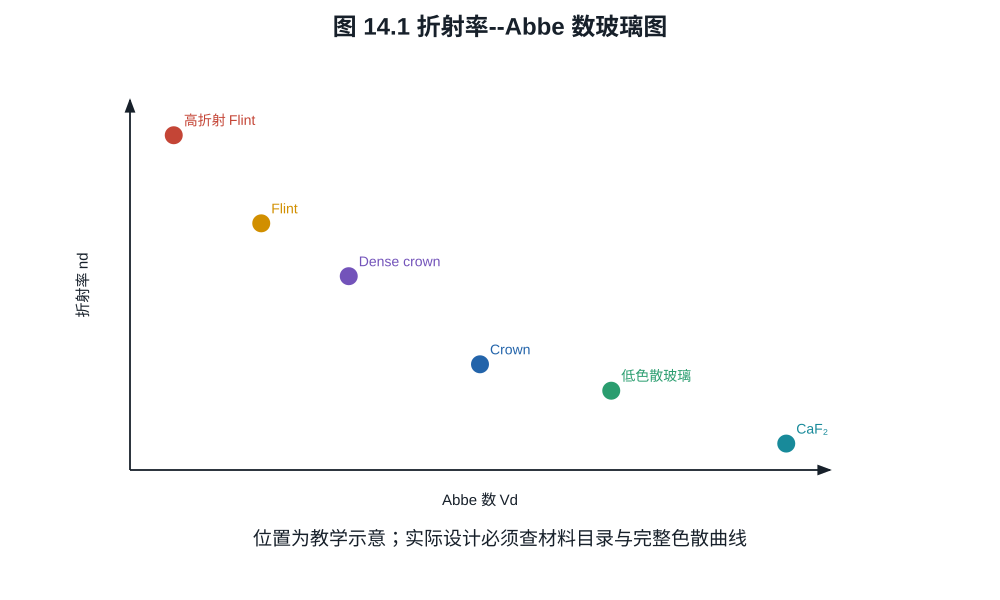
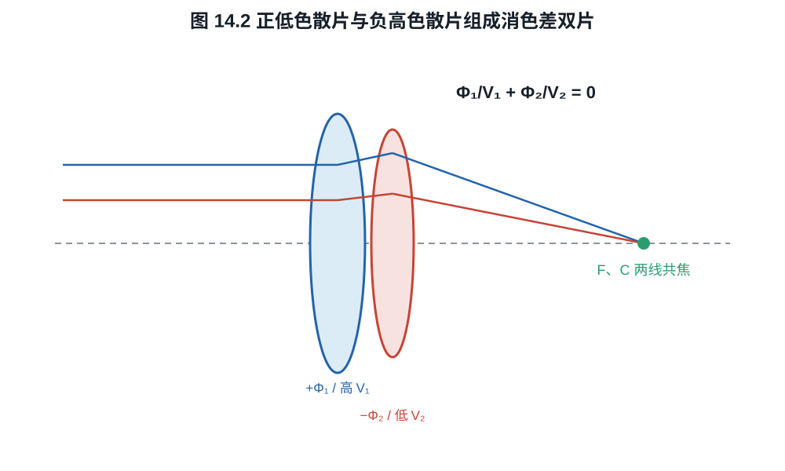

# 第十四章：玻璃、树脂、萤石与低色散材料

镜片材料不是按“玻璃最好、树脂最差”排成一条等级线。设计者真正使用的是折射率、
色散、异常部分色散、透射、均匀性、双折射、密度、热性质和加工约束。树脂能低成本
成形复杂非球面，萤石能提供普通玻璃难以同时达到的色散组合；两者也各自带来环境与
制造代价。

## 14.1 折射率与 Abbe 数

材料折射率写作 $n(\lambda)$。Fraunhofer 线常取
$\lambda_F=486.13$ nm、$\lambda_d=587.56$ nm、$\lambda_C=656.27$ nm。定义

$$
V_d=\frac{n_d-1}{n_F-n_C}.                               \tag{14.1}
$$

$V_d$ 大表示在这组三波长上的相对色散较低。它把整条 $n(\lambda)$ 曲线压成一个
数，不能描述异常部分色散或红外/紫外行为。

部分色散比的一种定义为

$$
P_{gF}=\frac{n_g-n_F}{n_F-n_C}.                           \tag{14.2}
$$

在玻璃图中，普通玻璃的 $P_{gF}$ 与 $V_d$ 大致沿经验关系分布；偏离该关系的材料可
帮助校正第二级光谱。所谓 ED、UD、Super ED 是厂商材料类别，不是跨品牌统一阈值，
应查看玻璃图和具体设计作用。

目录中的多波长折射率常由 Sellmeier 型经验式给出：

$$
n^2(\lambda)
=1+\sum_{j=1}^{J}\frac{B_j \lambda^2}{\lambda^2-C_j}.   \tag{14.2a}
$$

$B_j,C_j$ 是材料拟合系数，$\lambda$ 的单位必须与 $C_j$ 的约定一致。该式是在目录
声明的波长和温度范围内对测量的拟合，不应跨吸收边或远离拟合区外推。光学设计程序
使用整条 $n(\lambda)$ 而不只用 $n_d,V_d$，因为两个材料可有相近 Abbe 数却有不同
部分色散。

*图 14.1　玻璃图用于寻找折射率与一级色散的组合，不是材料“高级程度”排名。图中
点位为机制示意；工程选材必须使用厂商批次目录和异常部分色散数据。*

## 14.2 消色差双胶合镜的条件

两片接触薄透镜光焦度为 $\Phi_1,\Phi_2$，总光焦度

$$
\Phi=\Phi_1+\Phi_2.                                      \tag{14.3}
$$

一阶轴向色差近似与 $\Phi_i/V_i$ 成正比。使 $F,C$ 两线同焦的消色差条件为

$$
\frac{\Phi_1}{V_1}+\frac{\Phi_2}{V_2}=0.                 \tag{14.4}
$$

联立求得

$$
\Phi_1=\Phi\frac{V_1}{V_1-V_2},
\qquad
\Phi_2=-\Phi\frac{V_2}{V_1-V_2}.                         \tag{14.5}
$$

若 $V_1>V_2$ 且总光焦度为正，则低色散 crown 片为较强正光焦度，高色散 flint 片为
负光焦度。

*图 14.2　两片色散引起的光焦度变化方向相反，在选定两条谱线上抵消；总正光焦度
来自不完全抵消。图示不代表实际曲率或胶合厚度。*

**例子 14.1.** 目标总光焦度 $\Phi=0.01\ \mathrm{mm}^{-1}$（焦距 100 mm），
$V_1=60,V_2=30$。式 (14.5) 给出
$\Phi_1=0.02\ \mathrm{mm}^{-1}$、
$\Phi_2=-0.01\ \mathrm{mm}^{-1}$。两片绝对光焦度大于总光焦度，正负抵消既得到
目标焦距又抵消一级色差。这也会放大制造误差和其他像差，需要继续优化曲率与间隔。

一级消色差并不消除所有波长。令第 $i$ 片形状因子为 $K_i$，则薄片光焦度
$\Phi_i(\lambda)=K_i[n_i(\lambda)-1]$，从定义 (14.1) 得

$$
\Phi_{i,F}-\Phi_{i,C}=\frac{\Phi_{i,d}}{V_i}.             \tag{14.5a}
$$

再用定义 (14.2)，有

$$
\Phi_{i,g}-\Phi_{i,F}
=\frac{\Phi_{i,d}}{V_i}P_{gF,i}.                         \tag{14.5b}
$$

对满足式 (14.4) 的两片系统，
$\Phi_{2,d}/V_2=-\Phi_{1,d}/V_1$，所以残余 $g-F$ 光焦度差为

$$
\Delta\Phi_{gF}
=\frac{\Phi_{1,d}}{V_1}(P_{gF,1}-P_{gF,2}).              \tag{14.5c}
$$

这就是异常部分色散为何重要：一级 F--C 色差已经抵消后，残差由两材料偏离共同
部分色散关系的程度控制。仅说“Abbe 数很高”不足以预测二级光谱。

## 14.3 光学玻璃

光学玻璃是经过成分、退火和均匀性控制的非晶材料家族，不是单一物质。玻璃目录提供：

- $n_d,V_d$ 与多波长 Sellmeier 系数；
- 异常部分色散；
- 内透射、气泡和条纹等级；
- 密度、硬度、热膨胀、转变温度和化学耐久性；
- 折射率批次容差与应力双折射。

高折射率可用较小曲率获得同一光焦度，有利于减薄镜片或校正结构，但常伴随更高色散、
密度或反射；低色散材料有利于色差，却未必适合承担强光焦度。设计是在玻璃图与机械
约束中选组合，不是“特殊镜片越多越好”。

## 14.4 萤石究竟特殊在哪里

摄影萤石镜片通常是人工生长的氟化钙晶体 CaF$_2$。它具有低折射率、很低色散和对
消除残余色差有用的异常部分色散，并有宽光谱透射。把凸萤石与高色散凹玻璃组合，可
比普通 crown/flint 组合更好地压低二级光谱，尤其适合长焦镜头。

萤石是晶体而非普通光学玻璃。大型高纯晶体生长、退火和抛光困难，材料较软，热性质
与玻璃不同。Canon 的技术资料记录了人工萤石从晶体生长到特殊抛光的制造要求。

“采用萤石”不自动保证整支镜头 MTF 更高。萤石解决的是材料自由度，最终性能还取决
于光焦度分配、偏心、表面误差、对焦和其他像差。现代低色散玻璃可在某些设计中达到
接近作用，且更易制造。

## 14.5 树脂镜片与混合非球面

摄影中的树脂/塑料光学常见 PMMA、PC、COP、COC 等。与玻璃相比，其工程优势包括：

- 密度低；
- 注塑可一次形成复杂双面非球面、定位结构和阵列；
- 大批量重复成本低；
- 某些 COP/COC 具有低吸水、低双折射和良好可见光透射。

约束包括可选折射率--色散范围较窄、热膨胀较大、弹性模量较低、温度和湿度引起形状
或折射率变化，以及模压残余应力和双折射。材料配方差异很大，不能把所有树脂用一组
数值概括。

手机镜头大量使用注塑非球面树脂，因为复杂面形、重量和量产优势超过材料目录较窄的
代价。大型可换镜头有时使用玻璃基底上复制树脂非球面层，或在 PF 元件中使用专门
树脂。此处“树脂”描述制造材料，不等于儿童玩具级塑料。

## 14.6 温度、均匀性与实际像质

焦距对温度的变化同时来自镜片曲率热膨胀、间隔变化和
$dn/dT$。长焦、大口径和高精度镜头会用不同材料与镜筒结构做被动热补偿，或在对焦
控制中补偿。树脂的温度敏感性通常更强，但小型系统可通过短光路和软件标定管理。

材料内部折射率不均匀、应力双折射、气泡和条纹会使波前产生不可由理想面形解释的
误差。材料名称只给出设计潜力；样品 MTF 还受加工、装调和环境稳定性控制。

## 练习

**练习 14.1.** 材料有 $n_d=1.60,n_F=1.615,n_C=1.593$，计算 $V_d$。

**练习 14.2.** 总焦距 200 mm，选 $V_1=70,V_2=35$ 的接触双片，按式 (14.5)
求两片光焦度和各自焦距。

**练习 14.3.** 分别列出树脂镜片相对玻璃的一项光学/制造优势和一项环境稳定性
代价，并解释为什么不能由“树脂”二字直接推出低 MTF。

**练习 14.4.** 一消色差双片在 d 线有
$\Phi_1=0.020\ \mathrm{mm}^{-1},V_1=60,P_{gF,1}=0.64$ 与
$\Phi_2=-0.010\ \mathrm{mm}^{-1},V_2=30,P_{gF,2}=0.61$。验证一级消色差条件，
并按式 (14.5c) 求残余 $g-F$ 光焦度差。
