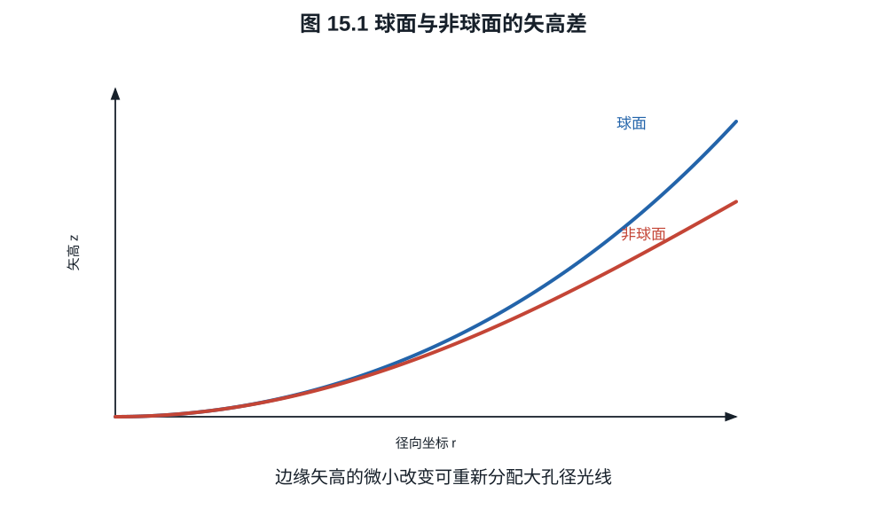
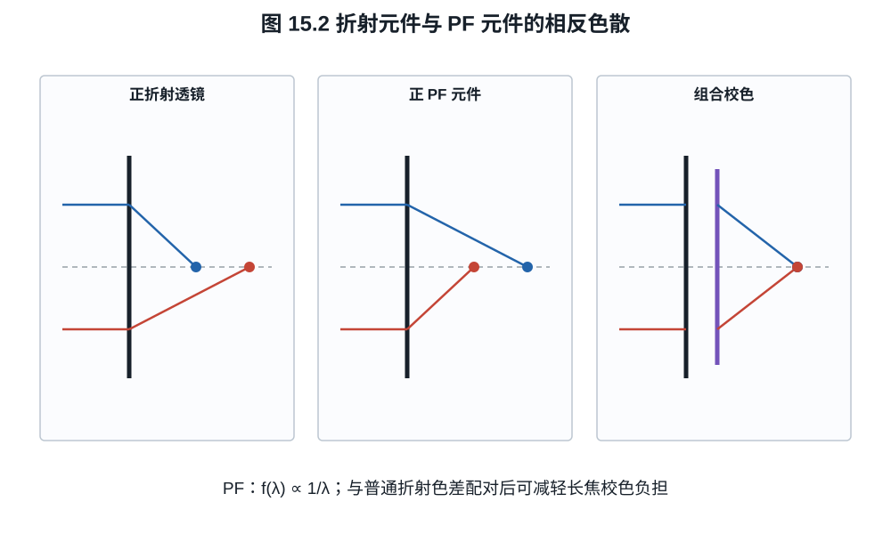
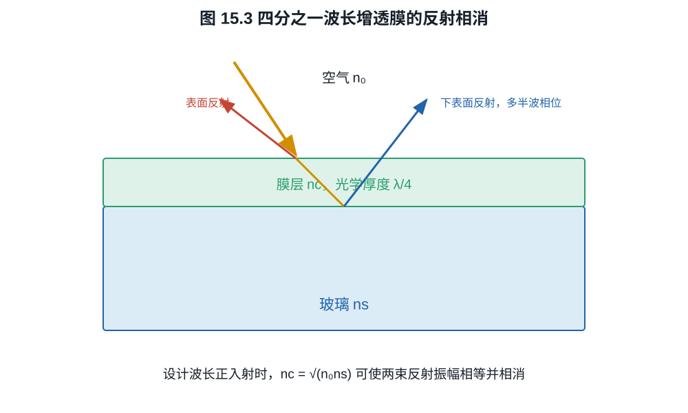

# 第十五章：非球面、Fresnel、PF/DO 与镀膜

特殊镜片名称常把三种完全不同的技术放在一起：非球面改变折射面的连续形状，Fresnel
结构把厚透镜的相位作用折叠成台阶，PF/DO 元件利用衍射的反常色散；镀膜则控制界面
反射和透射。它们都能让镜头更小或更好，却通过不同方程工作。
长焦镜头里一片带同心微结构的 PF 元件可以替代若干沉重校色片，同时也可能在强点
光源周围留下环状 flare；两面都来自同一衍射机制。

## 15.1 非球面如何增加设计自由度

旋转对称非球面的矢高可写成

$$
z(r)=\frac{cr^2}{1+\sqrt{1-(1+k)c^2r^2}}
+A_4r^4+A_6r^6+A_8r^8+\cdots,                            \tag{15.1}
$$

*图 15.1　非球面与基准球面的实际矢高差可能远小于图示；图中特意放大差异以说明
高阶系数如何改变边缘斜率。面形作用必须结合该面上的光线高度判断。*

$c=1/R$ 是顶点曲率，$k$ 是圆锥常数，$A_{2m}$ 是高阶系数。$k=0$ 且高阶系数为零
时为球面；其他 $k$ 可表示椭球、抛物或双曲母线的一部分。

球面只给一个曲率参数，非球面可独立调整边缘光线的折射，因而校正球差、彗差、畸变
并减少镜片数量。它不保证所有像差同时变小；系数选择仍由整套镜头优化决定。

制造方法包括研磨抛光、精密玻璃模压、树脂注塑和玻璃基底复制树脂层。模具纹理或
加工刀痕可在离焦高光中形成同心“洋葱圈”，即使合焦 MTF 很高。

## 15.2 Fresnel 的相位折叠

传统 Fresnel 折射透镜把厚透镜表面分成同心环，并移除不影响局部斜率的材料，从而
减薄重量。环带台阶会带来散射和衍射，因此照明 Fresnel 与高像质成像元件的要求不同。

相位 Fresnel（phase Fresnel, PF）或衍射光学元件按 $2\pi$ 周期折叠光程。若目标相位
$\varphi(r)$ 超过 $2\pi$，可制造

$$
\varphi_\mathrm{wrap}(r)=\varphi(r)\bmod2\pi.             \tag{15.2}
$$

在设计波长，差一个整数 $2\pi$ 的区域复振幅相同；表面高度因此可大幅降低。真实
宽带光中相位延迟随波长变化，能量会分入不同衍射级次。

## 15.3 为什么衍射元件能校正色差

区板半径近似满足

$$
r_m^2\approx m\lambda_0f_0.
$$

固定结构在波长 $\lambda$ 的一级焦距为

$$
f(\lambda)\approx\frac{\lambda_0}{\lambda}f_0.            \tag{15.3}
$$

因此衍射光焦度 $1/f$ 随波长增加而增加：红光焦距更短。普通正折射透镜通常因蓝光
折射率更高而让蓝光焦距更短，两者色散方向相反。把 PF 与折射镜片组合，可以用较少、
较轻元件校正长焦色差。

*图 15.2　组合设计让折射与衍射的轴向色差部分抵消。PF 不会消灭色散；它提供一个
符号相反、大小可设计的色散自由度。*

**例子 15.1.** 某 PF 在 $\lambda_0=550$ nm 的焦距为 500 mm。按式 (15.3)，
486 nm 时焦距约 $566$ mm，656 nm 时约 $419$ mm。变化方向与普通正玻璃透镜相反，
数量也说明 PF 不能单独作为宽带摄影成像主镜而不校色。

衍射效率还取决于相位面被量化为多少级。考虑周期 $\Lambda$ 内把理想
$2\pi x/\Lambda$ blaze 相位量化为 $N$ 个等宽台阶：

$$
t_N(x)=e^{2\pi i k/N},
\qquad \frac{k\Lambda}{N}\le x<\frac{(k+1)\Lambda}{N}.
$$

其目标一级 Fourier 系数为

$$
\begin{aligned}
c_1
&=\frac1\Lambda\int_0^\Lambda
t_N(x)e^{-2\pi ix/\Lambda}\,dx\\
&=e^{-i\pi/N}\frac{\sin(\pi/N)}{\pi/N},
\end{aligned}
$$

故标量、无损、设计波长、局部光栅近似下的一级效率上限为

$$
\eta_1=|c_1|^2
=\left[\frac{\sin(\pi/N)}{\pi/N}\right]^2.               \tag{15.3a}
$$

$N=2,4,8$ 时分别约为 $40.5\%,81.1\%,95.0\%$，连续 blaze 的极限为 $100\%$。
实际 PF 是径向变周期结构，还受材料色散、表面反射、台阶误差、入射角和非设计
波长影响，所以式 (15.3a) 是机制上限，不是镜片透射规格。

PF 的环形微结构会使强点光源产生环状 flare，衍射效率随波长和入射角变化。Nikon
公开资料也把 PF flare 作为需软件控制的特性。多层衍射光学（Canon DO 等）可通过
多个结构改善宽带衍射效率，但仍需处理制造精度和鬼影。

## 15.4 单界面的 Fresnel 反射

这里的 Fresnel 是界面反射公式，与 Fresnel 透镜同名但概念不同。正入射、非吸收
介质折射率为 $n_1,n_2$ 时，强度反射率

$$
R=\left(\frac{n_1-n_2}{n_1+n_2}\right)^2.                \tag{15.4}
$$

空气到 $n=1.52$ 玻璃，

$$
R=\left(\frac{1-1.52}{1+1.52}\right)^2\approx0.0426,
$$

每个未镀膜表面约反射 $4.3\%$。一支 20 片镜头有许多空气--玻璃界面，若不镀膜，
透射和鬼影都会严重恶化；胶合面因折射率接近而反射较小。

## 15.5 四分之一波长增透膜

在空气 $n_0$ 与玻璃 $n_s$ 之间放折射率 $n_c$、光学厚度四分之一波长的薄膜：

$$
n_c d=\frac{\lambda_0}{4}.                               \tag{15.5}
$$

从膜上下表面反射的两束光多出半波相位差。若

$$
n_c=\sqrt{n_0n_s},                                       \tag{15.6}
$$

两束振幅在设计波长和正入射时相等，可理想相消。现实材料未必有精确 $n_c$，且摄影
要求宽波段、大入射角，因此使用多层膜在多个界面权衡反射。

多层膜可用特征矩阵严格计算。在正入射、无吸收模型中，第 $j$ 层的相位厚度和矩阵为

$$
\delta_j=\frac{2\pi n_j d_j}{\lambda},\qquad
M_j=
\begin{pmatrix}
\cos\delta_j&i\sin\delta_j/n_j\\
i n_j\sin\delta_j&\cos\delta_j
\end{pmatrix}.                                           \tag{15.7}
$$

令总矩阵 $M=\prod_j M_j$，并定义
$B=M_{11}+n_s M_{12}$、$C=M_{21}+n_s M_{22}$，则入射侧振幅反射系数为

$$
r=\frac{n_0B-C}{n_0B+C},\qquad R=|r|^2.                  \tag{15.8}
$$

单层四分之一波条件代入式 (15.7)--(15.8) 即恢复式 (15.6) 的零反射条件。斜入射
时 s、p 偏振的光学导纳不同，必须分别计算；这也是宽角镜头镀膜不能由一个正入射
反射率完全描述的原因。

*图 15.3　设计波长正入射时，两界面反射可等幅反相。离开设计波长、角度或折射率
匹配后只能部分相消，多层膜用更多自由度换取宽谱与宽角性能。*

多层镀膜不是简单“层数越多越好”。膜厚误差、角度偏移、偏振、环境耐久和色彩平衡
都需优化。纳米多孔或亚波长结构可形成低有效折射率层，改善传统材料难以达到的折射
率匹配；厂商名称仍不直接给出整镜头抗眩光。

## 15.6 鬼影与 veiling flare

两个界面的二次反射可形成有结构的鬼影；镜筒散射、表面粗糙和多次微弱反射会抬高
全局黑位，形成 veiling glare。后者主要降低低频对比，未必让高对比测试边缘的 MTF50
明显变差。逆光测试需固定光源角度、亮度、遮光罩和曝光，不能用不同构图比较“通透”。

镀膜、镜片边缘消光、内部光阑和机械遮光共同控制杂散光。前玉镀膜颜色只是某角度
反射谱的视觉结果，不能据此数层数或判断透射率。

## 练习

**练习 15.1.** 对空气--$n=1.8$ 玻璃界面计算未镀膜正入射反射率。

**练习 15.2.** 设计波长 550 nm、膜折射率 $1.38$，求四分之一波长膜的物理厚度。

**练习 15.3.** 用式 (15.3) 说明衍射正光焦度的轴向色差方向为何与普通正折射
透镜相反。

**练习 15.4.** 按式 (15.3a) 计算四级与八级相位量化 blaze 在理想设计波长的一
级衍射效率。列出至少两项使真实 PF 元件低于该值的因素。
