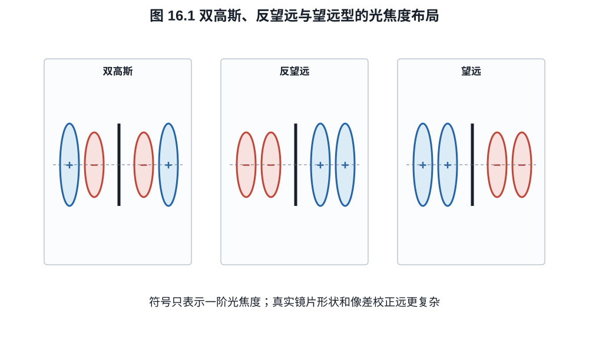
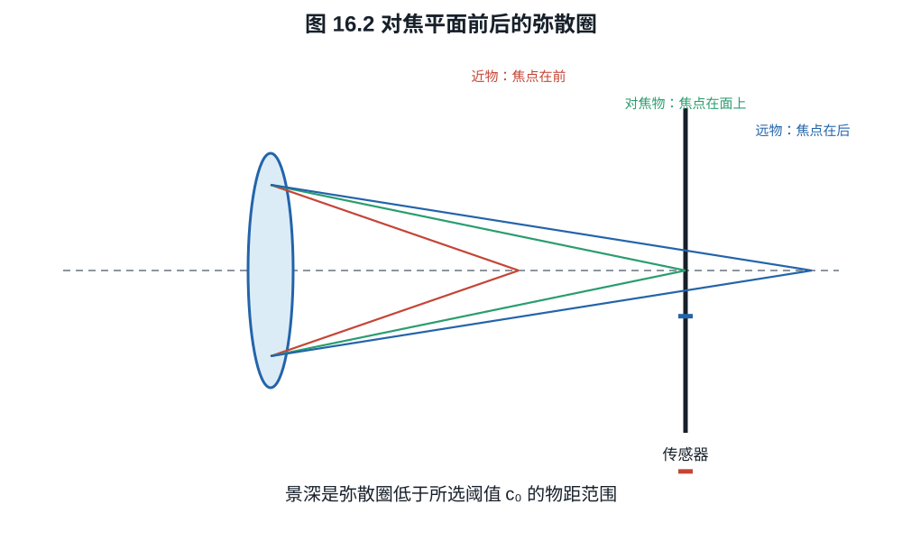
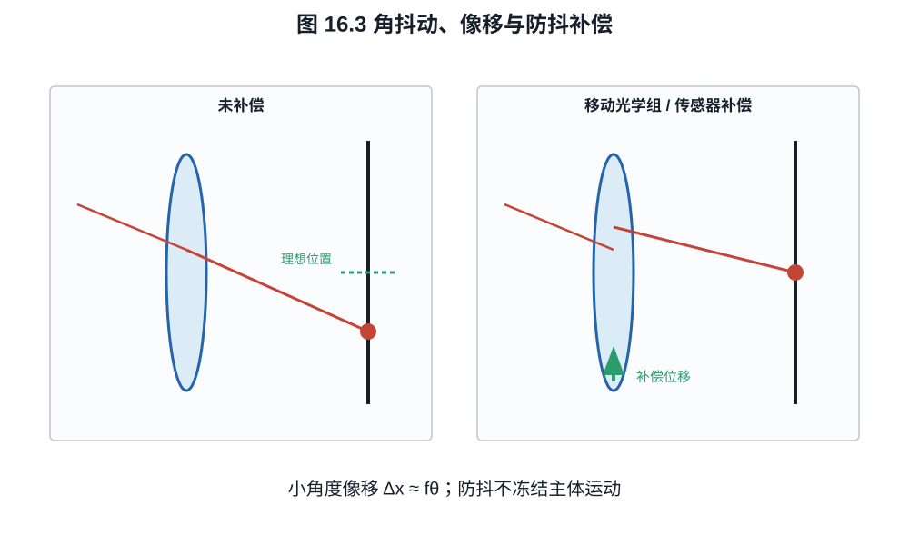

# 第十六章：镜头结构、对焦、变焦、防抖与远心性

镜片材料和单面像差最终要在一套机械可动系统中工作。镜头剖面图的分析不应停在
“几片 ED、几片非球面”，而应寻找各组承担的光焦度、孔径位置、移动方式和出瞳。
焦距、对焦呼吸、近摄性能、防抖和传感器入射角都由这些关系共同决定。
因此同样标称 70--200 mm 的两支变焦可以在最近对焦距离、长端实际视角和视频呼吸
上完全不同，镜片清单无法替代组运动分析。

## 16.1 几种典型光焦度分配

摄影镜头结构没有唯一分类，但一些一阶目的可识别：

- **双高斯型**：光阑附近近似对称，适合中等视角大光圈，能抵消部分奇次离轴像差；
- **反望远型（retrofocus）**：前负后正，使后焦距大于有效焦距，为广角与反光镜/卡口
  留空间；
- **望远型（telephoto）**：前正后负，使物理长度小于有效焦距；
- **远摄变焦**：多个正负组同时改变总光焦度并维持像面位置；
- **对称广角**：在无反光镜系统中可减小畸变，但可能给传感器边缘带来大主光线角。

这些名称描述光焦度布局，不直接给出画质等级。现代镜头常混合多种结构，并通过
非球面和数字畸变校正改变传统边界。

*图 16.1　正负号表示镜组的一阶光焦度，不是可制造处方。反望远结构换取较长后焦，
望远结构换取较短物理长度；像差、光阑和主平面仍由完整组间关系决定。*

## 16.2 对焦、浮动组与 breathing

整组伸长对焦遵循式 (11.5)，结构简单但长焦或微距所需移动量大。内对焦只移动较小
镜组，速度快、前端不转动，却会改变总系统矩阵，因而有效焦距、像差和入瞳位置随
距离变化。

浮动镜组让两个或更多组按不同规律移动，以补偿近距离球差、场曲和像散。镜头近摄
MTF 不能由无穷远 MTF 图推出；厂商图若只标 infinity，必须另测目标工作距离。

对焦呼吸（focus breathing）是对焦时视角/放大率变化。若机位不动，物距 $s$ 固定，
像高比例取决于系统有效焦距和主平面；内对焦改变这些量，就可能出现明显 breathing。
电影镜头常通过组间补偿降低它，但不能从“内对焦”名称判断大小。

**例子 16.2（由有效焦距变化估计呼吸）.** 36 mm 宽传感器上的镜头从无穷远对焦时
有效焦距 50 mm，变到近距离对焦时 45 mm。若暂时忽略主平面位移和畸变，水平视角由

$$
2\arctan\frac{36}{2\times50}=39.6^\circ
$$

变为

$$
2\arctan\frac{36}{2\times45}=43.6^\circ.
$$

远处物体的像高比例约变为 $45/50=0.90$，即约缩小 $10\%$。在真实近摄中还应从
物方主平面量物距并实测畸变，因此该计算是识别呼吸量级的一阶模型。

## 16.3 变焦为何需要补偿组

两薄透镜光焦度 $\Phi_1,\Phi_2$ 相距 $d$，空气中的合成光焦度为

$$
\Phi=\Phi_1+\Phi_2-d\Phi_1\Phi_2.                        \tag{16.1}
$$

改变 $d$ 就改变焦距，但后焦位置也会变化。变焦镜头用 variator 主要改变焦距，
compensator 同时移动以保持像面固定；现代多组设计由凸轮或电子控制多个轨迹。整个
变焦范围还需平衡像差、光圈、最近对焦和机械长度，因而一支恒定 $f/2.8$ 变焦比同
规格定焦复杂得多。

“恒定光圈”表示标称 f 数在变焦中保持，要求入瞳直径大致随焦距增加。若长端实际
透射下降，T-stop 仍可能变化。视频曝光稳定应看 T-stop 与控制步进，不只看 f 数。

## 16.4 景深是允许模糊标准

薄透镜对焦物距 $s_0$，传感器位于
$v_0=fs_0/(s_0-f)$。另一物距 $s$ 的理想像距
$v=fs/(s-f)$。直径 $D=f/N$ 的光锥在传感器面的弥散圈直径近似

$$
c(s)=D\left|1-\frac{v_0}{v}\right|.                       \tag{16.2}
$$

*图 16.2　景深边界来自选定的容许弥散圈，不是光学上突然从清晰变模糊的界面。
离焦 PSF 还会受像差、口径蚀和光阑形状影响，圆锥图只是一阶几何模型。*

**推导 16.1.** 光锥从透镜口径直径 $D$ 线性收缩，在 $z=v$ 处为零。距透镜 $v_0$
处的截面直径按相似三角形为
$D|v-v_0|/v$，即式 (16.2)。

给定容许弥散圈 $c_0$，可解出近、远景深。定义超焦距

$$
H=\frac{f^2}{Nc_0}+f.                                    \tag{16.3}
$$

在薄透镜、瞳孔放大率为一的模型中，对焦距离 $s_0$ 的近、远界为

$$
s_N=\frac{Hs_0}{H+(s_0-f)},
\qquad
s_F=\frac{Hs_0}{H-(s_0-f)},                              \tag{16.4}
$$

若分母不正则远界为无穷远。

**例子 16.3（景深判据的数值后果）.** 取 $f=35$ mm、$N=4$、
$c_0=0.020$ mm，得

$$
H=\frac{35^2}{4\times0.020}+35
=15\,347.5\ \mathrm{mm}.
$$

对焦 $s_0=5$ m 时，式 (16.4) 给出
$s_N\approx3.78$ m、$s_F\approx7.39$ m。若把输出标准收紧为
$c_0=0.010$ mm，超焦距近似翻倍，景深范围也明显缩窄；镜头和对焦距离未变，变化
来自“可接受”的判据。

弥散圈不是传感器固有常数。它取决于输出尺寸、观看距离、视力、去马赛克和锐化；
高分辨率像素级审查需用更严格 $c_0$。景深范围内只是“低于选定模糊阈值”，不是每个
距离都与对焦平面同样清晰。

## 16.5 光学防抖与机身防抖

相机小角度旋转 $\theta$ 使无穷远像点移动

$$
\Delta x\approx f\theta.                                 \tag{16.5}
$$

*图 16.3　镜头防抖改变光束方向，机身防抖移动传感器；两者都试图减小曝光期间的
相对像移。图不表示控制回路带宽或可补偿的全部自由度。*

**例子 16.4（角抖动换算为像素位移）.** $f=100$ mm 时发生
$0.02^\circ=3.49\times10^{-4}$ rad 的小角转动，瞬时像移约

$$
\Delta x=100\times3.49\times10^{-4}
=0.0349\ \mathrm{mm}=34.9\ \mu\mathrm m.
$$

对 $4\ \mu\mathrm m$ 像素，这相当于 8.7 pixel。若要求瞬时位移不超过一像素，
残余角误差需低于 $p/f=4.0\times10^{-5}$ rad，即约 $0.00229^\circ$。实际模糊取决
于整段曝光中的角运动轨迹，不只取峰值。

焦距越长，同一角抖动造成的像面位移越大。镜头防抖移动补偿组改变出射光线角度；
机身防抖移动/旋转传感器追随像。两者可协同分配频率和轴向。

防抖不能冻结主体运动，也不能完全补偿平移视差、滚动快门和快门冲击。近摄中相机
平移与角抖动都重要，式 (16.5) 的无穷远模型不足。防抖宣称“若干档”是指定成功率
和测试条件下可用快门的统计改善，不是每张照片的保证。

## 16.6 远心性、主光线角与传感器

像方远心系统的出瞳位于无穷远，主光线近似垂直入射像面，放大率对像面小位移不敏感。
摄影镜头通常不完全远心，但数字传感器希望边缘主光线角不过大：滤色片、微透镜和硅
对斜入射的响应会下降或串扰。短后焦无反系统给广角设计更多自由，也可能要求偏置
微透镜和传感器专用校正。

卡口直径和法兰距只是约束集合的一部分。大卡口、短法兰可允许更大后组或更直的边缘
光线，但不能单独保证更大光圈或更高 MTF；前玉、入瞳、机械遮挡和镜头设计仍决定
实际能力。

## 16.7 怎样读一张镜头剖面图

按以下次序比数特殊镜片更有信息：

1. 找光阑并估计入瞳由前组怎样成像；
2. 标出主要正、负光焦度组，判断 retrofocus、telephoto 或近对称布局；
3. 查哪些组用于变焦、对焦和防抖；
4. 看后组尺寸和边缘主光线角，而不是只看卡口；
5. 再看非球面、低色散和衍射元件被放在哪个高光线高度位置；
6. 用 MTF、畸变、暗角、呼吸和近摄数据验证猜测。

剖面图能帮助提出机制假设，不能替代处方数据和实测。只数“18 片比 12 片高级”忽略
了每片曲率、材料、位置和装调误差。

## 练习

**练习 16.1.** 两薄透镜焦距分别 $100$ mm 和 $-200$ mm，相距 20 mm。用式
(16.1) 求合成光焦度与等效焦距。

**练习 16.2.** 50 mm $f/8$ 镜头，容许弥散圈 0.03 mm，计算超焦距。对焦 10 m
时求近、远界。

**练习 16.3.** 200 mm 镜头发生 $0.01^\circ$ 角抖动，按式 (16.5) 计算像面位移，
并换算成 $4\ \mu$m 像素数。
