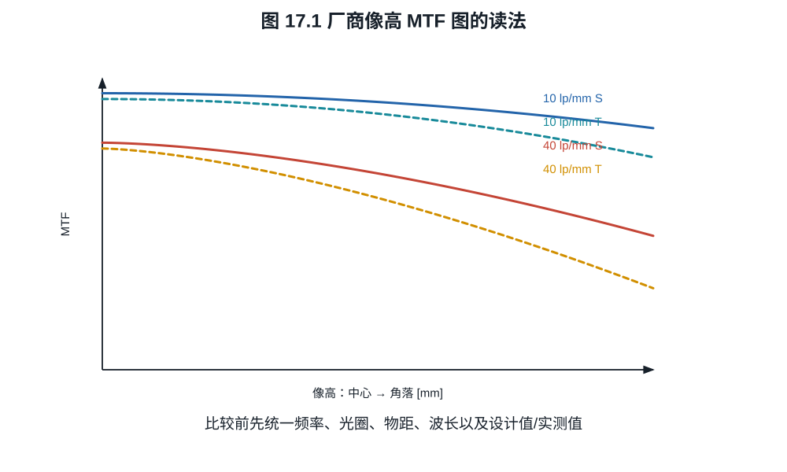
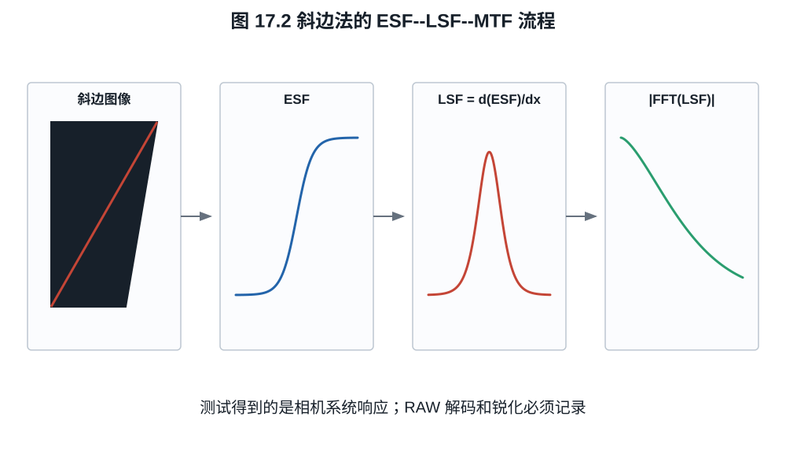
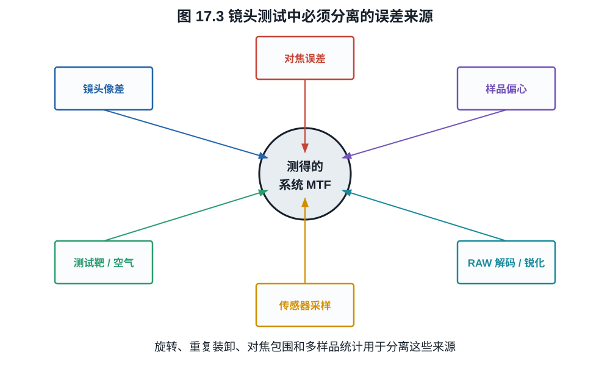

# 第十七章：怎样读 MTF、测试镜头并分析整套成像系统

器材分析的终点不是记住缩写，而是能设计一个不把变量混在一起的测试。镜头 MTF、
传感器采样、去马赛克和锐化共同形成输出；若测试图本身、对焦误差或机身处理成为
瓶颈，所得“镜头分辨率”只是整套流程的下界。
一条中心斜边曲线可以被锐化抬高，也可以被一次失焦压低；可靠结论必须让测试靶、
对焦、样品差异和输出处理都进入记录。

## 17.1 一张 MTF 图至少要读八项

读取厂商或实验室曲线时，依次确认：

1. 横轴是像高、空间频率还是离焦量；
2. 频率单位是 lp/mm、cycles/pixel 还是 picture height；
3. 光圈与焦距；
4. 物距；
5. 波长、单色还是白光加权；
6. sagittal 与 tangential 的定义；
7. 设计计算、衍射 MTF、单个样品实测还是多样品统计；
8. 是否包含传感器、低通滤镜和锐化。

典型厂商图把横轴设为从中心到角落的像高，分别画 10、30 或 40 lp/mm 的 S/T 曲线。
10 lp/mm 曲线高说明大结构反差好；高频曲线较能反映细节。不同厂商使用不同频率和
计算条件，曲线不能只按高低直接跨品牌排名。

*图 17.1　横轴为像高时，每条曲线只代表一个已声明频率、方向、光圈、物距与计算
条件。曲线高低不是跨厂商通用总分，S/T 分离也不能单独等同于散景好坏。*

**例子 17.1（同一数字的歧义）.** “MTF 0.7”若指 10 lp/mm 可能只是一般低频
反差；若指全开角落 50 lp/mm 则非常强；若指锐化 JPEG 的 MTF50 附近，又已包含
数字处理。缺少频率和处理状态时，0.7 没有可比较意义。

## 17.2 斜边法怎样得到 MTF

ISO 12233 类斜边测试的核心步骤是：

1. 拍摄略微倾斜的高反差边缘；
2. 利用每一行不同的亚像素交点超采样边缘扩展函数 ESF；
3. 对 ESF 求导得到线扩散函数 LSF；
4. 对 LSF 作 Fourier 变换并归一化，得到一维 MTF。

若边缘响应为理想阶跃 $u(x)$ 与 PSF $h(x)$ 卷积，

$$
\mathrm{ESF}=u*h.
$$

分布意义下 $u'=\delta$，所以

$$
\frac d{dx}\mathrm{ESF}
=\delta*h=h=\mathrm{LSF}.                                \tag{17.1}
$$

再作 Fourier 变换即可得到 OTF 的该方向截面。这一推导说明边缘必须足够锐且已知，
求导会放大噪声，因此实际算法需窗口、拟合、采样相位校正和有限差分修正。

*图 17.2　斜边让不同像素行取得不同亚像素相位，由此超采样一维 ESF。流程测得的是
靶、镜头、传感器采样和指定 RAW 解码共同形成的系统响应。*

一套明确的数值流程如下。

1. 在线性化、黑电平校正的单个 RAW 平面上拟合边缘直线。若单位法向量为
   $\boldsymbol n=(\cos\theta,\sin\theta)$，像素中心
   $\boldsymbol r_i$ 到边缘参考点 $\boldsymbol r_0$ 的有向距离为

   $$
   d_i=(\boldsymbol r_i-\boldsymbol r_0)\cdot\boldsymbol n.               \tag{17.1a}
   $$

2. 按 $d_i$ 把像素值放入宽度例如 $p/4$ 的箱中，分别估计每箱均值与样本数；剔除
   饱和、坏点和明显非均匀照明后，归一化暗、亮平台得到 ESF。箱宽、空箱插值和
   边缘角都必须记录。
3. 用中心差分求
   $\mathrm{LSF}_j=(E_{j+1}-E_{j-1})/(2h)$，去除 LSF 基线并乘声明的窗口。中心
   差分相对于连续导数的频率响应比为

   $$
   D_h(\nu)=\frac{\sin(2\pi\nu h)}{2\pi\nu h}.             \tag{17.1b}
   $$

   因而可在 $|D_h|$ 远离零且噪声可控的频带内除以 $D_h$ 作有限差分修正；靠近零点
   强行反卷积会无限放大噪声。
4. 对加窗 LSF 作离散 Fourier 变换，以零频幅值归一化并取模。将 cycles/pixel 乘
   $1/p$ 才得到 lp/mm；再报告 MTF50、固定 lp/mm 值以及 Nyquist 处响应。

**例子 17.2（解析 ESF 检验数值尺度）.** 假设线性系统的超采样 ESF 拟合为

$$
E(x)=\frac12\left[1+\operatorname{erf}
\left(\frac{x}{\sqrt2\sigma}\right)\right].
$$

其 LSF 是标准差 $\sigma$ 的 Gaussian，归一化 MTF 为
$\exp(-2\pi^2\sigma^2\nu^2)$，所以

$$
\nu_{50}=\frac{\sqrt{\ln2}}{\sqrt2\pi\sigma}.
$$

若 $\sigma=0.85$ pixel，则
$\nu_{50}=0.2205$ cycles/pixel。像素节距为 0.004 mm 时，这等于
$55.1$ lp/mm。该值是生成此 ESF 的整个线性系统 MTF50；除非靶、像素孔径与解码器
的 OTF 已知且反卷积稳定，不能把它直接改名为“镜头 MTF50”。

相机锐化会在 ESF 上产生过冲/欠冲，使某些频率 MTF 被抬高甚至超过 $1$。测光学链时
应使用线性 RAW、关闭或记录锐化和降噪，并对 CFA 去马赛克影响保持一致。

## 17.3 对焦误差与样品差异

大光圈高频 MTF 对离焦非常敏感。可靠测试应对每个焦距、光圈和像场位置做对焦包围，
报告最佳焦平面和同一焦平面两种结果。只让相机 AF 一次，会把 AF 偏差当作镜头像差。

偏心或倾斜样品常表现为四角不对称：一角最佳焦点与对角不同，S/T 响应也可能异常。
测试至少需要旋转相机或镜头复测，以区分测试靶倾斜、机身卡口倾斜和镜头偏心。单个
样品不能证明整个型号分布；多样品报告应给中位数和离散度，而不只挑最好一支。

## 17.4 从镜头 MTF 到系统 MTF

设 45 MP 全画幅横向 8256 像素，像素节距约

$$
p=36/8256\approx0.00436\ \mathrm{mm},
$$

Nyquist 频率约 $114.7$ lp/mm。假设某频率处镜头 MTF 为 $0.40$，满填充矩形像素
在 Nyquist 为 $0.637$，无 OLPF，则线性预采样近似

$$
\mathrm{MTF}_\mathrm{pre}\approx0.40\times0.637=0.255.
$$

这仍未加入 CFA、去马赛克、混叠和锐化。镜头在 Nyquist 仍有响应不是坏事，但高于
Nyquist 的能量可折叠为伪纹理。高像素传感器一方面要求更高 lp/mm，另一方面也用
更密采样减少混叠并更完整记录镜头低频信息。

**命题 17.3（系统不优于乘积中的任一无增益低通环节）.** 若各环节在某频率的
MTF 均位于 $[0,1]$，且满足乘积模型，则系统 MTF 不大于任一环节 MTF。

**证明.** 对任意 $j$，
$\prod_i m_i=m_j\prod_{i\ne j} m_i\le m_j$，因为其余因子均不超过 $1$。$\square$

数字反卷积和锐化可以给某些频率增益大于 $1$，但同时放大噪声、振铃和模型误差，
因此不违反命题的“无增益低通环节”假设。

## 17.5 分辨率测试的尺度换算

若测得传感器平面 MTF50 为 $\nu_{50}$ lp/mm，画面高度为 $h$ mm，则可换算为

$$
\mathrm{LW/PH}=2\nu_{50}h,                               \tag{17.2}
$$

因为一线对含一黑一白两条 line width。报告 lp/ph 或 LW/PH 时经常混用两倍关系，
必须看定义。

不同画幅比较应同时给传感器平面 lp/mm 和整幅 picture height 指标。前者考验镜头的
局部空间频率，后者更接近同构图输出细节。小画幅镜头可能有更高 lp/mm，却因画幅小
而总 picture height 分辨率不一定更高。

## 17.6 一套可执行的镜头测试协议

室内平面靶测试可按以下流程：

1. 使用足够大、已知质量的斜边靶，保证靶本身频率高于被测系统；
2. 相机与靶平行，用水平仪和四角距离/对焦一致性校正；
3. 固定均匀无频闪照明，避免反光和快门振动；
4. 记录 RAW、固定白平衡和曝光，使各通道不剪切；
5. 每个光圈做对焦包围，中心与四角分别求最佳和共同焦面；
6. 用同一 RAW 解码参数，禁止内容自适应锐化或记录其参数；
7. 报告 MTF50、若干固定频率、畸变、暗角和倍率色差；
8. 重复装卸、旋转和多次拍摄，估计重复性；条件允许时测多个样品。

*图 17.3　靶、几何、对焦、样品和处理都能改变最终曲线。控制变量的目的不是让
测试“更专业”，而是让观测差异能归因到镜头或明确声明的系统。*

无穷远景观测试能暴露远焦场曲、热空气扰动和真实纹理，却难以得到已知输入 MTF。
近距离平面靶可量化，却可能不代表无穷远和立体场景。两类测试互补。

### 17.6.1 重复性、样品差异与不确定度

对每个工作点至少分开三层变异：同一对焦与装夹下的重复拍摄、重新对焦/重新装夹、
不同镜头样品。可用随机效应记号

$$
y_{\ell,a,r}=\mu+\alpha_\ell+\beta_{\ell,a}+\varepsilon_{\ell,a,r},
$$

$\alpha_\ell$ 表示第 $\ell$ 支镜头的样品效应，$\beta_{\ell,a}$ 表示该样品第
$a$ 次装夹或对焦效应，$\varepsilon_{\ell,a,r}$ 表示重复拍摄与估计噪声。即使不做
完整方差分量拟合，也应分别报告各层的样本标准差，而不能把几十次同一装夹连拍当成
几十支样品。

对焦包围后挑最大 MTF 会产生“取最大值”偏差：噪声越大、候选焦点越多，最大值的
期望越高。更稳妥的做法是对 MTF 随离焦的曲线作平滑拟合，从拟合峰值和重复包围
估计置信区间，并同时保存共同焦面结果。若报告多像高、多频率，预先规定主要指标，
避免只展示偶然最好的一个角和一个频率。

## 17.7 MTF 之外还必须测什么

一支镜头的系统评价至少还包括：

- 透射率与色彩透射；
- 暗角与出瞳形状；
- 畸变及校正后的有效视角；
- 轴向/倍率色差；
- 逆光鬼影与 veiling glare；
- 对焦速度、重复性、呼吸和近摄像质；
- 防抖成功率分布；
- 散景 PSF、光阑形状和机械品质。

MTF 很重要，因为它把模糊变成频率响应；它不重要到足以替你决定照片。正确的器材
分析不是寻找一个总分，而是把拍摄任务转换成一组有权重、可复核的系统指标。

## 17.8 一套反忽悠检查表

遇到器材技术结论时，按顺序检查：

1. **对象**：说的是镜头、传感器 RAW、相机 JPEG 还是显示？
2. **控制变量**：视角、曝光、景深、输出尺寸和处理是否一致？
3. **单位**：electron、DN、bit、stop、dB、lp/mm 是否混用？
4. **统计**：单像素还是整图，单样品还是型号分布？
5. **因果**：结构名称是否真的推出所声称性能？
6. **边界**：运动、饱和、混叠、温度和软件校正是否被隐藏？
7. **复现**：给出的数据是否足以重复计算或拍摄？

能通过这七项的分析不一定结论与你相同，但至少已经进入可以讨论的技术层面。

## 练习

**练习 17.1.** 36 mm 宽图像中横向 6000 像素，求 Nyquist lp/mm。某镜头在该频率
MTF 为 0.3，像素孔径 MTF 为 0.637，求乘积模型的预采样系统 MTF。

**练习 17.2.** 测得 MTF50 为 45 lp/mm，画面高度 24 mm。分别换算 lp/ph 与
LW/PH，并解释二者的两倍关系。

**练习 17.3.** 某评测只展示一张相机内锐化 JPEG 的中心斜边 MTF，并宣称镜头
“解析 100 MP”。列出至少五项缺失条件。

**练习 17.4.** 一条线性斜边的 Gaussian LSF 标准差为 $0.70$ pixel，像素节距
$3.76\ \mu\mathrm m$。按例 17.2 计算 MTF50 的 cycles/pixel 与 lp/mm，并说明
为何它仍是系统而非镜头单体数值。
