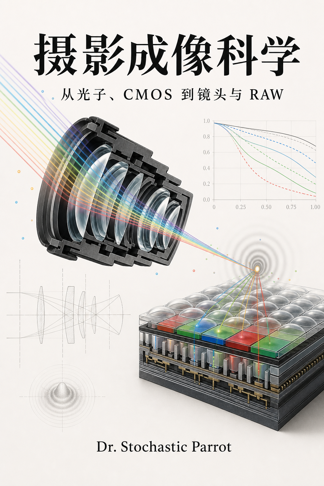

# 摄影成像科学：从光子、CMOS 到镜头与 RAW

<p align="center">
  
</p>

作者：Dr. Stochastic Parrot

状态：内容收口候选稿。18 个编号章节、48 幅可复现技术图、62 道练习及逐题答案
已经闭环；仍可在获得真实器材实验数据后增加案例，但不再依赖这些数据才能完成主线。

这本书不从品牌和器材型号出发，而从一次曝光怎样形成一幅图像出发。主线是

$$
\text{场景辐亮度}
\longrightarrow \text{镜头像面曝光}
\longrightarrow \text{光电子}
\longrightarrow \text{读出码值}
\longrightarrow \text{RAW/Log/RGB}
\longrightarrow \text{显示或印刷图像}.
$$

只有把术语放回这条链，才能判断“高 ISO 更亮”“Log 损失画质”“像素越大越
好”“堆栈传感器噪声更大”“萤石一定比玻璃锐”“MTF 曲线代表一切”究竟在哪些
条件下成立。全书默认读者会高中数学；微积分、复数、Fourier 变换和概率论在使用
处给出必要推导，较系统的工具集中在附录 A。

写作约束见 [SKILL.md](SKILL.md)，符号见 [NOTATION.md](NOTATION.md)，资料源见
[SOURCES.md](SOURCES.md)，逐章来源用途见 [CHAPTER_SOURCE_NOTES.md](CHAPTER_SOURCE_NOTES.md)。
习题答案见 [SOLUTIONS.md](SOLUTIONS.md)，术语检索见 [TERM_INDEX.md](TERM_INDEX.md)。
全部技术图由 [generate_figures.py](figures/generate_figures.py) 生成，SVG 源文件位于
[figures](figures/)；它们是机制图或解析曲线，不冒充具体器材实测。

## 第一部分：光、曝光与传感器

0. [序章：从一次曝光开始](00_preface_scope_and_measurement.md)
1. [第一章：辐射度学、光圈与曝光量](01_radiometry_aperture_and_exposure.md)
2. [第二章：从光子到电子：硅光电转换与像素](02_photons_silicon_and_pixels.md)
3. [第三章：CMOS 像素、读出链与模数转换](03_cmos_pixels_readout_and_adc.md)
4. [第四章：噪声、信噪比、满阱与动态范围](04_noise_snr_full_well_and_dynamic_range.md)
5. [第五章：ISO、曝光指数、增益与“双原生”](05_iso_exposure_index_and_gain.md)
6. [第六章：滚动/全局快门、背照、堆栈与曲面传感器](06_shutters_bsi_stacking_and_curved_sensors.md)
7. [第七章：色彩滤阵、采样、去马赛克与色彩矩阵](07_color_filter_sampling_and_demosaicing.md)

## 第二部分：计算曝光、编码与文件

8. [第八章：包围曝光、多帧降噪与现代 HDR 合成](08_computational_exposure_and_hdr.md)
9. [第九章：Gamma、Log、曝光指数与显示变换](09_gamma_log_exposure_index_and_display.md)
10. [第十章：静态 RAW、视频 RAW、压缩与元数据](10_still_raw_video_raw_and_compression.md)

## 第三部分：镜头的物理与工程

11. [第十一章：几何光学、近轴矩阵与镜头基本量](11_geometrical_optics_and_paraxial_systems.md)
12. [第十二章：衍射、PSF、OTF、MTF 与采样](12_diffraction_psf_otf_mtf_and_sampling.md)
13. [第十三章：球差、彗差、像散、场曲、畸变与色差](13_aberrations_and_field_behavior.md)
14. [第十四章：玻璃、树脂、萤石与低色散材料](14_optical_materials_glass_resin_and_fluorite.md)
15. [第十五章：非球面、Fresnel、PF/DO 与镀膜](15_aspheres_fresnel_diffractive_optics_and_coatings.md)
16. [第十六章：镜头结构、对焦、变焦、防抖与远心性](16_lens_architectures_focus_zoom_and_stabilization.md)
17. [第十七章：怎样读 MTF、测试镜头并分析整套成像系统](17_lens_testing_and_system_analysis.md)

## 附录

- [附录 A：概率、Fourier 变换与单位](A_probability_fourier_and_units.md)
- [附录 B：常用计算表与换算](B_calculation_reference.md)
- [答案手册](SOLUTIONS.md)
- [术语索引](TERM_INDEX.md)
- [逐章来源注释](CHAPTER_SOURCE_NOTES.md)

## 图版与校验

重新生成全部图版：

```bash
python3 books/photographic-imaging-science/figures/generate_figures.py
```

执行教材闭环检查：

```bash
python3 books/photographic-imaging-science/validate.py
python3 books/audit_oet_rigor.py photographic-imaging-science --strict
python3 books/audit_textbook_narrative.py photographic-imaging-science --strict
```

校验器检查章节数、练习--答案双射、方程编号、局部链接、图版 XML、图注、控制字符
与来源章节覆盖。它不能替代数学审稿，但能阻止排版和清单层面的回归。

## 范围边界

本书讨论摄影和电影摄影所需的成像物理、电子学、计算成像与镜头分析。完整半导体
器件工艺、镜头优化软件、感知色貌模型、压缩编码器实现和摄影艺术史属于外部学科，
只在主线需要处建立接口。本书不替某一品牌评定器材，也不把实验室单一指标等同于
照片价值。
