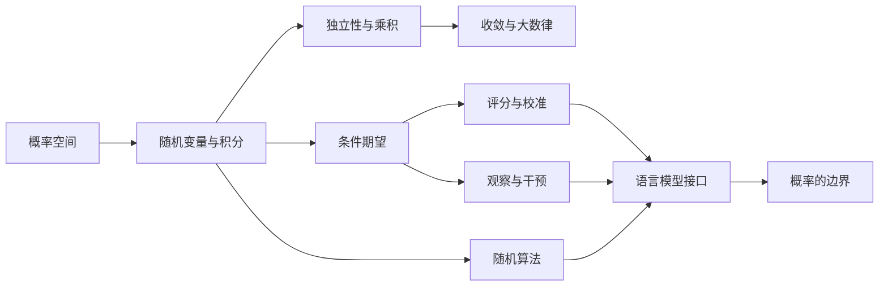

# 序章：问题、范围与证明边界

设一个文本生成程序接受整数种子 $s$，并在固定模型、输入和运行环境下输出
$F(s)$。对每个已经给定的 $s$，$F(s)$ 只有一个值；如果种子 $S$ 被赋予某个分布，
那么 $F(S)$ 又是随机变量。这两句话同时成立，所处的层次却不同：前一句讨论函数，
后一句讨论定义在输入上的概率测度。

实际系统比这个例子多出训练数据、参数版本、解码规则、并行调度与外部服务，但困难
并没有因此改变：必须先找出随机对象，才能谈它的概率。本序章约定全书使用“随机”
一词的方式，并说明哪些数学结果会在书内证明。正式的测度论概率从第一章开始。

## 0.1 一个词，至少五个位置

“这个模型是随机的”可能指五件不同的事：

1. 训练样本被建模为随机变量；
2. 优化器使用随机小批量、随机初始化或噪声；
3. 已训练模型输出一个条件概率分布；
4. 解码器从该分布采样；
5. 观察者不知道完整参数、输入、种子、调度或硬件状态。

这五个陈述没有逻辑等价关系。一个模型可以由随机优化训练，却用贪心解码确定性地产生输出；也可以由固定参数定义确定性 logits，再由外部随机源采样；还可以在源代码层面没有随机调用，却因并行调度和浮点约简次序而不可逐位复现。

本书的第一条纪律因此是：每次使用“随机”一词，都回答以下问题。

- 样本空间是什么？
- $\sigma$-代数是什么？
- 概率测度是什么？
- 随机变量是哪一个映射？
- 条件信息是什么？
- 固定哪些输入后，输出仍不是单值函数？

若这些问题没有答案，“随机”可能只是对未知、复杂、不可预测或多样性的松散称呼。

## 0.2 三个层次

全书区分三个层次。

**数学层。** 概率空间、随机变量、Markov 核、条件期望和收敛方式属于数学对象。它们的结论由公理与证明保证。

**实现层。** 软件、伪随机数生成器、浮点算术、并行调度、设备内核和外部工具组成实际执行。实现可以符合某个数学模型，也可以偏离它；“同一种分布”不等于“同一条比特串”。

**解释层。** 观察者用“不确定”“有信心”“犹豫”“期待”等词描述系统。此类语句需要额外的语义桥梁。由 $p(y\mid x)=0.6$ 本身不能推出任何心理状态。

## 0.3 本书走到哪里

本书从概率空间出发，依次发展以下内容：

- 概率空间、随机变量、分布与期望；
- 独立性、条件期望与有限/可数信息更新；
- 概率不等式与弱大数律；
- 熵、KL 散度、对数损失与 Brier 分解；
- 随机算法的数学接口；
- 观察分布与干预分布的区别；
- 自回归语言模型中的分布、解码和实现边界。

以下内容作为外部输入或范围外主题：测度扩张的完整证明、Radon--Nikodym 定理、一般乘积测度构造、Ionescu--Tulcea 定理、强大数律的最一般形式、中心极限定理、正则条件概率的一般存在定理、算法随机性理论，以及现代因果识别的完整图论体系。

## 0.4 哪些论证在书内完成

数学章节中的非平凡结论必须有完整证明或精确外部输入。经验性结论必须说明测量对象和外推边界。哲学性结论必须以“论证”形式列出前提，不用定理编号制造虚假确定性。

例如，“温度越高，模型越有创造力”不是数学定理。可以证明温度缩放对非退化有限 logits 的 Shannon 熵有单调性；但“创造力”不是该熵的定义，也没有由这一定理自动获得的测量对应。

## 0.5 阅读顺序

章节依赖按以下方向组织：

该图表达阅读依赖，不表达因果关系。

## 0.6 与其余四本书的关系

本书只回答概率对象如何定义、计算与约束。它不系统回答解释方法是否有效、实验能否复现、一次输出由哪些过程构成，以及一段解释是否构成证明。这些问题分别由《机器解释学》《可复现性的幻觉》《一次输出的存在论》和《证明、解释与漂亮话》处理。

因此，本书不会先问一个系统“本质上是否随机”，而会先把系统写成函数、核、随机
变量或执行过程，再检查概率位于训练、模型、解码、实现还是观察者的信息中。第一章
从这项工作最小而不可省略的容器开始：事件族与概率测度。

## 练习

**练习 0.1.** 对“抛一枚硬币”和“调用一个固定种子的伪随机数生成器”分别列出可能的样本空间、随机变量和观察者信息。

**练习 0.2.** 构造一个“训练随机但推理确定”的抽象模型，以及一个“训练确定但推理随机”的抽象模型。

**练习 0.3.** 解释为什么“输出不可预测”不蕴含“输出不是确定性函数”。

**练习 0.4.** 给出一个关于“置信度”的句子，并分别写出它的数学解释、实现解释和心理解释。指出三者之间还需要哪些桥梁假设。
