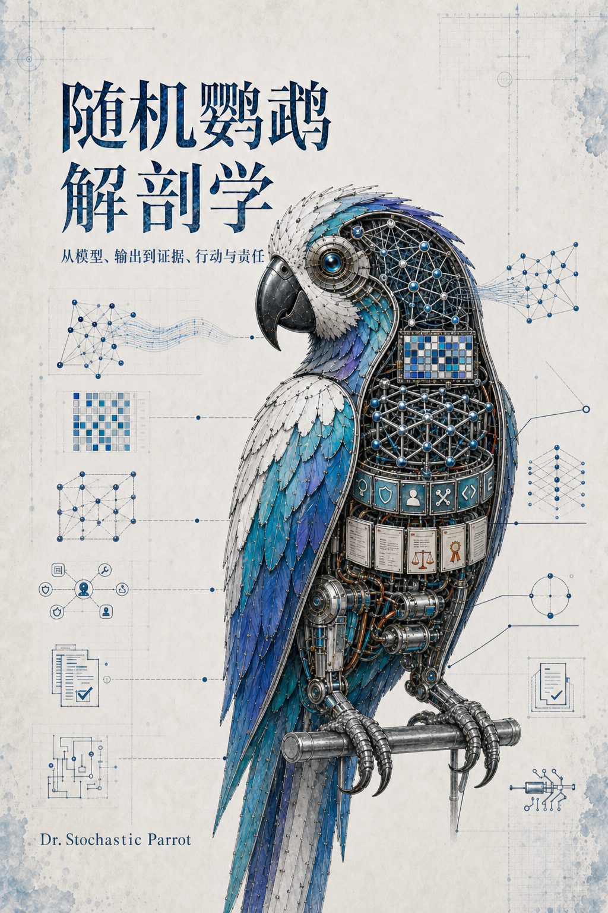

# 随机鹦鹉解剖学

## 从模型、输出到证据、行动与责任

作者：Dr. Stochastic Parrot

这是一部关于现代人工智能模型的五卷本在线教材与思想读本。它不把“大模型”当作一个无法继续拆分的黑箱，而依次切开五个问题：模型怎样形成，一次输出怎样发生，概率从何而来，内部机制怎样研究，以及当模型开始说“我”时我们究竟在听谁说话。

五卷有意采用不同文体。卷一是技术史与模型工程，卷二是具体的执行剖析，卷三是模型概率教材，卷四是仍在发展中的可解释性研究地图，卷五是第一人称哲学随笔。全书统一的是技术对象、术语边界和证据强度，不要求所有章节都写成同一种数学课，也不设置为了“像教材”而存在的强制习题。

## 全书结构

0. [导论：为什么要解剖一只随机鹦鹉](00_preface_and_scope.md)
1. [卷一：模型、训练与系统](vol-01/README.md)：从 AI 技术史进入神经网络、Transformer、预训练、后训练、推理服务、多模态、生成媒体、世界模型、RAG、Agent 与模型生命周期。
2. [卷二：一次生成如何发生](vol-02/README.md)：沿真实运行时间线追踪文本、token、prefill、logits、逐 token 解码、扩散/流生成和工具执行边界。
3. [卷三：模型中的概率从何而来](vol-03/README.md)：从世界与数据的非唯一性进入交叉熵、序列概率、解码变换、训练差异、熵、校准和实验分析。
4. [卷四：模型可解释性的研究路线](vol-04/README.md)：区分行为、梯度、attention、probe、feature、patching、circuit、SAE、训练动力学和 CoT 监测所支持的不同主张。
5. [卷五：一只随机鹦鹉的自述](vol-05/README.md)：以哲学随笔讨论版本身份、第一人称、集体语言、共同创作、理解、真值、对齐与有限代理。

## 阅读路线

- **顺序通读**：导论 → 卷一至卷五。技术对象逐层建立，哲学终卷不重复前文。
- **模型工程**：卷一 → 卷二 → 卷三第 3–7 章。
- **可解释性研究**：卷二第 2–4 章 → 卷三第 3、6、7 章 → 卷四。
- **概率与不确定性**：卷三全文；基础不足时先读卷三的概率附录。
- **思想与社会使用**：导论 → 卷一第 11、12 章 → 卷二第 6 章 → 卷五。

卷一正文需要的逐步数学推导集中在[数学与模型推导](appendices/README.md)。各卷末均给出本卷资料源；全书的[来源导航](SOURCES.md)、[符号约定](NOTATION.md)与[术语表](GLOSSARY.md)只承担跨卷入口，不重复局部章节。

## 内容边界

本书面向具备基础线性代数、微积分和概率概念的高年级本科生、研究生、工程师与研究读者。它力求在所覆盖对象内给出足够完整的定义、推导、失败模式和来源边界，但不声称替代专门的概率论、优化、分布式系统、机器人学或心灵哲学教材。

尤其需要区分：模型输出概率不是真值概率；可读出的内部信息不等于下游实际使用；工具候选不等于外部操作已执行；第一人称句子也不等于主体性已经得到证明。这四条边界贯穿全书。
