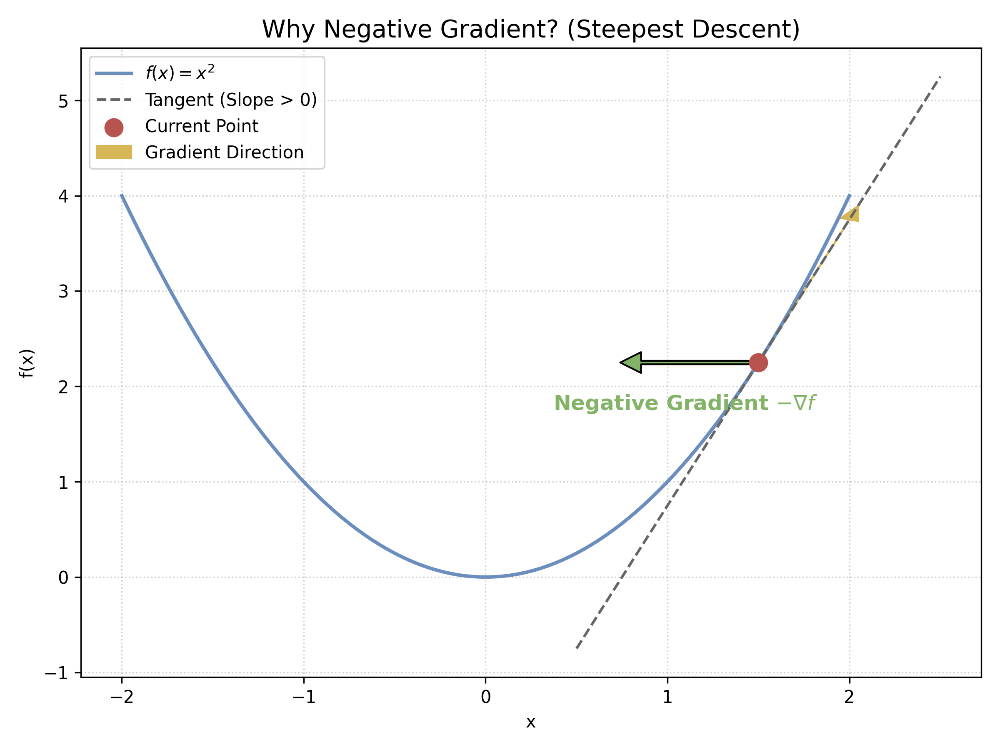
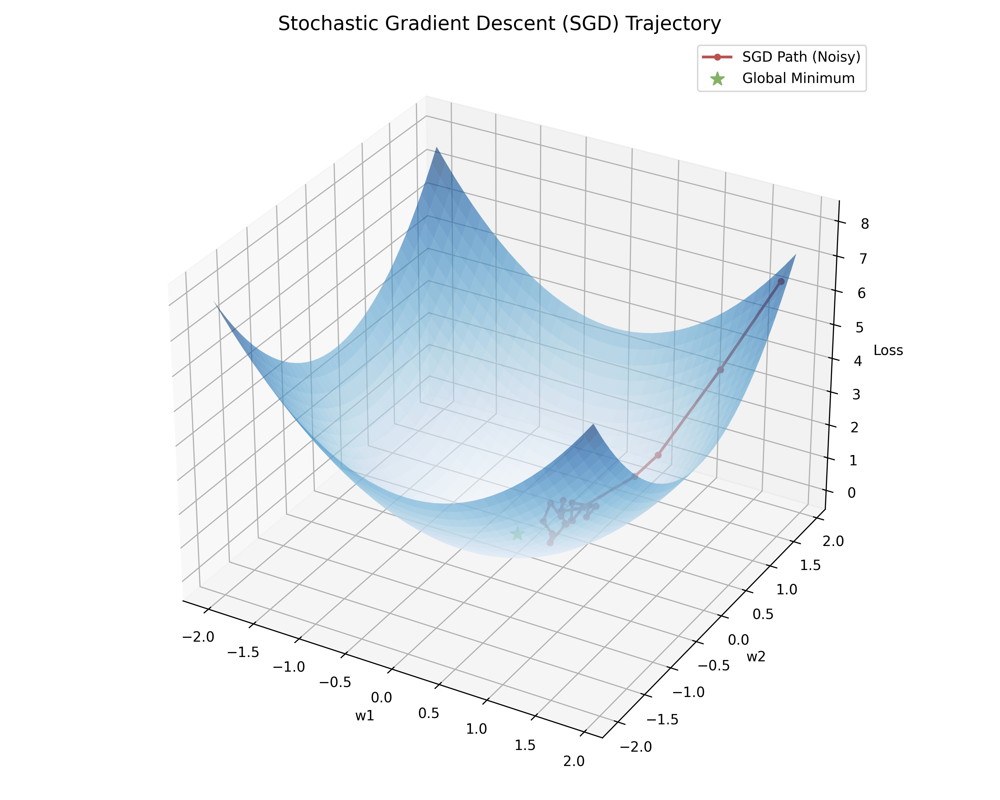
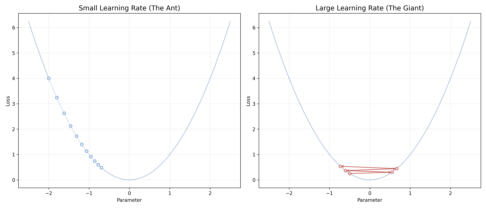

# 附录 A.1 优化理论基础：从梯度到 SGD

本附录为不熟悉微积分或最优化理论的读者补充梯度、下降引理与随机梯度下降。SGD 的收敛结论只在明确的目标几何、噪声和步长条件下成立。

## A.1.1 梯度的几何意义 (Geometric Interpretation of Gradient)

### 1. 导数与偏导数
对于单变量函数 $f(x)$，导数 $f'(x)$ 代表了函数曲线在某一点的切线斜率。
对于多变量函数 $f(x, y)$，我们需要 **偏导数**。
*   $\frac{\partial f}{\partial x}$：保持 $y$ 不变，只看 $x$ 变化带来的 $f$ 的变化率。
*   $\frac{\partial f}{\partial y}$：保持 $x$ 不变，只看 $y$ 变化带来的 $f$ 的变化率。

### 2. 梯度向量 (The Gradient Vector)
梯度是一个向量，由所有偏导数组成：
$$ \nabla f(\mathbf{x}) = \left[ \frac{\partial f}{\partial x_1}, \frac{\partial f}{\partial x_2}, \dots, \frac{\partial f}{\partial x_n} \right]^T $$

**核心性质**：
1.  **方向**：在欧氏范数下且梯度非零时，单位向量 $\nabla f(\mathbf x)/\|\nabla f(\mathbf x)\|$ 使一阶方向导数最大。
2.  **大小**：该最大一阶变化率等于 $\|\nabla f(\mathbf x)\|$。改变参数空间的范数或几何后，最陡方向也会改变。

---

## A.1.2 为什么是“负”梯度？(Why Negative Gradient?)

我们希望最小化损失函数 $L(\boldsymbol\theta)$。在欧氏单位步长约束下，**负梯度** $-\nabla L(\boldsymbol\theta)$ 给出一阶近似中的最陡下降方向。

**局部推导（一阶 Taylor 展开）**：
若 $L$ 可微，则在 $\Delta\boldsymbol\theta\to0$ 时：
$$ L(\mathbf{\theta} + \Delta \mathbf{\theta}) \approx L(\mathbf{\theta}) + \nabla L(\mathbf{\theta})^T \Delta \mathbf{\theta} $$
我们希望 $L(\mathbf{\theta} + \Delta \mathbf{\theta}) < L(\mathbf{\theta})$，即要求：
$$ \nabla L(\mathbf{\theta})^T \Delta \mathbf{\theta} < 0 $$
令 $\Delta \mathbf{\theta} = -\eta \nabla L(\mathbf{\theta})$ （其中 $\eta > 0$ 是一个小正数）：
$$ \nabla L(\mathbf{\theta})^T (-\eta \nabla L(\mathbf{\theta})) = -\eta \|\nabla L(\mathbf{\theta})\|^2 < 0 $$
不等式成立（除非梯度为 0），说明负梯度具有负的**方向导数**。一阶 Taylor 式只描述局部行为；要保证有限步长后实际下降，还需 $\eta$ 足够小及适当光滑性。例如若 $L$ 的梯度是 $M$-Lipschitz，则下降引理给出

$$
L(\theta-\eta\nabla L(\theta))
\le L(\theta)-\eta\left(1-\frac{M\eta}{2}\right)\|\nabla L(\theta)\|^2,
$$

所以 $0<\eta<2/M$ 时（且梯度非零）可保证这一步下降。非光滑目标或过大步长不能直接套用该结论。

---

## A.1.3 批量梯度下降 vs 随机梯度下降 (BGD vs SGD)

在机器学习中，总损失通常是所有样本损失的平均值：
$$ L(\mathbf{\theta}) = \frac{1}{N} \sum_{i=1}^N \ell_i(\mathbf{\theta}, \mathbf{x}_i, y_i) $$

### 1. 批量梯度下降 (Batch Gradient Descent, BGD)
每次更新都计算**所有** $N$ 个样本的梯度平均值：
$$ \mathbf{\theta} \leftarrow \mathbf{\theta} - \eta \frac{1}{N} \sum_{i=1}^N \nabla \ell_i $$
*   **性质**：对固定参数，它给出完整经验风险的精确梯度，不含样本抽取噪声。
*   **代价**：每次更新需要处理全部 $N$ 个样本。梯度可以分块累积而不必把全部样本同时放入内存，但更新频率和单步计算量仍受 $N$ 限制。

### 2. 随机梯度下降 (Stochastic Gradient Descent, SGD)
每次更新只随机抽取 **一个** 样本 $(\mathbf{x}_i, y_i)$ 计算梯度：
$$ \mathbf{\theta} \leftarrow \mathbf{\theta} - \eta \nabla \ell_i $$

*   **数学合理性（无偏估计）**：
    虽然单个样本的梯度 $\nabla \ell_i$ 可能与总梯度 $\nabla L$ 方向不同（甚至相反），但其**数学期望**等于总梯度：
    $$ \mathbb{E}_{i \sim U(1,N)} [\nabla \ell_i] = \sum_{i=1}^N \frac{1}{N} \nabla \ell_i = \nabla L(\mathbf{\theta}) $$
    这意味着在给定当前参数时，随机方向的条件期望等于完整经验梯度；它不保证每一步都下降。

*   **性质**：单次更新成本较低，可以更频繁地更新参数。随机梯度噪声在某些条件下可能帮助离开严格鞍点或浅而平坦的盆地，但不保证逃离一般局部极小值，也可能增加稳态误差。

### 3. 小批量梯度下降 (Mini-batch SGD)
实际中最常用的是折中方案：每次取一小批样本（如 Batch Size = 32 或 64）。
这既利用了向量化计算的并行优势（GPU 擅长矩阵运算），又保持了 SGD 的随机性优势。

---

## A.1.4 SGD 收敛性证明草图 (Sketch of Convergence Proof)

SGD 的收敛结论依赖目标几何、梯度估计、噪声矩与步长等假设。下面只给出 **Robbins-Monro** 随机逼近框架中的一个经典充分条件组合。

### 1. 收敛条件 (Robbins-Monro Conditions)
在凸/强凸目标、无偏随机梯度与适当矩界等附加条件下，常用的步长充分条件是：

1.  **发散和条件**：$\sum_{t=1}^{\infty} \eta_t = \infty$
    *   **作用**：确定性的下降信号不会因总步长有限而过早失去全部影响；这不表示迭代能够到达参数空间中的任意位置。
2.  **平方收敛条件**：$\sum_{t=1}^{\infty} \eta_t^2 < \infty$
    *   **直觉**：平方步长可和使有界二阶矩噪声的累计加权影响可控；它本身不等于证明随机梯度方差随 $t$ 自动趋于 0。

一类满足条件的幂律序列是

$$ \eta_t=t^{-\alpha},\qquad \frac{1}{2}<\alpha\le 1. $$

例如 $1/t$ 满足两项条件；$1/\sqrt t$ 的平方是调和级数，故不满足 $\sum_t\eta_t^2<\infty$。

### 2. 收敛性推导 (Convex Case)
假设目标函数 $L(\theta)$ 是 $\mu$-强凸的，梯度适当光滑，随机梯度无偏，并满足有界二阶矩 $\mathbb{E}[\|g_t\|^2\mid\theta_t]\le G^2$。这里是**二阶矩**界，不应称为方差界；方差界会写成 $\mathbb E[\|g_t-\nabla L(\theta_t)\|^2\mid\theta_t]\le\sigma^2$。

给定当前迭代点 $\theta_t$，展开参数与最优解 $\theta^*$ 的距离平方：

$$
\begin{aligned}
\mathbb E_t\|\theta_{t+1}-\theta^*\|^2
&=\|\theta_t-\theta^*\|^2
-2\eta_t\langle\nabla L(\theta_t),\theta_t-\theta^*\rangle
+\eta_t^2\mathbb E_t\|g_t\|^2\\
&\le(1-2\mu\eta_t)\|\theta_t-\theta^*\|^2
+\eta_t^2G^2.
\end{aligned}
$$

这里 $\mathbb E_t[\cdot]=\mathbb E[\cdot\mid\theta_t]$，最后一步使用无偏性与强凸函数的
$\langle\nabla L(\theta),\theta-\theta^*\rangle\ge\mu\|\theta-\theta^*\|^2$。再取全期望得到相应递推。

这个递归不等式揭示了 SGD 的核心动力学：
*   **第一项** $(1 - 2\eta_t \mu)$：类似于收缩因子，通过梯度下降拉近与 $\theta^*$ 的距离。
*   **第二项** $\eta_t^2 G^2$：这是控制随机梯度更新平方大小的上界项；它包含信号与噪声的二阶矩，不宜解释为纯方差总在“推离”最优解。

**结论边界**：结合强凸性、无偏性、二阶矩界、适当步长上界与 Robbins-Monro 条件，可用随机逼近定理证明相应收敛结论。该草图不是对非凸神经网络或任意学习率调度的全局最优保证。

---

## A.1.5 学习率对有限步更新的影响

参数 $\eta$ 被称为学习率。过小的学习率会降低单位计算量的进展；过大的学习率可能越过局部低谷、造成震荡或发散。可接受范围取决于曲率、梯度噪声、参数化与预条件器，不能只由一张一维曲线决定。

Adam 等自适应优化器用梯度一阶/二阶矩构造逐坐标预条件更新。其步长取决于历史梯度尺度、$\epsilon$、全局学习率和调度，并不无条件等同于“平坦处大步、陡峭处小步”，也不直接估计 Hessian 曲率。
