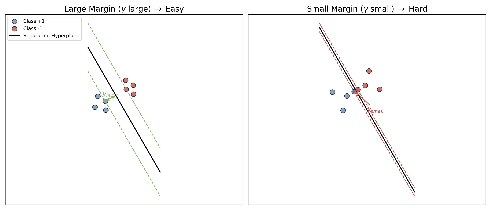
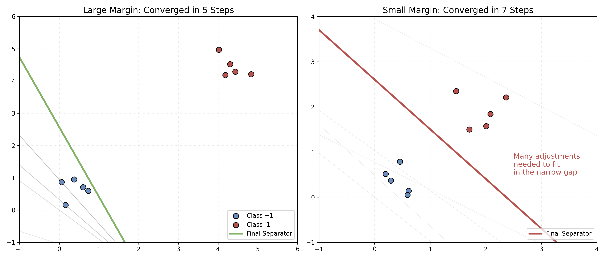
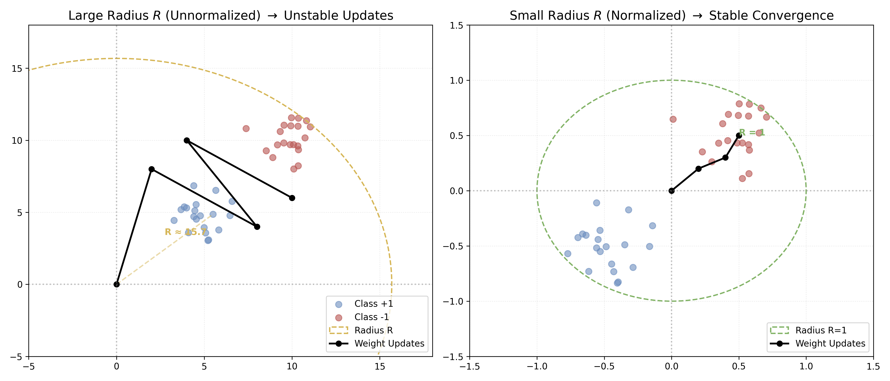

# 附录 A.2 感知机收敛性定理 (Perceptron Convergence Theorem)

本附录为[卷一 1.2 节](../../vol-01/ch01_early_ai_perceptron_connectionism.md#section-1-2)中的感知机学习算法 (PLA) 给出收敛性证明。

Novikoff (1962) 给出了这一经典证明。在下面的有界性、正间隔、更新规则与初始化条件下，感知机在有限次错误更新后得到一个正确分类训练集的超平面。

---

## A.2.1 定理前置假设 (Assumptions)

在开始证明之前，我们需要对问题进行严格的数学定义。

### 1. 线性可分性 (Linear Separability)
假设训练数据集 $D = \{(\mathbf{x}_1, y_1), (\mathbf{x}_2, y_2), ..., (\mathbf{x}_N, y_N)\}$ 是线性可分的。为纳入偏置，定义增广向量 $\tilde{\mathbf x}_i=(\mathbf x_i,1)$ 与 $\tilde{\mathbf w}=(\mathbf w,b)$。下文为简化记号，把这些增广向量仍写成 $\mathbf x_i,\mathbf w$；因此范数、半径和间隔都在**增广空间**中计算。

线性可分意味着存在 $\mathbf{w}^*$，使得对所有样本 $i=1,\ldots,N$：

$$ y_i (\mathbf{w}^{*T} \mathbf{x}_i) > 0 $$

为了方便后续计算，我们可以缩放 $\mathbf{w}^*$ 使得其模长 $\|\mathbf{w}^*\| = 1$，且满足：

$$ y_i (\mathbf{w}^{*T} \mathbf{x}_i) \ge \gamma $$

其中 $\gamma>0$ 是在 $\|\mathbf w^*\|=1$ 归一化下的**增广空间间隔**。它等于增广样本到增广空间决策超平面的欧氏距离下界；当偏置通过常数坐标并入时，不能不加说明地把它称为原输入空间中的几何距离。

### 2. 数据有界性 (Bounded Data)
假设所有输入向量的模长是有界的，即存在一个常数 $R$，使得对所有的样本 $i$：

$$ \|\mathbf{x}_i\| \le R $$

---

## A.2.2 Novikoff 定理 (Novikoff's Theorem)

**定理内容**：
对于线性可分的数据集，感知机学习算法 (PLA) 在从零向量 $\mathbf{w}_0 = \mathbf{0}$ 开始训练时，发生误分类（即权重更新）的总次数 $k$ 满足以下上界：

$$ k \le \left( \frac{R}{\gamma} \right)^2 $$

在上述线性可分、有界增广输入、单位学习率和从零初始化等条件下，算法会在有限次错误更新后停止。上界显式依赖 $R/\gamma$，没有单独的 $N$ 项；数据集规模仍可通过可达到的间隔和半径间接影响该比值。

---

## A.2.3 证明过程 (Proof)

我们通过分析权重向量 $\mathbf{w}_k$ 的两个性质来完成证明。假设第 $k$ 次误分类发生由于样本 $(\mathbf{x}, y)$，我们有更新规则（设学习率 $\eta=1$）：

$$ \mathbf{w}_{k} = \mathbf{w}_{k-1} + y\mathbf{x} $$

### 步骤 1: 寻找 $\mathbf{w}_k$ 与理想向量 $\mathbf{w}^*$ 内积的下界

我们考察 $\mathbf{w}_k$ 在理想方向 $\mathbf{w}^*$ 上的投影长度：

$$
\begin{aligned}
\mathbf{w}_k^T \mathbf{w}^* &= (\mathbf{w}_{k-1} + y\mathbf{x})^T \mathbf{w}^* \\
&= \mathbf{w}_{k-1}^T \mathbf{w}^* + y (\mathbf{x}^T \mathbf{w}^*)
\end{aligned}
$$

根据假设 $y (\mathbf{x}^T \mathbf{w}^*) \ge \gamma$，所以：

$$ \mathbf{w}_k^T \mathbf{w}^* \ge \mathbf{w}_{k-1}^T \mathbf{w}^* + \gamma $$

这是一个递推公式。由于初始权重 $\mathbf{w}_0 = \mathbf{0}$，经过 $k$ 次更新后：

$$ \mathbf{w}_k^T \mathbf{w}^* \ge k \gamma $$

这说明：随着更新次数增加，$\mathbf{w}_k$ 在理想方向上的分量**至少以线性速度增长**。

### 步骤 2: 寻找 $\mathbf{w}_k$ 模长平方的上界

我们考察 $\mathbf{w}_k$ 自身长度的增长情况：

$$
\begin{aligned}
\|\mathbf{w}_k\|^2 &= \|\mathbf{w}_{k-1} + y\mathbf{x}\|^2 \\
&= \|\mathbf{w}_{k-1}\|^2 + \|y\mathbf{x}\|^2 + 2y(\mathbf{w}_{k-1}^T \mathbf{x})
\end{aligned}
$$

这里有两个关键点：
1.  由于是误分类样本，根据定义，预测结果与真实标签相反，即 $y(\mathbf{w}_{k-1}^T \mathbf{x}) \le 0$。因此 $2y(\mathbf{w}_{k-1}^T \mathbf{x}) \le 0$。
2.  $\|y\mathbf{x}\|^2 = y^2 \|\mathbf{x}\|^2 = \|\mathbf{x}\|^2 \le R^2$（因为 $y \in \{+1, -1\}$）。

代入不等式：

$$ \|\mathbf{w}_k\|^2 \le \|\mathbf{w}_{k-1}\|^2 + R^2 $$

同样是一个递推公式。从 $\mathbf{w}_0 = \mathbf{0}$ 开始，经过 $k$ 次更新：

$$ \|\mathbf{w}_k\|^2 \le k R^2 $$

这说明 $\|\mathbf w_k\|^2$ 至多按 $k$ 线性增长，等价地 $\|\mathbf w_k\|\le\sqrt{k}\,R$，所以权重向量的**长度**至多按 $\sqrt{k}$ 增长。

### 步骤 3: 结合两式得出结论

现在我们利用柯西-施瓦茨不等式 (Cauchy-Schwarz Inequality)：

$$ (\mathbf{w}_k^T \mathbf{w}^*)^2 \le \|\mathbf{w}_k\|^2 \|\mathbf{w}^*\|^2 $$

因为我们设定了 $\|\mathbf{w}^*\| = 1$，所以：

$$ (\mathbf{w}_k^T \mathbf{w}^*)^2 \le \|\mathbf{w}_k\|^2 $$

将上面的投影下界与范数上界合并：

$$ (k \gamma)^2 \le \|\mathbf{w}_k\|^2 \le k R^2 $$

$$ k^2 \gamma^2 \le k R^2 $$

两边消去 $k$（假设 $k>0$）：

$$ k \gamma^2 \le R^2 $$

$$ k \le \frac{R^2}{\gamma^2} = \left( \frac{R}{\gamma} \right)^2 $$

**证毕 (Q.E.D.)**

---

## A.2.4 界的解释

错误次数界由无量纲比值 $R/\gamma$ 决定：相对于样本半径更大的分离间隔会给出更紧的上界。不能把 $R$ 和 $\gamma$ 当作彼此独立、可由统一缩放单独改善的量。

1.  **相对间隔**：在半径 $R$ 固定时，更大的可分间隔 $\gamma$ 给出更小的最坏情形错误次数上界；这只是上界，不要求实际运行恰好达到该次数。

2.  **尺度不变性**：若把定理中的所有增广样本统一乘以 $c>0$，则 $R$ 与 $\gamma$ 都乘以 $c$，所以 $R/\gamma$ 和错误次数上界不变。数据归一化或标准化可能改善数值条件、不同坐标尺度和其他优化算法的行为；非均匀特征变换也可能改变间隔比，但不能用“只减小 $R$”从该感知机界推出必然加速。

