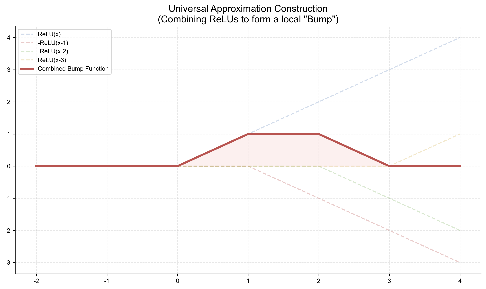

# 附录 A.5 通用逼近定理的严格读法

本附录为卷一第一章的表示能力讨论提供精确版本。通用逼近是函数空间中的**存在性与稠密性**结论；它不提供训练算法、宽度上界、样本复杂度、泛化保证或分布外外推能力。

## A.5.1 函数类与范数

令 $K\subset\mathbb R^d$ 为紧集，$C(K)$ 为 $K$ 上实值连续函数组成的 Banach 空间，范数为

$$
\|f\|_\infty=\sup_{x\in K}|f(x)|.
$$

对激活函数 $\sigma:\mathbb R\to\mathbb R$，定义有限宽单隐层网络类

$$
\mathcal S_\sigma
=\left\{
x\mapsto c+\sum_{j=1}^m a_j\sigma(w_j^\mathsf Tx+b_j):
m<\infty
\right\}.
\tag{A.5.1}
$$

宽度 $m$ 可随目标函数和误差容限变化。偏置 $b_j$ 是定理的重要组成部分。

## A.5.2 两个不能混用的定理版本

**定理 A.5.1（Cybenko，1989）** 取 $K=[0,1]^d$。若 $\sigma$ 连续且 sigmoidal，即

$$
\lim_{t\to-\infty}\sigma(t)=0,
\qquad
\lim_{t\to+\infty}\sigma(t)=1,
$$

则 $\mathcal S_\sigma$ 在 $C(K)$ 中按 $\|\cdot\|_\infty$ 稠密。

**定理 A.5.2（Leshno 等，连续激活的特例）** 若 $K\subset\mathbb R^d$ 紧，$\sigma$ 连续且不是多项式，则 $\mathcal S_\sigma$ 在 $C(K)$ 中按一致范数稠密。反之，若 $K$ 有非空内部且 $\sigma$ 是多项式，则该类不稠密。

ReLU $\sigma(t)=\max(0,t)$ 连续且非多项式，所以由定理 A.5.2 得到普适性；它不满足 Cybenko 定理的有界 sigmoidal 假设。原论文还处理更一般的局部有界、分段连续激活；这里使用足以覆盖正文的连续版本。

两条定理都意味着：对任意 $f\in C(K)$ 与 $\epsilon>0$，存在某个有限 $m$ 和参数，使

$$
\sup_{x\in K}
\left|f(x)-c-\sum_{j=1}^m
a_j\sigma(w_j^\mathsf Tx+b_j)
\right|<\epsilon.
\tag{A.5.2}
$$

它们没有给出满足 (A.5.2) 所需的最小 $m$。

## A.5.3 Cybenko 证明的逻辑闭包

Cybenko 使用下面的判别性引理。

**引理 A.5.3（sigmoidal 函数的判别性）** 若 $\sigma$ 满足定理 A.5.1 的条件，$\mu$ 是 $K=[0,1]^d$ 上有限正则符号 Borel 测度，并且

$$
\int_K\sigma(w^\mathsf Tx+b)\,d\mu(x)=0
\qquad\text{对所有 }w,b,
\tag{A.5.3}
$$

则 $\mu=0$。

**证明** 连续 sigmoidal 函数在 $\mathbb R$ 上有界。先在 (A.5.3) 中取 $w=0$，再选一个满足 $\sigma(b)\ne0$ 的 $b$，得到 $\mu(K)=0$。

固定 $w\ne0$、$b\in\mathbb R$ 和 $\varphi\in\mathbb R$，定义

$$
H^+_{w,b}=\{x\in K:w^\mathsf Tx+b>0\},
\qquad
H^0_{w,b}=\{x\in K:w^\mathsf Tx+b=0\}.
$$

对每个 $\lambda>0$，把 $(\lambda w,\lambda b+\varphi)$ 代入 (A.5.3)。当 $\lambda\to\infty$ 时，被积函数逐点收敛到

$$
\mathbf 1_{H^+_{w,b}}(x)
+\sigma(\varphi)\mathbf 1_{H^0_{w,b}}(x).
$$

由于 $\sigma$ 有界且 $\mu$ 的全变差有限，可对符号测度使用支配收敛定理，得到

$$
0=\mu(H^+_{w,b})
+\sigma(\varphi)\mu(H^0_{w,b}).
\tag{A.5.4}
$$

由 sigmoidal 极限可选 $\varphi_1,\varphi_2$ 使 $\sigma(\varphi_1)\ne\sigma(\varphi_2)$。对这两个值写出 (A.5.4) 并相减，得到 $\mu(H^0_{w,b})=0$；代回即得 $\mu(H^+_{w,b})=0$。所以 $\mu$ 在每个开半空间及其边界超平面上都为零。

对固定 $w\ne0$，令 $\nu_w$ 是映射 $x\mapsto w^\mathsf Tx$ 对 $\mu$ 的推前符号测度。对每个 $a\in\mathbb R$，

$$
\nu_w((a,\infty))
=\mu\{x:w^\mathsf Tx>a\}=0,
$$

且 $\nu_w(\mathbb R)=\mu(K)=0$。集合族 $\{B:\nu_w(B)=0\}$ 是一个 Dynkin 系统，而半直线 $(a,\infty)$ 构成生成 $\mathbb R$ 上 Borel $\sigma$-代数的 $\pi$-系统；由 $\pi$--$\lambda$ 定理，$\nu_w$ 在所有 Borel 集上都为零。

于是对任意 $\xi\in\mathbb R^d$，

$$
\int_K e^{i\xi^\mathsf Tx}\,d\mu(x)=0;
$$

$\xi=0$ 的情形使用 $\mu(K)=0$，其余情形使用 $\nu_\xi=0$。函数 $x\mapsto e^{i\xi^\mathsf Tx}$ 的有限线性组合在 $K$ 上构成含常数、对复共轭封闭且分离点的代数。复 Stone--Weierstrass 定理说明该代数在 $C(K;\mathbb C)$ 中一致稠密。积分泛函对一致范数连续，故它消去所有 $C(K)$ 函数；Riesz--Markov 表示的唯一性遂给出 $\mu=0$。$\square$

**定理 A.5.1 的证明** 设 $\overline{\mathcal S_\sigma}\ne C(K)$。由 Hahn--Banach 分离定理，存在非零有界线性泛函 $L\in C(K)^*$，使 $L(g)=0$ 对所有 $g\in\mathcal S_\sigma$ 成立。由 Riesz--Markov 表示定理，存在非零有限正则符号 Borel 测度 $\mu$，使

$$
L(g)=\int_Kg\,d\mu.
$$

特别地，$L$ 消去每个 ridge function，故 (A.5.3) 成立。引理 A.5.3 推出 $\mu=0$，与 $L\ne0$ 矛盾。因此
$\overline{\mathcal S_\sigma}=C(K)$。$\square$

这给出了判别性引理与稠密性归约的完整证明；支配收敛、$\pi$--$\lambda$、Stone--Weierstrass、Hahn--Banach 与 Riesz--Markov 是所用的测度论和泛函分析先修结果。

## A.5.4 一维 ReLU 的显式构造

一般多维定理是非构造性的。对一维 ReLU，可以直接写出逼近网络。

令 $f\in C([A,B])$。取网格

$$
A=x_0<x_1<\cdots<x_m=B,
$$

并令 $p$ 是连接 $(x_j,f(x_j))$ 的分段线性插值。定义各区间斜率

$$
s_j=\frac{f(x_j)-f(x_{j-1})}{x_j-x_{j-1}},
\qquad j=1,\ldots,m.
$$

则对 $x\in[A,B]$，

$$
p(x)=f(x_0)+s_1(x-x_0)
+\sum_{j=1}^{m-1}(s_{j+1}-s_j)(x-x_j)_+,
\tag{A.5.5}
$$

其中 $(u)_+=\max(0,u)$。在每个节点右侧，新增 ReLU 项恰好把斜率从 $s_j$ 改为 $s_{j+1}$；又因为 (A.5.5) 在 $x_0$ 取值 $f(x_0)$，所以它等于该插值函数。线性项可写成
$x=(x)_+-(-x)_+$，常数由输出偏置表示，故 (A.5.5) 是单隐层 ReLU 网络。

设网格宽度 $h=\max_j(x_j-x_{j-1})$，连续函数的模连续性为

$$
\omega_f(h)=\sup_{|x-y|\le h}|f(x)-f(y)|.
$$

若 $x\in[x_{j-1},x_j]$，$p(x)$ 是两个端点函数值的凸组合，因此

$$
|f(x)-p(x)|\le\omega_f(h).
$$

由紧区间上的一致连续性，$h\to0$ 时 $\omega_f(h)\to0$。这完整证明了一维 ReLU 网络对连续函数的一致逼近。

图中四个 ReLU 铰链函数组成一个梯形折线，是 (A.5.5) 通过斜率增量构造分段线性函数的具体例子；它只说明一维构造机制，不代替判别性引理及其多维稠密性论证。

## A.5.5 必要边界与反例

1. **紧域与范数不可省略。** 在紧集上一致逼近不等于在整个 $\mathbb R^d$ 上以同一误差逼近，也不等于导数或概率分布同时收敛。
2. **偏置不可随意删除。** 若 ReLU 网络没有隐藏偏置和输出偏置，则 $g(0)=0$ 且 $g(\alpha x)=\alpha g(x)$ 对 $\alpha\ge0$ 成立。它不可能在包含原点的紧集上一致逼近常数函数 $1$，因为原点误差恒为 $1$。
3. **多项式激活不普适。** 若 $\sigma$ 是固定次数多项式，则 (A.5.1) 仍是次数有统一上界的多项式空间；在有非空内部的紧集上，这个有限维空间不可能稠密于 $C(K)$。
4. **一维构造不能直接推广为坐标可加式。** $\sum_i g_i(x_i)$ 无法表示一般变量交互；多维结论依赖 ridge functions $\sigma(w^\mathsf Tx+b)$ 的密度定理。
5. **存在不等于可学。** 定理不保证 SGD 找到参数，也不控制噪声下的样本需求。逼近率必须对更具体的函数光滑性、组合结构或频谱假设另行分析。

## A.5.6 来源

- Cybenko, [*Approximation by Superpositions of a Sigmoidal Function*](https://doi.org/10.1007/BF02551274), 1989。
- Hornik, [*Approximation Capabilities of Multilayer Feedforward Networks*](https://doi.org/10.1016/0893-6080(91)90009-T), 1991。
- Leshno et al., [*Multilayer Feedforward Networks with a Nonpolynomial Activation Function Can Approximate Any Function*](https://doi.org/10.1016/S0893-6080(05)80131-5), 1993。
