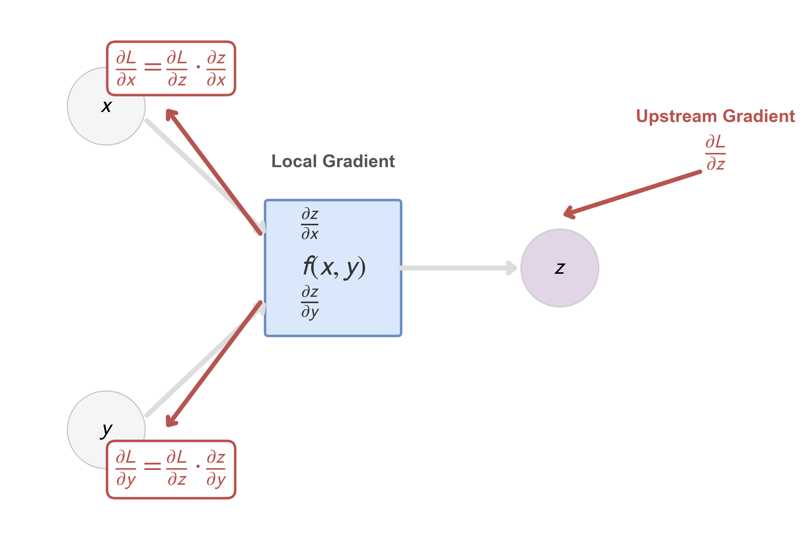
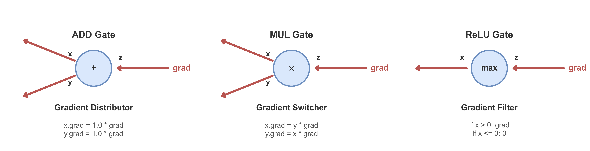

# 附录 A.6 反向传播：微分、形状与批量公式

反向传播是标量损失对计算图执行反向模式自动微分。卷一第二章解释其历史与作用；本附录只固定导数约定，并推导 affine 层和逐元素激活的 batch 公式。卷积与 attention 的专用伴随算子分别见 [A.9](a.9_cnn_backpropagation.md) 和 [A.10](a.10_transformer_math.md)。

## A.6.1 导数约定与反向模式

标量损失记作 $L$。对向量 $x\in\mathbb R^n$，梯度 $\nabla_xL\in\mathbb R^n$ 是列向量，并满足

$$
dL=(\nabla_xL)^\mathsf Tdx.
\tag{A.6.1}
$$

若 $z=f(x)$，Jacobian 采用

$$
J_f(x)=\frac{\partial z}{\partial x}
\in\mathbb R^{\dim z\times\dim x},
$$

则链式法则为

$$
\nabla_xL=J_f(x)^\mathsf T\nabla_zL.
\tag{A.6.2}
$$

反向传播计算的是 Jacobian 转置与上游梯度的乘积，而不是显式物化完整 Jacobian。若一个节点向多个后继分叉，损失微分中会出现各路径贡献之和，所以回到该节点的梯度必须相加。

## A.6.2 单样本 affine 层

取

$$
x\in\mathbb R^{d_{\mathrm{in}}},
\quad
W\in\mathbb R^{d_{\mathrm{out}}\times d_{\mathrm{in}}},
\quad
b,z\in\mathbb R^{d_{\mathrm{out}}},
$$

并令

$$
z=Wx+b.
$$

已知上游梯度 $\delta=\nabla_zL\in\mathbb R^{d_{\mathrm{out}}}$。微分为

$$
dz=(dW)x+W(dx)+db.
$$

代入 $dL=\delta^\mathsf Tdz$：

$$
dL
=\delta^\mathsf T(dW)x
+\delta^\mathsf TW(dx)
+\delta^\mathsf Tdb.
$$

利用迹恒等式
$\delta^\mathsf T(dW)x=\operatorname{tr}((\delta x^\mathsf T)^\mathsf TdW)$，逐项读取梯度：

$$
\boxed{
\nabla_WL=\delta x^\mathsf T,
\qquad
\nabla_bL=\delta,
\qquad
\nabla_xL=W^\mathsf T\delta.}
\tag{A.6.3}
$$

形状分别为 $d_{\mathrm{out}}\times d_{\mathrm{in}}$、$d_{\mathrm{out}}$ 和 $d_{\mathrm{in}}$。任何与这些形状不一致的转置都不能由 broadcasting 自动修正。

## A.6.3 Batch 行主公式

为与卷一 Transformer 章一致，把 batch 或 token 位置放在行上。令

$$
X\in\mathbb R^{B\times d_{\mathrm{in}}},
\qquad
Z=XW^\mathsf T+\mathbf 1_Bb^\mathsf T
\in\mathbb R^{B\times d_{\mathrm{out}}}.
\tag{A.6.4}
$$

令 $G_Z=\partial L/\partial Z$ 与 $Z$ 同形。对 Frobenius 内积
$\langle A,B\rangle_F=\operatorname{tr}(A^\mathsf TB)$，有

$$
dL=\langle G_Z,dZ\rangle_F.
$$

展开 $dZ=(dX)W^\mathsf T+X(dW)^\mathsf T+\mathbf 1_B(db)^\mathsf T$，得到

$$
\boxed{
G_X=G_ZW,
\qquad
G_W=G_Z^\mathsf TX,
\qquad
G_b=G_Z^\mathsf T\mathbf 1_B.}
\tag{A.6.5}
$$

形状核对如下。

| 量 | 形状 |
| --- | --- |
| $X,G_X$ | $B\times d_{\mathrm{in}}$ |
| $Z,G_Z$ | $B\times d_{\mathrm{out}}$ |
| $W,G_W$ | $d_{\mathrm{out}}\times d_{\mathrm{in}}$ |
| $b,G_b$ | $d_{\mathrm{out}}$ |

$G_b$ 对 batch 行求和，因为同一个偏置被所有行共享。若 $L$ 是 batch **均值**，$1/B$ 已包含在 $G_Z$ 中；反传公式本身不应再擅自除一次 $B$。

## A.6.4 逐元素激活与多层递推

设

$$
A^{(0)}=X,
$$

$$
Z^{(\ell)}
=A^{(\ell-1)}(W^{(\ell)})^\mathsf T
+\mathbf 1_B(b^{(\ell)})^\mathsf T,
\qquad
A^{(\ell)}=\sigma_\ell(Z^{(\ell)}),
\tag{A.6.6}
$$

其中激活逐元素作用。给定 $G_{A^{(\ell)}}$，激活的反传是

$$
G_{Z^{(\ell)}}
=G_{A^{(\ell)}}\odot
\sigma_\ell'(Z^{(\ell)}).
\tag{A.6.7}
$$

再由 (A.6.5)，

$$
G_{W^{(\ell)}}
=(G_{Z^{(\ell)}})^\mathsf TA^{(\ell-1)},
$$

$$
G_{b^{(\ell)}}
=(G_{Z^{(\ell)}})^\mathsf T\mathbf 1_B,
$$

$$
G_{A^{(\ell-1)}}
=G_{Z^{(\ell)}}W^{(\ell)}.
\tag{A.6.8}
$$

若第 $\ell-1$ 层还通过残差支路直接影响后续节点，则 (A.6.8) 只是其中一条路径的贡献，必须与残差支路的梯度相加。

对 ReLU，$\sigma'(z)=1$ 当 $z>0$，为 $0$ 当 $z<0$；$z=0$ 不可微，其凸次微分为区间 $[0,1]$。软件必须在该点选择反传约定，常见选择是 $0$；选取区间内的值给出一个次梯度，但不把 ReLU 变成处处可微函数。

图中标量节点只是在局部写出向量--Jacobian 乘积；同一变量经多条支路影响损失时，各支路贡献仍须相加。

## A.6.5 保存、重算与停止梯度

反向公式依赖前向量 $X,Z$ 或 $A$。训练系统可以保存它们，也可以用 gradient checkpointing 在反向时重算；这改变内存与计算量，不改变理想实数算术下的链式法则。

以下操作会改变计算图本身：

- `detach` 或 stop-gradient 把指定路径的 Jacobian 设为零；
- 原地修改若覆盖反向所需的前向值，会使公式失去对应数据；
- 混合精度、量化和非确定性 kernel 会使数值梯度偏离精确实数结果；
- 对广播参数，反向必须沿被广播的轴求和。

有限差分

$$
\frac{L(\theta+he_j)-L(\theta-he_j)}{2h}
$$

可用于小模型梯度核对，但 $h$ 过大有截断误差，过小有浮点消减误差；ReLU 折点附近也不能期待普通中心差分稳定匹配某个软件次梯度约定。

## A.6.6 来源

- Linnainmaa, [*The Representation of the Cumulative Rounding Error of an Algorithm as a Taylor Expansion of the Local Rounding Errors*](https://doi.org/10.1093/comjnl/19.2.171), 1976。反向模式自动微分的早期系统表述。
- Rumelhart, Hinton & Williams, [*Learning Representations by Back-Propagating Errors*](https://doi.org/10.1038/323533a0), 1986。
