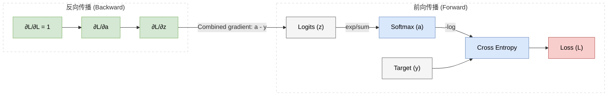

# 附录 A.7 Softmax 与 Cross-Entropy：分类问题中的常见组合

在深度学习的分类任务中，**Softmax 激活函数** 与 **交叉熵 (Cross-Entropy) 损失函数** 经常一起出现。这种组合并非偶然，而是因为它同时给出了概率解释、最大似然目标和简洁的输出层梯度。

本附录说明它们的概率解释、最大似然目标、最大熵推导条件与输出层梯度。

## A.7.1 Softmax：从 Logits 到概率 (From Logits to Probabilities)

神经网络的最后一层线性输出通常被称为 **logits**（$\mathbf z$），其坐标是无约束实数。Softmax 把这些分数映射到概率单纯形内部，从而满足非负与总和为 1 的约束。

### 0. 缺失的一环：为什么是 Logits？ (The Missing Link: Why Logits?)

你可能会问：**既然神经网络在相应条件下能逼近很广的连续函数类，为什么不直接让它输出概率，而是输出 Logits？**

这是一个兼顾约束与优化便利性的参数化选择：
*   **无约束 vs 有约束**：概率向量位于单纯形上。用无约束 logits 再经过 Softmax，可以自动满足非负与归一化约束；网络也可以采用其他受约束参数化，因此这是一种便利而非定理要求。
*   **分工明确**：网络先输出类别分数 $z_i$，Softmax 再把相对分数转换为概率。若采用能量模型记号，通常令 $E_i=-z_i$；未经校准的 logit 大小本身不是可靠置信度。
*   **平滑映射**：Softmax 将无约束 Logits 映射到概率单纯形 (Probability Simplex) 的内部。这里的“映射”不是通常意义下的欧氏正交投影。

$$ \underbrace{\mathbb{R}^K}_{\text{NN Output (Logits)}} \xrightarrow{\text{Softmax}} \underbrace{\Delta^{K-1}}_{\text{Probability Dist.}} $$

因此，Logits 可解释为**未归一化的对数概率**；它们整体加上同一个常数不会改变 Softmax 分布。这是多类 logit/分类模型的一种常用参数化，而不是唯一可能形式。

### 1. 定义与性质
对于一个 $K$ 维向量 $\mathbf{z}$，Softmax 函数定义为：

$$ a_i = \text{Softmax}(\mathbf{z})_i = \frac{e^{z_i}}{\sum_{j=1}^K e^{z_j}} $$

它具有以下关键性质：
*   **归一化 (Normalization)**：$\sum a_i = 1$，这使得输出可以被解释为概率分布。
*   **非负性 (Positivity)**：由于 $e^x > 0$，所以 $a_i > 0$。
*   **相对差值决定概率**：Softmax 保持分数排序，并把 logit 差指数化；分布尖锐程度由差值与温度共同决定，并不必然接近 one-hot。

### 2. 为什么是指数函数 $e^x$？
为什么不用平方、绝对值或者其他正数函数？
*   **指数族视角**：在指定归一化与期望特征约束下，最大熵解属于 Gibbs/指数族并具有 Softmax 形式。若把 $z_i$ 当作分数，则 $p_i\propto e^{\beta z_i}$；若把 $E_i=-z_i$ 当作能量，则是常见的 $p_i\propto e^{-\beta E_i}$。
*   **数学便利性**：指数函数的导数是其自身，归一化后的 Jacobian 具有简洁形式（见后文梯度推导）。

### 3. 补充证明：为什么是最大熵分布？ (Proof of Maximum Entropy)
这是一个带前提的结论：**在给定归一化和指定期望分数（或能量）约束时，熵最大化会导出指数族分布。** 改变约束、似然模型或输出空间，最合适的链接函数也可能改变。

假设有限个离散状态具有给定分数 $z_i$，并且约束值 $m$ 位于这些分数凸包的相对内部，使最优解可以取正概率。我们想找到概率分布 $P$。
*   **目标**：最大化熵 $H(P) = - \sum p_i \log p_i$（在给定约束下不额外集中概率质量）。
*   **约束 1（概率和为 1）**：$\sum p_i = 1$。
*   **约束 2（期望分数固定）**：$\sum p_i z_i = m$（例如观测到某个特征均值）。

我们构建拉格朗日函数：
$$ \mathcal{L} = - \sum p_i \log p_i + \lambda (\sum p_i - 1) + \beta (\sum p_i z_i - m) $$
对 $p_i$ 求偏导并令其为 0：
$$ \frac{\partial \mathcal{L}}{\partial p_i} = - (1 + \log p_i) + \lambda + \beta z_i = 0 $$
$$ \log p_i = \lambda + \beta z_i - 1 $$
$$ p_i = e^{\lambda-1} e^{\beta z_i} \propto e^{\beta z_i} $$
归一化后：
$$ p_i = \frac{e^{\beta z_i}}{\sum e^{\beta z_j}} $$
这就是 Softmax 的形式（$\beta$ 可被吸收到 $z$ 中；采用能量 $E_i=-z_i$ 时得到 $p_i\propto e^{-\beta E_i}$）。若 $m$ 位于可行区间端点，最优分布可能落在单纯形边界，应先限制到相应支持集，或把它理解为 $|\beta|\to\infty$ 的极限。
**结论**：Softmax 可由多类 logit 最大似然或上述最大熵问题导出。这里的“最大熵”只相对于所列约束成立，不能把 Softmax 称为自然界处理一切不确定性的无条件最优解。

## A.7.2 交叉熵：编码代价与负对数似然 (Cross-Entropy)

### 1. 历史与动机：为什么不用 MSE？
在回归问题中，我们常用 **均方误差 (MSE)**：$L = \frac{1}{2}(y - a)^2$。分类中也可以优化 MSE，但 Softmax 交叉熵直接对应分类似然，且其 Logit 梯度通常比 MSE 与饱和输出的组合更直接。
MSE 接在饱和的 Sigmoid/Softmax 后时，logit 梯度还会乘输出链接函数的 Jacobian，可能使纠错信号变小；这不是说分类绝对不能使用 MSE。

### 2. 信息论视角
令 $p$ 表示目标分布，$q$ 表示模型预测。交叉熵和 KL 散度都不是通常意义下的度量距离，因为它们一般不对称，KL 也不满足三角不等式。
*   **KL 散度 (Kullback-Leibler Divergence)**：
    $$ D_{KL}(p || q) = \sum_x p(x) \log \frac{p(x)}{q(x)} = -H(p) + H(p,q) $$
*   **交叉熵 (Cross-Entropy)**：目标分布 $p$ 固定时，$H(p)$ 是常数，因此最小化 $D_{KL}(p\|q)$ 等价于最小化
    $$ H(p, q) = - \sum_{k} y_k \log(a_k). $$

这里 $y_k$ 是真实标签（One-hot，仅在正确类别位置为 1），$a_k$ 是预测概率。公式可简化为：
$$ L = - \log(a_{correct}) $$
即：**最大化正确类别的对数似然**。

## A.7.3 Softmax + Cross-Entropy 的简洁梯度 (Simple Gradient)

Softmax 和 Cross-Entropy 经常一起使用，是因为它们在反向传播时会合并成非常简洁的梯度形式。

### 1. 梯度推导
我们需要求 Loss 对 Logits $z_i$ 的梯度 $\frac{\partial L}{\partial z_i}$。

根据链式法则：
$$ \frac{\partial L}{\partial z_i} = \sum_{k} \frac{\partial L}{\partial a_k} \frac{\partial a_k}{\partial z_i} $$

**(1) Loss 对 $a$ 的导数**：
$$ \frac{\partial L}{\partial a_k} = - \frac{y_k}{a_k} $$

**(2) Softmax 的 Jacobian 矩阵 $\frac{\partial a_k}{\partial z_i}$**：
这是最复杂的一步。根据除法求导法则 $(u/v)' = (u'v - uv')/v^2$：
*   当 $k=i$ 时：
    $$ \frac{\partial a_i}{\partial z_i} = \frac{\partial}{\partial z_i} \left( \frac{e^{z_i}}{\sum e^{z_j}} \right) = \frac{e^{z_i}(\sum e^{z_j}) - e^{z_i}e^{z_i}}{(\sum e^{z_j})^2} = \frac{e^{z_i}}{\sum e^{z_j}} \left( 1 - \frac{e^{z_i}}{\sum e^{z_j}} \right) = a_i(1-a_i) $$
*   当 $k \neq i$ 时：
    $$ \frac{\partial a_k}{\partial z_i} = \frac{\partial}{\partial z_i} \left( \frac{e^{z_k}}{\sum e^{z_j}} \right) = \frac{0 - e^{z_k}e^{z_i}}{(\sum e^{z_j})^2} = - \frac{e^{z_k}}{\sum e^{z_j}} \frac{e^{z_i}}{\sum e^{z_j}} = -a_k a_i $$

**(3) 合并求解**：
将上述两步代入链式法则求和公式：
$$
\begin{aligned}
\frac{\partial L}{\partial z_i} &= \sum_{k} \left( - \frac{y_k}{a_k} \right) \frac{\partial a_k}{\partial z_i} \\
&= \left( - \frac{y_i}{a_i} \right) a_i(1-a_i) + \sum_{k \neq i} \left( - \frac{y_k}{a_k} \right) (-a_k a_i) \\
&= -y_i(1-a_i) + \sum_{k \neq i} y_k a_i \\
&= -y_i + y_i a_i + a_i \sum_{k \neq i} y_k \\
&= -y_i + a_i \underbrace{\left( y_i + \sum_{k \neq i} y_k \right)}_{\text{Sum of all } y_k = 1}
\end{aligned}
$$

### 2. 最终结论：合并后的梯度
$$ \frac{\partial L}{\partial z_i} = a_i - y_i $$
或者写成向量形式：
$$ \boldsymbol{\delta}^{(L)} = \mathbf{a} - \mathbf{y} = \text{Pred} - \text{Target} $$

**直观意义**：
对单个样本且目标权重和为 1 时，Softmax 与交叉熵组合后的 logit 梯度是 **“预测概率减去目标概率”**。

*   **没有额外的 $\sigma'(z)$ 衰减项**：相比“Sigmoid/Softmax 后再接 MSE”的组合，交叉熵会给出更直接的误差信号。只要预测值 $a$ 与真实值 $y$ 有差距，输出层梯度就会反映这个差距；深层部分仍可能受到网络结构和激活函数的影响。

## A.7.4 数值稳定性技巧：Log-Sum-Exp

在工程实现（如 PyTorch/TensorFlow）中，我们通常不会直接计算 $e^{z_i}$，因为当 $z_i$ 很大时（例如 $z_i=1000$），指数会先上溢为无穷，后续归一化还可能产生 NaN。

解决方案是利用 **Log-Sum-Exp** 技巧：
$$ \log\left(\sum e^{z_i}\right) = \log\left(\sum e^{z_i - c} e^c\right) = c + \log\left(\sum e^{z_i - c}\right) $$
通常取 $c = \max(\mathbf{z})$。
这样可以将所有指数项的幂次控制在 0 或负数范围内，从而避免常见的上溢出问题。

这也是为什么深度学习框架推荐直接使用 `torch.nn.CrossEntropyLoss`（它内部集成了 `LogSoftmax` + `NLLLoss` 并做了数值优化），而不是自己手动拼凑 `Softmax` + `log` + `mean` 的原因。
