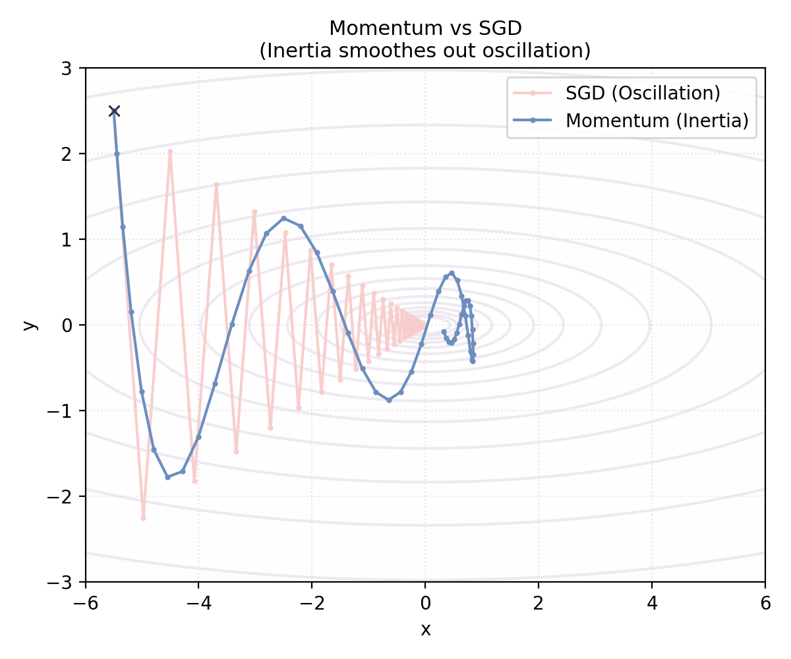
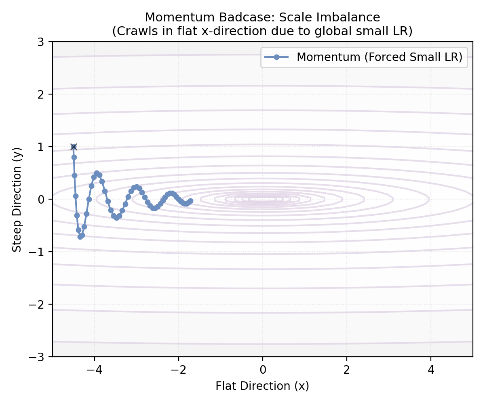
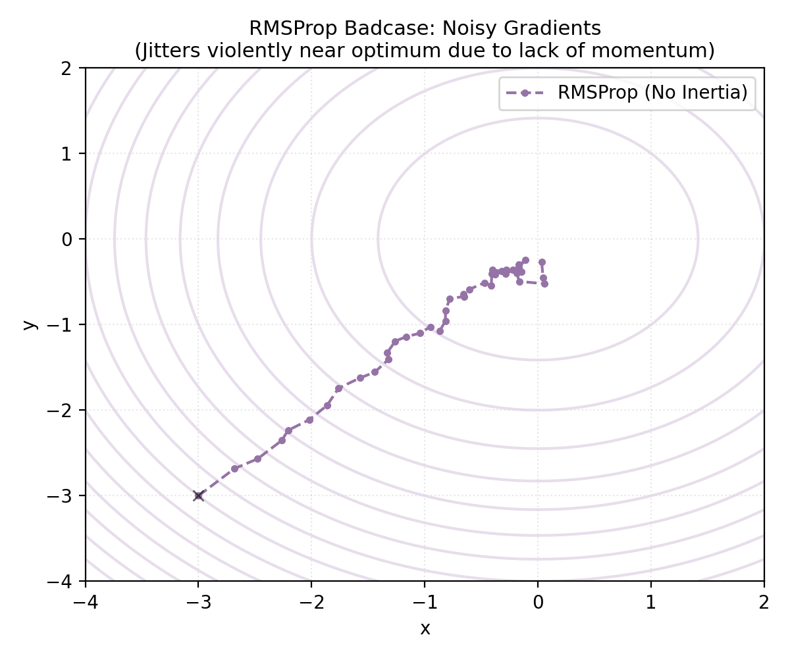
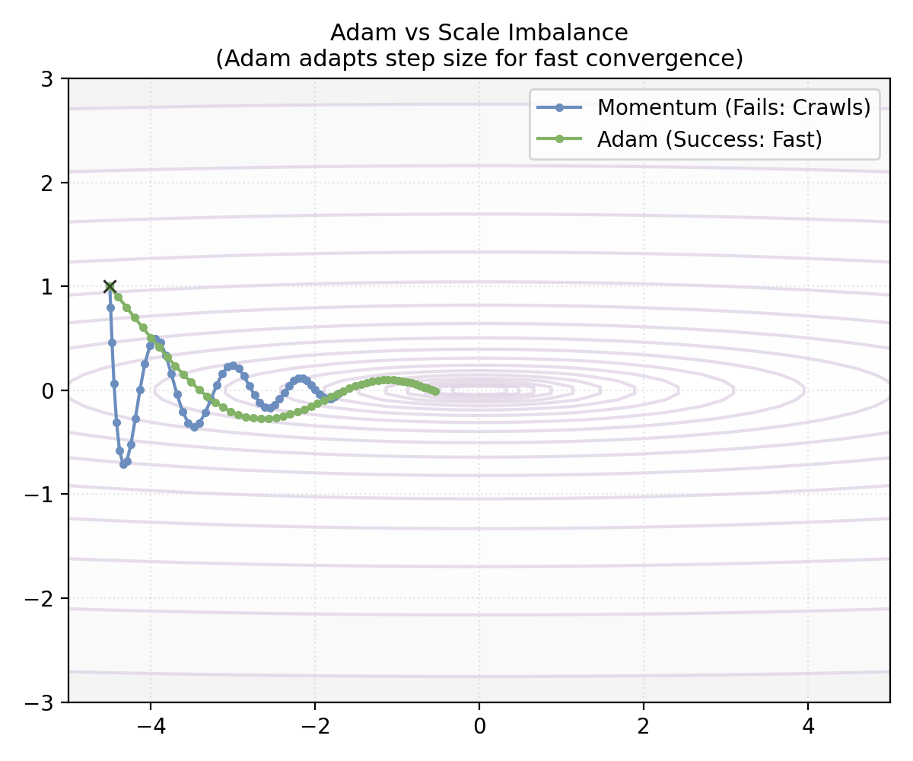
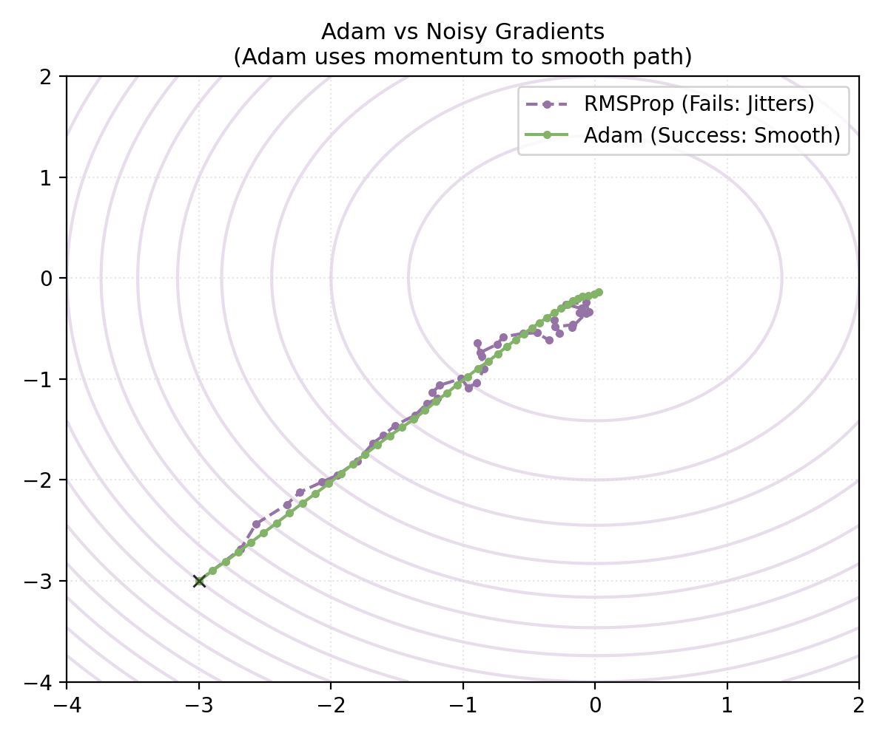

# 附录 A.8 进阶优化算法：从 Momentum 到 Adam

本附录补充动量、逐坐标自适应、Adam 与 AdamW 的更新式。它们处理的主要问题不同，也不存在对所有目标函数都成立的单一优劣次序。

## A.8.1 优化分支一：动量法 (Momentum)

**核心目标**：平滑短期梯度变化，并在某些曲率不均的方向上加快进展。

### 1. 曲率不均与梯度噪声
Plain SGD 的更新方向由当前 mini-batch 梯度决定，常见困难包括：
*   **曲率不均**：在狭长二次型等目标上，陡峭方向的梯度可能反复换号，而平缓方向进展较慢。
*   **随机波动与小梯度区**：mini-batch 噪声会使方向抖动；在平台或鞍点附近，梯度范数较小时进展也可能缓慢。动量能平滑部分波动，但不保证摆脱任意鞍点或局部极小值。

### 2. 解决方案：引入惯性
动量法常用“重球”作直觉：状态变量 $v_t$ 汇总近期梯度，因此一次局部方向变化不会完全决定下一步更新。

**数学形式 (EMA)**：
$$
\begin{aligned}
v_t &= \beta v_{t-1} + (1-\beta) g_t \\
w_{t+1} &= w_t - \eta v_t
\end{aligned}
$$
*   $\beta$ 是动量系数；$0.9$ 是常见起点而非普适最优值。
*   $v_t$ 是梯度的**指数移动平均 (EMA)**。交替变号的分量可能相互抵消，持续同号的分量则会保留；实际效果取决于目标曲率、噪声与 $\beta$。
    *(关于 EMA 的数学原理、有效窗口大小及偏差修正推导，详见本文末尾 [A.8.5 数学工具箱：指数移动平均](#a85-数学工具箱指数移动平均-exponential-moving-average-ema))*

### 3. 效果与局限性
*   **效果**：在下图所用二维目标和超参数下，Momentum（蓝色）比 SGD（红色）呈现更小的纵向震荡与更快的横向进展。

*   **局限性 (Badcase)**：**单一学习率的困境**。
    Momentum 虽然修正了方向，但它对所有参数使用同一个全局学习率 $\eta$。
    **场景**：假设有一个极度拉伸的峡谷（如下图），$y$ 轴极陡（梯度大），$x$ 轴极缓（梯度小）。
    *   如果 $\eta$ 设得大，在 $y$ 轴会爆炸。
    *   如果 $\eta$ 为适应 $y$ 轴而设得较小，$x$ 轴方向的进展可能很慢。
    *   **结果**：如下图蓝色轨迹所示，该组 Momentum 参数抑制了震荡，但在平缓方向移动较慢。

  
   
  <em>图注：在该二维目标与参数设置下，Momentum（蓝色）使用较小学习率后，在平缓方向进展缓慢。</em>

## A.8.2 优化分支二：自适应学习率 (Adaptive Learning Rate)

**核心目标**：解决“步长”问题（应对多尺度差异）。

这一分支从**统计学**和**特征频率**的角度出发，处理高维优化中的尺度差异：不同参数的梯度往往具有不同的稀疏度和量级。对频繁出现、累计梯度较大的坐标，较小步长有助于稳定；对稀疏坐标，较大步长可能更充分地利用有限信号。单一的全局学习率不能独立适配每个坐标的这些差异，这促生了 **自适应学习率（Adaptive Learning Rate）** 这一研究分支。

### 1. 早期尝试：Adagrad
**Adagrad** 的策略是：梯度越大的参数，其后续学习率应越小（阻尼）；梯度越小的参数，其学习率应越大（激励）。
它通过累积**历史梯度的平方和**来调整步长：
$$ s_t = s_{t-1} + g_t^2, \quad w_{t+1} = w_t - \frac{\eta}{\sqrt{s_t + \epsilon}} g_t $$

**机制解析：为什么它能生效？**
*   **自适应缩放**：$s_t$ 位于分母，且随着该坐标历史平方梯度的累积而增大。
    *   **频繁更新的坐标**：$g_t$ 经常非零时，$s_t$ 通常增长较快，对应预条件系数减小。
    *   **稀疏更新的坐标**：$g_t$ 多数时候为零时，$s_t$ 增长较慢，非零梯度到来时可能获得相对较大的步长。这是坐标频率效应，不等价于“稀有特征一定更有信息”。

**局限性**：
逐坐标累积量 $s_t=\sum_{i=1}^t g_i^2$ 单调不减。只有当该坐标的平方梯度和持续发散时，$\sqrt{s_t}\to\infty$，对应的预条件系数 $\eta/\sqrt{s_t+\epsilon}$ 才趋于 0；若梯度最终为零或平方可和，则不能作此结论。即便预条件系数变小，实际更新还要乘当前 $g_t$。在许多深度学习任务中，历史平方梯度的永久累积会使后期步长过小，这是 Adagrad 的常见工程局限，而不是对所有序列的必然“提前停止”。

### 2. 修正方案：RMSProp
**RMSProp** (由 Geoffrey Hinton 在其 Coursera 课程中提出，非正式发表) 在 Adagrad 的基础上引入了 **EMA**（指数移动平均）。它只关注“最近”一段时间的梯度量级，遗忘久远的历史。
$$ s_t = \gamma s_{t-1} + (1-\gamma) g_t^2 $$
$$ w_{t+1} = w_t - \frac{\eta}{\sqrt{s_t + \epsilon}} g_t $$
*   **尺度意义**：$s_t$ 是梯度平方的 EMA，$\sqrt{s_t}$ 因而是近期梯度量级的估计。量级较大的坐标被更强地缩放；这不区分“有用信号”和“噪声”。
*   **参数选择 ($\gamma$)**：$\gamma$ 被称为**衰减率 (Decay Rate)**，$0.9$ 是常见起点。
    *   它控制了历史信息的**遗忘速度**（或称“记忆长度”）。
    *   **数学直觉**：指数移动平均 (EMA) 的有效观测窗口大小约为 $\frac{1}{1-\gamma}$。
        *   若 $\gamma = 0.9$，则 $s_t$ 主要受最近 **10** 步 ($1/(1-0.9)$) 梯度的影响。
        *   若 $\gamma = 0.99$，则窗口扩大到 **100** 步，对瞬间梯度的反应变慢，变化更加平滑。

**机制解析：学习率如何动态变化？**
与 Adagrad 的单调累积不同，RMSProp 的 $s_t$ 使用指数衰减记忆：
*   **当进入剧烈震荡区（梯度大）**：$g_t^2$ 变大，$s_t$ 随之变大，分母变大，学习率自动**减小**（刹车保稳）。
*   **当进入平缓区（梯度小）**：$g_t^2$ 变小，由于 EMA 的遗忘机制，旧的大梯度被遗忘，$s_t$ 随之变小，分母变小，学习率自动**增大**（加速通行）。
因此，早期的大梯度不会永久以相同权重保留，预条件尺度可以随近期梯度统计重新调整。

### 3. 效果与局限性
*   **效果**：回到刚才的尺度失衡场景，RMSProp（紫色实线）根据各坐标的近期平方梯度调整缩放。在该示例中，它减小陡峭方向的更新，并相对保留平缓方向的进展。

  
   
  <em>图注：在该二维目标与超参数设置下，RMSProp 的逐坐标缩放比所示 SGD 轨迹更快；不代表所有任务。</em>

*   **基础公式的局限**：上式只维护平方梯度 EMA，没有 Adam 那样单独维护一阶矩 $m_t$。RMSProp 存在带 momentum 的常见实现，因此不能把“没有惯性”写成算法族的必然属性。Mini-batch 噪声下的轨迹还取决于学习率、$\gamma$、$\epsilon$、momentum 选项与目标曲率；下图只展示一个特定设置。

  
   
  <em>图注：该基础 RMSProp 设置未使用一阶动量，在此噪声示例中出现较明显抖动；不是一般收敛结论。</em>

## A.8.3 Adam：结合一阶矩与二阶矩估计

**核心目标**：同时维护梯度与梯度平方的指数移动平均。

**Adam (Adaptive Moment Estimation)** 同时维护两个状态：

1.  **一阶矩 $m_t$ (Momentum)**：对梯度做 EMA，平滑部分短期波动。
    $$ m_t = \beta_1 m_{t-1} + (1-\beta_1) g_t $$
2.  **二阶原始矩 $v_t$ (RMSProp-like state)**：对逐坐标梯度平方做 EMA，提供自适应缩放。
    $$ v_t = \beta_2 v_{t-1} + (1-\beta_2) g_t^2 $$

3.  **偏差修正 (Bias Correction)**：
    由于 $m_0,v_0$ 初始化为 0，有限步 EMA 的权重和只有 $1-\beta^t$。偏差修正除以这一权重和；在平稳均值等常用假设下，它消除由零初始化带来的乘性缩小，但不对任意非平稳梯度序列提供无偏保证：
    $$ \hat{m}_t = \frac{m_t}{1 - \beta_1^t}, \quad \hat{v}_t = \frac{v_t}{1 - \beta_2^t} $$
    *(关于修正项来源的数学推导，详见本文末尾 [A.8.5 EMA 数学工具箱](#a85-数学工具箱指数移动平均-exponential-moving-average-ema))*

**最终更新**：
$$ w_{t+1} = w_t - \eta \frac{\hat{m}_t}{\sqrt{\hat{v}_t} + \epsilon} $$

### 效果展示：Adam 的典型优势

**1. 对比 Momentum 的痛点（尺度不均）**
在所示长峡谷例子中，Adam 利用 $\sqrt{v_t}$ 做逐坐标缩放，改善了该组超参数下的轨迹；这不是对任意病态目标都优于 Momentum 的保证。

  

**2. 对比 RMSProp 的痛点（噪声抖动）**
在所示噪声例子中，Adam 的一阶矩 EMA 平滑了随机梯度轨迹。EMA 只降低部分高频波动，不保证累积方向始终正确，也不保证一般稳定收敛。

  

## A.8.4 AdamW：权重衰减的修正 (Decoupled Weight Decay)

在 SGD 中，把 L2 penalty 加入损失与按比例衰减参数可给出同一更新；自适应预条件器会破坏这一等价。**AdamW** 明确定义了与梯度预条件解耦的 weight decay，但它不是把 Adam 还原成“真正的 L2 正则化”。

**1) 问题来源：L2 penalty 经过自适应预条件**

**[附录 A.4.3](a.4_regularization.md#a43-优化视角权重衰减与梯度更新-weight-decay-in-optimization)** 说明：对不带自适应预条件的 plain SGD，并使用匹配系数时，**L2 penalty**（Loss 中加罚项）与同步的比例**权重衰减**给出同一更新。加入自适应缩放或某些 momentum 实现后需重新核对更新式。

在 Adam 中，梯度历史会进入一阶、二阶矩状态。若把 L2 penalty 的梯度并入

$$
g_t=\nabla J_{orig}(w_t)+\lambda w_t,
$$

那么 $\lambda w_t$ 也会进入 $m_t$ 与 $v_t$，其作用经过历史依赖的逐坐标预条件。用抽象对角预条件器 $P_t$ 表示这一点，更新可概括为

$$
w_{t+1}\approx w_t-\eta P_t
\bigl(\nabla J_{orig}(w_t)+\lambda w_t\bigr),
$$

而不是 SGD 中固定比例的 $(1-\eta\lambda)w_t$。这里的 $P_t$ 只是解释结构；精确 Adam 更新还包含一阶矩、偏差修正与 $\epsilon$。

因此，在 Adam 中把 L2 penalty 梯度并入 $g_t$，会得到按坐标、依赖历史的 penalty 更新，而不是 SGD 式固定比例衰减。
*   **按坐标预条件的效果**：
    *   **历史平方梯度较大的坐标**：预条件系数通常较小，penalty 分量也受到更强缩放。
    *   **历史平方梯度较小的坐标**：预条件系数通常较大，penalty 分量的相对作用可能更强。
    *   这仍是在优化“原损失 + L2 penalty”，只是其更新不等同于 decoupled weight decay；两者是不同算法选择。

**2) 解决方案：解耦权重衰减 (Decoupling)**

**AdamW (Adam with Weight Decay)** 提出将权重衰减项从梯度更新中**剥离**出来，不再参与 $m_t$ 和 $v_t$ 的计算，也不受自适应缩放的影响，而是直接作用于参数。

**AdamW 更新公式**：
$$ w_{t+1} = \underbrace{w_t - \eta \frac{\hat{m}_t}{\sqrt{\hat{v}_t} + \epsilon}}_{\text{Standard Adam on Loss}} - \underbrace{\eta \lambda w_t}_{\text{Decoupled Weight Decay}} $$

*   第一项：仅使用原始 Loss 的梯度进行自适应更新。
*   第二项：以固定比例 $\eta\lambda$ 衰减参数，并与梯度矩估计解耦。这定义的是 decoupled weight decay，不应改称 L2 penalty。

这种解耦让 weight decay 强度不再经过 Adam 的逐坐标预条件，便于独立调节。AdamW 在 Transformer 等架构中被广泛采用，但收敛速度和泛化效果仍依赖任务、调度、数据与超参数。

## A.8.5 数学工具箱：指数移动平均 (Exponential Moving Average, EMA)

在动量法、RMSProp 和 Adam 中，核心数学组件都是 **EMA**。为什么它被称为“移动平均”？为什么它能代替过去 $N$ 步的平均值？

### 1. 定义与展开
给定序列 $x_1, x_2, \dots$ 和衰减系数 $\beta \in [0, 1)$，EMA 定义为：
$$ v_t = \beta v_{t-1} + (1-\beta) x_t $$
假设 $v_0 = 0$，我们可以将 $v_t$ 展开：
$$
\begin{aligned}
v_t &= (1-\beta) x_t + \beta v_{t-1} \\
    &= (1-\beta) x_t + \beta ((1-\beta) x_{t-1} + \beta v_{t-2}) \\
    &= (1-\beta) \left( x_t + \beta x_{t-1} + \beta^2 x_{t-2} + \dots + \beta^{t-1} x_1 \right)
\end{aligned}
$$
这表明，$v_t$ 是过去所有观测值 $x_i$ 的**加权和**。权重随时间间隔以指数级衰减 ($\beta^k$)。离得越近，权重越大。

### 2. 有效窗口大小 (Effective Window Size)
虽然理论上 EMA 包含了无穷远的历史，但权重衰减得非常快。我们通常借用物理学中**时间常数 (Time Constant)** 的概念，定义权重衰减到初始值的 $\frac{1}{e} (\approx 37\%)$ 时所经历的步数为“有效记忆长度”。

**推导**：
权重 $\beta^k$ 衰减到 $\frac{1}{e}$ 时，经历了多少步？
$$ \beta^k \approx \frac{1}{e} $$
两边取自然对数：
$$ k \ln \beta \approx -1 \implies k \approx \frac{-1}{\ln \beta} $$
利用泰勒展开 $\ln(1-\epsilon) \approx -\epsilon$ (当 $\epsilon \to 0$ 时)，设 $\beta = 1 - \epsilon$：
$$ k \approx \frac{-1}{-\epsilon} = \frac{1}{\epsilon} = \frac{1}{1-\beta} $$
**结论**：EMA 的有效窗口大小约为 **$\frac{1}{1-\beta}$**。

*   **$\beta = 0.9$**：有效窗口 $\approx 10$ 步。
*   **$\beta = 0.999$**：有效窗口 $\approx 1000$ 步。

### 3. 偏差修正 (Bias Correction)
Adam 算法中引入了 $\hat{v}_t = \frac{v_t}{1-\beta^t}$，这是为了解决**零初始化 (Zero Initialization)** 带来的冷启动问题。

**案例直观对比**：
假设我们有一个恒定的梯度序列 $x_t \equiv 1$，衰减系数 $\beta = 0.9$。
*   **真实期望**：平均值应该始终是 **1**。
*   **未修正 EMA ($v_t$)**：
    *   $t=1$: $v_1 = 0.9 \times 0 + 0.1 \times 1 = \mathbf{0.1}$ (严重偏低，只有真实值的 10%)
    *   $t=2$: $v_2 = 0.9 \times 0.1 + 0.1 \times 1 = \mathbf{0.19}$
    *   ... 需要很多步才能爬升到 1。
*   **修正后 EMA ($\hat{v}_t$)**：
    *   $t=1$: 修正系数 $1 - 0.9^1 = 0.1$。在这个常数序列例子里，$\hat{v}_1 = 0.1 / 0.1 = \mathbf{1.0}$，正好恢复真实均值。
    *   $t=2$: 修正系数 $1 - 0.9^2 = 0.19$。$\hat{v}_2 = 0.19 / 0.19 = \mathbf{1.0}$

**修正原理推导**：
我们计算权重的总和。
$$ \sum_{i=0}^{t-1} (1-\beta)\beta^i = (1-\beta) \frac{1-\beta^t}{1-\beta} = 1 - \beta^t $$
因此，将 $v_t$ 除以 $1-\beta^t$ 会把零初始化 EMA 的有限权重和归一化为 1。对常数序列可精确恢复其值；对随机或非平稳序列，它只校正这一个确定性的初始化权重因子，不等价于学习率 warmup，也不保证没有其他优化影响。
